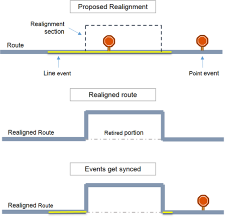
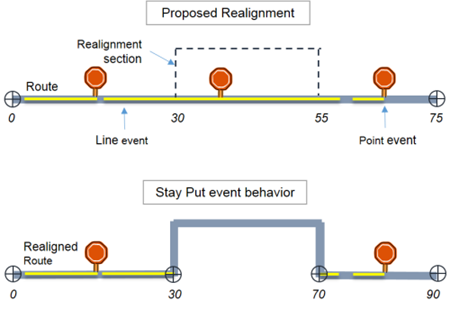
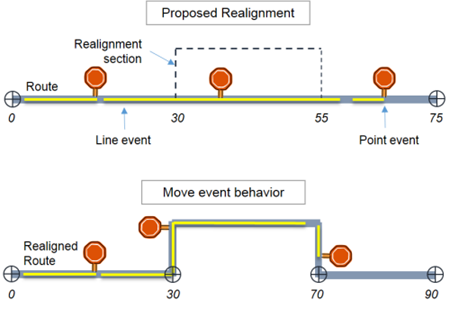
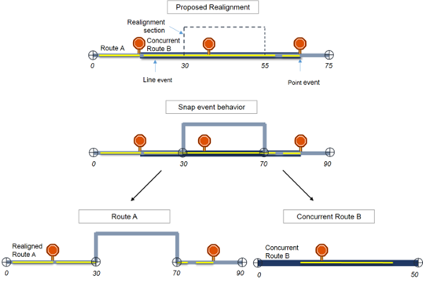
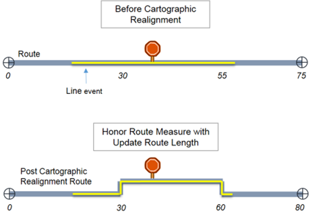
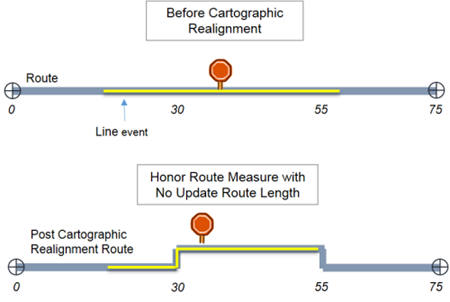
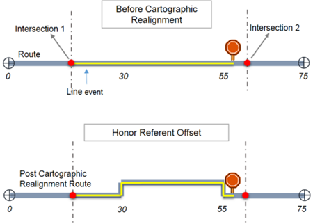

# Event behaviors in ArcGIS Pipeline Referencing

|   |   |
| --- | --- |
| **Kind** | Other · Enterprise |
| **Release** | — |
| **Product** | Pipeline Referencing |
| **Source** | [APRServer_EssentialPipelineReferencingConcepts_EventBehaviors_sinceOct2.docx](<https://esriis.sharepoint.com/sites/LocationReferencing/Shared%20Documents/General/Doc%20Reviews/700_EssentialPipelineReferencingConcepts_EventBehaviors/APRServer_EssentialPipelineReferencingConcepts_EventBehaviors_sinceOct2.docx>) |
| **Edited** | 2024-10-02 21:49 by unknown |
| **Extracted** | 2026-09-04 · lane `xmlstrip` |

<!-- metadata
```yaml
title: "Event behaviors in ArcGIS Pipeline Referencing"
source_file: "APRServer_EssentialPipelineReferencingConcepts_EventBehaviors_sinceOct2.docx"
source_url: "https://esriis.sharepoint.com/sites/LocationReferencing/Shared%20Documents/General/Doc%20Reviews/700_EssentialPipelineReferencingConcepts_EventBehaviors/APRServer_EssentialPipelineReferencingConcepts_EventBehaviors_sinceOct2.docx"
doc_id: 862
doc_kind: "Other"
surface: "Enterprise"
doc_revision: ""
target_release: ""
pe: ""
dev: ""
author: ""
last_edited_by: ""
last_edited: "2024-10-02T21:49:24.6371191Z"
extracted: 2026-09-04
extraction_lane: xmlstrip
prompt_version: "v2.0.2"
keywords: ["event behavior", "pipeline referencing", "route edit", "event measure", "cartographic realignment", "event registration", "event update"]
tools: ["Create LRS Event", "Create LRS Event From Existing Dataset", "Modify Event Behavior Rules", "Apply Event Behaviors"]
products: ["Pipeline Referencing"]
issues: []
related: [{"doc":302,"file":"event-behaviors-in-arcgis-pipeline-referencing__doc302.md","s":8.648},{"doc":382,"file":"event-behavior-for-cartographic-realignment__doc382.md","s":3.468},{"doc":759,"file":"support-event-behaviors-on-vertical-route-shapes-in-calibrate-route__doc759.md","s":2.881},{"doc":383,"file":"event-behavior-for-cartographic-realignment__doc383.md","s":2.753},{"doc":386,"file":"event-behavior-for-cartographic-realignment__doc386.md","s":2.717}]
```
-->

## Summary

This document explains event behavior rules in ArcGIS Pipeline Referencing that define how event measures update in response to LRS route edits. It describes types of event behavior rules such as Stay Put, Move, Retire, Snap, and Cover, and details their effects on events during various route edit activities. The document also covers cartographic realignment behaviors and configuration of event behavior rules.

## Related documents

<!-- related:begin -->
- [Event behaviors in ArcGIS Pipeline Referencing](<https://esriis.sharepoint.com/sites/lrsworkspace/LRS Doc Index/Other/event-behaviors-in-arcgis-pipeline-referencing__doc302.md>) — similar text 0.74 · 3 title words · 6 filename words · same kind/folder <!-- rel:302 -->
- [Event behavior for cartographic realignment](<https://esriis.sharepoint.com/sites/lrsworkspace/LRS Doc Index/Other/event-behavior-for-cartographic-realignment__doc382.md>) — similar text 0.33 · 1 title word · same kind <!-- rel:382 -->
- [Support Event Behaviors on Vertical Route Shapes in Calibrate Route](<https://esriis.sharepoint.com/sites/lrsworkspace/LRS Doc Index/User Stories/support-event-behaviors-on-vertical-route-shapes-in-calibrate-route__doc759.md>) — similar text 0.18 · 2 title words · 1 filename word <!-- rel:759 -->
- [Event behavior for cartographic realignment](<https://esriis.sharepoint.com/sites/lrsworkspace/LRS Doc Index/Other/event-behavior-for-cartographic-realignment__doc383.md>) — similar text 0.31 · 1 title word · same kind <!-- rel:383 -->
- [Event behavior for cartographic realignment](<https://esriis.sharepoint.com/sites/lrsworkspace/LRS Doc Index/Other/event-behavior-for-cartographic-realignment__doc386.md>) — similar text 0.29 · 1 title word · same kind <!-- rel:386 -->
<!-- related:end -->

<!-- docs:begin -->
## Esri documentation

[Create and modify LRS events](https://doc.esri.com/en/arcgis-pro/latest/help/production/location-referencing-pipelines/create-and-modify-lrs-events.html) · [Event behavior](https://doc.esri.com/en/arcgis-pro/latest/help/production/location-referencing-pipelines/what-is-event-behavior.html) · [3D in Pipeline Referencing](https://doc.esri.com/en/arcgis-pro/latest/help/production/location-referencing-pipelines/3d-in-pipeline-referencing.html) · [Configure continuous measure networks and events to update with an engineering network](https://doc.esri.com/en/arcgis-pro/latest/help/production/location-referencing-pipelines/configure-continuous-measure-networks-and-events-to-update-with-an-engineering-network.html) · [Apply cartographic realignment](https://doc.esri.com/en/arcgis-pro/latest/help/production/location-referencing-pipelines/apply-cartographic-realignment.html) · [External event registration](https://doc.esri.com/en/arcgis-pro/latest/help/production/location-referencing-pipelines/external-event-registration.html)

_No page matched:_ [Create LRS Event From Existing Dataset](https://www.google.com/search?q=%22Create%20LRS%20Event%20From%20Existing%20Dataset%22+site%3Adoc.esri.com) · [Modify Event Behavior Rules](https://www.google.com/search?q=%22Modify%20Event%20Behavior%20Rules%22+site%3Adoc.esri.com) · [Apply Event Behaviors](https://www.google.com/search?q=%22Apply%20Event%20Behaviors%22+site%3Adoc.esri.com)
<!-- docs:end -->

---

## Event behaviors
ArcGIS Pipeline Referencing keeps event measures in alignment with LRS route edits. You can configure event behavior rules to define how event measures are updated for each type of route edit.

### What is event behavior?
Events are located along a route in a linear referencing system (LRS) using a location reference, such as a measure distance down a route. Because location is based on the route length, changes in the length have a direct impact on how events will be located and how they are rendered on a map. The impact that changes to the route have on events is called event behavior.
Pipeline Referencing supports multiple ways to locate your event on a route, such as measure on route, reference offset from intersection, stations, feature offsets, offset from another event, or x,y coordinates.
The following diagram is an example of a route being realigned. This route has a line event and a point event located along the route. After a route is edited, the events are updated using the event behavior rules.

### Types of event behavior rules
When an LRS route is edited, behavior rules are applied to the events. By providing the event behavior rules, you decide what the event does when the route changes: preserve location or preserve measure.

| Event behavior rules | Description |
| --- | --- |
| Stay Put | Preserves the geographic location of the event; measures can change |
| Move | Preserves the measure or measures of the event; geographic location can change |
| Retire | Preserves both measure and geographic location; event is retired |
| Snap | Preserves the location of an event by snapping the event to a reassigned or abandoned route; measure or measures can change |
| Cover | Changes both measure and geographic location to make the event go across the entire route |

#### Stay Put
The Stay Put rule preserves the geographic location of the event. When the route is modified, events retain their x,y coordinates. This means event measures will change whenever it is necessary to retain the location.
With Stay Put event behavior, events downstream of an edit section retain their location. The line events that intersect the edit section will be split into two or more events, so the portion unaffected by the route edit will retain its location. Events that are completely contained in the edited section are retired.

In the above example, the upstream events that did not intersect the realignment did not change, where possible. The line event that spans the realignment section gets split into two parts, and the original event is retired. The point event that falls inside the realignment section is retired. The downstream events retain the x,y location.
The table below shows how the Stay Put event behavior updates events for each edit activity.

| Activity | Events upstream | Events in edited section | Events downstream |
| --- | --- | --- | --- |
| Extend Route | No action. | Shape regenerated. | Measures adjusted to retain x,y if recalibrate downstream is checked. |
| Calibrate Route, Reverse Route | Measures adjusted to retain x,y. | Measures adjusted to retain x,y. | Measures adjusted to retain x,y. |
| Realign Route, Realign Overlapping Route | Up to closest upstream calibration point; measures adjusted to retain x,y if needed. | Retire event; line events crossing edit section will be split and the original event is retired. | Measures adjusted to retain x,y if recalibrate downstream is checked. |
| Retire Route, Reassign Route | No action. | Retire event; line events crossing edit section will be split and the original event is retired. | Measures adjusted to retain x,y if recalibrate downstream is checked. |

#### Move
The Move rule preserves the measures of the event. When a route is modified, events retain their measure values. This means x,y coordinates may change.
For example, with Move event behavior, events downstream of a realignment retain their measure, although the location along the route changes.

In the above example, events in the realignment section and downstream keep their measures and their shape is updated per the new route shape.
The table below shows how the Move event behavior updates events for each edit activity.

| Activity | Events upstream | Events in edited section | Events downstream |
| --- | --- | --- | --- |
| Extend Route | No action. | Shape regenerated. | Shape regenerated if recalibrate downstream is checked. |
| Calibrate Route, Reverse Route | Shape regenerated if needed. | Shape regenerated. | Shape regenerated if needed. |
| Realign Route, Realign Overlapping Route, Retire Route, or Reassign Route | Shape regenerated if needed. | Shape regenerated. | Shape regenerated if recalibrate downstream is checked. |

#### Retire
The Retire event behavior preserves both measure and location. When you modify a route, the system flags the event as retired by changing its To Date value to the effective date of the edit if the event is in an impacted region of the route.
The event measures do not change, but the event will no longer be displayed in the current alignment of the highway. If you want to see the event, you must set the event layer's temporal view date (TVD) to a date and time before the edit.

In the above example, the upstream events retained their measure and location, where possible. The line events that fall in the realignment section completely or partially are retired. The point event that falls inside the realignment section is retired. The downstream events are retired as well.
The table below shows how the Retire event behavior updates events for each edit activity.

| Activity | Events upstream | Events in edited section | Events downstream |
| --- | --- | --- | --- |
| Extend Route | No action. | Retire event. | Retire event if recalibrate downstream is checked. |
| Calibrate Route, Reverse Route | Retire event. | Retire event. | Retire event. |
| Realign Route, Realign Overlapping Route | Up to closest upstream calibration point; retire event if needed. | Retire event; line events crossing edit section will not be split. | Retire event if recalibrate downstream is checked. |
| Retire Route, Reassign Route | No action. | Retire event; line events crossing edit section will not be split. | Retire event if recalibrate downstream is checked. |

#### Snap
The Snap event behavior preserves the location of an event by snapping the event to a concurrent route. When the route being edited is concurrent with another route, you may want the event to snap to the concurrent route that is not being edited.
This rule is applied only to Realign Concurrent or Overlapping Route, Reassign Route, and Retire Route edit activity.

In the above example, there is a concurrent route named B. The line event that spans the realignment section is split into three parts. The part that falls exactly in the realigned section is snapped to the concurrent route B. The point event that falls inside the realignment section is snapped to the concurrent route B. Events that are snapped retain their locations, but get updated route references and measures. The last portion of the diagram shows that route A and route B are conceptually separated, to demonstrate how events are snapped to the concurrent route.
Events or event portions that were outside the realignment retain their locations, as they did with the Stay Put event behavior rule.
The table below shows how the Snap event behavior updates events for each edit activity.

| Activity | Events upstream | Events in edited section | Events downstream |
| --- | --- | --- | --- |
| Realign Overlapping Route | Up to closest upstream calibration point; measures adjusted to retain x,y if needed. | Geographic location maintained. If there is no concurrent route, the event will stay put. If there are concurrent routes, the event will be migrated to the dominant route. Line events crossing the edit section will be split. | Measures adjusted to retain x,y if recalibrate downstream is checked. |
| Retire Route | No action. | Geographic location maintained. If there is no concurrent route, the event will stay put. If there are concurrent routes, the event will be migrated to the dominant route. Line events crossing the edit section will be split. | Measures adjusted to retain x,y if recalibrate downstream is checked. |
| Reassign Route | No action. | Geographic location maintained. If there is no concurrent route, the event will stay put. If there are concurrent routes, the event will be migrated to the reassigned route. Line events crossing the edit section will be split. | Measures adjusted to retain x,y if recalibrate downstream is checked. |

### Cartographic Realignment behavior
When performing a cartographic realignment, the two options are Honor Route Measure or Honor Referent Location. These rules apply only to cartographic realignment edit activity.

| Event behavior rules | Description |
| --- | --- |
| Honor Route Measure | Preserves the measure of the event or changes the measure proportionally to the route measure change. |
| Honor Referent Location | Maintains the referent location of the event. |

#### Honor Route Measure
The Honor Route Measure rule either preserves the measure of the event or changes the measure proportionally to the route measure change. This is dependent on the Update route length and recalibrate route based on change in geometry length property in LRS Network properties.
If this property is selected, the event measure changes proportionally to the measure change of the route, and the event shape will be updated to align with the route.

In the above example, since you have the Update route length property selected, the line event's To measure is updated proportionally, and the point event's measure is also updated proportionally. The event's shape is updated to align with the route. This also applies the Calibrate Route event behavior to the section of the route that is recalibrated.
If this property is not selected, the event will preserve its measure, and the event shape will be updated to align with route.

In the above example, since you do not have the Update route length property selected, event shapes are updated to align with the route.

#### Honor Referent Location
The Honor Referent Location rule maintains the referent location of the event. This rule is applied only when you have an event configured to store referent locations.
Note:
If the referent is not valid or not present during event behavior processing, the event measures are used to regenerate the event shape.

In the above example, the line event's From measure is referenced from Intersection 1, and its To measure is referenced from Intersection 2. The point event is referenced from Intersection 2. After cartographic realignment, the event measure is updated to maintain the referent location, and the event's shape is updated to align with the route.

### Factors to consider
In addition to the above event behavior rules, consider the following additional factors to understand event behavior.

#### Recalibrate downstream
Route edits affect the calibration of the route, and during the edit activity, the Pipeline Referencing dialog box prompt you to recalibrate downstream.

As shown in the above example, there are calibration points at measures 0, 50, and 80. You can choose to recalibrate downstream during realignment activity. This will update the calibration of the route after the calibration point at measure 50 until the end of the route.
Due to recalibration, the event behavior you set for Calibrate Route is applied to the recalibrated section.

### Configuration of event behavior rules
Default event behavior is configured during the event registration process when using either the Create LRS Event or Create LRS Event From Existing Dataset tool.
Learn more about creating and modifying LRS events
The following event behavior rules are set by default:

| Activity | Rule |
| --- | --- |
| Calibrate Route | Stay Put |
| Retire Route | Stay Put |
| Extend Route | Stay Put |
| Reassign Route | Stay Put |
| Realign Route | Stay Put |
| Reverse Route | Stay Put |
| Carto Realign Route | Honor Route Measure |

You can review configured event behaviors by viewing LRS event properties. To modify event behavior rules, use the Modify Event Behavior Rules tool.

### Application of event behavior
Event layers reside in the geodatabase that contains your LRS.
Learn more about event types
Events can have event behavior applied after each edit or after a series of edits using the Apply Event Behaviors tool.

        
