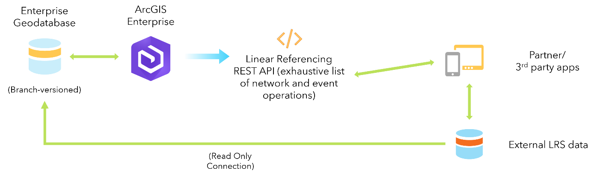

# External Event Registration in ArcGIS Roads and Highways

|   |   |
| --- | --- |
| **Kind** | Other · Pro |
| **Release** | — |
| **Product** | Roads & Highways |
| **Source** | [RH_external_system_registration.docx](<https://esriis.sharepoint.com/sites/LocationReferencing/Shared%20Documents/General/Doc%20Reviews/Pro35_Ent115/6268_ExternalEventConfiguration/RH_external_system_registration.docx>) |
| **Edited** | 2025-01-25 01:41 by unknown |
| **Extracted** | 2026-09-04 · lane `xmlstrip` |

<!-- metadata
```yaml
title: "External Event Registration in ArcGIS Roads and Highways"
source_file: "RH_external_system_registration.docx"
source_url: "https://esriis.sharepoint.com/sites/LocationReferencing/Shared%20Documents/General/Doc%20Reviews/Pro35_Ent115/6268_ExternalEventConfiguration/RH_external_system_registration.docx"
doc_id: 244
doc_kind: "Other"
surface: "Pro"
doc_revision: ""
target_release: ""
pe: ""
dev: ""
author: ""
last_edited_by: ""
last_edited: "2025-01-25T01:41:56.5415689Z"
extracted: 2026-09-04
extraction_lane: xmlstrip
prompt_version: "v2.0.2"
keywords: ["external event", "event registration", "lrs geodatabase", "connection file", "relational database", "event id", "route id", "web services"]
tools: ["Configure External Event With LRS", "Configure External Event Behaviors With LRS"]
products: ["Roads & Highways"]
issues: []
related: [{"doc":243,"file":"external-event-registration-in-arcgis-pipeline-referencing__doc243.md","s":11.504},{"doc":246,"file":"external-system-integration-with-arcgis-roads-and-highways__doc246.md","s":5.093},{"doc":242,"file":"external-system-integration-with-arcgis-pipeline-referencing__doc242.md","s":3.877},{"doc":247,"file":"events-data-model__doc247.md","s":3.374},{"doc":288,"file":"create-external-event-with-no-connection-file__doc288.md","s":2.95}]
```
-->

## Summary

This document explains the two types of external event registration supported by ArcGIS Roads and Highways: events registered with a connection file linking to external databases, and events registered without a connection file. It details the configuration tools, data requirements, and capabilities for managing and updating external events within the LRS geodatabase environment.

## Related documents

<!-- related:begin -->
- [External Event Registration in ArcGIS Pipeline Referencing](<https://esriis.sharepoint.com/sites/lrsworkspace/LRS Doc Index/Other/external-event-registration-in-arcgis-pipeline-referencing__doc243.md>) — similar text 0.92 · 3 title words · 3 filename words · same kind/surface/folder <!-- rel:243 -->
- [External system integration with ArcGIS Roads and Highways](<https://esriis.sharepoint.com/sites/lrsworkspace/LRS Doc Index/Other/external-system-integration-with-arcgis-roads-and-highways__doc246.md>) — similar text 0.34 · 3 title words · 2 filename words · same kind/surface <!-- rel:246 -->
- [External system integration with ArcGIS Pipeline Referencing](<https://esriis.sharepoint.com/sites/lrsworkspace/LRS Doc Index/User Stories/external-system-integration-with-arcgis-pipeline-referencing__doc242.md>) — similar text 0.37 · 1 title word · 2 filename words · same surface <!-- rel:242 -->
- [Events Data Model](<https://esriis.sharepoint.com/sites/lrsworkspace/LRS Doc Index/Other/events-data-model__doc247.md>) — similar text 0.36 · same kind/surface <!-- rel:247 -->
- [Create External Event with No Connection File](<https://esriis.sharepoint.com/sites/lrsworkspace/LRS Doc Index/User Stories/create-external-event-with-no-connection-file__doc288.md>) — similar text 0.28 · 2 title words · 1 filename word · same surface <!-- rel:288 -->
<!-- related:end -->

<!-- docs:begin -->
## Esri documentation

[External event registration](https://doc.esri.com/en/arcgis-pro/latest/help/production/roads-highways/external-event-registration.html)

_No page matched:_ [Configure External Event With LRS](https://www.google.com/search?q=%22Configure%20External%20Event%20With%20LRS%22+site%3Adoc.esri.com) · [Configure External Event Behaviors With LRS](https://www.google.com/search?q=%22Configure%20External%20Event%20Behaviors%20With%20LRS%22+site%3Adoc.esri.com)
<!-- docs:end -->

---

## External event registration
ArcGIS Roads and Highways supports two event registration types: registration of events in the LRS geodatabase and registration of events stored in an external database. Events stored in the LRS geodatabase are stored as feature classes, while Eexternal events can be configured with or without a connection file. With a connection file, the external events are linked to tables or feature classes in an external relational database management system (RDBMS) and stored as feature classes in the LRS geodatabase. Without a connection file, the external events are created directly in the LRS geodatabase.while external events are stored as tables or feature classes in an external relational database management system (RDBMS).

### External events with a connection file
The Configure External Event With LRS tool allows you to connect to and register event data even ifwhen it that is stored and maintained outside the LRS geodatabase. This is important because some event data is traditionally considered to be nonspatial tabular data.
The LRS allows you to set up a read-only connection to external event data sources and use them to visualize tabular data in a spatial way and to spatially integrate your business data with other enterprise data.
Tip:
You can right-click an external event data source in the LRS Hierarchy pane and add it to a map or scene in ArcGIS Pro.
https://prodev.arcgis.com/en/pro-app/3.5/help/projects/add-maps-to-a-project.htm \hLearn more about adding a web map or scene to the project
Learn more about database connections in ArcGIS Pro and setting up a database connection.
The following are data requirements and recommendations for registering an external event with the LRS:

- Must have an Event ID and Route ID
  - The From Route ID and To Route ID fields are required for events that span routes.
  - The Event ID field in external business tables or feature classes must be a text field.
  - Globally unique identifiers (GUID) are read as text.
- Can have a DateTime field
  - If no DateTime field is used, full temporal viewing of event data is not supported.
  - A single effective date can be used, but both from and to dates are recommended.
  - The SQL Server Datetime2 data type is not supported; use the DateTime data type.
- Point events require only one measure field; linear events require two measure fields.
- ArcGIS Roads and Highways supports pushing updates to the external system via web services. Learn more about updating external events (add link to Relocate Event).

(alt: External eEvent configuration with a connection file.)

### External events without a connection file
The Configure External Event Behaviors With LRS (add link) tool allows you to create external events without linking to a source table or feature. This works for scenarios such as when there is limited access to the event data, when event data is not stored as tables in an RDBMS database or as feature layersclasses fromin a geodatabase.
This type of external event is not a feature class, but ArcGIS Roads and Highways still supports updating and maintaining external events via web services.
Tip:
You can right-click an external event data source in the LRS Hierarchy pane to view its properties. However, this type of external event cannot be added to a map or scene in ArcGIS Pro.
You do not need route or event information to configure external events that do not have a connection file. To update external events, provide required route and event information in the web service.
Learn more about updating external events (add link to Relocate Event).

- (alt: External Event configuration without ano connection file.)

 
