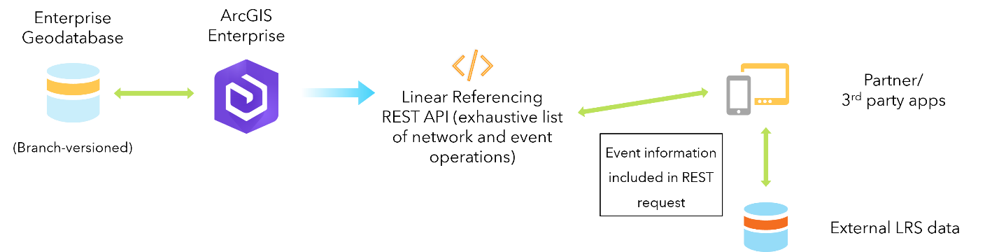

# External system integration with ArcGIS Roads and Highways

| Field | Value |
| --- | --- |
| **Doc** | 246 · Other · Pro |
| **Product** | Roads & Highways |
| **Release** | 3.5 |
| **Issues** | — |
| **Source** | [RH_external_system_integration.docx](<https://esriis.sharepoint.com/sites/LocationReferencing/Shared%20Documents/General/Doc%20Reviews/Pro35_Ent115/5701_ExternalSystemsIntegration/RH_external_system_integration.docx>) |
| **People** | author — · PE — · dev — |
| **Edited** | 2025-01-24 23:22 by Kyle Chin |
| **Extracted** | 2026-09-04 · lane xmlstrip · format 3.0 · prompt v2.0.2 |
| **Keywords** | external event · relocate event · route edits · event synchronization · read only connection · event behavior |
| **Tools** | Configure External Event With LRS · Configure External Event Behaviors With LRS · Relocate Event operation |

## Summary

Describes how ArcGIS Roads and Highways integrates with external event data systems to keep event data synchronized with the linear referencing system. Explains configuration options for external events with or without connection files and details the Relocate Event operation used to identify updates needed to align external event records with the LRS.

## Related documents

<!-- related:begin -->
- [External system integration with ArcGIS Pipeline Referencing](<https://esriis.sharepoint.com/sites/lrsworkspace/LRS Doc Index/User Stories/external-system-integration-with-arcgis-apr.md>) — similar text 0.87 · 3 title words · 3 filename words · same surface/folder <!-- rel:242 s=10.181 -->
- [External Event Registration in ArcGIS Roads and Highways](<https://esriis.sharepoint.com/sites/lrsworkspace/LRS Doc Index/Other/external-event-registration-in-arcgis-rh.md>) — similar text 0.34 · 3 title words · 2 filename words · same kind/surface <!-- rel:244 s=5.093 -->
- [External Event Registration in ArcGIS Pipeline Referencing](<https://esriis.sharepoint.com/sites/lrsworkspace/LRS Doc Index/Other/external-event-registration-in-arcgis-apr.md>) — similar text 0.34 · 1 title word · 2 filename words · same kind/surface <!-- rel:243 s=4.272 -->
- [Support updating External Event configuration](<https://esriis.sharepoint.com/sites/lrsworkspace/LRS Doc Index/User Stories/support-updating-external-event-configuration.md>) — similar text 0.31 · 1 title word · 1 filename word · same surface <!-- rel:744 s=3.51 -->
- [Events Data Model](<https://esriis.sharepoint.com/sites/lrsworkspace/LRS Doc Index/Other/events-data-model-apr.md>) — similar text 0.26 · same kind/folder <!-- rel:245 s=3.24 -->
<!-- related:end -->

<!-- docs:begin -->
## Esri documentation

[External event registration](https://doc.esri.com/en/arcgis-pro/latest/help/production/roads-highways/external-event-registration.html) · [Event behavior](https://doc.esri.com/en/arcgis-pro/latest/help/production/roads-highways/what-is-event-behavior.html)

_No page matched:_ [Configure External Event With LRS](https://www.google.com/search?q=%22Configure%20External%20Event%20With%20LRS%22+site%3Adoc.esri.com) · [Configure External Event Behaviors With LRS](https://www.google.com/search?q=%22Configure%20External%20Event%20Behaviors%20With%20LRS%22+site%3Adoc.esri.com) · [Relocate Event operation](https://www.google.com/search?q=%22Relocate%20Event%20operation%22+site%3Adoc.esri.com)
<!-- docs:end -->

---

## External system integration with ArcGIS Roads and Highways
While ArcGIS Roads and Highways is designed to be an authoritative linear referencing system within an organization, event data from other systems may not be able to be moved into the geodatabase and managed by ArcGIS Roads and Highways. To keep this external data in sync with the LRS as it changes over time, ArcGIS Roads and Highways provides a repeatable pattern to follow so that external systems stay in alignment with the LRS.

### External events
As of ArcGIS Pro 3.5, Yyou can configure external events with or without a connection file.
If the external events in the external system are stored as tables in an RDBMS database or feature layers from a geodatabase, Tthe first step in the process to connect an external system with ArcGIS Roads and Highways is to establish a read-only connection to the external system using the  Configure External Event With LRS tool. This allows ArcGIS Roads and Highways to see the route and measure information for the external event data from the source table or feature. As the routes are edited in the LRS over time and event behaviors are applied to events within the geodatabase, ArcGIS Roads and Highways keeps a record of these edits to support pushing the updates out to the external system when it's ready to sync with ArcGIS Roads and Highways.
(alt: External Event configuration with a connection file.)
You can also configure external events without linking to a source table or feature layer by using the Configure External Event Behaviors With LRS (add link) tool. This creates an external event without any route, event or measure information. ArcGIS Roads and Highways also supports pushing the updates from route edits out to this type of external events.
(alt: External Event configuration with no connection file.)
Refer to Relocation Event operation below for steps of syncing the two types of external events with ArcGIS Roads and Highways.

### Relocate Event operation
Whoever PE taking the new relocate event user story will make changes to this section. If the external event has connection file VS. not where users need to put in route info of the new type of external events in Relocate Events.
The Relocate Event operation is used to initiate the sync process to determine the updates in the LRS that should be shared with the external event system. You can call the Relocate Event operation as frequently as you want to sync the external event configured with the LRS. When the operation is called, the route edits that have occurred within the LRS since the last time the tool ran are gathered by ArcGIS Roads and Highways.  Comparing these route edits with the route and measure information from the external event, the operation determines which of these events would need to be updated to stay in alignment with the LRS. The Relocate Event operation then provides this updated information to the external event system so it can make the updates to the records.
Note:
The Relocate Event operation does not update the data in the external system. It provides a comprehensive list of event record updates that would need to be made by the external system to keep the event records aligned with the LRS.

