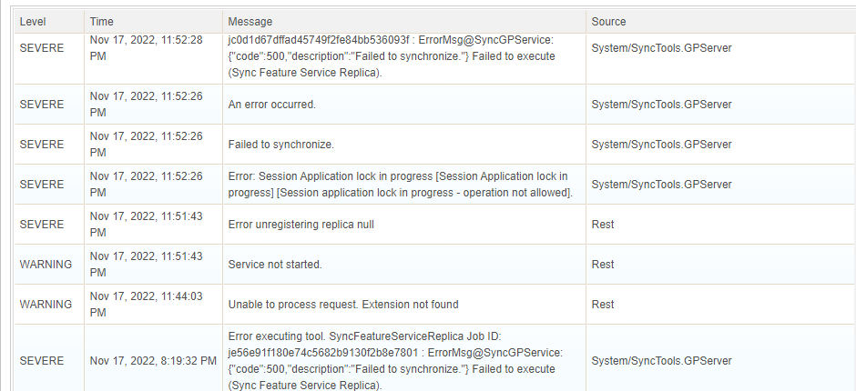
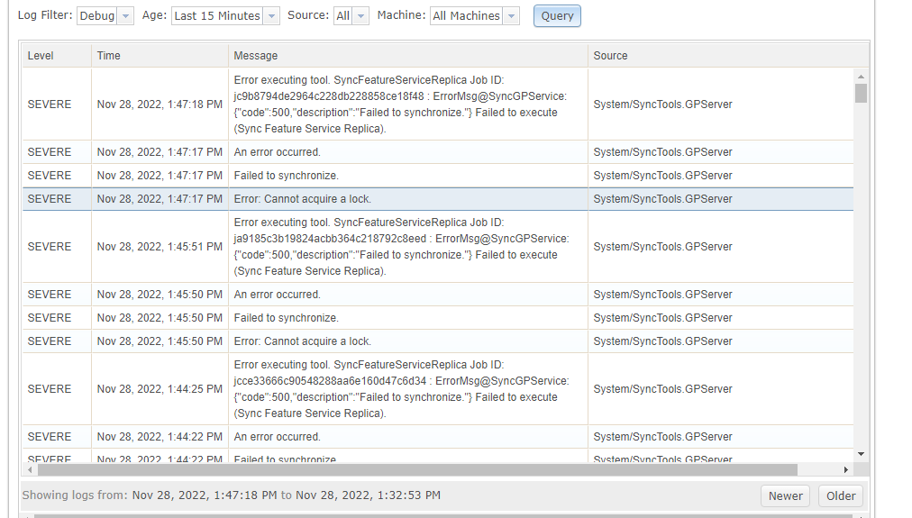

# Field Maps and Sync Service Issues and Workflow Notes

|   |   |
| --- | --- |
| **Kind** | Other · Enterprise |
| **Release** | — |
| **Source** | [SyncServiceNotes.docx](<https://esriis.sharepoint.com/sites/LocationReferencing/Shared%20Documents/General/SyncServiceNotes.docx>) |
| **Edited** | 2023-02-09 21:50 by Johum Khushk |
| **Extracted** | 2026-09-04 · lane `xmlstrip` |

<!-- metadata
```yaml
title: "Field Maps and Sync Service Issues and Workflow Notes"
source_file: "SyncServiceNotes.docx"
source_url: "https://esriis.sharepoint.com/sites/LocationReferencing/Shared%20Documents/General/SyncServiceNotes.docx"
doc_id: 616
doc_kind: "Other"
surface: "Enterprise"
doc_revision: ""
target_release: ""
pe: ""
dev: ""
author: "Johum Khushk"
last_edited_by: "Johum Khushk"
last_edited: "2023-02-09T21:50:54Z"
extracted: 2026-09-04
extraction_lane: xmlstrip
prompt_version: "v2.0.2"
keywords: ["field maps", "sync service", "route edit", "offline area", "version management", "sync failure", "workflow"]
tools: []
products: []
issues: []
related: [{"doc":646,"file":"integrate-lrs-into-sync-service-to-support-disconnected-event-editing-workflows__doc646.md","s":6.22},{"doc":645,"file":"support-conflict-prevention-in-sync-service__doc645.md","s":3.895},{"doc":642,"file":"spike-sync-service-automation-pattern__doc642.md","s":3.305},{"doc":875,"file":"esri-roads-and-highways-tutorial__doc875.md","s":1.906},{"doc":494,"file":"enterprise-installed-help-documentation-index__doc494.md","s":1.832}]
```
-->

## Summary

This document contains notes and observations about issues and workflows related to syncing edits in Field Maps with the Sync Service and enterprise geodatabase versions. It highlights challenges with route edits, sync failures, error messages, version management, and testing difficulties. The document also includes requests for improvements and follow-ups with the Field Maps and enterprise teams.

## Related documents

<!-- related:begin -->
- [Integrate LRS into Sync Service to support disconnected event editing workflows](<https://esriis.sharepoint.com/sites/lrsworkspace/LRS Doc Index/User Stories/integrate-lrs-into-sync-service-to-support-disconnected-event-editing-workflows__doc646.md>) — similar text 0.21 · 2 title words · 2 filename words · same surface/folder <!-- rel:646 -->
- [Support Conflict Prevention in Sync Service](<https://esriis.sharepoint.com/sites/lrsworkspace/LRS Doc Index/User Stories/support-conflict-prevention-in-sync-service__doc645.md>) — similar text 0.15 · 2 title words · 2 filename words · same surface/folder <!-- rel:645 -->
- [Spike: Sync Service Automation Pattern](<https://esriis.sharepoint.com/sites/lrsworkspace/LRS Doc Index/Design Spikes/spike-sync-service-automation-pattern__doc642.md>) — similar text 0.12 · 2 title words · 2 filename words · same folder <!-- rel:642 -->
- [Esri Roads and Highways Tutorial](<https://esriis.sharepoint.com/sites/lrsworkspace/LRS%20Doc%20Index/Other/esri-roads-and-highways-tutorial__doc875.md>) — similar text 0.08 · same kind/folder <!-- rel:875 -->
- [Enterprise Installed Help Documentation Index](<https://esriis.sharepoint.com/sites/lrsworkspace/LRS Doc Index/Other/enterprise-installed-help-documentation-index__doc494.md>) — similar text 0.01 · same kind/surface <!-- rel:494 -->
<!-- related:end -->

---

Email today and follow-up with the meeting invite, Categorize the stuff and reach out to Chris Dunn, most critical – least Critical.
Notes:

- How to undo an edit in field maps, there is no clear way? if I make a route edit, then delete that edit from the list the sync fails and user cannot sync any other edit because route edit is still present in the list – try not to make route layer un editable – Discuss with field maps team
- If event id is not provided it will be populated after sync.
- Very difficult to add rid for routes – follow-up with the field maps team to make workflow better
- The workflow for specifying measures on a route is not what user would expect to do for line events -  known limitation
- Very hard to log a bug and provide screen shots for the bug because field maps app is in my physical device :/
- Sometimes syncing with AEB only few records slow/ takes time, imagine syncing 1000 of records will take xxx time! How to benchmark it? – Document when it takes a while and follow up with field maps team
- Field map + Offline area error messages are not very clear for user – Discuss with the appropriate team In case of failed offline area creation version is still created which clutters . IF user deletes an area it should automatically should delete associated version.
- Version name has a lot of numbers which makes it difficult for the user to recognize which version he/she posted the changes in. Provide feedback to enterprise / gdb team –
- In field maps, layer names are difficult to recognize when there are too many layers- When there are multiple layers it’s challenging because of limited space in mobile device. There is a workaround for this one so may be leave this point.
- One of the annoying things about field maps app that once sync fails the error it gives are very generic and to trouble shoot either you must view logs in field maps app or check server manager to troubleshoot.
- Would be super helpful if I could have a dedicated resource from field maps + sync service enterprise team. There were countless hours when there were numerous random issues that I had to trouble shoot.
- No way to find out which offline area created which version.
- No way to see a list of edits that were syncd once sync was complete – enhancement request for field maps team
- Would be helpful if I PE knew how field maps do there testing of their app, our team could have used a similar work flow...(emulator  vs app), various challenges to test an app e.g. I can’t connect to the phone VPN today
- IF there are 100s of edits in an offline map and sync fails, what should a user do? Discuss with field maps team , found a workflow to extract the edits in case sync fails https://support.esri.com/en/technical-article/000012460
- Today 11/29, sync was taking 10-15 min just for 1 edit.
- I could have used fiddler for trouble shooting if I were using emulator for testing.
- The workflow of cleaning replicas+ associated version is not very efficient / straight forward
- The way I am / PE verifying the result is that I sync and then in Pro replica version I try to verify the result. The challenge with this verification workflow is that it creates a lock on the version and then sync fails, discuss with field maps team.

 
