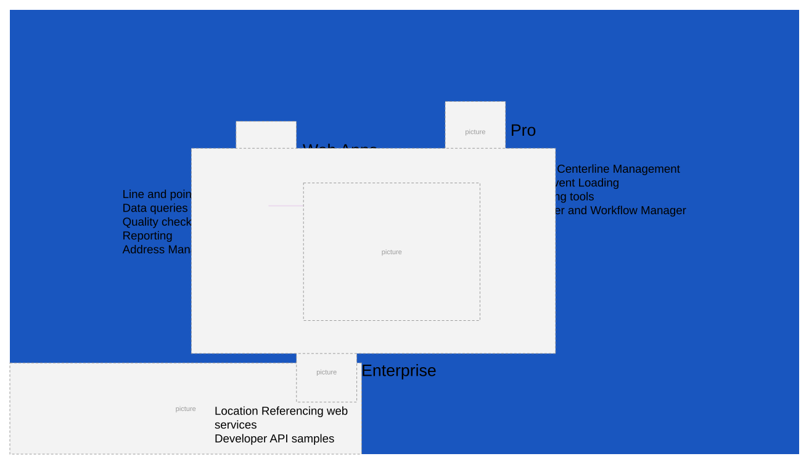
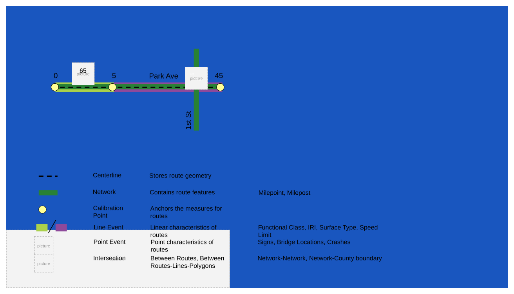
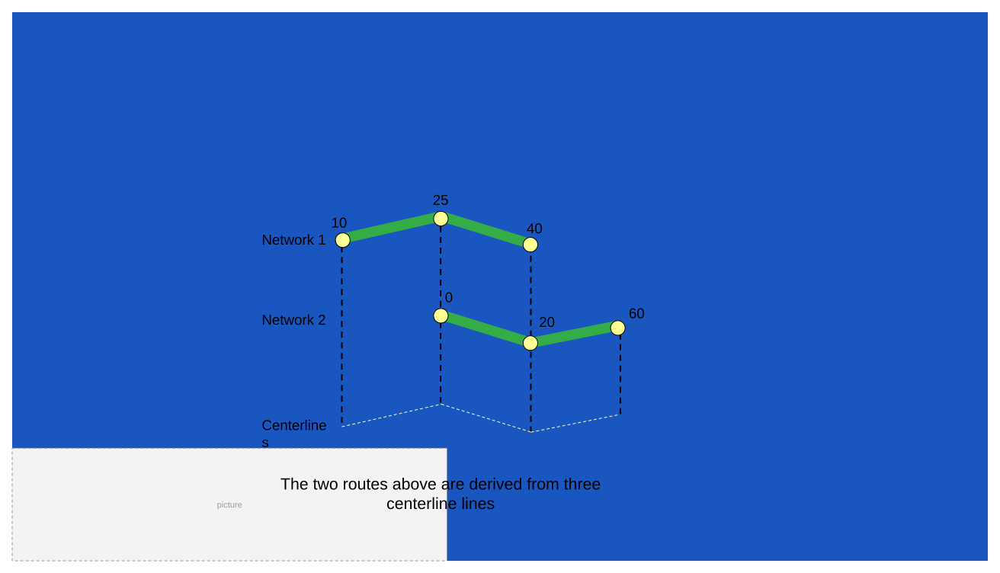
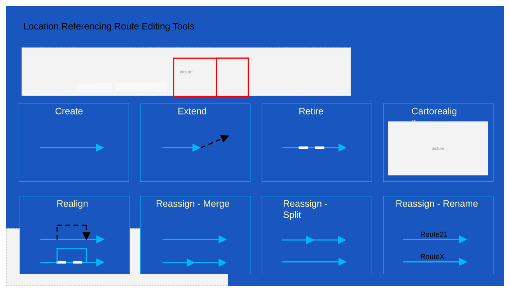
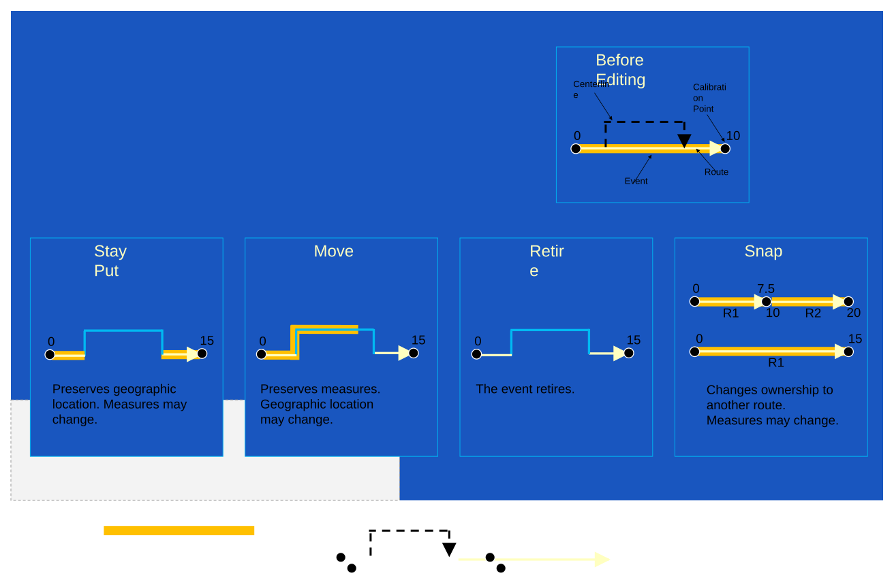
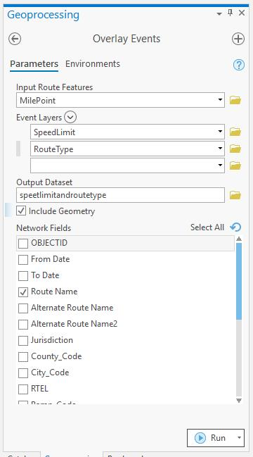
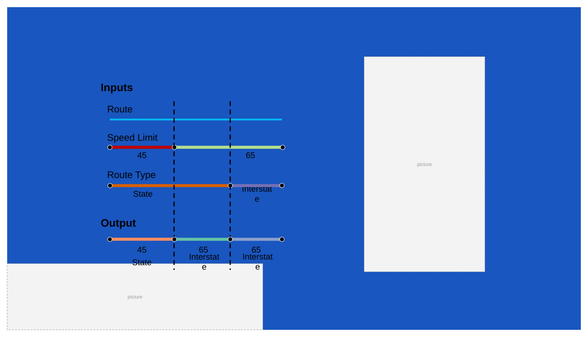
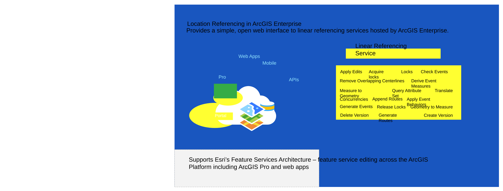
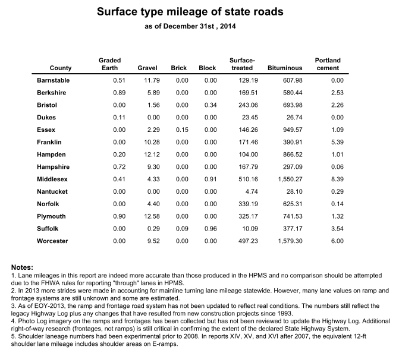
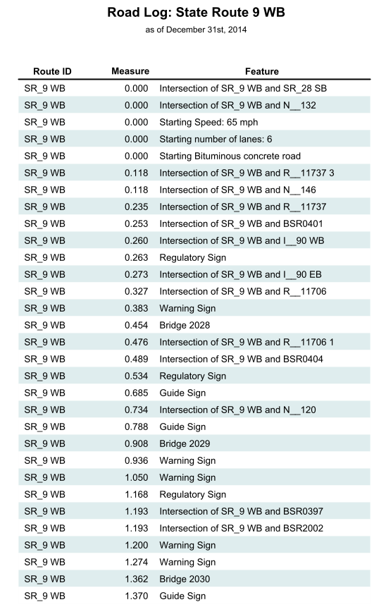

# Location Referencing for transportation across the ArcGIS Platform

| Field | Value |
| --- | --- |
| **Doc** | 788 · Other · Pro |
| **Product** | Roads & Highways |
| **Release** | — |
| **Issues** | — |
| **Source** | [RH_Intro.pptx](<https://esriis.sharepoint.com/sites/LocationReferencing/Shared%20Documents/UC%202020%20prep%20for%20RH/RH_Intro.pptx>) |
| **People** | author — · PE — · dev — |
| **Edited** | 2020-07-08 17:14 by unknown |
| **Extracted** | 2026-09-04 · lane xmlstrip · format 3.0 · prompt v2.0.2 |
| **Keywords** | route editing · event behaviors · overlay events · event editing · address management · network management · centerline · geoprocessing tools |
| **Tools** | Overlay Events · Location Referencing Service · Event Editor · Roadway Reporter |

## Summary

Overview of location referencing capabilities across the ArcGIS platform including network and centerline management, route and event loading, geoprocessing tools, and web services. Covers route editing tools, event behaviors, overlay events geoprocessing, event editing in web apps, reporting via Roadway Reporter, and address management using Roads and Highways.

## Related documents

<!-- related:begin -->
- [Location Referencing for transportation across the ArcGIS Platform](<https://esriis.sharepoint.com/sites/lrsworkspace/LRS Doc Index/Other/lr-for-transportation-across-the-arcgis-platform-rh-2020-07.md>) — similar text 0.66 · 3 title words · 1 filename word · same kind/surface/folder <!-- rel:787 s=6.392 -->
- [Pipeline Referencing Across the ArcGIS Platform](<https://esriis.sharepoint.com/sites/lrsworkspace/LRS Doc Index/Other/apr-across-the-arcgis-platform.md>) — similar text 0.37 · 2 title words · same kind/folder <!-- rel:784 s=3.771 -->
- [ArcGIS Pipeline Referencing: An Introduction](<https://esriis.sharepoint.com/sites/lrsworkspace/LRS Doc Index/Other/arcgis-apr-an-introduction-apr-un.md>) — similar text 0.38 · same kind/surface/folder <!-- rel:785 s=3.196 -->
- [ArcGIS Pipeline Referencing: An Introduction](<https://esriis.sharepoint.com/sites/lrsworkspace/LRS%20Doc%20Index/Other/arcgis-apr-an-introduction-rh-apr-un.md>) — similar text 0.26 · 1 filename word · same kind/surface <!-- rel:885 s=2.955 -->
- [Roads and Highways and Pipeline Referencing Enhancements](<https://esriis.sharepoint.com/sites/lrsworkspace/LRS Doc Index/Other/5671-rh-and-apr-enhancements.md>) — similar text 0.10 · same kind/surface <!-- rel:408 s=2.038 -->
<!-- related:end -->

<!-- docs:begin -->
## Esri documentation

[Event behavior](https://doc.esri.com/en/arcgis-pro/latest/help/production/roads-highways/what-is-event-behavior.html) · [Event editing using the attribute table](https://doc.esri.com/en/arcgis-pro/latest/help/production/roads-highways/event-editing-using-the-attribute-table.html) · [Manage address and roadway characteristic data together](https://doc.esri.com/en/arcgis-pro/latest/help/production/roads-highways/manage-address-and-roadway-characteristic-data-together.html) · [Manage Pipeline Referencing and a utility network together](https://doc.esri.com/en/arcgis-pro/latest/help/production/location-referencing-pipelines/manage-pipeline-referencing-and-a-utility-network-together.html) · [Merge centerlines](https://doc.esri.com/en/arcgis-pro/latest/help/production/roads-highways/merge-centerlines.html)

_No page matched:_ [Overlay Events](https://www.google.com/search?q=%22Overlay%20Events%22+site%3Adoc.esri.com) · [Location Referencing Service](https://www.google.com/search?q=%22Location%20Referencing%20Service%22+site%3Adoc.esri.com) · [Event Editor](https://www.google.com/search?q=%22Event%20Editor%22+site%3Adoc.esri.com) · [Roadway Reporter](https://www.google.com/search?q=%22Roadway%20Reporter%22+site%3Adoc.esri.com)
<!-- docs:end -->

---

## Slide 1 — Location Referencing for transportation across the ArcGIS Platform

Pro

- Network and Centerline Management
- Route and Event Loading
- Geoprocessing tools
- Data Reviewer and Workflow Manager included

Enterprise

- Location Referencing web services
- Developer API samples

Web Apps

- Line and point event editing
- Data queries
- Quality checks
- Reporting
- Address Management

## Slide 2 — Building blocks of a location referencing system

| Type | Description | Examples |
| --- | --- | --- |
|  |  |  |
|  |  |  |
|  |  |  |
|  |  |  |
|  |  |  |
|  |  |  |

Anchors the measures for routes

Linear characteristics of routes

Functional Class, IRI, Surface Type, Speed Limit

Point characteristics of routes

Signs, Bridge Locations, Crashes

Between Routes, Between Routes-Lines-Polygons

Network-Network, Network-County boundary

style.visibilitystyle.visibilitystyle.visibilitystyle.visibilitystyle.visibilitystyle.visibilitystyle.visibilitystyle.visibilitystyle.visibilitystyle.visibilitystyle.visibility
[figure: Park Ave · 0 · 5 · 45 · 1 st St · 1 st · Park · 65 · Centerline · Stores route geometry · Network · Contains route features · Milepoint, Milepost · Calibration Point · Line Event · Point Event · Intersection]

## Slide 3 — Multi-LRM Support

Route features are generated from centerline geometry and calibration point measures
The two routes above are derived from three centerline lines

[figure: 10 · 25 · 40 · 0 · 20 · 60 · Network 1 · Network 2 · Centerlines]

## Slide 4 — Location Referencing Route Editing Tools

style.visibilitystyle.visibilitystyle.visibilitystyle.visibilitystyle.visibilitystyle.visibilitystyle.visibilitystyle.visibilitystyle.visibilitystyle.visibilitystyle.visibilitystyle.visibilitystyle.visibilitystyle.visibilitystyle.visibilitystyle.visibilitystyle.visibilitystyle.visibilitystyle.visibilitystyle.visibilitystyle.visibility
[figure: Extend · Retire · Realign · Reassign - Merge · Reassign - Split · Reassign - Rename · RouteX · Route21 · Create · Cartorealign]

## Slide 5 — Event Behaviors After route edits, measure behavior rules can be applied to events

Preserves geographic
location. Measures may change.

Preserves measures.
Geographic location may change.

Changes ownership to another route. Measures may change.

style.visibilitystyle.visibilitystyle.visibilitystyle.visibility
[figure: Before Editing · Centerline · Event · Route · Calibration Point · 0 · 10 · Stay Put · 15 · Move · Retire · The event retires. · Snap · 7.5 · 20 · R1 · R2]

## Slide 6 — Geoprocessing Tools – Overlay Events

[figure: Inputs · Route · Route Type · State · Interstate · Speed Limit · 45 · 65 · Output]

## Slide 7 — Location Referencing in ArcGIS Enterprise

Provides a simple, open web interface to linear referencing services hosted by ArcGIS Enterprise.

Remove Overlapping Centerlines

Linear Referencing Service
Supports Esri’s Feature Services Architecture – feature service editing across the ArcGIS Platform including ArcGIS Pro and web apps

[figure: Generate Routes · Create Version · Derive Event Measures · Translate · Release Locks · Apply Edits · Geometry to Measure · Acquire locks · Generate Events · Append Routes · Concurrencies · Apply Event Behaviors · Measure to Geometry · Query Attribute Set · Delete Version · Locks · Check Events · Portal · Web Apps · Pro · APIs · Mobile]

## Slide 8 — Event Editor: Event Editing in the web

- Editing
  - Lines and Points events
  - Event Attributes
  - Selection
  - Select by route, attribute, geometry, proximity
  - Single layer results or attribute sets
  - Quality Control
  - Gaps, overlaps, invalid measures
  - Data Reviewer batch checks

## Slide 9 — Roadway Reporter

Reporting available across the enterprise from a web application

Mileage Report
Mileages for routes and events
Segment Report
Dynamically segment event layers into one record set
Road Log Report
Logging events that occur  in measure order when traversing a route
style.visibilitystyle.visibilitystyle.visibilitystyle.visibilitystyle.visibilitystyle.visibilitystyle.visibilitystyle.visibilitystyle.visibilitystyle.visibilitystyle.visibilitystyle.visibilitystyle.visibilitystyle.visibilitystyle.visibilitystyle.visibilitystyle.visibility

## Slide 10 — Address Management

Managing address information using Roads and Highways

Editing

- Add/Edit Block Ranges
- Add/Edit Site Address Points
- Add Master Street Names
Quality Control

- Fishbone Diagrams
- Data Reviewer Batch Checks

