# Location Referencing for transportation across the ArcGIS Platform

| Field | Value |
| --- | --- |
| **Doc** | 787 · Other · Pro |
| **Product** | Roads & Highways |
| **Release** | — |
| **Issues** | — |
| **Source** | [RH_Intro_Full.pptx](<https://esriis.sharepoint.com/sites/LocationReferencing/Shared%20Documents/UC%202020%20prep%20for%20RH/RH_Intro_Full.pptx>) |
| **People** | author — · PE — · dev — |
| **Edited** | 2020-07-08 17:12 by unknown |
| **Extracted** | 2026-09-04 · lane xmlstrip · format 3.0 · prompt v2.0.2 |
| **Keywords** | location referencing · route editing · event behaviors · geoprocessing tools · rest api · event editing · quality control · address management |
| **Tools** | Append Routes · Generate Calibration Points · Append Events · Apply Event Behaviors · Delete Routes · Derive Event Measures · Generate Events · Generate Intersections · Generate Routes · Overlay Events · Remove Overlapping Centerlines · Translate Event Measures |

## Summary

Overview of location referencing capabilities across the ArcGIS platform including network and centerline management, route and event loading, geoprocessing tools, web services, and web app functionalities. Covers multi-LRM support, route editing tools, event behaviors, geoprocessing tools for LRS configuration and event overlay, REST API, event editing in web, event location methods, quality control checks, attribute sets, reporting, and address management.

## Related documents

<!-- related:begin -->
- [Location Referencing for transportation across the ArcGIS Platform](<https://esriis.sharepoint.com/sites/lrsworkspace/LRS Doc Index/Other/lr-for-transportation-across-the-arcgis-platform-rh-2020-07-2.md>) — similar text 0.66 · 3 title words · 1 filename word · same kind/surface/folder <!-- rel:788 s=6.392 -->
- [ArcGIS Pipeline Referencing: An Introduction](<https://esriis.sharepoint.com/sites/lrsworkspace/LRS Doc Index/Other/arcgis-apr-an-introduction-apr-un.md>) — similar text 0.49 · 1 filename word · same kind/surface/folder <!-- rel:785 s=5.709 -->
- [Pipeline Referencing Across the ArcGIS Platform](<https://esriis.sharepoint.com/sites/lrsworkspace/LRS Doc Index/Other/apr-across-the-arcgis-platform.md>) — similar text 0.42 · 2 title words · same kind/folder <!-- rel:784 s=5.254 -->
- [Regression Testing Task List V1](<https://esriis.sharepoint.com/sites/lrsworkspace/LRS Doc Index/Test Plans/regression-testing-task-list-v1.md>) — similar text 0.19 · same surface <!-- rel:115 s=3.815 -->
- [Location Referencing GP Error Messages](<https://esriis.sharepoint.com/sites/lrsworkspace/LRS Doc Index/Other/3147-lr-gp-error-messages.md>) — similar text 0.12 · same kind/surface <!-- rel:39 s=3.587 -->
<!-- related:end -->

<!-- docs:begin -->
## Esri documentation

[Set Location Referencing options](https://doc.esri.com/en/arcgis-pro/latest/help/production/roads-highways/set-location-referencing-options.html) · [Event behavior](https://doc.esri.com/en/arcgis-pro/latest/help/production/roads-highways/what-is-event-behavior.html) · [Event editing using the attribute table](https://doc.esri.com/en/arcgis-pro/latest/help/production/roads-highways/event-editing-using-the-attribute-table.html) · [Manage address and roadway characteristic data together](https://doc.esri.com/en/arcgis-pro/latest/help/production/roads-highways/manage-address-and-roadway-characteristic-data-together.html)

_No page matched:_ [Append Routes](https://www.google.com/search?q=%22Append%20Routes%22+site%3Adoc.esri.com) · [Generate Calibration Points](https://www.google.com/search?q=%22Generate%20Calibration%20Points%22+site%3Adoc.esri.com) · [Append Events](https://www.google.com/search?q=%22Append%20Events%22+site%3Adoc.esri.com) · [Apply Event Behaviors](https://www.google.com/search?q=%22Apply%20Event%20Behaviors%22+site%3Adoc.esri.com) · [Delete Routes](https://www.google.com/search?q=%22Delete%20Routes%22+site%3Adoc.esri.com) · [Derive Event Measures](https://www.google.com/search?q=%22Derive%20Event%20Measures%22+site%3Adoc.esri.com) · [Generate Events](https://www.google.com/search?q=%22Generate%20Events%22+site%3Adoc.esri.com) · [Generate Intersections](https://www.google.com/search?q=%22Generate%20Intersections%22+site%3Adoc.esri.com) · [Generate Routes](https://www.google.com/search?q=%22Generate%20Routes%22+site%3Adoc.esri.com) · [Overlay Events](https://www.google.com/search?q=%22Overlay%20Events%22+site%3Adoc.esri.com) · [Remove Overlapping Centerlines](https://www.google.com/search?q=%22Remove%20Overlapping%20Centerlines%22+site%3Adoc.esri.com) · [Translate Event Measures](https://www.google.com/search?q=%22Translate%20Event%20Measures%22+site%3Adoc.esri.com)
<!-- docs:end -->

---

## Slide 1 — Location Referencing for transportation across the ArcGIS Platform

Pro

- Network and Centerline Management
- Route and Event Loading
- Geoprocessing tools
- Data Reviewer and Workflow Manager included

Enterprise

- Location Referencing web services
- Developer API samples

Web Apps

- Line and point event editing
- Data queries
- Quality checks
- Reporting
- Address Management

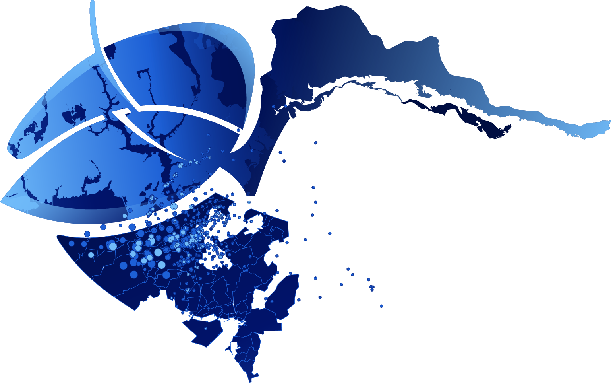

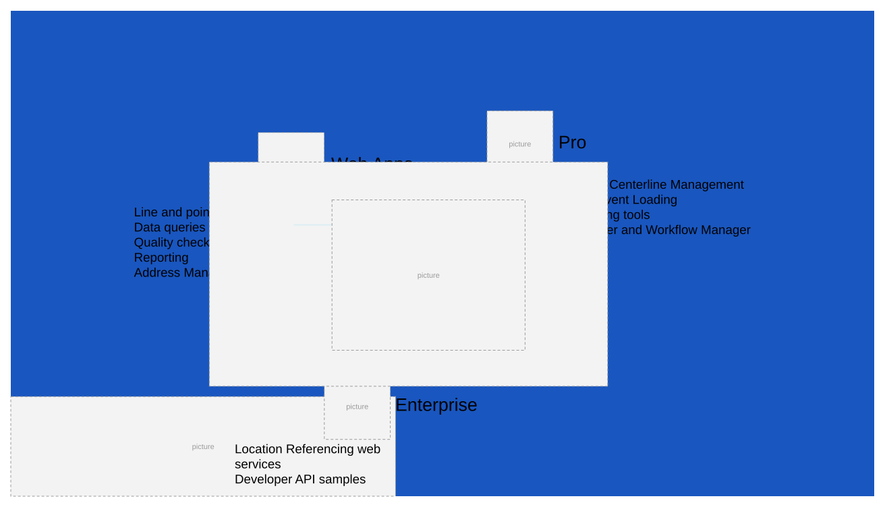

## Slide 2 — Building blocks of a location referencing system

| Type | Description | Examples |
| --- | --- | --- |
|  |  |  |
|  |  |  |
|  |  |  |
|  |  |  |
|  |  |  |
|  |  |  |

Anchors the measures for routes

Linear characteristics of routes

Functional Class, IRI, Surface Type, Speed Limit

Point characteristics of routes

Signs, Bridge Locations, Crashes

Between Routes, Between Routes-Lines-Polygons

Network-Network, Network-County boundary

style.visibilitystyle.visibilitystyle.visibilitystyle.visibilitystyle.visibilitystyle.visibilitystyle.visibilitystyle.visibilitystyle.visibilitystyle.visibilitystyle.visibility
[figure: Park Ave · 0 · 5 · 45 · 1 st St · 1 st · Park · 65 · Centerline · Stores route geometry · Network · Contains route features · Milepoint, Milepost · Calibration Point · Line Event · Point Event · Intersection]

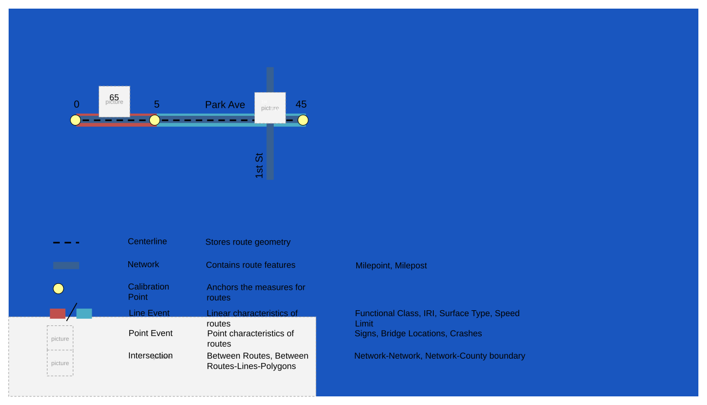

## Slide 3 — Multi-LRM Support

Route features are generated from centerline geometry and calibration point measures
The two routes above are derived from three centerline lines

[figure: 10 · 25 · 40 · 0 · 20 · 60 · Network 1 · Network 2 · Centerlines]

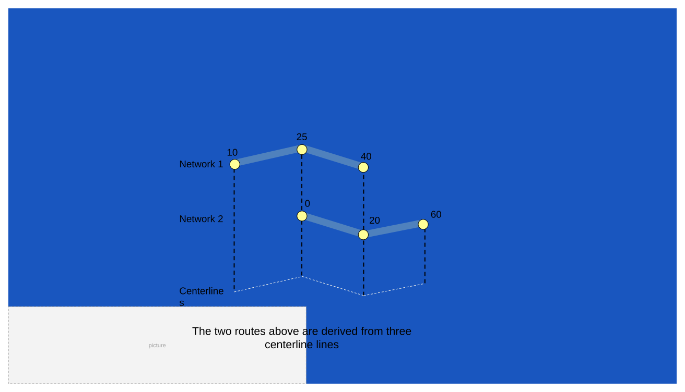

## Slide 4 — Location Referencing Route Editing Tools

style.visibilitystyle.visibilitystyle.visibilitystyle.visibilitystyle.visibilitystyle.visibilitystyle.visibilitystyle.visibilitystyle.visibilitystyle.visibilitystyle.visibilitystyle.visibilitystyle.visibilitystyle.visibilitystyle.visibilitystyle.visibilitystyle.visibilitystyle.visibilitystyle.visibilitystyle.visibilitystyle.visibility
[figure: Extend · Retire · Realign · Reassign - Merge · Reassign - Split · Reassign - Rename · RouteX · Route21 · Create · Cartorealign]

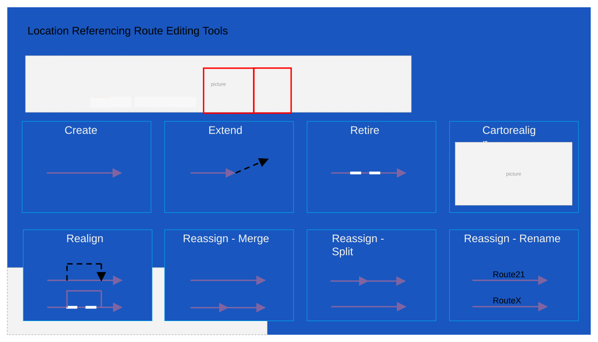

## Slide 5 — Event Behaviors After route edits, measure behavior rules can be applied to events

Preserves geographic
location. Measures may change.

Preserves measures.
Geographic location may change.

Changes ownership to another route. Measures may change.

style.visibilitystyle.visibilitystyle.visibilitystyle.visibility
[figure: Before Editing · Centerline · Event · Route · Calibration Point · 0 · 10 · Stay Put · 15 · Move · Retire · The event retires. · Snap · 7.5 · 20 · R1 · R2]

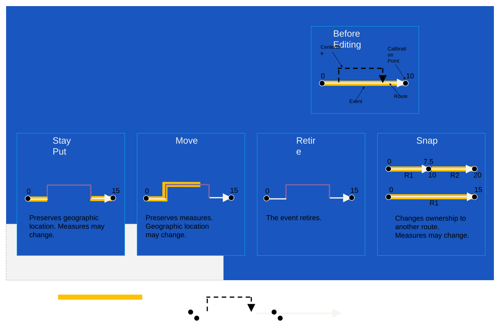

## Slide 6 — Geoprocessing Tools

- Configuration
  - LRS
  - LRS Event
  - LRS Intersection
  - LRS Network
  - Remove LRS Entity
- Append Routes
- Generate Calibration Points
- Append Events
- Apply Event Behaviors
- Delete Routes
- Derive Event Measures
- Generate Events
- Generate Intersections
- Generate Routes
- Overlay Events
- Remove Overlapping Centerlines
- Translate Event Measures

Data Loading

## Slide 7 — Geoprocessing Tools

- Configuration
  - LRS
  - LRS Event
  - LRS Intersection
  - LRS Network
  - Remove LRS Entity
- Append Routes
- Generate Calibration Points
- Append Events
- Apply Event Behaviors
- Delete Routes
- Derive Event Measures
- Generate Events
- Generate Intersections
- Generate Routes
- Overlay Events
- Remove Overlapping Centerlines
- Translate Event Measures

Transformations

## Slide 8 — Geoprocessing Tools – Overlay Events

style.visibility
[figure: Inputs · Route · Route Type · State · Interstate · Speed Limit · 45 · 65]

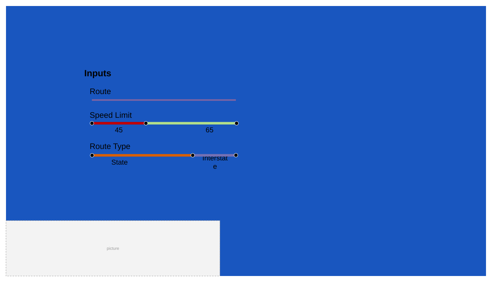

## Slide 9 — Geoprocessing Tools – Overlay Events

[figure: Inputs · Route · Route Type · State · Interstate · Speed Limit · 45 · 65]

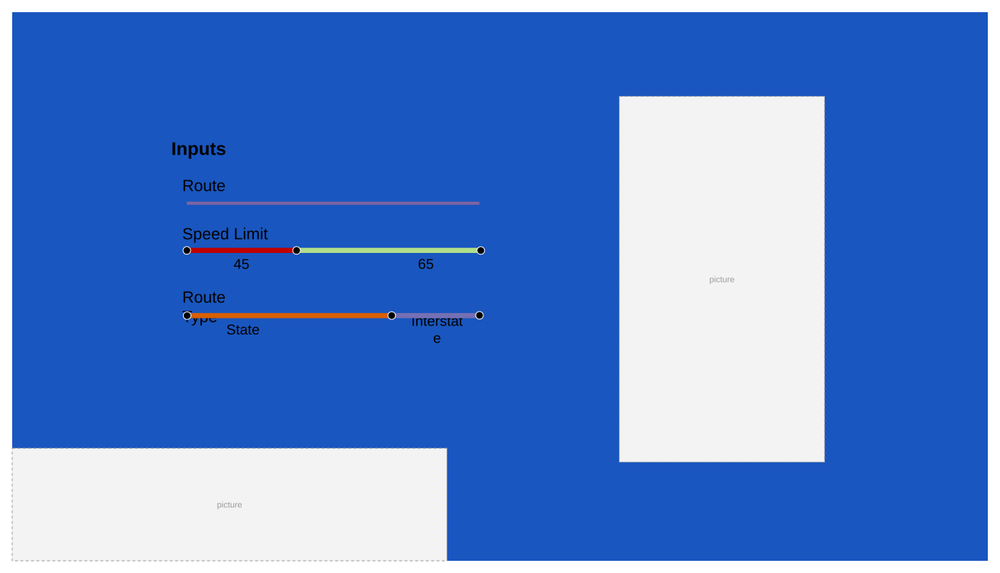

## Slide 10 — Geoprocessing Tools – Overlay Events

[figure: Inputs · Route · Route Type · State · Interstate · Speed Limit · 45 · 65 · Output]

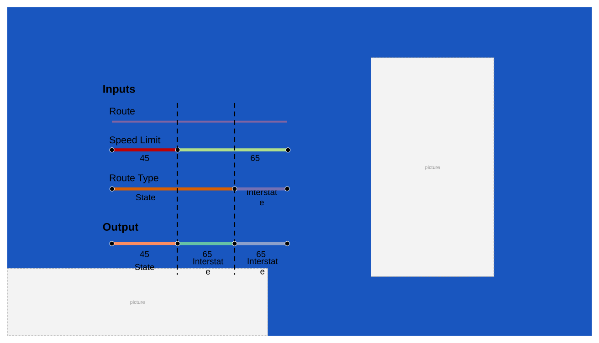

## Slide 11 — Location Referencing in ArcGIS Enterprise

Provides a simple, open web interface to linear referencing services hosted by ArcGIS Enterprise.

Remove Overlapping Centerlines

Linear Referencing Service
Supports Esri’s Feature Services Architecture – feature service editing across the ArcGIS Platform including ArcGIS Pro and web apps

[figure: Generate Routes · Create Version · Derive Event Measures · Translate · Release Locks · Apply Edits · Geometry to Measure · Acquire locks · Generate Events · Append Routes · Concurrencies · Apply Event Behaviors · Measure to Geometry · Query Attribute Set · Delete Version · Locks · Check Events · Portal · Web Apps · Pro · APIs · Mobile]

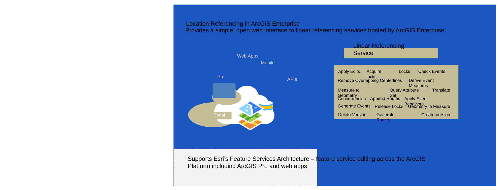

## Slide 12 — Location Referencing REST API

http://esriurl.com/RHREST

http://esriurl.com/LRWIGET

- REST API developer guide
- Sample LRS-enabled services
- Sample web apps
- Web AppBuilder samples

## Slide 13 — Event Editor: Event Editing in the web

- Editing
  - Lines and Points events
  - Event Attributes
  - Selection
  - Select by route, attribute, geometry, proximity
  - Single layer results or attribute sets
  - Quality Control
  - Gaps, overlaps, invalid measures
  - Data Reviewer batch checks

## Slide 14 — Event Location Methods

Route and measure
Event:
1.27 miles

Event:
456+25.00

Stationing
Event:
300 feet from US Highway 10
Intersections
US Highway 10 crossing

Referent and offset

  - Intersections
  - Events
  - Features
Event:
45 feet from cell tower
Cell Tower location:
34.0547,117.1825

Coordinates and offset

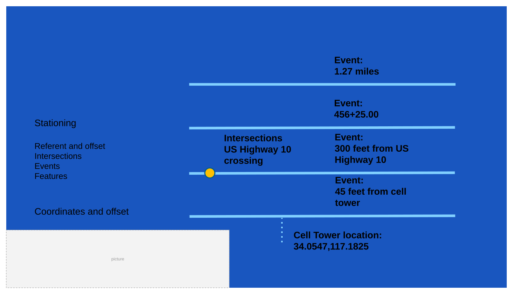

## Slide 15 — Event Quality Control Checks

Gaps

Invalid Measures

Overlaps

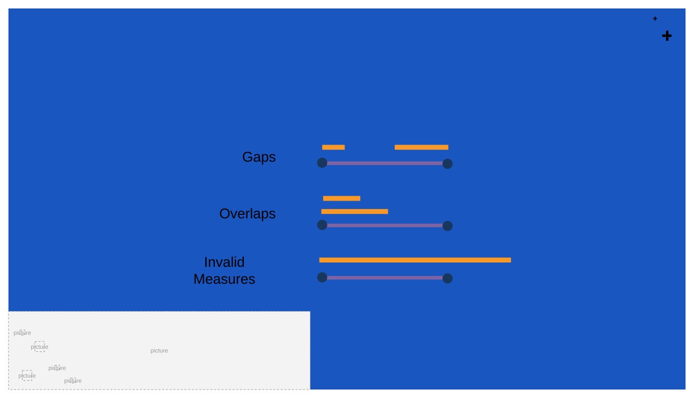

## Slide 16 — Attribute Sets

Collection of linear event attribute fields that can be edited as a logical group

style.visibilitystyle.visibility

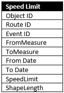

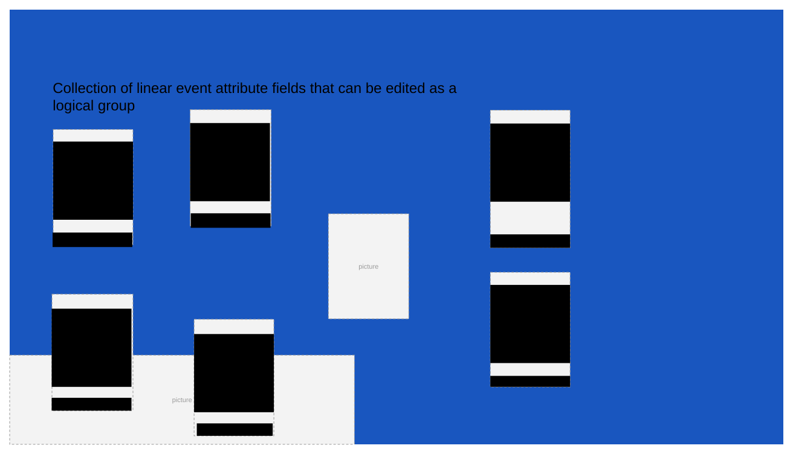

## Slide 17 — Roadway Reporter

Reporting available across the enterprise from a web application

Mileage Report
Mileages for routes and events
Segment Report
Dynamically segment event layers into one record set
Road Log Report
Logging events that occur  in measure order when traversing a route
style.visibilitystyle.visibilitystyle.visibilitystyle.visibilitystyle.visibilitystyle.visibilitystyle.visibilitystyle.visibilitystyle.visibilitystyle.visibilitystyle.visibilitystyle.visibilitystyle.visibilitystyle.visibilitystyle.visibilitystyle.visibilitystyle.visibility

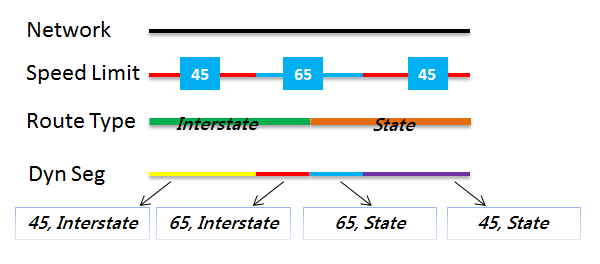

## Slide 18 — Address Management

Managing address information using Roads and Highways

Editing

- Add/Edit Block Ranges
- Add/Edit Site Address Points
- Add Master Street Names
Quality Control

- Fishbone Diagrams
- Data Reviewer Batch Checks

## Slide 19 — Resources

