# LRS Data Template

|   |   |
| --- | --- |
| **Kind** | Other · Pro |
| **Release** | 3.4 |
| **Product** | Roads & Highways |
| **Source** | [working_wizard_RH_doc.docx](<https://esriis.sharepoint.com/sites/LocationReferencing/Shared%20Documents/General/Doc%20Reviews/5984_Generate_LRS%20Data_Product/working_wizard_RH_doc.docx>) |
| **Edited** | 2024-09-04 18:47 by unknown |
| **Extracted** | 2026-09-04 · lane `xmlstrip` |

<!-- metadata
```yaml
title: "LRS Data Template"
source_file: "working_wizard_RH_doc.docx"
source_url: "https://esriis.sharepoint.com/sites/LocationReferencing/Shared%20Documents/General/Doc%20Reviews/5984_Generate_LRS%20Data_Product/working_wizard_RH_doc.docx"
doc_id: 316
doc_kind: "Other"
surface: "Pro"
doc_revision: ""
target_release: "3.4"
pe: ""
dev: ""
author: "Claire Wang"
last_edited_by: ""
last_edited: "2024-09-04T18:47:15.1277677Z"
extracted: 2026-09-04
extraction_lane: xmlstrip
prompt_version: "v2.0.2"
keywords: ["lrs data template", "length data product", "summary layer", "length field", "route length", "filter expression", "network"]
tools: ["Generate LRS Data Product"]
products: ["Roads & Highways"]
issues: []
related: [{"doc":317,"file":"create-a-template-for-an-lrs-length-data-product__doc317.md","s":6.889},{"doc":158,"file":"generate-length-summary-location-referencing__doc158.md","s":2.783},{"doc":226,"file":"generate-lrs-data-product-location-referencing__doc226.md","s":2.614},{"doc":205,"file":"generate-lrs-data-product-location-referencing__doc205.md","s":2.599},{"doc":196,"file":"create-a-template-for-an-lrs-feature-count-data-product__doc196.md","s":2.52}]
```
-->

## Summary

This document explains how to create an LRS Data Template for generating LRS Length Data Products in ArcGIS Pro. It covers selecting product types, setting template properties, configuring summary layers and fields, and defining length fields to calculate road lengths by various characteristics.

## Related documents

<!-- related:begin -->
- [Create a template for an LRS length data product](<https://esriis.sharepoint.com/sites/lrsworkspace/LRS Doc Index/Data Templates/create-a-template-for-an-lrs-length-data-product__doc317.md>) — similar text 0.51 · 2 filename words · same surface/release 3.4/folder <!-- rel:317 -->
- [Generate Length Summary (Location Referencing)](<https://esriis.sharepoint.com/sites/lrsworkspace/LRS Doc Index/Other/generate-length-summary-location-referencing__doc158.md>) — similar text 0.17 · same kind/surface <!-- rel:158 -->
- [Generate LRS Data Product (Location Referencing)](<https://esriis.sharepoint.com/sites/lrsworkspace/LRS Doc Index/Other/generate-lrs-data-product-location-referencing__doc226.md>) — similar text 0.13 · same kind/surface <!-- rel:226 -->
- [Generate LRS Data Product (Location Referencing)](<https://esriis.sharepoint.com/sites/lrsworkspace/LRS Doc Index/Other/generate-lrs-data-product-location-referencing__doc205.md>) — similar text 0.13 · same kind/surface <!-- rel:205 -->
- [Create a template for an LRS feature count data product](<https://esriis.sharepoint.com/sites/lrsworkspace/LRS Doc Index/Other/create-a-template-for-an-lrs-feature-count-data-product__doc196.md>) — similar text 0.27 · same kind/surface <!-- rel:196 -->
<!-- related:end -->

<!-- docs:begin -->
## Esri documentation

[Create a template for an LRS length data product](https://doc.esri.com/en/arcgis-pro/latest/help/production/roads-highways/create-a-template-for-an-lrs-length-data-product.html) · [View LRS Network properties](https://doc.esri.com/en/arcgis-pro/latest/help/production/roads-highways/view-lrs-network-properties.html)

_No page matched:_ [Generate LRS Data Product](https://www.google.com/search?q=%22Generate%20LRS%20Data%20Product%22+site%3Adoc.esri.com)
<!-- docs:end -->

---

## LRS Data Template
To create LRS Data Products, you need to first create an LRS Data Template and then, use the template as an input in Generate LRS Data Product geoprocessing tool (link).
This documentation introduces LRS Length Data Product and steps to create a template for such product.
Choose an LRS Data Product Type
As of ArcGIS Pro 3.4, LRS Length Data Product is the only type of product supported. In LRS Data Template wizard, this is selected in the first pane.
(alt text: Choose an LRS Data Product Type in the first pane of LRS Data Template wizard.)

LRS Length Data Product is used to calculate length of routes based on their characteristics. Here is an example of an LRS Length Data Product that computes mileage of urban roads and rural roads summarized by counties and whether they are paved or unpavedpavement conditions.
(alt text: An example of an LRS Length Data Product.)

Other types of LRS Length Data Products you can configure include the following:

- Mileage of types of road surfaces, such as bitumen, asphalt, gravel, concrete, and so on, summarized by functional class.
- Mileage of maintained public roads in each county, summarized by jurisdiction.
- Lane miles and daily VMT by urban area.
In this workflow, you'll learn how to produce an LRS Length Data Product similar to the one shown in the table above.
Set template properties
Once a Product Type is selected, you can provide template properties in the next pane.

- Type a template name.
- Choose a network from the Network dropdown. This network is used to calculate the length of the roads.
- Optionally, provide a description.
(alt text: Set template properties in the second pane of LRS Data Template wizard.)

- Optionally, click Preview to open the canvas. The canvas formats information entered in the wizard.
(alt text: Template properties shown in canvas.)

Set template summary fields
The next stage in producing the LRS Data Template is to select a summary layer and summary fields. The LRS Length Data Product is summarized on the basis of unique values present in the summary layer.
You can configure multiple summary layers and summary fields. The summary layers are arranged and subdivided by levels based on their spatial relationships. For example, you can configure a County Boundary layer as level one, and Pavement Condition layer as level two. The LRS Length Data Product will summarize the length of paved vsand. unpaved roads within each county.
This is an optional choice. If you don't want to add summary fields to your template, skip this step by clicking Next.

- Click Add to add a summary level.
- Select a summary layer from Layer dropdown.
This layer can be a polygon feature class, a line event registered to the network selected in the 2nd pane, or the network itself. This layer must be in the same geodatabase and have the same projection as the selected network.
For this workflow, County Boundary is the summary layer for the first level as shown in the table above.

- Select a summary field from Field dropdown. For this workflow, County Name is the summary field for County Boundary.
Once a summary field is selected, the Display Value Map shows the unique values present in the summary field. You can edit the display value field in the table if the initial display values are abbreviations or coded values. The LRS Length Data Product will only calculate road length for values in Display Value Map.
(alt text: Set the first summary layer in the third pane of LRS Data Template wizard.)
(alt text: Routes Roads clipped by county polygons)
Make the image below with a width no more than 450 pixels (or what the current limitation is)

- Type to provide a name for this summary level. For this workflow, the first level name is County.
- Optionally, you can delete display values from the Display Value Map, or use Filter Expression to manage Display Values.
For this workflow, the 7 counties that belong to the Southeast category are chosen. Only the length of roads that are clipped by these 7 counties will be calculated.
(alt text: Manage display values in the third pane of LRS Data Template wizard.)

Make the image below with a width no more than 450 pixels (or what the current limitation is)
(alt text: routes Roads clipped by 7seven counties in the sSoutheast.)

- Optionally, you can add multiple summary levels. Repeat the steps above for the additional levels.
For this workflowexample, Pavement Condition is the summary layer for the second level as shown in the table above, PSR is the summary field, and Pavement is the second level name. A filter is applied to PSR to generate two Ddisplay Vvalues: Paved and Unpaved roads.
As a result, the LRS lLength Ddata Pproduct will summarize the length of paved vs.and unpaved roads within each county.
(alt text: Set multiple summary layers in the third pane of LRS Data Template wizard.)

(alt text: Summary fields shown in canvas.)
Set template length fields
After selecting the summary layer, the next step is to add the length fields. These length fields form the columns that show the length of roads in the LRS Length Data Product.

- Click Add to add a Length Field.
- Select a Length Layer from the dropdown.
This layer can be a line event registered to the network selected in the 2nd pane, or the network itself. This layer must be in the same geodatabase and have the same projection as the selected network.
For this workflow, line event CLEu_Rural_Urban is the first Length Layer.

- Type to provide a name for this Length Field. For this workflow, Urban Roads is the name for the first Length Field.
- Optionally, you can use Filter Expression to manage Length Fields.
For this workflowexample, since because the template is used to calculate mileage of urban roads and rural roads, the first length field is called Urban Roads, and a filter is applied to the RuralUrban field to select values that correspond to urban roads category.
(alt text: Set the first length field in the fourth pane of LRS Data Template wizard.)

- Optionally, you can add multiple length fields. Repeat the steps above for the additional levels.
For this workflow, the second length field is called Rural Roads, and a filter is applied to the RuralUrban field to select values that correspond to rural roads category. The name for the second Length Field is Rural Roads.
(alt text: Set multiple length fields in the fourth pane of LRS Data Template wizard.)
(alt text: Length fields shown in canvas.)

- Click Finish to save the template.
Note:
To view or edit an existing template, click the folder button next to Template. You can choose a template from the default project folder location or browse to other locations.
Now you can use this template in Generate LRS Data Product (link) geoprocessing tool.

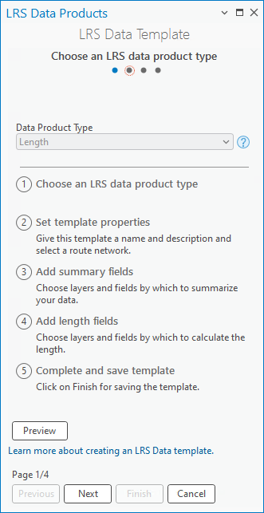 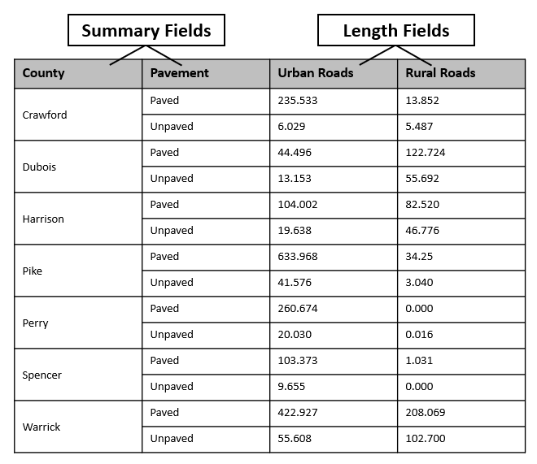 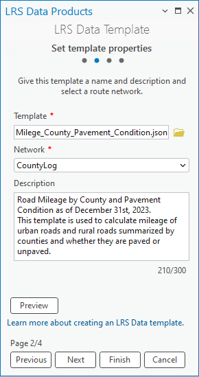 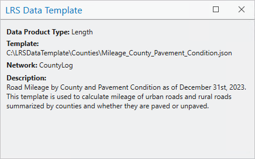 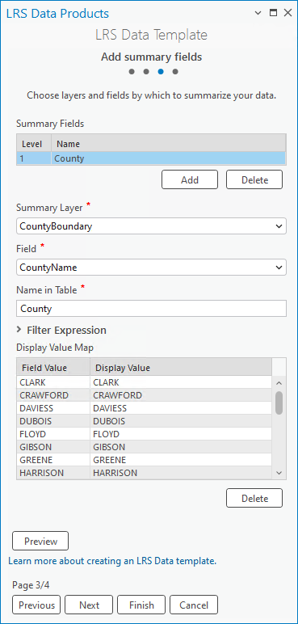 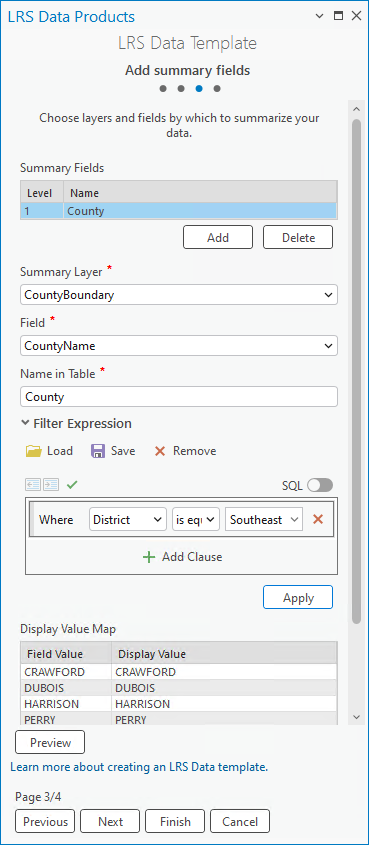 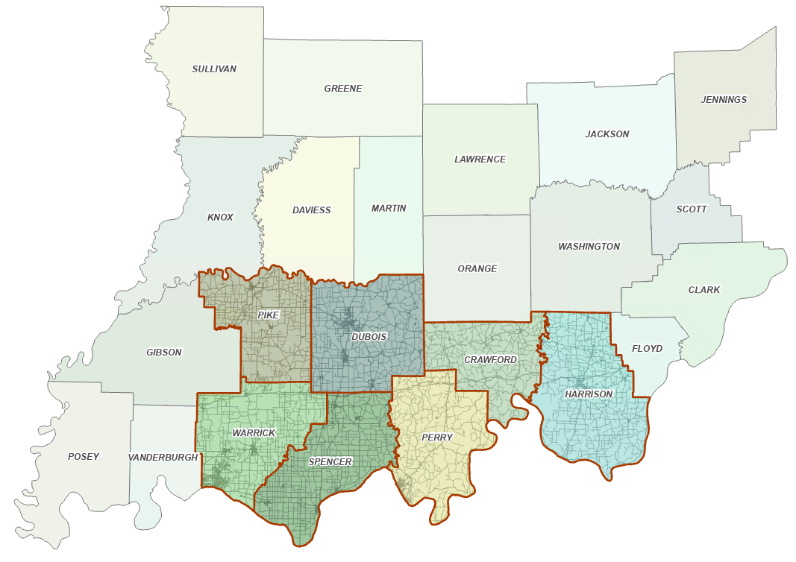 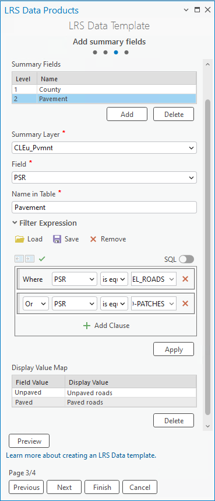 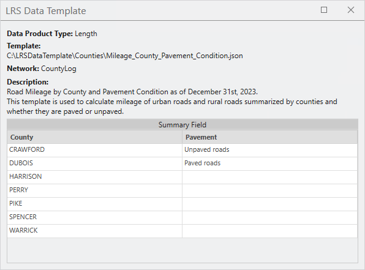 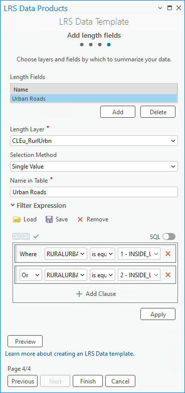 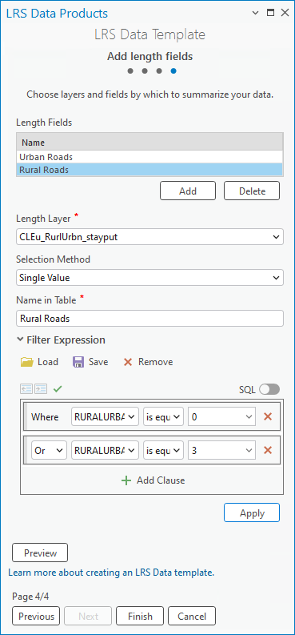 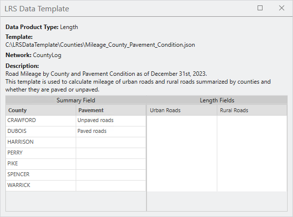
