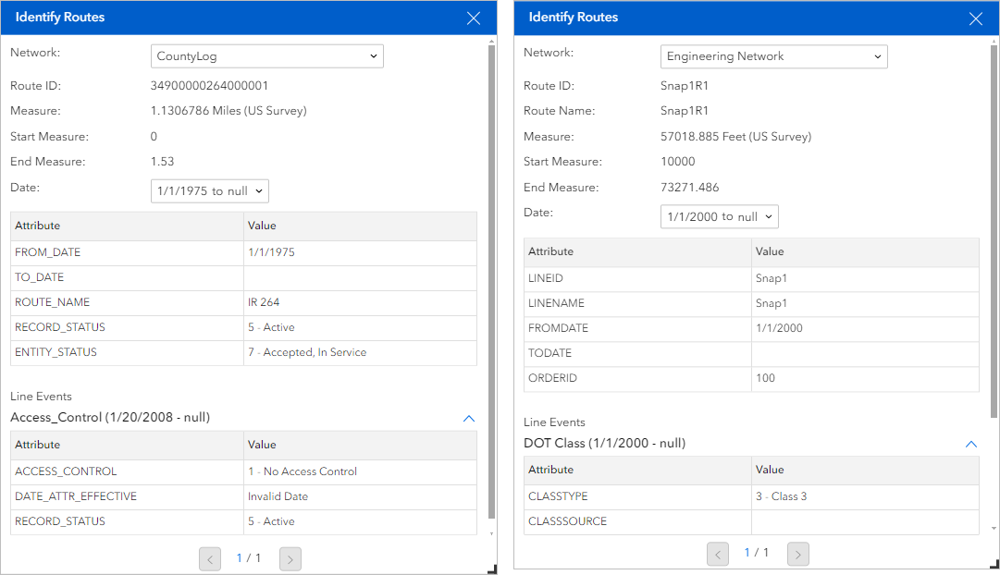

# LRS Identify widget

| Field | Value |
| --- | --- |
| **Doc** | 905 · Other · Experience Builder |
| **Product** | Roads & Highways · Pipeline Referencing |
| **Release** | — |
| **Issues** | — |
| **Source** | [LRS-identify-widget.docx](<https://esriis.sharepoint.com/sites/LocationReferencing/Shared%20Documents/General/Doc%20Reviews/Pro38_Ent122/LRS-identify-widget.docx>) |
| **People** | author — · PE — · dev — |
| **Edited** | 2026-09-02 17:15 by Kyle Chin |
| **Extracted** | 2026-09-04 · lane xmlstrip · format 3.0 · prompt v2.0.2 |
| **Keywords** | route attributes · measure values · event attributes · experience builder widget · map widget · linear referencing |
| **Tools** | LRS Identify · Add Point Event · Add Line Event |

## Summary

Describes the LRS Identify widget used in ArcGIS Experience Builder to identify route locations on a map and view measure values, coordinates, and event attributes. Explains widget settings, usage requirements, and interaction options including data actions to launch event widgets. Provides guidance on connecting the widget to a Map widget with LRS data published with Linear Referencing and Version Management capabilities.

## Related documents

<!-- related:begin -->
- [Dynamic Segmentation widget](<https://esriis.sharepoint.com/sites/lrsworkspace/LRS Doc Index/Other/29871-dynseg-widget.md>) — similar text 0.45 · 1 title word · 1 filename word · same kind/surface <!-- rel:57 s=4.467 -->
- [LRS Identify: Show Coordinates in Results Experience Builder Widget Test Plan](<https://esriis.sharepoint.com/sites/lrsworkspace/LRS%20Doc%20Index/Test%20Plans/26618-lrs-identify-show-coordinates-in-results-exb-widget.md>) — similar text 0.24 · 2 title words · 1 filename word · same surface <!-- rel:859 s=4.44 -->
- [Dynamic Segmentation widget](<https://esriis.sharepoint.com/sites/lrsworkspace/LRS Doc Index/Other/26160-dynseg-widget.md>) — similar text 0.48 · 1 title word · 1 filename word · same kind/surface <!-- rel:60 s=4.173 -->
- [Add Line Event widget](<https://esriis.sharepoint.com/sites/lrsworkspace/LRS Doc Index/Other/24791-add-line-event-widget.md>) — similar text 0.48 · 1 title word · same kind/surface <!-- rel:138 s=3.886 -->
- [LRS Controller Widget](<https://esriis.sharepoint.com/sites/lrsworkspace/LRS Doc Index/Other/26748-lrs-controller-widget.md>) — similar text 0.41 · 1 title word · 1 filename word · same kind/surface <!-- rel:64 s=3.825 -->
<!-- related:end -->

<!-- docs:begin -->
## Esri documentation

[Event editing using the attribute table](https://doc.esri.com/en/arcgis-pro/latest/help/production/roads-highways/event-editing-using-the-attribute-table.html) · [Multiple linear referencing methods](https://doc.esri.com/en/arcgis-pro/latest/help/production/location-referencing-pipelines/multiple-linear-referencing-methods.html)

_No page matched:_ [LRS Identify](https://www.google.com/search?q=%22LRS%20Identify%22+site%3Adoc.esri.com) · [Add Point Event](https://www.google.com/search?q=%22Add%20Point%20Event%22+site%3Adoc.esri.com) · [Add Line Event](https://www.google.com/search?q=%22Add%20Line%20Event%22+site%3Adoc.esri.com)
<!-- docs:end -->

---

## LRS Identify widget
The LRS Identify widget allows you to identify route locations on the map and view measure values, coordinates,   attributes, and attributes of any underlying events for those locations.
Note:
All Location Referencing widgets support express mode. When you create an app in express mode, all Location Referencing widgets are automatically configured based on the web map added to the Map widget. Any modifications made in the Map widget, such as changing the web map, will instantly be reflected in the Location Referencing widgets. Express mode allows you to efficiently set up Location Referencing widgets within ArcGIS Experience Builder, streamlining the deployment process for apps that contain Location Referencing widgets.
https://doc.arcgis.com/en/experience-builder/12.1/build-apps/express-mode.htm \hLearn more about express mode

### Examples
Use this widget to support app design requirements such as the following:

- You want to click a location on a route and get route attributes, measure values, coordinates,  and event attributes.
- You want to use route information to run additional queries and populate forms.

### Usage notes
This widget requires connection to a Map widget. To identify routes and events, the Map widget must be connected to a web map data source with an LRS published with the Linear Referencing and Version Management capabilities enabled.
To create an LRS and publish a feature service with the Linear Referencing and Version Management capabilities enabled, follow the steps in the ArcGIS Pro documentation:

- Pipeline Referencing—Create an LRS and share an LRS as web layers
- Roads and Highways—Create an LRS and share an LRS as web layers
When you click a route on the map, the widget highlights identified routes and shows their attributes in the widget panel. The widget displays the measure value for the clicked point location and minimum and maximum measure values for the route. There is an option to display the coordinate for the clicked point location as well. The coordinates can be copied in an X,Y format by clicking (insert copy icon).
If the point you click on the map intersects with more than one route, you can use the page navigation tools at the bottom of the Route Locations panel to view each route.
The widget can also display line event attributes and point event attributes.

### Settings

### The LRS Identify widget includes the following settings:

- Mode—Choose how the widget loads LRSa method of loading data.
  - Select Layers—Select a Map widget and load all layers from the web map.
    - Select a Map widget—Select a Map widget in the page that's connected to a web map.
    - Load layers—Load layers from the web map in the connected Map widget. To load layers, the Map widget must be connected to a web map that contains LRS layers.
    - Clear layers—Remove all loaded layers from the widget.
    - Layers—After loading layers, you can click the down arrow to expand the list of layers. Click a layer to open the Layer Configuration panel.
    - Layer Configuration—Configure settings for individual layers.
      - LRS Network layers:
        - Label—Provide a meaningful label for the layer. This label appears in the widget panel at run time.
        - Use Field Alias—Turn on this setting to display field aliases at run time. An alias, or display name, is an alternative name for a field. It is usually a more user-friendly description of the content of the field. Unlike true field names, aliases do not have to adhere to the limitations of the database, so they can contain special characters such as spaces.
        - Configure fields—Choose which attribute fields from the layer to include in the widget panel at run time.
      - Other LRS layers:
        - Label—Provide a meaningful label for the layer. This label appears in the widget panel at run time.
  - Interact with a Map widget—Connect the LRS Identify widget to a Map widget. Any web maps in the connected Map widget appear in the list. After connecting to a Map widget, you can click the down arrow next to the Select Layers  button  to expand the list of layers. Click a layer to open the Layer Configuration panel.
    - Layer Configuration—Configure settings for individual layers. Review the settings available in the Layer Configuration panel.
    - Select Layers—Click the Select Layers button  to open the Select Layers panel. You can select or unselect layers from the list in the panel.
- Default Settings—Configure the default settings that you want available in the widget when it first loads.
  - Default Network—If you add more than one network layer, you can set a default network layer.
- Coordinate Settings —Configure settings related to coordinates.
- Include coordinates in result — Turn on this setting to display coordinates.
- Spatial Reference Type —Set the spatial reference the coordinate will display in. Coordinates can be displayed in the spatial reference of the web map or the LRS.
- Precision —Set the number of decimal digits the coordinate will have.
- Selection Settings—Configure settings related to how the widget displays selected features.
  - Highlight—Use the color picker to choose a color for the selection highlight.
  - Width—Define the width for the selection highlight.
  - Show Line Events—Turn on this setting to display line events at run time.
  - Line Attribute Set—If a layer is configured with attribute sets, you can choose them from the drop-down menu. The widget only displays line events that are part of the attribute set. Attribute sets are collections of event layer attributes.
  - Show Point Events—Turn on this setting to display point events at run time.
  - Point Attribute Set—If a layer is configured with attribute sets, you can choose them from the drop-down menu. The widget only displays point events that are part of the attribute set. Attribute sets are collections of event layer attributes.

### Identify routes on a map

### To identify routes on a map, complete the following steps:

1. Start Experience Builder.

1. Add a Map widget. Connect it to a web map with LRS data published with the Linear Referencing and Version Management capabilities enabled.

1. Add an LRS Identify widget. Connect it to the Map widget, and load LRS layers from the Map widget.

1. Publish the app.

1. Launch the app. If prompted, sign in to your ArcGIS Enterprise organization.

1. Zoom to the location where you want to identify routes.

1. Click the LRS Identify widget , and click a route.

- The route attributes, measure values, and any available event attributes appear.
- The first image is an example of the Identify Routes widget panel with Roads and Highways data. The second image is an example of the Identify Routes widget panel with Pipeline Referencing data.

### Interaction options
This widget supports data actions, which you can enable on the Action tab of the widget's settings.
For example, you can use data actions in the LRS Identify widget to launch the Add Point Event widget or Add Line Event widget and populate values. To do this, you must turn on the Add Point Event and Add Line Event data actions in the LRS Identify widget's settings.

