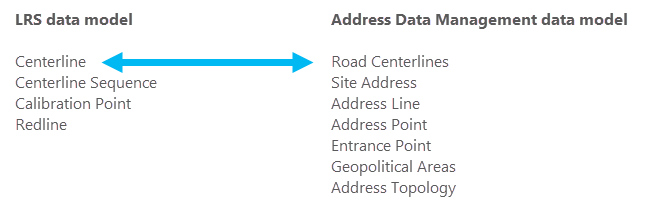

# Manage Address and Roadway Characteristic Data Together

|   |   |
| --- | --- |
| **Kind** | Other · Pro |
| **Release** | — |
| **Product** | Roads & Highways |
| **Issue** | [ArcGISPro/ps-location-referencing#5930](https://devtopia.esri.com/ArcGISPro/ps-location-referencing/issues/5930) |
| **Source** | [5930-ADMRHUpdates.docx](<https://esriis.sharepoint.com/sites/LocationReferencing/Shared%20Documents/General/Doc%20Reviews/5930-ADMRHUpdates.docx>) |
| **Edited** | 2024-08-29 17:48 by unknown |
| **Extracted** | 2026-09-04 · lane `xmlstrip` |

<!-- metadata
```yaml
title: "Manage Address and Roadway Characteristic Data Together"
source_file: "5930-ADMRHUpdates.docx"
source_url: "https://esriis.sharepoint.com/sites/LocationReferencing/Shared%20Documents/General/Doc%20Reviews/5930-ADMRHUpdates.docx"
doc_id: 327
doc_kind: "Other"
surface: "Pro"
doc_revision: ""
target_release: ""
pe: ""
dev: ""
author: ""
last_edited_by: ""
last_edited: "2024-08-29T17:48:08.2131508Z"
extracted: 2026-09-04
extraction_lane: xmlstrip
prompt_version: "v2.0.2"
keywords: ["address data management", "roadway characteristic", "centerline", "line event", "site address", "address range", "address number", "roads and highways", "lrs centerline", "lrs network", "dynamic segmentation", "overlay events", "address topology", "attribute rule", "split centerline"]
tools: ["Create LRS", "Create LRS From Existing Dataset", "Configure Address Feature Classes", "Append", "Append Routes", "Append Events", "Create LRS Network", "Create LRS Event", "Apply Event Behaviors", "Overlay Events"]
products: ["Roads & Highways"]
issues: ["ArcGISPro/ps-location-referencing#5930"]
related: [{"doc":194,"file":"pro-3-4-and-11-4-user-acceptance-issues-and-documentation-updates__doc194.md","s":1121.258},{"doc":276,"file":"manage-address-and-roadway-characteristic-data-together-with-roads-and-highways__doc276.md","s":10.548},{"doc":400,"file":"manage-address-and-roadway-characteristic-data-together__doc400.md","s":10.537},{"doc":250,"file":"manage-address-and-roadway-characteristic-data-together__doc250.md","s":7.736},{"doc":96,"file":"manage-address-and-roadway-characteristic-data-together__doc96.md","s":7.558}]
```
-->

## Summary

This document describes how to manage and maintain address and roadway characteristic data together using ArcGIS Roads and Highways and the Address Data Management solution within a single geodatabase. It covers data model requirements, configuration, loading, publishing workflows, combined editing in ArcGIS Pro, and analysis capabilities of integrated LRS and address data. Guidance is provided for both out-of-the-box and custom address data models and their integration with Roads and Highways.

## Related documents

<!-- related:begin -->
- [Pro 3.4 and 11.4 User Acceptance Issues and Documentation Updates](<https://esriis.sharepoint.com/sites/lrsworkspace/LRS%20Doc%20Index/Schedules/pro-3-4-and-11-4-user-acceptance-issues-and-documentation-updates__doc194.md>) — shared issue ArcGISPro/ps-location-referencing#5930 · gantt link (2 shared) · similar text 0.04 · same surface/folder <!-- rel:194 -->
- [Manage Address and Roadway Characteristic Data Together with Roads and Highways and Address Data Management Solution](<https://esriis.sharepoint.com/sites/lrsworkspace/LRS Doc Index/Other/manage-address-and-roadway-characteristic-data-together-with-roads-and-highways__doc276.md>) — similar text 0.84 · 5 title words · same kind/surface <!-- rel:276 -->
- [Manage Address and Roadway Characteristic Data Together](<https://esriis.sharepoint.com/sites/lrsworkspace/LRS Doc Index/Other/manage-address-and-roadway-characteristic-data-together__doc400.md>) — similar text 0.92 · 5 title words · same kind/surface/folder <!-- rel:400 -->
- [Manage Address and Roadway Characteristic Data Together](<https://esriis.sharepoint.com/sites/lrsworkspace/LRS Doc Index/Other/manage-address-and-roadway-characteristic-data-together__doc250.md>) — similar text 0.76 · 5 title words · same kind/surface <!-- rel:250 -->
- [Manage address and roadway characteristic data together](<https://esriis.sharepoint.com/sites/lrsworkspace/LRS Doc Index/Other/manage-address-and-roadway-characteristic-data-together__doc96.md>) — similar text 0.75 · 5 title words · same kind/surface <!-- rel:96 -->
<!-- related:end -->

<!-- docs:begin -->
## Esri documentation

[Create and modify an LRS Network](https://doc.esri.com/en/arcgis-pro/latest/help/production/roads-highways/create-and-modify-an-lrs-network.html) · [Create and modify LRS events](https://doc.esri.com/en/arcgis-pro/latest/help/production/roads-highways/create-and-modify-lrs-events.html) · [Manage address and roadway characteristic data together](https://doc.esri.com/en/arcgis-pro/latest/help/production/roads-highways/manage-address-and-roadway-characteristic-data-together.html) · [Merge centerlines](https://doc.esri.com/en/arcgis-pro/latest/help/production/roads-highways/merge-centerlines.html) · [View site address point properties](https://doc.esri.com/en/arcgis-pro/latest/help/production/roads-highways/view-site-address-point-properties.html) · [3D in Roads and Highways](https://doc.esri.com/en/arcgis-pro/latest/help/production/roads-highways/3d-in-roads-and-highways.html) · [View LRS Network properties](https://doc.esri.com/en/arcgis-pro/latest/help/production/roads-highways/view-lrs-network-properties.html) · [Apply dynamic segmentation](https://doc.esri.com/en/arcgis-pro/latest/help/production/roads-highways/apply-dynamic-segmentation.html)

_No page matched:_ [Create LRS](https://www.google.com/search?q=%22Create%20LRS%22+site%3Adoc.esri.com) · [Create LRS From Existing Dataset](https://www.google.com/search?q=%22Create%20LRS%20From%20Existing%20Dataset%22+site%3Adoc.esri.com) · [Configure Address Feature Classes](https://www.google.com/search?q=%22Configure%20Address%20Feature%20Classes%22+site%3Adoc.esri.com) · [Append](https://www.google.com/search?q=%22Append%22+site%3Adoc.esri.com) · [Append Routes](https://www.google.com/search?q=%22Append%20Routes%22+site%3Adoc.esri.com) · [Append Events](https://www.google.com/search?q=%22Append%20Events%22+site%3Adoc.esri.com) · [Apply Event Behaviors](https://www.google.com/search?q=%22Apply%20Event%20Behaviors%22+site%3Adoc.esri.com) · [Overlay Events](https://www.google.com/search?q=%22Overlay%20Events%22+site%3Adoc.esri.com)
<!-- docs:end -->

---

## Manage address and roadway characteristic data together
Increasingly, organizations have the need to manage and maintain address and roadway characteristic data from across the organization in a simple and efficient manner. ArcGIS Roads and Highways provides options to organizations to manage their address data within a linear referencing system in a common geodatabase. Roads and Highways can be configured out of the box with the Address Data Management solution in a single geodatabase by including address range fields from the Address Data Management solution in a feature class that also serves as the Roads and Highways Centerline feature class. You also have the option to support addressing in a customized fashion by modeling address information on the LRS, on either the centerline, LRS Network, or as an LRS line event feature class or the LRS Centerline feature class. You also have the option to support addressing in a customized fashion by modeling address information on either the LRS centerline or LRS line event. In both the Address Data Management Solution configuration and the custom data model configurations, a feature class with Site Address points must be configured with the LRS.

You also have the option to support addressing in a customized fashion by modeling address information on either the LRS centerline or LRS line event

the LRS (on either the centerline or LRS Network), as an LRS line event feature class, or the LRS Centerline feature class.
Out of the box – LRS centerline or LRS line event
Custom – centerline or line event or LRS network
In ArcGIS, the Address Data Management solution can be used to maintain and improve an authoritative address repository. The solution contains a set of capabilities designed to help maintain, improve, and share address information in support of services and commerce within a community, such as E911, permitting, and assessment.
The sections below describe how to model address information in conjunction with the Roads and Highways schema to maintain and edit both an LRS and address management solution in a single geodatabase using tools in ArcGIS Pro. Guidance is provided for loading data and publishing services with data managed by both capabilities.

### Requirements
You can use an out-of-the-box data model or customize a data model to meet your organization's rules and requirements, if the required feature classes and tables in the Roads and Highways information model and Address Data Management solution are present in a single database.

#### Address Data Management solution data model
You can simplify the deployment process for the Address Data Management solution by deploying it to your organization’s ArcGIS Enterprise portal and loading your LRS data into the solution. The Configure Address Feature Classes tool associates the Centerline or line event feature classes and the Site Address feature class as part of the Address Data Management solution and LRS.
Learn more about deploying the Address Data Management solution to your Enterprise portal

The following are required feature classes for the Roads and Highways schema to integrate with the Address Data Management solution:

- Centerline or line event
- Centerline Sequence
- Calibration Point
- Redline
The following are required Address Data Management solution feature classes to integrate with Roads and Highways:

- Road Centerlines
- Site Address
- Address Line
- Address Point
- Entrance Points
- Geopolitical Areas
- Address Topology
The following fields must be present in the Centerline or line event feature class to successfully configure with an LRS and to take advantage of Roads and Highways and the Address Data Management solution configured together:

| Field | Data type | Length | IsNullable | Description |
| --- | --- | --- | --- | --- |
| FromLeft | Short or Long | N/A | Yes | The first address on the left side of a roadway. |
| ToLeft | Short or Long | N/A | Yes | The last address on the left side of a roadway. |
| FromRight | Short or Long | N/A | Yes | The first address on the right side of a roadway. |
| ToRight | Short or Long | N/A | Yes | The last address on the right side of a roadway. |

The following field must be present in the Site Address feature class to successfully configure with an LRS and to take advantage of Roads and Highways and the Address Data Management solution configured together:

| Field | Data type | Length | IsNullable | Description |
| --- | --- | --- | --- | --- |
| AddressNumber | Short, Long, or Text | N/A | Yes | The site address number. |

#### Custom address data model
To create a custom data model other than the Address Data Management solution, ensure that the required feature classes and tables for an LRS are present. This includes the Centerline or line event feature class and address point feature class.
The following are required feature classes for the Roads and Highways schema to integrate with a custom address data model:

- Centerline or line event
- Centerline Sequence
- Calibration Point
- Redline
An address feature class is required to integrate with Roads and Highways.
The following fields must be present in the Centerline or line event feature class to successfully configure with an LRS with a custom address model:

| Field | Data type | Length | IsNullable | Description |
| --- | --- | --- | --- | --- |
| FromLeft | Short or Long | N/A | Yes | The first address on the left side of a roadway. |
| ToLeft | Short or Long | N/A | Yes | The last address on the left side of a roadway. |
| FromRight | Short or Long | N/A | Yes | The first address on the right side of a roadway. |
| ToRight | Short or Long | N/A | Yes | The last address on the right side of a roadway. |

The following field must be present in the address feature class to successfully configure with an LRS and to take advantage of Roads and Highways and a custom address model:

| Field | Data type | Length | IsNullable | Description |
| --- | --- | --- | --- | --- |
| AddressNumber | Short, Long, or Text | N/A | Yes | The site address number. |

Note:
When using a custom addressing data model configured with an LRS, the extraadditional functionalitesy of the Address Data Management sSolution areis not included, such as specialized attribute rules, relationship classes, topology, special workflows, and more. Theseis functionalitiesy can be recreated in a custom address data model, but they are not availablehowever it is not out-of-the-box like with the Address Data Management sSolution.

### Configure, load data, and publish a Roads and Highways LRS with the Address Data Management solution
Both the Address Data Management solution and Roads and Highways have specific requirements to deploy in a geodatabase.
To deploy a Roads and Highways LRS and the Address Data Management solution in a geodatabase, complete the following steps:
Note:
Ensure that the correct spatial reference; x, y, z, and m tolerances; and x, y, z, and m resolution are configured for feature classes used by Roads and Highways and the Address Data Management solution so that the LRS can be configured correctly.
You can use the LRS Centerline feature class or the an LRS line event feature class as the Address Range layer for this workflow.

#### Configure, load, and publish with the LRS Centerline feature class
Use the LRS Centerline feature class as the Address Range layer to configure, load, and publish.

- Deploy the Address Data Management solution to your Enterprise portal.
- Create the LRS using the Create LRS or Create LRS From Existing Dataset tool.
- Run the Configure Address Feature Classes tool to associate the Centerline and the Site Address feature classes as part of the Address Data Management solution and LRS.
- Load data into the Centerline and Site Address feature classes using the Append tool.
- Note:
- The Append tool populates the feature classes with features that do the following:
  - Have valid Centerline IDs
  - Populate the remaining attributes
  - Load more road centerlines that won't be associated with the LRS
- Load data into the LRS using the Append Routes and Append Events tools.
- The Append Routes tool considers existing centerlines when appending routes. If a CenterlineID value already exists where you append a route, the existing centerline sequence record is updated with the appended route's RouteID value.
- Change the connection file versioning type to Branch, and register the data as branch versioned.
- Note:
- Ensure that the required fields are present to branch version the data (Global IDs and editor tracking are enabled).
- https://prodev.arcgis.com/en/pro-app/3.4/help/production/roads-highways/share-as-web-layers.htm \hPublish an LRS in a service.

#### Configure, load, and publish with the an LRS line event feature class
Use the an LRS line event feature class as the Address Range layer to configure, load, and publish.

- Deploy the Address Data Management solution to your Enterprise portal.
- Create the LRS using the Create LRS or Create LRS From Existing Dataset tool.
- Note:
- Add the FromLeft, ToLeft, FromRight, and ToRight fields to the centerline.
- Create an LRS Network using the Create LRS Network or Create LRS Network From Existing Dataset tool.
- Create an LRS line event using the Create LRS Event or Create LRS Event From Existing Dataset tool.
- Note:
- Add the FromLeft, ToLeft, FromRight, and ToRight fields to the LRS line event.
- Run the Configure Address Feature Classes tool to associate the newly created line event and as the Site Address feature class classes as part of the Address Data Management solution and LRS..
- Create more LRS Networks using the Create LRS Network or Create LRS Network From Existing Dataset tool, if necessary.
- Create more LRS events using the Create LRS Event or Create LRS Event From Existing Dataset tool, if necessary.
- Note:
- The Site Address feature class should not be registered as an LRS event.
- Load data into the Centerline and Site Address feature classe s using the Append%20Events Append%20EventsAppend tool.
- Note:
- The Append tool populates the feature classes with features that do the following:
  - Have valid Centerline IDs
  - Populate the remaining attributes
  - Load more road centerlines that won't be associated with the LRS
- Load data into the LRS using the Append Routes and Append Events tools.
- The Append Routes tool considers existing centerlines when appending routes. If a CenterlineID value already exists where you append a route, the existing centerline sequence record is updated with the appended route's RouteID value.
- Change the connection file versioning type to Branch, and register the data as branch versioned.
- Note:
- Ensure that the required fields are present to branch version the data (Global IDs and editor tracking are enabled).
- https://prodev.arcgis.com/en/pro-app/3.4/help/production/roads-highways/share-as-web-layers.htm \hPublish an LRS in a service.

### Combined LRS and address data editing
Combining a Roads and Highways LRS and the Address Data Management solution in a service allows you to edit data managed by both with ArcGIS Pro. When editing a service with both LRS and address data from a single database, some LRS editing workflows may differ as described in the following sections.
If the Road Centerline feature class from the Address Data Management solution is used as the LRS Centerline feature class, an attribute rule exists within the layer to update the FromLeft, ToLeft, FromRight, and ToRight fields upon splitting a road centerline. This attribute rule proportionally updates the address values based on the split location.

#### Centerline split using a split tool
The following image and table show a centerline before being split using the Split Centerline By Point tool:

| OID | FromLeft | ToLeft | FromRight | ToRight |
| --- | --- | --- | --- | --- |
| 1 | 1120 | 1134 | 1117 | 1131 |

The FromLeft, ToLeft, FromRight, and ToRight field values are updated after the centerline is split.
The following image and table show the centerline and its attributes after the split operation:

| OID | FromLeft | ToLeft | FromRight | ToRight |
| --- | --- | --- | --- | --- |
| 1 | 1120 | 1128 | 1117 | 1125 |
| 2 | 1130 | 1134 | 1127 | 1131 |

##### Centerlines split by an LRS edit
The following image and table show a centerline and the route attributes before the Retire edit activity:

| OID | RouteID | FromLeft | ToLeft | FromRight | ToRight |
| --- | --- | --- | --- | --- | --- |
| 1 | Route1 | 1120 | 1134 | 1117 | 1131 |

The route is retired from the start of the route to the middle portion of the route. As a result, the centerline is split, and its FromLeft, ToLeft, FromRight, and ToRight field values are updated.
The following table and image show the centerline and its attributes after the Retire route edit activity:

| OID | RouteID | FromLeft | ToLeft | FromRight | ToRight |
| --- | --- | --- | --- | --- | --- |
| 1 | Route1 | 1120 | 1128 | 1117 | 1125 |
| 2 | Route1 | 1130 | 1134 | 1127 | 1131 |

### Edit using a service with LRS and address data in ArcGIS Pro
To complete LRS editing using a service with LRS and Address Data Management data, complete the following steps:

- Create and update any centerlines intended for use in LRS editing activities (create, extend, or realign a route).
- Provide address values in the FromLeft, ToLeft, FromRight, and ToRight fields.
- Complete the LRS editing activity.
- Run the Apply Event Behaviors tool to update the associated LRS data.
- Validate the address topology to ensure all edits are valid.
- To create or edit LRS events, use the event editing tools on the Location Referencing tab in ArcGIS Pro, the https://enterprise.arcgis.com/en/roads-highways/latest/event-editor/what-is-event-editor.htm Event Editor web app, or ArcGIS Experience Builder Location Referencing widgets.

### Analysis capabilities in a combined LRS and address management dataset
Another advantage of configuring a Roads and Highways LRS and the Address Data Management solution in a single database is the combined analysis capabilities of both information models on a roadway system. You can maintain, update, and improve your authoritative address repository while also maintaining, updating, and improving your authoritative roadway data.
The Roads and Highways data is typically used by various integrity and compliance applications for analysis and reporting. Many of these processes apply dynamic segmentation using the Overlay Events tool. When the Centerline feature class is also configured as the Address Range layer in the Address Data Management solution using the Configure Address Feature Classes tool, this feature class can be included with networks and events in the Overlay Events tool for dynamic segmentation, allowing these features and their direction and attributes to be included without modeling a separate event.


