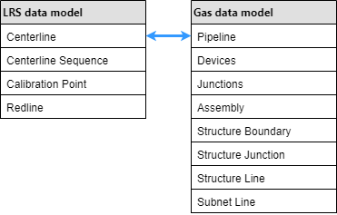

# Manage Pipeline Referencing and a Utility Network Together

|   |   |
| --- | --- |
| **Kind** | Other · Pro |
| **Release** | — |
| **Product** | Pipeline Referencing · Utility Network |
| **Issue** | [ArcGISPro/ps-location-referencing#5048](https://devtopia.esri.com/ArcGISPro/ps-location-referencing/issues/5048) |
| **Source** | [5048_Note_in_ManageAPRUN.docx](<https://esriis.sharepoint.com/sites/LocationReferencing/Shared%20Documents/General/Doc%20Reviews/5048_Note_in_ManageAPRUN.docx>) |
| **Edited** | 2023-05-19 23:38 by Ignacia Galvan |
| **Extracted** | 2026-09-04 · lane `xmlstrip` |

<!-- metadata
```yaml
title: "Manage Pipeline Referencing and a Utility Network Together"
source_file: "5048_Note_in_ManageAPRUN.docx"
source_url: "https://esriis.sharepoint.com/sites/LocationReferencing/Shared%20Documents/General/Doc%20Reviews/5048_Note_in_ManageAPRUN.docx"
doc_id: 565
doc_kind: "Other"
surface: "Pro"
doc_revision: ""
target_release: ""
pe: ""
dev: ""
author: ""
last_edited_by: "Ignacia Galvan"
last_edited: "2023-05-19T23:38:41Z"
extracted: 2026-09-04
extraction_lane: xmlstrip
prompt_version: "v2.0.2"
keywords: ["pipeline referencing", "utility network", "centerline", "pipeline feature class", "route", "measure", "calibration point", "dynamic segmentation", "editing workflow", "geodatabase", "unified pipeline tools"]
tools: ["Configure Utility Network Feature Class", "Update Measures From LRS", "Create LRS", "Create LRS from Existing Dataset", "Create LRS Network", "Create LRS Network from Existing Dataset", "Create LRS Event", "Create LRS Event from Existing Dataset", "Append", "Append Routes", "Append Events", "Apply Event Behaviors", "Overlay Events"]
products: ["Pipeline Referencing", "Utility Network"]
issues: ["ArcGISPro/ps-location-referencing#5048"]
related: [{"doc":566,"file":"unified-pipeline-tools-add-in__doc566.md","s":1003.603},{"doc":74,"file":"manage-pipeline-referencing-and-a-utility-network-together__doc74.md","s":11.68},{"doc":327,"file":"manage-address-and-roadway-characteristic-data-together__doc327.md","s":4.99},{"doc":400,"file":"manage-address-and-roadway-characteristic-data-together__doc400.md","s":4.803},{"doc":276,"file":"manage-address-and-roadway-characteristic-data-together-with-roads-and-highways__doc276.md","s":4.451}]
```
-->

## Summary

This document describes how to integrate the ArcGIS Pipeline Referencing Centerline feature class with the ArcGIS Utility Network Management extension Pipeline feature class to manage pipeline referencing and utility network data together. It covers information model requirements, data loading, service publishing, editing workflows in ArcGIS Pro, and combined analysis capabilities. Guidance is provided on configuring feature classes, using tools like the Unified Pipeline Tools add-in, and maintaining route and measure fields for traceability and verification.

## Related documents

<!-- related:begin -->
- [Unified Pipeline Tools add-in](<https://esriis.sharepoint.com/sites/lrsworkspace/LRS Doc Index/Other/unified-pipeline-tools-add-in__doc566.md>) — shared issue ArcGISPro/ps-location-referencing#5048 · similar text 0.17 · 1 title word · same kind/surface/folder <!-- rel:566 -->
- [Manage Pipeline Referencing and a Utility Network Together](<https://esriis.sharepoint.com/sites/lrsworkspace/LRS Doc Index/Other/manage-pipeline-referencing-and-a-utility-network-together__doc74.md>) — similar text 0.89 · 5 title words · 1 filename word · same kind/surface <!-- rel:74 -->
- [Manage Address and Roadway Characteristic Data Together](<https://esriis.sharepoint.com/sites/lrsworkspace/LRS Doc Index/Other/manage-address-and-roadway-characteristic-data-together__doc327.md>) — similar text 0.40 · 2 title words · same kind/surface/folder <!-- rel:327 -->
- [Manage Address and Roadway Characteristic Data Together](<https://esriis.sharepoint.com/sites/lrsworkspace/LRS Doc Index/Other/manage-address-and-roadway-characteristic-data-together__doc400.md>) — similar text 0.39 · 2 title words · same kind/surface/folder <!-- rel:400 -->
- [Manage Address and Roadway Characteristic Data Together with Roads and Highways and Address Data Management Solution](<https://esriis.sharepoint.com/sites/lrsworkspace/LRS Doc Index/Other/manage-address-and-roadway-characteristic-data-together-with-roads-and-highways__doc276.md>) — similar text 0.38 · 2 title words · same kind/surface <!-- rel:276 -->
<!-- related:end -->

<!-- docs:begin -->
## Esri documentation

[Create and modify an LRS](https://doc.esri.com/en/arcgis-pro/latest/help/production/location-referencing-pipelines/create-and-modify-an-lrs.html) · [Create and modify an LRS Network](https://doc.esri.com/en/arcgis-pro/latest/help/production/location-referencing-pipelines/create-and-modify-an-lrs-network.html) · [Create and modify LRS events](https://doc.esri.com/en/arcgis-pro/latest/help/production/location-referencing-pipelines/create-and-modify-lrs-events.html) · [3D in Pipeline Referencing](https://doc.esri.com/en/arcgis-pro/latest/help/production/location-referencing-pipelines/3d-in-pipeline-referencing.html) · [View utility network feature class properties](https://doc.esri.com/en/arcgis-pro/latest/help/production/location-referencing-pipelines/view-utility-network-feature-class-properties.html) · [Split a centerline by point](https://doc.esri.com/en/arcgis-pro/latest/help/production/location-referencing-pipelines/split-a-centerline.html) · [Split a centerline by measure](https://doc.esri.com/en/arcgis-pro/latest/help/production/location-referencing-pipelines/split-a-centerline-by-measure.html) · [Apply dynamic segmentation](https://doc.esri.com/en/arcgis-pro/latest/help/production/location-referencing-pipelines/apply-dynamic-segmentation.html)

_No page matched:_ [Configure Utility Network Feature Class](https://www.google.com/search?q=%22Configure%20Utility%20Network%20Feature%20Class%22+site%3Adoc.esri.com) · [Update Measures From LRS](https://www.google.com/search?q=%22Update%20Measures%20From%20LRS%22+site%3Adoc.esri.com) · [Create LRS from Existing Dataset](https://www.google.com/search?q=%22Create%20LRS%20from%20Existing%20Dataset%22+site%3Adoc.esri.com) · [Create LRS Network from Existing Dataset](https://www.google.com/search?q=%22Create%20LRS%20Network%20from%20Existing%20Dataset%22+site%3Adoc.esri.com) · [Create LRS Event from Existing Dataset](https://www.google.com/search?q=%22Create%20LRS%20Event%20from%20Existing%20Dataset%22+site%3Adoc.esri.com) · [Append](https://www.google.com/search?q=%22Append%22+site%3Adoc.esri.com) · [Append Routes](https://www.google.com/search?q=%22Append%20Routes%22+site%3Adoc.esri.com) · [Append Events](https://www.google.com/search?q=%22Append%20Events%22+site%3Adoc.esri.com) · [Apply Event Behaviors](https://www.google.com/search?q=%22Apply%20Event%20Behaviors%22+site%3Adoc.esri.com) · [Overlay Events](https://www.google.com/search?q=%22Overlay%20Events%22+site%3Adoc.esri.com)
<!-- docs:end -->

---

## Manage Pipeline Referencing and a utility network together
A linear referencing system can be used with a gas utility network in ArcGIS by integrating the ArcGIS Pipeline Referencing Centerline feature class and the ArcGIS Utility Network Management extension Pipeline feature class.
In ArcGIS, a utility network is a comprehensive framework for modeling utility systems, such as gas and electric. The utility network is designed to model all the components that make up your system, such as pipes, valves, and devices, allowing you to simulate real-world behavior in the features that you model.
The sections below describe the information model changes needed to take advantage of both an LRS and a utility network. Guidance is also provided for loading data and publishing services with data managed by both capabilities. Additionally, there are changes to editing and analysis tools that use data referenced by Pipeline Referencing and Utility Network.
Note:
To work with both Pipeline Referencing and Utility Network data, you can access the  install the Unified Pipeline Tools add-iIn to  from GitHub and install it in ArcGIS Pro.

- The add-In can be downloaded and installed from this location (add hyperlink after the team decides where to put this file). You can also choose to further manage it in ArcGIS Pro.
- The add-iIn contains the most commonly used tools from the Location Referencing, Utility Network, Map, Selection, and Editing tabs to streamline workflows in a combined Pipeline Referencing and Utility Network environment.
- The UPDM solution is not required to use the add-iIn. After the add-iIn is installed, it shows up as onea tab on the ArcGIS Pro ribbon. The availability of tools in the add-Iin is determined by the presence of the associated data and licenses.

### Requirements
You can use an out-of-the-box data model or customize a data model to meet your organization's rules and requirements, as long as the required feature classes and tables in the Pipeline Referencing information model and Utility Network gas configuration are present. The Utility and Pipeline Data Model (UPDM) contains all of the feature classes, tables, and relationship classes needed to support both a utility network and an LRS in a single database.
You can simplify the deployment process for a utility network based on the UPDM by using the following tools:

- https://prodev.arcgis.com/en/pro-app/3.2/tool-reference/location-referencing/configure-utility-network-feature-class.htm \h Configure Utility Network Feature Class
- https://prodev.arcgis.com/en/pro-app/3.2/tool-reference/location-referencing/update-measures-from-lrs.htm \h Update Measures From LRS
Learn more about utility network creation and configuration
To create a custom data model other than the UPDM, ensure that the required feature classes and tables for a utility network and an LRS are present. This includes the shared Centerline feature, which should be part of both the utility network and the LRS.
In a Utility Network gas configuration, the Pipeline feature class represents all of the pipe in the system. In a combined utility network and Pipeline Referencing deployment, this Pipeline feature class also serves as the Centerline feature class in the Pipeline Referencing information model.
Additionally, the gas configuration of a utility network contains many critical attributes modeled on the Pipeline feature class. The shared feature class described below is the integration point between the two products. In the past, these attributes would have been modeled in separate LRS Events. To prevent the need to model these attributes in different feature classes, the Pipeline feature class can also have route and measure fields modeled, such as an event that can be updated using Pipeline Referencing tools.
Note:
In the Pipeline feature class, From Measure and To Measure must be data type Double, and their precision and scale should match the LRS feature class, Calibration Point.
Additional Utility Network feature classes such as Devices and Junctions can also store routes and measures. If you want to store routes and measures in these feature classes, add route ID and measure fields to those feature classes. The route and measure attributes can be calculated using the Update Measures from LRS tool. None of the Utility Network feature classes should be registered as LRS Events.
Note:
You can associate the Centerline feature class and the Utility Network Pipeline feature class using the Configure Utility Network Feature Class tool.

The following are required feature classes for the Pipeline Referencing schema to integrate with Utility Network:

- Centerline
- Centerline Sequence
- Calibration Point
- Redline
The following are required gas data model feature classes for the Utility Network schema to integrate with Pipeline Referencing:

- Pipeline
- Devices
- Junctions
- Assembly
- Structure Boundary
- Structure Junction
- Structure Line
- Subnet Line
The following fields must be present in the combined Pipeline-Centerline feature class to successfully configure it for use with an LRS and to take advantage of all Pipeline Referencing and Utility Network capabilities:

| Field | Data type | Length | IsNullable | Description |
| --- | --- | --- | --- | --- |
| Centerline ID | GUID |  | Yes | The unique ID for centerline geometry. |
| Route ID | String or GUID | Same type and length as route ID in the Centerline Sequence table. | No | The unique ID for each route in the network. |
| From Measure | Any Numeric |  | Yes | The measure on the route where the beginning of the feature is located. |
| To Measure | Any Numeric |  | Yes | The measure on the route where the end of the feature is located. |

### Configure, load data, and publish a Utility Network and a Pipeline Referencing LRS
Both Pipeline Referencing and Utility Network have specific requirements and steps to correctly deploy in a geodatabase. While a utility network can be manually configured, users are encouraged to explore the Utility Network Package Tools to simplify the deployment of their utility network.
Complete the following steps to deploy a Pipeline Referencing LRS and a utility network in a geodatabase:
Note:
Ensure that the correct spatial reference; x,y,z and m-tolerance; and x,y,z and m-resolution are configured for feature classes used by Pipeline Referencing and Utility Network so that the LRS can be configured correctly.
 https://prodev.arcgis.com/en/pro-app/3.2/help/production/location-referencing-pipelines/tolerance-and-resolution-settings-for-the-lrs.htm \h Learn more about tolerance and resolution settings in the LRS

- https://solutions.arcgis.com/utilities/help/utility-network-automation/tool-reference/stage-utility-network.htm \h Stage a utility network.
- https://solutions.arcgis.com/utilities/help/utility-network-automation/tool-reference/apply-asset-package.htm \h Apply an asset package (such as the gas configuration).
- Create the LRS using either the Create LRS or Create LRS from Existing Dataset tool.
- Run the Configure Utility Network Feature Class tool to associate the Centerline and Pipeline feature classes as part of a utility network and LRS.
- Create each of the LRS Networks using either the Create LRS Network or Create LRS Network from Existing Dataset tool.
- Create each of the LRS Events using either the Create LRS Event or Create LRS Event from Existing Dataset tool.
- Note:
- Utility Network feature classes, such as devices, junctions, and pipeline, should not be registered as LRS Events. The route and measure fields on these features can be updated using the Update Measures from LRS tool.
- Load data into your utility network using the Append tool and into the LRS using the Append Routes and Append Events tools.
- Note:
- The Append Routes tool loads features into the combined Centerline-Pipeline feature class. Use this tool first to populate the feature class with features that:
- Have valid Centerline IDs
- Populate the remaining attributes
- Load additional pipes that won't be associated with the LRS
- The Append Routes tool considers existing centerlines when appending routes. If a CenterlineID value already exists where you append a route, the existing centerline sequence record is updated with the appended route's RouteID value.
- Ensure that the required fields to branch version your data are present (Global IDs and editor tracking are enabled) and change the connection file versioning type to Branch, then register your data as versioned.
- Follow the steps to publish a utility network and an LRS in a service.
- Note:
- To use the capabilities of both products, a service with layers from both a utility network and an LRS must be published.

### Editing combined LRS and utility network data
Combining a Pipeline Referencing LRS and Utility Network together in a service allows users to edit data managed by both with ArcGIS Pro. When editing a service with both LRS and utility network data coming from a single database, some LRS editing workflows differ.

#### Editing routes
When the Pipeline feature class serves as the centerline in the LRS, the following additional requirements apply to route creation and editing steps:

- The Route ID field from the Pipeline feature class must be associated with the LRS to ensure that pipes and centerlines added to the Pipeline feature class remain traceable and verifiable to their source documents. Optionally, the From Measure and To Measure fields can be populated in the Centerline feature class.
- Note:
- If the measures are not provided using the centerline feature class, the LRS route editing tools provide from and to measures on the route.
- When centerlines are used in the Create a route, Extend a route, or Realign routes tools, the values in the Route ID, From Measure, and To Measure fields are updated as part of the edit activity. Calibration points are placed at the beginning and end of each centerline segment in the edit activity, which ensures that measures on the route in the LRS Network do not change when other edits take place along the route over time. This ensures that the Pipeline feature class remains traceable and verifiable to the source document used to input the pipe.
- When the centerlines are edited using Retire routes, Reassign routes, or Realign routes tools, the centerlines are split and the values in the Route ID, From Measure, and To Measure fields of the split pipelines are updated. Calibration points are placed at the beginning and end of each centerline segment in the edit activity, which ensures that measures on the route in the LRS Network do not change when other edits take place along the route over time. This ensures that the Pipeline feature class remains traceable and verifiable to the source document used to input the pipe.
- When you split a centerline associated to a route using any of the available Split tools, the Route ID, From Measure, and To Measure fields of the split pipelines are updated and a calibration point is added at the split location.

##### Centerlines and route creation
The table and diagram below show centerline attributes before route creation.
Note:
Centerline feature class from and to measures are used as measure values during route creation and editing using the  https://prodev.arcgis.com/en/pro-app/3.2/help/production/location-referencing-pipelines/create-a-new-route.htm \h create, extend, or realign route editing tools. If the measures are not provided in the centerline feature class, the LRS route editing tools provide from and to measures.
Note:
In the following route creation examples, from measures and to measures are prepopulated on the centerlines

##### Centerline attributes before route creation

| OID | Route ID | From Measure | To Measure |
| --- | --- | --- | --- |
| 1201 | <null> | 0 | 104.35 |
| 1202 | <null> | 104.35 | 177.89 |
| 1203 | <null> | 177.89 | 265.27 |

The following table and diagram show centerline attributes after route creation:

##### Centerline attributes after route creation

| OID | Route ID | From Measure | To Measure |
| --- | --- | --- | --- |
| 1201 | {7a765e36-dbb0-43f9-a1f1-b6f37a4e445a} | 0 | 104.35 |
| 1202 | {7a765e36-dbb0-43f9-a1f1-b6f37a4e445a} | 104. 35 | 177.89 |
| 1203 | {7a765e36-dbb0-43f9-a1f1-b6f37a4e445a} | 177. 89 | 265.27 |

##### Route attributes

| OID | Route ID | Route Name |
| --- | --- | --- |
| 1000 | {7a765e36-dbb0-43f9-a1f1-b6f37a4e445a} | Route 17A-South |

##### Splitting a centerline using split tools
The following table and diagram show a centerline that is associated with a route and its attributes before being split using the Split tool:

| OID | Route ID | From Measure | To Measure |
| --- | --- | --- | --- |
| 1201 | {7a765e36-dbb0-43f9-a1f1-b6f37a4e445a} | 0 | 104.36 |

The from and to measures of the associated route are updated after the centerline is split.
The following table and diagram show the centerline and its attributes after the split operation.

| OID | Route ID | From Measure | To Measure |
| --- | --- | --- | --- |
| 1201 | {7a765e36-dbb0-43f9-a1f1-b6f37a4e445a} | 0 | 52.18 |
| 1202 | {7a765e36-dbb0-43f9-a1f1-b6f37a4e445a} | 52.18 | 104.36 |

##### Splitting centerlines by LRS edit
In the following scenario, a centerline is split and its From Measure, To Measure, and Route ID are updated after a portion of the route is retired.
The following table and diagram show the centerline and the route attributes before the edit activity:

| OID | Route ID | From Measure | To Measure |
| --- | --- | --- | --- |
| 1201 | {7a765e36-dbb0-43f9-a1f1-b6f37a4e445a} | 0 | 104.36 |

The route is retired from the start of the route to the middle portion of the route. As a result, the centerline is split, and its measures are updated.
The following table and diagram show the centerline and its attributes after retire route edit activity:

| OID | Route ID | From Measure | To Measure |
| --- | --- | --- | --- |
| 1201 | {7a765e36-dbb0-43f9-a1f1-b6f37a4e445a} | 0 | 52.18 |
| 1202 | {7a765e36-dbb0-43f9-a1f1-b6f37a4e445a} | 52.18 | 104.36 |

#### Editing using a service with LRS and utility network data in ArcGIS Pro
Use the following workflow to complete LRS editing using a service with LRS and utility network data:

- Create and update any pipelines or centerlines intended for use in LRS editing activities (create, extend, or realign route).
- Note:
- If measure values are provided in the Centerline feature class before route editing, they appear as suggested measures while creating or editing routes using the create, extend, or realign route tools. If measures are not provided, the LRS route editing tools suggest measures.
- Optionally, provide a from measure and a to measure for centerlines in the Centerline feature class.
- Optionally, validate the utility network topology to ensure that newly created or updated pipes are valid.
- Complete the LRS editing activity.
- Note:
- In the create, extend, or realign route workflows, additional calibration points are created at centerline endpoints along the route, and the route ID field for the centerlines used in these tools is now populated with the route with which the centerline is associated.
- Run Apply Event Behaviors and any other tools necessary to update associated LRS data, such as the derived network and events.
- If other utility network features have route and measure fields modeled, update them using the Update Measures from LRS tool.
- Validate your utility network topology to ensure all edits are valid.
- To create or edit LRS Events, use the Location Referencing tab event editing tools in ArcGIS Pro or use the ArcGIS Event Editor web app.

#### Analysis capabilities in a combined LRS and Utility Network
Another advantage of configuring a Pipeline Referencing LRS and a Utility Network in a single geodatabase is the combined analysis capabilities of both products on your pipeline system. You can check for connectivity and traversability on the entire Utility Network, its subnetworks, or upstream and downstream of specific network areas.
The Pipeline Referencing data is typically fed into various integrity and compliance applications for analysis and reporting. Many of these processes apply dynamic segmentation using the Overlay Events tool. When the Pipeline feature class in a utility network is also configured as the centerline in the LRS using the Configure Utility Network Feature Class tool, this feature class can be included with networks and events in the Overlay Events tool for dynamic segmentation, allowing these features and their attributes to be included without having to model a separate event.


