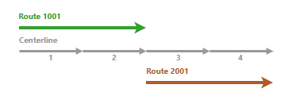

# Merge Centerlines

| Field | Value |
| --- | --- |
| **Doc** | 87 · Other · Pro |
| **Product** | Roads & Highways |
| **Release** | — |
| **Issues** | — |
| **Source** | [RH_MergeCenterlines.docx](<https://esriis.sharepoint.com/sites/LocationReferencing/Shared%20Documents/General/Doc%20Reviews/Pro37_Ent121/363_MergeCenterlines/RH_MergeCenterlines.docx>) |
| **People** | author Kyle Chin · PE — · dev — |
| **Edited** | 2026-01-05 19:51 by Mac Christmas |
| **Extracted** | 2026-09-04 · lane xmlstrip · format 3.0 · prompt v2.0.2 |
| **Keywords** | centerline · merge · route · feature service · attribute matching · segmentation · location referencing |
| **Tools** | Merge Centerlines |

## Summary

Describes the Merge Centerlines tool in ArcGIS Roads and Highways for editing centerline feature classes by merging centerlines associated with a common route. Details requirements for merging, valid and invalid merge scenarios, and the workflow to perform merges in ArcGIS Pro.

## Related documents

<!-- related:begin -->
- [Merge Centerlines](<https://esriis.sharepoint.com/sites/lrsworkspace/LRS Doc Index/Other/merge-centerlines-apr-un.md>) — similar text 0.54 · 2 title words · 2 filename words · same kind/surface/folder <!-- rel:97 s=6.602 -->
- [Merge Centerlines Test Plan](<https://esriis.sharepoint.com/sites/lrsworkspace/LRS Doc Index/Test Plans/363-merge-centerlines.md>) — similar text 0.15 · 2 title words · 2 filename words · same surface <!-- rel:103 s=4.19 -->
- [Manage address and roadway characteristic data together](<https://esriis.sharepoint.com/sites/lrsworkspace/LRS Doc Index/Other/manage-address-and-roadway-characteristic-data-together.md>) — similar text 0.22 · same kind/surface/folder <!-- rel:96 s=3.297 -->
- [Merge Events User Story](<https://esriis.sharepoint.com/sites/lrsworkspace/LRS Doc Index/User Stories/merge-events.md>) — similar text 0.12 · 1 title word · 1 filename word · same surface <!-- rel:675 s=2.317 -->
- [Merge Events Pro Test Plan](<https://esriis.sharepoint.com/sites/lrsworkspace/LRS Doc Index/Test Plans/3921-merge-events-pro.md>) — similar text 0.11 · 1 title word · 1 filename word · same surface <!-- rel:647 s=2.297 -->
<!-- related:end -->

<!-- docs:begin -->
## Esri documentation

[Merge centerlines](https://doc.esri.com/en/arcgis-pro/latest/help/production/roads-highways/merge-centerlines.html) · [Edit feature services](https://doc.esri.com/en/arcgis-pro/latest/help/production/roads-highways/edit-feature-services.html) · [Apply dynamic segmentation](https://doc.esri.com/en/arcgis-pro/latest/help/production/roads-highways/apply-dynamic-segmentation.html) · [Set Location Referencing options](https://doc.esri.com/en/arcgis-pro/latest/help/production/roads-highways/set-location-referencing-options.html)
<!-- docs:end -->

---

## Merge centerlines
The Merge Centerlines  tool is a centerline feature class editing tool available in ArcGIS Roads and Highways. This tool reduces segmentation by merging centerlines that are associated with a common route. Once centerlines are merged, the records in the centerline sequence table are updated accordingly.
The following requirements must be met for the centerlines to be merged:

- The centerline layer is part of a feature service that is published with the Linear Referencing and Version Management capabilities.
- All attributes except the centerline ID must be identical across individual centerlines.
- The centerline IDs must either all be null or all be populated.
- The centerlines must be associated with the same route across all time slices.
- The centerlines must be single part line features.
- Gaps must not exist between individual centerlines.
- The centerlines must not form a complex shape.
- Overlapping centerlines can be merged only if they are not associated with a route.

If the centerline feature class is part of an Address Data Management configuration, additional requirements apply:

- All attributes must be identical across individual centerlines, except for those of the centerline ID, FromLeft, ToLeft, FromRight, and ToRight fields.
- The centerlines must be in the same digitized direction.

### Valid merge scenarios
Valid merge scenarios are described below.

#### Centerlines have matching attributes
The following image and table show route and centerlines before a merge:

| Route | Centerline | Status |
| --- | --- | --- |
| 1001 | 1 | Active |
| 1001 | 2 | Active |
| 1001 | 3 | Active |
| 1001 | 4 | Active |

The following image and table show a successful merge when the centerlines have matching attributes:

| Route | Centerline | Status |
| --- | --- | --- |
| 1001 | 1 | Active |

#### Centerlines are associated with multiple routes

In the following example, the first three centerlines are associated with multiple routes, but they can still be merged as long as the route shape and association remain intact after the merge:

### Invalid merge scenarios
Invalid merge scenarios are described below.

#### Centerlines do not have matching attributes
In the following example, the Merge Centerlines tool returns an error because the centerlines do not have matching attributes:

| Route | Centerline | Status |
| --- | --- | --- |
| 1001 | 1 | Active |
| 1001 | 2 | Active |
| 1001 | 3 | Active |
| 1001 | 4 | Scheduled |

#### Centerlines are associated with multiple routes
In the following example, if all four centerlines are selected, the Merge Centerlines tool returns an error because the centerlines are associated with multiple routes:

#### Centerline IDs contain a mix of null and populated values
In the following example, if all four centerlines are selected, the Merge Centerlines tool returns an error because two centerlines are associated with a route, while the other two centerlines are not:

| Centerline | Centerline ID |
| --- | --- |
| 1 | {AD27FCC9-DCA1-4BC6-A869-6ACEDCBBE970} |
| 2 | {DEBC0EE7-60DF-483C-95B3-9B3239F10DB8} |
| 3 | <Null> |
| 4 | <Null> |

### Merge centerlines workflow

### To merge centerlines, complete the following steps:

1. Add the centerline feature class and network feature class to a map in ArcGIS Pro.
You can also open a map in which the centerline and network layers are already 	present.
Note:
The centerline feature class	must be edited through a feature service.

1. Zoom to the centerlines that you want to merge.

1. On the map, select two or more centerlines to be merged.

1. On the Location Referencing tab, in the Tools group, click Merge Centerlines .
The selected centerlines are merged.

	Note:
If conflict prevention is enabled, the route associated with the centerlines will be 	locked.

