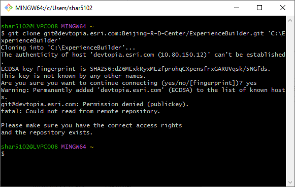
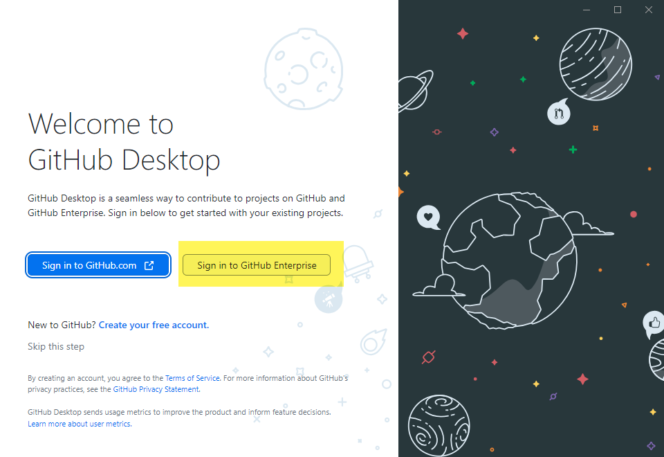
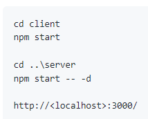
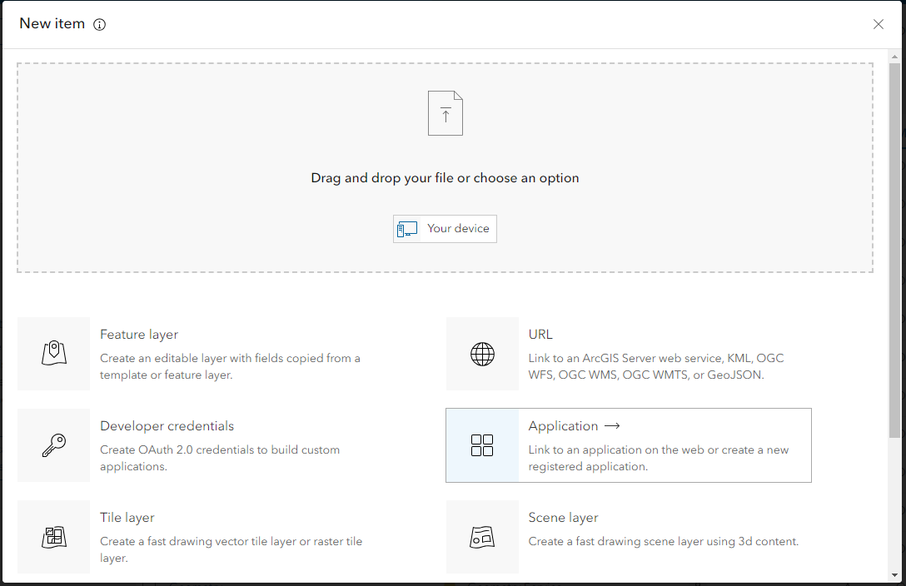

# Notes for Experience Builder Setup

|   |   |
| --- | --- |
| **Kind** | Other · Experience Builder |
| **Release** | — |
| **Source** | [Notes for ExB setup.docx](<https://esriis.sharepoint.com/sites/LocationReferencing/Shared%20Documents/LR%20Developers/Notes%20for%20ExB%20setup.docx>) |
| **Edited** | 2023-10-25 21:27 by Sharon Lai |
| **Extracted** | 2026-09-04 · lane `xmlstrip` |

<!-- metadata
```yaml
title: "Notes for Experience Builder Setup"
source_file: "Notes for ExB setup.docx"
source_url: "https://esriis.sharepoint.com/sites/LocationReferencing/Shared%20Documents/LR%20Developers/Notes%20for%20ExB%20setup.docx"
doc_id: 477
doc_kind: "Other"
surface: "Experience Builder"
doc_revision: ""
target_release: ""
pe: ""
dev: ""
author: "Sharon Lai"
last_edited_by: "Sharon Lai"
last_edited: "2023-10-25T21:27:00Z"
extracted: 2026-09-04
extraction_lane: xmlstrip
prompt_version: "v2.0.2"
keywords: ["experience builder", "setup", "node.js", "widget development", "custom widget", "portal client id"]
tools: []
products: []
issues: []
related: [{"doc":700,"file":"arcgis-experience-builder-collaboration-workflow__doc700.md","s":3.538},{"doc":735,"file":"developer-server-setup__doc735.md","s":2.464},{"doc":824,"file":"spike-experience-builder__doc824.md","s":2.202},{"doc":228,"file":"sql-server-setup-notes__doc228.md","s":1.91},{"doc":455,"file":"experience-builder-add-single-line-event-widget__doc455.md","s":1.873}]
```
-->

## Summary

Instructions and notes for setting up the Experience Builder development environment, including installing node.js, cloning repositories, installing dependencies, starting the developer edition, creating applications on the portal, and configuring custom widgets.

## Related documents

<!-- related:begin -->
- [ArcGIS Experience Builder Collaboration Workflow](<https://esriis.sharepoint.com/sites/lrsworkspace/LRS%20Doc%20Index/Other/arcgis-experience-builder-collaboration-workflow__doc700.md>) — similar text 0.17 · 2 title words · same kind/surface/folder <!-- rel:700 -->
- [Developer Server Setup](<https://esriis.sharepoint.com/sites/lrsworkspace/LRS%20Doc%20Index/Other/developer-server-setup__doc735.md>) — similar text 0.19 · 1 title word · 1 filename word · same kind/folder <!-- rel:735 -->
- [Spike: Experience Builder](<https://esriis.sharepoint.com/sites/lrsworkspace/LRS Doc Index/Design Spikes/spike-experience-builder__doc824.md>) — similar text 0.06 · 2 title words · same surface <!-- rel:824 -->
- [SQL Server Setup Notes](<https://esriis.sharepoint.com/sites/lrsworkspace/LRS Doc Index/Other/sql-server-setup-notes__doc228.md>) — similar text 0.16 · 1 title word · 1 filename word · same kind <!-- rel:228 -->
- [Experience Builder: Add Single Line Event Widget](<https://esriis.sharepoint.com/sites/lrsworkspace/LRS Doc Index/User Stories/experience-builder-add-single-line-event-widget__doc455.md>) — similar text 0.16 · 2 title words · same surface <!-- rel:455 -->
<!-- related:end -->

<!-- docs:begin -->
## Esri documentation

_No page matched:_ [experience builder](https://www.google.com/search?q=%22experience%20builder%22+site%3Adoc.esri.com)
<!-- docs:end -->

---

Notes for ExB setup:

- https://developers.arcgis.com/experience-builder/guide/install-guide/#create-client-id-using-arcgis-online-or-arcgis-enterprise
- Check the checkbox when installing node.js:
- https://devtopia.esri.com/Beijing-R-D-Center/ExperienceBuilder#clone-repo
  - If Git Bash doesn’t work, use Git Desktop instead
  - Sign in to GitHub Enterprise
  - Choose clone from internet
  - Can skip setting up self signed certificate.
  - Do the same with https://devtopia.esri.com/Beijing-R-D-Center/ExperienceBuilder-Web-Extensions repo under client and rename the folder “ExperienceBuilder-Web-Extensions” to “extensions”.
- Install dependencies in PowerShell as Admin:
  - cd C:\ExperienceBuilder
  - npm ci
- Start up (Developer Edition)
- Create application on portal to get the Client ID:
- Copy the Client ID from above and paste here:
  - https://localhost:3001
  - Replace lvpc008 with your portal machine name.
- Download Visual Studio Code https://code.visualstudio.com/download.
  - Once launch, File -> Open Folder -> C:\ExperienceBuilder
- To view the Select by Route widget under the Custom section in Experience Builder:
  - Copy \\lrtest\c$\Widgets\search-by-route  and paste into C:\ExperienceBuilder\client\extensions\widgets\arcgis.
  - Configure the map widget using webmap.
- Use C:\ExperienceBuilder\client\extensions\widgets\samples\simple as a starting point to create your first widget.

           
