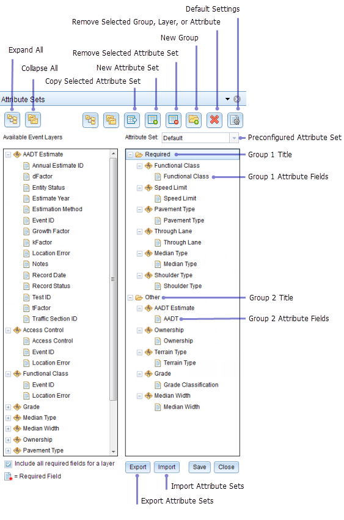
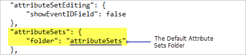
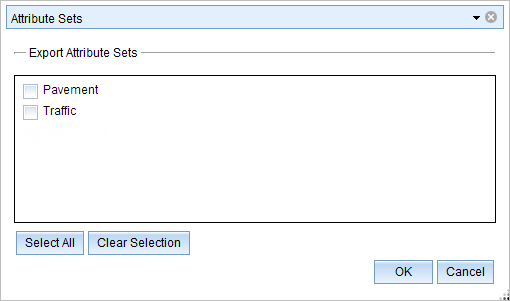

# Producing Attribute Sets

| Field | Value |
| --- | --- |
| **Doc** | 551 · Other · Experience Builder |
| **Product** | Roads & Highways |
| **Release** | — |
| **Issues** | — |
| **Source** | [RH_EEattset_produce.docx](<https://esriis.sharepoint.com/sites/LocationReferencing/Shared%20Documents/General/Doc%20Reviews/5102_AttributeSetsInCIM/RH_EEattset_produce.docx>) |
| **People** | author — · PE — · dev — |
| **Edited** | 2023-06-07 17:52 by Claire Wang |
| **Extracted** | 2026-09-04 · lane xmlstrip · format 3.0 · prompt v2.0.2 |
| **Keywords** | attribute sets · event layers · add linear events · event editor · config.json · rhas file · preconfigured attribute set |
| **Tools** | Add Linear Events |

## Summary

This document explains the creation, configuration, modification, export, and usage of attribute sets within the ArcGIS Event Editor for managing event layer attributes in the Add Linear Events widget. It details the structure of attribute sets, user interface buttons, and configuration via the config.json file. It also covers how attribute sets are stored, shared, and accessed in enterprise geodatabase environments.

## Related documents

<!-- related:begin -->
- [Producing Attribute Sets](<https://esriis.sharepoint.com/sites/lrsworkspace/LRS Doc Index/Other/producing-attribute-sets-apr.md>) — similar text 0.87 · 3 title words · 2 filename words · same kind/folder <!-- rel:552 s=7.53 -->
- [Configuring Attribute Sets](<https://esriis.sharepoint.com/sites/lrsworkspace/LRS Doc Index/Other/configuring-attribute-sets-apr.md>) — similar text 0.60 · 2 title words · 1 filename word · same kind/surface/folder <!-- rel:554 s=5.207 -->
- [Configuring Attribute Sets](<https://esriis.sharepoint.com/sites/lrsworkspace/LRS Doc Index/Other/configuring-attribute-sets-rh.md>) — similar text 0.60 · 2 title words · 1 filename word · same kind/surface/folder <!-- rel:553 s=5.198 -->
- [Configure Attribute Sets](<https://esriis.sharepoint.com/sites/lrsworkspace/LRS Doc Index/Other/configure-attribute-sets-rh.md>) — similar text 0.37 · 2 title words · same kind/folder <!-- rel:555 s=3.249 -->
- [Configure Attribute Sets](<https://esriis.sharepoint.com/sites/lrsworkspace/LRS%20Doc%20Index/Other/configure-attribute-sets-apr.md>) — similar text 0.35 · 2 title words · same kind/folder <!-- rel:556 s=3.216 -->
<!-- related:end -->

<!-- docs:begin -->
## Esri documentation

_No page matched:_ [Add Linear Events](https://www.google.com/search?q=%22Add%20Linear%20Events%22+site%3Adoc.esri.com)
<!-- docs:end -->

---

## Producing attribute sets
Attribute sets provide the functionality to designate selected attributes for inputs. They are used to designate the event layers and columns in the layers for which values are provided in the Add Linear Events widget. In enterprise geodatabase, the administrator can create preconfigured attribute sets that can be accessed by any person using the ArcGIS Event Editor. These preconfigured attribute sets are published to service along with other data in the map, and they cannot be modified by other people in Event Editor. A person can create attribute sets that are stored in the web browser for local access or import attribute sets created by other persons.
Learn more about configuring attribute sets and adding linear events by route and measure.

As shown in the figure, the preconfigured attribute set contains two groups: Required and Other. The Required group contains six attribute fields: Functional Class, Speed Limit, Pavement Type, Through Lane, Median Type, and Shoulder Type. The Other group contains five attribute fields.
The attribute sets are useful in limiting the number of record input fields while using the Add Linear Events widget. Editors can enter records only in the fields provided by the attribute sets.

| Button | Name | Description |
| --- | --- | --- |
|  | Expand All | Shows all the attribute fields present in each event layer. |
|  | Collapse All | Hides the attribute fields to show only the event layers. |
|  | Copy Selected Attribute Set | Copies all the attribute fields present in an event from the left panel to the attribute group in the right panel. The copy is made permanent only when you click the Save button. |
|  | New Attribute Set | Creates an attribute set. The attribute sets created by using this button are saved in the browser. Therefore, these attribute sets are available only to the user's browser. |
|  | Remove Selected Attribute Set | Removes the selected attribute set from the widget. The administrator-configured attribute sets cannot be removed using this button. |
|  | New Group | Creates a group in the right panel. A group contains event attribute fields. An attribute set is made up of one or more groups. The group is saved permanently by clicking the Save button. |
|  | Remove Selected Group, Layer, or Attribute | Removes a selected group, layer, or attribute from the right panel. The removal is made permanent by clicking the Save button. |
|  | Default Settings | Allows configuration of default settings for attribute sets. These settings include the default network, from method, from measure units, to method, and to measure units for the Add Linear Events widget. |

- Note:
- You cannot modify or remove a preconfigured attribute set that is read from service or from the default Attribute Set folder in Event Editor. You can modify or remove an attribute set that is stored in the web browser for local access or imported from an .rhas file.

### Modifying the attributeSets folder
By default, the Event Editor is configured to use the attributeSets folder. You can modify the configuration to use a different folder for your attribute sets by editing the config.json file of Event Editor.

1. In the Event Editor folder, rename the attributeSets folder or create a folder in which attribute sets will be stored.

1. Open the config.json file in a text editor such as Notepad.

- Learn more about using the config.json file to configure the ArcGIS Event Editor web app

1. In the config.json file, browse to the attributeSets section.

1. Browse to the subsection titled folder.

- Here, you can modify the default attributeSets folder by changing the folder name.
- Replace the default attributeSets with the name of the folder where you will store your .rhas files.

### Exporting a set

### You can export an attribute set using the following steps:

1. In the Event Editor, click the Edit tab.

1. Click the Modify Attribute Sets button .

- The Attribute Sets dialog box appears.

1. Create an attribute set.

- Note:
- Alternatively, you can import and modify existing attribute sets shared with you by another person.

1. Click Export.

- The Export Attribute Sets dialog box appears.

1. Select the attribute sets you want to export.

- To select all attribute sets, click Select All.
- To clear selected attribute sets, click Clear Selection.

1. When you are ready to export, click OK.

- Your attribute sets will be exported to an attribute set (.rhas) file.
- Note:
- If you have multiple Event Editor configured in one deployment, you may need to provide a separate attribute sets folder for each configuration. If not, the same attribute sets will be visible across all configurations.

1. Browse to the location of the Event Editor folder and open the attributeSets subfolder. Alternatively, if you specified a different attributeSets folder using the config.json file, open that folder.

- Note:
- The attributeSets folder is created upon installation of ArcGIS Roads and Highways

1. Add the .rhas file you exported in step 6 to the attributeSets folder.

- Your attribute sets can now be accessed by any person using the Event Editor.

1. In a web browser, browse to the Event Editor web app.

1. Click the Edit tab, and click the Add Line Events button .
The preconfigured attribute set can be used to record attributes in this widget.

- https://enterprise.arcgis.com/en/ \h Home
- Portal
- Server
- Data Stores
- Cloud
- Apps
- Documentation

###### ArcGIS

- ArcGIS Online
- ArcGIS Pro
- ArcGIS Enterprise
- ArcGIS
- ArcGIS Developer
- ArcGIS Solutions
- ArcGIS Marketplace

###### About Esri

- About Us
- Careers
- Esri Blog
- User Conference
- Developer Summit

Copyright © 2023 Esri. All rights reserved. | Privacy | Manage Cookies | Legal

