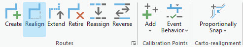

# Realign Routes

|   |   |
| --- | --- |
| **Kind** | Other · Pro |
| **Release** | 3.6 |
| **Product** | Pipeline Referencing · Utility Network |
| **Issue** | [ArcGISPro/ps-location-referencing#6125](https://devtopia.esri.com/ArcGISPro/ps-location-referencing/issues/6125) |
| **Source** | [6125_APR_Realign routes.docx](<https://esriis.sharepoint.com/sites/LocationReferencing/Shared%20Documents/General/Doc%20Reviews/Pro36_Ent12/6125_APR_Realign%20routes.docx>) |
| **Edited** | 2025-09-19 20:52 by unknown |
| **Extracted** | 2026-09-04 · lane `xmlstrip` |

<!-- metadata
```yaml
title: "Realign Routes"
source_file: "6125_APR_Realign routes.docx"
source_url: "https://esriis.sharepoint.com/sites/LocationReferencing/Shared%20Documents/General/Doc%20Reviews/Pro36_Ent12/6125_APR_Realign%20routes.docx"
doc_id: 119
doc_kind: "Other"
surface: "Pro"
doc_revision: ""
target_release: "3.6"
pe: ""
dev: ""
author: ""
last_edited_by: ""
last_edited: "2025-09-19T20:52:20.7672392Z"
extracted: 2026-09-04
extraction_lane: xmlstrip
prompt_version: "v2.0.2"
keywords: ["route realignment", "centerlines", "pipeline referencing", "engineering stationing", "continuous measure", "abandoned routes", "utility network", "equation point"]
tools: ["Realign"]
products: ["Pipeline Referencing", "Utility Network"]
issues: ["ArcGISPro/ps-location-referencing#6125"]
related: [{"doc":507,"file":"reassign-routes__doc507.md","s":3.157},{"doc":50,"file":"arcgis-pro-ai-assistant-realign-route-subsequent-panes-test-plan__doc50.md","s":3.119},{"doc":120,"file":"add-multiple-line-events-by-route-and-measure__doc120.md","s":3.117},{"doc":508,"file":"reassign-routes__doc508.md","s":3.106},{"doc":91,"file":"pro-ai-assistant-realign-route-user-story__doc91.md","s":2.878}]
```
-->

## Summary

This document describes the process and parameters for realigning routes in ArcGIS Pipeline Referencing using centerline features. It covers scenarios for engineering stationing and continuous measure networks, complex route realignments, abandoned route reassignment, and realignment within utility network datasets. The document also details the use of the Realign tool, selection and ordering of centerlines, and the effects of recalibration and measure changes on route creation and retirement.

## Related documents

<!-- related:begin -->
- [Reassign Routes](<https://esriis.sharepoint.com/sites/lrsworkspace/LRS Doc Index/Other/reassign-routes__doc507.md>) — similar text 0.41 · 1 title word · 1 filename word · same kind/surface <!-- rel:507 -->
- [ArcGIS Pro AI Assistant: Realign Route Subsequent Panes Test Plan](<https://esriis.sharepoint.com/sites/lrsworkspace/LRS Doc Index/Test Plans/arcgis-pro-ai-assistant-realign-route-subsequent-panes-test-plan__doc50.md>) — similar text 0.21 · 1 title word · 1 filename word · same surface <!-- rel:50 -->
- [Add multiple line events by route and measure](<https://esriis.sharepoint.com/sites/lrsworkspace/LRS Doc Index/Other/add-multiple-line-events-by-route-and-measure__doc120.md>) — similar text 0.23 · 1 filename word · same kind/surface/folder <!-- rel:120 -->
- [Reassign Routes](<https://esriis.sharepoint.com/sites/lrsworkspace/LRS%20Doc%20Index/Other/reassign-routes__doc508.md>) — similar text 0.40 · 1 title word · 1 filename word · same kind/surface <!-- rel:508 -->
- [Pro AI Assistant Realign Route User Story](<https://esriis.sharepoint.com/sites/lrsworkspace/LRS%20Doc%20Index/User%20Stories/pro-ai-assistant-realign-route-user-story__doc91.md>) — similar text 0.18 · 1 title word · 1 filename word · same surface <!-- rel:91 -->
<!-- related:end -->

<!-- docs:begin -->
## Esri documentation

[Realign routes](https://doc.esri.com/en/arcgis-pro/latest/help/production/location-referencing-pipelines/realign-routes.html) · [Split a centerline by point](https://doc.esri.com/en/arcgis-pro/latest/help/production/location-referencing-pipelines/split-a-centerline.html) · [3D in Pipeline Referencing](https://doc.esri.com/en/arcgis-pro/latest/help/production/location-referencing-pipelines/3d-in-pipeline-referencing.html) · [Configure continuous measure networks and events to update with an engineering network](https://doc.esri.com/en/arcgis-pro/latest/help/production/location-referencing-pipelines/configure-continuous-measure-networks-and-events-to-update-with-an-engineering-network.html) · [View utility network feature class properties](https://doc.esri.com/en/arcgis-pro/latest/help/production/location-referencing-pipelines/view-utility-network-feature-class-properties.html)
<!-- docs:end -->

---

## Realign routes
During the lifespan of a pipeline, route geometry and length can change. Route sections are updated while others are added. Major changes, such as environmental concerns, building a new pumping station, or repair work, can require a change in the shape of the route's geometry and length. ArcGIS Pipeline Referencing uses centerlines to make realignments. The Realign tool can be used to realign a single route or to realign several adjoining routes that are part of the same line.
Centerline features used to realign routes can be existing features in the centerline feature class, be digitized into the centerline feature class (using aerial photography or other basemaps for guidance), be copied and pasted from other feature classes, or be imported from CAD files or other ArcGIS-supported data sources.
The following tables list parameters used in the Realign tool.

##### Parameters used for Engineering Stationing networks

| Parameter | Description |
| --- | --- |
| Network | The network in which the Engineering Stationing routes exist. |
| Effective Date | The date when the realignment has taken place on the ground. |
| Source Route: From Route Name | The route where the realignment starts. |
| Source Route: From Measure | The measure on the source route where the realignment starts; shown by the green dot. |
| Source Route: To Route Name | The route where the realignment ends. In the case where the realignment takes place on a single route, the source route and target route are the same. |
| Source Route: To Measure | The measure on the target route where the realignment ends; shown by the red dot. |
| Realigned Route: From Measure | The starting measure on the realigned portion. |
| Realigned Route: To Measure | The ending measure on the realigned portion. |
| Realigned Route: Abandon the route(s) | Choose whether to abandon the source routes or to retire them. |
| Realigned Route: Recalibrate route downstream | Choose whether the tool recalibrates the route downstream of the realignment measures. |

##### Parameters used for Continuous Measure networks

| Parameter | Description |
| --- | --- |
| Network | The network in which the continuous routes exist. |
| Effective Date | The date when the realignment has taken place on the ground. |
| Source Route: Route Name | The route where the realignment takes place. |
| Source Route: From Measure | The measure on the source route where the realignment starts; shown by the green dot. |
| Source Route: To Measure | The measure on the source route where the realignment ends; shown by the red dot. |
| Realigned Route: From Measure | The starting measure on the realigned portion. |
| Realigned Route: To Measure | The ending measure on the realigned portion. |

### Route realignment scenarios
In the following examples, RouteX has a start measure of 0 and an end measure of 10 before realignment. The line order is 100.
In this example, the source measure and target measure of the realigned portion of the route are the measures suggested by Pipeline Referencing.

Before realignment, the RouteX edit region has a start measure of 2 and an end measure of 6.

| Example 1: Source |  |
| --- | --- |
| From Route | RouteX |
| From Measure | 2 |
| To Route | RouteX |
| To Measure | 6 |
| Recalibrate | Yes |

After realignment, RouteX is realigned with updated downstream measures due to recalibration. The line order remains 100.

| Example 1: Realigned |  |
| --- | --- |
| From Measure | 2 |
| To Measure | 10 |
| Recalibrate | Yes |

In the second example, there is no downstream recalibration after the realigned portion of the route. This results in an equation at the To Measure of the realigned route.

| Example 2: Source |  |
| --- | --- |
| From Route | RouteX |
| From Measure | 2 |
| To Route | RouteX |
| To Measure | 6 |
| Recalibrate | No |

After realignment, a new route (RouteA) is created from the start of the source route to the end of the realignment section, which is the To Measure location of the realigned route. RouteA gets the line order of 100 and RouteX’s line order changes to 200.

| Example 2: Realigned |  |
| --- | --- |
| From Measure | 2 |
| To Measure | 10 |
| New Route | RouteA |
| Recalibrate | No |

Alternatively, if the To Measure of the realigned route is changed before the tool is run, an equation occurs at the From Measure and To Measure locations, and two routes are created.
Note:
An equation can occur if you don't use Pipeline Referencing suggested measures.

| Example 3: Source |  |
| --- | --- |
| From Route | RouteX |
| From Measure | 2 |
| To Route | RouteX |
| To Measure | 6 |
| Recalibrate | Yes |

After realignment, the first new route (RouteA) starts and ends at the to and from of the realign portion. The second new route (RouteB) starts from the end of the realign portion and goes until the end of the original route. RouteX’s line order remains 100, RouteA gets a line order of 200, and RouteB gets a line order of 300.
Similarly, if the From Measure and To Measure of the realigned route are changed so that it results in an equation at the From Measure and To Measure locations, and recalibrating downstream is chosen, then two routes are created. The first new route (RouteA) starts and ends at the start and end of the realign portion. The second new route (RouteB) starts from the end of the realign portion and goes until the end of the original route.

| Example 3: Realigned |  |
| --- | --- |
| From Measure | 3 |
| To Measure | 10 |
| New Route | RouteA |
| New Route | RouteB |
| Recalibrate | No |

In the fourth case, if the From Measure of the realigned route is changed in such a way that it results in an equation, which can happen when Pipeline Referencing suggested measures are not used, and recalibrating downstream is chosen, then a new route is created.

| Example 4: Source |  |
| --- | --- |
| From Route | RouteX |
| From Measure | 2 |
| To Route | RouteX |
| To Measure | 6 |

The new route (RouteA) starts at the start of the realign portion and goes until the end of the original route. RouteX’s line order remains 100 and RouteA gets a line order of 200.

| Example 4: Realigned |  |
| --- | --- |
| From Measure | 3 |
| To Measure | 12 |
| New Route | RouteA |
| Recalibrate | Yes |

### Abandoned route reassignment
The default option in Pipeline Referencing is to reassign any realigned routes to abandoned routes (new routes in the network), rather than retire them. The workflow described previously is still applicable to the realignment. Instead of retiring the existing routes as of the effective date of the edit, abandoned routes are created to represent assets that are still present, but not in use.
Leave the Reassign to abandoned route(s) check box checked to show the names of any abandoned routes that are created, as well as the line to which they belong.
You can also provide any required attributes for the abandoned route or routes at this time, or check the Apply values to all routes check box to provide the same values for all abandoned routes.
The following diagrams show before and after reassignment to abandoned routes that have the _aAb suffix.

Note:
If a message regarding acquiring locks or reconciling appears, conflict prevention is enabled.

### Complex route realignment scenarios
Complex route realignment scenarios, including loop, lollipop, gapped, branch, and infinity routes are described below.

#### Realignment on a loop route
The route is realigned from measure 0 to measure 4, which is from the beginning to the middle of the route. In the following example, RouteX has a start measure of 0 and an end measure of 12 before realignment:

Without downstream recalibration, an equation point is created at measure 4 of RouteX. This results in the creation of a new route (RouteA) from measure 0 to measure 9.5.
RouteA is assigned line order 100, and the RouteX line order changes to 200.

#### Realignment on a lollipop route
RouteX is realigned from measure 8 to measure 15. In the following example, RouteX has a start measure of 0 and an end measure of 15 before realignment:

As realignment is from the middle to the end, downstream recalibration does not apply. RouteX is realigned with a start measure of 0 and an end measure of 17. The realigned section is assigned measures 8 to 17.
The line order remains unchanged.

#### Realignment on a gapped route
RouteX is realigned from measure 1 to measure 3. In the following example, a gapped route has a start measure of 0 and an end measure of 4 before realignment:

Without downstream recalibration, an equation point is created at measure 3 on RouteX. This results in the creation of a new route (RouteA) from measure 0 to measure 11.
As a result, RouteA is assigned line order 100 and the RouteX line order changes to 200.

#### Realignment on an infinity route
RouteX is realigned from measure 7 to measure 11. In this realignment, the suggested starting measure value is not used. The starting measure value of 10 for the realignment section is the input value and the ending measure value of 16 is calculated using the geometrical length of the centerline. In the following example, RouteX has a start measure of 0 and an end measure of 24 before realignment:

As the suggested measure is not used, an equation point is created at measure 7 of RouteX resulting in a new route (RouteA). Without downstream recalibration, another equation point is created at measure 16 of RouteA. This results in the creation of another new route (RouteB) from measure 11 to measure 24.
The RouteX line order remains 100, and RouteA and RouteB are assigned a line order of 200 and 300, respectively.

#### Realignment on a branch route
In the following example, RouteX has a start measure of 0 and an end measure of 9 before realignment is realigned in the middle:

Without downstream recalibration, an equation point is created at measure 3 of RouteX. This results in the creation of a new route (RouteA) from measure 0 to measure 6.
RouteA is assigned the line order 100, and the RouteX line order changes to 200.

### Realign Routes
In the following example, there are three routes across a line. A route realignment is scheduled to take place between RouteX and RouteZ.
The following diagram shows the routes before the realignment:

The following table provides details about the routes before the realignment:

| Route N ame | From Measure | To Measure | Line O rder |
| --- | --- | --- | --- |
| RouteX | 0 | 7 | 100 |
| Route Y | 7 | 24 | 200 |
| RouteZ | 2 4 | 30 | 300 |

To realign a route, complete the following steps:
Note:
https://prodev.arcgis.com/en/pro-app/3.5/help/production/location-referencing-pipelines/methods-for-calibrating-routes-with-physical-gaps.htm \hGap calibration rules are followed when editing routes.

- Add the centerline and network feature class to a map.
- Alternatively, open a map in which the centerline and network feature class are present.
- Note:
- In the data model, only one centerline is expected at any given location. Ensure that the centerlines used for your edit do not overlap other centerlines in the LRS.
- Branch versioned networks, including any network configured with a user-generated route ID, must be edited through a feature service.
- Zoom in to the location where you want to realign the route.
- Note:
- The centerline feature for realigning the route must exist in the centerline feature class before realigning the route.
- On the Location Referencing tab, in the Routes group, click Realign .
- The Realign Route pane appears with the Select By Rectangle option  active by the default.
- Select one or more centerlines by rectangle at the location of the new route.
- You can also click the Select one or more centerlines drop-down arrow and choose one of the other selection tools: Select By Polygon , Select By Lasso , Select By Circle , Select By Line , or Select By Trace .
- Alternatively, use the interactive selection tools on the Map tab:
- The selected centerlines are highlighted on the map, and the Allow choosing of one or more centerlines button  appears in the Realign Route pane. The selected centerlines count is shown above the table.
- Note:
- The direction of digitization of the centerline, depicted by the direction of the arrowhead on the selected centerline, also determines the direction of increasing measure calibration. You can reverse direction for the chosen centerlines using the Flip the direction of the centerlines button . This leads to an in-memory flip of the centerline's direction and the change in direction is not permanent.
- You can keep the centerlines chosen after realigning the route. This option is particularly useful if you are realigning a route in the Engineering Stationing network and want to realign another route for the Continuous network using the same centerlines, or vice versa.
- If the centerline was created as a curve, Pipeline Referencing will convert the curve into a densified polyline feature.
- Click the Allow choosing of one or more centerlines button .
- A table appears in the Realign Route pane with each chosenselected centerline in a numbered row that corresponds to the selection order. ChosenThe selected centerlines are numbered on the map and highlighted. The count is shown above the table.
- Optionally, choose one or more rows from the Order column and use the buttons below the table to change the centerline selection order. You can also drag rows to change the order.
- Changes in the table selection order are also shown on the map.

##### Tools available in the centerlines table

| Tool | Tool name | Tool description |
| --- | --- | --- |
|  | Allow choosing of one or more centerlines | Allows you to choose the centerlines on the map and displays them in a table by order of selection. Use the move buttons below the table or drag rows to reorder the chosen centerlines. |
|  | Clear the currently chosen centerlines | Clears the chosen centerlines and keeps the selected centerlines. You can reselect after clicking this button or click the Allow choosing one or more centerlines button a second time. |
|  | Move chosen centerlines up | Moves one or more selected centerlines up a row in the table order. |
|  | Move chosen centerlines to the top | Moves one or more centerlines to the top of the table order. |
|  | Move chosen centerlines down | Moves one or more centerlines down a row in the table order. |
|  | Move chosen centerlines to the bottom | Moves one or more centerlines to the bottom of the table order. |
|  | Flip the direction of the centerlines | Reverses the direction of the chosen centerlines. This leads to an in-memory flip of the centerlines' direction and the change in direction is not permanent. |
|  | Remove the chosen centerlines | Removes the chosen centerline from the table order but leaves it selected. |

- Tip:
- To change the display field in the centerlines table, right-click the centerline feature class in the Contents pane and choose Properties from the context menu. On the Layer Properties dialog box, click the Display tab, and click the Display field drop-down arrow to change its value. In the previous image, the display field is OBJECTID.
- In the Realign Route pane, choose the network in which you want to realign a route.
- Note:
- To edit using feature services, the LRS Network must be published with the Linear Referencing and Version Management capabilities.
- Click the Specify an effective date for the realignment in the Effective Date drop-down arrow text box to choose an effective date for the realignment.
  - Optionally, provide the date in the Effective Date text box.
  - Optionally, dDouble-click the empty Effective Date text box to populate today's date.
- Optionally, if the centerline doesn't touch the route, use the pickers to populate the From Route Name, To Route Name, From Measure, and To Measure parameters.
- If the centerline touches the routes, the From Route Name, From Measure, To Route Name, and To Measure parameters in the Source Route section are automatically populated.
- Note:
- After clicking the Choose route from map button  or the Choose measure from map button , you can hover over the routes to see the route and measure at the location of the pointer.
- If only one applicable route exists at the edit location, click to select it. If multiple routes are applicable, click to select one of the applicable routes using the Select Route dialog box.
- Note:
- You can also check the Reassign to abandoned route(s) check box to create routes to represent assets that are present but not in use.
- https://prodev.arcgis.com/en/pro-app/3.5/help/production/location-referencing-pipelines/realign-routes.htm  https://prodev.arcgis.com/en/pro-app/3.5/help/production/location-referencing-pipelines/realign-routes.htm  \hLearn more about reassigning to an abandoned routeNote:
Note:
In this example, the Reassign to abandoned route(s) option is checked. Routes that represent assets that are present but not in use will be created.

- https://prodev.arcgis.com/en/pro-app/3.5/help/production/location-referencing-pipelines/realign-routes.htm  https://prodev.arcgis.com/en/pro-app/3.5/help/production/location-referencing-pipelines/realign-routes.htm  \hLearn more about reassigning to an abandoned route
- Note:
- For a the line network, the measures can be entered as station values in 00+00.00 or 00+00.000 format.
- Optionally, provide a start From mMeasure value.
- The From Measure value in the Realigned Route section is automatically populated.
- Note:
- Z-values are considered when calculating the geometric length of the centerlines.
- Learn how centerlines and routes support z-values
- Optionally, provide an end Target mMeasure value of your choice.
- The Targeto Measure value is automatically populated in the Realigned Route section.
- Note:
- In this example, the Recalibrate route downstream option is not checked. A new route will be created in the realigned portion.
- Click Run.
- The Realign Route pane transitions to the next page, in which the routes to be abandoned retired due to the realignment are listed.
- Choose one of the following options.

| If the realignment results in the creation of a new route and/ or abandoned routes | Click Next and proceed to step 14 . The next screen allows you to give the new route a name and fill in any attributes you choose. |
| --- | --- |
| lf a new route and/or abandoned routes will not be created | Click Run and proceed to step 15 . |

- Click Next.
- Provide a name for the new route that will be created in the realigned portion, if one will be created.
- Note:
- To copy attributes from an existing route, click Copy attribute values by choosing route from map  and choose an existing route.
- Click Next.
- Provide a name for each abandoned route.

You can also provide any required attributes for the abandoned route or routes at this time, or check the Apply values to all routes check box to provide the same values for all abandoned routes.

- Click Run.
Route realignment is complete.

- Note:
- If the route edit will result in the introduction of one or more physical gaps on the route, a prompt appears to alert you before the tool is run. If you don't plan to create a gapped route, click No.
- If the route being edited already had one or more physical gaps, and no more physical gaps were introduced by the edit, no prompt appears.
- You can disable this warning by unchecking Warn before allowing route edits that can create physical gaps on the Location Referencing tab on the Options dialog box.
- Note:
- In a combined Utility Network and Pipeline Referencing deployment, if the centerline is split because of this edit activity, the RouteID, From Measure, and To Measure fields are updated for the split centerlines.

The following diagram shows the routes after the realignment:

- The following table provides details about the measures for the routes after the realignment:

| Route N ame | From Measure | To Measure | Line O rder |
| --- | --- | --- | --- |
| RouteX | 0 | 5 | 100 |
| RouteA | 0 | 27.45 29.5 | 200 |
| RouteZ | 29 25 | 35 30 | 300 |

- In this example, the following occurs after you click Run:
    - RouteX is retired with its end date populated with the effective date.
    - Since a portion of Route X is involved in the realignment, a new time slice of RouteX is created. Its start date is populated with the effective date, and the end date is populated with a null value. The start measure is 0 and the end measure is 5—these measures are unaffected by the realignment.
    - RouteY is retired with its end date populated with the effective date.
    - RouteZ is retired with its end date populated with the effective date.
    - Since a portion of RouteZ is involved in the realignment, a new time slice of RouteZ is created. Its start date is populated with the effective date, and the end date is populated with a null value. The start measure is 25 and the end measure is 30—these measures are unaffected by the realignment.
    - A new route, RouteA, is created in the realigned portion.

Route realignment when the direction of the centerline is against the direction of the route

- Here are some scenarios where the direction of the centerline is against the direction of the routes in a line network:
  - Although a new route is created using the centerline, downstream calibration is not supported.
  - No new route is created and the upstream of RouteZ is assimilated with the centerline.
  - vv

### Route realignment in a utility network dataset
After configuring a utility network with Pipeline Referencing  using the Configure Utility Network Feature Class tool, you can realign routes in your dataset's pipeline layer using the previous steps.
The centerlines used to realign a route can have From Measure and To Measure values populated. The coincident points of the centerline features must have the same measures. At the point where the selected centerline intersects the route, the interpolated measure value or calibration point is compared against the From Measure or To Measure stored on the centerline to determine whether an equation point exists. If an equation point exists, a new route is created.
Note:
If the measures are not provided using the centerline feature class, the LRS route editing tools provide From and To Measures on the route.
In the following examples, a route (RouteX) composed of three centerlines (CL1, CL2, CL3) is realigned using three new centerlines (CL4, CL5, CL6).

#### Example 1
In example 1, RouteX is realigned using the From Measure value of 5 and the To Measure value of 8 without creating any new routes.
Notice that the From Measure of CL4 has a measure (5) that matches the calibration point value (5) on RouteX.

The To Measure of CL4 matches the From Measure of CL5 (6), and the To Measure of CL5 (7) matches the From Measure of CL6 (7).
Finally, the To Measure of CL6 matches the calibration value (8) on RouteX, so an equation point is not created.

#### Example 2
In example 2, RouteX cannot be realigned using the From Measure value of 5 and To Measure value of 9 because the To Measure of CL4 (6) does not match the From Measure value of CL5 (7).

RouteX is not realigned and has the same measures after realignment fails.

#### Example 3
In example 3, RouteX is realigned using the From Measure value of 5 and To Measure value of 9, which results in the creation of a new route (RouteY) with From Measure value of 6 and To Measure value of 10 based on the From Measure of CL4 (6) and the previously existing To Measure value of 10.
Notice that the From Measure of CL4 (6) does not match the calibration point value (5) on RouteX, which results in an equation point. The To Measure of CL4 matches the From Measure of CL5 (7), and the To Measure of CL5 matches the From Measure of CL6 (8).
Finally, the To Measure of CL6 matches the calibration value (9) on RouteX, so an equation point is not created.

The result is a realigned RouteX with a From Measure value of 0 and To Measure value of 5 and a new RouteY with a From Measure value of 6 and a To Measure value of 10.

#### Example 4
In example 4, RouteX is realigned using the From Measure value of 5 to 10, which results in two new routes.
Notice that CL4 has a From Measure (6) that does not match the calibration point value (5) on RouteX and results in an equation point. The CL4 To Measure matches the From Measure of CL5 (7), and the To Measure of CL5 matches the From Measure of CL6 (8).
Finally, the To Measure of CL6 (9) does not match the calibration value (10) on RouteX, so an equation point is created that results in a new route being created.

The result is a shortened RouteX with a From Measure value of 0 and a To Measure value of 5, and a new route (RouteY) with a From Measure value of 6 and To Measure value of 9, and a third route (RouteZ) with From Measure value of 10 and To Measure value of 12.

Note:
In a combined Utility Network and Pipeline Referencing deployment, if the centerline is split because of this edit activity, the RouteID, From Measure, and To Measure fields are updated for the split centerlines.
--
Discussion notes with Praveen:

Discussion with Praveen: for the 3.6 release, we will update the SVG and include it in the workflow steps. We will also update the Realign pane screenshot to match what is shown in the SVG in terms of route name and measures.
Next step: create the routes in Pro to determine if the measures above make sense. The measures can be changed if needed.
Perhaps in the next release, we can add from/to date fields, like it is done in the Reassign topics.

           
