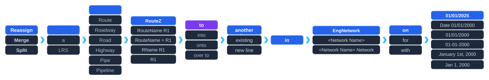

# Reassign Route AI Assistant Overview

| Field | Value |
| --- | --- |
| **Doc** | 35 · Other · Pro |
| **Product** | — |
| **Release** | — |
| **Issues** | — |
| **Source** | [Reassign_Route_AI_Assistant.pptx](<https://esriis.sharepoint.com/sites/LocationReferencing/Shared%20Documents/LR%20Product%20Engineers/Reassign_Route_AI_Assistant.pptx>) |
| **People** | author PptxGenJS · PE — · dev — |
| **Edited** | 2026-05-13 22:59 by Kevin Roper |
| **Extracted** | 2026-09-04 · lane xmlstrip · format 3.0 · prompt v2.0.2 |
| **Keywords** | route reassignment · route merge · route split · network · route naming · linear referencing system |
| **Tools** | — |

## Summary

Document presents an overview related to reassigning routes within a network, referencing operations such as reassign, merge, and split of linear referencing system routes. It includes terminology and concepts related to routes, roadways, pipelines, and route naming conventions.

## Related documents

<!-- related:begin -->
- [Reassign Route AI Assistant Test Plan](<https://esriis.sharepoint.com/sites/lrsworkspace/LRS Doc Index/Test Plans/7039-reassign-route-ai-assistant.md>) — similar text 0.27 · 3 title words · 2 filename words · same surface <!-- rel:34 s=4.94 -->
- [Create Route in Line Network and Multifield Network with Additional Attributes Pro AI Assistant Test Plan](<https://esriis.sharepoint.com/sites/lrsworkspace/LRS Doc Index/Test Plans/create-route-in-line-network-and-multifield-network.md>) — similar text 0.29 · 2 title words · 2 filename words · same surface <!-- rel:86 s=3.767 -->
- [Realign Route AI Assistant Test Plan](<https://esriis.sharepoint.com/sites/lrsworkspace/LRS Doc Index/Test Plans/7067-realign-route-ai-assistant-rh-apr-2026-02.md>) — similar text 0.27 · 2 title words · 1 filename word · same surface <!-- rel:51 s=3.563 -->
- [Create Route AI Assistant Test Plan](<https://esriis.sharepoint.com/sites/lrsworkspace/LRS Doc Index/Test Plans/create-route-ai-assistant.md>) — similar text 0.22 · 2 title words · 2 filename words · same surface <!-- rel:98 s=3.479 -->
- [Route Reassignment Method Naming and Scenarios](<https://esriis.sharepoint.com/sites/lrsworkspace/LRS Doc Index/Other/route-reassignment-method-naming-and-scenarios.md>) — similar text 0.10 · 1 title word · same kind/surface <!-- rel:580 s=3.413 -->
<!-- related:end -->

<!-- docs:begin -->
## Esri documentation

[Route reassignment](https://doc.esri.com/en/arcgis-pro/latest/help/production/location-referencing-pipelines/reassign-routes.html) · [Merge to adjacent route method](https://doc.esri.com/en/arcgis-pro/latest/help/production/location-referencing-pipelines/merge-to-adjacent-route-method.html) · [LRS network](https://doc.esri.com/en/arcgis-pro/latest/help/production/location-referencing-pipelines/what-is-an-lrs-network.html)
<!-- docs:end -->

---

## Slide 1

<Network Name> Network

January 1st, 2000

[figure: Reassign · Merge · Split · a · LRS · Route · Roadway · Road · Highway · Pipe · Pipeline · RouteZ · RouteName R1 · RouteName = R1 · RName R1 · R1 · to · into · onto · over to · another line · existing line · new line · in · …]

