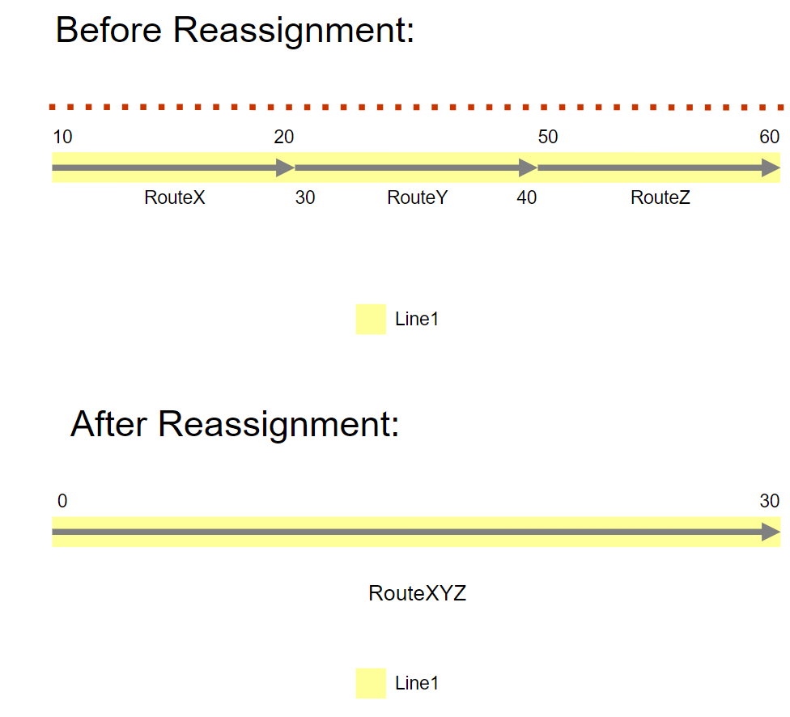
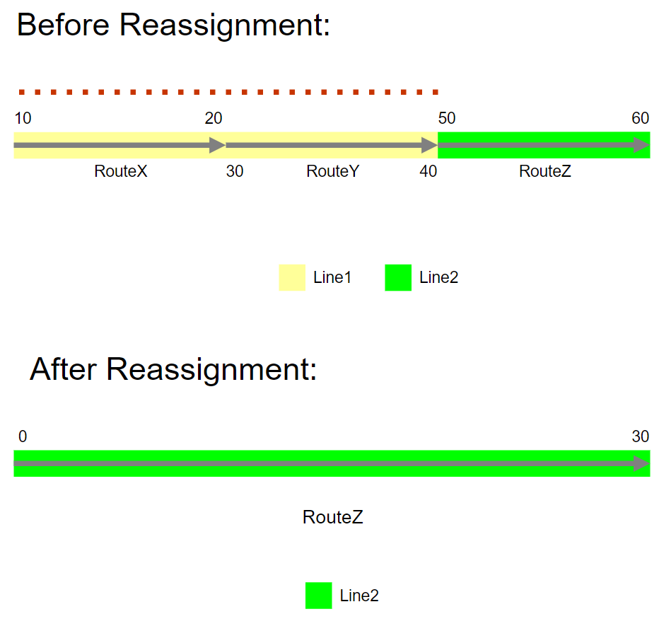
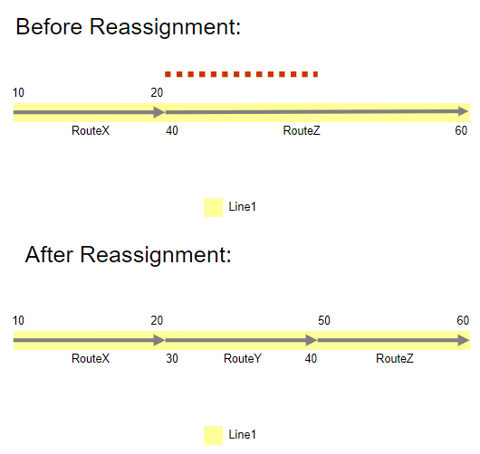
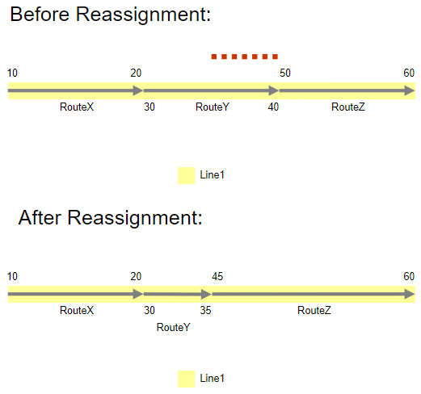
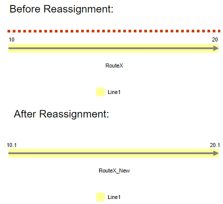
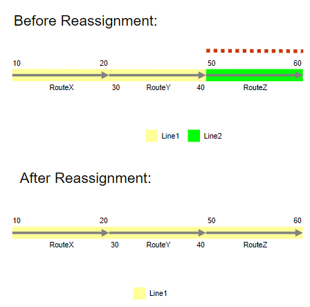
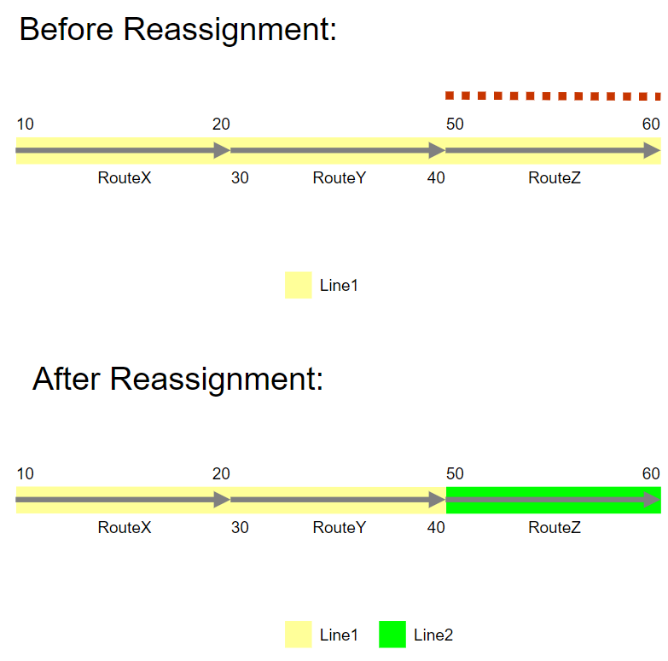
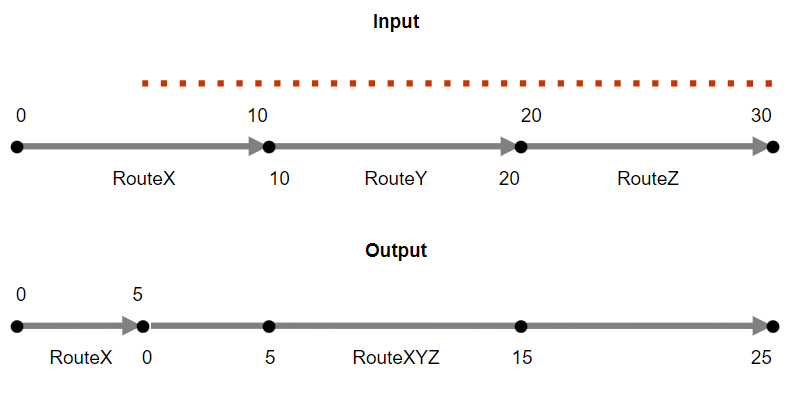
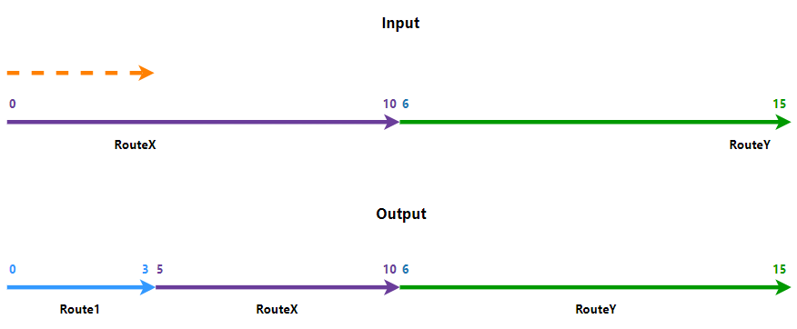
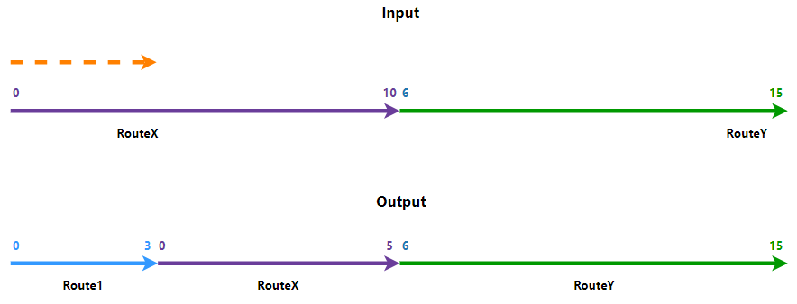

# Reassign Routes

| Field | Value |
| --- | --- |
| **Doc** | 508 · Other · Pro |
| **Product** | Pipeline Referencing · Utility Network |
| **Release** | — |
| **Issues** | — |
| **Source** | [Reassign_routes_Pipeline_trackChanges.docx](<https://esriis.sharepoint.com/sites/LocationReferencing/Shared%20Documents/General/Doc%20Reviews/5418_ReassignRoutesAPR/Reassign_routes_Pipeline_trackChanges.docx>) |
| **People** | author Rahul Rakshit · PE — · dev — |
| **Edited** | 2023-09-05 23:17 by Rahul Rakshit |
| **Extracted** | 2026-09-04 · lane xmlstrip · format 3.0 · prompt v2.0.2 |
| **Keywords** | route reassignment · reassign route tool · route merging · route splitting · route renaming · route transfer · calibration points · downstream recalibration · complex route shapes · loop route · lollipop route · barbell route · branch route · line order · effective date · network parameters |
| **Tools** | Reassign Route · Rename tool |

## Summary

This document explains the Reassign Route tool used to move or reassign all or part of a route or line to another route or line within a network. It covers scenarios such as merging multiple routes, splitting routes, renaming routes, transferring routes between lines, transferring calibration points, downstream recalibration, and complex route shapes like loops, lollipops, branches, and barbells. The document also details parameters, attributes, and step-by-step procedures for using the tool in networks that support lines and continuous networks.

## Related documents

<!-- related:begin -->
- [Reassign Routes](<https://esriis.sharepoint.com/sites/lrsworkspace/LRS Doc Index/Other/reassign-routes-apr-un-2023-09.md>) — similar text 0.91 · 2 title words · 4 filename words · same kind/surface <!-- rel:507 s=12.477 -->
- [Reassigning a Route](<https://esriis.sharepoint.com/sites/lrsworkspace/LRS Doc Index/Other/reassigning-a-route.md>) — similar text 0.48 · 1 filename word · same kind/surface <!-- rel:894 s=4.018 -->
- [Event Behavior for Route Reassignment – Form a New Route Method](<https://esriis.sharepoint.com/sites/lrsworkspace/LRS Doc Index/Other/eb-for-route-reassignment-form-a-new-route-method.md>) — similar text 0.24 · 1 filename word · same kind/surface <!-- rel:523 s=3.953 -->
- [Reassign Route AI Assistant Test Plan](<https://esriis.sharepoint.com/sites/lrsworkspace/LRS Doc Index/Test Plans/7039-reassign-route-ai-assistant.md>) — similar text 0.25 · 1 title word · 1 filename word · same surface <!-- rel:34 s=3.873 -->
- [Pro AI Assistant Reassign Route User Story](<https://esriis.sharepoint.com/sites/lrsworkspace/LRS Doc Index/User Stories/pro-ai-assistant-reassign-route.md>) — similar text 0.15 · 1 title word · 1 filename word · same surface <!-- rel:100 s=3.603 -->
<!-- related:end -->

<!-- docs:begin -->
## Esri documentation

[Route reassignment](https://doc.esri.com/en/arcgis-pro/latest/help/production/location-referencing-pipelines/reassign-routes.html) · [Reassign by merging to an adjacent route](https://doc.esri.com/en/arcgis-pro/latest/help/production/location-referencing-pipelines/reassign-by-merging-to-an-adjacent-route.html)

_No page matched:_ [Rename tool](https://www.google.com/search?q=%22Rename%20tool%22+site%3Adoc.esri.com)
<!-- docs:end -->

---

## Reassign routes
Reassignment is the technique by which all or a portion of a route or line is moved, or reassigned, to the immediate upstream or downstream of another route or line.
One example of a route reassignment is to split your routes or lines and merge (assign) them to another route or line after a pipeline has changed operation or ownership. Another example is to redesignate a portion of a pipe that falls on the other side of a boundary after an administrative boundary change.
In addition to route reassignment, the Reassign Route tool can update attribute fieldsattributes and calibration points and apply user-configured event behaviors located along the reassigned route.
Scenarios that can be accomplished using the reassign activity are described below.
Note:
In the following scenarios, you can choose entire routes or partial routes:

### Merging multiple routes to a new route

RouteX, RouteY, and RouteZ are consecutive routes that belong to the same line Line1. You can use the Reassign Route tool to merge all of them together into a new route, RouteXYZ, that belongs to the same line.  The date of reassignment is 1/1/2010.
Before reassignment table:

| Route Name | Line Name | From Date | To Date | Line Order |
| --- | --- | --- | --- | --- |
| RouteX | Line1 | 1/1/2005 | <Null> | 100 |
| RouteY | Line1 | 1/1/2005 | <Null> | 200 |
| RouteZ | Line1 | 1/1/2005 | <Null> | 300 |

Here are the inputs used for the Reassign Route tool.

| Method | Form a new Route |
| --- | --- |
| Source |  |
| From Route | RouteX |
| From Measure | 10 |
| To Route | RouteZ |
| To Measure | 60 |
| Target |  |
| Route | RouteXYZ |
| From Measure | 0 |
| To Measure | 30 |

RouteXYZ gets the line order of the first route that was used for merging; that is RouteX100. RouteX, RouteY, and RouteZ get retired as a result of this operation. You can choose new start and end measure values for RouteXYZ.

After reassignment table:

| Source |  |
| --- | --- |

| From Route Name |  | RouteX Line Name |  | From Date |  |  | To Date |  |  | Line Order |  |  |  |  |
| --- | --- | --- | --- | --- | --- | --- | --- | --- | --- | --- | --- | --- | --- | --- |
| RouteX From Measure |  | 0 Line1 |  | 1/1/2005 |  |  | 1/1/2010 |  |  | 100 |  |  |  |  |
| RouteY |  | Line1 | 1/1/2005 | 1/1/2010 | 200 |  |  |  |  |  |  |  |  |  |
| To Route |  | RouteZ |  | Line1 |  | 1/1/2005 |  |  | 1/1/2010 |  |  | 300 |  |  |

| To Measure | 30 |
| --- | --- |
| Target |  |

| Route | RouteXYZ (new) | Line1 | 1/1/2010 | <Null> | 100 |
| --- | --- | --- | --- | --- | --- |

### Note:

| From Measure | 0 |
| --- | --- |
| To Measure | 30 |

1. Both the From Route and the To Route from Source can be partially reassigned.

1. Line orders of the remaining routes in the source line may be recalculated as a result.

### Merging routes to an existing route

RouteX, and RouteY, and RouteZ are consecutive routes that belong to the same line Line1. You can use the Reassign Route tool to merge all of them together to an existing route RouteZ, which belongs to the samean adjoining line.  Line2.RouteX, RouteY, and RouteZ get retired as a result of this operation. The new RouteZ gets the line order of the first route that was used for merging, whichdate of reassignment is 1/1/2010RouteX. In this case, the reassign portion is from the start of RouteX to the end of RouteY. You are allowed to merge the reassigned portion to any immediate upstream or downstream route.

Before reassignment table:

| Source Route Name |  |  | Line Name | From Date |  | To Date |  | Line Order |  |
| --- | --- | --- | --- | --- | --- | --- | --- | --- | --- |
| RouteX | Line1 | 1/1/2005 | <Null> | 100 |  |  |  |  |  |
| RouteY | Line1 | 1/1/2005 | <Null> | 200 |  |  |  |  |  |
| RouteZ | Line2 | 1/1/2005 | <Null> | 100 |  |  |  |  |  |

Here are the inputs used for the Reassign Route tool.

| Method | Merge to adjacent route |  |  |
| --- | --- | --- | --- |
| Source |  |  |  |
| From Route |  | RouteX |  |
| From Measure |  | 0 10 |  |
| To Route |  | RouteY |  |
| To Measure |  | 15 40 |  |
| Target |  |  |  |
| Route |  | RouteZ |  |
| From Measure |  | 0 |  |
| To Measure |  | 30 20 |  |

 The target is recalibrated downstream.
RouteX, RouteY, and RouteZ get retired as a result of this operation. In this case, the reassign portion is from the start of RouteX to the end of RouteY. 
After reassignment table:

### Splitting an existing route
RouteXYZ has measures from 0 to 30. As shown in this example, you can split the route into two: Route1, which is a new route, and a new version of RouteXYZ. The existing RouteXYZ retires as a result of this operation. Route1 gets the line order of RouteXYZ, and the new version of RouteXYZ gets the next line order value. For example, if the line order of RouteXYZ was 100 before the reassignment, after the reassignment, Route1 gets the line order of 100 and the new RouteXYZ gets the line order of 200.

| Source |  |
| --- | --- |

| From Route Name | RouteXYZ Line Name | From Date | To Date | Line Order |
| --- | --- | --- | --- | --- |
| RouteX From Measure | 0 Line1 | 1/1/2005 | 1/1/2010 | 100 |
| RouteY To Route | RouteXYZ Line1 | 1/1/2005 | 1/1/2010 | 200 |
| To Measure RouteZ | 19 Line2 | 1/1/2005 | 1/1/2010 | 100 |
| Target RouteZ | Line2 | 1/1/2010 | <Null> | 100 |

| Route | Route1 (new) |
| --- | --- |
| From Measure | 0 |
| To Measure | 19 |

### Note:

1. Any one of the From Route and the To Route from Source can be partially reassigned to any immediate upstream or downstream route.

1. Line orders of the remaining routes in the source line may be recalculated as a result.

1. Routes from one line can be merged to an adjoining route in another line. Either one of the Source From or To routes of one line should be touching either start or end of the target route in another line.

1. Routes from a line can be merged to an existing adjoining route in the same line.

### Splitting Routes

RouteZ has measures from 40 to 60. As shown in this example, you can split the route into two: RouteY, which is a new route, and a new version of RouteZ.
Before reassignment table:

| Route Name | Line Name | From Date | To Date | Line Order |
| --- | --- | --- | --- | --- |
| RouteX | Line1 | 1/1/2005 | <Null> | 100 |
| RouteZ | Line1 | 1/1/2005 | <Null> | 200 |

Here are the inputs used for the Reassign Route tool.

| Method | Form a new route |
| --- | --- |
| Source |  |
| From Route | RouteZ |
| From Measure | 40 |
| To Route | RouteZ |
| To Measure | 50 |
| Target |  |
| Route | RouteY |
| From Measure | 30 |
| To Measure | 40 |

The source is not recalibrated downstream.
The existing RouteZ retires as a result of this operation. RouteY gets the line order of RouteZ, and the new version of RouteZ gets the next line order value.
After reassignment table:

| Route Name | Line Name | From Date | To Date | Line Order |
| --- | --- | --- | --- | --- |
| RouteX | Line1 | 1/1/2005 | <Null> | 100 |
| RouteZ | Line1 | 1/1/2005 | 1/1/2010 | 200 |
| RouteY | Line1 | 1/1/2010 | <Null> | 200 |
| RouteZ | Line1 | 1/1/2010 | <Null> | 300 |

### Note:

1. Choose the same From and To source route to split a single route.

1. Line orders of the remaining routes in the source line may be recalculated as a result.

### Splitting and Merging Routes

RouteY has measures from 30 to 40. As shown in this example, you can split the route and then merge one of the parts to the adjoining route RouteZ.
Before reassignment table:

| Route Name | Line Name | From Date | To Date | Line Order |
| --- | --- | --- | --- | --- |
| RouteX | Line1 | 1/1/2005 | <Null> | 100 |
| RouteY | Line1 | 1/1/2005 | <Null> | 200 |
| RouteZ | Line1 | 1/1/2005 | <Null> | 300 |

Here are the inputs used for the Reassign Route tool.

| Method | Merge to adjacent route |
| --- | --- |
| Source |  |
| From Route | Route Y |
| From Measure | 3 5 |
| To Route | Route Y |
| To Measure | 40 |
| Target |  |
| Route | Route Z |
| From Measure | 45 |
| To Measure | 50 |

The existing RouteY and RouteZ retire because of this operation. The new version of RouteY gets the same line order as the previous one. The other splitted part of RouteY gets merged to RouteZ.
After reassignment table:

| RouteX | Line1 | 1/1/2005 | <Null> | 100 |
| --- | --- | --- | --- | --- |
| RouteY | Line1 | 1/1/2005 | 1/1/2010 | 200 |
| RouteZ | Line1 | 1/1/2005 | 1/1/2010 | 300 |
| RouteY | Line1 | 1/1/2010 | <Null> | 200 |
| RouteZ | Line1 | 1/1/2010 | <Null> | 300 |

### Renaming a route

You can rename an existing route and change its start and end measure values with the help of the Reassign Route tool. RouteXYZRouteX is renamed to Route123RouteX_New and with new measures. The line order remains the same. The existing RouteXYZRouteX retires as a resultbecause of this operation.

Before reassignment table:

| Route Name | Line Name | From Date | To Date | Line Order |
| --- | --- | --- | --- | --- |
| RouteX | Line1 | 1/1/2005 | <Null> | 100 |

Note:
If all route records across all time slices need to be renamed without generating any additional time slices, use the Rename tool.

Here are the inputs used for the Reassign Route tool.

| Method | Form a new route |  |  |
| --- | --- | --- | --- |
| Source |  |  |  |
| From Route |  |  | RouteXYZ RouteX |
| From Measure |  |  | 0 10 |
| To Route |  |  | RouteXYZ RouteX |
| To Measure |  |  | 30 20 |
| Target |  |  |  |
| Route |  |  | Route123 (new) Route X_New |
| From Measure |  |  | 15 10.1 |
| To Measure |  |  | 45 20.1 |

After reassignment table:

| Route Name | Line Name | From Date | To Date | Line Order |
| --- | --- | --- | --- | --- |
| RouteX | Line1 | 1/1/2005 | 1/1/2010 | 100 |
| RouteX_New | Line1 | 1/1/2010 | <Null> | 100 |

### Transferring a routeroutes to anotheran existing line

Routes can be transferred entirely or partially to a newan existing line. In this case, the reassign portion should be either on the upstream or downstream ends of the targetsource line or in the immediate upstream or downstream of a gap between routes in the target line.. As shown in the example, the purple routes belong to Line1 and the green route RouteZ belongs to Line2. You can take RouteYRouteZ from Line1 and reassign it as a new route, Route2, on Line2. RouteY gets retired and Route 2 gets a line order next to that of Route1 as a result of this operation. and transfer it to an existing adjoining line Line1.

Before reassignment table:

| Source |  |
| --- | --- |

| From Route Name |  | RouteY Line Name | From Date |  | To Date |  | Line Order |  |
| --- | --- | --- | --- | --- | --- | --- | --- | --- |
| From Measure RouteX |  | 15 Line1 | 1/1/2005 |  | <Null> |  | 100 |  |
| To Route | RouteY | Line1 | 1/1/2005 |  | <Null> |  | 200 |  |
| To Measure RouteZ |  | 30 Line2 | 1/1/2005 |  | <Null> |  | 100 |  |

| Target |  |
| --- | --- |
| Route | Route2 (new) |
| From Measure | 38 |
| To Measure | 43 |

Here are the inputs used for the Reassign Route tool.

| Method | Transfer to another line |
| --- | --- |
| Source |  |
| From Route | Route Z |
| From Measure | 50 |
| To Route | Route Z |
| To Measure | 60 |
| Target |  |
| Line Name | Line1 |
| Route | RouteZ |
| From Measure | 50 |
| To Measure | 60 |

The original RouteZ is retired on the date of reassignment. RouteZ gets recreated on Line1 with the date of reassignment as its From Date and gets its line order updated.

After reassignment table:

| Route Name | Line Name | From Date | To Date | Line Order |
| --- | --- | --- | --- | --- |
| RouteX | Line1 | 1/1/2005 | <Null> | 100 |
| RouteY | Line1 | 1/1/2005 | <Null> | 200 |
| RouteZ | Line2 | 1/1/2005 | 1/1/2010 | 100 |
| RouteZ | Line1 | 1/1/2010 | <Null> | 300 |

### Note:

1. Multiple adjoining routes from a line can be transferred to an adjoining line.

1. Line orders of the remaining routes in the source line may be recalculated as a result.

1. Line orders of the existing routes in the target line may be recalculated as a result.

1. If the source routes are transferred to another line in entirety, the original Route Names and Route IDs as well as their measurements can be preserved. Alternatively, you can choose a new route name and from and to measures for the transferred routes

1. If a portion of the source routes are transferred to another line, the original Route Names cannot be preserved, and a new Route name must be selected for the transferred route.

### Transferring routes to a new line

Routes can be transferred entirely or partially to a new line. As shown in the example RouteZ belongs to Line1. You can transfer it to a new line Line2.

Before reassignment table:

| Route Name | Line Name | From Date | To Date | Line Order |
| --- | --- | --- | --- | --- |
| RouteX | Line1 | 1/1/2005 | <Null> | 100 |
| RouteY | Line1 | 1/1/2005 | <Null> | 200 |
| RouteZ | Line1 | 1/1/2005 | <Null> | 300 |

Here are the inputs used for the Reassign Route tool.

| Method | Transfer to another line |
| --- | --- |
| Source |  |
| From Route | RouteZ |
| From Measure | 50 |
| To Route | RouteZ |
| To Measure | 60 |
| Target |  |
| Line Name | Line2 |
| Route | RouteZ |
| From Measure | 50 |
| To Measure | 60 |

The original RouteZ is retired on the date of reassignment. RouteZ gets recreated on Line2 with the date of reassignment as its From Date and gets its line order updated.
After reassignment table:

| Route Name | Line Name | From Date | To Date | Line Order |
| --- | --- | --- | --- | --- |
| RouteX | Line1 | 1/1/2005 | <Null> | 100 |
| RouteY | Line1 | 1/1/2005 | <Null> | 200 |
| RouteZ | Line1 | 1/1/2005 | 1/1/2010 | 300 |
| RouteZ | Line2 | 1/1/2010 | <Null> | 100 |

### Note:

1. Multiple adjoining routes from a line can be transferred to a new line.

1. Line orders of the remaining routes in the source line may be recalculated as a result.

1. If the source routes are transferred to a new line in entirety, the original Route Names and Route IDs as well as their measurements can be preserved. Alternatively, you can choose a new route name and from and to measures for the transferred routes

1. If a portion of the source routes are transferred to a new line, the original Route Names cannot be preserved, and a new Route name must be selected for the transferred route.

### Transferring calibration points to a target route
Routes may have calibration points between the start and end of the route to maintain known measures between points. In that case, when reassigning the route, there is an option to transfer the calibration points contained in the reassigned portion to the target route.
Note:
The option to transfer calibration points to a target route during reassignment is checked by default and is the preferred method to maintain established measures.

Here are the inputs used for the Reassign Route tool.

| Method | Form a new route |  |  |
| --- | --- | --- | --- |
| Source |  |  |  |
| From Route |  | RouteX |  |
| From Measure |  | 5 |  |
| To Route |  | RouteZ |  |
| To Measure |  | 30 |  |
| Target |  |  |  |
| Route |  | RouteXYZ (new) |  |
| From Measure |  | 0 |  |
| To Measure |  | 25 |  |

###  

### Downstream recalibration
The examples below describe recalibrating downstream. You can reassign routes with the source route calibratedrecalibrated or not calibratedrecalibrated downstream.

#### Reassignment with the source route not calibrated downstream
RouteX is split into two routes: RouteX and Route1, which begins at the start of the old RouteX and ends at the middle of the old RouteX. The to measure value of the newly created Route1 has been changed to 3 instead of the suggested measure of 5. Since the Recalibrate route downstream check box is unchecked for the source route, the downstream route's (RouteX) measures remain intact.

Here are the inputs used for the Reassign Route tool.

| Method | Form a new route |  |  |
| --- | --- | --- | --- |
| Source |  |  |  |
| From Route |  | RouteX |  |
| From Measure |  | 0 |  |
| To Route (option only for networks with lines) |  | RouteX |  |
| To Measure |  | 5 |  |
| Target |  |  |  |
| Route |  | Route1 (new) |  |
| From Measure |  | 0 |  |
| To Measure |  | 3 |  |

#### Reassignment with the source route calibrated downstream
RouteX is split into two routes: RouteX and Route1, which starts at the beginning of the old RouteX and ends at the middle of the old RouteX. The to measure value of the newly created Route1 has been changed to 3 instead of the suggested measure of 5. If the Recalibrate route downstream check box is checked for the source route, the downstream route's (RouteX) measures change to the from measure value of 0 and to measure value of 5.

Here are the inputs used for the Reassign Route tool.

| Method | Form a new Route |  |  |
| --- | --- | --- | --- |
| Source |  |  |  |
| From Route |  |  | RouteX |
| From Measure |  |  | 0 |
| To Route (option only for networks with lines) |  |  | RouteX |
| To Measure |  |  | 5 |
| Target |  |  |  |
| Route |  |  | Route1 (new) |
| From Measure |  |  | 0 |
| To Measure |  |  | 3 |

#### Reassignment with the target route calibrated downstream
A part of RouteX is merged with the adjoining route, RouteY. The reassignment takes place from the middle of RouteX on the downstream side. Since the Recalibrate route downstream check box is checked for the target route, the measure of RouteY downstream of the reassigned portion is recalibrated. The new version of RouteY now has a to measure value of 9.

Here are the inputs used for the Reassign Route tool.

| Method | Merge to adjacent route |  |  |
| --- | --- | --- | --- |
| Source |  |  |  |
| From Route |  | RouteX |  |
| From Measure |  | 5 |  |
| To Measure |  | 10 |  |
| Target |  |  |  |
| Route |  | RouteY |  |
| From Measure |  | 0 |  |
| To Measure |  | 9 5 |  |

### Complex route reassignment scenarios
Complex route reassignment scenarios for complex routes and shapes, including loop, lollipop, branch, and barbell shapes are described below.

#### Reassignment resulting in a loop
In the following example, RouteX and RouteY are merged to create a loop route after reassignment. RouteX has measures 0 to 2 and RouteY has measures 2 to 4:

Before reassignment table:

| Source Route Name |  |  | Line Name |  | From Date |  | To Date |  | Line Order |  |
| --- | --- | --- | --- | --- | --- | --- | --- | --- | --- | --- |
| RouteX | Line1 | 1/1/2005 | <Null> | 100 |  |  |  |  |  |  |
| RouteY | Line1 | 1/1/2005 | <Null> | 200 |  |  |  |  |  |  |

Here are the inputs used for the Reassign Route tool.

| Method | Merge to adjacent route |  |  |
| --- | --- | --- | --- |
| Source |  |  |  |
| From Route |  | RouteX |  |
| From Measure |  | 0 |  |
| To Measure |  | 2 |  |
| Recalibrate source route |  | No |  |
| Target |  |  |  |
| To Route |  | RouteY |  |
| From Measure |  | 0 |  |
| To Measure |  | 2 |  |
| Recalibrate target route |  | No |  |

After reassignment, a calibration point is added at measure 1, and RouteY is recalibrated with measures 0 to 4.

After reassignment table:

| Route Name | Line Name | From Date | To Date | Line Order |
| --- | --- | --- | --- | --- |
| RouteX | Line1 | 1/1/2005 | 1/1/2010 | 100 |
| RouteY | Line1 | 1/1/2005 | 1/1/2010 | 200 |
| RouteY | Line1 | 1/1/2010 | <Null> | 100 |

#### Split an existing loop
In the following example, RouteX, on a loop with measures 0 to 12, is split and the edit section is reassigned to a new route (RouteY):

Before reassignment table:

| Source Route Name |  |  | Line Name |  | From Date |  | To Date |  | Line Order |  |
| --- | --- | --- | --- | --- | --- | --- | --- | --- | --- | --- |
| RouteX | Line1 | 1/1/2005 | <Null> | 100 |  |  |  |  |  |  |

Here are the inputs used for the Reassign Route tool.

| Method | Form a new route |  |  |
| --- | --- | --- | --- |
| Source |  |  |  |
| From Route |  | RouteX |  |
| From Measure |  | 0 |  |
| To Measure |  | 4 |  |
| Recalibrate source route |  | Yes |  |
| Target |  |  |  |
| To Route |  | RouteY |  |
| From Measure |  | 0 |  |
| To Measure |  | 4 |  |
| Recalibrate target route | No |  |  |

After reassignment, RouteY is created with measures 0 to 4. The calibration point formerly at 8 is updated to 4, and RouteX is recalibrated with measures 0 to 8.
RouteX retains its line order (100), and the new RouteY is assigned line order 200.

After reassignment table:

| Route Name | Line Name | From Date | To Date | Line Order |
| --- | --- | --- | --- | --- |
| RouteX | Line1 | 1/1/2005 | 1/1/2010 | 100 |
| RouteX | Line1 | 1/1/2010 | <Null> | 100 |
| RouteY | Line1 | 1/1/2010 | <Null> | 200 |

#### Reassignment resulting in a lollipop
RouteX has measures 0 to 4 and RouteY has measures 0 to 1. In the following example, a loop route (RouteX) is merged with a simple route (RouteY) to create a lollipop route after reassignment:

Before reassignment table:

| Source Route Name |  |  | Line Name |  | From Date |  | To Date |  | Line Order |  |
| --- | --- | --- | --- | --- | --- | --- | --- | --- | --- | --- |
| RouteY | Line1 | 1/1/2005 | <Null> | 100 |  |  |  |  |  |  |
| RouteX | Line1 | 1/1/2005 | <Null> | 200 |  |  |  |  |  |  |

Here are the inputs used for the Reassign Route tool.

| Method | Merge to adjacent route |  |  |
| --- | --- | --- | --- |
| Source |  |  |  |
| From Route |  | RouteX |  |
| From Measure |  | 0 |  |
| To Measure |  | 4 |  |
| Recalibrate source route |  | No |  |
| Target |  |  |  |
| To Route |  | RouteY |  |
| From Measure |  | 1 |  |
| To Measure |  | 5 |  |
| Recalibrate target route |  | Yes |  |

After reassignment, the resulting lollipop route (RouteY) has updated measures 0 to 5.
The line order for RouteY is updated from 200 to 100.

After reassignment table:

| Route Name | Line Name | From Date | To Date | Line Order |
| --- | --- | --- | --- | --- |
| RouteY | Line1 | 1/1/2005 | 1/1/2010 | 100 |
| RouteX | Line1 | 1/1/2005 | 1/1/2010 | 200 |
| RouteY | Line1 | 1/1/2010 | <Null> | 100 |

#### Split an existing lollipop
RouteX has measures 0 to 5 and RouteY has measures 0 to 1. In the following example, the stick portion of a lollipop route (RouteX) is split and reassigned to an existing route (RouteY):

Before reassignment table:

| Source Route Name |  |  | Line Name |  | From Date |  | To Date |  | Line Order |  |
| --- | --- | --- | --- | --- | --- | --- | --- | --- | --- | --- |
| RouteX | Line1 | 1/1/2005 | <Null> | 100 |  |  |  |  |  |  |
| RouteY | Line1 | 1/1/2005 | <Null> | 200 |  |  |  |  |  |  |

Here are the inputs used for the Reassign Route tool.

| Method | Merge to adjacent route |  |  |
| --- | --- | --- | --- |
| Source |  |  |  |
| From Route |  | RouteX |  |
| From Measure |  | 0 |  |
| To Measure |  | 1 |  |
| Recalibrate source route |  | Yes |  |
| Target |  |  |  |
| To Route |  | RouteY |  |
| From Measure |  | 0 |  |
| To Measure |  | 1 |  |
| Recalibrate target route |  | Yes |  |

After reassignment, both routes are recalibrated. The updated simple route (RouteY) has measures 0 to 2, and the loop route (RouteX) has measures 0 to 4.
The line order for the two routes remains the same.

RouteX has measures 0 to 15. In the following example, part of a lollipop route (

After reassignment table:
RouteX) is split and reassigned to a new route (RNew):

| Source |  |
| --- | --- |

| From Route Name | RouteX Line Name | From Date | To Date | Line Order |
| --- | --- | --- | --- | --- |
| From Measure RouteX | 4 Line1 | 1/1/2005 | 1/1/2010 | 100 |
| To Measure RouteY | 8 Line1 | 1/1/2005 | 1/1/2010 | 200 |
| Recalibrate source route RouteX | Yes Line1 | 1/1/2010 | <Null> | 100 |
| Target RouteY | Line1 | 1/1/2010 | <Null> | 200 |

| To Route | RNew |
| --- | --- |
| From Measure | 0 |
| To Measure | 4 |
| Recalibrate target route | No |

After reassignment, a simple route (RNew) created from the edit section has measures 0 to 4, and the branch route (RouteX) has measures 0 to 12.
The line order for RouteX remains 100, and the line order for RNew is 200.

#### Merge multiple routes to create a barbell
In the following example, a loop route (RouteX) with measures 0 to 4 is merged with a lollipop route (RouteY) that has measures from 0 to 5:

Before reassignment table:

| Source |  |
| --- | --- |

| From Route Name |  | RouteX Line Name | From Date |  | To Date |  | Line Order |  |
| --- | --- | --- | --- | --- | --- | --- | --- | --- |
| From Measure RouteX |  | 0 Line1 | 1/1/2005 |  | <Null> |  | 100 |  |
| To Route | RouteY | Line1 | 1/1/2005 |  | <Null> |  | 200 |  |

| To Measure | 4 |
| --- | --- |
| Recalibrate source route | No |
| Target |  |
| Target Route | RNew |
| From Measure | 0 |
| To Measure | 9 |
| Recalibrate target route | No |

Here are the inputs used for the Reassign Route tool.

| Method | Form a new route |
| --- | --- |
| Source |  |
| From Route | RouteX |
| From Measure | 0 |
| To Route | RouteY |
| To Measure | 4 |
| Recalibrate source route | No |
| Target |  |
| Target Route | RNew |
| From Measure | 0 |
| To Measure | 9 |

After reassignment, a new barbell route (RNew) is created from the merged routes. RNew has recalibrated measures 0 to 9.
The new route has line order 100.

After reassignment table:

| Route Name | Line Name | From Date | To Date | Line Order |
| --- | --- | --- | --- | --- |
| RouteX | Line1 | 1/1/2005 | 1/1/2010 | 100 |
| RouteY | Line1 | 1/1/2005 | 1/1/2010 | 200 |
| RNew | Line1 | 1/1/2010 | <Null> | 100 |

#### Merge simple routes to create a branch
RouteY and RouteZ have contiguous measures of 0 to 5 and 5 to 10, respectively, and RouteX has measures 0 to 6. In the following example, two simple routes (RouteY and RouteZ) are merged with a third simple route (RouteX) to create a branch route after reassignment:

Before reassignment table:

| Source |  |
| --- | --- |

| From Route Name |  | Line Name RouteY | From Date |  |  | To Date |  |  | Line Order |  |  |  |  |  |
| --- | --- | --- | --- | --- | --- | --- | --- | --- | --- | --- | --- | --- | --- | --- |
| From Measure RouteX |  | 0 Line1 | 1/1/2005 |  |  | <Null> |  |  | 100 |  |  |  |  |  |
| RouteY |  | Line1 | 1/1/2005 | <Null> | 200 |  |  |  |  |  |  |  |  |  |
| To Route |  |  | RouteZ | Line1 |  | 1/1/2005 |  |  | <Null> |  |  | 300 |  |  |

| To Measure | 10 |
| --- | --- |
| Recalibrate source route | No |
| Target |  |

Here are the inputs used for the Reassign Route tool.

| Method | Merge to adjacent route |  |  |
| --- | --- | --- | --- |
| Source |  |  |  |
| From Route | RouteY |  |  |
| From Measure | 0 |  |  |
| To Route | RouteZ |  |  |
| To Measure | 10 |  |  |
| Recalibrate source route | No |  |  |
| Target |  |  |  |
| To Route |  | RouteX |  |
| From Measure |  | 6 |  |
| To Measure |  | 16 |  |
| Recalibrate target route |  | Yes |  |

After reassignment, RouteY and RouteZ are merged with RouteX to create a branch route that has recalibrated measures 0 to 16.
The line order for the remaining route remains 100.

After reassignment table:

| Route Name | Line Name | From Date | To Date | Line Order |
| --- | --- | --- | --- | --- |
| RouteX | Line1 | 1/1/2005 | 1/1/2010 | 100 |
| RouteY | Line1 | 1/1/2005 | 1/1/2010 | 200 |
| RouteZ | Line1 | 1/1/2005 | 1/1/2010 | 300 |
| RouteX | Line1 | 1/1/2010 | <Null> | 100 |

#### Split an infinity route
In the following example, an existing infinity route (RouteX) with measures 0 to 24 is split to create an alpha route and a new simple route (RNew):

Before reassignment table:

| Source Route Name |  |  | Line Name |  | From Date |  | To Date |  | Line Order |  |
| --- | --- | --- | --- | --- | --- | --- | --- | --- | --- | --- |
| RouteX | Line1 | 1/1/2005 | <Null> | 100 |  |  |  |  |  |  |

Here are the inputs used for the Reassign Route tool.

| Method | Form a new route |  |  |
| --- | --- | --- | --- |
| Source |  |  |  |
| From Route |  | RouteX |  |
| From Measure |  | 18 |  |
| To Measure |  | 24 |  |
| Recalibrate source route |  | Yes |  |
| Target |  |  |  |
| To Route |  | RNew |  |
| From Measure |  | 0 |  |
| To Measure |  | 6 |  |
| Recalibrate target route | No |  |  |

After reassignment, RouteX is an alpha route with measures 0 to 18, and RNew has measures 0 to 6.
The line order for RouteX remains 100, and the line order for RNew is 200.

After reassignment table:

| Route Name | Line Name | From Date | To Date | Line Order |
| --- | --- | --- | --- | --- |
| RouteX | Line1 | 1/1/2005 | 1/1/2010 | 100 |
| RouteX | Line1 | 1/1/2010 | <Null> | 100 |
| RNew | Line1 | 1/1/2010 | <Null> | 200 |

### Parameters in the networks
The following tables describe the parameters used in the Reassign Route tool:

#### For a network that supports lines

| Variable | Description |
| --- | --- |
| Network | The network that supports lines in which the routes exist. |
| Effective Date | This is the date when the reassignment has taken place on the ground. |
| Source Route : From Route Name | The route where the reassignment starts. |
| Source Route : From Measure | The measure on the source route where the reassignment starts; shown by the green dot. |
| Source Route : To Route Name | The route where the reassignment ends. For example, if the reassignment takes place on a single route, the source route and target route are the same. The source routes should belong to the same line. |
| Source Route : To Measure | The measure on the source route where the reassignment ends; shown by the red dot. |
| Target Route : Route Name | The route to which the reassigned portion will be added. This can also be a new route. |
| Target Route : From Measure | The starting measure on the reassigned portion. |
| Target Route : To Measure | The ending measure on the reassigned portion. |

Parameters used for networks that support lines.

#### For continuous networks

| Variable | Description |
| --- | --- |
| Network | The network in which the continuous routes exist. |
| Effective Date | This is the date when the reassignment has taken place on the ground. |
| Source Route : Route Name /ID | The route where the reassignment starts. |
| Source Route : From Measure | The measure on the source route where the reassignment starts; shown by the green dot. |
| Source Route : To Measure | The measure on the source route where the reassignment ends; shown by the red dot. |
| Target Route : Route Name /ID | The route to which the reassigned portion will be added. This can also be a new route. |
| Target Route : From Measure | The starting measure on the reassigned portion. |
| Target Route: To Measure | The ending measure on the reassigned portion. |

The Reassign Route pane on a Continuous network.

### Attributes

1. If the network has attribute fields other than the system-defined fields, you can either transfer the existing values of the source route or provide new values in the Reassign Route pane. The existing values of the source route are populated by default.
If the reassignment spans multiple routes, the values from the first from value of the route will be populated by default.
This attribute section also supports domains, subtypes, contingent values, and attribute rules.
Note:
The field alias, not the field name, appears in the Reassign Route pane.
Complete the following steps to implement a reassignment:
Note:
 https://pro.arcgis.com/en/pro-app/3.1/help/production/location-referencing-pipelines/methods-for-calibrating-routes-with-physical-gaps.htm \h Gap calibration rules are followed when editing routes.

1. Add the network feature class to a map.

- Alternatively, open a map in which the network feature class is present.
- Note:
- Traditionally versioned networks must be edited through a direct connection to the geodatabase. Branch-versioned networks, including any network configured with a user-generated route ID, must be edited through a feature service.

1. Zoom in to the location where you want to reassign the route.

1. Click the Reassign button  on the Location Referencing tab.

- The Reassign Route pane appears.

1. Click the Network drop-down arrow and choose the network in which the route reassignment will take place.

- Note:
- To edit using feature services, the LRS Network must be published with the linear referencing and version management capabilities.

1. Click the Effective Date drop-down arrow and choose a date for the edit.

- Tip:
- Optionally, provide the date in the Effective Date text box.
- Double-click the empty Effective Date text box to populate it with today's date.

1. In the Source Route section, click the Choose route from map button  and click the route on the map to populate From Route Name.

- Note:
- After clicking the Choose route from map button  or the Choose measure from map button , you can hover over the routes to see the route and measure at the location of the pointer.
- If only one applicable route exists at the edit location, click to select it. If multiple routes are applicable, click to choose one of the applicable routes using the Select Route dialog box.
- You can set map scale options for display of route and measure information on the Options dialog box, on the Location Referencing tab.

1. Provide a From measure value for the route by doing one of the following:

  - Provide a From measure value in the From Measure text box.
  - Click the Choose measure from map button  and click a measure on the map.
  - Check the Use route start measure check box.
- A green dot is placed at the location. The reassignment starts from this location.

1. Click the Choose route from map button  and click the route on the map to populate To Route Name.

1. Provide a To measure value by doing one of the following:

  - Provide a To measure value in the To Measure text box.
  - Click the Choose measure from map button  and click a measure on the map.
  - Check the Use route end measure check box.
- A red dot is placed at the location. The reassignment takes place on the routes or the portions of routes that exist between the green and red dots. The routes that are intersected by the reassignment portion are retired.

1. Choose whether to recalibrate the remainder of the source reassigned route downstream of the reassigned portion.

  - Check the Recalibrate route downstream check box to recalibrate the remainder of the reassigned route downstream of the reassigned portion.
  - Uncheck the Recalibrate route downstream check box if you do not want to recalibrate the remainder of the reassigned route downstream of the reassigned portion.
  - Check the Recalibrate route downstream check box to recalibrate the remainder of the reassigned route downstream of the reassigned portion.
  - Uncheck the Recalibrate route downstream check box if you do not want to recalibrate the remainder of the reassigned route downstream of the reassigned portion.

1. Choose whether to transfer the source calibration points to the target route using the Transfer calibration points to the target route option.

- The Transfer calibration points to the target route check box is checked by default and is the preferred method to maintain established measures between points.
- Note:
- All of the calibration points between and including the from measure and to measure values, even those spanning routes in between, are included in the transfer of calibration points to the target route.
- The Reassign Route pane is populated.

1. Choose the method for reassignment:

      1. Merge to adjacent route

      1. Form a new route

      1. Transfer to another line

#### Merge to adjacent route

1. In the Target Route section, click the Choose route from map button and choose the target route from the map.

1. Alternatively, provide a new route name to reassign to a new route.

1. Provide a From measure value for the target route reassignment location by doing one of the following:

  - Provide a value in the From Measure text box.
  - Click the Recalculate From Measure button . The From measure value is calculated as the source measure length minus the To measure value.
- type the name of an existing route.

1. Provide a From measure value for the target route reassignment location by doing one of the following:

  - Provide a value in the From Measure text box.
  - Click the Recalculate From Measure button . The From measure value is calculated as the source measure length minus the To measure value.
- Note:
  - If you are filling a gap, this value is equal to the measure at the beginning of the gap.
  - If you are adding the reassigned route to the end of the target route, this value is equal to the end measure of the target route.
  - If you are creating a route or adding the reassigned portion to the beginning of the target route, this value is 0.
- Note:
- For the line network, the measures can be entered as station values in 00+00.00 or 00+00.000 format.

1. Provide the to measure value of the target route reassignment location by doing one of the following:

  - Provide a to measure value in the To Measure text box.
  - Click the Recalculate To Measure button . The to measure value is calculated as the source measure length minus the from measure value.
- Note:

  1. If you are filling a gap, this value is equal to the measure at the end of the gap.

  1. If you are adding the reassigned route to the beginning of the target route, this value is equal to the total length in the linear referencing method (LRM) measure units of the reassigned portion.

  1. If you are creating a route or adding the reassigned value to the end of the target route, this value is equal to the new end measure of the route.

1. Choose whether to recalibrate the remainder of the reassignedtarget route downstream of the reassigned portion.

  - Check the Recalibrate route downstream check box to recalibrate the remainder of the reassigned route downstream of the reassigned portion.
  - Uncheck the Recalibrate route downstream check box if you do not want to recalibrate the remainder of the reassigned route downstream of the reassigned portion.
  - Check the Recalibrate route downstream check box to recalibrate the remainder of the reassigned route downstream of the reassigned portion.
  - Uncheck the Recalibrate route downstream check box if you do not want to recalibrate the remainder of the reassigned route downstream of the reassigned portion.

1. Choose whether to transfer the source calibration points to the target route using the Transfer calibration points to the target route option.

1. Click Next

- The Transfer calibration points to the target route check box is checked by default and is the preferred method to maintain established measures between points.
- Note:
- Alllist of the calibration points between and including the from measure and to measure values, even those spanning routes in between,that are included in the transfergoing to be retired as a result of calibration points to the target routethis operation shows up.
Note: This pane only shows up with Networks supporting lines

1. Click Next
The reassign route pane opens

1. If the network has attribute fields other than the system-defined fields, you can either transfer the existing values of the source route or provide new values in the Reassign Route pane. The existing values of the source route are populated by default.
If the reassignment spans multiple routes, the values from the first from value of the route will be populated by default.
This attribute section also supports domains, subtypes, contingent values, and attribute rules.
Note:
The field alias, not the field name, appears in the Reassign Route pane.

- The Reassign Route pane is populated.

1. Click Run.

- Note:

  1. If your route edit will result in the introduction of one or more physical gaps on the route, a prompt appears to alert you before the tool is run. If you don't plan to create a gapped route, answer No and edit the digitized centerlines so that no gaps result during route editing.

  1. If the route being edited already had one or more physical gaps, and no more physical gaps were introduced by the edit, no prompt will appear.

  1. You can prevent unplanned centerlines by  https://pro.arcgis.com/en/pro-app/3.1/help/editing/enable-snapping.htm \h enabling snapping in the active map, or by enabling snapping using the Edit tab, Snapping group, Snapping button .

  1. You can disable this warning by unchecking Warn before allowing route edits that can create physical gaps on the  https://pro.arcgis.com/en/pro-app/3.1/help/production/location-referencing-pipelines/set-location-referencing-options.htm \h Location Referencing tab on the Options dialog box.

1. The route is reassigned.

- Note:
- If a message regarding acquiring locks or reconciling appears, conflict prevention is enabled.
- Note:
- In a combined Utility Network and Pipeline Referencing deployment, if the centerline is split because of this edit activity, the RouteID, From Measure, and To Measure fields are updated for the split centerlines.

### Reassign to an existing route on an adjacent line
In the following example, the middle portion of a route will be reassigned to an existing route in an adjacent line.

##### Input

| Route ID | Line order | Line ID |
| --- | --- | --- |
| RouteX | 100 | LineA |
| RouteY | 100 | LineB |

####  Form a new route

In the Target section
The middle portion of RouteX on LineA will be reassigned to the existing route, RouteY, on an adjacent line, LineB.

##### Output

| Route ID | Line order | Line ID |
| --- | --- | --- |
| RouteX | 100 | LineA |
| RouteY | 100 | LineB |

The middle portion of RouteX on LineA has been reassigned to the existing route, RouteY, on an adjacent line, LineB.

1.  provide a new route name to reassign to a new route.

1. Provide a From measure value for the target route reassignment location by doing one of the following:

  - Provide a value in the From Measure text box.
  - Click the Recalculate From Measure button . The From measure value is calculated as the source measure length minus the To measure value.
- Note:

  1. If you are adding the reassigned route to the end of the target route, this value is equal to the end measure of the target route.

  1. For the line network, the measures can be entered as station values in 00+00.00 or 00+00.000 format.

1. Provide the to measure value of the target route reassignment location by doing one of the following:

  - Provide a to measure value in the To Measure text box.
  - Click the Recalculate To Measure button . The to measure value is calculated as the source measure length minus the from measure value.

1. Click Next
The list of routes that are going to be retired as a result of this operation shows up.
Note: This pane only shows up with Networks supporting lines

1. Click Next
The reassign route pane opens

1. If the network has attribute fields other than the system-defined fields, you can either transfer the existing values of the source route or provide new values in the Reassign Route pane. The existing values of the source route are populated by default.
If the reassignment spans multiple routes, the values from the first from value of the route will be populated by default.
This attribute section also supports domains, subtypes, contingent values, and attribute rules.
Note:
The field alias, not the field name, appears in the Reassign Route pane.

1. Click Run.

### Note:

  1. If your route edit will result in the introduction of one or more physical gaps on the route, a prompt appears to alert you before the tool is run. If you don't plan to create a gapped route, answer No and edit the digitized centerlines so that no gaps result during route editing.

  1. If the route being edited already had one or more physical gaps, and no more physical gaps were introduced by the edit, no prompt will appear.

  1. You can prevent unplanned centerlines by  https://pro.arcgis.com/en/pro-app/3.1/help/editing/enable-snapping.htm \h enabling snapping in the active map, or by enabling snapping using the Edit tab, Snapping group, Snapping button .

  1. You can disable this warning by unchecking Warn before allowing route edits that can create physical gaps on the  https://pro.arcgis.com/en/pro-app/3.1/help/production/location-referencing-pipelines/set-location-referencing-options.htm \h Location Referencing tab on the Options dialog box.

1. The route is reassigned.

1. Note:
If a message regarding acquiring locks or reconciling appears,  https://pro.arcgis.com/en/pro-app/3.1/help/production/location-referencing-pipelines/conflict-prevention.htm \h conflict prevention is enabled.
Note:
In a combined Utility Network and Pipeline Referencing deployment, if the centerline is split because of this edit activity, the RouteID, From Measure, and To Measure fields are updated for the split centerlines.

#### Transfer to another line

1. In the Target section, click the Choose line from map button and choose the target Line from the map.
The source will be transferred to this line.
Alternatively, provide a new Line name to reassign to transfer the source routes to.
Note: If the provided Line Name doesn’t exist in the database, then a new Line will be created, and the source routes will be transferred to this new line.

1. Click Next
The list of routes that are going to be retired as a result of this operation shows up.
Note: This pane only shows up with Networks supporting lines

1. Click Next
The reassign route pane opens

1. The Route Name for each source routes are copied.
You can change the route name.

1. The From Measure for each source routes is copied but you can provide a From measure value for the target route reassignment location by doing one of the following:

  - Type a value in the From Measure text box.
  - Click the Recalculate From Measure button . The From measure value is calculated as the source measure length minus the To measure value.

1. Note:

1. For the line network, the measures can be entered as station values in 00+00.00 or 00+00.000 format.

1. The To Measure for each source routes is copied but you can provide the to measure value of the target route reassignment location by doing one of the following:

  - Provide a to measure value in the To Measure text box.
  - Click the Recalculate To Measure button . The to measure value is calculated as the source measure length minus the from measure value.

1. If the network has attribute fields other than the system-defined fields, you can either transfer the existing values of the source route or provide new values in the Reassign Route pane. The existing values of the source route are populated by default.
This attribute section also supports domains, subtypes, contingent values, and attribute rules.
Note:
The field alias, not the field name, appears in the Reassign Route pane.

1. Click Run.

### Note:

  1. If your route edit will result in the introduction of one or more physical gaps on the route, a prompt appears to alert you before the tool is run. If you don't plan to create a gapped route, answer No and edit the digitized centerlines so that no gaps result during route editing.

  1. If the route being edited already had one or more physical gaps, and no more physical gaps were introduced by the edit, no prompt will appear.

  1. You can prevent unplanned centerlines by  https://pro.arcgis.com/en/pro-app/3.1/help/editing/enable-snapping.htm \h enabling snapping in the active map, or by enabling snapping using the Edit tab, Snapping group, Snapping button .

  1. You can disable this warning by unchecking Warn before allowing route edits that can create physical gaps on the  https://pro.arcgis.com/en/pro-app/3.1/help/production/location-referencing-pipelines/set-location-referencing-options.htm \h Location Referencing tab on the Options dialog box.

1. The route is reassigned.
Note:
If a message regarding acquiring locks or reconciling appears,  https://pro.arcgis.com/en/pro-app/3.1/help/production/location-referencing-pipelines/conflict-prevention.htm \h conflict prevention is enabled.
Note:
In a combined Utility Network and Pipeline Referencing deployment, if the centerline is split because of this edit activity, the RouteID, From Measure, and To Measure fields are updated for the split centerlines.

