# Reassigning a Route

| Field | Value |
| --- | --- |
| **Doc** | 894 · Other · Pro |
| **Product** | — |
| **Release** | — |
| **Issues** | — |
| **Source** | [ReassignRoute_Unified.docx](<https://esriis.sharepoint.com/sites/LocationReferencing/Shared%20Documents/LR%20Product%20Engineers/ReassignRoute_Unified.docx>) |
| **People** | author Rahul Rakshit · PE — · dev — |
| **Edited** | 2019-02-07 16:47 by Rahul Rakshit |
| **Extracted** | 2026-09-04 · lane xmlstrip · format 3.0 · prompt v2.0.2 |
| **Keywords** | route reassignment · merge routes · split route · rename route · calibration points · recalibrate downstream · route attributes |
| **Tools** | Reassign Route |

## Summary

This document explains the Reassign Route tool used to assign portions or entire routes to upstream or downstream routes in a network. It covers scenarios such as merging multiple routes, splitting routes, renaming routes, transferring routes to another line, transferring calibration points, and recalibrating downstream routes. The document also details parameters and attribute handling for networks with autogenerated or user-created Route IDs.

## Related documents

<!-- related:begin -->
- [Event Behavior for Route Reassignment – Form a New Route Method](<https://esriis.sharepoint.com/sites/lrsworkspace/LRS Doc Index/Other/eb-for-route-reassignment-form-a-new-route-method.md>) — similar text 0.19 · 1 title word · 2 filename words · same kind/surface <!-- rel:523 s=4.39 -->
- [Reassign Routes](<https://esriis.sharepoint.com/sites/lrsworkspace/LRS Doc Index/Other/reassign-routes-apr-un-2023-09.md>) — similar text 0.48 · 1 filename word · same kind/surface <!-- rel:507 s=4.213 -->
- [Reassign Routes](<https://esriis.sharepoint.com/sites/lrsworkspace/LRS Doc Index/Other/reassign-routes-apr-un-2023-09-2.md>) — similar text 0.48 · 1 filename word · same kind/surface <!-- rel:508 s=4.018 -->
- [Event Behavior for Route Reassignment – Merge to Adjacent Route Method](<https://esriis.sharepoint.com/sites/lrsworkspace/LRS Doc Index/Other/eb-for-route-reassignment-merge-to-adjacent-route-method.md>) — similar text 0.20 · 1 title word · 2 filename words · same kind/surface <!-- rel:522 s=3.468 -->
- [Reassign Route AI Assistant Test Plan](<https://esriis.sharepoint.com/sites/lrsworkspace/LRS Doc Index/Test Plans/7039-reassign-route-ai-assistant.md>) — similar text 0.20 · 1 title word · 2 filename words · same surface <!-- rel:34 s=3.316 -->
<!-- related:end -->

<!-- docs:begin -->
## Esri documentation

[Route reassignment](https://doc.esri.com/en/arcgis-pro/latest/help/production/location-referencing-pipelines/reassign-routes.html) · [Merge to adjacent route method](https://doc.esri.com/en/arcgis-pro/latest/help/production/location-referencing-pipelines/merge-to-adjacent-route-method.html) · [Rename a route](https://doc.esri.com/en/arcgis-pro/latest/help/production/location-referencing-pipelines/rename-a-route.html)
<!-- docs:end -->

---

### Reassigning a route
A reassignment is the way to assign a portion or entire route or line to the immediate upstream or downstream of another route or line. One example of a route reassignment is if you have to split your routes or lines and merge (assign) to another route or line because of the pipeline changing operation or under different ownership. Another example is when administrative boundaries change, and you need to redesignate the portion of a road that now falls on the other side of a boundary. In addition to reassigning the route, the Reassign Route tool can update attribute fields and calibration points and apply end-user-configured event behaviors located along the reassigned route.
Here are some scenarios that can be accomplished by the reassign activity: The blue arrow shows the location of the reassignment portion.

### Merge multiple routes to a new route
Only available for the network that has autogenerated Route ID that supports lines
RouteX, RouteY, and RouteZ are consecutive routes that belong to the same line. You can use the Reassign Route tool to merge all of them together into a new route, RouteXYZ, that belongs to the same line. RouteXYZ gets the line order of the first route that was used for merging, that is RouteX. RouteX, RouteY, and RouteZ get retired as a result of this operation. You can choose new From and To measure values for RouteXYZ.

### Merge routes to an existing route

### For a network that has autogenerated Route ID
RouteX, RouteY, and RouteZ are consecutive routes that belong to the same line. You can use the Reassign Route tool to merge all of them together to route RouteZ that belongs to the same line. RouteX, RouteY, and RouteZ get retired as a result of this operation. The new RouteZ gets the line order of the first route that was used for merging, that is RouteX. In this case, the reassign portion will be from the start of RouteX to the end of RouteY. You are allowed to merge the reassigned portion to any immediate upstream or downstream route.

### For a network that has user created Route ID
RouteX and RouteY are adjoining routes. You can use the Reassign Route tool to merge RouteX to RouteY or vice versa. The existing RouteX and RouteY retires. You are allowed to merge the reassigned portion to any immediate upstream or downstream route.

[figure: New Graphic]

[figure: 0 · 30 · RouteY]

[figure: 0 · RouteX · 20 · 0 · RouteY]

[figure: New · Table]

### Split an existing route

### For a network that has autogenerated Route ID
Route XYZ has measures from 0 to 30. As shown in this example, you can split the route into two: Route1, which is a new route, and a new version of RouteXYZ. The existing RouteXYZ retires as a result of this operation. Route1 gets the line order of the RouteXYZ, and the new version of RouteXYZ gets the next line order value. For example, if the line order of RouteXYZ was 100 before the reassignment, after the reassignment, Route1 gets the line order of 100 and the new RouteXYZ gets the line order of 200.

[figure: Table update needed]

### For a network that has user created Route ID
Route XYZ has measures from 0 to 30. As shown in this example, you can split the route into two: Route1, which is a new route, and a new version of RouteXYZ. The existing RouteXYZ retires as a result of this operation.

[figure: New Graphic]

[figure: 0 · 19 · Route1 · 20 · 30 · RouteXYZ]

[figure: 0 · 30 · Route XYZ]

### Rename a route

### For a network that has autogenerated Route ID
You can rename an existing route and change its From and To measure values with the help of the Reassign Route tool. RouteXYZ is renamed to Route123 and with new measures. The line order remains the same. The existing RouteXYZ retires as a result of this operation.

### For a network that has user created Route ID
You can rename an existing route and change its From and To measure values with the help of the Reassign Route tool. RouteXYZ is renamed to Route123 and with new measures. The existing RouteXYZ retires as a result of this operation.

[figure: 15 · 45 · Route 123]

[figure: 0 · 30 · Route XYZ]

[figure: New · Graphic]

0

[figure: New · Table]

### Transfer a route to another line
Only available for the network that has autogenerated Route ID that supports lines

### Transfer calibration points to target route

### For a network that has autogenerated Route ID
Routes may have calibration points between the start and end of the route to maintain known measures between points. In that case, when reassigning the route, there is an option to transfer the calibration points contained within the reassigned portion to the target route. The black dots depict the location of calibration points transferred with the reassignment.

### For a network that has user created Route ID

[figure: 2 · 0]

[figure: 10]

[figure: 1 · 0]

[figure: 0]

[figure: RouteX]

[figure: 20]

[figure: 0]

[figure: RouteY]

[figure: 1 · 0]

[figure: 0 · 30 · RouteY]

[figure: New Graphic]

[figure: New · table]

### Recalibrate downstream

The following examples explain the concept of recalibrating downstream.

### Reassign with the source route not calibrated downstream
In this case, RouteX is split into two routes: Route1, which starts at the start of the old RouteX and ends at the middle of the old RouteX. The To measure value of the newly created Route1 has been changed to 3 instead of the suggested measure of 5. Since the Recalibrate route downstream option is not chosen for the source route, the downstream route's (RouteX) measures remain intact.

[figure: Update Table]

### Reassign with the source route calibrated downstream
In this case, RouteX is split into two routes: Route1, which starts at the start of the old RouteX and ends at the middle of the old RouteX. The To measure value of the newly created Route1 has been changed to 3 instead of the suggested measure of 5. If the Recalibrate route downstream option is chosen for the source route, then downstream route RouteX’s measures would change to the from measure value of 0 and To measure value of 5.

[figure: Update Table]

### Reassign with the target route calibrated downstream
In this case, a part of RouteX is merged with the adjoining route RouteY. The reassignment takes place from the middle of RouteX on the downstream side. Since the Recalibrate route downstream option is chosen for the target route, the measures of RouteY downstream of the reassigned portion gets recalibrated. The new version of RouteY now has a To measure value of 9.

[figure: Update Table]

### Parameters in the networks

The following tables explain the various parameters used in the Reassign Route tool.

For a network that has autogenerated Route ID that supports lines

For a network that has autogenerated Route ID with a non-line network

### For a network that has user created single field Route ID

[figure: New · Table]

[figure: New Graphic · attached]

### For a network that has user created multiple-field Route ID

[figure: New Graphic attached]

### Attributes

If your network has attribute fields other than the system-defined fields, you will have the opportunity to either transfer the existing values of the source route or to enter in new values into the Reassign Route pane. The existing values of the source route will be populated by default. If the reassignment spans multiple routes, the values from the first From value of the route will be populated by default.
This attribute section supports domains and subtypes as well.

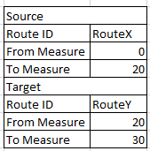
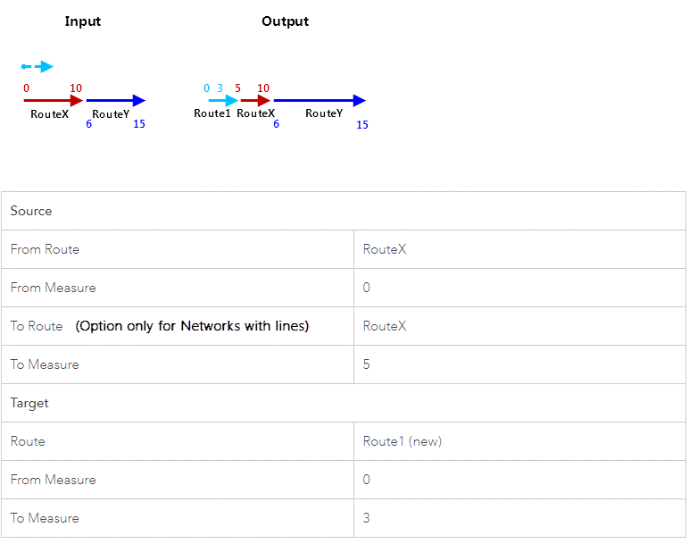
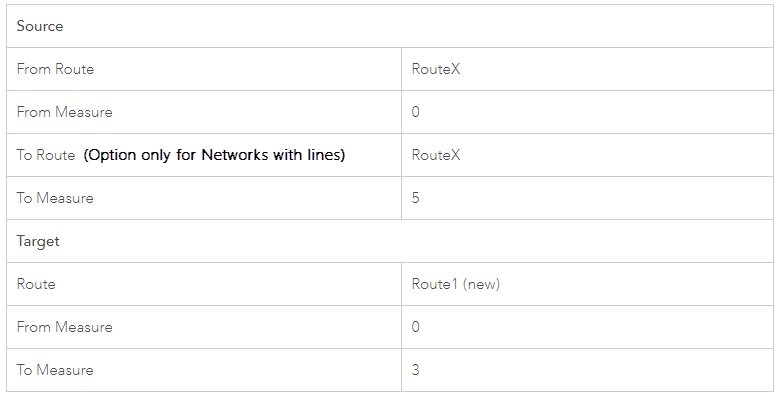
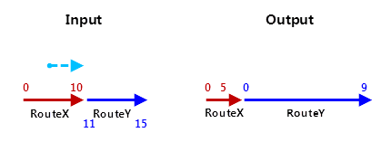
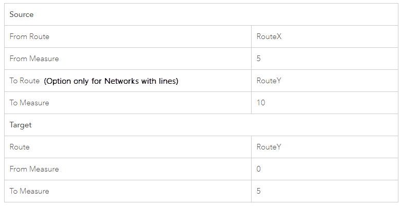
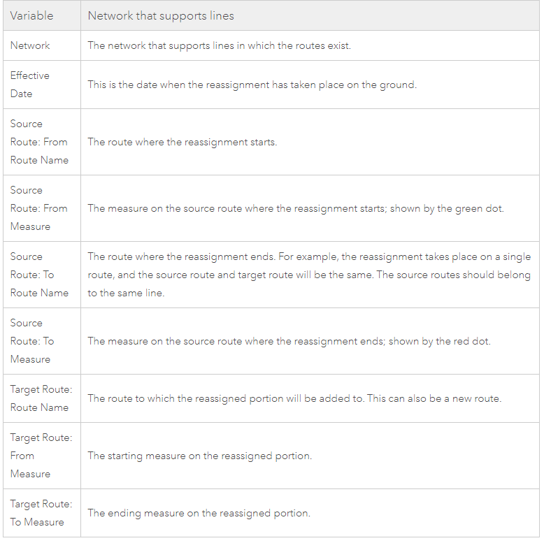
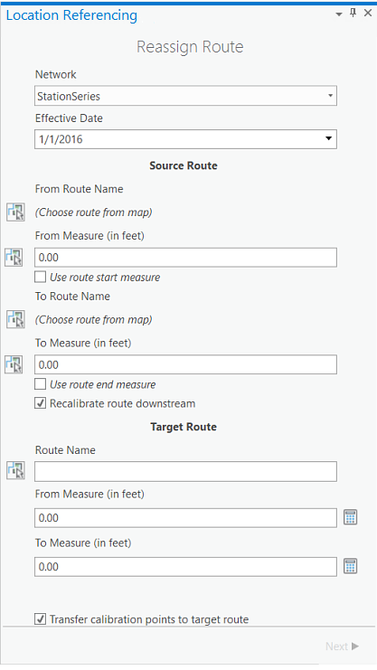
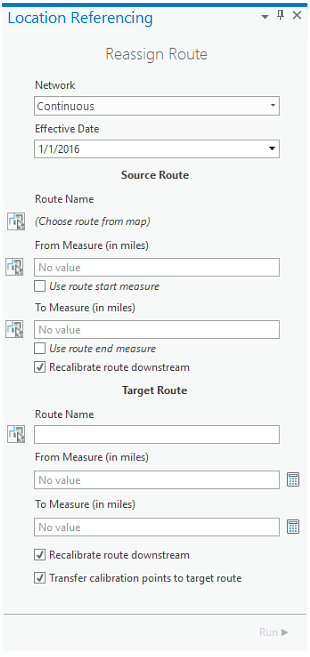
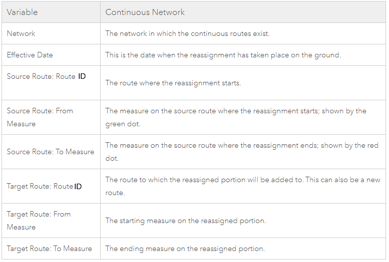
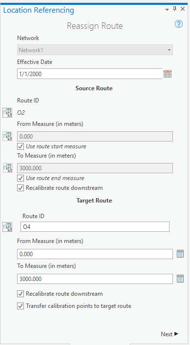
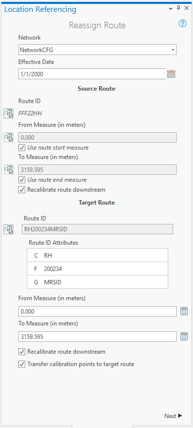
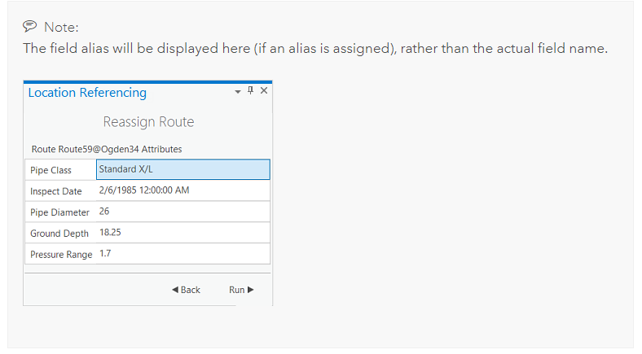
