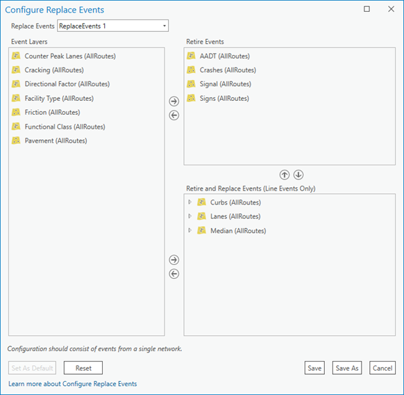
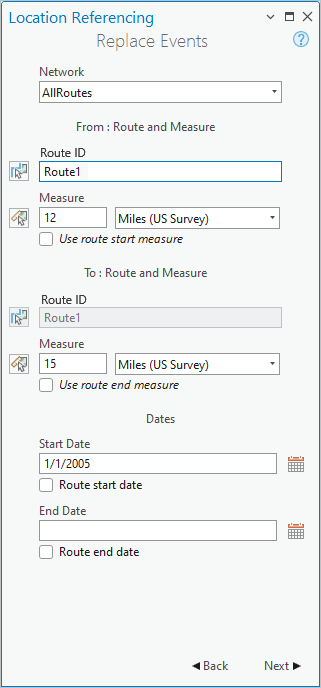
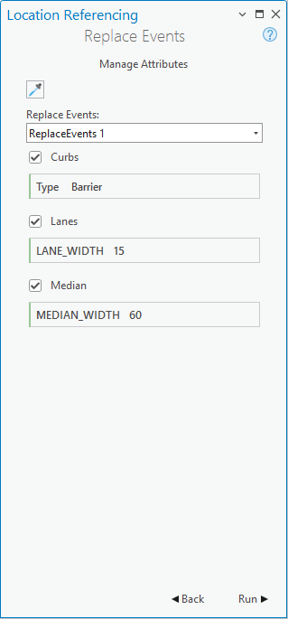

# Replace Events

|   |   |
| --- | --- |
| **Kind** | Other · Pro |
| **Release** | — |
| **Product** | Roads & Highways |
| **Source** | [RH_replaceEvents.docx](<https://esriis.sharepoint.com/sites/LocationReferencing/Shared%20Documents/General/Doc%20Reviews/Pro36_Ent12/6643_replaceEvents/RH_replaceEvents.docx>) |
| **Edited** | 2025-09-16 03:59 by unknown |
| **Extracted** | 2026-09-04 · lane `xmlstrip` |

<!-- metadata
```yaml
title: "Replace Events"
source_file: "RH_replaceEvents.docx"
source_url: "https://esriis.sharepoint.com/sites/LocationReferencing/Shared%20Documents/General/Doc%20Reviews/Pro36_Ent12/6643_replaceEvents/RH_replaceEvents.docx"
doc_id: 123
doc_kind: "Other"
surface: "Pro"
doc_revision: ""
target_release: ""
pe: ""
dev: ""
author: ""
last_edited_by: ""
last_edited: "2025-09-16T03:59:26.2949278Z"
extracted: 2026-09-04
extraction_lane: xmlstrip
prompt_version: "v2.0.2"
keywords: ["event replacement", "retire events", "line event", "point event", "route and measure", "coordinates", "location offset", "referent offset", "event editing", "conflict prevention"]
tools: ["Replace Events", "Configure Replace Events", "Enable Referent Fields"]
products: ["Roads & Highways"]
issues: []
related: [{"doc":122,"file":"replace-events__doc122.md","s":9.32},{"doc":234,"file":"add-point-events-by-location-offset__doc234.md","s":4.005},{"doc":235,"file":"add-point-events-by-location-offset__doc235.md","s":3.939},{"doc":120,"file":"add-multiple-line-events-by-route-and-measure__doc120.md","s":3.589},{"doc":319,"file":"event-editing-using-feature-edits__doc319.md","s":2.794}]
```
-->

## Summary

Describes the process and configuration for replacing roadway events using the Replace Events pane in ArcGIS Pro. Covers event replacement scenarios, methods for locating measures, referent offset handling, and conflict prevention during event editing.

## Related documents

<!-- related:begin -->
- [Replace Events](<https://esriis.sharepoint.com/sites/lrsworkspace/LRS Doc Index/Other/replace-events__doc122.md>) — similar text 0.70 · 2 title words · 2 filename words · same kind/surface/folder <!-- rel:122 -->
- [Add Point Events by Location Offset](<https://esriis.sharepoint.com/sites/lrsworkspace/LRS Doc Index/Other/add-point-events-by-location-offset__doc234.md>) — similar text 0.41 · 1 title word · 1 filename word · same kind/surface <!-- rel:234 -->
- [Add Point Events by Location Offset](<https://esriis.sharepoint.com/sites/lrsworkspace/LRS Doc Index/Other/add-point-events-by-location-offset__doc235.md>) — similar text 0.39 · 1 title word · 1 filename word · same kind/surface <!-- rel:235 -->
- [Add multiple line events by route and measure](<https://esriis.sharepoint.com/sites/lrsworkspace/LRS Doc Index/Other/add-multiple-line-events-by-route-and-measure__doc120.md>) — similar text 0.40 · 1 title word · 1 filename word · same kind/surface <!-- rel:120 -->
- [Event Editing Using Feature Edits](<https://esriis.sharepoint.com/sites/lrsworkspace/LRS Doc Index/Other/event-editing-using-feature-edits__doc319.md>) — similar text 0.35 · same kind/surface <!-- rel:319 -->
<!-- related:end -->

<!-- docs:begin -->
## Esri documentation

[Replace events](https://doc.esri.com/en/arcgis-pro/latest/help/production/roads-highways/replace-events.html) · [Event behavior for route retirement](https://doc.esri.com/en/arcgis-pro/latest/help/production/roads-highways/event-behavior-for-route-retirement.html) · [Storing referent and offset information for event location](https://doc.esri.com/en/arcgis-pro/latest/help/production/roads-highways/storing-referent-and-offset-information-for-event-location.html) · [Event editing using the attribute table](https://doc.esri.com/en/arcgis-pro/latest/help/production/roads-highways/event-editing-using-the-attribute-table.html) · [Conflict prevention](https://doc.esri.com/en/arcgis-pro/latest/help/production/roads-highways/conflict-prevention.html)

_No page matched:_ [Configure Replace Events](https://www.google.com/search?q=%22Configure%20Replace%20Events%22+site%3Adoc.esri.com) · [Enable Referent Fields](https://www.google.com/search?q=%22Enable%20Referent%20Fields%22+site%3Adoc.esri.com)
<!-- docs:end -->

---

## Replace events
During roadway replacement, events that were part of the replaced roadway can be updated using an event replacement configuration that groups event layers so that multiple events can be retired or replaced by new events in a single editing operation.
You must create an event replacement configuration using the Configure Replace Events dialog box before using the Replace Events pane.

### Event replacement scenario
In the following example, the events in the three sections of the Configure Replace Events dialog box are exclusive. When events are replaced using a saved configuration, the following occurs:

- Events in the Event Layers list are left as is.
- Events in the Retire Events list are retired using the date provided in the Replace Events pane. Retirement is valid for both point and line events.
- Events in the Retire and Replace Events list are retired and re-created using the dates provided in the Replace Events pane. Only line events can be retired and replaced. If the replacement does not cover the entire line event, it will be segmented with time slices.
Tip:
This example configuration is used in the event replacement steps below.

All the line events that are configured in the Retire and Replace Events list of the Configure Replace Events dialog box appear in the Manage Attributes section when the configuration is chosen using the Replace Events pane.

### Event replacement methods
The following table provides details on the methods used to replace events in the procedure below:

##### Methods for locating the measures

| Method | Description | Additional feature classes needed in the service | Additional information |
| --- | --- | --- | --- |
| Route and measure | The measure is located based on the measure values from the selected route. | None | Add line events by route and measure |
| Coordinates | The measure is located by x,y- and z-coordinates. | None | Add line events by coordinates |
| Location Offset | The measure is located as an offset distance from a location. | LRS intersection or point event layers registered to the specified network, or non-LRS point feature layers | Add line events by location offset |

### Event replacement
To replace events using an event replacement configuration, complete the following steps:

- Open a map in ArcGIS Pro, and zoom to the location where you want to replace events.
- On the Location Referencing tab, in the Events group, click Replace .
- The Replace Events pane appears.
- Route and Measure is the default method in the From Method and To Method drop-down menus.
- Choose the methods to locate the events to replace from the From Method and To Method drop-down lists.
- Note:
- You can use a combination of any of the event replacement methods to locate the From measure and To measure. For example, you can use Route and measure to choose the From measure value, and use Coordinates to define the To measure value along the route on the map.
- Click Next.
- The specified methods appear in the From and To sections. For example, From: Route and Measure and To: Coordinates appear if the specified start method is Route and Measure and the specified end method is Coordinates.
- If the Coordinates method is specified, choose a spatial reference, and provide the measure values as coordinates using any of the provided tools.
- If the Location Offset method is specified, choose an eligible point feature layer. and provide the measure values as an offset from a location using any of the provided tools.
- Click the Network drop-down arrow and choose the network to use as the source linear referencing method (LRM) for event replacement.
- Note:
- The LRS Network must be published as a feature service layer.
- In the From: Route and Measure section, specify the route by doing either of the following:
  - Type the route ID in the Route ID text box.
  - Click Choose route from map  and click the route on the map.
- In the From: Route and Measure section, provide the measure by doing any of the following:
  - Provide the start measure in the Measure text box.
  - Click Choose measure from map  and click the start measure location on the map.
  - Check the Use route start measure check box to use the route's start measure as the From measure value for the event replacement.
- A green dot appears at the selected location on the map.
- Optionally, in the From: Route and Measure section, choose a unit of measurement using the drop-down arrow.
- In the To: Route and Measure section, specify a route by doing either of the following:
- Note:
- If there is only one route, the text box in this section is inactive.
  - Type the route ID in the Route ID text box.
  - Click Choose route from map  and click the end measure location on the map.
- In the To: Route and Measure section, do one of the following to specify the end measure for the event replacement along the route:
  - Provide the end measure in the Measure text box.
  - Click Choose measure from map  and click the end measure location on the map.
  - Check the Use route end measure check box to use the route's end measure as the To measure value for the event replacement.
- A red dot appears at the selected location on the map.
- Note:
- -The events located between the specified start and end measure values are updated as follows:
  - The events in the Retire Events list are retired.
  - The events in the Retire and Replace Events list are retired and replaced by new events.
- If the replacement does not cover the entire event, it will be segmented with time slices.
- Optionally, in the To: Route and Measure section, choose a unit of measurement using the drop-down arrow.
- Specify the date to define the start date of the events that are replaced by doing one of the following:
  - Provide the date in the Start Date text box.
  - Choose the start date using the Calendar .
  - Check the Route start date check box to use the route start date.
- Note:
- The start date is used as follows:
  - Retirement Date—For events in the Retire Events list
  - Retirement Date—For events in the Retire and Replace Events list
  - Start Date—For the replacement events in the Retire and Replace Events list
- Optionally, specify the date to define the end date of the events that are replaced by doing one of the following:
  - Provide the date in the End Date text box.
  - Choose the end date using the Calendar .
  - Check the Route end date check box to use the route end date.
- Note:
- The end date is used as the end date for the replacement events in the Retire and Replace list.
- Click Next.
- The Manage Attributes section appears.
- Note:
- If no events are configured for retirement or for retirement and replacement, a message appears.
- Click the Replace Events drop-down arrow and choose an event replacement configuration.
- The editable attributes for each of the configured event layers are listed. Events configured for retirement are not listed because they are not replaced.
- Tip:
- If you don't want to retire an event, update the configuration to leave it as is. To leave an event as is, it must not appear in either the Retire Events list or the Retire and Replace Events list before event replacement is run.
- Provide the replacement values in the attribute fields.
- Click Run to complete the event replacement for the specified route or route segment.
  - The events in the Retire Events list are retired.
  - The events in the Retire and Replace Events list are retired, re-created, and displayed on the map.

### Referent offset when using event replacement
The Roads and Highways events data model supports the configuration of referent event fields and their enablement using the Enable Referent Fields tool. Once referent fields are configured and enabled in an event layer, referent information is populated and persisted in that layer when events are added or edited.
When line events are replaced using the Route and Measure method, the parent LRS Network is used as the FromRefMethod and ToRefMethod values, the route is used as the FromRefLocation and ToRefLocation values, and the FromRefOffset and ToRefOffset fields are populated with the route measures.
When line events are replaced using the Coordinates method, X/Y is used as the FromRefMethod and ToRefMethod values, geographic coordinates are used as the FromRefLocation and ToRefLocation values, and the FromRefOffset and ToRefOffset fields are populated with 0.
When line events are replaced using the Location Offset method in a referent-enabled layer, the point feature layer's name is used as the RefMethod value. The RefLocation value is Intersection ID if the point feature layer used is an LRS intersection; otherwise, the value is Object ID. The FromRefOffset and ToRefOffset fields are populated with the input offset measure values.
The following table provides details on how event referent fields are populated based on the replacement method:

| Method | From Ref erent Method | From Referent Location | From Referent Offset | To Referent Method | To Referent Location | To Referent Offset |
| --- | --- | --- | --- | --- | --- | --- |
| Route and Measure | Parent LRS Network | Route ID | Measure value | Parent LRS Network | Route ID | Measure value |
| Coordinates | X/Y | G eographic coordinates | 0 | X/Y | G eographic coordinates | 0 |
| Location Offset | Point feature layer's name | Intersection ID or Object ID | Input offset measure values | Point feature layer's name | Intersection ID or Object ID | Input offset measure values |

The examples below demonstrate replacing events that have referent fields enabled.

#### Before replacing events using route and measure
In the following example, a point event and a line event already have referents populated using the Route and Measure method. The Mile Marker point event is retired, and the Speed Limit line event is retired and replaced using updated information.
The following diagram shows the route and its associated events before event replacement:

The following table provides details about the route before event replacement:

| Route ID | From Date | To Date | From Measure | To Measure |
| --- | --- | --- | --- | --- |
| Route1 | 1/1/2000 | <Null> | 0 | 18 |

The following table provides details about the event referent fields of the Mile Marker point event before event replacement:

| RefMethod | RefLocation | RefOffset |
| --- | --- | --- |
| AllRoutes | Route1 | 9 |

The following table shows the other event fields of the Mile Marker point event before event replacement:

| Event ID | Route ID | From Date | To Date | Measure | Milepost County |
| --- | --- | --- | --- | --- | --- |
| MM 1 | Route1 | 1/1/2000 | <Null> | 9 | 9 Winona |

The following table provides details about the event referent fields of the Speed Limit line event before event replacement:

| FromRefMethod | FromRefLocation | FromRefOffset | ToRefMethod | ToRefLocation | ToRefOffset |
| --- | --- | --- | --- | --- | --- |
| AllRoutes | Route1 | 0 | AllRoutes | Route1 | 18 |

The following table shows the other event fields of the Speed Limit line event before event replacement:

| Event ID | Route ID | From Date | To Date | From Measure | To Measure | Speed MPH |
| --- | --- | --- | --- | --- | --- | --- |
| Event1 | Route1 | 1/1/2000 | <Null> | 0 | 18 | 50 |

#### After replacing events using route and measure
The following diagram shows the route and its associated events after event replacement:

The Mile Marker point event is retired as of 1/1/2005, and the Speed Limit line event is retired and replaced as of 1/1/2005.
The following table provides details about the event referent fields of the Mile Marker point event after event replacement:

| RefMethod | RefLocation | RefOffset |
| --- | --- | --- |
| AllRoutes | Route1 | 9 |

The following table provides details about the other event fields of the Mile Marker point event after event replacement:

| Event ID | Route ID | From Date | To Date | Measure | Milepost County |
| --- | --- | --- | --- | --- | --- |
| MM 1 | Route1 | 1/1/2000 | 1/1/2005 | 9 | 9 Winona |

The following table provides details about the event referent fields of the Speed Limit line event after event replacement:

| FromRefMethod | FromRefLocation | FromRefOffset | ToRefMethod | ToRefLocation | ToRefOffset |
| --- | --- | --- | --- | --- | --- |
| AllRoutes | Route1 | 0 | AllRoutes | Route1 | 1 8 |

The following tables provide details about the other event fields of the Speed Limit line event after event replacement:

| Event ID | Route ID | From Date | To Date | From Measure | To Measure | Speed MPH |
| --- | --- | --- | --- | --- | --- | --- |
| Event1 | Route1 | 1/1/2000 | 1/1/2005 | 0 | 18 | 50 |
| Event1 | Route1 | 1/1/2005 | <Null> | 0 | 1 8 | 65 |

#### Before replacing events using coordinates
In the following example, a point event and a line event already have referents populated using the Coordinates method. The Mile Marker point event is retired, and the Speed Limit line event is retired and replaced using updated information.
The following diagram shows the route and its associated events before event replacement:

The following table provides details about the route and its associated events before event replacement:

| Route ID | From Date | To Date | From Measure | To Measure |
| --- | --- | --- | --- | --- |
| Route1 | 1/1/2000 | <Null> | 0 | 18 |

The following table provides details about the event referent fields of the Mile Marker point event before event replacement:

| RefMethod | RefLocation | RefOffset |
| --- | --- | --- |
| X/Y | 609379., 4878041.414300256, 0 603589., 4879529.521900258, 0 | 0 |

The following tables provide details about the other event fields of the Mile Marker point event before event replacement:

| Event ID | Route ID | From Date | To Date | Measure | Milepost County |
| --- | --- | --- | --- | --- | --- |
| MM 1 | Route1 | 1/1/2000 | <Null> | 9 | 9 Winona |

The following table provides details about the event referent fields in the Speed Limit line event before event replacement:

| FromRefMethod | FromRefLocation | FromRefOffset | ToRefMethod | ToRefLocation | ToRefOffset |
| --- | --- | --- | --- | --- | --- |
| X/Y | 603300., 4879694., 0 | 0 | X/Y | 603877., 4879364.121300257, 0 | 0 |

The following table shows the other event fields of the Speed Limit line event before event replacement:

| Event ID | Route ID | From Date | To Date | From Measure | To Measure | Speed MPH |
| --- | --- | --- | --- | --- | --- | --- |
| Event1 | Route1 | 1/1/2000 | <Null> | 0 | 18 | 50 |

#### After replacing events using coordinates
The following diagram shows the route and its associated events after event replacement:

The Mile Marker point event is retired as of 1/1/2005, and the Speed Limit line event is retired and replaced as of 1/1/2005.
The following table provides details about the event referent fields of the Mile Marker point event after event replacement:

| RefMethod | RefLocation | RefOffset |
| --- | --- | --- |
| X/Y | 603589., 4879529.521900258, 0 | 0 |

The following tables provide details about the other event fields of the Mile Marker point event after event replacement:

| Event ID | Route ID | From Date | To Date | Measure | Milepost County |
| --- | --- | --- | --- | --- | --- |
| MM 1 | Route1 | 1/1/2000 | 1/1/2005 | 9 | 9 Winona |

The following table provides details about the event referent fields of the Speed Limit line event after event replacement:

| FromRefMethod | FromRefLocation | FromRefOffset | ToRefMethod | ToRefLocation | ToRefOffset |
| --- | --- | --- | --- | --- | --- |
| X/Y | 603300., 4879694., 0 | 0 | X/Y | 603877., 4879364.121300257, 0 | 0 |

The following tables provide details about the other event fields of the Speed Limit line event after event replacement:

| Event ID | Route ID | From Date | To Date | From Measure | To Measure | Speed MPH |
| --- | --- | --- | --- | --- | --- | --- |
| Event1 | Route1 | 1/1/2000 | 1/1/2005 | 0 | 18 | 50 |
| Event1 | Route1 | 1/1/2005 | <Null> | 0 | 1 8 | 65 |

#### Before replacing events using location offset
In the following example, the Speed Limit line event and the Mile Marker point event already have referents populated using the Location Offset method. The Mile Marker point event is retired, and the Speed Limit line event is retired and replaced using updated information. An intersection feature is located on Route1 at measure 9.
The following diagram shows the route, associated events, and intersection before event replacement:

The following table provides details about the route before event replacement:

| Route ID | From Date | To Date | From Measure | To Measure |
| --- | --- | --- | --- | --- |
| Route1 | 1/1/2000 | <Null> | 0 | 18 |

The following table provides details about the event referent fields of the Mile Marker point event before event replacement:

| RefMethod | RefLocation | RefOffset |
| --- | --- | --- |
| X/Y All Routes Intersections | 608858., 4878600.156487618, 0 Intersection1 | 0 4.5 |

The following table provides details about the other event fields of the Mile Marker point event before event replacement:

| Event ID | Route ID | From Date | To Date | Measure | Milepost County |
| --- | --- | --- | --- | --- | --- |
| MM 1 | Route1 | 1/1/2000 | <Null> | 13.5 | 13.5 Winona |

The following table provides details about the event referent fields in the Speed Limit line event before event replacement:

| FromRefMethod | FromRefLocation | FromRefOffset | ToRefMethod | ToRefLocation | ToRefOffset |
| --- | --- | --- | --- | --- | --- |
| X/Y All Routes Intersections | 608225., 4878839.461400257, 0 Intersection1 | 0 -9 | X/Y All Routes Intersections | 609068., 4878520.490600259, 0 Intersection1 | 0 9 |

The following table provides details about the other event fields in the Speed Limit line event before event replacement:

| Event ID | Route ID | From Date | To Date | From Measure | To Measure | Speed MPH |
| --- | --- | --- | --- | --- | --- | --- |
| Event1 | Route1 | 1/1/2000 | <Null> | 0 | 18 | 50 |

#### After replacing events using location offset
The following diagram shows the route and its associated events after event replacement:

The Mile Marker point event is retired as of 1/1/2005, and the Speed Limit line event is retired and replaced as of 1/1/2005.
The following table provides details about the event referent fields of the Mile Marker point event after event replacement:

| RefMethod | RefLocation | RefOffset |
| --- | --- | --- |
| X/Y All Routes Intersections | 609379., 4878041.414300256, 0 Intersection1 | 0 4.5 |

The following tables provide details about the other event fields of the Mile Marker point event after event replacement:

| Event ID | Route ID | From Date | To Date | Measure | Milepost County |
| --- | --- | --- | --- | --- | --- |
| MM 1 | Route1 | 1/1/2000 | 1/1/2005 | 13.5 | 13.5 Winona |

The following table provides details about the event referent fields of the Speed Limit line event after event replacement:

| FromRefMethod | FromRefLocation | FromRefOffset | ToRefMethod | ToRefLocation | ToRefOffset |
| --- | --- | --- | --- | --- | --- |
| All Routes Intersections | Intersection1 | - 9 | All Routes Intersections | Intersection1 | 9 |

The following table provides details about the other event fields of the Speed Limit line event after event replacement:

| Event ID | Route ID | From Date | To Date | From Measure | To Measure | Speed MPH |
| --- | --- | --- | --- | --- | --- | --- |
| Event1 | Route1 | 1/1/2000 | 1/1/2005 | 0 | 18 | 50 |
| Event1 | Route1 | 1/1/2005 | <Null> | 0 | 1 8 | 65 |

### Event editing with conflict prevention enabled
You can edit events after acquiring locks for event layers in the Replace Events pane under the following conditions:

- No one has a lock on the event layers in the Replace Events pane in any version of the feature service for the route on which the events are located.
- You have an existing event lock on event layers in the Replace Events pane in the same version of the feature service in which you are working.
You can't edit the events in the Replace Events pane under the following conditions:

- Some or all of the event layers in the Replace Events pane are locked by another person for the route on which the event is located.
- Some or all of the event layers in the Replace Events pane are locked by you but in a different version.
- The event is located on a route that is locked by another person.
- The event is located on a route that is locked by you but in a different version.

       
