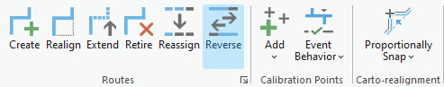

# Reverse routes

|   |   |
| --- | --- |
| **Kind** | Other · Pro |
| **Release** | — |
| **Product** | Roads & Highways |
| **Source** | [RH_ReverseRoute.docx](<https://esriis.sharepoint.com/sites/LocationReferencing/Shared%20Documents/General/Doc%20Reviews/Pro37_Ent121/7069_7064_7081_7067_RouteEditing_AI_Assistant/RH_ReverseRoute.docx>) |
| **Edited** | 2026-02-12 23:22 by unknown |
| **Extracted** | 2026-09-04 · lane `xmlstrip` |

<!-- metadata
```yaml
title: "Reverse routes"
source_file: "RH_ReverseRoute.docx"
source_url: "https://esriis.sharepoint.com/sites/LocationReferencing/Shared%20Documents/General/Doc%20Reviews/Pro37_Ent121/7069_7064_7081_7067_RouteEditing_AI_Assistant/RH_ReverseRoute.docx"
doc_id: 72
doc_kind: "Other"
surface: "Pro"
doc_revision: ""
target_release: ""
pe: ""
dev: ""
author: ""
last_edited_by: ""
last_edited: "2026-02-12T23:22:55.7526121Z"
extracted: 2026-09-04
extraction_lane: xmlstrip
prompt_version: "v2.0.2"
keywords: ["route reversal", "calibration points", "route direction", "effective date", "line network", "route editing"]
tools: ["Reverse Route"]
products: ["Roads & Highways"]
issues: []
related: [{"doc":55,"file":"perform-an-action-with-the-arcgis-pro-assistant-beta__doc55.md","s":3.656},{"doc":62,"file":"perform-an-action-with-the-arcgis-pro-assistant-beta__doc62.md","s":3.653},{"doc":109,"file":"pro-ai-assistant-reverse-route-user-story__doc109.md","s":3.29},{"doc":743,"file":"support-reverse-route-in-pro__doc743.md","s":3.281},{"doc":739,"file":"support-reverse-route-event-behaviors__doc739.md","s":3.272}]
```
-->

## Summary

Describes the process and scenarios for reversing the direction of calibration on routes within an LRS Network using the Reverse Route tool. Explains how calibration points and measures are updated during route reversal and outlines the workflow steps to perform route reversal in ArcGIS Pro. Includes considerations for line and nonline networks and versioned editing through feature services.

## Related documents

<!-- related:begin -->
- [Perform an action with the ArcGIS Pro Assistant (Beta)](<https://esriis.sharepoint.com/sites/lrsworkspace/LRS Doc Index/Other/perform-an-action-with-the-arcgis-pro-assistant-beta__doc55.md>) — similar text 0.16 · 1 filename word · same kind/surface/folder <!-- rel:55 -->
- [Perform an action with the ArcGIS Pro Assistant (Beta)](<https://esriis.sharepoint.com/sites/lrsworkspace/LRS Doc Index/Other/perform-an-action-with-the-arcgis-pro-assistant-beta__doc62.md>) — similar text 0.16 · 1 filename word · same kind/surface/folder <!-- rel:62 -->
- [Pro AI Assistant Reverse Route User Story](<https://esriis.sharepoint.com/sites/lrsworkspace/LRS%20Doc%20Index/User%20Stories/pro-ai-assistant-reverse-route-user-story__doc109.md>) — similar text 0.16 · 1 title word · 2 filename words · same surface <!-- rel:109 -->
- [Support Reverse Route in Pro](<https://esriis.sharepoint.com/sites/lrsworkspace/LRS Doc Index/User Stories/support-reverse-route-in-pro__doc743.md>) — similar text 0.22 · 1 title word · 2 filename words · same surface <!-- rel:743 -->
- [Support Reverse Route Event Behaviors](<https://esriis.sharepoint.com/sites/lrsworkspace/LRS Doc Index/User Stories/support-reverse-route-event-behaviors__doc739.md>) — similar text 0.22 · 1 title word · 2 filename words · same surface <!-- rel:739 -->
<!-- related:end -->

<!-- docs:begin -->
## Esri documentation

[Reverse routes](https://doc.esri.com/en/arcgis-pro/latest/help/production/roads-highways/reverse-routes.html) · [Event behavior for route reversal](https://doc.esri.com/en/arcgis-pro/latest/help/production/roads-highways/event-behavior-for-route-reversal.html)
<!-- docs:end -->

---

## Reverse routes
During the lifespan of a roadway, the direction of calibration of a route may need to be reversed as a result of calibration in the wrong direction or in preparation for a realignment that requires route calibration to be reversed.
When this occurs, you can reverse the route direction using the Reverse Route tool; then you can reapply event behaviors to the reversed route.
Reversing a route is an editing activity that allows you to reverse the direction of calibration on a route or routes in an LRS Network. The Reverse Route tool updates calibration points located along the reversed route as well as reversing the route direction.
Note:
You can use the ArcGIS Pro Assistant (Beta) (link) to perform route reversal and guide you through the workflow.

### Route reversal scenarios
Route reversal scenarios are described below.

#### Route reversal with intermediate calibration points at equidistance
In the following example, Route1 has a start measure of 0 and an end measure of 10 with intermediate calibration points at 2.5, 5, and 7.5:

After reversing the route, start and end measures are reversed, and intermediate calibration measures are updated, but the location of calibration points remains unchanged.

#### Route reversal with disproportionate intermediate calibration points
In the following example, Route1 has a start measure of 0 and an end measure of 10 with a disproportionate intermediate calibration point (8):

Start and end measures are reversed, and the intermediate calibration measure is updated from 8 to 2, but the location of the calibration point remains unchanged.

#### Route reversal on a line in a line network
Before reversal, Route1 has a start measure of 0 and an end measure of 10, Route2 has start and end measures of 15 and 25, and Route3 has start and end measures of 30 and 40. The line order for the routes is 100, 200, and 300, respectively.
In the following example, three routes that are present on a line (LineA) in a line network are reversed:

After the reversal, start and end measures are updated, but the location of the calibration points remains unchanged.

After reversal, each of the routes has the same start and end measures but in the opposite direction. The line order remains the same before and after the route reversal.

### Route reversal workflow
To reverse a route, complete the following steps:

- Add the network feature class to a map.
- Alternatively, open a map in which the network feature class is present.
- Note:
- Branch versioned networks, including any network configured with a user-generated route ID, must be edited through a feature service.
- Zoom in to the location of the route you want to reverse.
- On the Location Referencing tab, in the Routes group, click Reverse .
- The Reverse Route pane appears.
- Choose the network in which you want to reverse the route.
  - If the network is a nonline network, the Route Name option appears in the pane.
  - If the network is a line network, the From Route Name and To Route Name fields appear in the pane.
- Note:
- To edit using feature services, the LRS Network must be published with the Linear Referencing and Version Management capabilities.
- Provide an effective date for the route reversal by doing one of the following:
  - Double-click in the Effective Date text box to use today's date.
  - Provide the date in the Effective Date text box.
  - Click the Calendar button  and choose a date.
- Choose a route to reverse by clicking the Choose route from map button .
- If the network is a line network, click the Choose route from map button , and choose the to route name in the To Route Name section.
- If the From Route Name and To Route Name values in a line network are not the same, the routes spanned by the map selection are reversed.
- Click Run.
- The selected routes are reversed.

    
