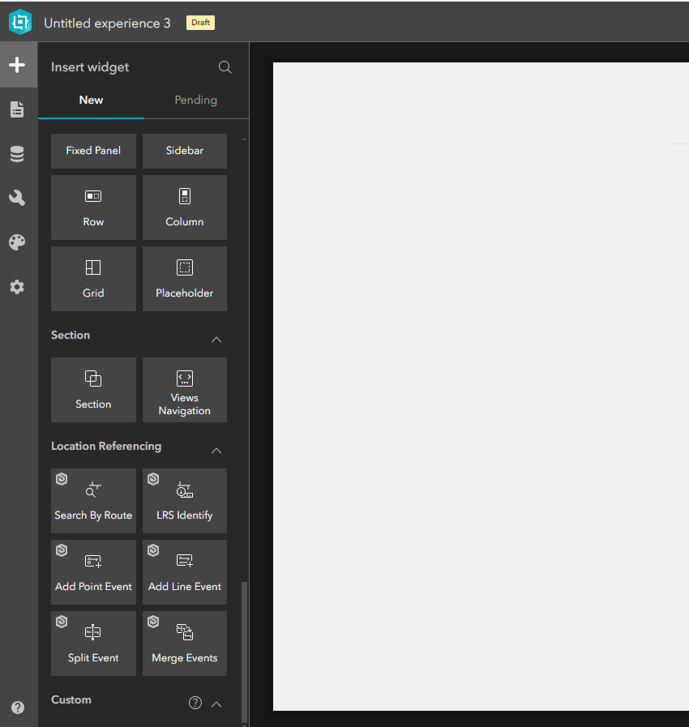

# Roads and Highways and Pipeline Referencing 11.x Experience Builder Widgets

| Field | Value |
| --- | --- |
| **Doc** | 397 · Other · Experience Builder |
| **Product** | Roads & Highways · Pipeline Referencing |
| **Release** | — |
| **Issues** | — |
| **Source** | [What.sNewEnterprise.docx](<https://esriis.sharepoint.com/sites/LocationReferencing/Shared%20Documents/General/Doc%20Reviews/What.sNewEnterprise.docx>) |
| **People** | author Nathan Easley · PE — · dev — |
| **Edited** | 2024-03-22 17:01 by Ignacia Galvan |
| **Extracted** | 2026-09-04 · lane xmlstrip · format 3.0 · prompt v2.0.2 |
| **Keywords** | roads and highways · pipeline referencing · experience builder · widgets · route search · event editing · point event · line event |
| **Tools** | LRS Search by Route · LRS Identify · Add Point Event · Add Line Event · Split Events · Merge Events |

## Summary

Describes the new ArcGIS Experience Builder widgets available for Roads and Highways 11.3 and Pipeline Referencing 11.23 releases. Details widgets for route search, event identification, adding point and line events, splitting and merging events, and mentions template applications to assist configuration.

## Related documents

<!-- related:begin -->
- [Roads and Highways and Pipeline Referencing Enhancements in Experience Builder](<https://esriis.sharepoint.com/sites/lrsworkspace/LRS Doc Index/Other/rh-and-apr-enhancements-in-exb.md>) — similar text 0.20 · 5 title words · 2 filename words · same kind/surface <!-- rel:305 s=6.72 -->
- [ArcGIS Roads and Highways Experience Builder Widgets](<https://esriis.sharepoint.com/sites/lrsworkspace/LRS Doc Index/Other/667-arcgis-rh-exb-widgets.md>) — similar text 0.49 · 5 title words · same kind/surface <!-- rel:398 s=6.121 -->
- [ArcGIS Pipeline Referencing Experience Builder Widgets](<https://esriis.sharepoint.com/sites/lrsworkspace/LRS Doc Index/Other/667-arcgis-apr-exb-widgets.md>) — similar text 0.44 · 4 title words · same kind/surface <!-- rel:399 s=5.565 -->
- [Roads and Highways and Pipeline Referencing Enhancements in ArcGIS Pro](<https://esriis.sharepoint.com/sites/lrsworkspace/LRS%20Doc%20Index/Other/rh-and-apr-enhancements-in-pro.md>) — similar text 0.16 · 3 title words · 1 filename word · same kind <!-- rel:304 s=3.776 -->
- [What's new in ArcGIS Roads and Highways 12.1](<https://esriis.sharepoint.com/sites/lrsworkspace/LRS Doc Index/Other/whats-new-in-arcgis-rh-12-1.md>) — similar text 0.23 · 2 title words · 1 filename word · same kind/surface <!-- rel:56 s=3.708 -->
<!-- related:end -->

<!-- docs:begin -->
## Esri documentation

[Merge events](https://doc.esri.com/en/arcgis-pro/latest/help/production/roads-highways/merge-events.html) · [3D in Roads and Highways](https://doc.esri.com/en/arcgis-pro/latest/help/production/roads-highways/3d-in-roads-and-highways.html) · [3D in Pipeline Referencing](https://doc.esri.com/en/arcgis-pro/latest/help/production/location-referencing-pipelines/3d-in-pipeline-referencing.html) · [Event editing using the attribute table](https://doc.esri.com/en/arcgis-pro/latest/help/production/roads-highways/event-editing-using-the-attribute-table.html)

_No page matched:_ [LRS Search by Route](https://www.google.com/search?q=%22LRS%20Search%20by%20Route%22+site%3Adoc.esri.com) · [LRS Identify](https://www.google.com/search?q=%22LRS%20Identify%22+site%3Adoc.esri.com) · [Add Point Event](https://www.google.com/search?q=%22Add%20Point%20Event%22+site%3Adoc.esri.com) · [Add Line Event](https://www.google.com/search?q=%22Add%20Line%20Event%22+site%3Adoc.esri.com) · [Split Events](https://www.google.com/search?q=%22Split%20Events%22+site%3Adoc.esri.com)
<!-- docs:end -->

---

### Roads and Highways
The 11.3 release of ArcGIS Roads and Highways includes enhancements to the software and the documentation.

###### Note:
For a complete list of enhancements and issues addressed, visit the https://support.esri.com/en/Downloads product download page.
The following enhancements has been made to the Roads and Highways tools:
ArcGIS Experience Builder widgets designed for Roads and Highways are now available.  These widgets will appear in the Location Referencing group list of available widgets when creating a new experience within Experience Builder in an ArcGIS Enterprise Pportal.  These widgets can be deployed individually to create specific- use applications, like such as a route search or crash entry app, or with multiple widgets in an application, like such as an event editor replacement.
The following widgets are now available that and work with your Roads and Highways data.

- LRS Search by Route– Search for specific locations on your routes via by route and/or /measure, coordinates, or offset.
- LRS Identify – Get route, measure, and event attribute information at a location with one click.
- Add Point Event – Add one or more LRS point events at a location on a route.
- Add Line Event – Add one more LRS linear events across a measure range of a route (or routes if the events span routes).
- Split Events – Split an event at a location into two events with new attributes.
- Merge Events – Merge two adjacent events into a single event with updated attributes.
In addition, tThere will beare also template applications released available to assist users you with configuring common applications that utilize use these widgets.

### Pipeline Referencing
The 11.23 release of ArcGIS Pipeline Referencing includes enhancements to the software and the documentation.

###### Note:
For a complete list of enhancements and issues addressed, visit the https://support.esri.com/en/Downloads product download page.
The following enhancements has been made to the Pipeline Referencing tools:
ArcGIS Experience Builder widgets designed for Pipeline Referencing are now available.  These widgets will appear in the Location Referencing grouplist of available widgets when creating a new experience within Experience Builder in an ArcGIS Enterprise Pportal.  These widgets can be deployed individually to create specific use applications, like such as a route search or pipe exposure entry app, or with multiple widgets in an application, like such as an event editor replacement.
The following widgets are now available that and work with your Pipeline Referencing data.

- LRS Search by Route– Search for specific locations on your routes via by route and/or /measure (or station), coordinates, or offset.
- LRS Identify – Get route, measure, and event attribute information at a location with one click.
- Add Point Event – Add one or more LRS point events at a location on a route.
- Add Line Event – Add one more LRS linear events across a measure range of a route (or routes if the events span routes).
- Split Events – Split an event at a location into two events with new attributes.
- Merge Events – Merge two adjacent events into a single event with updated attributes.
In addition, tThere will beare also template applications released available to assist users you with configuring common applications that utilize use these widgets.

