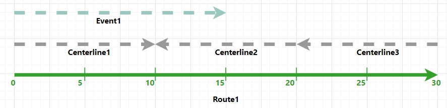
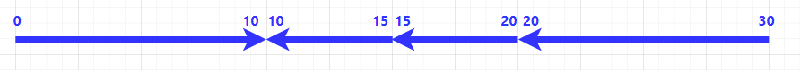

# Roads and Highways and Pipeline Referencing Enhancements

|   |   |
| --- | --- |
| **Kind** | Other · Pro |
| **Release** | — |
| **Product** | Roads & Highways · Pipeline Referencing · Utility Network |
| **Issue** | [ArcGISPro/ps-location-referencing#5671](https://devtopia.esri.com/ArcGISPro/ps-location-referencing/issues/5671) |
| **Source** | [5671_What.sNewPro_addCLdirection.docx](<https://esriis.sharepoint.com/sites/LocationReferencing/Shared%20Documents/General/Doc%20Reviews/5671_What.sNewPro_addCLdirection.docx>) |
| **Edited** | 2024-03-12 20:16 by unknown |
| **Extracted** | 2026-09-04 · lane `xmlstrip` |

<!-- metadata
```yaml
title: "Roads and Highways and Pipeline Referencing Enhancements"
source_file: "5671_What.sNewPro_addCLdirection.docx"
source_url: "https://esriis.sharepoint.com/sites/LocationReferencing/Shared%20Documents/General/Doc%20Reviews/5671_What.sNewPro_addCLdirection.docx"
doc_id: 408
doc_kind: "Other"
surface: "Pro"
doc_revision: ""
target_release: ""
pe: ""
dev: ""
author: "Nathan Easley"
last_edited_by: ""
last_edited: "2024-03-12T20:16:35.3049311Z"
extracted: 2026-09-04
extraction_lane: xmlstrip
prompt_version: "v2.0.2"
keywords: ["roads and highways", "pipeline referencing", "snap event behavior", "cartographic realignment", "address management", "geoprocessing", "centerline", "routes", "events"]
tools: ["Configure Address Feature Classes", "Append Routes", "Overlay Events", "Retire Route", "Cartographic Realignment"]
products: ["Roads & Highways", "Pipeline Referencing", "Utility Network"]
issues: ["ArcGISPro/ps-location-referencing#5671"]
related: [{"doc":366,"file":"pro-3-3-and-11-3-iteration-issue-tracking__doc366.md","s":1001.705},{"doc":304,"file":"roads-and-highways-and-pipeline-referencing-enhancements-in-arcgis-pro__doc304.md","s":4.834},{"doc":276,"file":"manage-address-and-roadway-characteristic-data-together-with-roads-and-highways__doc276.md","s":3.64},{"doc":403,"file":"manage-roads-and-highways-with-address-data-management__doc403.md","s":3.489},{"doc":565,"file":"manage-pipeline-referencing-and-a-utility-network-together__doc565.md","s":3.173}]
```
-->

## Summary

This document describes enhancements to the Roads and Highways and Pipeline Referencing tools, including new snap event behavior options in Retire Route and Cartographic Realignment. It details improvements in address management integration and geoprocessing tools such as Configure Address Feature Classes, Append Routes, and Overlay Events, which now support centerline and address data for dynamic segmentation and event overlay.

## Related documents

<!-- related:begin -->
- [Pro 3.3 and 11.3 Iteration Issue Tracking](<https://esriis.sharepoint.com/sites/lrsworkspace/LRS%20Doc%20Index/Schedules/pro-3-3-and-11-3-iteration-issue-tracking__doc366.md>) — shared issue ArcGISPro/ps-location-referencing#5671 · similar text 0.00 · 1 filename word · same surface/folder <!-- rel:366 -->
- [Roads and Highways and Pipeline Referencing Enhancements in ArcGIS Pro](<https://esriis.sharepoint.com/sites/lrsworkspace/LRS%20Doc%20Index/Other/roads-and-highways-and-pipeline-referencing-enhancements-in-arcgis-pro__doc304.md>) — similar text 0.20 · 4 title words · 2 filename words · same kind/surface <!-- rel:304 -->
- [Manage Address and Roadway Characteristic Data Together with Roads and Highways and Address Data Management Solution](<https://esriis.sharepoint.com/sites/lrsworkspace/LRS Doc Index/Other/manage-address-and-roadway-characteristic-data-together-with-roads-and-highways__doc276.md>) — similar text 0.21 · 2 title words · 1 filename word · same kind/surface <!-- rel:276 -->
- [Manage Roads and Highways with Address Data Management](<https://esriis.sharepoint.com/sites/lrsworkspace/LRS Doc Index/Other/manage-roads-and-highways-with-address-data-management__doc403.md>) — similar text 0.22 · 2 title words · same kind/surface/folder <!-- rel:403 -->
- [Manage Pipeline Referencing and a Utility Network Together](<https://esriis.sharepoint.com/sites/lrsworkspace/LRS Doc Index/Other/manage-pipeline-referencing-and-a-utility-network-together__doc565.md>) — similar text 0.14 · 1 title word · same kind/surface/folder <!-- rel:565 -->
<!-- related:end -->

<!-- docs:begin -->
## Esri documentation

[Retire routes](https://doc.esri.com/en/arcgis-pro/latest/help/production/roads-highways/retire-routes.html) · [Apply cartographic realignment](https://doc.esri.com/en/arcgis-pro/latest/help/production/roads-highways/apply-cartographic-realignment.html) · [3D in Roads and Highways](https://doc.esri.com/en/arcgis-pro/latest/help/production/roads-highways/3d-in-roads-and-highways.html) · [3D in Pipeline Referencing](https://doc.esri.com/en/arcgis-pro/latest/help/production/location-referencing-pipelines/3d-in-pipeline-referencing.html) · [Manage address and roadway characteristic data together](https://doc.esri.com/en/arcgis-pro/latest/help/production/roads-highways/manage-address-and-roadway-characteristic-data-together.html)

_No page matched:_ [Configure Address Feature Classes](https://www.google.com/search?q=%22Configure%20Address%20Feature%20Classes%22+site%3Adoc.esri.com) · [Append Routes](https://www.google.com/search?q=%22Append%20Routes%22+site%3Adoc.esri.com) · [Overlay Events](https://www.google.com/search?q=%22Overlay%20Events%22+site%3Adoc.esri.com)
<!-- docs:end -->

---

### Roads and Highways
The following enhancements has been made to the Roads and Highways tools:

- Snap event behavior in Retire Route – Snap event behavior is now an option for retire route.  When a route is retired and snap behavior is configured, events impacted by the retirement will be snapped to any concurrent route in the retired section.
- Snap to existing vertex option in Cartographic Realignment – A new option is available for calibration points impacted by a Cartographic Realignment.  When selected, calibration points in the section of the centerline/route being cartographically realigned will snap to new location of the vertex they were associated with before the shape of the centerline/route changed.
- Support for address management with roadway management – Roads and Highways can now be deployed with the Address Data Management solution to support managing address information alongside roadway characteristics in a single geodatabase and edited using ArcGIS Pro.
  - The Configure Addressing Feature Classes geoprocessing tool allows users to configure the layers in the geodatabase with their address points as well as the address block ranges so that information can be used within Roads and Highways for operations such as dynamic segmentation.
  - The Append Routes geoprocessing tool has been enhanced to support loading routes and associating them with existing centerlines within Roads and Highways.  This ensures that the Remove Overlapping Centerlines tool isn’t needed to be run when routes are appended to existing centerlines with addressing information and these attributes are preserved.
  - The Overlay Events geoprocessing tool has been enhanced to support utilizing the centerline as an input layer when addressing information is present so that information can be included in the output of the tool.
Geoprocessing

- The Configure Address Feature Classes geoprocessing tool allows users to configure the layers in the geodatabase with their address points as well as the address block ranges so that information can be used within Roads and Highways for operations such as dynamic segmentation.
- The Append Routes geoprocessing tool has been enhanced to support loading routes and associating them with existing centerlines within Roads and Highways.  This ensures that the Remove Overlapping Centerlines tool isn’t needed to be run when routes are appended to existing centerlines with addressing information and these attributes are preserved.
- The Overlay Events geoprocessing tool has been enhanced to support utilizing the centerline as an input layer when the address block range layer is configured to be the LRS centerline. The centerline information is included in the outputs of the tool, and the centerline direction will be honored in the outputs. The graphics and tables below demonstrate the information of the input layers and the output results.
The route and associated centerline and event layers as input layers: (please use text in draw.io as hover text)

| Route ID | From Date | To Date | From Measure | To Measure |
| --- | --- | --- | --- | --- |
| Route1 | 1/1/2000 | <Null> | 0 | 30 |

| Centerline ID | Left From Address | Left To Address | Right From Address | Right To Address |
| --- | --- | --- | --- | --- |
| Centerline1 | 1325 | 1415 | 1404 | 1416 |
| Centerline 2 | 1323 | 1369 | 1316 | 1400 |
| Centerline 3 | 1010 | 1106 | 1009 | 1027 |

| Event ID | Route ID | From Date | To Date | From Measure | To Measure |
| --- | --- | --- | --- | --- | --- |
| Event1 | Route1 | 1/1/2000 | <Null> | 0 | 15 |

The geometry output of the Overlay Events geoprocessing tool with segments honoring centerline direction:

The table output of the Overlay Events geoprocessing tool with measures honoring centerline direction:

| Route ID | From Date | To Date | From Measure | To Measure | RoadCenterline.centerlineid | RoadCenterline.fromleft | RoadCenterline. to left | RoadCenterline.from right | RoadCenterline. toright | SpeedLimit.speedlimit |
| --- | --- | --- | --- | --- | --- | --- | --- | --- | --- | --- |
| Route1 | 1/1/2000 | <Null> | 0 | 10 | Centerline1 | 1325 | 1415 | 1404 | 1416 | 40 mph |
| Route1 | 1/1/2000 | <Null> | 15 | 10 | Centerline 2 | 1323 | 1369 | 1316 | 1400 | 40 mph |
| Route1 | 1/1/2000 | <Null> | 20 | 15 | Centerline 2 | 1323 | 1369 | 1316 | 1400 | Null |
| Route1 | 1/1/2000 | <Null> | 30 | 20 | Centerline 3 | 1010 | 1106 | 1009 | 1027 | Null |

### Pipeline Referencing
The following enhancements has been made to the Pipeline Referencing tools:

- Snap to existing vertex option in Cartographic Realignment – A new option is available for calibration points impacted by a Cartographic Realignment.  When selected, calibration points in the section of the centerline/route being cartographically realigned will snap to new location of the vertex they were associated with before the shape of the centerline/route changed.
- Snap event behavior in Retire Route – Snap event behavior is now an option for retire route.  When a route is retired and snap behavior is configured, events impacted by the retirement will be snapped to any concurrent route in the retired section.
Geoprocessing

  - The Append Routes geoprocessing tool has been enhanced to support loading routes and associating them with existing centerlines within Pipeline Referencing.  This allows users to load centerlines first then associate them with routes appended subsequently via the Append Routes tool.
  - The Overlay Events geoprocessing tool has been enhanced to support utilizing the centerline as an input layer when the Utility Network pipeline layer is configured to be the LRS centerline. The centerline information is included in the outputs of the tool.

 
