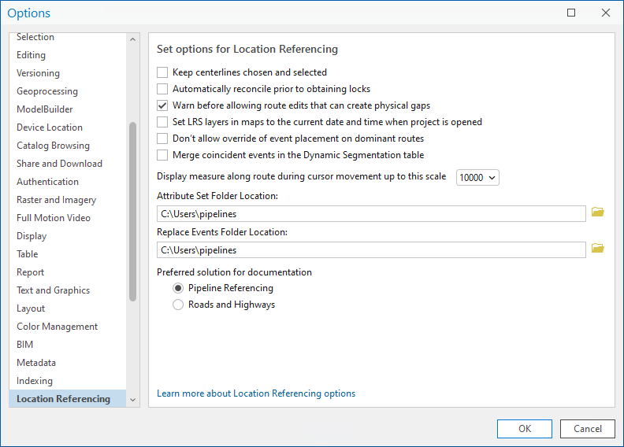

# Set Location Referencing options

|   |   |
| --- | --- |
| **Kind** | Other · Pro |
| **Release** | — |
| **Product** | Roads & Highways · Pipeline Referencing |
| **Source** | [LRoptions.docx](<https://esriis.sharepoint.com/sites/LocationReferencing/Shared%20Documents/General/Doc%20Reviews/5810_Add-Point-Dominant-Route/LRoptions.docx>) |
| **Edited** | 2024-09-10 19:20 by unknown |
| **Extracted** | 2026-09-04 · lane `xmlstrip` |

<!-- metadata
```yaml
title: "Set Location Referencing options"
source_file: "LRoptions.docx"
source_url: "https://esriis.sharepoint.com/sites/LocationReferencing/Shared%20Documents/General/Doc%20Reviews/5810_Add-Point-Dominant-Route/LRoptions.docx"
doc_id: 308
doc_kind: "Other"
surface: "Pro"
doc_revision: ""
target_release: ""
pe: ""
dev: ""
author: ""
last_edited_by: ""
last_edited: "2024-09-10T19:20:59.6000386Z"
extracted: 2026-09-04
extraction_lane: xmlstrip
prompt_version: "v2.0.2"
keywords: ["location referencing", "centerlines", "lock reconciliation", "route edits", "dynamic segmentation", "event placement", "attribute set", "replace events"]
tools: []
products: ["Roads & Highways", "Pipeline Referencing"]
issues: []
related: [{"doc":315,"file":"set-location-referencing-options__doc315.md","s":6.782},{"doc":199,"file":"set-location-referencing-options__doc199.md","s":6.73},{"doc":307,"file":"set-location-referencing-options__doc307.md","s":5.38},{"doc":340,"file":"reorganize-location-referencing-pro-options-test-plan__doc340.md","s":3.394},{"doc":341,"file":"reorganize-location-referencing-pro-options-test-plan__doc341.md","s":2.828}]
```
-->

## Summary

Instructions for configuring Location Referencing options in ArcGIS Pro, including settings for centerline selection, lock reconciliation, route edit warnings, date and time settings, event placement on dominant routes, dynamic segmentation event merging, measure display scale, and folder locations for attribute sets and replace events. Also includes preference settings for solution documentation between Pipeline Referencing and Roads and Highways.

## Related documents

<!-- related:begin -->
- [Set Location Referencing options](<https://esriis.sharepoint.com/sites/lrsworkspace/LRS Doc Index/Other/set-location-referencing-options__doc315.md>) — similar text 0.76 · 2 title words · 1 filename word · same kind/surface <!-- rel:315 -->
- [Set Location Referencing options](<https://esriis.sharepoint.com/sites/lrsworkspace/LRS Doc Index/Other/set-location-referencing-options__doc199.md>) — similar text 0.69 · 2 title words · 1 filename word · same kind/surface <!-- rel:199 -->
- [Set Location Referencing options](<https://esriis.sharepoint.com/sites/lrsworkspace/LRS Doc Index/Other/set-location-referencing-options__doc307.md>) — similar text 0.71 · 2 title words · 1 filename word · same kind/surface <!-- rel:307 -->
- [Reorganize Location Referencing Pro Options Test Plan](<https://esriis.sharepoint.com/sites/lrsworkspace/LRS Doc Index/Test Plans/reorganize-location-referencing-pro-options-test-plan__doc340.md>) — similar text 0.40 · 1 title word · 1 filename word · same surface <!-- rel:340 -->
- [5826-ReorganizeLROptions_TestPlanV2.pptx](<https://esriis.sharepoint.com/sites/lrsworkspace/LRS Doc Index/Test Plans/reorganize-location-referencing-pro-options-test-plan__doc341.md>) — similar text 0.40 · 1 filename word · same surface <!-- rel:341 -->
<!-- related:end -->

<!-- docs:begin -->
## Esri documentation

[Set Location Referencing options](https://doc.esri.com/en/arcgis-pro/latest/help/production/roads-highways/set-location-referencing-options.html) · [Apply dynamic segmentation](https://doc.esri.com/en/arcgis-pro/latest/help/production/roads-highways/apply-dynamic-segmentation.html)
<!-- docs:end -->

---

## Set Location Referencing options
Complete the following steps to configure Location Referencing options in ArcGIS Pro:

- Open the project where you want to set Location Referencing options.
- On the Location Referencing tab, in the Routes group, click the Location Referencing Options launcher .
- The Options dialog box appears with the Location Referencing tab active.
- Tip:
- You can also access Location Referencing options by clicking Project > Options and clicking the Location Referencing tab on the Options dialog box.
(update the screenshots below for RH and APR respectively)

- Configure the following options as often as needed:
  - Check the Keep centerlines chosen and selected check box to keep centerlines in the Location Referencing pane chosen as well as selected on the map after route edits. When this check box is not checked, centerlines chosen in the Location Referencing pane are deselected and selected features on the map are cleared.
  - Check the Automatically reconcile prior to obtaining locks check box to configure automatic lock reconciliation for conflict prevention.
  - Learn more about conflict prevention
  - Uncheck the Warn before allowing route edits that can create physical gaps check box to disable the warning prompt that appears when a route edit will result in one or more physical gaps.
  - Check the Set LRS layers in maps to the current date and time when project is opened check box to set the current date and time for the current project and user if time is enabled for LRS data. When this check box is checked, the current date and time is set on maps in the project each time the project is launched.
  - Check the Don't allow override of event placement of dominant routes check box to automatically add events to the dominant routes without showing the route concurrency pane, if the Add event to dominant route check box in the aAdd Eevent tools is checked. If the Add event to dominant route check box in the Aadd Eevent tools is unchecked, events will still be added onto the selected route.
  - Check the Merge coincident events in the Dynamic Segmentation table check box to automatically merge coincident events following attribute updates within the Dynamic Segmentation table. When this check box is checked, events that are coincident and edited to have identical attributes will merge.
  - Learn more about dynamic segmentation
  - Click the Display measure along route during cursor movement up to this scale drop-down arrow and choose a scale for the display of routes and measures while moving the pointer on the map in a feature service. The default is 1:10,000.
  - Choose an alternate attribute set folder location using the Attribute Set Folder Location text box, either by clicking the Browse button  to choose a folder other than the default location, or by entering the folder path in the text box.
  - Choose an alternate replace events folder location using the Replace Events Folder Location text box, either by clicking the Browse button  to choose a folder other than the default location, or by entering the folder path in the text box.
  - Click either Pipeline Referencing or Roads and Highways in the Preferred solution for documentation section to set the solution documentation to the preferedpreferred nce extension. Setting this preference causes the preferred solution documentation to load when context-sensitive help links are clicked.
- Click OK.

   
