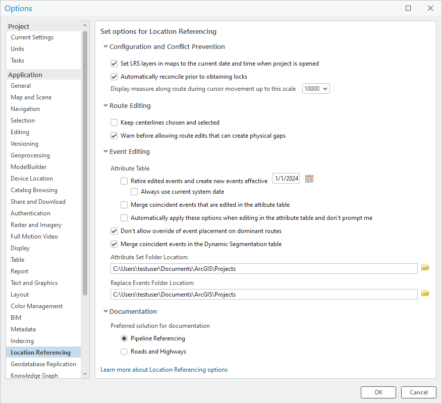

# Set Location Referencing options

| Field | Value |
| --- | --- |
| **Doc** | 315 · Other · Pro |
| **Product** | Roads & Highways · Pipeline Referencing |
| **Release** | — |
| **Issues** | — |
| **Source** | [SetLROptions_APR_V2.docx](<https://esriis.sharepoint.com/sites/LocationReferencing/Shared%20Documents/General/Doc%20Reviews/5942_SetLocationReferencingOptions/SetLROptions_APR_V2.docx>) · rev V2 |
| **People** | author Mac Christmas · PE — · dev — |
| **Edited** | 2024-08-28 21:13 by Mac Christmas |
| **Extracted** | 2026-09-04 · lane xmlstrip · format 3.0 · prompt v2.0.2 |
| **Keywords** | location referencing options · route editing · event editing · conflict prevention · dynamic segmentation · attribute set · replace events |
| **Tools** | — |

## Summary

Instructions for configuring Location Referencing options in ArcGIS Pro, including settings for configuration and conflict prevention, route editing, event editing, and documentation preferences. Options cover automatic reconciliation, measure display scale, event retirement, merging coincident events, and folder locations for attribute sets and replace events.

## Related documents

<!-- related:begin -->
- [Set Location Referencing options](<https://esriis.sharepoint.com/sites/lrsworkspace/LRS%20Doc%20Index/Other/set-lr-options-rh-apr-v2-2024-09.md>) — similar text 0.85 · 2 title words · 2 filename words · same kind/surface/folder <!-- rel:307 s=7.472 -->
- [Set Location Referencing options](<https://esriis.sharepoint.com/sites/lrsworkspace/LRS Doc Index/Other/6463-set-lr-options.md>) — similar text 0.80 · 2 title words · 2 filename words · same kind/surface <!-- rel:199 s=7.252 -->
- [Set Location Referencing options](<https://esriis.sharepoint.com/sites/lrsworkspace/LRS%20Doc%20Index/Other/set-lr-options-rh-apr-2024-09.md>) — similar text 0.76 · 2 title words · 1 filename word · same kind/surface <!-- rel:308 s=6.024 -->
- [Reorganize Location Referencing Pro Options Test Plan](<https://esriis.sharepoint.com/sites/lrsworkspace/LRS Doc Index/Test Plans/5826-reorganize-lr-pro-options-rh-apr-v2-2024-08-2.md>) — similar text 0.39 · 1 title word · 1 filename word · same surface <!-- rel:341 s=3.434 -->
- [Reorganize Location Referencing Pro Options Test Plan](<https://esriis.sharepoint.com/sites/lrsworkspace/LRS Doc Index/Test Plans/5826-reorganize-lr-pro-options-rh-apr-v2-2024-08.md>) — similar text 0.39 · 1 title word · 1 filename word · same surface <!-- rel:340 s=3.434 -->
<!-- related:end -->

<!-- docs:begin -->
## Esri documentation

[Event editing using the attribute table](https://doc.esri.com/en/arcgis-pro/latest/help/production/roads-highways/event-editing-using-the-attribute-table.html) · [Set Location Referencing options](https://doc.esri.com/en/arcgis-pro/latest/help/production/roads-highways/set-location-referencing-options.html) · [Conflict prevention](https://doc.esri.com/en/arcgis-pro/latest/help/production/roads-highways/conflict-prevention.html) · [Apply dynamic segmentation](https://doc.esri.com/en/arcgis-pro/latest/help/production/roads-highways/apply-dynamic-segmentation.html)
<!-- docs:end -->

---

## Set Location Referencing options
Complete the following steps to configure Location Referencing options in ArcGIS Pro:

1. Open the project where you want to set Location Referencing options.

1. On the Location Referencing tab, in the Routes group, click the Location Referencing Options launcher .

- The Options dialog box appears with the Location Referencing tab active.
- Tip:
- You can also access Location Referencing options by clicking Project > Options and clicking the Location Referencing tab on the Options dialog box.

1. Configure any of the following options as often as needed:

| Option Section | Option Name | Option Description |
| --- | --- | --- |
| Configuration and Conflict Prevention | Set LRS Layers in maps to the current date and time when project is opened | Check the check box to set the current date and time for the current project and user if time is enabled for LRS data . When this check box is checked, the current date and time is set on maps in the project each time the project is launched. |
|  | Automatically reconcile prior to obtaining locks | Check the check box to configure automatic data reconciliation for conflict prevention. Learn more about conflict prevention |
|  | Display measure along route during cursor movement up to this scale | Click the drop-down arrow and choose a scale for the display of routes and measures while moving the pointer on the map in a feature service. The default is 1:10,000. |
| Route Editing | Keep centerlines chosen and selected | Check the check box to keep centerlines in the Location Referencing pane chosen as well as selected on the map after route edits. When this check box is not checked, centerlines chosen in the Location Referencing pane are deselected and selected features on the map are cleared. |
|  | Warn before allowing route edits that can create physical gaps | Uncheck the check box to disable the warning prompt that appears when a route edit will result in one or more physical gaps. |
| Event Editing | Retire edited events and create new events effective | Check the checkbox to retire events as of the date in the text box following an update to an event’s attributes using either the Attributes Pane, Attribute Table, or Modify Vertices. When checked, the Retire edited events and create new events effective option within the Advanced LRS Options will be checked by default. The default date is today’s date. |
|  | Always use current system date | Check the checkbox to always use the current system date when retiring edited events and creating a new record within the LRS Advanced Options . When this checkbox is checked, the text box in the above option will be greyed out. |
|  | Merge coincident events at are edited in the attribute table | Check this checkbox to merge attribute-exact, coincident events following an update to an event’s attributes using either the Attributes Pane, Attribute Table, or Modify Vertices. When checked, the Merge coincident events that are edited in the table option within the Advanced LRS Options will be checked by default. |
|  | Automatically apply these options when editing in the attribute table and don’t prompt me | Check this checkbox to automatically apply the above options without prompting the LRS Advanced Options pop-up when editing event attributes using either the Attributes Pane, Attribute Table, or Modify Vertices. To disable the LRS Advanced Options pop-up, check this option while leaving the above options unchecked. |
|  | Don’t allow override of event placement on dominant routes | Check the check box to automatically add events to the dominant routes without showing the route concurrency pane, if the Add event to dominant route check box in the add event tools is checked. If the Add event to dominant route check box in the add event tools is unchecked, events will still be added to the selected route. |
|  | Merge coincident events in the Dynamic Segmentation table | Check the check box to automatically merge coincident events following attribute updates within the Dynamic Segmentation table. When this check box is checked, events that are coincident and edited to have identical attributes will merge. Learn more about dynamic segmentation |
|  | Attribute Set Folder Location | Choose an alternate attribute set folder location using the text box, either by clicking the Browse button to choose a folder other than the default location, or by entering the folder path in the text box. |
|  | Replace Events Folder Location | Choose an alternate replace events folder location using the text box, either by clicking the Browse button to choose a folder other than the default location, or by entering the folder path in the text box. |
| Documentation | Pipeline Referencing | Setting this preference causes the preferred solution documentation to load when context-sensitive help links are clicked. |
|  | Roads and Highways | Setting this preference causes the preferred solution documentation to load when context-sensitive help links are clicked. |

1. Click OK.

