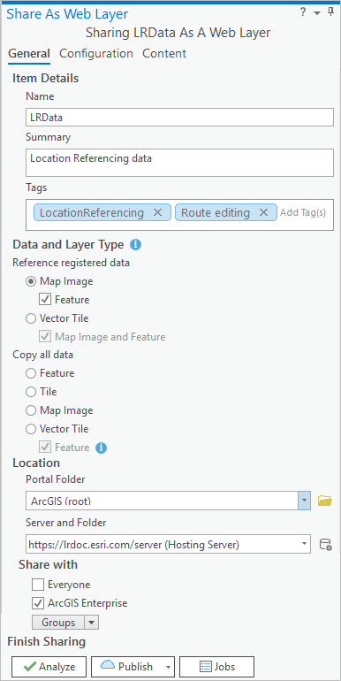
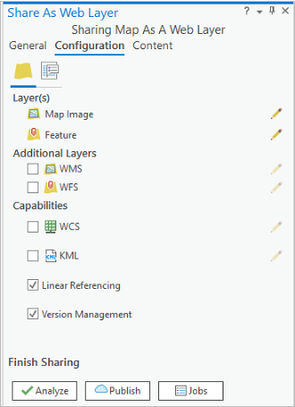

# Share as web layers

|   |   |
| --- | --- |
| **Kind** | Other · Pro |
| **Release** | — |
| **Issue** | [ArcGISPro/ps-location-referencing#5747](https://devtopia.esri.com/ArcGISPro/ps-location-referencing/issues/5747) |
| **Source** | [5747_Share_as_web_layers.docx](<https://esriis.sharepoint.com/sites/LocationReferencing/Shared%20Documents/General/Doc%20Reviews/5747_Share_as_web_layers.docx>) |
| **Edited** | 2024-08-26 23:52 by unknown |
| **Extracted** | 2026-09-04 · lane `xmlstrip` |

<!-- metadata
```yaml
title: "Share as web layers"
source_file: "5747_Share_as_web_layers.docx"
source_url: "https://esriis.sharepoint.com/sites/LocationReferencing/Shared%20Documents/General/Doc%20Reviews/5747_Share_as_web_layers.docx"
doc_id: 330
doc_kind: "Other"
surface: "Pro"
doc_revision: ""
target_release: ""
pe: ""
dev: ""
author: ""
last_edited_by: ""
last_edited: "2024-08-26T23:52:15.9065387Z"
extracted: 2026-09-04
extraction_lane: xmlstrip
prompt_version: "v2.0.2"
keywords: ["linear referencing", "version management", "web layers", "feature service", "branch versioning", "traditional versioning", "arcgis pro", "lrs network"]
tools: []
products: []
issues: ["ArcGISPro/ps-location-referencing#5747"]
related: [{"doc":194,"file":"pro-3-4-and-11-4-user-acceptance-issues-and-documentation-updates__doc194.md","s":1001.232},{"doc":116,"file":"prepare-data-for-sharing-web-layers-with-linear-referencing-and-version__doc116.md","s":6.041},{"doc":875,"file":"esri-roads-and-highways-tutorial__doc875.md","s":3.071},{"doc":39,"file":"location-referencing-gp-error-messages__doc39.md","s":3.004},{"doc":327,"file":"manage-address-and-roadway-characteristic-data-together__doc327.md","s":2.864}]
```
-->

## Summary

Describes the process of sharing web layers with linear referencing and version management capabilities using ArcGIS Pro. Covers data preparation, version management types, publishing steps, and configuration requirements for feature services with LRS and version management enabled.

## Related documents

<!-- related:begin -->
- [Pro 3.4 and 11.4 User Acceptance Issues and Documentation Updates](<https://esriis.sharepoint.com/sites/lrsworkspace/LRS%20Doc%20Index/Schedules/pro-3-4-and-11-4-user-acceptance-issues-and-documentation-updates__doc194.md>) — shared issue ArcGISPro/ps-location-referencing#5747 · similar text 0.06 · same surface/folder <!-- rel:194 -->
- [Prepare Data for Sharing Web Layers with Linear Referencing and Version Management](<https://esriis.sharepoint.com/sites/lrsworkspace/LRS Doc Index/Other/prepare-data-for-sharing-web-layers-with-linear-referencing-and-version__doc116.md>) — similar text 0.37 · 2 title words · 3 filename words · same kind/surface <!-- rel:116 -->
- [Esri Roads and Highways Tutorial](<https://esriis.sharepoint.com/sites/lrsworkspace/LRS Doc Index/Other/esri-roads-and-highways-tutorial__doc875.md>) — similar text 0.29 · same kind/surface <!-- rel:875 -->
- [Location Referencing GP Error Messages](<https://esriis.sharepoint.com/sites/lrsworkspace/LRS%20Doc%20Index/Other/location-referencing-gp-error-messages__doc39.md>) — similar text 0.21 · same kind/surface/folder <!-- rel:39 -->
- [Manage Address and Roadway Characteristic Data Together](<https://esriis.sharepoint.com/sites/lrsworkspace/LRS Doc Index/Other/manage-address-and-roadway-characteristic-data-together__doc327.md>) — similar text 0.23 · same kind/surface/folder <!-- rel:327 -->
<!-- related:end -->

<!-- docs:begin -->
## Esri documentation

[Multiple linear referencing methods](https://doc.esri.com/en/arcgis-pro/latest/help/production/location-referencing-pipelines/multiple-linear-referencing-methods.html) · [Share as web layers](https://doc.esri.com/en/arcgis-pro/latest/help/production/roads-highways/share-as-web-layers.html) · [Edit feature services](https://doc.esri.com/en/arcgis-pro/latest/help/production/location-referencing-pipelines/edit-feature-services.html) · [LRS network](https://doc.esri.com/en/arcgis-pro/latest/help/production/location-referencing-pipelines/what-is-an-lrs-network.html)
<!-- docs:end -->

---

## Share as web layers
Web maps can be authored from LRS and Version Management Service enabled services published using ArcGIS Pro. You can add route network, event, centerline, calibration point, and redline data layers to a web map. In a web map, yYou can also zoom to the extent, choose a basemap, include a description of the map, and save the web map for use in the Event Editor web app. and save the web map for use in an experience that contains Location Referencing widgets in ArcGIS Experience Builder.

### Share as web layers with linear referencing and version management
Version management provides management capabilities for editing feature services such as the following:

- Creating, modifying, deleting, and switching to a feature service version
- Reconciling and posting edits from a child version to the default version
- Undoing, redoing, saving, and discarding individual edits made on a feature service version in an edit session

##### Version management comparison

| Purpose of sharing data | Required publishing capabilities | Geodatabase connection type |
| --- | --- | --- |
| For multiuser editing scenarios when data is accessed directly from an enterprise geodatabase—also known as traditional versioning | Feature Layer, Linear Referencing | Traditional |
| For multiuser editing scenarios when data is accessed through feature services with undo and redo capabilities—also known as branch versioning | Feature Layer, Linear Referencing, Version Management | Branch |

To perform editing activities using feature services, turn on the version management capability when publishing data.

#### Prepare data
Sharing web layers with linear referencing capability and version management requires data preparation.

- Perform all data loading using ArcGIS Pro before changing the geodatabase connection type and registering as versioned.
- Depending on the data, do one of the following:
  - If the data is not versioned, proceed to step 3.
  - If the data is traditionally versioned, unregister each feature class and table as versioned. In ArcGIS Pro, right-click each feature class or table in the Catalog pane and click Manage > Unregister As Versioned.
- Learn more about the differences between traditional and branch versioning in ArcGIS Pro
- Right-click the geodatabase in the Catalog pane and click Geodatabase Connection Properties.
- The geodatabase connection must be explicitly set to the branch versioning connection type.
- Ensure that all of the data layers in the database have the following:
  - Global IDs, except the locks table.
  - If Global IDs are not present, right-click a feature class or table in the Catalog pane and click Manage > Add Global IDs.
  - https://prodev.arcgis.com/en/pro-app/3.4/help/editing/enable-or-disable-editor-tracking.htm \hEditor tracking enabled with UTC time, except the locks table.
- Note:
- Check other requirements before registering data as branch versioned.
- Register the following items in the LRS geodatabase as branch versioned:
  - Feature dataset that contains the LRS
  - Minimum schema feature classes
  - LRS Networks
  - Events
  - Intersections
  - Centerline Sequence table
  - LRS_EditLog table
- Enable time on the LRS data layers on a layer-by-layer basis or enable time for all the LRS layers in a map at once.
- Note:
- Once the data is published, you cannot set time filters for layers.

#### Publish data
After preparing the data, you can publish the datait to your organization's portal as a web layer using the following steps:

- Sign in to ArcGIS Pro with your portal credentials.
- It must be a portal with a federated ArcGIS Server site.
- Create a map in an ArcGIS Pro project, and add the appropriate routes, event layers, calibration points, centerline, and optionally, a redline layer.
- Right-click the map in the Contents pane and click Properties.
- On the Map Properties dialog box, check Allow assignment of unique numeric IDs for sharing web layers under the General tab and click OK.

Note:
By default, https://pro.arcgis.com/en/pro-app/3.3/help/sharing/overview/introduction-to-sharing-web-layers.htm#ESRI_SECTION1_11B19A48477F49FDBD61038AE0B851B2 layer IDs are not preserved when authoring a map. If the layer order in the Contents pane changes when overwriting the web layer, web layers may point to the wrong data sources. As a best practice, manually assign layer IDs prior to publishing if you intend to overwrite the web layer or service in the future. Otherwise, service sublayer IDs can potentially change when the web layer or service is overwritten, causing disconnections in web applications that reference the service sublayer.

- To share a web feature layer, do one of the following:
  - Share all usable layers in the map as a web layer. On the Share tab, in the Share As group, click the Web Layer drop-down arrow, and click Publish Web Layer .
  - Share selected layers in the map or scene as a web layer. Select the layers in the Contents pane, right-click any selected layer, point to Sharing, and click Share As Web Layer .
- The Share As Web Layer pane appears.
- Provide a name for the web layer.
- Optionally, complete the Summary and Tags fields.
- A summary and tags are required when sharing to an ArcGIS Enterprise 10.9 or earlier portal.
- You can enter a maximum of 128 tags.
- Specify how the web layer is shared:
  - Everyone—Share your content with the public. Anyone can access and see it.
  - My Organization—Share your content with all authenticated users in your organization. This option is available when you are signed in with an organizational account.
  - Groups—Share your content with groups to which you belong and their members.
- Note:
- The Share with options vary when sharing to ArcGIS Enterprise.
- Click the Configuration tab.
- On the Configuration tab, in the Capabilities section, check the Linear Referencing and Version Management check boxes.
- Click Analyze to check for errors and issues. You must resolve all errors before you can complete the publishing process.
- Note:
- Analyzers are used to validate the branch-versioned dataset when publishing as a feature service. The following conditions apply:
- Note:
- Disregard the warning messages about the layer data source being z-aware or m-aware.
  - ArcGIS Server 10.6 or later instances are supported.
  - If Version Management is enabled under Capabilities, all layers must be of the same registration type.
  - All data must belong to a branch workspace.
  - All data must be published from the default version.
  - The connected geodatabase user must be the owner of the data.
  - https://prodev.arcgis.com/en/pro-app/3.4/help/mapping/layer-properties/definition-query.htm \hDefinition queries must not be present.
  - All fields must be visible.
  - All event layers in configured attribute sets, if any, must be present in the map.
- Once validated, click Publish to share the web layer.
Your layers are now published as a feature service with linear referencing and version management capability. ArcGIS Pro users with Portal credentials can now create child versions of your feature service and start editing.

  
