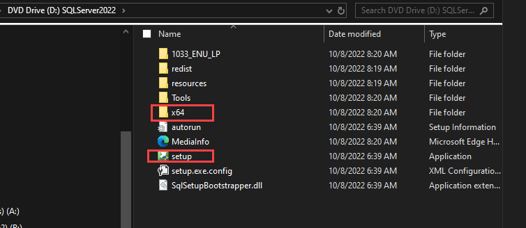
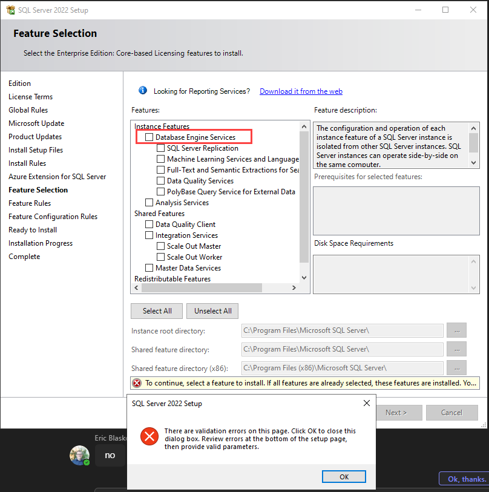
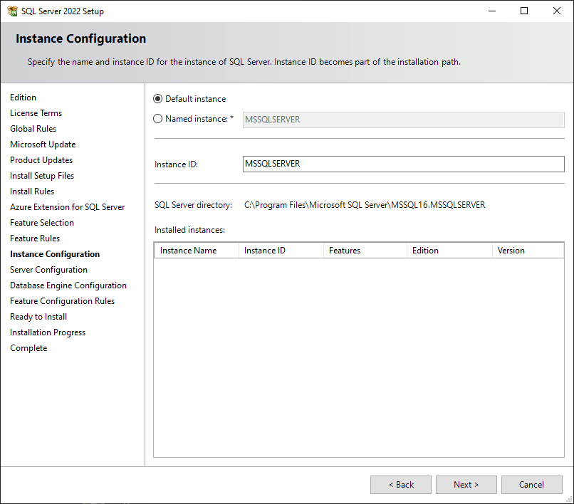
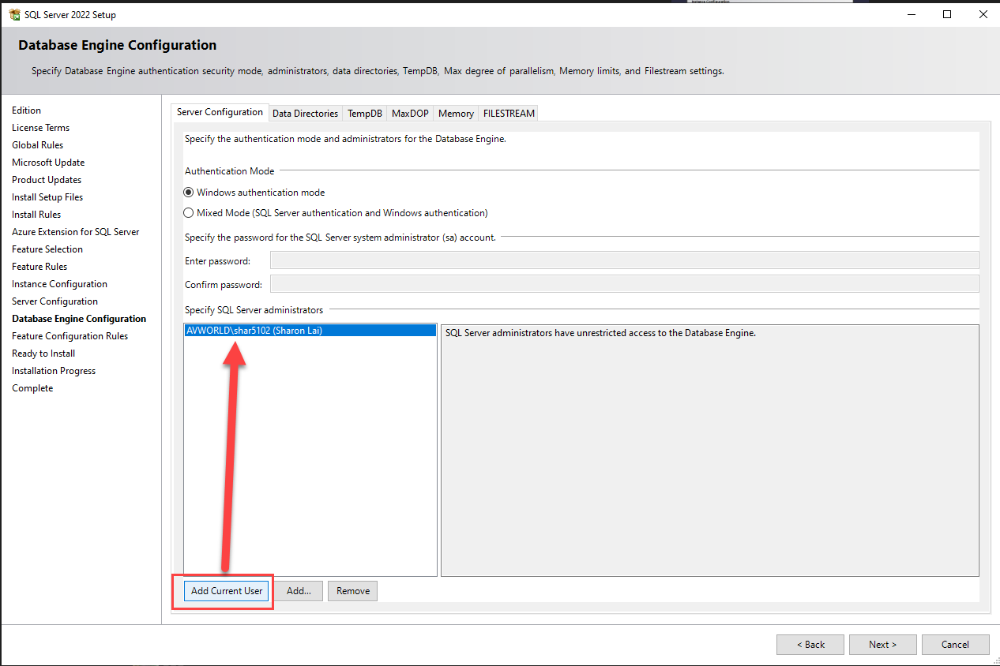
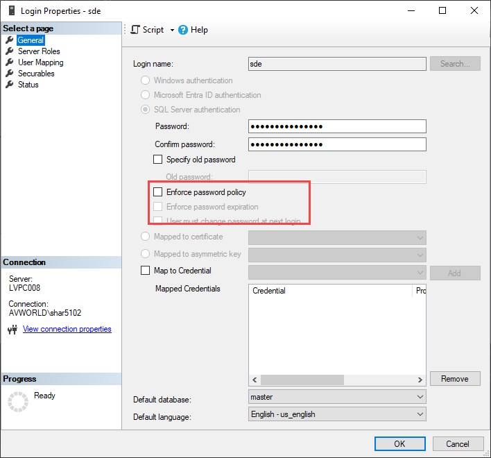
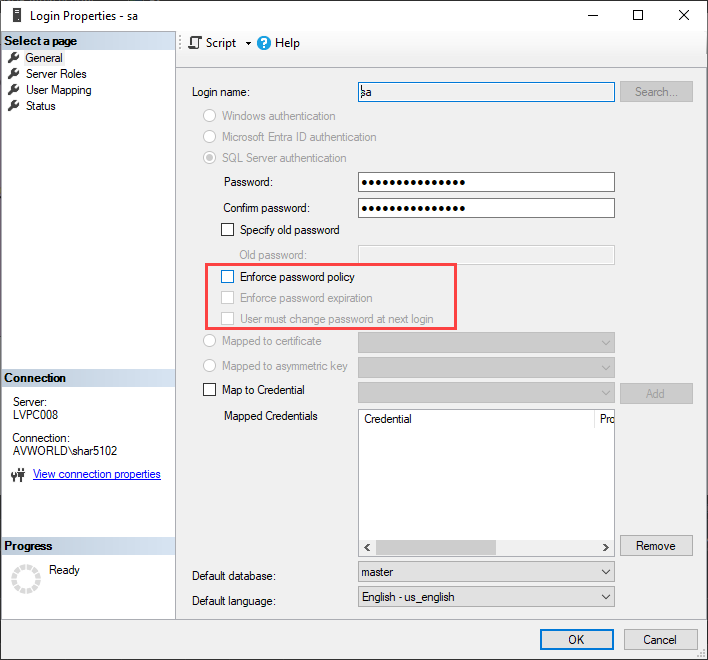
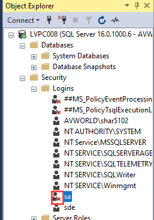

# SQL Server Setup Notes

| Field | Value |
| --- | --- |
| **Doc** | 228 · Other · Other |
| **Product** | — |
| **Release** | — |
| **Issues** | — |
| **Source** | [SQL Server Setup Notes.docx](<https://esriis.sharepoint.com/sites/LocationReferencing/Shared%20Documents/General/SQL%20Server%20Setup%20Notes.docx>) |
| **People** | author Sharon Lai · PE — · dev — |
| **Edited** | 2025-02-21 17:23 by Sharon Lai |
| **Extracted** | 2026-09-04 · lane xmlstrip · format 3.0 · prompt v2.0.2 |
| **Keywords** | sql server · database setup · user login · password management · sa user · sde user |
| **Tools** | SQL Server Management Studio |

## Summary

Notes on setting up Microsoft SQL Server 2022 Enterprise edition including downloading and using SQL Server Management Studio for database management. Instructions include enabling login for the 'sa' user and setting passwords for users such as 'sde' and 'sa'.

## Related documents

<!-- related:begin -->
- [Spike: Complete DMZ machine setup](<https://esriis.sharepoint.com/sites/lrsworkspace/LRS Doc Index/Design Spikes/complete-dmz-machine-setup.md>) — similar text 0.09 · 1 title word · 1 filename word · same folder <!-- rel:632 s=3.046 -->
- [Notes for Experience Builder Setup](<https://esriis.sharepoint.com/sites/lrsworkspace/LRS Doc Index/Other/notes-for-exb-setup.md>) — similar text 0.16 · 1 title word · 1 filename word · same kind <!-- rel:477 s=1.91 -->
- [Location Referencing GP Error Messages](<https://esriis.sharepoint.com/sites/lrsworkspace/LRS%20Doc%20Index/Other/3147-lr-gp-error-messages.md>) — similar text 0.02 · same kind <!-- rel:39 s=1.688 -->
- [Portal Projects Test Plan](<https://esriis.sharepoint.com/sites/lrsworkspace/LRS Doc Index/Test Plans/portal-projects.md>) — similar text 0.05 <!-- rel:432 s=1.595 -->
- [Generate LRS Data Product GP Tool: Support Database Tables](<https://esriis.sharepoint.com/sites/lrsworkspace/LRS Doc Index/User Stories/generate-lrs-data-product-gp-support-database-tables.md>) — similar text 0.07 · same folder <!-- rel:238 s=1.197 -->
<!-- related:end -->

<!-- docs:begin -->
## Esri documentation

_No page matched:_ [SQL Server Management Studio](https://www.google.com/search?q=%22SQL%20Server%20Management%20Studio%22+site%3Adoc.esri.com)
<!-- docs:end -->

---

SQL Server Setup Notes
\\esri.com\software\Database\Microsoft\SQLServer\2022\Enterprise\Core
Click setup:

Setup. After you run setup, download SQL Server Management Studio also to manage the DB's https://learn.microsoft.com/en-us/ssms/download-sql-server-management-studio-ssms

This is where you might need SQL server management studio to set the passwords for users: sde, sa

Enable login on user sa to fix the red x.

