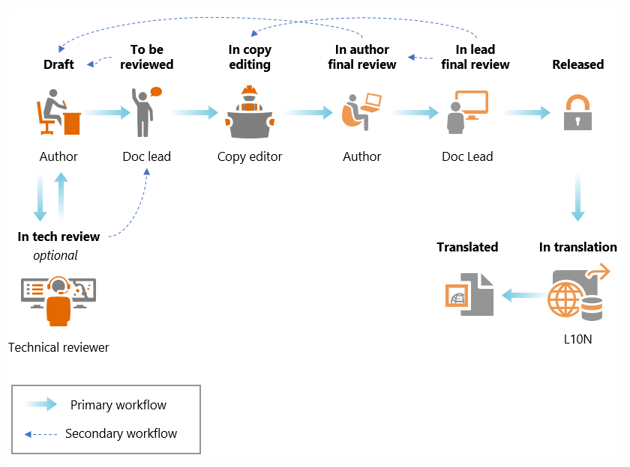

# UA authoring resources

| Field | Value |
| --- | --- |
| **Doc** | 474 · Other · Other |
| **Product** | — |
| **Release** | — |
| **Issues** | — |
| **Source** | [UA authoring resources.pptx](<https://esriis.sharepoint.com/sites/LocationReferencing/Shared%20Documents/General/Doc%20Reviews/UA%20authoring%20resources.pptx>) |
| **People** | author Ignacia Galvan · PE — · dev — |
| **Edited** | 2023-10-27 17:58 by Ignacia Galvan |
| **Extracted** | 2026-09-04 · lane xmlstrip · format 3.0 · prompt v2.0.2 |
| **Keywords** | ua authoring · review process · documentation guides · schedules · templates · collaboration |
| **Tools** | — |

## Summary

Covers the UA authoring resources including the review process, schedules, guides and terminology, templates and examples, and a summary emphasizing collaboration. Provides information on workflows, documentation guides, and communication channels for UA team members.

## Related documents

<!-- related:begin -->
- [LRS Data Products in ArcGIS Pro](<https://esriis.sharepoint.com/sites/lrsworkspace/LRS Doc Index/Other/5973-lrs-data-products-in-pro.md>) — similar text 0.05 · same kind/folder <!-- rel:335 s=1.364 -->
- [Roads and Highways and Pipeline Referencing Enhancements in Experience Builder](<https://esriis.sharepoint.com/sites/lrsworkspace/LRS Doc Index/Other/rh-and-apr-enhancements-in-exb.md>) — similar text 0.04 · same kind <!-- rel:305 s=0.849 -->
- [LR Reporting: Create a template tool User Story](<https://esriis.sharepoint.com/sites/lrsworkspace/LRS Doc Index/User Stories/lr-reporting-create-a-template-tool.md>) — similar text 0.13 <!-- rel:374 s=0.619 -->
- [Support a single summary field in LRS Data Template wizard – Test Plan](<https://esriis.sharepoint.com/sites/lrsworkspace/LRS Doc Index/Test Plans/5774-support-a-single-summary-field-in-lrs-data-template-wizard.md>) — similar text 0.07 <!-- rel:347 s=0.451 -->
- [LR Data Products: Support multiple summary fields](<https://esriis.sharepoint.com/sites/lrsworkspace/LRS Doc Index/User Stories/lr-data-products-support-multiple-summary-fields.md>) — similar text 0.07 <!-- rel:356 s=0.439 -->
<!-- related:end -->

<!-- docs:begin -->
## Esri documentation

[Create a template for an LRS length data product](https://doc.esri.com/en/arcgis-pro/latest/help/production/roads-highways/create-a-template-for-an-lrs-length-data-product.html)
<!-- docs:end -->

---

## Slide 1 — UA authoring resources

Process & Style
“…we can combine our talents and abilities and create something greater together.”

Paradigms & Principles – 7 Habits

## Slide 2 — Agenda

- UA review process
- Schedules
- Guides and terminology
- Templates & examples
- Summary

## Slide 3 — UA Review process

- Workflow after UA/issues are verified by the team
- Could take from 2-3 weeks

## Slide 4 — Schedules

Work with your UA PE to set doc complete schedules that align with the review schedule

- Iteration schedules
- Release schedules

## Slide 5 — Guides and terminology

UA-PS resources

- Documentation
  - General authoring guide across products (Style tab – needs VPN)
  - Pro-specific guide (Create Content section in TOC– needs VPN)
  - Enterprise terminology guide (Needs VPN)
- Blogs ( also in ArcGIS Bloggers channel)
  - Guide & FAQ (Needs VPN)
  - Copy editing request

## Slide 6 — Templates & examples

Work with the UA PE

- Understand patterns
- Help find the references in the guides

## Slide 7 — Summary

Synergy: Habit 6
Collaborating and getting everyone’s input to produce something better than on our own.

Improving the UA process to provide quality UA to our customers.

## Slide 8 — Thank You

Email alias:
PSDoc@esri.com
