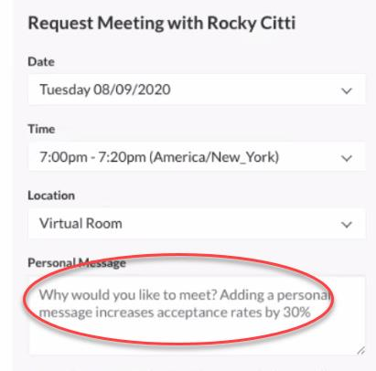
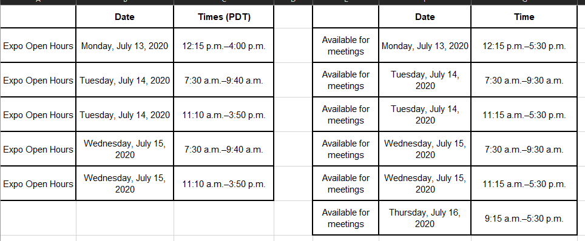

# UC Resources and Training

| Field | Value |
| --- | --- |
| **Doc** | 783 · Other · Other |
| **Product** | — |
| **Release** | — |
| **Issues** | — |
| **Source** | [UC Resources and Training.docx](<https://esriis.sharepoint.com/sites/LocationReferencing/Shared%20Documents/UC%202020%20prep%20for%20RH/UC%20Resources%20and%20Training.docx>) |
| **People** | author Shree Rajagopalan · PE — · dev — |
| **Edited** | 2020-07-09 16:21 by Johum Khushk |
| **Extracted** | 2026-09-04 · lane xmlstrip · format 3.0 · prompt v2.0.2 |
| **Keywords** | training · live q&a · moderation · virtual event · staff roles · meeting scheduling · tech support |
| **Tools** | — |

## Summary

This document provides resources and training information for UC event staff, including live Q&A presenter and moderator guidelines, showcase staff roles, chat and meeting protocols, networking component usage, general event information, and tech support details. It outlines procedures for session management, attendee interaction, and technical assistance during the event.

## Related documents

<!-- related:begin -->
- [UC 2020 Staff FAQ](<https://esriis.sharepoint.com/sites/lrsworkspace/LRS Doc Index/Other/uc-2020-staff-faq.md>) — similar text 0.48 · same kind/surface/folder <!-- rel:786 s=4.943 -->
<!-- related:end -->

---

UC Resources and Training
Live Q&A TW Presenters and Moderators

- Training Recording
- Training slides
- Q&A Session 1
- Q&A Session 2
- Advanced Q&A Moderation
- Slido Polling setup
- Demo Slido account to play with (demo only - no saving content/ Esri UI etc.) : Use this to learn/play and create your user account for use during the event
- UC Presenters Teams Channel
Showcase staff

- Training recording
- Training Slides
- Meeting Request
- Virtual Meeting Room
- Q&A session 1
- Q&A Session 2 (Coming soon)
- Q&A Session 3 (Coming soon)
- UC Showcase Planning Teams Channel
UC General
Several FAQs – Not all questions are addressed in this doc. Recommend watching the Q&A recordings above for a comprehensive list of questions.
All staff
Virtual event platform access after 12 pm on July 8th via Okta chiclet.
On the 8th, all “Schedule a Meeting” staff must log in as soon as you can - REQUIRED to connect your profile with your relevant subtopic page’s “Schedule a Meeting” option. This backend connection does not happen immediately; it happens at the end of each day. For this connection to happen in a timely manner, be sure to log in simply by clicking on the chiclet in Okta right away If you log in and do not see your name in the list of Meeting staff within your subtopic page, check back the next day.
Between mid-day on 8th and early afternoon on 12th, ALL staff must complete their profile – photo, role, areas of expertise, etc. as well as complete their meeting availability. If you are not a “Schedule a Meeting” staff (that is, chat only staff), you must do this and mark yourself as unavailable on all days for meetings.
***Join office hours scheduled by Shree to work on your profiles and meeting availability.***
On July 13th between 7 am and 7.15 am PDT ALL staff must log in to the event platform. This is one last stress test for bandwidth purposes.
Live presenter and moderator staff
Later in the week of July 6th, you will receive an email with URLs to your live session’s green room and slido.
Next week, during your session, click on the green room and slido URLs. A Freeman tech will “walk” you into the Q&A room 10-15 mins after your session recording starts playing. Please wait with your cameras on and your mics muted.
Polling – you are encouraged to have one or two polls when your session is live streaming. Make sure your poll questions are relevant to the content being shown on the screen at that moment.
Moderator is the only person who can see attendee questions coming in (via slido). Moderator must communicate to presenters to help choose questions that are common to the general audience. Moderator also decides ahead of time which presenter answers a specific question. You need to approve the chosen questions for them to publicly show up in the session’s chat UI.
Moderators use above URL to play with slido.
Moderator can choose to reply to certain questions privately within slido. Or publicly, after the question is approved and the answer is simple enough to resply via chat.
Complicated/long answers must be addressed during the 15 mins of live Q&A.
If there are not enough questions, you might want to have a few common questions on hand.
When live Q&A starts, presenters and moderators ensure your cameras are still on. Choose a quiet room in your homes where there is no background noise. Have family members to not use up your internet bandwidth during your live session.
You can start live Q&A as soon as the live stream is over (depending on how long your recording way, you might have more than or a little less than 15 misn for Q&A).
Moderator reads the public questions one by one, by saying, “<Attendee’s name> asks <read question>. <Presenter name> can you answer this? For example, John asks how Data Reviewer is licensed. Jay, can you answer this?”
Questions would be coming in during live stream of session and during the live Q&A – Moderator continues to approve questions that make most sense and address them in live Q&A.
Presenters/moderators – keep your camera on throughout but mute yourself when you are not speaking to avoid the screen jumping to you if there’s background noise.
Presenters/moderators – IMPORTANT – make sure your meeting availability is blocked off during your live session.
Moderator needs to keep track of time. You will be kicked out of the room at exactly 60 mins. You cannot go over.
 Be sure to tell attendees to come find out in the expo if you get too many questions. Or you can collect the questions and publish a blog with answers post UC.
Showcase staff
Chat:
Esri staff will be displayed as <staff name> (Esri).
Assign a chat moderator (not the same as presentation moderator) to your sub-topic area (no formal schedule change or assignment. This is just internal.)
Chat moderator monitors the chat convos and ensures all questions are either answered in chat or point the attendee to meeting staff for demos/screen share.
Chat is PUBLIC - you can reply in thread and send files, images, URLs, emojis and GIFs.
“Schedule a meeting” staff can help with chat when they are not in meetings.
Only the attendee’s name appears in chat. You can search for them in the networking component if you’d like to learn more about them. However, PII laws apply here. Do not contact them outside the platform if they have not shared their contact info.
When pointing an attendee to meet with an expert, make sure the attendees adds that information in the “Personal Message” box. For example, they could say “<Esri staff name> mentioned that you can help me show a demo of <tool>.”

Chat transcripts will be made available at some point – TBD if it’s at the end of each day or at the end of the conf.
Meeting:
Meeting time slots are 15 mins.
You can choose to accept, decline or ask attendee to reschedule a meeting. If you decline be sure to provide a reason and possibly point them to resources or another Esri staff that might be able to help.
Schedule your availability for just the expo hours (meeting hours are different than expo, see below). You can be available for outside expo hours. It’s up to you.

You can edit your meeting availability in real-time, if you need to open or block time slots.
If you know ahead of time that a meeting will be longer than 15 mins, make sure you schedule a zoom meeting with that attendee instead of meeting within the platform.
If during the meeting you feel you are going to run over, get their contact information and meet with them later via zoom.
NOTE: An attendee can request a meeting with a certain staff only once. They cannot request to meet with the same staff more than once.
Meeting room URL will be sent 5 mins prior to meeting start time. You can forward the URL to other staff who are not working UC.
NOTE: Only a total of 4 members (Esri and customer) can be in a meeting.
When you end your meeting, you will be asked for feedback. This feedback is ONLY to mark “didn’t happen” if the attendee didn’t show up or the meeting didn’t happen for some reason. No other feedback is needed.
Keeping your video on during meetings is recommended. Video during meetings does not have virtual backgrounds.
A time slot is blocked off until you accept or decline.
Networking Component
You might hear this being referred to as networking component or as Grip.
This is where you will set up your profile and meeting availability.
You will see notifications for meeting requests here as well as via email.
There is an option for direct messaging in this component (think of it as your Facebook private messaging option). This is not related to the public chat within a subtopic page.
Attendees can find you by searching for your name or by using keywords (if you have that keyword in your profile). They can request meetings with staff directly from this component as opposed to going to the subtopic page first.
You can have the networking component open in a separate tab and monitor notifications. And/or you can set it up to send notifications to your email.
General
Report inappropriate behavior to eventsconduct@esri.com.
Live Q&A session recordings will be made on-demand 2 hours after live stream.
Registered attendees have access to the entire platform until Sep 1st.
After that, most content will be made public until next UC, except SIGs, Road Ahead sessions and a few others.
Staff will continue to have access to event platform. Those not in the UC schedule will get access on July 20th.
All recordings including SIGs and Road Ahead will be available for Esri staff (internally).
Trouble with tech support on the site, email: virtualeventsupport@freemanco.com
VPN – DO NOT use when logged in to the event platform. If necessary, during a demo with customer, log in is ok. Be sure to log out as soon as the demo/meeting is over.
Tech Support at UC
Tech support does not have live staff in virtual showcase.
If you encounter an attendee experiencing tech support issues, please send them to Booth ID: SH-44-00 where they can submit a case request. While tech support does not have live staff in the virtual showcase, attendees will see a phone and web form option in the showcase subtopic page.
You can review this document for more information.
 In that booth, attendees will see this message:
“Technical Support is ready to connect and assist you with questions and troubleshooting. All UC Expo attendees can request a case through a UC-only phone number or web form from July 13 through July 15, 2020. For most attendees, we recommend submitting case requests through the web form option.

For assistance with a technical issue or software question, click the website link below to request a case or use the provided phone number. Esri Phone hours for the UC Expo will be 8:00 am PDT through 4:00 pm PDT. If you require a local time zone or local language support, we recommend reaching out to the Esri Distributor for your country or region (esri.com/contact).”
Merch
An Esri merchandise store will be available in the virtual platform. Esri staff are asked NOT to order gear during the conference next week. Attendees get first dibs.
The merch store will be available after UC and throughout the year. Staff can place orders then.

