# Unfederating ArcGIS Server when all else fails

|   |   |
| --- | --- |
| **Kind** | Other · Server |
| **Release** | — |
| **Source** | [Unfederating ArcGIS Server when all else fails.docx](<https://esriis.sharepoint.com/sites/LocationReferencing/Shared%20Documents/General/Unfederating%20ArcGIS%20Server%20when%20all%20else%20fails.docx>) |
| **Edited** | 2019-01-25 16:27 by Gary Sinner |
| **Extracted** | 2026-09-04 · lane `xmlstrip` |

<!-- metadata
```yaml
title: "Unfederating ArcGIS Server when all else fails"
source_file: "Unfederating ArcGIS Server when all else fails.docx"
source_url: "https://esriis.sharepoint.com/sites/LocationReferencing/Shared%20Documents/General/Unfederating%20ArcGIS%20Server%20when%20all%20else%20fails.docx"
doc_id: 898
doc_kind: "Other"
surface: "Server"
doc_revision: ""
target_release: ""
pe: ""
dev: ""
author: "Gary Sinner"
last_edited_by: "Gary Sinner"
last_edited: "2019-01-25T16:27:00Z"
extracted: 2026-09-04
extraction_lane: xmlstrip
prompt_version: "v2.0.2"
keywords: ["arcgis server", "portal", "federation", "unfederate", "server admin", "service restart", "feature service"]
tools: []
products: []
issues: []
related: [{"doc":396,"file":"arcgis-pipeline-referencing-server-faq__doc396.md","s":2.547},{"doc":6,"file":"linear-referencing-arcgis-server-toolbox-rename__doc6.md","s":2.52},{"doc":735,"file":"developer-server-setup__doc735.md","s":2.233},{"doc":829,"file":"support-updating-cl-cls-when-using-explode-operation__doc829.md","s":1.648},{"doc":616,"file":"field-maps-and-sync-service-issues-and-workflow-notes__doc616.md","s":1.629}]
```
-->

## Summary

Notes on troubleshooting and resolving issues with ArcGIS Server federation with Portal, including steps to manually unfederate and refederate the server. Covers service restart procedures, error messages, and administrative actions to restore proper federation status.

## Related documents

<!-- related:begin -->
- [ArcGIS Pipeline Referencing Server FAQ](<https://esriis.sharepoint.com/sites/lrsworkspace/LRS Doc Index/Other/arcgis-pipeline-referencing-server-faq__doc396.md>) — similar text 0.07 · 1 title word · same kind/surface <!-- rel:396 -->
- [Linear Referencing ArcGIS Server Toolbox Rename](<https://esriis.sharepoint.com/sites/lrsworkspace/LRS Doc Index/User Stories/linear-referencing-arcgis-server-toolbox-rename__doc6.md>) — similar text 0.06 · 1 title word · 1 filename word · same surface/folder <!-- rel:6 -->
- [Developer Server Setup](<https://esriis.sharepoint.com/sites/lrsworkspace/LRS%20Doc%20Index/Other/developer-server-setup__doc735.md>) — similar text 0.13 · 1 title word · 1 filename word · same kind <!-- rel:735 -->
- [Support updating CL/CLS when using explode operation](<https://esriis.sharepoint.com/sites/lrsworkspace/LRS Doc Index/User Stories/support-updating-cl-cls-when-using-explode-operation__doc829.md>) — similar text 0.02 · 1 title word · 1 filename word · same folder <!-- rel:829 -->
- [Field Maps and Sync Service Issues and Workflow Notes](<https://esriis.sharepoint.com/sites/lrsworkspace/LRS%20Doc%20Index/Other/field-maps-and-sync-service-issues-and-workflow-notes__doc616.md>) — similar text 0.04 · same kind/folder <!-- rel:616 -->
<!-- related:end -->

<!-- docs:begin -->
## Esri documentation

[Edit feature services](https://doc.esri.com/en/arcgis-pro/latest/help/production/location-referencing-pipelines/edit-feature-services.html)
<!-- docs:end -->

---

Following are my notes from a session with Debalin to fix a problem with the federation of my ArcGIS Server installation with Portal.  I’ve had the problem crop a couple of times and tried to take notes the second time.  These notes haven’t been verified as a true/100% solution, but hopefully can help.  If anyone tries them and it works, please let me know.

Thanks,

Gary

Also, my Server and/or Portal don’t restart reliably after turning on my laptop after it’s been shut down. 
To fix that issue:

- Open Services
- Stop ArcGIS Server and Portal for ArcGIS
  - NOTE:  if the ArcGIS Server service is *NOT* running, that can also cause the “Federated server not available” error in Pro.  Restart the service and that will hopefully resolve the error and not require going through the following steps to clean up the federation.
- Start ArcGIS Server
- Start Portal for ArcGIS
- Wait…
- Wait…
- Wait…  takes a while – 5-10 minutes or so…
- Should be able to run Portal and Server Manager

## PROBLEM:  FEDERATED SERVER NOT AVAILABLE
I’m getting a “federated server not available” error trying to create a feature service:

However, if I try to federate the server with Portal, I’m getting  'ArcGIS Server is already a federated server.'
Running the unfederateserver python script I get the following output – “Nothing to unfederate.”
Services URL: https://GSinner.esri.com/server
Admin URL: https://GSinner.esri.com:6443/arcgis
Token URL: https://GSinner.esri.com/portal/sharing/generateToken
Token received.
Federated Servers Listing URL: https://GSinner.esri.com/portal/portaladmin/federation/servers?token=sJ-uDwkic9swigdoE1oL4TBiQtbXgFirsMhMv9MMBdlU4yfs-W5QpGK4jg2UbBQuGStVtmc20bV9RW9Ihd3orpt5WrBmcJzrmVMPr-rR-nnVKW00TvS0MZzoJOtiWoQg&f=pjson
List of servers received.
Nothing to unfederate.
I appear to have a federated server that is simultaneously unfederated.  😲

## SOLUTION:  MANUALLY UNFEDERATE WITH OLD-SCHOOL SERVER ADMIN AND FEDERATE AGAIN USING PORTAL
Captain Obvious disclosure:  don’t forget to change the URL’s to *your* machine!
https://gsinner.esri.com/portal/sharing/rest
Login and goes to serveradmin page:  https://gsinner.esri.com/portal/sharing/rest/community/users/serveradmin
Click on the Org ID link:

At bottom under child resources click on Servers

.
.
.

In my case the list was empty, which is probably correct given the “no federated server” message in Pro

NOTE:  After completing the following steps to re-federate, my ArcGIS Server instance is properly listed:

The above steps verified that my ArcGIS Server wasn’t federated with Portal, at least from Portal’s perspective.  For some reason though Server believes that it’s federated so need to go through the Server Admin and unfederate the Server.  Really don’t know how this situation occurs – one theory is that running the various setup scripts while working on changing them left my system in an unstable state.  Maybe…
Moving on to ArcGIS Server Admin…
https://gsinner.esri.com/server/admin/login
Enter the administrator login credentials and click Login – you don’t need to enter a Portal token.

In my case, running down the "Attempt #1" path ended in getting an “operation can only be performed by Portal administrators” error.  If you get the same, come back to this page and follow the security link as described for "Attempt #2" below (or just try #2 first if you want).

### ATTEMPT #1 - Services
Click on the services link. 

On the services page, click on the unfederate link

Acknowledge the warning and click the Unfederate button:

In my case I got the following error.  I had used the same credentials for both the ArcGIS Server and Portal administrator accounts (serveradmin).

### ATTEMPT #2 - Security
Return back to the admin page and this time click on the security link.

Click on the config link

Notice the Authentication is for ArcGIS Portal and that the server is federated.
Click on the update link under Supported Operations.

Change the Authentication tier to GIS_SERVER and then click on the Update button:

ArcGIS Server is no longer federated with Portal. 
To make it federated again, login to your Portal for ArcGIS instance and go to the Settings page and select the Servers tab.
Under the Federated Servers section, click the Add Server button to federate your ArcGIS Server instance.

Fill in the URL’s and credentials and click Add:

The server should validate and you should get a green checkmark under Status

In theory that should do it and you should be able to connect to your Portal in Pro and publish services!

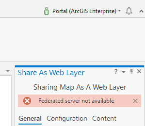 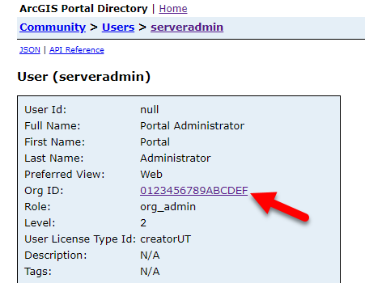 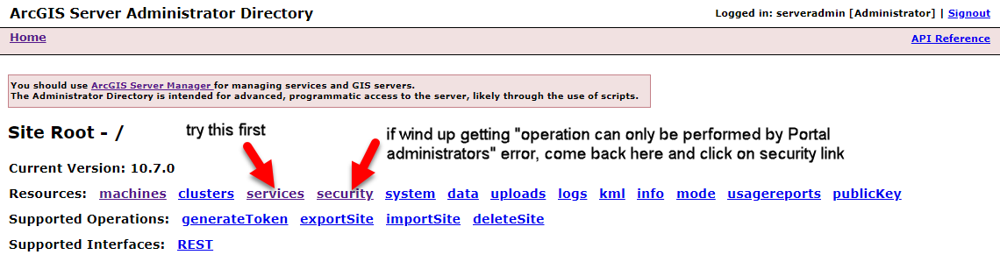 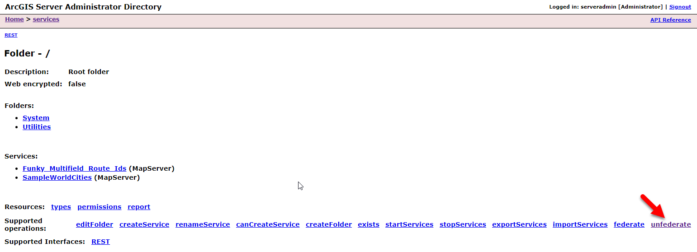 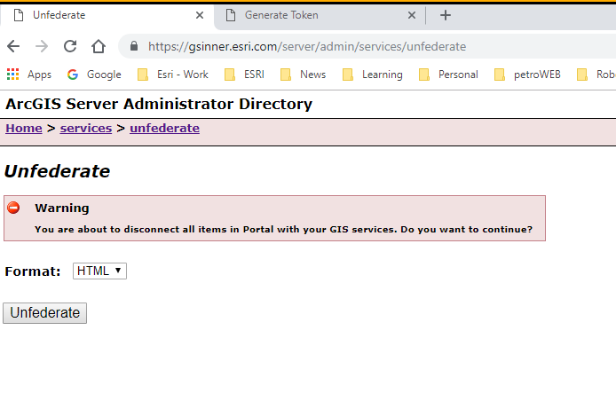 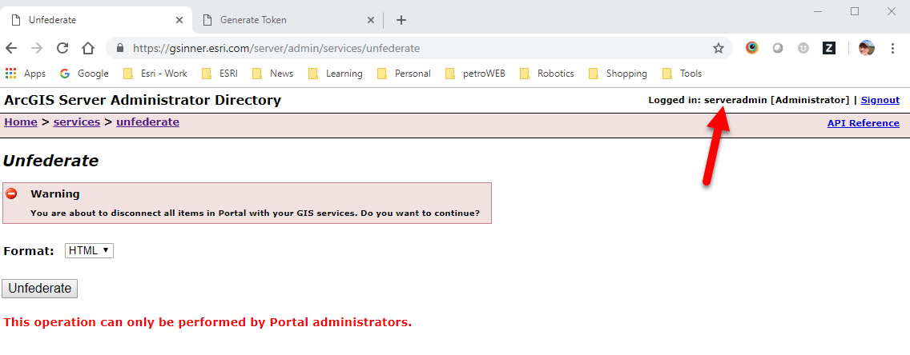 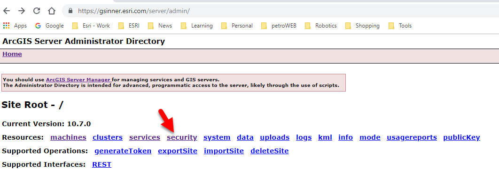 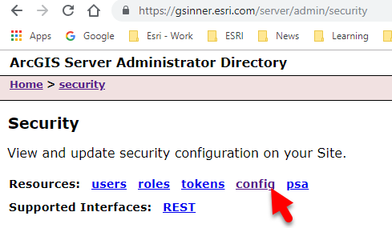 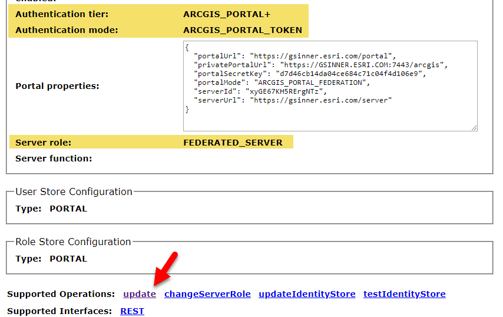 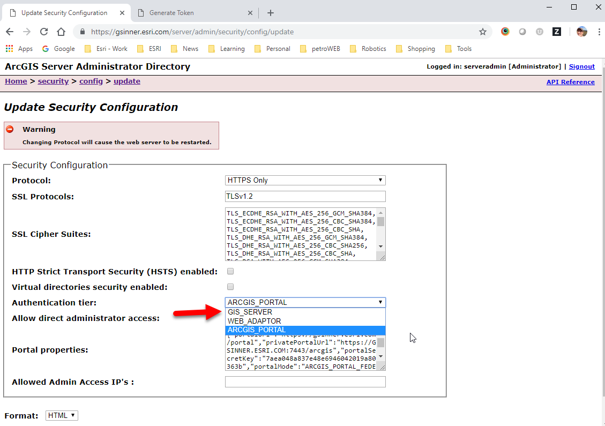 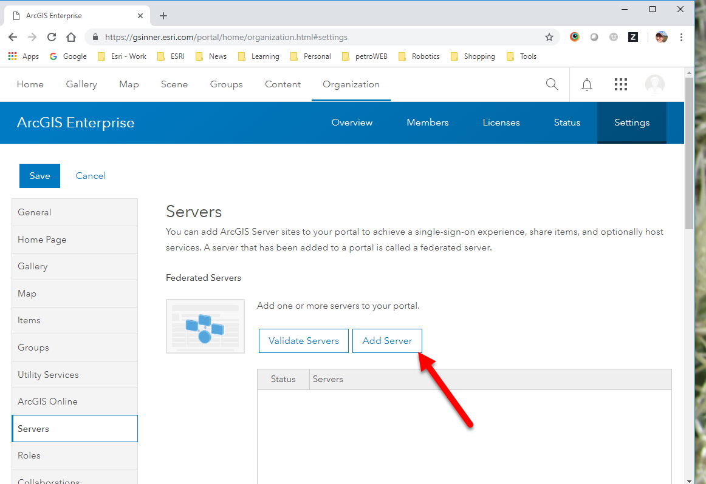 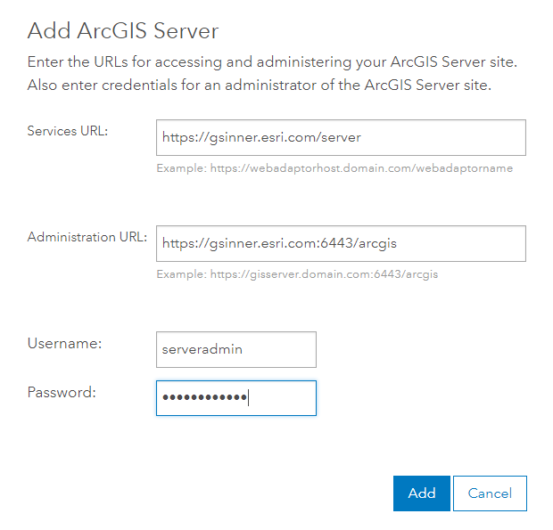
