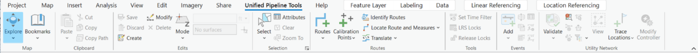

# Unified Pipeline Tools add-in

|   |   |
| --- | --- |
| **Kind** | Other · Pro |
| **Release** | — |
| **Product** | Pipeline Referencing · Utility Network |
| **Issue** | [ArcGISPro/ps-location-referencing#5048](https://devtopia.esri.com/ArcGISPro/ps-location-referencing/issues/5048) |
| **Source** | [5048_addin-fulldoc_Vshort.docx](<https://esriis.sharepoint.com/sites/LocationReferencing/Shared%20Documents/General/Doc%20Reviews/5048_addin-fulldoc_Vshort.docx>) |
| **Edited** | 2023-05-18 15:53 by Josue Aguirre |
| **Extracted** | 2026-09-04 · lane `xmlstrip` |

<!-- metadata
```yaml
title: "Unified Pipeline Tools add-in"
source_file: "5048_addin-fulldoc_Vshort.docx"
source_url: "https://esriis.sharepoint.com/sites/LocationReferencing/Shared%20Documents/General/Doc%20Reviews/5048_addin-fulldoc_Vshort.docx"
doc_id: 566
doc_kind: "Other"
surface: "Pro"
doc_revision: ""
target_release: ""
pe: ""
dev: ""
author: "Claire Wang"
last_edited_by: "Josue Aguirre"
last_edited: "2023-05-18T15:53:59Z"
extracted: 2026-09-04
extraction_lane: xmlstrip
prompt_version: "v2.0.2"
keywords: ["pipeline referencing", "utility network", "unified pipeline tools", "arcgis pro", "route editing", "calibration points", "network topology", "event editing"]
tools: ["Explore", "Bookmarks", "Copy", "Paste", "Cut", "Copy Path", "Create", "Modify", "Delete", "Save", "Discard", "Mode", "Elevation value", "Map Surfaces", "Get Z From View", "Select", "Attributes", "Clear", "Zoom To", "Create Route", "Extend Route", "Realign Route", "Reassign Route", "Retire Route", "Reverse Route", "Add Calibration Points", "Edit Calibration Points", "Delete Calibration Points", "Identify Routes", "Locate Route and Measures", "Translate", "Set Time Filter", "LRS Locks", "Release Locks", "Add Events", "Split", "Merge", "DynSeg", "Attribute Sets", "Configure Replacement", "Replace", "Validate", "Error Inspector", "Terminal Connections", "Modify", "Enter Containment", "Exit Containment", "Display Content", "View", "Trace Locations", "Modify Controller"]
products: ["Pipeline Referencing", "Utility Network"]
issues: ["ArcGISPro/ps-location-referencing#5048"]
related: [{"doc":565,"file":"manage-pipeline-referencing-and-a-utility-network-together__doc565.md","s":1003.603},{"doc":115,"file":"regression-testing-task-list-v1__doc115.md","s":4.591},{"doc":606,"file":"combined-apr-un-ribbon-user-story__doc606.md","s":4.484},{"doc":875,"file":"esri-roads-and-highways-tutorial__doc875.md","s":4.386},{"doc":867,"file":"help-id-mapping-for-lrs-tools-and-ui-elements__doc867.md","s":4.083}]
```
-->

## Summary

Describes the Unified Pipeline Tools add-in for ArcGIS Pro that integrates Pipeline Referencing and Utility Network tools into a single ribbon tab. Covers installation steps and details of available tools for navigation, pipeline referencing, and utility network management workflows.

## Related documents

<!-- related:begin -->
- [Manage Pipeline Referencing and a Utility Network Together](<https://esriis.sharepoint.com/sites/lrsworkspace/LRS Doc Index/Other/manage-pipeline-referencing-and-a-utility-network-together__doc565.md>) — shared issue ArcGISPro/ps-location-referencing#5048 · similar text 0.17 · 1 title word · same kind/surface/folder <!-- rel:565 -->
- [Regression Testing Task List V1](<https://esriis.sharepoint.com/sites/lrsworkspace/LRS%20Doc%20Index/Test%20Plans/regression-testing-task-list-v1__doc115.md>) — similar text 0.18 · same surface <!-- rel:115 -->
- [Combined APR-UN Ribbon User Story](<https://esriis.sharepoint.com/sites/lrsworkspace/LRS Doc Index/User Stories/combined-apr-un-ribbon-user-story__doc606.md>) — similar text 0.19 · same surface <!-- rel:606 -->
- [Esri Roads and Highways Tutorial](<https://esriis.sharepoint.com/sites/lrsworkspace/LRS Doc Index/Other/esri-roads-and-highways-tutorial__doc875.md>) — similar text 0.16 · same kind/surface <!-- rel:875 -->
- [Help ID Mapping for LRS Tools and UI Elements](<https://esriis.sharepoint.com/sites/lrsworkspace/LRS Doc Index/Other/help-id-mapping-for-lrs-tools-and-ui-elements__doc867.md>) — similar text 0.04 · 1 title word · same kind/surface <!-- rel:867 -->
<!-- related:end -->

<!-- docs:begin -->
## Esri documentation

[Create a route](https://doc.esri.com/en/arcgis-pro/latest/help/production/location-referencing-pipelines/create-a-new-route.html) · [Modify calibration points](https://doc.esri.com/en/arcgis-pro/latest/help/production/location-referencing-pipelines/modify-calibration-points.html) · [Delete calibration points](https://doc.esri.com/en/arcgis-pro/latest/help/production/location-referencing-pipelines/delete-calibration-points.html) · [Event editing using the attribute table](https://doc.esri.com/en/arcgis-pro/latest/help/production/location-referencing-pipelines/event-editing-using-the-attribute-table.html) · [Extend a route](https://doc.esri.com/en/arcgis-pro/latest/help/production/location-referencing-pipelines/extend-a-route.html) · [Realign routes](https://doc.esri.com/en/arcgis-pro/latest/help/production/location-referencing-pipelines/realign-routes.html) · [Route reassignment](https://doc.esri.com/en/arcgis-pro/latest/help/production/location-referencing-pipelines/reassign-routes.html) · [Retire routes](https://doc.esri.com/en/arcgis-pro/latest/help/production/location-referencing-pipelines/retire-routes.html) · [Reverse routes](https://doc.esri.com/en/arcgis-pro/latest/help/production/location-referencing-pipelines/reverse-routes.html) · [Add calibration points](https://doc.esri.com/en/arcgis-pro/latest/help/production/location-referencing-pipelines/add-calibration-points.html) · [Locate route and measures](https://doc.esri.com/en/arcgis-pro/latest/help/production/location-referencing-pipelines/locate-route-and-measures.html) · [Set a time filter](https://doc.esri.com/en/arcgis-pro/latest/help/production/location-referencing-pipelines/set-a-time-filter.html) · [Release locks through the LRS Locks table](https://doc.esri.com/en/arcgis-pro/latest/help/production/location-referencing-pipelines/lrs-locks-table.html) · [Release locks with the Release Locks tool](https://doc.esri.com/en/arcgis-pro/latest/help/production/location-referencing-pipelines/release-locks.html) · [Split a centerline by point](https://doc.esri.com/en/arcgis-pro/latest/help/production/location-referencing-pipelines/split-a-centerline.html) · [Merge to adjacent route method](https://doc.esri.com/en/arcgis-pro/latest/help/production/location-referencing-pipelines/merge-to-adjacent-route-method.html) · [3D in Pipeline Referencing](https://doc.esri.com/en/arcgis-pro/latest/help/production/location-referencing-pipelines/3d-in-pipeline-referencing.html) · [View utility network feature class properties](https://doc.esri.com/en/arcgis-pro/latest/help/production/location-referencing-pipelines/view-utility-network-feature-class-properties.html)

_No page matched:_ [Explore](https://www.google.com/search?q=%22Explore%22+site%3Adoc.esri.com) · [Bookmarks](https://www.google.com/search?q=%22Bookmarks%22+site%3Adoc.esri.com) · [Copy](https://www.google.com/search?q=%22Copy%22+site%3Adoc.esri.com) · [Paste](https://www.google.com/search?q=%22Paste%22+site%3Adoc.esri.com) · [Cut](https://www.google.com/search?q=%22Cut%22+site%3Adoc.esri.com) · [Copy Path](https://www.google.com/search?q=%22Copy%20Path%22+site%3Adoc.esri.com) · [Save](https://www.google.com/search?q=%22Save%22+site%3Adoc.esri.com) · [Discard](https://www.google.com/search?q=%22Discard%22+site%3Adoc.esri.com) · [Mode](https://www.google.com/search?q=%22Mode%22+site%3Adoc.esri.com) · [Elevation value](https://www.google.com/search?q=%22Elevation%20value%22+site%3Adoc.esri.com) · [Map Surfaces](https://www.google.com/search?q=%22Map%20Surfaces%22+site%3Adoc.esri.com) · [Get Z From View](https://www.google.com/search?q=%22Get%20Z%20From%20View%22+site%3Adoc.esri.com) +20
<!-- docs:end -->

---

## Unified Pipeline Tools add-in
When working with Pipeline Referencing and Utility Network data, you can access commonly used tools from both environments in one tab with the Unified Pipeline Tools add-in. Once installed, you can also customize the add-in in ArcGIS Pro.
Before the add-in, common workflows required that you switch between different tabs.
The following are workflow examples of the process with the add-in:

- Validate network topology for a dirty area created by pipeline realignment:
Explore – Create – Realign Route - Validate

- Set up connectivity and create route after new pipelines are placed:
Terminal Connections - Modify Controller – Validate – Create Route

### Installation
To use the Unified Pipeline Tools add-in with ArcGIS Pro, you will need to first download compressed file contents, extract the folder containing the installer, and run the installer.
The following steps outline this in detail:

- Download the contents from https://github.com/ArcGIS/UN-APR-Ribbon \hthis location.
- Close any ArcGIS Pro projects that are open.
- Browse to the downloaded UnifiedPipelineTools folder and extract its contents.
- Browse to and double-click UnifiedPipelineTools.esriAddInX to run the installer.
- Click Install Add-In on the Esri ArcGIS Add-In Installation Utility dialog box.
The add-in is installed.

- Click OK.
- Open ArcGIS Pro.
After the add-in is installed, it shows up as a tab on the ArcGIS Pro ribbon. The Utility Pipeline Data Model (UPDM) solution is not required to use the add-in. The availability of tools in the add-in is determined by the associated data and licenses.

Figure  SEQ Figure \* ARABIC 1 Unified Pipeline Tools tab after the add-in is installed
Note:
You can also choose to further manage the Unified Pipeline Tools add-in in ArcGIS Pro.

### Tools in the Unified Pipeline Tools tab

| Tool | Description |
| --- | --- |
| Navigate and Edit tools |  |
| Explore | M ove , pan, identify feature attributes via a pop-up , and zoom in and out of maps and scenes. |
| Bookmarks | Open the gallery of existing bookmarks and the options to manage them or create more. B ookmark s are navigation shortcut s to a position on a map or perspective in a scene that you can quickly return to or share with others. |
| Copy | C opy selected features to the clipboard . |
| Paste | Paste features from the clipboard to the same layer . |
| https://pro.arcgis.com/en/pro-app/latest/help/editing/copy-and-paste-using-the-clipboard.htm Cut | Copy selected features to the clipboard and remove the selected features from the source map. |
| https://pro.arcgis.com/en/pro-app/latest/help/projects/copy-and-paste-project-items.htm Copy Path | C opy the path of selected features to the clipboard . |
| Create | Ope n the Create Features pane containing feature templates with which you can create features. |
| Modify | Open t he Modify Features pane contain ing standard editing tools as well as specialized tools available with extensions. |
| Delete | Delete selected features or parts of a multipart feature. |
| Save | Save the edits you make to a map or a scene including added or removed layers or maps, and changes to data sources. |
| Discard | Discard the edits you make to a map or a scene including added or removed layers or maps, and changes to data sources. |
| Mode | Assign default z-values w hen you create z-aware features , or set the elevation mode to apply a constant z-value , or get z-values dynamically from an elevation surface layer . |
| Elevation value | Provide a z - value to be set as the constant elevation for the newly created features. |
| Map Surfaces | Select a surface from the available elevation map surfaces to get z- values from the m ap . |
| Get Z From View | O btain a constant elevation from the available map surfaces. |
| Select | Select features on the map or c hoose a selection method . |
| Attributes | View attribute values or edit them in the Attributes pane. |
| Clear | Clear selected features . |
| Zoom To | Zoom to selected features. |
| Pipeline Referencing tools |  |
| Create Route | C reate routes in an LRS Network using centerline features that define the location and geometry of a route. |
| Extend Route | Extend a route in ArcGIS Pipeline Referencing by adding length to the beginning or end of it . |
| Realign Route | R ealign a single route or several adjoining routes that are part of the same line. |
| Reassign Route | Reassign all or a portion of a route or line to the immediate upstream or downstream of another route or line. |
| Retire Route | R etire a route segment, an entire route, or multiple adjoining routes that belong to the same line for the specified time frame. |
| Reverse Route | Reverse the route direction . |
| Add Calibration Points | Add c alibration points to a route . |
| Edit Calibration Points | E dit and modify route calibration points . |
| Delete Calibration Points | Delete c alibration points on a route. |
| Identify Routes | Identify routes, their measures, and locking information . Click the Identify Routes tool and then a route. |
| Locate Route and Measures | S earch for a route and locate measures on it. |
| Translate | Translate between route ID and route name , as well as line ID and line name. Measures can also be translated between coincident or intersecting routes of the same or different networks. |
| Set Time Filter | C onfigure the time view for LRS-managed layers. |
| LRS Locks | Rev iew and release line, route, and event locks. |
| Release Locks | R elease any lock whose releasable state value is Yes . Learn more about releasable states |
| Add Events | Add events of the following type: Point Line Multiple points Multiple lines |
| Split | S plit a line event into two adjoining events. |
| Merge | C ombine multiple adjoining events into a target event. |
| DynSeg | C reate an output where the events on a route are dynamically segmented together into one record set. The tool returns separate records at any measure along the event where any of the attributes change. |
| Attribute Sets | U se a collection of event layer attributes to create multiple events with a set of additional, organization-specific attributes in a single edit. |
| Configure Replacement | Categorize e vent layers before event replacement. The measures for the route do not change during event replacement. |
| Replace | Update events that were part of a replaced pipe using an event replacement configuration that groups event layers so that multiple events can be retired or replaced by new events in a single editing operation. |
| Utility Network tools |  |
| Validate | Keep the network topology updated for analytic events. Dirty areas serve as an indicator that the content you see on the map does not match what is stored in the network topology. |
| Error Inspector | V alidate and fix geodatabase topology errors individually or several at one time. |
| Terminal Connections | S et a terminal connection between a line and a terminal on a device feature, change the terminal to which the line is connected, or disconnect a line from a device terminal. |
| Modify | L aunch the Modify Associations pane to manage containment associations between existing network features. |
| Enter Containment | E nter the containment edit mode to automatically create the containment association when creating content features inside an existing container. |
| Exit Containment | E xit containment edit mode . |
| Display Content | Show or hide containment association content . This enables or disables display filters configured using the association status attribute to turn content feature display on and off based on their visibility property. |
| View | V iew connectivity or structural attachment associations on the map. |
| Trace Locations | Set starting points , barriers , or clear all trace locations . |
| Modify Controller | M odify an existing subnetwork controller in the Modify Subnetwork Controller pane. |

           
