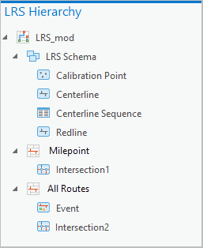
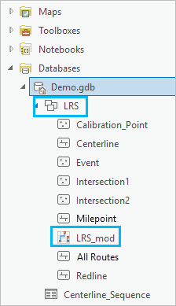

# View the LRS Hierarchy

|   |   |
| --- | --- |
| **Kind** | Other · Pro |
| **Release** | — |
| **Product** | Roads & Highways |
| **Source** | [RH_ViewtheLRSHierarchy.docx](<https://esriis.sharepoint.com/sites/LocationReferencing/Shared%20Documents/General/Doc%20Reviews/Pro36_Ent12/6383_6949_LRShierarchy/RH_ViewtheLRSHierarchy.docx>) |
| **Edited** | 2025-09-01 04:28 by unknown |
| **Extracted** | 2026-09-04 · lane `xmlstrip` |

<!-- metadata
```yaml
title: "View the LRS Hierarchy"
source_file: "RH_ViewtheLRSHierarchy.docx"
source_url: "https://esriis.sharepoint.com/sites/LocationReferencing/Shared%20Documents/General/Doc%20Reviews/Pro36_Ent12/6383_6949_LRShierarchy/RH_ViewtheLRSHierarchy.docx"
doc_id: 127
doc_kind: "Other"
surface: "Pro"
doc_revision: ""
target_release: ""
pe: ""
dev: ""
author: ""
last_edited_by: ""
last_edited: "2025-09-01T04:28:57.3746159Z"
extracted: 2026-09-04
extraction_lane: xmlstrip
prompt_version: "v2.0.2"
keywords: ["lrs hierarchy", "lrs dataset", "calibration point", "centerline", "event", "intersection", "network", "redline", "address data management"]
tools: ["Modify LRS"]
products: ["Roads & Highways"]
issues: []
related: [{"doc":129,"file":"view-the-lrs-hierarchy__doc129.md","s":7.97},{"doc":65,"file":"view-the-lrs-hierarchy__doc65.md","s":6.257},{"doc":133,"file":"view-site-address-point-properties__doc133.md","s":3.597},{"doc":135,"file":"view-centerline-properties__doc135.md","s":3.373},{"doc":134,"file":"view-lrs-event-properties__doc134.md","s":3.218}]
```
-->

## Summary

Describes how to view the hierarchy of a linear referencing system (LRS) dataset in ArcGIS Pro from both the Contents pane and the Catalog pane. Explains the structure of the LRS hierarchy including schema nodes and network nodes, and how to access properties or add entities to maps.

## Related documents

<!-- related:begin -->
- [View the LRS hierarchy](<https://esriis.sharepoint.com/sites/lrsworkspace/LRS Doc Index/Other/view-the-lrs-hierarchy__doc129.md>) — similar text 0.79 · 2 title words · 2 filename words · same kind/surface/folder <!-- rel:129 -->
- [View the LRS hierarchy](<https://esriis.sharepoint.com/sites/lrsworkspace/LRS Doc Index/Other/view-the-lrs-hierarchy__doc65.md>) — similar text 0.72 · 2 title words · same kind/surface <!-- rel:65 -->
- [View Site Address Point Properties](<https://esriis.sharepoint.com/sites/lrsworkspace/LRS Doc Index/Other/view-site-address-point-properties__doc133.md>) — similar text 0.36 · 1 title word · same kind/surface/folder <!-- rel:133 -->
- [View Centerline Properties](<https://esriis.sharepoint.com/sites/lrsworkspace/LRS Doc Index/Other/view-centerline-properties__doc135.md>) — similar text 0.36 · 1 title word · same kind/surface/folder <!-- rel:135 -->
- [View LRS Event Properties](<https://esriis.sharepoint.com/sites/lrsworkspace/LRS Doc Index/Other/view-lrs-event-properties__doc134.md>) — similar text 0.32 · 1 title word · same kind/surface/folder <!-- rel:134 -->
<!-- related:end -->

<!-- docs:begin -->
## Esri documentation

[View the LRS hierarchy](https://doc.esri.com/en/arcgis-pro/latest/help/production/roads-highways/view-the-lrs-hierarchy.html) · [Merge centerlines](https://doc.esri.com/en/arcgis-pro/latest/help/production/roads-highways/merge-centerlines.html) · [View LRS intersection properties](https://doc.esri.com/en/arcgis-pro/latest/help/production/roads-highways/view-lrs-intersection-properties.html) · [View LRS Network properties](https://doc.esri.com/en/arcgis-pro/latest/help/production/roads-highways/view-lrs-network-properties.html) · [View redline properties](https://doc.esri.com/en/arcgis-pro/latest/help/production/roads-highways/view-redline-properties.html) · [Manage address and roadway characteristic data together](https://doc.esri.com/en/arcgis-pro/latest/help/production/roads-highways/manage-address-and-roadway-characteristic-data-together.html)

_No page matched:_ [Modify LRS](https://www.google.com/search?q=%22Modify%20LRS%22+site%3Adoc.esri.com)
<!-- docs:end -->

---

## View the LRS hierarchy
A linear referencing system (LRS) dataset is a controller dataset in a feature dataset in the geodatabase along with all the feature classes that participate in the LRS.
In ArcGIS Pro you can view the hierarchy in an LRS dataset to determine which types of networks exist in your LRS and which events are associated with each network.

### View the LRS hierarchy from the Contents pane
To review the LRS hierarchy from the Contents pane, complete the following steps:

- In the ArcGIS Pro project, choose the map that includes the LRS feature layer.
- The Contents pane appears with the layers listed.
- In the Contents pane, click to choose a feature layer from the LRS dataset.
- You can choose any of the feature layers that are members of the LRS dataset (calibration point, centerline, event, intersection, network, or redline).
- Click the Location Referencing tab on the ArcGIS Pro ribbon.
- Click LRS Hierarchy  in the Tools group.
- Tip:
- If LRS Hierarchy  is not active, the feature layer you chose is not a member of the LRS dataset. Choose a valid feature layer in the Contents pane to activate it.
- The LRS Hierarchy pane appears. The LRS (LRS_mod in this example) is the root of the hierarchy.
- The LRS Schema node  contains the minimum schema feature classes and the centerline sequence table, while the network nodes show the network, event, and intersection feature classes.
- Note:
- In a combined https://prodev.arcgis.com/en/pro-app/3.6/help/production/roads-highways/manage-address-and-roadway-characteristic-data-together.htm LRS and Address Data Management dataset, the Address Schema node contains the address range and site address point feature classes.
- Optionally, right-click any entity in the LRS hierarchy to view its properties or to add it to a new or current map.
- You can access properties for the calibration point, centerline, event, intersection, network, or redline feature classes, as well as properties for the centerline sequence table. In a combined LRS and Address Data Management dataset, you can access properties for the https://prodev.arcgis.com/en/pro-app/latest/help/production/roads-highways/view-site-address-point-properties.htm site address point feature class.

### View the LRS hierarchy from the Catalog pane
The LRS dataset appears in the Catalog pane as the LRS folder in the geodatabase node. This folder contains all the members of the dataset.
You can view the LRS hierarchy from the Catalog pane using the following steps:

- In the ArcGIS Pro project, open the Catalog pane.
- In the Catalog pane, expand the geodatabase node and expand the feature dataset.
- The LRS hierarchy appears in the LRS dataset using the name of the LRS (LRS_mod in this example). If an LRS dataset is not present in the LRS, the LRS hierarchy does not appear. Run the Modify LRS tool to update the LRS.
- Right-click the LRS dataset and choose LRS Hierarchy.
- The LRS Hierarchy pane appears with the LRS name (LRS_mod in this example) as root.
- The LRS Schema node has the minimum schema feature classes and the centerline sequence table, while the network nodes show the network, event, and intersection feature classes.
- Note:
- In a combined https://prodev.arcgis.com/en/pro-app/3.6/help/production/roads-highways/manage-address-and-roadway-characteristic-data-together.htm LRS and Address Data Management dataset, the Address Schema node contains the address range and site address point feature classes.
- Optionally, right-click any entity in the LRS hierarchy to view its properties or to add it to a new or current map.
- You can access properties for the calibration point, centerline, event, intersection, network, or redline feature classes, as well as properties for the centerline sequence table. In a combined LRS and Address Data Management dataset, you can access properties for the https://prodev.arcgis.com/en/pro-app/latest/help/production/roads-highways/view-site-address-point-properties.htm site address point feature class.

   
