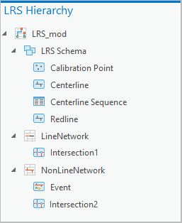
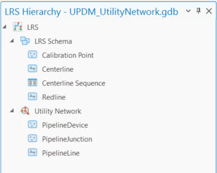

# View the LRS hierarchy

|   |   |
| --- | --- |
| **Kind** | Other · Pro |
| **Release** | — |
| **Product** | Utility Network |
| **Issue** | [ArcGISPro/ps-location-referencing#7300](https://devtopia.esri.com/ArcGISPro/ps-location-referencing/issues/7300) |
| **Source** | [7300-apr-view-the-lrs-hierarchy.docx](<https://esriis.sharepoint.com/sites/LocationReferencing/Shared%20Documents/General/Doc%20Reviews/Pro37_Ent121/7300_view_un_fc_properties/7300-apr-view-the-lrs-hierarchy.docx>) |
| **Edited** | 2026-02-25 17:55 by unknown |
| **Extracted** | 2026-09-04 · lane `xmlstrip` |

<!-- metadata
```yaml
title: "View the LRS hierarchy"
source_file: "7300-apr-view-the-lrs-hierarchy.docx"
source_url: "https://esriis.sharepoint.com/sites/LocationReferencing/Shared%20Documents/General/Doc%20Reviews/Pro37_Ent121/7300_view_un_fc_properties/7300-apr-view-the-lrs-hierarchy.docx"
doc_id: 65
doc_kind: "Other"
surface: "Pro"
doc_revision: ""
target_release: ""
pe: ""
dev: ""
author: ""
last_edited_by: ""
last_edited: "2026-02-25T17:55:06.6180949Z"
extracted: 2026-09-04
extraction_lane: xmlstrip
prompt_version: "v2.0.2"
keywords: ["lrs hierarchy", "lrs dataset", "feature classes", "centerline sequence", "network", "calibration point", "event", "intersection", "redline"]
tools: []
products: ["Utility Network"]
issues: ["ArcGISPro/ps-location-referencing#7300"]
related: [{"doc":67,"file":"view-utility-network-feature-class-properties__doc67.md","s":1004.405},{"doc":129,"file":"view-the-lrs-hierarchy__doc129.md","s":7.235},{"doc":127,"file":"view-the-lrs-hierarchy__doc127.md","s":6.257},{"doc":136,"file":"view-centerline-properties__doc136.md","s":3.959},{"doc":135,"file":"view-centerline-properties__doc135.md","s":3.357}]
```
-->

## Summary

Describes how to review the hierarchy of a linear referencing system (LRS) dataset in ArcGIS Pro using the Contents pane and the Catalog pane. Explains the structure of the LRS hierarchy including schema feature classes, centerline sequence table, and network nodes with associated feature classes. Notes special considerations for combined LRS and utility network datasets.

## Related documents

<!-- related:begin -->
- [View Utility Network Feature Class Properties](<https://esriis.sharepoint.com/sites/lrsworkspace/LRS Doc Index/Other/view-utility-network-feature-class-properties__doc67.md>) — shared issue ArcGISPro/ps-location-referencing#7300 · similar text 0.28 · 1 title word · 2 filename words · same kind/surface/folder <!-- rel:67 -->
- [View the LRS hierarchy](<https://esriis.sharepoint.com/sites/lrsworkspace/LRS Doc Index/Other/view-the-lrs-hierarchy__doc129.md>) — similar text 0.82 · 2 title words · 1 filename word · same kind/surface <!-- rel:129 -->
- [View the LRS Hierarchy](<https://esriis.sharepoint.com/sites/lrsworkspace/LRS Doc Index/Other/view-the-lrs-hierarchy__doc127.md>) — similar text 0.72 · 2 title words · same kind/surface <!-- rel:127 -->
- [View Centerline Properties](<https://esriis.sharepoint.com/sites/lrsworkspace/LRS Doc Index/Other/view-centerline-properties__doc136.md>) — similar text 0.27 · 1 title word · 2 filename words · same kind/surface <!-- rel:136 -->
- [View Centerline Properties](<https://esriis.sharepoint.com/sites/lrsworkspace/LRS Doc Index/Other/view-centerline-properties__doc135.md>) — similar text 0.24 · 1 title word · 1 filename word · same kind/surface <!-- rel:135 -->
<!-- related:end -->

<!-- docs:begin -->
## Esri documentation

[Modify calibration points](https://doc.esri.com/en/arcgis-pro/latest/help/production/location-referencing-pipelines/modify-calibration-points.html) · [View the LRS hierarchy](https://doc.esri.com/en/arcgis-pro/latest/help/production/location-referencing-pipelines/view-the-lrs-hierarchy.html) · [View utility network feature class properties](https://doc.esri.com/en/arcgis-pro/latest/help/production/location-referencing-pipelines/view-utility-network-feature-class-properties.html) · [View centerline sequence table properties](https://doc.esri.com/en/arcgis-pro/latest/help/production/location-referencing-pipelines/view-centerline-sequence-table-properties.html) · [LRS network](https://doc.esri.com/en/arcgis-pro/latest/help/production/location-referencing-pipelines/what-is-an-lrs-network.html) · [View LRS intersection properties](https://doc.esri.com/en/arcgis-pro/latest/help/production/location-referencing-pipelines/view-lrs-intersection-properties.html) · [View redline properties](https://doc.esri.com/en/arcgis-pro/latest/help/production/location-referencing-pipelines/view-redline-properties.html)

_No page matched:_ [calibration point layer](https://www.google.com/search?q=%22calibration%20point%20layer%22+site%3Adoc.esri.com)
<!-- docs:end -->

---

## View the LRS hierarchy
A linear referencing system (LRS) dataset is a controller dataset in a feature dataset in the geodatabase along with all the feature classes that participate in the LRS.
You can review the hierarchy in an LRS dataset in ArcGIS Pro to decide which types of networks exist in the LRS and which events are associated with each network.

### Review the LRS hierarchy from the Contents pane
To review the LRS hierarchy from the Contents pane, complete the following steps:

- In the ArcGIS Pro project, choose the map that includes the LRS feature layer.
- The Contents pane appears with the layers listed.
- In the Contents pane, click to choose a feature layer from the LRS dataset.
- You can choose any of the feature layers that are members of the LRS dataset (calibration point, centerline, event, intersection, network, or redline).
- Click the Location Referencing tab on the ArcGIS Pro ribbon.
- Click LRS Hierarchy  in the Tools group.
- Tip:
- If LRS Hierarchy  is not active, the feature layer you chose is not a member of the LRS dataset. Choose a valid feature layer in the Contents pane to activate it.
- The LRS Hierarchy pane appears. The LRS (LRS_mod in this example) is the root of the hierarchy.
- The LRS Schema node  contains the minimum schema feature classes and the centerline sequence table, and the network nodes show the network, event, and intersection feature classes.
- Note:
- In a combined LRS and utility network dataset, the LRS SchemaUtility Network node is denoted as LRS Schema (with Utility Network).available.
- Optionally, right-click an entity in the LRS hierarchy to review its properties or add it to a new or current map.
- You can access properties for the calibration point, centerline, event, intersection, network, or redline feature classes, as well as properties for the centerline sequence table.
- Note:
- In a combined LRS and utility network dataset, you can access properties for the utility network feature classes (link).

### Review the LRS hierarchy from the Catalog pane
The LRS dataset appears in the Catalog pane as the LRS folder in the geodatabase node. When expanded, all of the feature dataset members appear.
To review the LRS hierarchy from the Catalog pane, complete the following steps:

- In the ArcGIS Pro project, open the Catalog pane.
- In the Catalog pane, expand the geodatabase node, and expand the feature dataset.
- The LRS hierarchy appears in the LRS dataset using the name of the LRS (LRS_mod in this example). If an LRS dataset is not present in the LRS, the LRS hierarchy does not appear. Run the Modify LRS tool to update the LRS.
- Right-click the LRS dataset, and choose LRS Hierarchy.
- The LRS Hierarchy pane appears with the LRS name (LRS_mod in this example) as root.
- The LRS Schema node has the minimum schema feature classes and the centerline sequence table, and the network nodes show the network, event, and intersection feature classes.
- Note:
- In a combined LRS and utility network dataset, the LRS SchemaUtility Network node is available.denoted as LRS Schema (with Utility Network).
- Optionally, right-click an entity in the LRS hierarchy to review its properties or add it to a new or current map.
- You can access properties for the calibration point, centerline, event, intersection, network, or redline feature classes, as well as properties for the centerline sequence table.
- Note:
- In a combined LRS and utility network dataset, you can access properties for the utility network feature classes (link).

    
