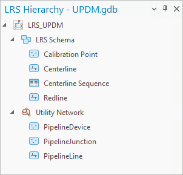
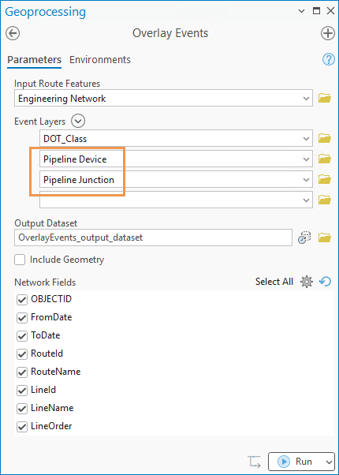
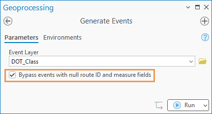
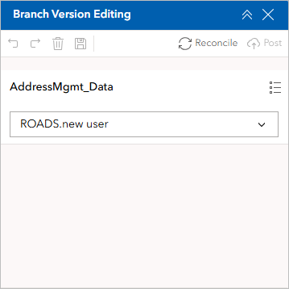
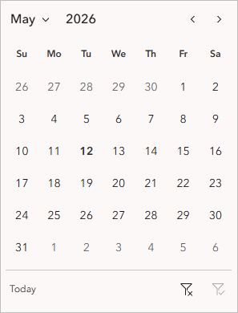
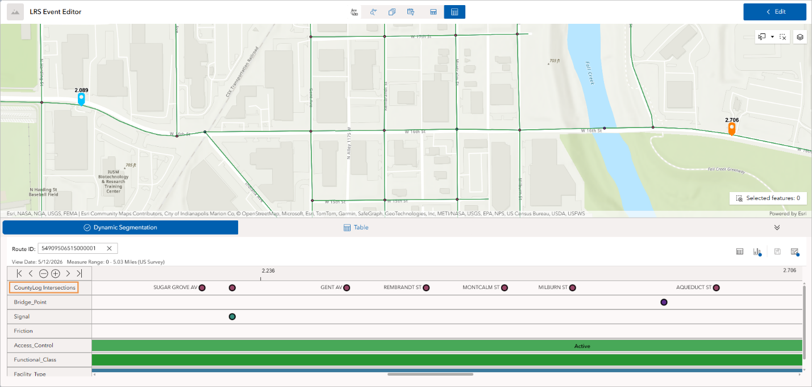
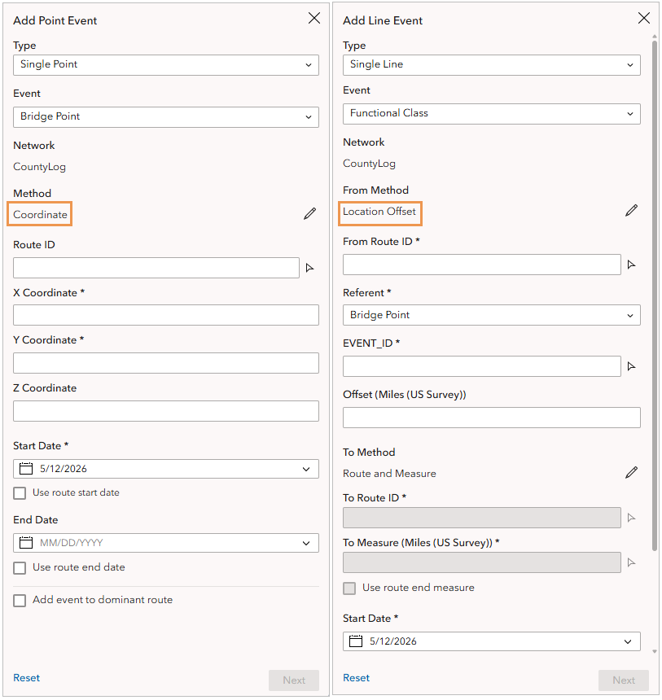
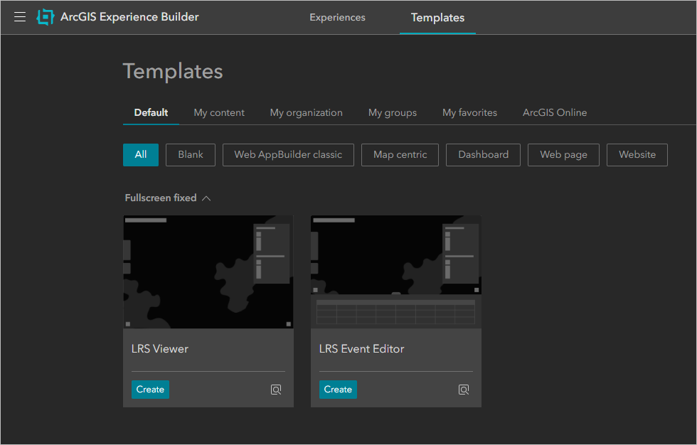

# What's New in ArcGIS Roads and Highways and ArcGIS Pipeline Referencing: May 2026

| Field | Value |
| --- | --- |
| **Doc** | 33 · Other · Pro |
| **Product** | Roads & Highways · Pipeline Referencing · Utility Network |
| **Release** | 3.7 / 12.1 |
| **Issues** | — |
| **Source** | [whats-new-blog-37-121-draft.docx](<https://esriis.sharepoint.com/sites/LocationReferencing/Shared%20Documents/General/Doc%20Reviews/Pro37_Ent121/whats-new-blog-37-121/whats-new-blog-37-121-draft.docx>) |
| **People** | author Kyle Chin · PE — · dev — |
| **Edited** | 2026-05-15 18:12 by unknown |
| **Extracted** | 2026-09-04 · lane xmlstrip · format 3.0 · prompt v2.0.2 |
| **Keywords** | merge centerlines · utility network integration · ai assisted route editing · overlay events · intersection layer · location referencing options · linux support · lrs editing widgets · dynamic segmentation · event adding methods · lrs templates |
| **Tools** | Merge Centerlines · Configure Utility Network Feature Classes · Overlay Events · Generate Events · ArcGIS Pro Assistant · Dynamic Segmentation · Add Line Event · Add Point Event · Branch Version Editing · Date Filter |

## Summary

This document details new capabilities in ArcGIS Pro 3.7 and ArcGIS Enterprise 12.1 for ArcGIS Roads and Highways and ArcGIS Pipeline Referencing. It covers enhancements such as merge centerlines, deeper utility network integration, AI-assisted route editing, performance improvements for overlay events, intersection layer support, and quality of life improvements in location referencing options. It also describes new Linux support, widgets for LRS editing workflows, dynamic segmentation widget enhancements, new event adding methods, and revamped LRS templates in ArcGIS Enterprise.

## Related documents

<!-- related:begin -->
- [What’s New in ArcGIS Roads and Highways and ArcGIS Pipeline Referencing: November 2025](<https://esriis.sharepoint.com/sites/lrsworkspace/LRS Doc Index/Other/whats-new-in-arcgis-rh-and-arcgis-apr-november-2025.md>) — similar text 0.08 · 4 title words · 2 filename words · same kind/surface <!-- rel:112 s=5.833 -->
- [Pipeline Referencing and Roads and Highways Enhancements in Location Referencing](<https://esriis.sharepoint.com/sites/lrsworkspace/LRS%20Doc%20Index/Other/apr-and-rh-enhancements-in-lr.md>) — similar text 0.02 · 3 title words · same kind/surface <!-- rel:58 s=4.299 -->
- [What's new in ArcGIS Roads and Highways 12.1](<https://esriis.sharepoint.com/sites/lrsworkspace/LRS Doc Index/Other/whats-new-in-arcgis-rh-12-1.md>) — similar text 0.02 · 3 title words · same kind <!-- rel:56 s=4.088 -->
- [Roads and Highways and Pipeline Referencing Enhancements in ArcGIS Pro](<https://esriis.sharepoint.com/sites/lrsworkspace/LRS%20Doc%20Index/Other/rh-and-apr-enhancements-in-pro.md>) — similar text 0.02 · 3 title words · same kind/surface <!-- rel:304 s=3.294 -->
- [ArcGIS Pipeline Referencing: An Introduction](<https://esriis.sharepoint.com/sites/lrsworkspace/LRS%20Doc%20Index/Other/arcgis-apr-an-introduction-apr-un.md>) — similar text 0.07 · 1 title word · same kind/surface <!-- rel:785 s=3.009 -->
<!-- related:end -->

<!-- docs:begin -->
## Esri documentation

[Merge centerlines](https://doc.esri.com/en/arcgis-pro/latest/help/production/roads-highways/merge-centerlines.html) · [Apply dynamic segmentation](https://doc.esri.com/en/arcgis-pro/latest/help/production/roads-highways/apply-dynamic-segmentation.html) · [Set Location Referencing options](https://doc.esri.com/en/arcgis-pro/latest/help/production/roads-highways/set-location-referencing-options.html) · [Create a template for an LRS length data product](https://doc.esri.com/en/arcgis-pro/latest/help/production/roads-highways/create-a-template-for-an-lrs-length-data-product.html)

_No page matched:_ [Configure Utility Network Feature Classes](https://www.google.com/search?q=%22Configure%20Utility%20Network%20Feature%20Classes%22+site%3Adoc.esri.com) · [Overlay Events](https://www.google.com/search?q=%22Overlay%20Events%22+site%3Adoc.esri.com) · [Generate Events](https://www.google.com/search?q=%22Generate%20Events%22+site%3Adoc.esri.com) · [ArcGIS Pro Assistant](https://www.google.com/search?q=%22ArcGIS%20Pro%20Assistant%22+site%3Adoc.esri.com) · [Add Line Event](https://www.google.com/search?q=%22Add%20Line%20Event%22+site%3Adoc.esri.com) · [Add Point Event](https://www.google.com/search?q=%22Add%20Point%20Event%22+site%3Adoc.esri.com) · [Branch Version Editing](https://www.google.com/search?q=%22Branch%20Version%20Editing%22+site%3Adoc.esri.com) · [Date Filter](https://www.google.com/search?q=%22Date%20Filter%22+site%3Adoc.esri.com)
<!-- docs:end -->

---

## What's New in ArcGIS Roads and Highways and ArcGIS Pipeline Referencing: May 2026

The ArcGIS Pro 3.7 and ArcGIS Enterprise 12.1 releases of ArcGIS Roads and Highways and ArcGIS Pipeline Referencing focus on reducing manual effort in editing workflows, extending the web-based editing experience, and deepening the integration with ArcGIS Utility Network and the Address Data Management solution.
Read on to learn about what’s new!
Quick links

- ArcGIS Pro capabilities
  - Merge centerlines to reduce segmentation
  - Deeper ArcGIS Utility Network integration
  - AI-assisted route editing
  - Performance enhancements for Overlay Events
  - Intersection layer support for the route log data product
  - Quality of life improvements in Location Referencing options
- ArcGIS Enterprise capabilities
  - Linux support
  - New widgets to streamline LRS editing workflows
  - Dynamic Segmentation widget enhancements
  - New methods for adding events
  - Revamped LRS templates

### ArcGIS Pro capabilities
The following capabilities have been added to ArcGIS Pro.

#### Merge centerlines to reduce segmentation
The Merge Centerlines tool merges centerline features that belong to a common route into a single feature when their attributes are identical. The result is a centerline feature that has reduced segmentation with cleaner geometry, which simplifies data management and other LRS workflows.
If you use the combined Roads and Highways and Address Data Management solution deployment pattern, you may have many attributes on centerline features that require splitting and merging. With the Merge Centerlines tool, you can merge those centerlines back.

#### Deeper ArcGIS Utility Network integration
If you use the combined Pipeline Referencing and ArcGIS Utility Network deployment pattern, you can now integrate the utility network into the LRS more deeply than before. The integration between ArcGIS Pipeline Referencing and ArcGIS Utility Network has been enhanced in the following ways.

##### Configure Utility Network feature classes for an LRS
The new Configure Utility Network Feature Classes tool allows you to set up the Pipeline Device and Pipeline Junction feature classes for use with an LRS. Once configured, these feature classes appear under the Utility Network node in the LRS Hierarchy pane, and you can verify which fields are configured with a utility network in the utility network feature class properties.

##### Include devices and junctions in Overlay Events
The Pipeline Device and Pipeline Junction feature classes can be used as inputs to the Event Layers parameter in the Overlay Events tool. This means you can obtain a single dynamic segmentation output that includes devices and junctions alongside other event layers, instead of having to stitch together separate queries.

##### Model linear-referenced and non-linear-referenced pipe characteristics in a single event feature class
Some pipeline characteristics, such as coating type, may apply to all pipes. PreviouslyIn a combined Pipeline Referencing-Utility Network deployment, the types of features were modeleding these characteristics in a single event feature class despite some features not being located on linear referenced pipewas not feasible.
The Generate Events tool's new Bypass events with null route ID and measure fields parameter lets you skip records with null route ID and measure fields, leaving non-linear-referenced records untouched while processing the rest normally. This removes the need to maintain separate feature classes for the same business attribute, simplifying the data model and reducing maintenance overhead.

#### AI-assisted route editing
LRS route editing involves multiple steps that must be done in a specific order. LRS editors who do not perform these tasks daily may need to consult documentation or go back and forth between pages in the tool pane to make sure inputs are correct.
You can now use ArcGIS Pro Assistant (Beta) to edit routes by providing natural language prompts. For example, if a route is calibrated in the wrong direction, the assistant guides you through route reversal.
You can provide a complete prompt with all parameter values, or you can go through the workflow with the assistant one step at a time. The ArcGIS Pro Assistant (Beta) documentation includes instructions on how to access the assistant, sample prompts, and synonyms you can use when performing route editing.
This release covers route creation, reversal, and realignment. Future releases will include additional route editing tools.
[VIDEO: AI assistant panel guiding an editor through a route reversal operation]

#### Performance enhancements for Overlay Events
The Overlay Events tool now supports parallel processing for events that span multiple routes and nonspanning events that are not registered with the target network. By setting a Parallel Processing Factor value, the workload is distributed across multiple processes, allowing you to run the tool on large datasets in a shorter period ofwithin a reasonable time.
Performance has also been improved when running the tool with a combined LRS and Address Data Management dataset.

#### Intersection layer support for the route log data product
When using the Data Product Designer to create a route log template, you can now configure an intersection feature class as a referent layer. The same support has been extended to the standalone Generate Linear Referenced Route Log tool.

#### Quality of life improvements in Location Referencing options
Within the Location Referencing options, you can set the default method for adding point and line events and for event replacement. This setting reduces mouse clicks if your organization primarily uses one method. Additionally, you can prevent intersections from being created or updated when running the Process Edits tool by checking the Do not run Generate Intersections tool check box.

### ArcGIS Enterprise capabilities
The following capabilities are included in ArcGIS Enterprise.

#### Linux support
The 12.1 release of ArcGIS Roads and Highways and ArcGIS Pipeline Referencing is now supported on both Windows and Linux operating systems, so your team can deploy and manage the software in an environment that best fits your existing infrastructure and IT standards.

#### New widgets to streamline LRS editing workflows
Previously, branch version management tasks primarily took place in ArcGIS Pro. For organizations that do most of their editing in a browser, this means having to switch between different applications.
The new Branch Version Editing widget in ArcGIS Experience Builder allows you to manage branch versions and edit branch-versioned datasets with options to save, discard, undo, and redo changes, as well as to reconcile and post data after editing. You can now create a named version, make edits, and perform the reconcile and post processes without leaving the browser.

In line with the effort to streamline editing workflows, the new Date Filter widget allows you to filter features by choosing a specific date or date range using a calendar tool. This keeps the Experience Builder workflow aligned with the time-aware LRS layer support already available in ArcGIS Pro.

#### Dynamic Segmentation widget enhancements
The following updates have been made to the Dynamic Segmentation widget.

##### Intersections in the straight line diagram
Intersections can now be displayed in a straight line diagram (SLD), making it easier to orient yourself spatially or analyze how events relate to intersection locations. LRS editors can visualize and obtain intersection information on a particular route shown in the SLD in preparation for event editing. The inclusion of intersections in an SLD also helps GIS analysts perform analyses related to traffic control, safety, pavement, crashes, etc.

##### Integration with the Oriented Imagery Viewer widget
The Dynamic Segmentation widget now integrates with the Oriented Imagery Viewer widget. Navigation syncs across the SLD, the map, and the Oriented Imagery Viewer widget panel. Click a location in the SLD or the map, and the Oriented Imagery Viewer widget panel jumps to the corresponding image to show the actual asset for visual confirmation. This integration provides a comprehensive understanding of the routes and events at a particular location.
[VIDEO: Split view showing the Dynamic Segmentation widget synced with the Oriented Imagery Viewer and the map]

#### New methods for adding events
Field data may not always arrive in route-and-measure form. For some organizations, event data may originate from GPS coordinates or offsets from known points of reference. In previous releases, the Add Line Event and Add Point Event widgets supported only the Route and Measure input method. Two new input methods, Coordinate and Location Offset, are now available when adding point or line events.
LRS editors can now specify a referent and offset (such as "0.3 miles from mile point 42") or enter coordinates directly. Both methods translate to route and measure values automatically, so data entry stays in the format of the source data.
With the addition of these two methods, event entry workflows in Experience Builder are on par with ArcGIS Pro.

#### Revamped LRS templates
In this release, the LRS Viewer and LRS Event Editor templates have been updated with a streamlined user interface and improved viewing and editing capabilities. Instead of building apps from scratch, these templates provide GIS administrators with a ready-to-customize starting point that can increase deployment speed and help keep configuration consistent across multiple apps.

---
Try these new features and let us know what you think in the ArcGIS Roads and Highways or ArcGIS Pipeline Referencing places in Esri Community!

