# What’s New in ArcGIS Roads and Highways and ArcGIS Pipeline Referencing: November 2025

|   |   |
| --- | --- |
| **Kind** | Other · Pro |
| **Release** | 3.6 / 12.0 |
| **Product** | Roads & Highways · Pipeline Referencing · Utility Network |
| **Source** | [WhatsNewBlog_36120_draft.docx](<https://esriis.sharepoint.com/sites/LocationReferencing/Shared%20Documents/General/Doc%20Reviews/Pro36_Ent12/WhatsNewBlog_36120_draft.docx>) |
| **Edited** | 2025-10-29 21:22 by Nathan Easley |
| **Extracted** | 2026-09-04 · lane `xmlstrip` |

<!-- metadata
```yaml
title: "What’s New in ArcGIS Roads and Highways and ArcGIS Pipeline Referencing: November 2025"
source_file: "WhatsNewBlog_36120_draft.docx"
source_url: "https://esriis.sharepoint.com/sites/LocationReferencing/Shared%20Documents/General/Doc%20Reviews/Pro36_Ent12/WhatsNewBlog_36120_draft.docx"
doc_id: 112
doc_kind: "Other"
surface: "Pro"
doc_revision: ""
target_release: "3.6 / 12.0"
pe: ""
dev: ""
author: "Kyle Chin"
last_edited_by: "Nathan Easley"
last_edited: "2025-10-29T21:22:00Z"
extracted: 2026-09-04
extraction_lane: xmlstrip
prompt_version: "v2.0.2"
keywords: ["data products", "conflict prevention locks", "event loading", "dynamic segmentation widget", "route concurrency", "address data management", "utility network integration", "express mode"]
tools: ["Generate Linear Referenced Feature Count", "Generate Linear Referenced Length Summary", "Generate Linear Referenced Route Log", "Append Events", "Generate Intersections", "Append Routes", "Overlay Events", "Dynamic Segmentation", "Add Line Event", "Add Point Event"]
products: ["Roads & Highways", "Pipeline Referencing", "Utility Network"]
issues: []
related: [{"doc":33,"file":"whats-new-in-arcgis-roads-and-highways-and-arcgis-pipeline-referencing-may-2026__doc33.md","s":5.833},{"doc":121,"file":"apr-rh-integration-and-location-referencing-toolbox-updates__doc121.md","s":5.572},{"doc":117,"file":"whats-new-in-arcgis-roads-and-highways-12-0__doc117.md","s":4.645},{"doc":304,"file":"roads-and-highways-and-pipeline-referencing-enhancements-in-arcgis-pro__doc304.md","s":3.868},{"doc":58,"file":"pipeline-referencing-and-roads-and-highways-enhancements-in-location-referencing__doc58.md","s":3.837}]
```
-->

## Summary

This document details new capabilities and improvements in ArcGIS Pro 3.6 and ArcGIS Enterprise 12.0 for Roads and Highways and Pipeline Referencing. It covers new geoprocessing tools for data products, relaxed data loading requirements, performance enhancements, and integrations with Address Data Management and Utility Network. It also describes Experience Builder widget enhancements including express mode, dynamic segmentation improvements, and event widget updates for route concurrency.

## Related documents

<!-- related:begin -->
- [What's New in ArcGIS Roads and Highways and ArcGIS Pipeline Referencing: May 2026](<https://esriis.sharepoint.com/sites/lrsworkspace/LRS Doc Index/Other/whats-new-in-arcgis-roads-and-highways-and-arcgis-pipeline-referencing-may-2026__doc33.md>) — similar text 0.08 · 4 title words · 2 filename words · same kind/surface <!-- rel:33 -->
- [APR/RH Integration and Location Referencing Toolbox Updates](<https://esriis.sharepoint.com/sites/lrsworkspace/LRS Doc Index/Other/apr-rh-integration-and-location-referencing-toolbox-updates__doc121.md>) — similar text 0.36 · same kind/surface <!-- rel:121 -->
- [What's new in ArcGIS Roads and Highways 12.0](<https://esriis.sharepoint.com/sites/lrsworkspace/LRS Doc Index/Other/whats-new-in-arcgis-roads-and-highways-12-0__doc117.md>) — similar text 0.28 · 3 title words · same kind <!-- rel:117 -->
- [Roads and Highways and Pipeline Referencing Enhancements in ArcGIS Pro](<https://esriis.sharepoint.com/sites/lrsworkspace/LRS%20Doc%20Index/Other/roads-and-highways-and-pipeline-referencing-enhancements-in-arcgis-pro__doc304.md>) — similar text 0.20 · 3 title words · same kind/surface <!-- rel:304 -->
- [Pipeline Referencing and Roads and Highways Enhancements in Location Referencing](<https://esriis.sharepoint.com/sites/lrsworkspace/LRS%20Doc%20Index/Other/pipeline-referencing-and-roads-and-highways-enhancements-in-location-referencing__doc58.md>) — similar text 0.20 · 3 title words · same kind/surface <!-- rel:58 -->
<!-- related:end -->

<!-- docs:begin -->
## Esri documentation

[Apply dynamic segmentation](https://doc.esri.com/en/arcgis-pro/latest/help/production/roads-highways/apply-dynamic-segmentation.html) · [LRS data products](https://doc.esri.com/en/arcgis-pro/latest/help/production/roads-highways/lrs-data-products.html) · [Manage address and roadway characteristic data together](https://doc.esri.com/en/arcgis-pro/latest/help/production/roads-highways/manage-address-and-roadway-characteristic-data-together.html)

_No page matched:_ [Generate Linear Referenced Feature Count](https://www.google.com/search?q=%22Generate%20Linear%20Referenced%20Feature%20Count%22+site%3Adoc.esri.com) · [Generate Linear Referenced Length Summary](https://www.google.com/search?q=%22Generate%20Linear%20Referenced%20Length%20Summary%22+site%3Adoc.esri.com) · [Generate Linear Referenced Route Log](https://www.google.com/search?q=%22Generate%20Linear%20Referenced%20Route%20Log%22+site%3Adoc.esri.com) · [Append Events](https://www.google.com/search?q=%22Append%20Events%22+site%3Adoc.esri.com) · [Generate Intersections](https://www.google.com/search?q=%22Generate%20Intersections%22+site%3Adoc.esri.com) · [Append Routes](https://www.google.com/search?q=%22Append%20Routes%22+site%3Adoc.esri.com) · [Overlay Events](https://www.google.com/search?q=%22Overlay%20Events%22+site%3Adoc.esri.com) · [Add Line Event](https://www.google.com/search?q=%22Add%20Line%20Event%22+site%3Adoc.esri.com) · [Add Point Event](https://www.google.com/search?q=%22Add%20Point%20Event%22+site%3Adoc.esri.com)
<!-- docs:end -->

---

## What’s New in ArcGIS Roads and Highways and ArcGIS Pipeline Referencing: November 2025

The ArcGIS Pro 3.6 and ArcGIS Enterprise 12.0 releases bring powerful new capabilities and quality of life use improvements to ArcGIS Roads and Highways and ArcGIS Pipeline Referencing users. These enhancements are designed to streamline compliance reporting workflows, simplify the data loading process, and save time for common workflows.

## ArcGIS Pro capabilities

### New Data Products toolset
The Data Products toolset contains three new geoprocessing tools that allow users to create data products without an LRS data template:

- Generate Linear Referenced Feature Count
- Generate Linear Referenced Length Summary
- Generate Linear Referenced Route Log
In contrast with the template-based approach in previous releases, you can create data products by directly running the tools above. These tools can easily be incorporated into existing PYou can also run the tools from a Python scripts or orchain them with other tools in ModelBuilder models to create custom data products for your organization. If you’reFor those already familiar with creating data products, you can quickly generate feature counts, length summaries, and route logs without needing to first createing a template.
Learn more about creating data products with and without a template

### Generate LRS Data Product – multi-date support
The https://pro.arcgis.com/en/pro-app/latest/tool-reference/location-referencing/generate-lrs-data-product.htm Generate LRS Data ProductGenerate LRS Data Product tool supports multiple Effective Date values, making it easier to compare changes in length or feature count over time. For example, you can compare the change in DOT Class mileage year over year e the number of anomalies detected along a pipeline or the number of crashes that occur within a city between different dates.he amount of pavement that changes from fair to poor condition along a road each year.

### Relaxed requirements for data loading
Append events even if there are conflict prevention locks and optional mapping of date fields
Bulk loading event data when conflict prevention is now more flexible enabled just got easier. If you need to bulk load events using the https://pro.arcgis.com/en/pro-app/3.6/tool-reference/location-referencing/append-events.htm Append EventsAppend Events tool, but route locks are impeding the workflow, it is now possible to override these locks and proceed with loading events by enabling the checking the
Append even if there are conflict prevention locks parameter. After running the tool with this parameter checked, any events that are appended onto routes/events that are locked will receive the Location Error field of appended event records will be populated with the “No Error: Conflict Prevention Bypassed” value on those appended records.
Bypassing conflict prevention locks may result in data corruption or unexpected behavior, so it is recommended that you create a database backup before running the tool with this parameter checked.
Additionally, the mapping of the FromDate and ToDate fields in the tool is now optional, so you can bulk load events from vendors that do not record or account for the time during data collection. If you decide not to include the ToDate field, or both the FromDate and ToDate fields, simply remove the field(s) from the fields list in the Field Map parameter.  The appended events will inherit the To Date (or From and To Date) of the route they’re appended onto..

Generate Intersections even if there are conflict prevention locks
Similar to the Append Events tool, the Generate Intersections tool has been enhanced with a new parameter called Generate intersections even if there are conflict prevention locks. This parameter allows users to generate or update intersections, without locking intersecting routes to the route that was edited,, to minimize disruption to so other LRS data editors can continue their route editing workflows.making edits on intersecting routes.

Users can also bypass conflict prevention locks whenenabled this option when generating or updating intersections as part of the Process Edits tool. To do so, check the Generate intersections even if there are conflict prevention locks box in the Location Referencing options.
Append Routes – partial loading of routes
In previous releases, when bulk loading routes using the Append Routes tool, one problematic source route will stop the whole processwould result in the tool failing and not appending any routes. In this release, that is no longer the case. When the Allow partial loading of routes parameter is checked, valid routes will be loaded even if some routes fail validation. The tool outputs a feature class of routes that failed validation, along with messages explaining how to correct them.

### Performance improvement in the Overlay Events tool
When running the Overlay Events tool with data from a feature service, the dynamic segmentation process is performed asynchronously via the new Overlay Events REST operation. This new implementation yields significant performance gains, which should result in faster completion time and reduced timeouts.

### Address Data Management integration
For users adopting the combined Roads and Highways and Address Data Management solution deployment pattern, the LRS Hierarchy pane now displays the Address Schema node that contains the address range and site address point feature classes.
By right-clicking each entity and viewing its properties, you can verify which feature class and fields are configured with the Address Data Management solution. This gives you better visibility into what gets updated during LRS editing operations, helping you track changes, design editing workflows, and coordinate QC efforts more effectively.

### ArcGIS Utility Network integration
For users adopting the combined Pipeline Referencing and ArcGIS Utility Network deployment pattern, the LRS Schema node in the LRS Hierarchy pane now clearly indicates when athe utility network is integrated with the LRSion.

Moreover, in the Centerline properties, you can verify which fields are configured with a utility network. This capability allows you to ensure the relevant fields are configured correctly before you start editing.

## ArcGIS Enterprise capabilities

### Express mode support for Location Referencing widgets in Experience Builder
All Location Referencing widgets now support an express mode option, making it easier and quicker to deploy apps. In express mode, Location Referencing widgets are set up automatically using the web map in the Map widget. Any changes to the web map will immediately update the Location Referencing widgets.
When you configure an app in express mode, all Location Referencing widgets are automatically configured with the Interact with a Map widget setting.

### Dynamic Segmentation widget enhancements
Search by route ID or route name
Searching for routes is now built into the Dynamic Segmentation widget. This means you no longer have toneed to rely on data actions. You can run dynamic segmentation directly within the same widget, without switching back and forth between different widgets.

Interact with the map
Also included in this release is the ability to synchronize between the map and the straight line diagram (SLD). When the Map Interact button is enabled, navigating within the map will update the SLD, and vice versa. You can use other map layers as guideposts as you navigate to different locations along the route and view the SLD for those areas in context.

View-only dynamic segmentation table and SLD
Data administrators can now configure view-only access to the dynamic segmentation table and the SLD. To do this, turn the Allow editing setting off. An example scenario where this is helpful is when a contributor without editing permissions may use the SLD results to update non-LRS data. This allows Aadministrators to deploy the SLD in applications for non-editors, like project planners, with confidence knowing data won’t accidentally be edited or changed.can also prevent any accidental edits to LRS data.

User interface enhancements
The SLD view now shows more layers with less scrolling. This is helpful if your SLD contains many event layers and you want to compare how these events interact or overlap. On top of that, the SLD’s scale bar now shows 10 tick marks instead of 8, allowing you to be more precise when navigating along a route.

### Add Line Event and Add Point Event widgets – append to primary route
Route concurrency occurs when two or more routes overlap geographically and share the same centerline. In this release, the Add Line Event and Add Point Event widgets support automatically adding events to the primary (dominant) route in the network when route concurrency exists. By checking the Add event to dominant route parameter, any events appended will be placed on the primary route. Even if the route and measure information entered for the input event would otherwise locate it on a subordinate route, the tool will automatically assign it to the primary route. This enhancement streamlines data entry and improves data integrity for event editors because they can enter route and event information directly from source documents without having to translate the data beforehand.

Give these new features a try and let us know what you think! Your feedback helps us improve.

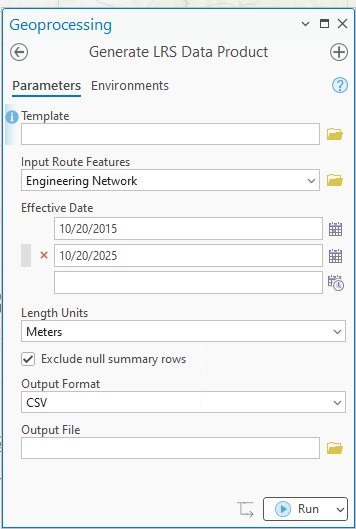 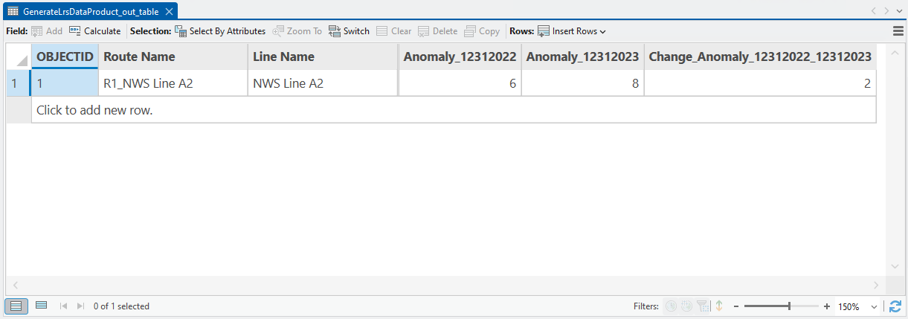 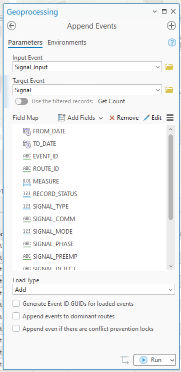 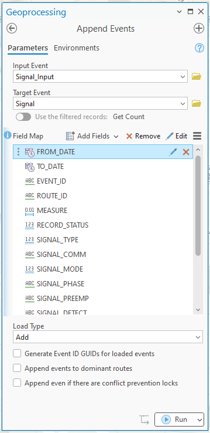 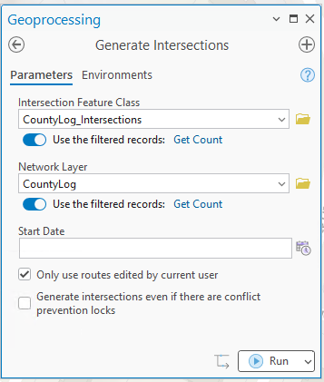 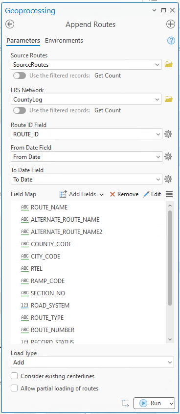  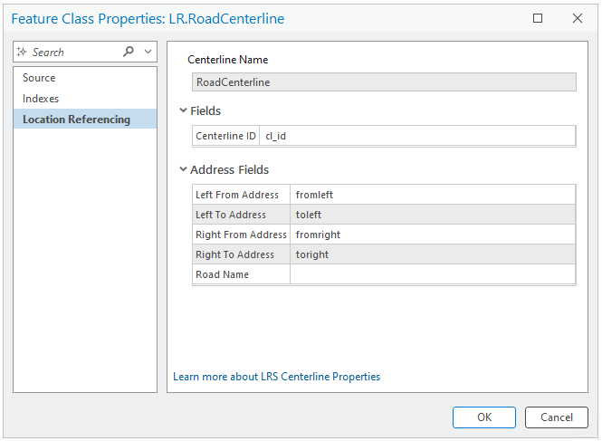 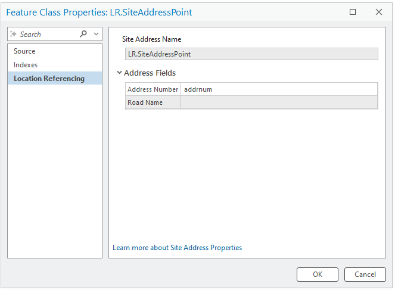 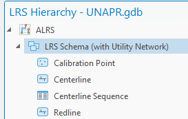 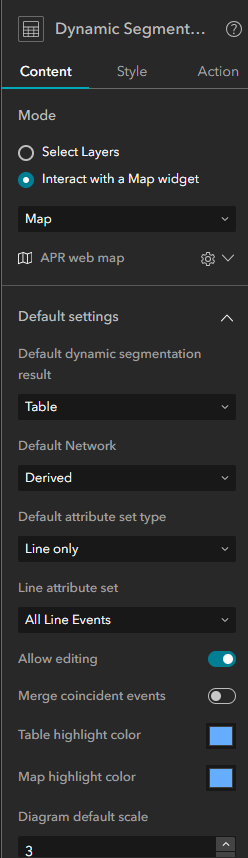 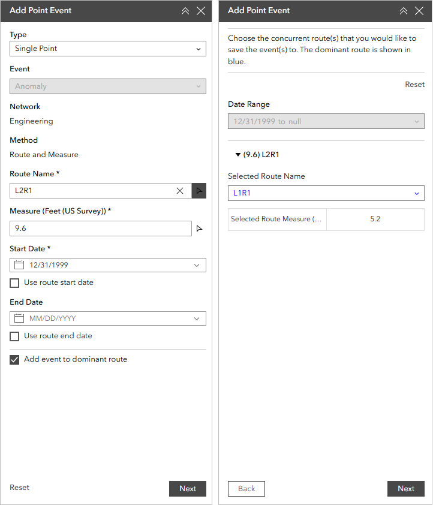
