# Consider Route Dominance in Append Events (add method) – Test Plan

| Field | Value |
| --- | --- |
| **Doc** | 279 · Test Plan · Pro |
| **Product** | Roads & Highways · Pipeline Referencing |
| **Release** | — |
| **Issues** | [ArcGISPro/ps-location-referencing#1488](https://devtopia.esri.com/ArcGISPro/ps-location-referencing/issues/1488) |
| **Source** | [AppendEventsDominant_testplan.pptx](<https://esriis.sharepoint.com/sites/LocationReferencing/Shared%20Documents/General/Test%20Plans/AppendEventsDominant_testplan.pptx>) |
| **People** | author Lakshmi Ananthanarayanan · PE Claire · dev Michael |
| **Edited** | 2024-11-20 20:08 by Claire Wang |
| **Extracted** | 2026-09-04 · lane xmlstrip · format 3.0 · prompt v2.0.2 |
| **Keywords** | route dominance · append events · concurrency · conflict prevention · event appending · route locking · spanning line event · dominant route |
| **Tools** | Append Events |

## Summary

Test plan for the Append Events tool enhancement to include an optional parameter for appending events to dominant routes. Covers functionality for concurrency logic, route dominance determination, event appending behavior, conflict prevention with route locking, and various positive and negative test cases including point, line, spanning events, and complex route shapes. Includes test data scenarios, verification steps, automation plans, and documentation updates.

## Related documents

<!-- related:begin -->
- [Consider Route Dominance in Append Events Test Plan](<https://esriis.sharepoint.com/sites/lrsworkspace/LRS Doc Index/Test Plans/3537-consider-route-dominance-in-append-events.md>) — similar text 0.54 · 5 title words · 4 filename words · same kind/folder <!-- rel:278 s=8.219 -->
- [Allow Append Events to Run When Locks Are Present - Test Plan](<https://esriis.sharepoint.com/sites/lrsworkspace/LRS%20Doc%20Index/Test%20Plans/6640-allow-append-events-to-run-when-locks-are-present.md>) — similar text 0.23 · 2 title words · 3 filename words · same kind/surface/folder <!-- rel:156 s=5.526 -->
- [Add Point Event to Dominant Route in ArcGIS Pro – Test Plan](<https://esriis.sharepoint.com/sites/lrsworkspace/LRS Doc Index/Test Plans/3916-add-point-event-to-dominant-route-in-pro.md>) — similar text 0.32 · 2 title words · 2 filename words · same kind/surface/folder <!-- rel:360 s=5.249 -->
- [Append Events Date Optional Test Plan](<https://esriis.sharepoint.com/sites/lrsworkspace/LRS Doc Index/Test Plans/append-events-date-optional.md>) — similar text 0.14 · 2 title words · 2 filename words · same kind/surface/folder <!-- rel:126 s=4.687 -->
- [Append Events: Load Events by RouteName Test Plan](<https://esriis.sharepoint.com/sites/lrsworkspace/LRS Doc Index/Test Plans/5117-append-events-load-events-by-routename.md>) — similar text 0.21 · 2 title words · 2 filename words · same kind/surface/folder <!-- rel:549 s=4.674 -->
<!-- related:end -->

<!-- docs:begin -->
## Esri documentation

[Conflict prevention](https://doc.esri.com/en/arcgis-pro/latest/help/production/roads-highways/conflict-prevention.html)

_No page matched:_ [Append Events](https://www.google.com/search?q=%22Append%20Events%22+site%3Adoc.esri.com)
<!-- docs:end -->

---

## Overview

### Slide 1 — Consider Route Dominance in Append Events (add method) – Test Plan <!-- slide 1 -->

https://devtopia.esri.com/ArcGISPro/ps-location-referencing/issues/1488

PE: Claire
Dev: Michael

### Slide 2 <!-- slide 2 -->

Test UI:
Add a parameter to the Append Events tool “Append events to dominant routes”

This parameter would be optional and placed last in the list of parameters for the tool

### Slide 3 <!-- slide 3 -->

Test Functionality

- Option is unchecked by default. When checked, all records being appended should be checked against the concurrency logic (spatial and temporal) to identify the dominant route
  - If there is no concurrent section, append the event with input Route/Measure
  - If an event record is completely on a concurrent section and the source Route/Measures are on the dominant route, append the event with input Route/Measure
  - If an event record is completely on a concurrent section and the source Route/Measures are on the subordinate route, translate the route/measure to the dominant route and append it onto the dominant route
    - Provide info in text output “The source event record with OID # was appended onto the dominant route (list of RouteID(s)).”
  - If the event record is on multiple or a mix of concurrent/non concurrent sections, determine which route to append for each section
    - Provide info in text output “The source event record with OID # was split into # of sections appended onto the following dominant routes (list of RouteID(s)).”

### Slide 4 <!-- slide 4 -->

Test Functionality

  - For any concurrent sections with DominantError 4 (can happen to target route, or both input and target route): (One of two conditions were present in the concurrent section: the route was not calibrated in the concurrent section or the centerline that composes the concurrent section did not align with the geometry of the route.), append event onto the input Route/Measure
    - Provide info in text output “The concurrent section couldn’t be calculated, so the event was placed on the input Route “RouteID”.”
- If the event is added to the dominant route that has complex shape and self intersections
  - Point event – add to any measure at the self intersection (e.g. case 4 6 8)
  - Line event – must preserve the shape as if it is drawn on input route, and then determine the measures on target route based on the shape (e.g. case 4 8)
- Make sure event always go with target route direction even it can be different from input route’s direction

### Slide 5 <!-- slide 5 -->

Test Functionality

- With conflict prevention, lock all target routes that the event is eventually appended to. If input route does not get any event, don’t lock it.
- When there’s existing lock:
  - Input route is the target route and it is locked – do not append anything, fail the tool and let users know target route is locked just like what we do now
  - Input route is not target route. Input route is locked and target route is not locked – append successfully
  - Event is going to split to append on different routes, some or all of the target routes are locked --- do not append anything and fail the tool. Let users know which target routes are locked, and instead of input route, these routes are target route because they are dominant.

So the entire process in locking routes in conflict prevention is –

- Run the concurrency/dominant logic for the first time and check if any of the NECESSARY routes are locked. – if any route is locked, then the tool fails now
- If locks are good, append events via concurrency/dominant logic (this is the second time it runs) and lock these routes

### Slide 6 <!-- slide 6 -->

Test Data

- Test with RH, and APR data
- Test in fgdb, sde and FS
- Test with point, spanning and non-spanning line events
- Test simple routes, gapped routes, and routes with complex shapes
- Test the 5 scenarios mentioned before. Only need to sanity test for (a) – when there is no concurrency
- Test with spatial and temporal concurrencies
- Test add method only
- Test conflict prevention
- Test in python and model builder
- Test dark mode for the checkbox
- Test accessibility and i18n
Verification

- Verify the checkbox is added to Append Events tool
- Verify the checkbox is unchecked by default
- Verify the tool identifies the correct dominant route and the result events are appended to the correct Route/Measure
- Verify new messages in text output for different scenarios

### Slide 7 <!-- slide 7 -->

Automation
Add to AppendEvents APR Python automation
Better also add to these

Documentation
Update the documentation for the gp tool.  Add usage notes about what this parameter does and how it can result in splitting of source events.
Add graphics to https://prodev.arcgis.com/en/pro-app/latest/help/production/roads-highways/create-and-modify-lrs-events.htm no need to go super detailed

## Test Cases

### TC-P01 — Point events <!-- src: S4 · slide 8 · Positive cases · 1 -->

- Simple input route has no concurrency. Add the event on this route.
- Simple input route is the dominant route over the only one time slice. Add the event on this route.
- Simple input route is neither the most dominant nor the most subordinate. Add the event on dominant routes and convert measures.
- Gapped input route is the subordinate route over all time slices. Add the event on dominant route and convert measures.
- Looped input route has different concurrencies over time. Add the event to dominant route in each time slice and convert measures.
- Input route is the subordinate route over all time slices. Dominant route is a lollipop. Add the event on dominant route and convert measures.
- Branched input route has different concurrencies over time. The target dominant routes are also complex shapes. Add the event to dominant route in each time slice and convert measures.
- Alpha input route is the subordinate route over the only one time slice. Add the event on the dominant, 3D alpha route.
- Both input and concurrent routes are not calibrated. Add the event to input route and after running Generate Events, show corresponding loc error.

### TC-P02 — Non spanning Line events <!-- src: S4 · slide 9 · Positive cases · 1 -->

- Simple input route has no concurrency. Add the event on this route.
- Simple input route is the dominant route over the only one time slice. Add the event on this route.
- Simple input route is neither the most dominant nor the most subordinate. Add the event on dominant routes and convert measures.
- Gapped input route is the subordinate route over all time slices. Add the event on dominant route and convert measures.
- Looped input route has different concurrencies over time. The dominant routes are simple route, looped route and barbell route. Add the event to dominant route in each time slice and convert measures.
- Input route is the subordinate route over all time slices. Dominant route is a lollipop. Add the event on dominant route and convert measures.
- Branched input route has different concurrencies over time. The target dominant routes are also complex shapes. Add the event to dominant route in each time slice and convert measures.
- Alpha input route is the subordinate route over the only one time slice. Add the event on the dominant, 3D alpha route.

### TC-P03 — Spanning Line events <!-- src: S4 · slide 10 · Positive cases · 1 -->

- Simple input routes have no concurrency. Add the event on these routes.
- Simple input routes are the dominant route over the only one time slice. Add the event on these routes.
- Simple input routes are the subordinate route over all time slices. Add the event on dominant routes and convert measures.
- Simple input routes have different concurrencies over time. The dominant routes are simple route, gapped route and 3D route. Add the event to dominant routes in each time slice and convert measures.
- Lines have many routes, some in opposite direction.
- Both input and concurrent routes are not calibrated. Add the event to input route and after running Generate Events, show corresponding loc error.
- Conflict Prevention cases
- Add point event. Input route is the target route and it is locked – do not append anything, fail the tool and let users know target route is locked just like what we do now.
- Add line event. Input route is not target route. Input route is locked and target route is not locked – append successfully.
- Add line event. Event is going to split to append on different routes, some or all of the target routes are locked --- do not append anything and fail the tool. Let users know which target routes are locked, and instead of input route, they are target route because they are dominant. (this is the only negative case added by this user story?)

## Other content

### Slide 11 — Positive 1: Simple input route has no concurrency. Add the event on this route. <!-- slide 11 -->

| EventID | RID | Measure | ToMeasure | FromDate | ToDate |
| --- | --- | --- | --- | --- | --- |
| Point1 | {Route1- | 0 |  | 2000 | 2020 |
| Point2 | {Route1- | 4 |  | 2000 | null |
| Line1 | {Route1- | 2 | 8 | 2000 | null |

| EventID | RID | Measure | ToMeasure | FromDate | ToDate |
| --- | --- | --- | --- | --- | --- |
| Point1 | {Route1- | 0 |  | 2000 | 2020 |
| Point2 | {Route1- | 4 |  | 2000 | null |
| Line1 | {Route1- | 2 | 8 | 2000 | null |

[figure: Input · Result · {Route1- · 0 · 10 · 4]

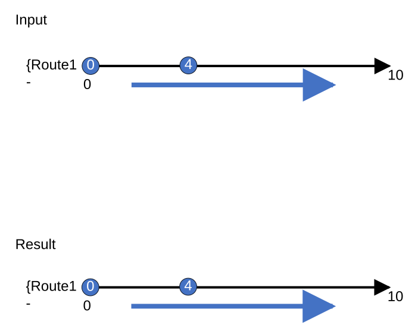

### Slide 12 — Positive 2: Simple input route is the dominant route over the only one time slice. Add the event on this route. <!-- slide 12 -->

| EventID | RID | Measure | ToMeasure | FromDate | ToDate |
| --- | --- | --- | --- | --- | --- |
| Point1 | {Route1- | 0 |  | 2000 | 2020 |
| Point2 | {Route1- | 4 |  | 2000 | null |
| Line1 | {Route1- | 2 | 8 | 2000 | null |

| EventID | RID | Measure | ToMeasure | FromDate | ToDate |
| --- | --- | --- | --- | --- | --- |
| Point1 | {Route1- | 0 |  | 2000 | 2020 |
| Point2 | {Route1- | 4 |  | 2000 | null |
| Line1 | {Route1- | 2 | 8 | 2000 | null |

[figure: Input · Result · {Route1- · 0 · 10 · 4 · {Route2- · 5]

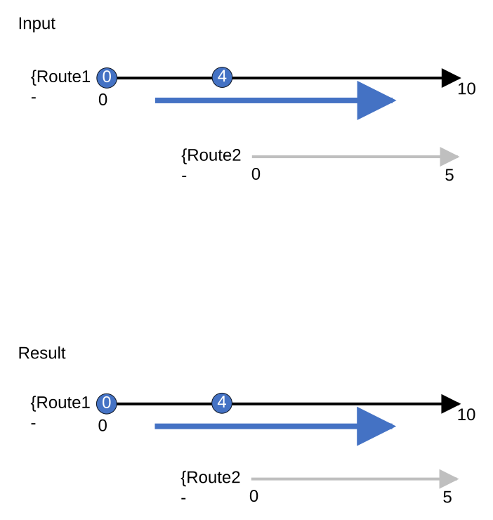

### Slide 13 — Positive 3: Simple input route is neither the most dominant nor the most subordinate. Add the event on dominant routes <!-- slide 13 -->

| EventID | RID | Measure | ToMeasure | FromDate | ToDate |
| --- | --- | --- | --- | --- | --- |
| Point1 | {Route2- | 0 |  | 2000 | 2020 |
| Point2 | {Route2- | 4 |  | 2000 | null |
| Point3 | {Route2- | 8 |  | 2000 | null |
| Line1 | {Route2- | 0 | 10 | 2000 | null |

| EventID | RID | Measure | ToMeasure | FromDate | ToDate |
| --- | --- | --- | --- | --- | --- |
| Point1 | {Route2- | 0 |  | 2000 | 2020 |
| Point2 | {Route2- | 4 |  | 2000 | null |
| Point3 | {Route1- | 29 |  | 2000 | null |
| Line1 | {Route2- | 0 | 5 | 2000 | null |
| Line1 | {Route1- | 23 | 33 | 2000 | null |

This line event does not break into 3 segments

[figure: Input · Result · {Route2- · 0 · 10 · 4 · {Route3- · 30 · 32.5 · 8 · {Route4- · {Route1- · 40 · 42.5 · 23 · 33 · 29]

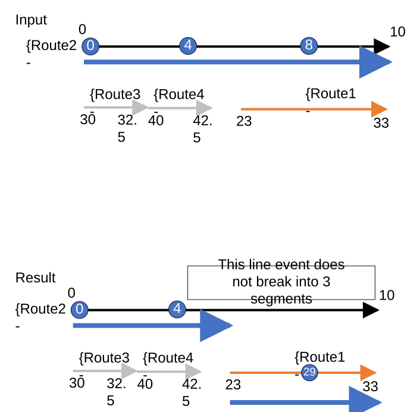

### Slide 14 <!-- slide 14 -->

Positive 4: Gapped input route is the subordinate route over all time slices. Add the event on dominant route and convert measures

| EventID | RID | Measure | ToMeasure | FromDate | ToDate |
| --- | --- | --- | --- | --- | --- |
| Point1 | {Route2- | 2 |  | 2000 | 2020 |
| Point2 | {Route2- | 3 |  | 2000 | null |
| Line1 | {Route2- | 0 | 10 | 2000 | null |

| EventID | RID | Measure | ToMeasure | FromDate | ToDate |
| --- | --- | --- | --- | --- | --- |
| Point1 | {Route1- | 1 |  | 2000 | 2010 |
| Point1 | {Route1- | 11 |  | 2010 | 2020 |
| Point2 | {Route2- | 3 |  | 2000 | null |
| Line1 | {Route2- | 0 | 1 | 2000 | null |
| Line1 | {Route1- | 0 | 1 | 2000 | 2010 |
| Line1 | {Route1- | 10 | 11 | 2010 | 2020 |
| Line1 | {Route2- | 3 | 4.5 | 2000 | null |
| Line1 | {Route1- | 3.5 | 4.5 | 2000 | 2010 |
| Line1 | {Route1- | 13.5 | 14.5 | 2010 | 2020 |
| Line1 | {Route1- | 5 | 7 | 2000 | 2010 |
| Line1 | {Route1- | 15 | 17 | 2010 | 2020 |

[figure: {Route1- 2000-2010 · {Route2- · Input · Result · 0 · 1 · 3.5 · 7 · 2 · 10 · 6 · 3 · {Route1- 2010-null · 11 · 13.5 · 17]

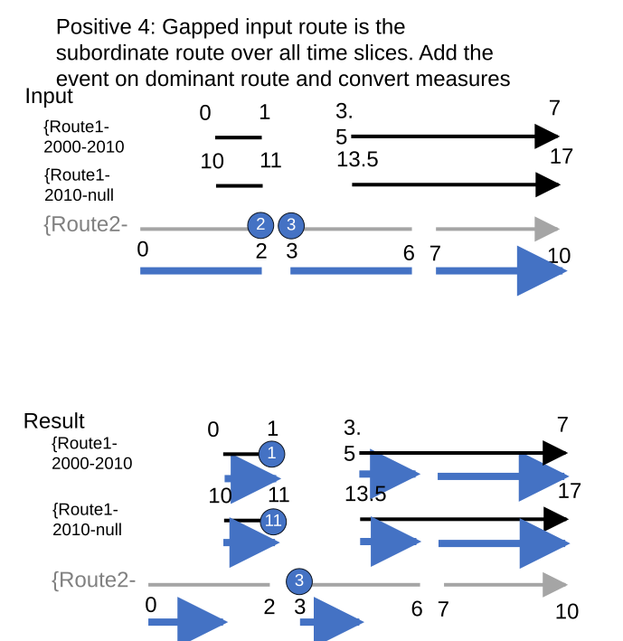

### Slide 15 <!-- slide 15 -->

Positive 5: Looped input route has different concurrencies over time. Add the event to dominant route in each time slice and convert measures.

| EventID | RID | Measure | ToMeasure | FromDate | ToDate |
| --- | --- | --- | --- | --- | --- |
| Point1 | {Route3- | 0 |  | 2000 | 2020 |
| Point2 | {Route3- | 8 |  | 2000 | null |
| Point3 | {Route3- | 2 |  | 2000 | null |
| Point4 | {Route3- | 6 |  | 2000 | null |
| Line1 | {Route3- | 0 | 8 | 2000 | null |

| EventID | RID | Measure | ToMeasure | FromDate | ToDate |
| --- | --- | --- | --- | --- | --- |
| Point1 | {Route2- | 1 |  | 2000 | 2010 |
| Point1 | {Route1- | Prefer 4 (0 &12 also fine) |  | 2010 | 2020 |
| Point2 | {Route2- | 1 (the only option) |  | 2000 | 2010 |
| Point2 | {Route1- | Prefer12 (0 &4 also fine) |  | 2010 | null |
| Point3 | {Route2- | 3 |  | 2000 | 2010 |
| Point3 | {Route1- | 6 |  | 2010 | null |
| Point4 | {Route3- | 6 |  | 2000 | 2010 |
| Point4 | {Route1- | 10 |  | 2010 | null |
| Line1 | {Route3- | 4 | 8 | 2000 | 2010 |
| Line1 | {Route2- | 1 | 5 | 2000 | 2010 |
| Line1 | {Route1- | 4 (can’t be 0 or 12) | 12 (can’t be 0 or 4) | 2010 | null |

[figure: 0 · 2 · 10 · 6 · 4 · 8 · 1 · 3 · 5 · 12 · Input · {Route3- 2000-null · {Route1- 2010-null · {Route2- 2000-null · Result]

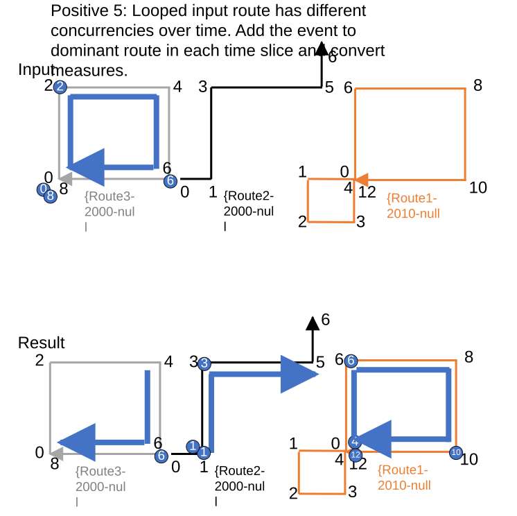

### Slide 16 <!-- slide 16 -->

Positive 6: Input route is the subordinate route over all time slices. Dominant route is a lollipop. Add the event on dominant route and convert measures.

| EventID | RID | Measure | ToMeasure | FromDate | ToDate |
| --- | --- | --- | --- | --- | --- |
| Point1 | {Route3- | 0 |  | 2000 | 2020 |
| Point2 | {Route3- | 4 |  | 2000 | null |
| Point3 | {Route2- | 9 |  | 2000 | null |
| Line1 | {Route3- | 0 | 6 | 2000 | null |
| Line2 | {Route2- | 0 | 9 | 2000 | null |

| EventID | RID | Measure | ToMeasure | FromDate | ToDate |
| --- | --- | --- | --- | --- | --- |
| Point1 | {Route1- | 6 |  | 2000 | 2020 |
| Point2 | {Route1- | 2 or 14, no preference |  | 2000 | null |
| Point3 | {Route1- | Prefer 14, 2 is fine |  | 2000 | null |
| Line1 | {Route1- | 2 | 6 | 2000 | null |
| Line1 | {Route1- | 12 | 14 | 2000 | null |
| Line2 | {Route1- | 3 | 4 | 2000 | null |
| Line2 | {Route1- | 6 | 14 | 2000 | null |

[figure: 0 · 2 · 10 · 6 · 9 · 1 · 4 · 7 · 12 · {Route3- · {Route1- · {Route2- · 5 · 14 · Input · Result]

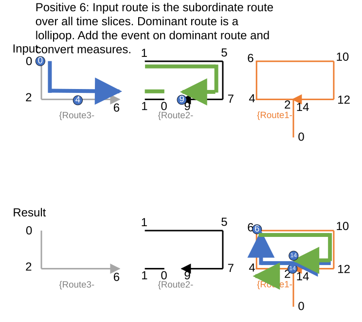

### Slide 17 <!-- slide 17 -->

Positive 7: Branched input route has different concurrencies over time. The target dominant routes are also complex shapes. Add the event to dominant route in each time slice and convert measures.

| EventID | RID | Measure | ToMeasure | FromDate | ToDate |
| --- | --- | --- | --- | --- | --- |
| Point1 | {Route3- | 0 |  | 2000 | null |
| Point2 | {Route3- | 2 |  | 2000 | 2010 |
| Point3 | {Route2- | 6 |  | 2000 | null |
| Line1 | {Route3- | 0 | 6 | 2000 | null |
| Line2 | {Route2- | 4 | 6 | 2035 | null |

| EventID | RID | Measure | ToMeasure | FromDate | ToDate |
| --- | --- | --- | --- | --- | --- |
| Point1 | {Route3- | 0 |  | 2000 | null |
| Point2 | {Route2- | 14 |  | 2000 | 2010 |
| Point3 | {Route2- | 10 or 30, no preference |  | 2000 | 2020 |
| Point3 | {Route3- | 6 |  | 2020 | 2030 |
| Point3 | {Route1- | 100 |  | 2030 | null |
| Line1 | {Route3- | 0 | 4 | 2000 | 2020 |
| Line1 | {Route2- | 10 | 14 | 2000 | 2020 |
| Line1 | {Route3- | 0 | 6 | 2020 | 2030 |
| Line1 | {Route3- | 0 | 1 | 2030 | null |
| Line1 | {Route3- | 2 | 4 | 2030 | null |
| Line1 | {Route1- | 100 | 103 | 2030 | null |
| Line2 | {Route1- | 100 | 102 | 2035 | null |

Merge into 1 or not?
Test what happens in add event in the same scenario and do the same

[figure: 2 · {Route3- 2000-null · {Route2- 2000-2020 · 0 · 100 · 6 · 10 · 4 · 20 · 14 · {Route1- 2030-null · 24 · 30 · 102 · 103 · Input · Result · 2000-2020 · 2020-2030 · 2030-null · 2035-null]

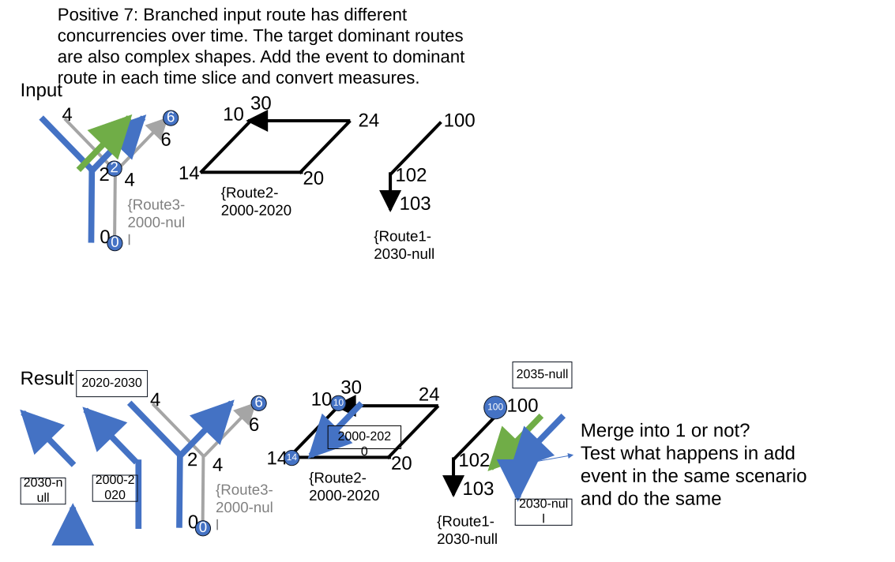

### Slide 18 <!-- slide 18 -->

Positive 8: Alpha input route is the subordinate route over the only one time slice. Add the event on the dominant, 3D alpha route.

| EventID | RID | Measure | ToMeasure | FromDate | ToDate |
| --- | --- | --- | --- | --- | --- |
| Point1 | {Route2- | 1 |  | 2000 | 2020 |
| Point2 | {Route2- | 2 |  | 2000 | null |
| Point3 | {Route2- | 8 |  | 2000 | null |
| Line1 | {Route2- | 0 | 16 | 2000 | null |
| Line2 | {Route1- | 0 | 9 | 2010 | 2020 |

| EventID | RID | Measure | ToMeasure | FromDate | ToDate |
| --- | --- | --- | --- | --- | --- |
| Point1 | {Route2- | 1 |  | 2000 | 2020 |
| Point2 | {Route1- | 3 or 15, no preference |  | 2000 | null |
| Point3 | {Route1- | 9 |  | 2000 | null |
| Line1 | {Route2- | 0 | 2 | 2000 | null |
| Line1 | {Route1- | 3 | 15 | 2000 | null |
| Line1 | {Route2- | 14 | 16 | 2000 | null |
| Line2 | {Route1- | 0 | 9 | 2010 | 2020 |

[figure: 0 · 3 · 8 · {Route2- · {Route1- · 16 · 5 · 11 · 17 · 6 · 9 · 12 · 15 · 2 · 14 · 1 · Input · Result]

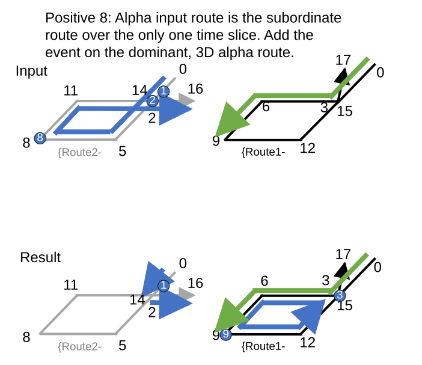

### Slide 19 — Spanning Positive 1: Simple input routes have no concurrency. Add the event on these routes. <!-- slide 19 -->

| EventID | From RID | From M | To RID | To M | FromDate | ToDate |
| --- | --- | --- | --- | --- | --- | --- |
| Line1 | {Route1- | 0 | {Route2- | 100 | 2000 | null |

| EventID | From RID | From M | To RID | To M | FromDate | ToDate |
| --- | --- | --- | --- | --- | --- | --- |
| Line1 | {Route1- | 0 | {Route2- | 100 | 2000 | null |

[figure: Input · Result · {Route1- · 0 · 100 · {Route2- · L1 · 50]

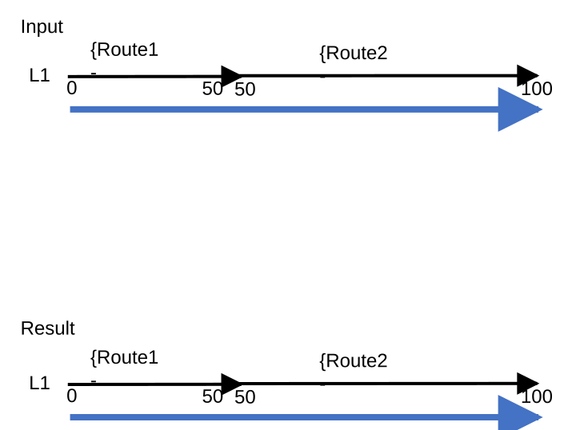

### Slide 20 — Spanning Positive 2: Simple input routes are the dominant route over the only one time slice. Add the event on these <!-- slide 20 -->

| EventID | From RID | From M | To RID | To M | FromDate | ToDate |
| --- | --- | --- | --- | --- | --- | --- |
| Line1 | {Route1- | 0 | {Route2- | 100 | 2000 | null |

| EventID | From RID | From M | To RID | To M | FromDate | ToDate |
| --- | --- | --- | --- | --- | --- | --- |
| Line1 | {Route1- | 0 | {Route2- | 100 | 2000 | null |

[figure: Input · {Route3- · {Route1- · 0 · 100 · {Route2- · L1 · 50 · L2 · 200 · Result]

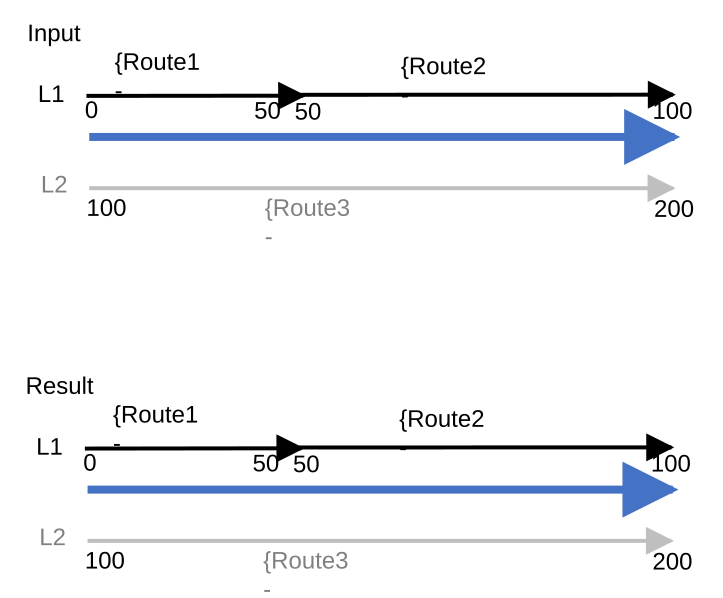

### Slide 21 — Spanning Positive 3: Simple input routes are the subordinate route over all time slices. Add the event on dominant <!-- slide 21 -->

| EventID | From RID | From M | To RID | To M | FromDate | ToDate |
| --- | --- | --- | --- | --- | --- | --- |
| Line1 | {Route5- | 100 | {Route6- | 200 | 2000 | null |

| EventID | From RID | From M | To RID | To M | FromDate | ToDate |
| --- | --- | --- | --- | --- | --- | --- |
| Line1 | {Route5- | 150 | {Route6- | 200 | 2000 | 2020 |
| Line1 | {Route3- | 0 | {Route3- | 50 | 2000 | 2020 |
| Line1 | {Route3- | 0 | {Route3- | 30 | 2020 | null |
| Line1 | {Route4- | 80 | {Route4- | 100 | 2020 | null |
| Line1 | {Route1- | 0 | {Route2- | 80 | 2020 | null |

[figure: Input · {Route5- 2000-null · {Route3- 2000-null · 0 · 100 · L1 · 50 · L2 · 200 · Result (2000-2020) · {Route1- 2020-null · L3 · 20 · 80 · {Route4- 2020-null · {Route2- 2020-null · {Route6- 2000-null · 160 · Result (2020-null)]

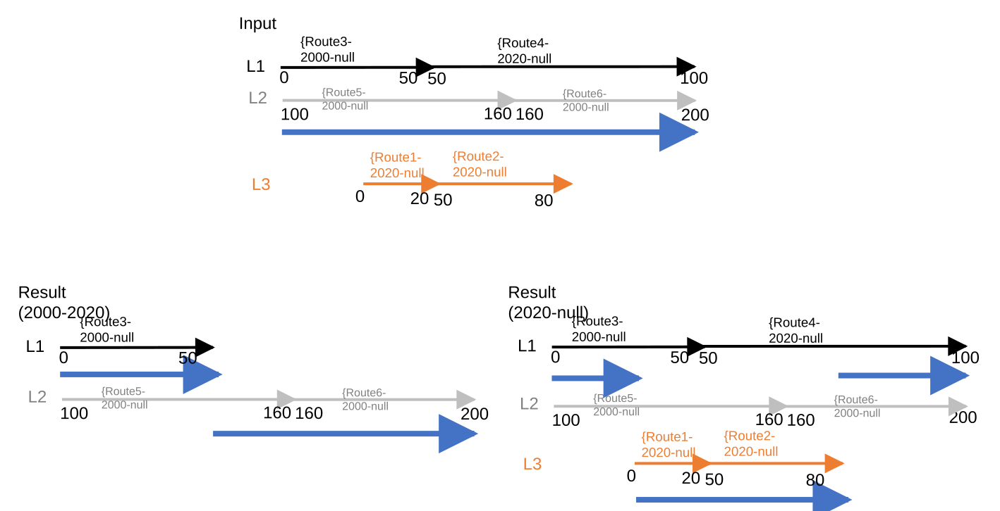

### Slide 22 — Spanning Positive 4: Simple input routes have different concurrencies over time. The dominant routes are looped route, <!-- slide 22 -->

| EventID | From RID | From M | To RID | To M | FromDate | ToDate |
| --- | --- | --- | --- | --- | --- | --- |
| Line1 | {Route6- | 100 | {Route7- | 200 | 2000 | null |

[figure: Input · {Route6- 2000-null · {Route5- 2000-null · L4 · 100 · 200 · {Route1- 2030-null · L2 · {Route2- 2020-null · {Route7- 2000-null · 160 · L3 · 0 · 40 · 10 · 50 · 30 · 70 · 80 · 140 · 188 · 333.3 · 20 · {Route3- 2020-null · …]

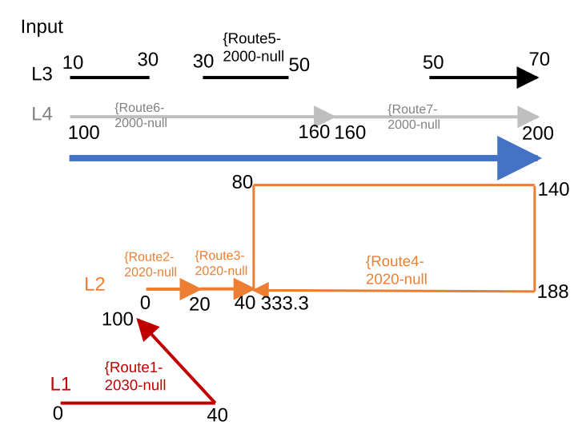

### Slide 23 — Spanning Positive 4: Simple input routes have different concurrencies over time. The dominant routes are looped route, <!-- slide 23 -->

| EventID | From RID | From M | To RID | To M | FromDate | ToDate |
| --- | --- | --- | --- | --- | --- | --- |
| Line1 | {Route6- | 120 | {Route6- | 130 | 2000 | 2020 |
| Line1 | {Route6- | 150 | {Route7- | 180 | 2000 | 2020 |
| Line1 | {Route5- | 10 | {Route5- | 70 | 2000 | 2020 |
| Line1 | {Route5- | 10 | {Route5- | 30 | 2020 | 2030 |
| Line1 | {Route2- | 0 | {Route3- | 40 | 2020 | 2030 |
| Line1 | {Route4- | 188 | {Route4- | 333.3 | 2020 | 2030 |
| Line1 | {Route1- | 0 | {Route1- | 40 | 2030 | null |
| Line1 | {Route3- | 30 | {Route3- | 40 | 2030 | null |
| Line1 | {Route4- | 188 | {Route4- | 333.3 | 2030 | null |

[figure: {Route6- 2000-null · {Route5- 2000-null · L4 · 100 · 200 · L2 · {Route2- 2020-null · {Route7- 2000-null · 160 · L3 · 0 · 40 · 10 · 50 · 30 · 70 · 80 · 140 · 188 · 333.3 · 20 · {Route3- 2020-null · {Route4- 2020-null · Result (2000-2020) · …]

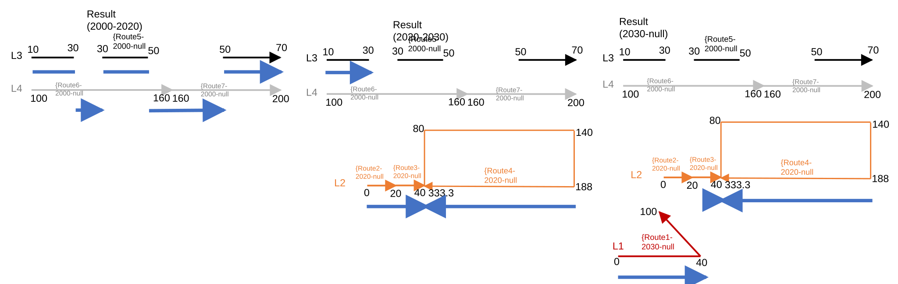

### Slide 24 — Spanning Positive 5: Lines have many routes, some in opposite direction. <!-- slide 24 -->

| EventID | From RID | From M | To RID | To M | FromDate | ToDate |
| --- | --- | --- | --- | --- | --- | --- |
| Line1 | L3R1 | 100 | L3R6 | 100 | 2000 | null |
| Line2 | L2R4 | -15 | L2R3 | 100 | 2000 | null |

| EventID | From RID | From M | To RID | To M | FromDate | ToDate |
| --- | --- | --- | --- | --- | --- | --- |
| Line1 | L1R1 | 100 | L1R4 | 60 | 2000 | null |
| Line2 | L1R1 | ~115 | L1R2 | ~80 | 2000 | null |

[figure: 24 · Input · R1 · 100 · L2 · 200 · 50 · L3 · L1 · 160 · 0 · 36.52 · 88 · 150 · 60 · -30 · Result · R6 · R4 · R2 · R3 · R5]

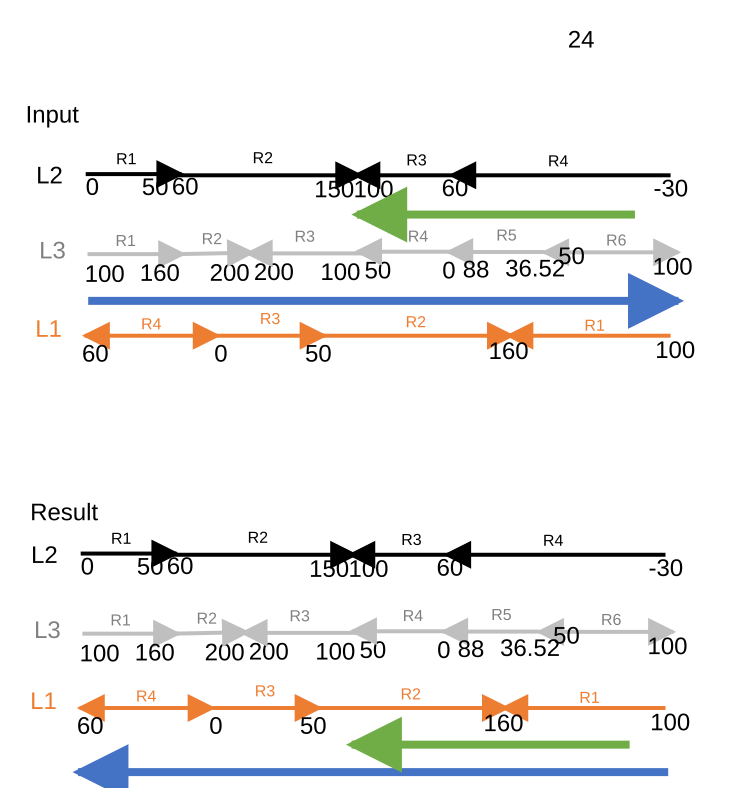

### Slide 25 — Point Positive 9 & Spanning Positive 6: Both input and concurrent routes are not calibrated. Add the event to input <!-- slide 25 -->

| EventID | From RID | From M | To RID | To M | FromDate | ToDate |
| --- | --- | --- | --- | --- | --- | --- |
| Point1 | {Route5- | 50 |  |  | 2000 | null |
| Point2 | {Route5- | 100 |  |  | 2000 | null |
| Point3 | {Route6- | 200 |  |  | 2000 | null |
| Line1 | {Route5- | 100 | {Route6- | 200 | 2000 | null |

Result after generating events

| EventID | From RID | From M | To RID | To M | FromDate | ToDate | LocError |
| --- | --- | --- | --- | --- | --- | --- | --- |
| Point1 | {Route5- | 50 |  |  | 2000 | null | something |
| Point2 | {Route5- | 100 |  |  | 2000 | null | something |
| Point3 | {Route6- | 200 |  |  | 2000 | null | something |
| Line1 | {Route5- | 100 | {Route6- | 200 | 2000 | null | something |

[figure: Input · {Route5- 2000-null · {Route3- 2000-null · L1 · L2 · {Route4- 2020-null · {Route6- 2000-null · 50 · 100 · 200]

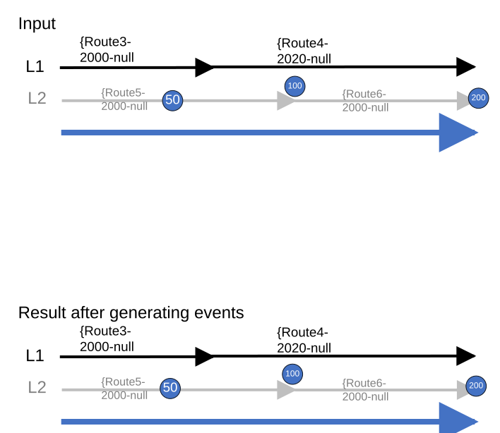

### Slide 26 — Conflict Prevention 1 - negative: Add point event. Input route is the target route and it is locked – do not append <!-- slide 26 -->

| EventID | RID | Measure | ToMeasure | FromDate | ToDate |
| --- | --- | --- | --- | --- | --- |
| Point1 | {Route1- | 4 |  | 2000 | null |

[figure: Input · Result · {Route1- · 0 · 10 · 4]

### Slide 27 <!-- slide 27 -->

| EventID | RID | Measure | ToMeasure | FromDate | ToDate |
| --- | --- | --- | --- | --- | --- |
| Point1 | {Route3- | 0 |  | 2000 | 2020 |
| Point2 | {Route3- | 4 |  | 2000 | null |
| Point3 | {Route2- | 9 |  | 2000 | null |
| Line1 | {Route3- | 0 | 6 | 2000 | null |
| Line2 | {Route2- | 0 | 9 | 2000 | null |

| EventID | RID | Measure | ToMeasure | FromDate | ToDate |
| --- | --- | --- | --- | --- | --- |
| Point1 | {Route1- | 6 |  | 2000 | 2020 |
| Point2 | {Route1- | 2 or 14, no preference |  | 2000 | null |
| Point3 | {Route1- | Prefer 14, 2 is fine |  | 2000 | null |
| Line1 | {Route1- | 2 | 6 | 2000 | null |
| Line1 | {Route1- | 12 | 14 | 2000 | null |
| Line2 | {Route1- | 3 | 4 | 2000 | null |
| Line2 | {Route1- | 6 | 14 | 2000 | null |

Conflict Prevention 2: Add line event. Input route is not target route. Input route is locked and target route is not locked – append successfully.

[figure: 0 · 2 · 10 · 6 · 9 · 1 · 4 · 7 · 12 · {Route3- · {Route1- · {Route2- · 5 · 14 · Input · Result]

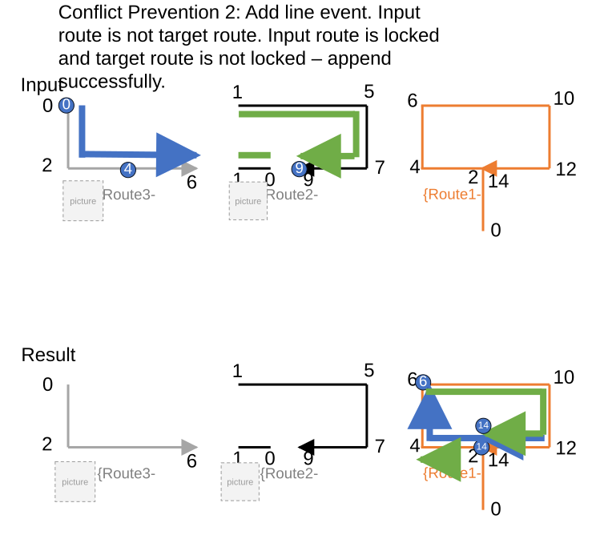

### Slide 28 — Conflict Prevention 3 – negative: Add line event. Event is going to split to append on different routes, some or all of <!-- slide 28 -->

[figure: Input · {Route6- 2000-null · {Route5- 2000-null · L4 · 100 · 200 · {Route1- 2030-null · L2 · {Route2- 2020-null · {Route7- 2000-null · 160 · L3 · 0 · 40 · 10 · 50 · 30 · 70 · 80 · 140 · 188 · 333.3 · 20 · {Route3- 2020-null · …]

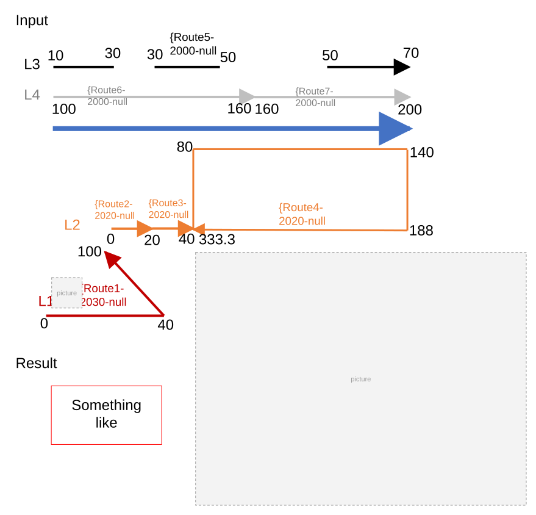
