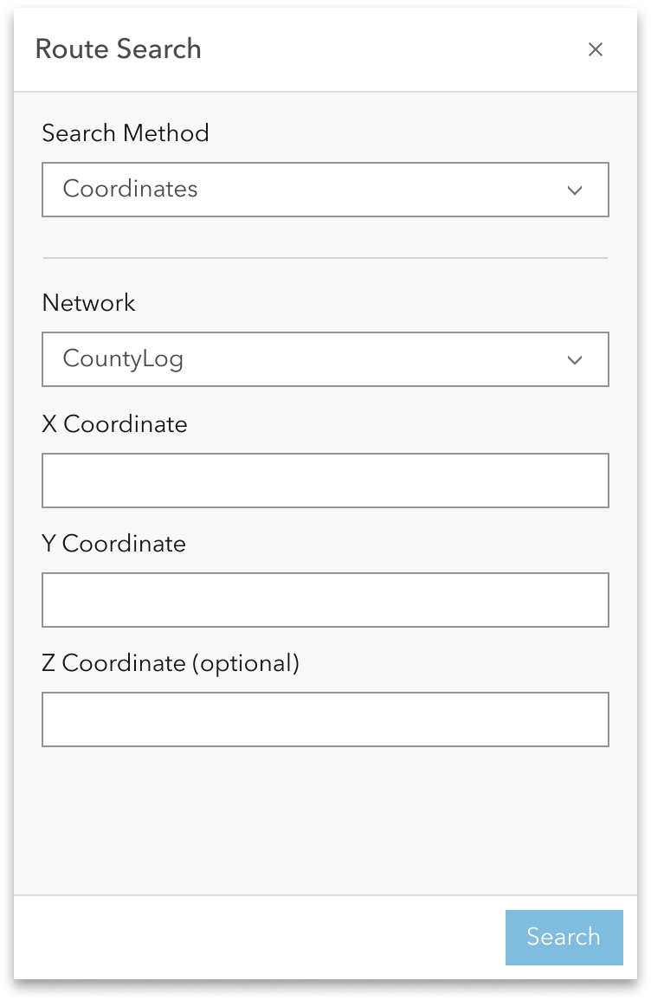
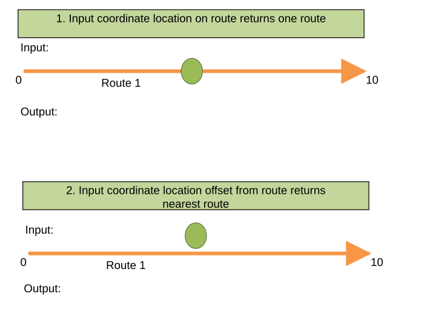
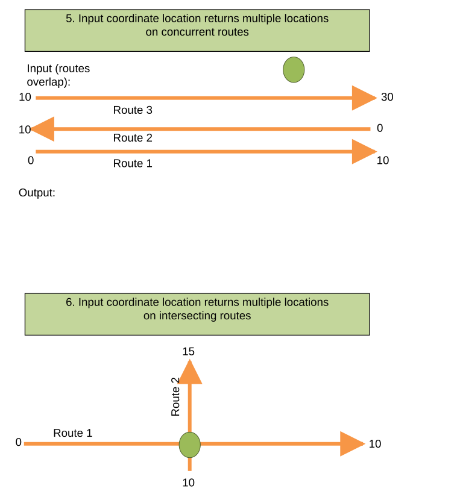
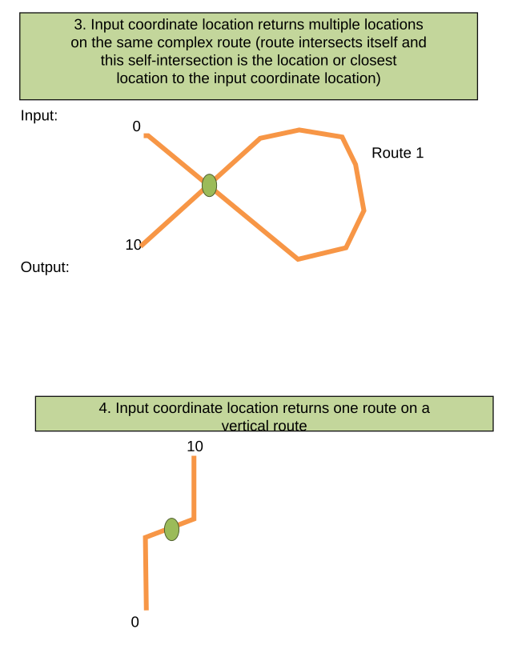
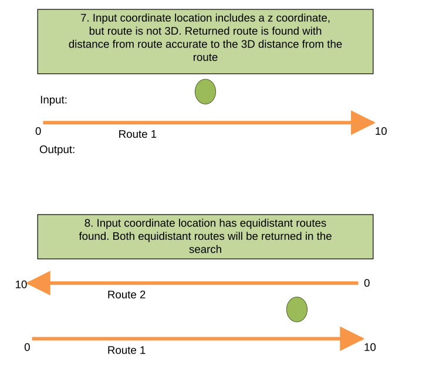
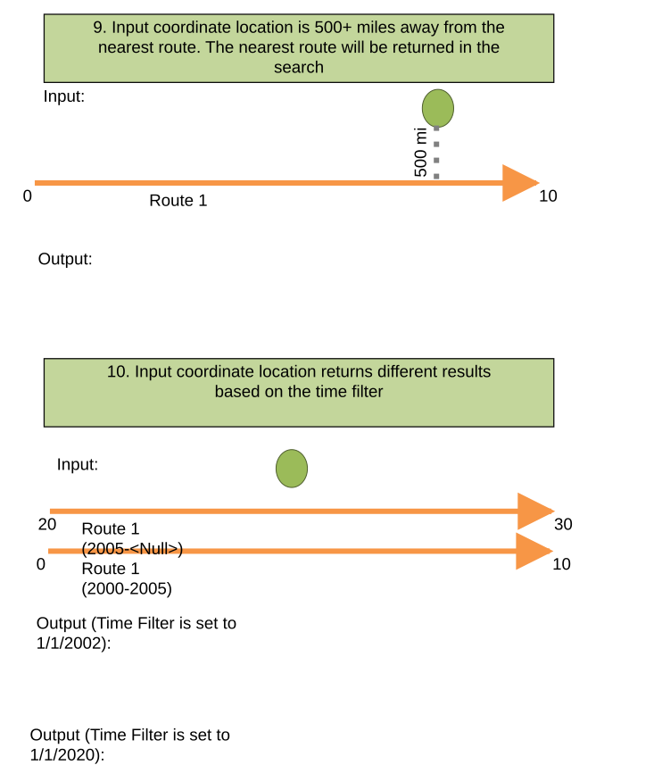

# Search by Coordinate Method in Route Search Widget Test Plan

| Field | Value |
| --- | --- |
| **Doc** | 458 · Test Plan · Experience Builder |
| **Product** | — |
| **Release** | — |
| **Issues** | [Beijing-R-D-Center/ExperienceBuilder-Web-Extensions#16322](https://devtopia.esri.com/Beijing-R-D-Center/ExperienceBuilder-Web-Extensions/issues/16322) |
| **Source** | [16322-SearchbyCoordinate_TestPlanV3.pptx](<https://esriis.sharepoint.com/sites/LocationReferencing/Shared%20Documents/General/Test%20Plans/16322-SearchbyCoordinate_TestPlanV3.pptx>) · rev V3 |
| **People** | author Mac Christmas · PE — · dev — |
| **Edited** | 2023-11-27 22:31 by Mac Christmas |
| **Extracted** | 2026-09-04 · lane xmlstrip · format 3.0 · prompt v2.0.2 |
| **Keywords** | route search · coordinate input · search method · results pane · spatial reference · route concurrency · time filter |
| **Tools** | Route Search widget |

## Summary

Test plan for the Search by Coordinate method added to the Route Search widget. It covers configuration, UI behavior, input validation, and results handling for coordinate-based route searches across various network types, spatial references, and route complexities. The plan includes positive and negative test cases verifying correct route and measure returns based on coordinate inputs and time filters.

## Related documents

<!-- related:begin -->
- [Search by Coordinate Experience Builder widget](<https://esriis.sharepoint.com/sites/lrsworkspace/LRS Doc Index/User Stories/search-by-coordinate-exb-widget.md>) — similar text 0.29 · 3 title words · 2 filename words · same surface <!-- rel:487 s=4.828 -->
- [ExB Search By Referent – Test Plan](<https://esriis.sharepoint.com/sites/lrsworkspace/LRS Doc Index/Test Plans/16462-exb-search-by-referent.md>) — similar text 0.20 · 1 title word · 1 filename word · same kind/surface/folder <!-- rel:456 s=3.896 -->
- [Coordinates Method in Add Point and Add Line Widgets Test Plan](<https://esriis.sharepoint.com/sites/lrsworkspace/LRS Doc Index/Test Plans/24791-coordinates-method-in-add-point-and-add-line-widgets.md>) — similar text 0.18 · 1 title word · same kind/surface/folder <!-- rel:49 s=3.353 -->
- [Search by Station Experience Builder widget User Story](<https://esriis.sharepoint.com/sites/lrsworkspace/LRS%20Doc%20Index/User%20Stories/search-by-station-exb-widget.md>) — similar text 0.17 · 2 title words · 1 filename word · same surface <!-- rel:490 s=3.142 -->
- [LRS Identify: Show Coordinates in Results Experience Builder Widget Test Plan](<https://esriis.sharepoint.com/sites/lrsworkspace/LRS%20Doc%20Index/Test%20Plans/26618-lrs-identify-show-coordinates-in-results-exb-widget.md>) — similar text 0.24 · 1 title word · same kind/surface/folder <!-- rel:859 s=3.061 -->
<!-- related:end -->

<!-- docs:begin -->
## Esri documentation

[Set a time filter](https://doc.esri.com/en/arcgis-pro/latest/help/production/location-referencing-pipelines/set-a-time-filter.html)

_No page matched:_ [Route Search widget](https://www.google.com/search?q=%22Route%20Search%20widget%22+site%3Adoc.esri.com)
<!-- docs:end -->

---

## Overview

### Slide 1 — Devtopia Issue <!-- slide 1 -->

Search by Coordinate Method in Route Search Widget

**Notes**
- Add Coordinates method to Route Search widget
- Test with line and non-line networks, including PoM
- Test with auto-generated, single-field, and multi-field RouteID configurations
- Test with RouteName vs. RouteID configured
- Test on simple and complex route shapes
- Test with projected and unprojected data
- Test on a variety of spatial references
- Test coordinate inputs both on a route and close to a route
- Test input coordinates on intersections and concurrencies of routes in the same network
- Test with different themes
- Test with custom coordinate system
- Configuration of widget should be similar to Route and Measure search method
- X and Y must be provided, Z is optional
- Test in Chrome and Edge (other browsers will be covered in automation)
- Test I18n and accessibility
- Test with Web, Tablet, and Mobile configurations

## Test Cases

### TC-P01 — Coordinates appears in the Search Method parameter and can be chosen <!-- src: S4 · slide 2 · Positive Tests: Configuration · 1 -->

- **Group:** Configuration

### TC-P02 — Route and Measure is still the default Search Method <!-- src: S4 · slide 2 · Positive Tests: Configuration · 2 -->

- **Group:** Configuration

### TC-P03 — Spatial Reference defaults to Web Map’s spatial reference. <!-- src: S4 · slide 2 · Positive Tests: Configuration · 3 -->

- **Group:** Configuration

### TC-P04 — Spatial reference of actual LRS Network feature class in the EGDB can be chosen <!-- src: S4 · slide 2 · Positive Tests: Configuration · 4 -->

- **Group:** Configuration
- **Case:** Spatial reference of actual LRS Network feature class in the EGDB can be chosen for the Spatial Reference configuration parameter

### TC-P05 — User can choose between only the LRS spatial reference and the Web Map spatial <!-- src: S4 · slide 2 · Positive Tests: Configuration · 5 -->

- **Group:** Configuration
- **Case:** User can choose between only the LRS spatial reference and the Web Map spatial reference

### TC-P06 — User can change Search Method to Coordinates <!-- src: S4 · slide 2 · Positive Tests: UI · 1 -->

- **Group:** UI

### TC-P07 — Upon opening the Route Search widget <!-- src: S4 · slide 2 · Positive Tests: UI · 2 -->

- **Group:** UI
- **Case:** Upon opening the Route Search widget, Coordinates is chosen as the Search Method when it is chosen as the default Search Method

### TC-P08 — User can change the network to other valid LRS networks imported from the Web <!-- src: S4 · slide 2 · Positive Tests: UI · 3 -->

- **Group:** UI
- **Case:** User can change the network to other valid LRS networks imported from the Web Map

### TC-P09 — Specified network is chosen by default when configured to be chosen as <!-- src: S4 · slide 2 · Positive Tests: UI · 4 -->

- **Group:** UI
- **Case:** Specified network is chosen by default when configured to be chosen as the default network

### TC-N01 — Coordinates Search Method is not enabled/configured and is unavailable <!-- src: S4 · slide 2 · Negative Tests: UI · 1 -->

- **Group:** UI

### TC-N02 — Invalid X Coordinate input (must be a number) <!-- src: S4 · slide 2 · Negative Tests: UI · 2 -->

- **Group:** UI

### TC-N03 — Input X Coordinate is out of the range of the spatial reference (example <!-- src: S4 · slide 2 · Negative Tests: UI · 3 -->

- **Group:** UI
- **Case:** Input X Coordinate is out of the range of the spatial reference (example: input is )

### TC-N04 — Invalid Y Coordinate input (must be a number) <!-- src: S4 · slide 2 · Negative Tests: UI · 4 -->

- **Group:** UI

### TC-N05 — Input Y Coordinate is out of the range of the spatial reference (example <!-- src: S4 · slide 2 · Negative Tests: UI · 5 -->

- **Group:** UI
- **Case:** Input Y Coordinate is out of the range of the spatial reference (example: input is )

### TC-N06 — Invalid Z coordinate input (must be a number) <!-- src: S4 · slide 2 · Negative Tests: UI · 6 -->

- **Group:** UI

### TC-N07 — Input Z Coordinate is out of the range of the spatial reference (example <!-- src: S4 · slide 2 · Negative Tests: UI · 7 -->

- **Group:** UI
- **Case:** Input Z Coordinate is out of the range of the spatial reference (example: input is )

### TC-N08 — No coordinates provided <!-- src: S4 · slide 2 · Negative Tests: UI · 8 -->

- **Group:** UI
- **Case:** No coordinates provided (X and Y Coordinate must be input before tool can be ran)

### TC-N09 — LRS Network feature class has no features <!-- src: S4 · slide 2 · Negative Tests: UI · 9 -->

- **Group:** UI

### TC-P10 — Transition the widget to a results pane after clicking Search <!-- src: S4 · slide 2 · Positive Tests: Results Pane · 1 -->

- **Group:** Results Pane

### TC-P11 — If multiple results are returned, a scroll bar will appear in the results pane <!-- src: S4 · slide 2 · Positive Tests: Results Pane · 2 -->

- **Group:** Results Pane

### TC-P12 — The configured number of results returned per page is the same as <!-- src: S4 · slide 2 · Positive Tests: Results Pane · 3 -->

- **Group:** Results Pane
- **Case:** The configured number of results returned per page is the same as the configuration setting

### TC-P13 — Return a list of all the route(s) and measure(s) found at the input coordinate <!-- src: S4 · slide 2 · Positive Tests: Results Pane · 4 -->

- **Group:** Results Pane
- **Case:** Return a list of all the route(s) and measure(s) found at the input coordinate location in the Results pane

### TC-P14 — If no routes or measures are found at the exact location of the input <!-- src: S4 · slide 2 · Positive Tests: Results Pane · 5 -->

- **Group:** Results Pane
- **Case:** If no routes or measures are found at the exact location of the input coordinates, return the closest route(s) and measure(s) and the distance from the input coordinate location

### TC-P15 — Input coordinate location on route returns one route (1) <!-- src: S4 · slide 3 · Positive Tests · 1 -->

### TC-P16 — Input coordinate location offset from route returns nearest route <!-- src: S4 · slide 3 · Positive Tests · 2 -->

### TC-P17 — Input coordinate location returns multiple locations on the same complex route <!-- src: S4 · slide 3 · Positive Tests · 3 -->

- **Case:** Input coordinate location returns multiple locations on the same complex route (route intersects itself and this self-intersection is the location or closest location to the input coordinate location)

### TC-P18 — Input coordinate location returns one route on a vertical route <!-- src: S4 · slide 3 · Positive Tests · 4 -->

### TC-P19 — Input coordinate location returns multiple locations on concurrent routes (1) <!-- src: S4 · slide 3 · Positive Tests · 5 -->

### TC-P20 — Input coordinate location returns multiple locations on intersecting routes <!-- src: S4 · slide 3 · Positive Tests · 6 -->

### TC-P21 — Input coordinate location includes a z coordinate <!-- src: S4 · slide 3 · Positive Tests · 7 -->

- **Case:** Input coordinate location includes a z coordinate, but route is not 3D. Returned route is found with distance from route accurate to the 3D distance from the route

### TC-P22 — Input coordinate location has equidistant routes found. Both equidistant routes <!-- src: S4 · slide 3 · Positive Tests · 8 -->

- **Case:** Input coordinate location has equidistant routes found. Both equidistant routes will be returned in the search

### TC-P23 — Input coordinate location is 500+ miles away from the nearest route. The nearest <!-- src: S4 · slide 3 · Positive Tests · 9 -->

- **Case:** Input coordinate location is 500+ miles away from the nearest route. The nearest route will be returned in the search

### TC-P24 — Input coordinate location returns different results based on the time filter <!-- src: S4 · slide 3 · Positive Tests · 10 -->

### TC-U01 — Input coordinate location on route returns one route (case 1) <!-- src: S2 · slide 4 · case 1 -->

| Route Name | From Date | To Date | Attribute1 | Attribute2 | Measure | Distance (ft) |
| --- | --- | --- | --- | --- | --- | --- |
| Route 1 | 1/1/2000 | <Null> | State | Highway | 5 | 0 |

2. Input coordinate location offset from route returns nearest route

| Route Name | From Date | To Date | Attribute1 | Attribute2 | Measure | Distance (ft) |
| --- | --- | --- | --- | --- | --- | --- |
| Route 1 | 1/1/2000 | <Null> | State | Highway | 5 | 20 |

[figure: Input: · 0 · 10 · Output: · Route 1]

### TC-U02 — Input coordinate location returns multiple locations on concurrent routes (case 5) <!-- src: S2 · slide 6 · case 5 -->

| Route Name | From Date | To Date | Attribute1 | Attribute2 | Measure | Distance (ft) |
| --- | --- | --- | --- | --- | --- | --- |
| Route 1 | 1/1/2000 | <Null> | State | Highway | 7 | 0 |
| Route 2 | 1/1/1990 | <Null> | County | Major | 3 | 0 |
| Route 3 | 1/1/2020 | <Null> | Local | Minor | 25 | 0 |

6. Input coordinate location returns multiple locations on intersecting routes

| Route Name | From Date | To Date | Attribute1 | Attribute2 | Measure | Distance (ft) |
| --- | --- | --- | --- | --- | --- | --- |
| Route 1 | 1/1/2000 | <Null> | State | Highway | 5 | 0 |
| Route 2 | 1/1/1990 | <Null> | County | Major | 11 | 0 |

[figure: Input (routes overlap): · 0 · 10 · Output: · Route 1 · Route 2 · Route 3 · 30 · 15]

## Other content

### Slide 5 <!-- slide 5 -->

3. Input coordinate location returns multiple locations on the same complex route (route intersects itself and this self-intersection is the location or closest location to the input coordinate location)

| Route Name | From Date | To Date | Attribute1 | Attribute2 | Measure | Distance (ft) |
| --- | --- | --- | --- | --- | --- | --- |
| Route 1 | 1/1/2000 | <Null> | Plastic | Low pressure | 2.5 | 0 |
| Route 1 | 1/1/2000 | <Null> | Plastic | Low pressure | 7.5 | 0 |

4. Input coordinate location returns one route on a vertical route

| Route Name | From Date | To Date | Attribute1 | Attribute2 | Measure | Distance (ft) |
| --- | --- | --- | --- | --- | --- | --- |
| Route 1 | 1/1/2000 | <Null> | Plastic | Low pressure | 5 | 0 |

[figure: Input: · 0 · 10 · Output: · Route 1]

### Slide 7 <!-- slide 7 -->

7. Input coordinate location includes a z coordinate, but route is not 3D. Returned route is found with distance from route accurate to the 3D distance from the route

| Route Name | From Date | To Date | Attribute1 | Attribute2 | Measure | Distance (ft) |
| --- | --- | --- | --- | --- | --- | --- |
| Route 1 | 1/1/2000 | <Null> | State | Highway | 5 | 15 |

8. Input coordinate location has equidistant routes found. Both equidistant routes will be returned in the search

| Route Name | From Date | To Date | Attribute1 | Attribute2 | Measure | Distance (ft) |
| --- | --- | --- | --- | --- | --- | --- |
| Route 1 | 1/1/2000 | <Null> | State | Highway | 8 | 10 |
| Route 2 | 1/1/1990 | <Null> | County | Major | 2 | 10 |

[figure: Input: · 0 · 10 · Output: · Route 1 · Route 2]

### Slide 8 <!-- slide 8 -->

9. Input coordinate location is 500+ miles away from the nearest route. The nearest route will be returned in the search

| Route Name | From Date | To Date | Attribute1 | Attribute2 | Measure | Distance (ft) |
| --- | --- | --- | --- | --- | --- | --- |
| Route 1 | 1/1/2000 | <Null> | State | Highway | 8 | 2640000 |

10. Input coordinate location returns different results based on the time filter

Route 1 (2005-<Null>)
Output (Time Filter is set to 1/1/2002):

| Route Name | From Date | To Date | Attribute1 | Attribute2 | Measure | Distance (ft) |
| --- | --- | --- | --- | --- | --- | --- |
| Route 1 | 1/1/2000 | 1/1/2005 | State | Highway | 5 | 0 |

Output (Time Filter is set to 1/1/2020):

| Route Name | From Date | To Date | Attribute1 | Attribute2 | Measure | Distance (ft) |
| --- | --- | --- | --- | --- | --- | --- |
| Route 1 | 1/1/2005 | <Null> | Federal | Interstate | 25 | 0 |

[figure: Input: · 0 · 10 · Output: · Route 1 · 500 mi · Route 1 (2000-2005) · 20 · 30]

