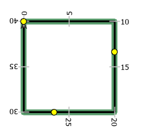
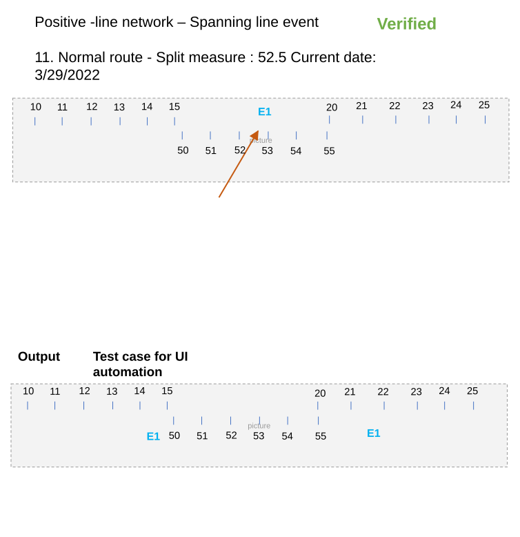
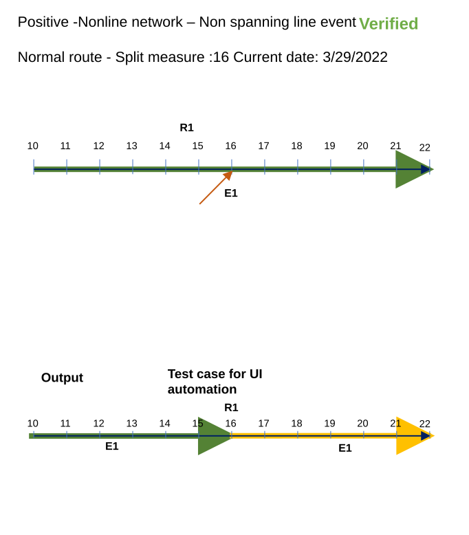

# Split Event Widget Test Plan

| Field | Value |
| --- | --- |
| **Doc** | 459 · Test Plan · Experience Builder |
| **Product** | — |
| **Release** | — |
| **Issues** | [Beijing-R-D-Center/ExperienceBuilder-Web-Extensions#16461](https://devtopia.esri.com/Beijing-R-D-Center/ExperienceBuilder-Web-Extensions/issues/16461) |
| **Source** | [16461-SplitEvent_TestPlanV1.pptx](<https://esriis.sharepoint.com/sites/LocationReferencing/Shared%20Documents/General/Test%20Plans/16461-SplitEvent_TestPlanV1.pptx>) · rev V1 |
| **People** | author Mac Christmas · PE — · dev — |
| **Edited** | 2023-11-27 18:36 by Mac Christmas |
| **Extracted** | 2026-09-04 · lane xmlstrip · format 3.0 · prompt v2.0.2 |
| **Keywords** | split event · event splitting · route · line event · spanning event · non spanning event · route id · route name · measure · event attributes · experience builder |
| **Tools** | Split Event |

## Summary

Test plan for the Split Event widget in Experience Builder covering configuration, UI, and other positive and negative test cases. Includes tests for line and non-line networks, spanning and non-spanning line events, RouteID configurations, route shapes, spatial references, themes, browsers, and device configurations. Detailed test cases from ArcGIS Pro Split Events test plan are included, demonstrating event splitting scenarios on various route types and conditions.

## Related documents

<!-- related:begin -->
- [Merge Events Widget Test Plan](<https://esriis.sharepoint.com/sites/lrsworkspace/LRS Doc Index/Test Plans/16934-merge-events-widget.md>) — similar text 0.32 · 1 title word · same kind/surface/folder <!-- rel:437 s=5.581 -->
- [Splitting Events in ArcGIS Pro - Test Plan](<https://esriis.sharepoint.com/sites/lrsworkspace/LRS Doc Index/Test Plans/3920-splitting-events-in-pro.md>) — similar text 0.71 · same kind/folder <!-- rel:491 s=4.06 -->
- [Split Event in Experience Builder](<https://esriis.sharepoint.com/sites/lrsworkspace/LRS Doc Index/User Stories/split-event-in-exb.md>) — similar text 0.27 · 2 title words · 1 filename word · same surface <!-- rel:472 s=3.578 -->
- [LRS Identify Widget Test Plan](<https://esriis.sharepoint.com/sites/lrsworkspace/LRS Doc Index/Test Plans/16568-lrs-identify-widget.md>) — similar text 0.18 · 1 title word · same kind/surface/folder <!-- rel:452 s=3.394 -->
- [Reassign - Transfer to Another Line with StayPut and Retire Event Behavior - Test Plan](<https://esriis.sharepoint.com/sites/lrsworkspace/LRS%20Doc%20Index/Test%20Plans/5140-reassign-transfer-to-another-line-with-stayput-and-retire-eb.md>) — similar text 0.15 · 1 title word · same kind/folder <!-- rel:528 s=2.735 -->
<!-- related:end -->

<!-- docs:begin -->
## Esri documentation

[Split a centerline by measure](https://doc.esri.com/en/arcgis-pro/latest/help/production/location-referencing-pipelines/split-a-centerline-by-measure.html) · [Event editing using the attribute table](https://doc.esri.com/en/arcgis-pro/latest/help/production/location-referencing-pipelines/event-editing-using-the-attribute-table.html)

_No page matched:_ [Split Event](https://www.google.com/search?q=%22Split%20Event%22+site%3Adoc.esri.com)
<!-- docs:end -->

---

## Overview

### Slide 1 — Devtopia Issue <!-- slide 1 -->

Split Event Widget

**Notes**
- Add Split Event widget to Experience Builder
- Test with line and non-line networks (excluding PoM)
- Test with spanning and non-spanning line events
- Test with auto-generated, single-field, and multi-field RouteID configurations
- Test with events with RouteName vs. RouteID configured
- Test on simple and complex route shapes
- Test with projected and unprojected data, including a variety of spatial references
- Test with different themes
- Test in Chrome and Edge (other browsers will be covered in automation)
- Test based on the Pro Split Events test plan test cases (cases are attached at end of test plan)
- Test i18m and accessibility testing
- Test in Web, Tablet, and Mobile configurations

### Slide 2 <!-- slide 2 -->

## Test Cases

### TC-P01 — A map can be chosen <!-- src: S4 · slide 3 · Positive Tests: Configuration · 1 -->

- **Group:** Configuration

### TC-P02 — If more than one map exists within the app <!-- src: S4 · slide 3 · Positive Tests: Configuration · 2 -->

- **Group:** Configuration
- **Case:** If more than one map exists within the app, list all maps in the Select a map dropdown

### TC-P03 — Line event and network layers can be imported from the map <!-- src: S4 · slide 3 · Positive Tests: Configuration · 3 -->

- **Group:** Configuration

### TC-P04 — Missing layers can be added using the New Editable Layer option <!-- src: S4 · slide 3 · Positive Tests: Configuration · 4 -->

- **Group:** Configuration

### TC-P05 — Layers can be reordered <!-- src: S4 · slide 3 · Positive Tests: Configuration · 5 -->

- **Group:** Configuration

### TC-P06 — Layers can be removed by clicking the X button <!-- src: S4 · slide 3 · Positive Tests: Configuration · 6 -->

- **Group:** Configuration

### TC-P07 — Clicking on Clear layers will remove all the imported layers <!-- src: S4 · slide 3 · Positive Tests: Configuration · 7 -->

- **Group:** Configuration

### TC-P08 — If some layers are removed <!-- src: S4 · slide 3 · Positive Tests: Configuration · 8 -->

- **Group:** Configuration
- **Case:** If some layers are removed, clicking on Load layers will only import the missing layers

### TC-P09 — Only line event layers should appear in the Event dropdown <!-- src: S4 · slide 3 · Positive Tests: Configuration · 9 -->

- **Group:** Configuration

### TC-P10 — When another web map is chosen, clear the layers from the list <!-- src: S4 · slide 3 · Positive Tests: Configuration · 10 -->

- **Group:** Configuration

### TC-P11 — A default event layer can be chosen <!-- src: S4 · slide 3 · Positive Tests: Configuration · 11 -->

- **Group:** Configuration

### TC-P12 — The event layer’s label can be edited <!-- src: S4 · slide 3 · Positive Tests: Configuration · 12 -->

- **Group:** Configuration

### TC-P13 — Attribute fields can be configured and show only business fields. No LRS <!-- src: S4 · slide 3 · Positive Tests: Configuration · 13 -->

- **Group:** Configuration
- **Case:** Attribute fields can be configured and show only business fields. No LRS or system fields should appear

### TC-P14 — Attribute fields can be selected/unselected to show in the UI <!-- src: S4 · slide 3 · Positive Tests: Configuration · 14 -->

- **Group:** Configuration

### TC-P15 — Attribute fields an be enabled/disabled for editing <!-- src: S4 · slide 3 · Positive Tests: Configuration · 15 -->

- **Group:** Configuration

### TC-P16 — Use field alias should be enabled by default <!-- src: S4 · slide 3 · Positive Tests: Configuration · 16 -->

- **Group:** Configuration

### TC-P17 — A field description can be added for each field <!-- src: S4 · slide 3 · Positive Tests: Configuration · 17 -->

- **Group:** Configuration

### TC-N01 — Show error if no LRS enabled layers in the chosen web map when attempting <!-- src: S4 · slide 3 · Negative Tests: Configuration · 1 -->

- **Group:** Configuration
- **Case:** Show error if no LRS enabled layers in the chosen web map when attempting to import layer

### TC-N02 — No line event layers are imported from the map <!-- src: S4 · slide 3 · Negative Tests: Configuration · 2 -->

- **Group:** Configuration

### TC-N03 — LRS parent network is not within the web map <!-- src: S4 · slide 3 · Negative Tests: Configuration · 3 -->

- **Group:** Configuration

### TC-N04 — Chosen web map has more than one service <!-- src: S4 · slide 3 · Negative Tests: Configuration · 4 -->

- **Group:** Configuration

### TC-P18 — Configured default event layer appears as the chosen event when the UI <!-- src: S4 · slide 3 · Positive Tests: UI · 1 -->

- **Group:** UI
- **Case:** Configured default event layer appears as the chosen event when the UI is launched

### TC-P19 — A different event layer can be chosen <!-- src: S4 · slide 3 · Positive Tests: UI · 2 -->

- **Group:** UI

### TC-P20 — The parent LRS network for the event appears in the Network dropdown <!-- src: S4 · slide 3 · Positive Tests: UI · 3 -->

- **Group:** UI

### TC-P21 — The parent LRS network updates when an event with a different parent LRS network <!-- src: S4 · slide 3 · Positive Tests: UI · 4 -->

- **Group:** UI
- **Case:** The parent LRS network updates when an event with a different parent LRS network is chosen

### TC-P22 — The Network dropdown is grayed out and cannot be changed <!-- src: S4 · slide 3 · Positive Tests: UI · 5 -->

- **Group:** UI
- **Case:** The Network dropdown is grayed out and cannot be changed (once measure translation between LRS networks is supported, this dropdown will become interactive)

### TC-P23 — Once an event is chosen <!-- src: S4 · slide 3 · Positive Tests: UI · 6 -->

- **Group:** UI
- **Case:** Once an event is chosen, update the units for the measure label based on the parent LRS network

### TC-P24 — If the selected event’s parent LRS network is configured with RouteName <!-- src: S4 · slide 3 · Positive Tests: UI · 7 -->

- **Group:** UI
- **Case:** If the selected event’s parent LRS network is configured with RouteName and the event stores the RouteName, display RouteName instead of RouteID

### TC-P25 — If the selected event’s parent LRS network is configured only with RouteID <!-- src: S4 · slide 3 · Positive Tests: UI · 8 -->

- **Group:** UI
- **Case:** If the selected event’s parent LRS network is configured only with RouteID, display RouteID

### TC-P26 — If the selected event’s parent LRS network is configured with RouteName but <!-- src: S4 · slide 3 · Positive Tests: UI · 9 -->

- **Group:** UI
- **Case:** If the selected event’s parent LRS network is configured with RouteName but the event does not store the RouteName, display RouteID

### TC-P27 — RouteName/RouteID can be typed <!-- src: S4 · slide 4 · Positive Tests: UI (Continued) · 1 -->

- **Group:** UI (Continued)

### TC-P28 — RouteName/RouteID can be selected using the Route picker <!-- src: S4 · slide 4 · Positive Tests: UI (Continued) · 2 -->

- **Group:** UI (Continued)

### TC-P29 — Multi-field RouteID networks will only show the concatenated RouteID field. <!-- src: S4 · slide 4 · Positive Tests: UI (Continued) · 3 -->

- **Group:** UI (Continued)
- **Case:** Multi-field RouteID networks will only show the concatenated RouteID field. The fields that make up the concatenated RouteID will not appear

### TC-P30 — The split location measure can be typed <!-- src: S4 · slide 4 · Positive Tests: UI (Continued) · 4 -->

- **Group:** UI (Continued)

### TC-P31 — The split location measure can be selected using the measure picker <!-- src: S4 · slide 4 · Positive Tests: UI (Continued) · 5 -->

- **Group:** UI (Continued)

### TC-P32 — If a valid event exists at the measure location, populate the EventID, measure <!-- src: S4 · slide 4 · Positive Tests: UI (Continued) · 6 -->

- **Group:** UI (Continued)
- **Case:** If a valid event exists at the measure location, populate the EventID, measure, configured business attributes, and the OID of the event at the measure location

### TC-P33 — Flash the event three times in the map <!-- src: S4 · slide 4 · Positive Tests: UI (Continued) · 7 -->

- **Group:** UI (Continued)

### TC-P34 — Provide a marker at the split location on the route <!-- src: S4 · slide 4 · Positive Tests: UI (Continued) · 8 -->

- **Group:** UI (Continued)

### TC-P35 — If more than one route exists at the location <!-- src: S4 · slide 4 · Positive Tests: UI (Continued) · 9 -->

- **Group:** UI (Continued)
- **Case:** If more than one route exists at the location, show a table pop-up with the RouteID/RouteName, measure, and FromDate/ToDate of the routes at the location

### TC-P36 — If more than one time slice of a route exists at the location <!-- src: S4 · slide 4 · Positive Tests: UI (Continued) · 10 -->

- **Group:** UI (Continued)
- **Case:** If more than one time slice of a route exists at the location, show a table pop-up with the RouteID/RouteName, measure, and FromDate/ToDate of the time sliced route at the location

### TC-P37 — If more than one measure on the same route exists at the location <!-- src: S4 · slide 4 · Positive Tests: UI (Continued) · 11 -->

- **Group:** UI (Continued)
- **Case:** If more than one measure on the same route exists at the location, show a table pop-up with the RouteID/RouteName, measure, and FromDate/ToDate of the multiple measures on the route at this location

### TC-P38 — The Split date defaults to the current date <!-- src: S4 · slide 4 · Positive Tests: UI (Continued) · 12 -->

- **Group:** UI (Continued)

### TC-P39 — Checking the Use route start date box populates the Split date with the Route <!-- src: S4 · slide 4 · Positive Tests: UI (Continued) · 13 -->

- **Group:** UI (Continued)
- **Case:** Checking the Use route start date box populates the Split date with the Route start date

### TC-P40 — Business fields can be edited in the Attributes section <!-- src: S4 · slide 4 · Positive Tests: UI (Continued) · 14 -->

- **Group:** UI (Continued)

### TC-P41 — Configured default values for attributes are populated <!-- src: S4 · slide 4 · Positive Tests: UI (Continued) · 15 -->

- **Group:** UI (Continued)

### TC-P42 — Editable/uneditable business fields are editable/uneditable <!-- src: S4 · slide 4 · Positive Tests: UI (Continued) · 16 -->

- **Group:** UI (Continued)

### TC-P43 — Selected/unselected business fields are displayed correctly <!-- src: S4 · slide 4 · Positive Tests: UI (Continued) · 17 -->

- **Group:** UI (Continued)

### TC-P44 — Upon successful execution (1) <!-- src: S4 · slide 4 · Positive Tests: UI (Continued) · 18 -->

- **Group:** UI (Continued)
- **Case:** Upon successful execution, sequentially flash the two resultant split events in the map

### TC-P45 — Upon successful execution (2) <!-- src: S4 · slide 4 · Positive Tests: UI (Continued) · 19 -->

- **Group:** UI (Continued)
- **Case:** Upon successful execution, clear out all parameters except for the input Event Layer

### TC-P46 — Upon successful execution (3) <!-- src: S4 · slide 4 · Positive Tests: UI (Continued) · 20 -->

- **Group:** UI (Continued)
- **Case:** Upon successful execution, display a confirmation message that the input event was split successfully

### TC-P47 — If no route exists within the parent LRS network at the clicked location <!-- src: S4 · slide 4 · Positive Tests: UI (Continued) · 21 -->

- **Group:** UI (Continued)
- **Case:** If no route exists within the parent LRS network at the clicked location, do not populate any fields and continue to keep the route picker active

### TC-P48 — If input Event Layer is spanning line event <!-- src: S4 · slide 4 · Positive Tests: UI (Continued) · 22 -->

- **Group:** UI (Continued)
- **Case:** If input Event Layer is spanning line event, the Route start date checkbox will not appear.

### TC-P49 — If input Event layer has a large number of attribute fields <!-- src: S4 · slide 4 · Positive Tests: UI (Continued) · 23 -->

- **Group:** UI (Continued)
- **Case:** If input Event layer has a large number of attribute fields, a scroll bar will appear

### TC-N05 — Type RouteID/RouteName does not exist within the LRS network <!-- src: S4 · slide 5 · Negative Tests: UI · 1 -->

- **Group:** UI

### TC-N06 — The split measure location does not exist on the input route <!-- src: S4 · slide 5 · Negative Tests: UI · 2 -->

- **Group:** UI

### TC-N07 — Input date is outside of the route’s time slice <!-- src: S4 · slide 5 · Negative Tests: UI · 3 -->

- **Group:** UI

### TC-N08 — Input date is outside of the event’s time slice <!-- src: S4 · slide 5 · Negative Tests: UI · 4 -->

- **Group:** UI

### TC-N09 — Input date is not a valid date (example: 13/45/0185) <!-- src: S4 · slide 5 · Negative Tests: UI · 5 -->

- **Group:** UI

### TC-N10 — Input measure is the start measure of a route <!-- src: S4 · slide 5 · Negative Tests: UI · 6 -->

- **Group:** UI

### TC-N11 — Input measure is the end measure of a route <!-- src: S4 · slide 5 · Negative Tests: UI · 7 -->

- **Group:** UI

### TC-N12 — Input measure is not a number <!-- src: S4 · slide 5 · Negative Tests: UI · 8 -->

- **Group:** UI

### TC-N13 — More than one event within the event layer exists at the split location <!-- src: S4 · slide 5 · Negative Tests: UI · 9 -->

- **Group:** UI

### TC-N14 — Attribute Rules, contingent values, coded value/range domains, subtypes <!-- src: S4 · slide 5 · Negative Tests: UI · 10 -->

- **Group:** UI
- **Case:** Attribute Rules, contingent values, coded value/range domains, subtypes, and non-nullable fields are violated, do not execute and display errors for the violated field(s)

### TC-N15 — If a route is chosen but no events exist at the clicked measure location <!-- src: S4 · slide 5 · Negative Tests: UI · 11 -->

- **Group:** UI
- **Case:** If a route is chosen but no events exist at the clicked measure location, display an error that no events exists at the input location

### TC-P50 — Normal route - Split measure: 16 <!-- src: S4 · slide 7 · Positive -Nonline network – Non spanning line event · 1 -->

- **Group:** Nonline Network – Non Spanning Line Event

### TC-P51 — Loop <!-- src: S1 · slide 8 · case 2 -->

- **Group:** Nonline Network – Non Spanning Line Event
- **Case:** Loop – Split measure: 20

current date: 3/29/2022

| Route ID | From Date | To Date |
| --- | --- | --- |
| R1 | 1/1/2000 | Null |

| Event ID | E1 |
| --- | --- |
| Route ID | R1 |
| Measure | 0 |
| To Measure | 40 |
| From Date | 1/1/2000 |
| To Date | Null |
| Attribute 1 | split |
| Attribute2 | event |

| Event ID | E1 | E1 | E1 |
| --- | --- | --- | --- |
| Route ID | R1 | R1 | R1 |
| Measure | 0 | 0 | 20 |
| To Measure | 40 | 20 | 40 |
| From Date | 1/1/2000 | 3/29/2022 | 3/29/2022 |
| To Date | 3/29/2022 | Null | Null |
| Attribute 1 | split | split1 | split |
| Attribute2 | event | event1 | event |

[figure: E1 · R1 · Output · Verified]

### TC-P52 — Lollipop <!-- src: S1 · slide 9 · case 3 -->

- **Case:** Lollipop – Split measure: 30

current date: 3/29/2022

| Route ID | From Date | To Date |
| --- | --- | --- |
| R1 | 1/1/2000 | Null |

| Event ID | E1 |
| --- | --- |
| Route ID | R1 |
| Measure | 20 |
| To Measure | 70 |
| From Date | 1/1/2000 |
| To Date | Null |
| Attribute 1 | Split |
| Attribute2 | Event |

| Event ID | E1 | E1 | E1 |
| --- | --- | --- | --- |
| Route ID | R1 | R1 | R1 |
| Measure | 20 | 20 | 30 |
| To Measure | 70 | 30 | 70 |
| From Date | 1/1/2000 | 3/29/2022 | 3/29/2022 |
| To Date | 3/29/2022 | Null | Null |
| Attribute 1 | Split | Split1 | Split |
| Attribute2 | Event | Event1 | Event |

[figure: E1 · R1 · Output · Verified]

### TC-P53 — Branch (case 4) <!-- src: S1 · slide 10 · case 4 -->

- **Case:** Branch – Split measure: 28

current date: 3/29/2022

| Route ID | From Date | To Date |
| --- | --- | --- |
| R1 | 1/1/2000 | Null |

| Event ID | E1 |
| --- | --- |
| Route ID | R1 |
| Measure | 0 |
| To Measure | 48 |
| From Date | 1/1/2000 |
| To Date | Null |
| Attribute 1 | Split |
| Attribute2 | Event |

| Event ID | E1 | E1 | E1 |
| --- | --- | --- | --- |
| Route ID | R1 | R1 | R1 |
| Measure | 0 | 0 | 28 |
| To Measure | 48 | 28 | 48 |
| From Date | 1/1/2000 | 3/29/2022 | 3/29/2022 |
| To Date | 3/29/2022 | Null | Null |
| Attribute 1 | Split | Split1 | Split |
| Attribute2 | Event | Event1 | Event |

[figure: E1 · R1 · Output · Verified]

### TC-P54 — Branch (case 5) <!-- src: S1 · slide 11 · case 5 -->

- **Case:** Branch – Split measure: 25

current date: 3/29/2022

| Route ID | From Date | To Date |
| --- | --- | --- |
| R1 | 1/1/2000 | Null |

| Event ID | E1 |
| --- | --- |
| Route ID | R1 |
| Measure | 0 |
| To Measure | 40 |
| From Date | 1/1/2000 |
| To Date | Null |
| Attribute 1 | Split |
| Attribute2 | Event |

| Event ID | E1 | E1 | E1 |
| --- | --- | --- | --- |
| Route ID | R1 | R1 | R1 |
| Measure | 0 | 0 | 25 |
| To Measure | 40 | 25 | 40 |
| From Date | 1/1/2000 | 3/29/2022 | 3/29/2022 |
| To Date | 3/29/2022 | Null | Null |
| Attribute 1 | Split | Split1 | Split |
| Attribute2 | Event | Event1 | Event |

Modify this test case to have the event is from measure 5 to measure 35.

[figure: E1 · R1 · Output · Verified]

### TC-P55 — Alpha <!-- src: S1 · slide 12 · case 6 -->

- **Case:** Alpha– Split measure: 40

current date: 3/29/2022

| Route ID | From Date | To Date |
| --- | --- | --- |
| R1 | 1/1/2000 | Null |

| Event ID | E1 |
| --- | --- |
| Route ID | R1 |
| Measure | 15 |
| To Measure | 70 |
| From Date | 1/1/2000 |
| To Date | Null |
| Attribute 1 | Split |
| Attribute2 | Event |

| Event ID | E1 | E1 | E1 |
| --- | --- | --- | --- |
| Route ID | R1 | R1 | R1 |
| Measure | 15 | 15 | 40 |
| To Measure | 70 | 40 | 70 |
| From Date | 1/1/2000 | 3/29/2022 | 3/29/2022 |
| To Date | 3/29/2022 | Null | Null |
| Attribute 1 | Split | Split1 | Split |
| Attribute2 | Event | Event1 | Event |

[figure: E1 · R1 · Output · Verified]

### TC-P56 — Infinity <!-- src: S1 · slide 13 · case 7 -->

- **Case:** Infinity– Split measure: 40
Current date: 3/29/2022

current date: 3/29/2022

| Route ID | From Date | To Date |
| --- | --- | --- |
| R1 | 1/1/2000 | Null |

| Event ID | E1 |
| --- | --- |
| Route ID | R1 |
| Measure | 0 |
| To Measure | 112 |
| From Date | 1/1/2000 |
| To Date | Null |
| Attribute 1 | Split |
| Attribute2 | Event |

| Event ID | E1 | E1 | E1 |
| --- | --- | --- | --- |
| Route ID | R1 | R1 | R1 |
| Measure | 0 | 0 | 40 |
| To Measure | 112 | 40 | 112 |
| From Date | 1/1/2000 | 3/29/2022 | 3/29/2022 |
| To Date | 3/29/2022 | Null | Null |
| Attribute 1 | Split | Split1 | Split |
| Attribute2 | Event | Event1 | Event |

[figure: E1 · E1_2 · R1 · Output · Verified]

### TC-P57 — Gap <!-- src: S1 · slide 14 · case 8 -->

- **Case:** Gap– Split measure: 10
Current date: 3/29/2022

| Route ID | From Date | To Date |
| --- | --- | --- |
| R1 | 1/1/2000 | Null |

| Event ID | E1 |
| --- | --- |
| Route ID | R1 |
| Measure | 0 |
| To Measure | 50 |
| From Date | 1/1/2000 |
| To Date | Null |
| Attribute 1 | Split |
| Attribute2 | Event |

| Event ID | E1 | E1 | E1 |
| --- | --- | --- | --- |
| Route ID | R1 | R1 | R1 |
| Measure | 0 | 0 | 20 |
| To Measure | 50 | 10 | 50 |
| From Date | 1/1/2000 | 3/29/2022 | 3/29/2022 |
| To Date | 3/29/2022 | Null | Null |
| Attribute 1 | Split | Split1 | Split |
| Attribute2 | Event | Event1 | Event |

Modify this test case to have the event only in one part of the gapped event and split that event

[figure: R1 · E1 · Output · Verified]

### TC-P58 — Changing the From and To Date <!-- src: S1 · slide 15 · case 9 -->

Split measure: 25
From date: 1/1/2010
To date: 1/1/2020

| Route ID | From Date | To Date |
| --- | --- | --- |
| R1 | 1/1/2000 | Null |

| Event ID | E1 |
| --- | --- |
| Route ID | R1 |
| Measure | 0 |
| To Measure | 40 |
| From Date | 1/1/2000 |
| To Date | Null |
| Attribute 1 | Split |
| Attribute2 | Event |

| Event ID | E1 | E1 | E1 |
| --- | --- | --- | --- |
| Route ID | R1 | R1 | R1 |
| Measure | 0 | 0 | 25 |
| To Measure | 40 | 25 | 40 |
| From Date | 1/1/2000 | 1/1/2010 | 1/1/2010 |
| To Date | 1/1/2010 | 1/1/2020 | 1/1/2020 |
| Attribute 1 | Split | Split1 | Split2 |
| Attribute2 | Event | Event1 | Event2 |

Modify this test case to have the event is from measure 5 to measure 35.

[figure: R1 · E1 · Output · Verified]

### TC-P59 — Vertical Route <!-- src: S1 · slide 16 · case 10 -->

- **Group:** Nonline Network – Non Spanning Line Event

Split measure: 4.5
Current date : 3/29/2022

| Route ID | From Date | To Date |
| --- | --- | --- |
| R1 | 1/1/2000 | Null |

| Event ID | E1 |
| --- | --- |
| Route ID | R1 |
| Measure | 0 |
| To Measure | 5 |
| From Date | 1/1/2000 |
| To Date | Null |
| Attribute 1 | Split |
| Attribute2 | Event |

| Event ID | E1 | E1 | E1 |
| --- | --- | --- | --- |
| Route ID | R1 | R1 | R1 |
| Measure | 0 | 0 | 4.5 |
| To Measure | 5 | 4.5 | 5 |
| From Date | 1/1/2000 | 3/29/2022 | 3/29/2022 |
| To Date | 3/29/2022 | null | null |
| Attribute 1 | Split | Split1 | Split2 |
| Attribute2 | Event | Event1 | Event2 |

[figure: R1 · E1 · 0–5 · Output · Verified]

### TC-P60 — Normal Route <!-- src: S1 · slide 17 · case 11 -->

- **Group:** Line Network – Spanning Line Event
- **Case:** Normal route - Split measure: 52.5
Current date: 3/29/2022

| Route ID | From Date | To Date |
| --- | --- | --- |
| R1L3 | 1/1/2000 | Null |
| R2L3 | 1/1/2000 | Null |
| R3L3 | 1/1/2000 | Null |

| Event ID | E1 |
| --- | --- |
| From RID | R1L3 |
| From Measure | 10 |
| To RouteID | R3L3 |
| To Measure | 25 |
| From Date | 1/1/2000 |
| To Date | Null |
| Attribute 1 | split |
| Attribute2 | event |

| Event ID | E1 | E1 | E1 |
| --- | --- | --- | --- |
| From RID | R1L3 | R1L3 | R2L3 |
| From Measure | 10 | 10 | 52.5 |
| To RouteID | R3L3 | R2L3 | R3L3 |
| To Measure | 25 | 52.5 | 25 |
| From Date | 1/1/2000 | 3/29/2022 | 3/29/2022 |
| To Date | 3/29/2022 | Null | Null |
| Attribute 1 | split | split1 | split |
| Attribute2 | event | event1 | event |

Test case for UI automation

[figure: E1 · 10–15 · 50–55 · 20–25 · Output · Verified]

### TC-P61 — Routes in Loop <!-- src: S1 · slide 18 · case 12 -->

- **Group:** Line Network – Spanning Line Event
- **Case:** Routes in loop - Split measure: 20/50
Current date: 3/29/2022

Route Picker should show up.

| Route ID | From Date | To Date |
| --- | --- | --- |
| R1L1 | 1/1/2000 | Null |
| R2L1 | 1/1/2000 | Null |

| Event ID | E1 |
| --- | --- |
| From RID | R1L1 |
| From Measure | 0 |
| To RouteID | R2L1 |
| To Measure | 70 |
| From Date | 1/1/2000 |
| To Date | Null |
| Attribute 1 | split |
| Attribute2 | event |

| Event ID | E1 | E1 | E1 |
| --- | --- | --- | --- |
| From RID | R1L1 | R1L1 | R2L1 |
| From Measure | 0 | 0 | 50 |
| To RouteID | R2L1 | R1L1 | R2L1 |
| To Measure | 70 | 20 | 70 |
| From Date | 1/1/2000 | 3/29/2022 | 3/29/2022 |
| To Date | 3/29/2022 | Null | Null |
| Attribute 1 | split | split1 | split |
| Attribute2 | event | event1 | event |

[figure: E1 · R1L1 · R2L1 · Output · Verified]

### TC-P62 — Routes in Lollipop <!-- src: S1 · slide 19 · case 13 -->

- **Group:** Line Network – Spanning Line Event
- **Case:** Routes in lollipop - Split measure: 10
Current date: 3/29/2022

Measure picker should show up.

| Route ID | From Date | To Date |
| --- | --- | --- |
| R1L1 | 1/1/2000 | Null |
| R2L1 | 1/1/2000 | Null |
| R3L1 | 1/1/2000 | Null |

| Event ID | E1 |
| --- | --- |
| From RID | R1L1 |
| From Measure | 0 |
| To RouteID | R3L1 |
| To Measure | 35 |
| From Date | 1/1/2000 |
| To Date | Null |
| Attribute 1 | split |
| Attribute2 | event |

| Event ID | E1 | E1 | E1 |
| --- | --- | --- | --- |
| From RID | R1L1 | R1L1 | R1L1 |
| From Measure | 0 | 0 | 10 |
| To RouteID | R3L1 | R1L1 | R3L1 |
| To Measure | 35 | 10 | 35 |
| From Date | 1/1/2000 | 3/29/2022 | 3/29/2022 |
| To Date | 3/29/2022 | Null | Null |
| Attribute 1 | split | split1 | split |
| Attribute2 | event | event1 | event |

[figure: E1 · R1L1 · R2L1 · R3L1 · Output · Verified]

### TC-P63 — Routes in Infinity <!-- src: S1 · slide 20 · case 14 -->

- **Group:** Line Network – Spanning Line Event
- **Case:** Routes in infinity - Split measure: 10 (R2L1)
Current date: 3/29/2022

| Route ID | From Date | To Date |
| --- | --- | --- |
| R1L1 | 1/1/2000 | Null |
| R2L1 | 1/1/2000 | Null |
| R3L1 | 1/1/2000 | Null |

| Event ID | E1 |
| --- | --- |
| From RID | R1L1 |
| From Measure | 0 |
| To RouteID | R4L1 |
| To Measure | 15 |
| From Date | 1/1/2000 |
| To Date | Null |
| Attribute 1 | split |
| Attribute2 | event |

| Event ID | E1 | E1 | E1 |
| --- | --- | --- | --- |
| From RID | R1L1 | R1L1 | R2L1 |
| From Measure | 0 | 0 | 10 |
| To RouteID | R4L1 | R2L1 | R4L1 |
| To Measure | 15 | 10 | 15 |
| From Date | 1/1/2000 | 3/29/2022 | 3/29/2022 |
| To Date | 3/29/2022 | Null | Null |
| Attribute 1 | split | split1 | split |
| Attribute2 | event | event1 | event |

[figure: E1 · R1L1 · R2L1 · R3L1 · R4L1 · Output · Verified]

### TC-P64 — Reverse Routes <!-- src: S1 · slide 21 · case 15 -->

- **Group:** Line Network – Spanning Line Event
- **Case:** Reverse routes - Split measure: 10 (R1L1)
Current date: 3/29/2022

Route picker will show up ?
output event after split will follow the route direction.

| Route ID | From Date | To Date |
| --- | --- | --- |
| R1L1 | 1/1/2000 | Null |
| R2L1 | 1/1/2000 | Null |

| Event ID | E1 |
| --- | --- |
| From RID | R1L1 |
| From Measure | 0 |
| To RouteID | R2L1 |
| To Measure | 50 |
| From Date | 1/1/2000 |
| To Date | Null |
| Attribute 1 | split |
| Attribute2 | event |

| Event ID | E1 | E1 | E1 |
| --- | --- | --- | --- |
| From RID | R1L1 | R1L1 | R2L1 |
| From Measure | 0 | 0 | 50 |
| To RouteID | R2L1 | R1L1 | R2L1 |
| To Measure | 50 | 10 | 60 |
| From Date | 1/1/2000 | 3/29/2022 | 3/29/2022 |
| To Date | 3/29/2022 | Null | Null |
| Attribute 1 | split | split1 | split |
| Attribute2 | event | event1 | event |

[figure: E1 · R1L1 · R2L1 · Output · Verified]

### TC-P65 — Gapped Routes <!-- src: S1 · slide 22 · case 16 -->

- **Group:** Line Network – Spanning Line Event
- **Case:** Gapped routes - Split measure: 120 (R2L1)
Current date: 3/29/2022

| Route ID | From Date | To Date |
| --- | --- | --- |
| R1L1 | 1/1/2000 | Null |
| R2L1 | 1/1/2000 | Null |

| Event ID | E1 |
| --- | --- |
| From RID | R1L1 |
| From Measure | 0 |
| To RouteID | R2L1 |
| To Measure | 200 |
| From Date | 1/1/2000 |
| To Date | Null |
| Attribute 1 | split |
| Attribute2 | event |

| Event ID | E1 | E1 | E1 |
| --- | --- | --- | --- |
| From RID | R1L1 | R1L1 | R2L1 |
| From Measure | 0 | 0 | 120 |
| To RouteID | R2L1 | R2L1 | R2L1 |
| To Measure | 200 | 120 | 200 |
| From Date | 1/1/2000 | 3/29/2022 | 3/29/2022 |
| To Date | 3/29/2022 | Null | Null |
| Attribute 1 | split | split1 | split |
| Attribute2 | event | event1 | event |

[figure: E1 · R1L1 · R2L1 · Output · Verified]

### TC-P66 — Reverse Route <!-- src: S1 · slide 23 · case 17 -->

- **Group:** Line Network – Spanning Line Event
- **Case:** Reverse Route- Splitting measure 0(R3L1) or 100 (R4L1)

Current date: 3/29/2022

| Route ID | From Date | To Date |
| --- | --- | --- |
| R1L1 | 1/1/2000 | Null |
| R2L1 | 1/1/2000 | Null |
| R3L1 | 1/1/2000 | Null |
| R4L1 | 1/1/2000 | Null |
| R5L1 | 1/1/2000 | Null |

| Event ID | E1 |
| --- | --- |
| From RID | R1L1 |
| From Measure | 0 |
| To RouteID | R5L1 |
| To Measure | 10 |
| From Date | 1/1/2000 |
| To Date | Null |
| Attribute 1 | split |
| Attribute2 | event |

| Event ID | E1 | E1 | E1 |
| --- | --- | --- | --- |
| From RID | R1L1 | R1L1 | R3L1 |
| From Measure | 0 | 0 | 0 |
| To RouteID | R5L1 | R3L1 | R5L1 |
| To Measure | 10 | 0 | 10 |
| From Date | 1/1/2000 | 3/29/2022 | 3/29/2022 |
| To Date | 3/29/2022 | Null | Null |
| Attribute 1 | split | split1 | split |
| Attribute2 | event | event1 | event |

[figure: E1 · R5L1 · R2L1 · R3L1 · R4L1 · R1L1 · Output · Verified]

### TC-P67 — Branch Route <!-- src: S1 · slide 24 · case 18 -->

- **Group:** Line Network – Spanning Line Event
- **Case:** Branch Route – split measure 20 of R1L1
Current date : 03/29/2022

| Route ID | From Date | To Date |
| --- | --- | --- |
| R1L1 | 1/1/2000 | Null |
| R2L1 | 1/1/2000 | Null |

| Event ID | E1 |
| --- | --- |
| From RID | R1L1 |
| From Measure | 0 |
| To RouteID | R2L1 |
| To Measure | 20 |
| From Date | 1/1/2000 |
| To Date | Null |
| Attribute 1 | split |
| Attribute2 | event |

| Event ID | E1 | E1 | E1 |
| --- | --- | --- | --- |
| From RID | R1L1 | R1L1 | R1L1 |
| From Measure | 0 | 0 | 20 |
| To RouteID | R2L1 | R1L1 | R2L1 |
| To Measure | 20 | 20 | 20 |
| From Date | 1/1/2000 | 3/29/2022 | 3/29/2022 |
| To Date | 3/29/2022 | Null | Null |
| Attribute 1 | split | split1 | split |
| Attribute2 | event | event1 | event |

Modify this test case to have the event is from measure 5 of R1L1 to measure 10 of R2L1.

[figure: E1 · R2L1 · R1L1 · Output · Verified]

### TC-P68 — Changing From / To Date <!-- src: S1 · slide 25 · case 20 -->

- **Group:** Line Network – Spanning Line Event
- **Case:** Route – Changing from/ To date Split measure: 105(R2L1)

From date: 1/1/2010
To date: 1/1/2020

| Route ID | From Date | To Date |
| --- | --- | --- |
| R1L1 | 1/1/2000 | Null |
| R2L1 | 1/1/2000 | Null |

| Event ID | E1 |
| --- | --- |
| From RID | R1L1 |
| From Measure | 0 |
| To RouteID | R2L1 |
| To Measure | 110 |
| From Date | 1/1/2000 |
| To Date | Null |
| Attribute 1 | split |
| Attribute2 | event |

| Event ID | E1 | E1 | E1 |
| --- | --- | --- | --- |
| From RID | R1L1 | R1L1 | R2L1 |
| From Measure | 0 | 0 | 105 |
| To RouteID | R2L1 | R2L1 | R2L1 |
| To Measure | 110 | 105 | 110 |
| From Date | 1/1/2000 | 1/1/2010 | 1/1/2010 |
| To Date | 1/1/2010 | 1/1/2020 | 1/1/2020 |
| Attribute 1 | split | split1 | Split2 |
| Attribute2 | event | event1 | event2 |

Modify this test case to have the event is from measure 5  in R1L1 to measure  108. Of R2L1

[figure: E1 · R2L1 · R1L1 · 10 · Output · Verified]

## Other content

### Slide 5 <!-- slide 5 -->

| Positive Tests: Other |
| --- |
| Split an event that spans a gapped route (route has same measure on each side of the gap) at either side of the gap |

| Negative Tests: Other |
| --- |
| Attempt to split an event that spans a gapped route (route has different measures on each side of the gap) at either side of the gap |

### Slide 6 — Test Cases from Pro Test Plan: <!-- slide 6 -->

### Slide 7 <!-- slide 7 -->

| Route ID | From Date | To Date |
| --- | --- | --- |
| R1 | 1/1/2000 | Null |

| Event ID | E1 |
| --- | --- |
| Route ID | R1 |
| Measure | 10 |
| To Measure | 22 |
| From Date | 1/1/2000 |
| To Date | Null |
| Attribute 1 | split |
| Attribute2 | event |

| Event ID | E1 | E1 | E1 |
| --- | --- | --- | --- |
| Route ID | R1 | R1 | R1 |
| Measure | 10 | 10 | 16 |
| To Measure | 22 | 16 | 22 |
| From Date | 1/1/2000 | 3/29/2022 | 3/29/2022 |
| To Date | 3/29/2022 | Null | Null |
| Attribute 1 | split | split1 | split |
| Attribute2 | event | event1 | event |

Test case for UI automation

[figure: 10–22 · R1 · E1 · Output · Verified]

