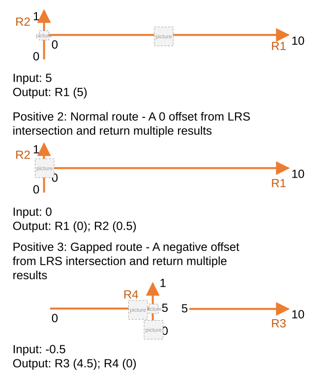
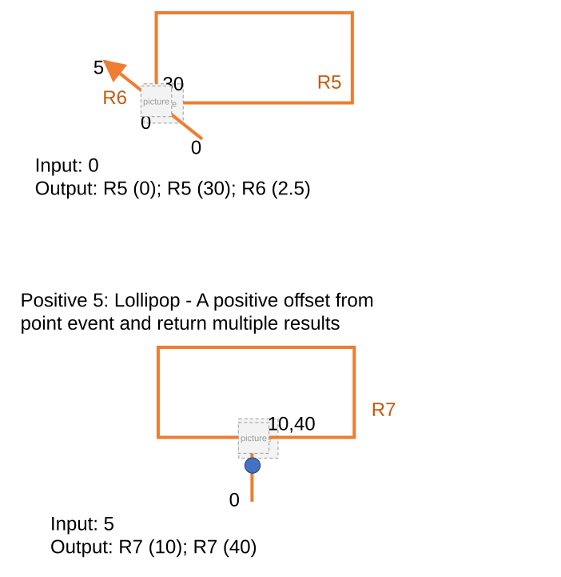
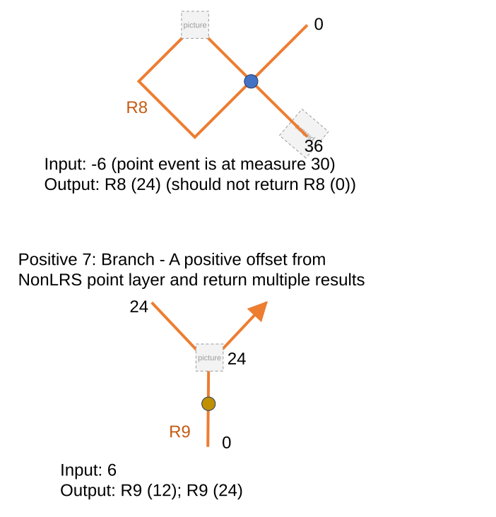
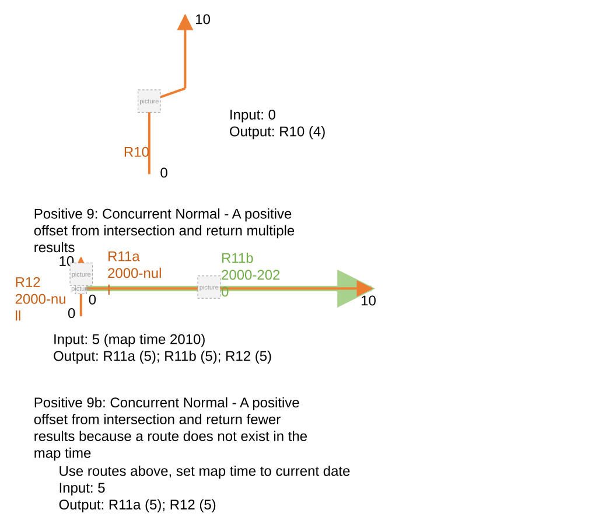
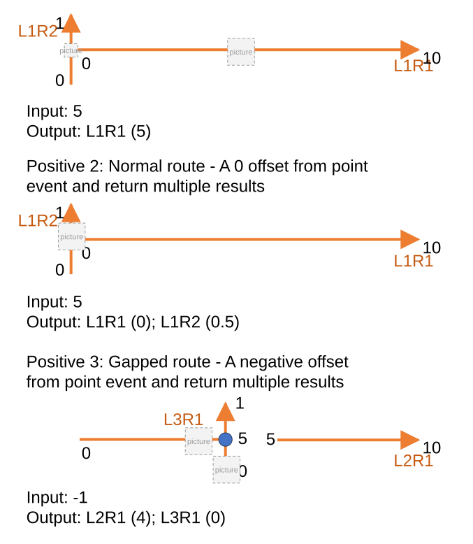
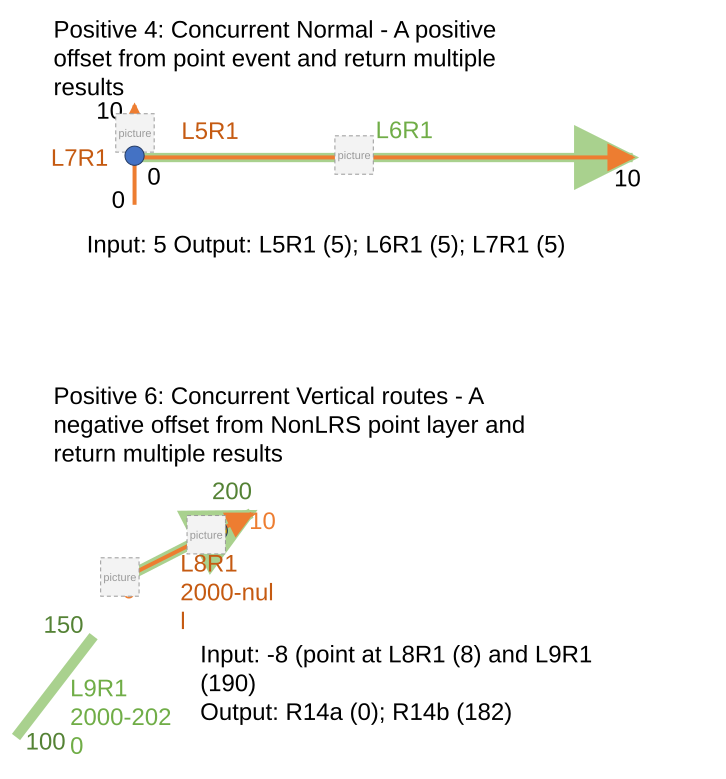
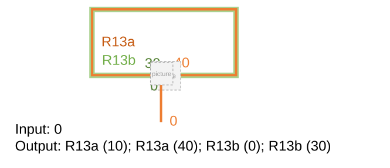

# ExB Search By Referent – Test Plan

| Field | Value |
| --- | --- |
| **Doc** | 456 · Test Plan · Experience Builder |
| **Product** | Roads & Highways |
| **Release** | — |
| **Issues** | [Beijing-R-D-Center/ExperienceBuilder-Web-Extensions#16462](https://devtopia.esri.com/Beijing-R-D-Center/ExperienceBuilder-Web-Extensions/issues/16462) |
| **Source** | [ExB_SearchbyReferent_testplan.pptx](<https://esriis.sharepoint.com/sites/LocationReferencing/Shared%20Documents/General/Test%20Plans/ExB_SearchbyReferent_testplan.pptx>) |
| **People** | author Lakshmi Ananthanarayanan · PE Claire Wang · dev 1 |
| **Edited** | 2023-11-29 22:40 by Claire Wang |
| **Extracted** | 2026-09-04 · lane xmlstrip · format 3.0 · prompt v2.0.2 |
| **Keywords** | referent · offset · route search · experience builder widget · positive test case · negative test case · route |
| **Tools** | Route Search widget |

## Summary

Test plan for the Search By Referent feature in the Experience Builder Route Search widget. Covers configuration options, positive and negative test cases involving various route types, referent layers, offset values, and UI behaviors across browsers and layouts. Includes automation and documentation updates for the new referent search method.

## Related documents

<!-- related:begin -->
- [Add Point Events by offsetting from other points – Test Plan](<https://esriis.sharepoint.com/sites/lrsworkspace/LRS Doc Index/Test Plans/3906-add-point-events-by-offsetting-from-other-points.md>) — similar text 0.25 · 1 filename word · same kind/folder <!-- rel:241 s=4.414 -->
- [Location Offset Method in Add Point and Add Line Widgets Test Plan](<https://esriis.sharepoint.com/sites/lrsworkspace/LRS%20Doc%20Index/Test%20Plans/24790-location-offset-method-in-add-point-and-add-line-widgets.md>) — similar text 0.21 · same kind/surface/folder <!-- rel:48 s=4.132 -->
- [Search by Referent Experience Builder widget](<https://esriis.sharepoint.com/sites/lrsworkspace/LRS Doc Index/User Stories/search-by-referent-exb-widget.md>) — similar text 0.32 · 2 title words · 2 filename words · same surface <!-- rel:476 s=4.1 -->
- [Search by Coordinate Method in Route Search Widget Test Plan](<https://esriis.sharepoint.com/sites/lrsworkspace/LRS Doc Index/Test Plans/16322-search-by-coordinate-method-in-route-search-widget.md>) — similar text 0.20 · 1 title word · 1 filename word · same kind/surface/folder <!-- rel:458 s=3.896 -->
- [Data Action Support for LRS Identify widget– Test Plan](<https://esriis.sharepoint.com/sites/lrsworkspace/LRS Doc Index/Test Plans/17939-data-action-support-for-lrs-identify-widget.md>) — similar text 0.22 · 1 filename word · same kind/surface/pe/folder <!-- rel:375 s=3.84 -->
<!-- related:end -->

<!-- docs:begin -->
## Esri documentation

[Storing referent and offset information for event location](https://doc.esri.com/en/arcgis-pro/latest/help/production/roads-highways/storing-referent-and-offset-information-for-event-location.html)

_No page matched:_ [Route Search widget](https://www.google.com/search?q=%22Route%20Search%20widget%22+site%3Adoc.esri.com)
<!-- docs:end -->

---

## Overview

### Slide 1 — ExB Search By Referent – Test Plan <!-- slide 1 -->

https://devtopia.esri.com/Beijing-R-D-Center/ExperienceBuilder-Web-Extensions/issues/16462

PE: Claire Wang
Dev:

### Slide 2 <!-- slide 2 -->

Data:

- Test with APRGCS and RH data
- Test with referent layers that are intersections, point events, and non LRS point features
- Test on Normal, Gapped, Complex (more on RH side), and Vertical (limited as ExB can’t view 3D) routes
- Test with positive and negative offset values
- Test time slicing
- Test where a single result will be returned as well as multiple results
- Test various offset units
- Test in different browsers (Chrome, Edge, (Firefox and Safari can be done through automation))
- Test deploying in tab and mobile layouts (UI testing and execute one or two test cases).
- Web testing in chrome and safari in mobile (use ExB provided screen size)
- 508 and i18n testing
- Test on different themes
Automation:
Add automation to the existing Route and Measure automation for this tool
Documentation:
Add to the existing Route and Measure widget documentation that covers this new method

### Slide 3 <!-- slide 3 -->

Configuration

- Verify additional options are available in the existing configuration widget
  - Add referent as one the methods (default is route and measure)
  - Allow the user choose the default network
  - Allow the user to choose the default referent layer
  - Allow the user to choose the display field for the referent layer
  - Allow the user to choose the unit of measure for the offset
Verification – tool pane

- Referents/Referent Offset is added to Route Search widget
- Network should be whatever network was configured in the backstage configuration
- User can change the network in the UI to any valid LRS networks in the map
- Any point layer can be chosen from Referent Layer dropdown
- Referent display field should be whatever is configured in the backstage
- Referent field has intellisense when typing
- The offset is optional; if it’s left empty, treat as 0
- No picker for Referent – users can only type

### Notes

Note: The button for the map interaction with the Referent field can be removed

### Slide 4 <!-- slide 4 -->

Verification – tool pane

- If the referent and/or offset value are invalid, provide a message that the values provided aren’t valid
- If a required field is missing, provide an error message and a red box when users click search (double check when the other methods are developed to keep consistency)
- When the user clicks search do the following:
  - Find all the routes/measures that are present at that referent/offset and return them in the results
  - Transition the widget to a results pane that shows the route(s)/measure(s) that are returned by the search
  - Show scrollbar when result pane is too long
  - Paging experience when result has many pages – very rare but test once
  - If no route/measure is present at the referent/offset, let the user know that no route/measure was found

## Test Cases

### TC-P01 — RH <!-- src: S4 · slide 5 · Positive cases · 1 -->

- Normal route - A positive offset from LRS intersection and return one result
- Normal route - A 0 offset from LRS intersection and return multiple results
- Gapped route - A negative offset from LRS intersection and return multiple results
- Loop – A 0 offset from LRS intersection and return multiple results
- Lollipop - A positive offset from point event and return multiple results
- Alpha - A negative offset from point event and return one result
- Branch - A positive offset from NonLRS point layer and return multiple results
- Vertical - A 0 offset from NonLRS point layer and return one result
- Concurrent Normal - A positive offset from intersection and return multiple results
  - Concurrent Normal - A positive offset from intersection and return fewer results because a route does not exist in the map time
- Concurrent Loop and Lollipop - A 0 offset from point event and return multiple results

### TC-N01 — Invalid referent value <!-- src: S4 · slide 6 · Negative cases · 1 -->

- Invalid offset value
- No result at the input referent/offset

### TC-P02 — Input: 5 (1) <!-- src: S1 · slide 7 · case -->

- **Group:** 2: Normal Route - A 0 Offset From LRS Intersection and Return Multiple Results

Output: R1 (5)
Input: 0
Output: R1 (0); R2 (0.5)
Positive 3: Gapped route - A negative offset from LRS intersection and return multiple results
Input: -0.5
Output: R3 (4.5); R4 (0)

[figure: R1 · R2 · 0 · 10 · 1 · R4 · 5 · R3]

### TC-P03 — Input: 0 (1) <!-- src: S1 · slide 8 · case -->

- **Group:** 5: Lollipop - A Positive Offset From Point Event and Return Multiple Results

Output: R5 (0); R5 (30); R6 (2.5)
Input: 5
Output: R7 (10); R7 (40)

[figure: R5 · 0 · 30 · 5 · R6 · 10,40 · R7]

### TC-P04 — Input: - 6 (point Event Is at Measure 30) <!-- src: S1 · slide 9 · case -->

- **Group:** 7: Branch - A Positive Offset From NonLRS Point Layer and Return Multiple Results

Output: R8 (24) (should not return R8 (0))

Input: 6
Output: R9 (12); R9 (24)

[figure: R8 · 0 · 36 · R9 · 24]

### TC-P05 — Input: 0 (2) <!-- src: S1 · slide 10 · case -->

- **Group:** 9: Concurrent Normal - A Positive Offset From Intersection and Return Multiple Results

Output: R10 (4)

Input: 5 (map time 2010)
Output: R11a (5); R11b (5); R12 (5)
Positive 9b: Concurrent Normal - A positive offset from intersection and return fewer results because a route does not exist in the map time
Use routes above, set map time to current date
Input: 5
Output: R11a (5); R12 (5)

[figure: R10 · 0 · 10 · R11a 2000-null · R11b 2000-2020 · R12 2000-null]

### TC-P06 — Input: 5 (2) <!-- src: S1 · slide 12 · case -->

- **Group:** 2: Normal Route - A 0 Offset From Point Event and Return Multiple Results

Output: L1R1 (5)
Input: 5
Output: L1R1 (0); L1R2 (0.5)
Positive 3: Gapped route - A negative offset from point event and return multiple results
Input: -1
Output: L2R1 (4); L3R1 (0)

[figure: L1R1 · L1R2 · 0 · 10 · 1 · L3R1 · 5 · L2R1]

### TC-P07 — Input: 5 Output: L5R1 (5); L6R1 (5); L7R1 (5) <!-- src: S1 · slide 13 · case -->

- **Group:** 4: Concurrent Normal - A Positive Offset From Point Event and Return Multiple Results

Positive 6: Concurrent Vertical routes - A negative offset from NonLRS point layer and return multiple results

Input: -8 (point at L8R1 (8) and L9R1 (190)
Output: R14a (0); R14b (182)

[figure: L5R1 · L6R1 · L7R1 · 0 · 10 · L9R1 2000-2020 · L8R1 2000-null · 100 · 200 · 150]

### TC-N02 — Input: 500 <!-- src: S1 · slide 14 · case -->

- **Group:** 2: Invalid Offset Value

Negative 3: No result at the input referent/offset
Output: message provided by dev
Input: 5 from qignjkero
Output: message provided by dev
Input: %##^* from an intersection
Output: message provided by dev

[figure: R1 · R2 · 0 · 10 · 1]

## Other content

### Slide 6 — Positive cases <!-- slide 6 -->

  - APRGCS
  - Normal route - A positive offset from LRS intersection and return one result
  - Normal route - A 0 offset from point event and return multiple results
  - Gapped route - A negative offset from point event and return multiple results
  - Concurrent Normal - A positive offset from point event and return multiple results
  - Concurrent Vertical Gapped routes - A negative offset from NonLRS point layer and return  fewer results because a route does not exist in the map time

### Slide 11 — Positive 10: Loop – Concurrent Loop and Lollipop - A 0 offset from point event and return multiple results <!-- slide 11 -->

Input: 0
Output: R13a (10); R13a (40); R13b (0); R13b (30)

[figure: 30 · 0 · 40 · R13a · R13b]

