# LRS Identify Widget Test Plan

| Field | Value |
| --- | --- |
| **Doc** | 452 · Test Plan · Experience Builder |
| **Product** | — |
| **Release** | — |
| **Issues** | [Beijing-R-D-Center/ExperienceBuilder-Web-Extensions#16568](https://devtopia.esri.com/Beijing-R-D-Center/ExperienceBuilder-Web-Extensions/issues/16568) · [Beijing-R-D-Center/ExperienceBuilder-Web-Extensions#16569](https://devtopia.esri.com/Beijing-R-D-Center/ExperienceBuilder-Web-Extensions/issues/16569) |
| **Source** | [16568&16569-LRSIdentify_TestPlanV2.pptx](<https://esriis.sharepoint.com/sites/LocationReferencing/Shared%20Documents/General/Test%20Plans/16568%2616569-LRSIdentify_TestPlanV2.pptx>) · rev V2 |
| **People** | author Mac Christmas · PE — · dev — |
| **Edited** | 2023-12-18 20:52 by Mac Christmas |
| **Extracted** | 2026-09-04 · lane xmlstrip · format 3.0 · prompt v2.0.2 |
| **Keywords** | identify widget · routes · events · line network · non line network · point event · route identification · event information · attribute set · time slice · spatial reference · paging · overlapping events · spanning events · PoM network · map tolerance · event attribute · network layer · event layer |
| **Tools** | LRS Identify |

## Summary

Test plan for the LRS Identify widget in Experience Builder covering identification of routes and events on line and non-line networks. Includes positive and negative configuration tests, UI behavior, handling of multiple routes, time slices, overlapping events, and event information display options. Tests cover projected and unprojected data, various spatial references, and different network configurations including PoM and spanning events.

## Related documents

<!-- related:begin -->
- [Split Event Widget Test Plan](<https://esriis.sharepoint.com/sites/lrsworkspace/LRS Doc Index/Test Plans/16461-split-event-widget.md>) — similar text 0.18 · 1 title word · same kind/surface/folder <!-- rel:459 s=3.394 -->
- [Merge Events Widget Test Plan](<https://esriis.sharepoint.com/sites/lrsworkspace/LRS Doc Index/Test Plans/16934-merge-events-widget.md>) — similar text 0.17 · 1 title word · same kind/surface/folder <!-- rel:437 s=3.169 -->
- [LRS Identify: Show Coordinates in Results Experience Builder Widget Test Plan](<https://esriis.sharepoint.com/sites/lrsworkspace/LRS%20Doc%20Index/Test%20Plans/26618-lrs-identify-show-coordinates-in-results-exb-widget.md>) — similar text 0.17 · 2 title words · same kind/surface/folder <!-- rel:859 s=3.154 -->
- [Dynamic Segmentation Merge Option Test Plan](<https://esriis.sharepoint.com/sites/lrsworkspace/LRS Doc Index/Test Plans/4902-dynseg-merge-option.md>) — similar text 0.21 · same kind/surface/folder <!-- rel:592 s=3.044 -->
- [Experience Builder: Add Multiple Line Events Widget Test Plan](<https://esriis.sharepoint.com/sites/lrsworkspace/LRS Doc Index/Test Plans/16343-exb-add-multiple-line-events-widget.md>) — similar text 0.17 · 1 title word · same kind/surface/folder <!-- rel:457 s=2.986 -->
<!-- related:end -->

<!-- docs:begin -->
## Esri documentation

[Storing referent and offset information for event location](https://doc.esri.com/en/arcgis-pro/latest/help/production/location-referencing-pipelines/storing-referent-and-offset-information-for-event-location.html) · [Event editing using the attribute table](https://doc.esri.com/en/arcgis-pro/latest/help/production/location-referencing-pipelines/event-editing-using-the-attribute-table.html)

_No page matched:_ [LRS Identify](https://www.google.com/search?q=%22LRS%20Identify%22+site%3Adoc.esri.com)
<!-- docs:end -->

---

## Overview

### Slide 1 — LRS Identify Widget <!-- slide 1 -->

**Notes**
- The user story has been split into Identify Routes and Identify Events. This test plan will cover both functionalities
- Add Identify Widget to Experience Builder
- Test on line and non-line networks (including PoM)
- Test with auto-generated, single-field, and multi-field RouteID configurations
- Test on spanning and non-spanning line events (point events are excluded for now)
- Test with projected and unprojected data, including a variety of spatial references
- Test with networks with and without events
- Identification of event information is optional
- Attribute Sets can only be edited/updated in Pro
- Test with various themes
- Test in Chrome and Edge (other browsers will be covered in automation)

Devtopia Issue (Routes)
Devtopia Issue (Events)

## Test Cases

### TC-P01 — A map can be chosen <!-- src: S4 · slide 2 · Positive Tests: Configuration · 1 -->

- **Group:** Configuration

### TC-P02 — If more than one map exists within the app <!-- src: S4 · slide 2 · Positive Tests: Configuration · 2 -->

- **Group:** Configuration
- **Case:** If more than one map exists within the app, list all maps in the Select a map dropdown

### TC-P03 — Line event and network layers can be imported from the map (no point events) <!-- src: S4 · slide 2 · Positive Tests: Configuration · 3 -->

- **Group:** Configuration

### TC-P04 — Missing layers can be added using the New Editable Layer option <!-- src: S4 · slide 2 · Positive Tests: Configuration · 4 -->

- **Group:** Configuration

### TC-P05 — Layers can be reordered <!-- src: S4 · slide 2 · Positive Tests: Configuration · 5 -->

- **Group:** Configuration

### TC-P06 — Layers can be removed by clicking the X button <!-- src: S4 · slide 2 · Positive Tests: Configuration · 6 -->

- **Group:** Configuration

### TC-P07 — Clicking on Clear layers will remove all the imported layers <!-- src: S4 · slide 2 · Positive Tests: Configuration · 7 -->

- **Group:** Configuration

### TC-P08 — If some layers are removed <!-- src: S4 · slide 2 · Positive Tests: Configuration · 8 -->

- **Group:** Configuration
- **Case:** If some layers are removed, clicking on Load layers will only import the missing layers

### TC-P09 — When another web map is chosen, clear the layers from the list <!-- src: S4 · slide 2 · Positive Tests: Configuration · 9 -->

- **Group:** Configuration

### TC-P10 — A default LRS network layer can be chosen <!-- src: S4 · slide 2 · Positive Tests: Configuration · 10 -->

- **Group:** Configuration

### TC-P11 — The LRS network layer’s label can be edited <!-- src: S4 · slide 2 · Positive Tests: Configuration · 11 -->

- **Group:** Configuration

### TC-P12 — By default, LRS network LRS fields and business fields show in the results <!-- src: S4 · slide 2 · Positive Tests: Configuration · 12 -->

- **Group:** Configuration
- **Case:** By default, LRS network LRS fields and business fields show in the results (hide shape, shape_length, editor tracking fields, etc.)

### TC-P13 — LRS network system fields can be configured to appear in the results <!-- src: S4 · slide 2 · Positive Tests: Configuration · 13 -->

- **Group:** Configuration

### TC-P14 — LRS network attribute fields can be selected/unselected to show in the UI <!-- src: S4 · slide 2 · Positive Tests: Configuration · 14 -->

- **Group:** Configuration

### TC-P15 — If the input network is PoM, allow for Show Event Information to be configured <!-- src: S4 · slide 2 · Positive Tests: Configuration · 15 -->

- **Group:** Configuration
- **Case:** If the input network is PoM, allow for Show Event Information to be configured, but no events will be displayed

### TC-P16 — All event layer attribute fields will be configured in the chosen Event <!-- src: S4 · slide 2 · Positive Tests: Configuration · 16 -->

- **Group:** Configuration
- **Case:** All event layer attribute fields will be configured in the chosen Event Attribute Set

### TC-P17 — Use field alias should be enabled by default <!-- src: S4 · slide 2 · Positive Tests: Configuration · 17 -->

- **Group:** Configuration

### TC-P18 — User can configure whether event information is returned or not <!-- src: S4 · slide 2 · Positive Tests: Configuration · 18 -->

- **Group:** Configuration

### TC-N01 — Show error if no LRS enabled layers in the chosen web map when attempting <!-- src: S4 · slide 2 · Negative Tests: Configuration · 1 -->

- **Group:** Configuration
- **Case:** Show error if no LRS enabled layers in the chosen web map when attempting to import layer

### TC-N02 — No line event layers are imported from the map <!-- src: S4 · slide 2 · Negative Tests: Configuration · 2 -->

- **Group:** Configuration

### TC-N03 — LRS parent network is not within the web map <!-- src: S4 · slide 2 · Negative Tests: Configuration · 3 -->

- **Group:** Configuration

### TC-N04 — Chosen web map has more than one service <!-- src: S4 · slide 2 · Negative Tests: Configuration · 4 -->

- **Group:** Configuration

### TC-N05 — No Attribute Set published with map, event information will be unavailable <!-- src: S4 · slide 2 · Negative Tests: Configuration · 5 -->

- **Group:** Configuration

### TC-P19 — When no route exists at the clicked location <!-- src: S4 · slide 3 · Positive Tests: UI · 1 -->

- **Group:** UI
- **Case:** When no route exists at the clicked location, do not have a pop-up and keep cursor experience the same so the user can click again to get a valid location without having to reactivate the tool

### TC-P20 — When a route is clicked <!-- src: S4 · slide 3 · Positive Tests: UI · 2 -->

- **Group:** UI
- **Case:** When a route is clicked, the configured default network is shown in the Network parameter

### TC-P21 — If only one LRS network is configured, the Network dropdown will be disabled <!-- src: S4 · slide 3 · Positive Tests: UI · 3 -->

- **Group:** UI

### TC-P22 — If more than one LRS network is configured <!-- src: S4 · slide 3 · Positive Tests: UI · 4 -->

- **Group:** UI
- **Case:** If more than one LRS network is configured, the Network dropdown will show other LRS networks

### TC-P23 — Configured Route information will appear when a valid route is picked <!-- src: S4 · slide 3 · Positive Tests: UI · 5 -->

- **Group:** UI
- **Case:** Configured Route information will appear when a valid route is picked in the map, including configured LRS network attributes (this includes the Network name, RouteID (and RouteName if configured), Clicked Location Measure, Min Measure, Max Measure, and the time slice information)

### TC-P24 — Depending on the route identifier configuration <!-- src: S4 · slide 3 · Positive Tests: UI · 6 -->

- **Group:** UI
- **Case:** Depending on the route identifier configuration, show the relevant RouteID vs. RouteName information

### TC-P25 — If the chosen LRS network has a multi-field RouteID <!-- src: S4 · slide 3 · Positive Tests: UI · 7 -->

- **Group:** UI
- **Case:** If the chosen LRS network has a multi-field RouteID, show the concatenated RouteID in the RouteID parameter and show the individual RouteID fields in the attribute section

### TC-P26 — Use the configured map tolerance to determine whether a route is present (1) <!-- src: S4 · slide 3 · Positive Tests: UI · 8 -->

- **Group:** UI
- **Case:** Use the configured map tolerance to determine whether a route is present and the clicked location

### TC-P27 — When Show event information is disabled <!-- src: S4 · slide 3 · Positive Tests: UI · 9 -->

- **Group:** UI
- **Case:** When Show event information is disabled, only show the Route information and its attributes

### TC-P28 — If time is disabled for the map or multiple time slices are visible in the map <!-- src: S4 · slide 3 · Positive Tests: UI · 10 -->

- **Group:** UI
- **Case:** If time is disabled for the map or multiple time slices are visible in the map, the Time dropdown parameter can be used to select specific time slices of the route

### TC-P29 — If only one time slice exists, disable the dropdown <!-- src: S4 · slide 3 · Positive Tests: UI · 11 -->

- **Group:** UI

### TC-P30 — If multiple routes in the same network occur at the clicked location <!-- src: S4 · slide 3 · Positive Tests: UI · 12 -->

- **Group:** UI
- **Case:** If multiple routes in the same network occur at the clicked location, a paging experience allows the user to switch between picked routes

### TC-P31 — If multiple measures exist on the same route at the clicked location <!-- src: S4 · slide 3 · Positive Tests: UI · 13 -->

- **Group:** UI
- **Case:** If multiple measures exist on the same route at the clicked location, show the multiple measures in the Measure parameter (like we do in Pro)

### TC-P32 — Add a marker to the clicked location <!-- src: S4 · slide 3 · Positive Tests: UI · 14 -->

- **Group:** UI

### TC-P33 — When the widget is closed, remove the marker from the map <!-- src: S4 · slide 3 · Positive Tests: UI · 15 -->

- **Group:** UI

### TC-P34 — Marker should update when a new location is clicked <!-- src: S4 · slide 3 · Positive Tests: UI · 16 -->

- **Group:** UI

### TC-P35 — Route information in the route table should be highlight-able and copy-able <!-- src: S4 · slide 3 · Positive Tests: UI · 17 -->

- **Group:** UI

### TC-P36 — Attributes from the route and event tables should be highlight-able <!-- src: S4 · slide 3 · Positive Tests: UI · 18 -->

- **Group:** UI
- **Case:** Attributes from the route and event tables should be highlight-able and copy-able

### TC-P37 — Event information can be hidden by clicking Hide Event information accordion <!-- src: S4 · slide 3 · Positive Tests: UI · 19 -->

- **Group:** UI
- **Case:** Event information can be hidden by clicking Hide Event information accordion arrow

### TC-P38 — Event information will be displayed in the event table as EventName.Field <!-- src: S4 · slide 3 · Positive Tests: UI · 20 -->

- **Group:** UI
- **Case:** Event information will be displayed in the event table as EventName.Field in the first column and its value in the second column

### TC-P39 — If the EventName.Field or Value is too long to fit in the column <!-- src: S4 · slide 3 · Positive Tests: UI · 21 -->

- **Group:** UI
- **Case:** If the EventName.Field or Value is too long to fit in the column, what fits will show plus a “…”

### TC-P40 — When hovering over a value that is too long to fit in the column <!-- src: S4 · slide 3 · Positive Tests: UI · 22 -->

- **Group:** UI
- **Case:** When hovering over a value that is too long to fit in the column, the hidden information will show

### TC-P41 — If no events occur where the user has clicked along a route <!-- src: S4 · slide 3 · Positive Tests: UI · 23 -->

- **Group:** UI
- **Case:** If no events occur where the user has clicked along a route, show a message in the events table section that lets the user know that no events occur at the clicked location

### TC-P42 — If only some events within the configured Attribute Set exist at the clicked <!-- src: S4 · slide 3 · Positive Tests: UI · 24 -->

- **Group:** UI
- **Case:** If only some events within the configured Attribute Set exist at the clicked location, only show the event information for the existing events

### TC-P43 — If overlapping line events occur at the clicked location <!-- src: S4 · slide 3 · Positive Tests: UI · 25 -->

- **Group:** UI
- **Case:** If overlapping line events occur at the clicked location, show each event in a different row with a (1), (2), (3)… to differentiate between events

### TC-P44 — If the results are too large to fit within the widget to where a scroll bar <!-- src: S4 · slide 3 · Positive Tests: UI · 26 -->

- **Group:** UI
- **Case:** If the results are too large to fit within the widget to where a scroll bar is needed, make sure the widget is scrollable from Network to the last EventName.Field result in the Event table

### TC-P45 — Network only, event info turned off. Network has all fields configured (1) <!-- src: S4 · slide 4 · Positive Tests · 1 -->

- **Case:** Network only, event info turned off. Network has all fields configured to display

### TC-P46 — Network only, event info turned off. Network does not have extra business fields (1) <!-- src: S4 · slide 4 · Positive Tests · 2 -->

- **Case:** Network only, event info turned off. Network does not have extra business fields configured

### TC-P47 — Network only, event info turned off. No route exists at the clicked location (1) <!-- src: S4 · slide 4 · Positive Tests · 3 -->

### TC-P48 — Network only, event info turned off. Multiple routes exist at the clicked (1) <!-- src: S4 · slide 4 · Positive Tests · 4 -->

- **Case:** Network only, event info turned off. Multiple routes exist at the clicked location, paging experience allows user to see all events at the clicked location

### TC-P49 — Network only, event info turned off. Multiple time slices of a route exist (1) <!-- src: S4 · slide 4 · Positive Tests · 5 -->

- **Case:** Network only, event info turned off. Multiple time slices of a route exist, time dropdown allows user to see all time slices of route

### TC-P50 — Network and event info turned on. Network and events have all fields configured (1) <!-- src: S4 · slide 4 · Positive Tests · 6 -->

- **Case:** Network and event info turned on. Network and events have all fields configured to display

### TC-P51 — Network and event info turned on. Network and events have some fields configured (1) <!-- src: S4 · slide 4 · Positive Tests · 7 -->

- **Case:** Network and event info turned on. Network and events have some fields configured to display

### TC-P52 — Network and event info turned on. No events exist at the clicked location <!-- src: S4 · slide 4 · Positive Tests · 8 -->

- **Case:** Network and event info turned on. No events exist at the clicked location, only the network info will be returned

### TC-P53 — Network and event info turned on. Some events in the configured Attribute Set (1) <!-- src: S4 · slide 4 · Positive Tests · 9 -->

- **Case:** Network and event info turned on. Some events in the configured Attribute Set exist at the clicked location and only these events will be returned

### TC-P54 — Line network and event info turned on. Spanning events exist at the clicked (1) <!-- src: S4 · slide 4 · Positive Tests · 10 -->

- **Case:** Line network and event info turned on. Spanning events exist at the clicked location

### TC-P55 — PoM network. Only network information is returned (1) <!-- src: S4 · slide 4 · Positive Tests · 11 -->

### TC-P56 — Network and event info turned on. Multiple time slices of the same route and its (1) <!-- src: S4 · slide 4 · Positive Tests · 12 -->

- **Case:** Network and event info turned on. Multiple time slices of the same route and its events exist at the clicked location. Adjusting the Time dropdown allows for an accurate view of the route and its events over time

### TC-P57 — Network and event info turned on. Multiple overlapping events within the same (1) <!-- src: S4 · slide 4 · Positive Tests · 13 -->

- **Case:** Network and event info turned on. Multiple overlapping events within the same event layer exist at the clicked location, different event records are differentiated by a (1), (2), (3)…

### TC-P58 — Network and event info turned on. Clicked location is the exact overlapping (1) <!-- src: S4 · slide 4 · Positive Tests · 14 -->

- **Case:** Network and event info turned on. Clicked location is the exact overlapping measure of two events within the same event layer, each event record is differentiated by a (1) and (2)

### TC-P59 — Network and event info turned on. Multiple measures on the same route exist (1) <!-- src: S4 · slide 4 · Positive Tests · 15 -->

- **Case:** Network and event info turned on. Multiple measures on the same route exist at the clicked location

### TC-P60 — Network and event info turned on. Multiple routes within different LRS networks (1) <!-- src: S4 · slide 4 · Positive Tests · 16 -->

- **Case:** Network and event info turned on. Multiple routes within different LRS networks exist at the clicked location

### TC-P61 — Network and event info turned on. Clicked location is the intersection of 2 (1) <!-- src: S4 · slide 4 · Positive Tests · 17 -->

- **Case:** Network and event info turned on. Clicked location is the intersection of 2 routes

### TC-P62 — Network and event info turned on. Route has single time slice (1) <!-- src: S4 · slide 4 · Positive Tests · 18 -->

- **Case:** Network and event info turned on. Route has single time slice, but events have multiple

### TC-P63 — Network and event info turned on. Clicked location is the end/start of 2 routes <!-- src: S4 · slide 4 · Positive Tests · 19 -->

### TC-P64 — Network and event info turned on. Clicked location has concurrent routes (1) <!-- src: S4 · slide 4 · Positive Tests · 20 -->

- **Case:** Network and event info turned on. Clicked location has concurrent routes of different networks, but one network is not enabled to display in map

### TC-P65 — Network and event info turned on. Multiple measures on the same route exist (2) <!-- src: S4 · slide 4 · Positive Tests · 21 -->

- **Case:** Network and event info turned on. Multiple measures on the same route exist at the clicked location. Event spans whole route, including the intersecting measures

### TC-P66 — Network and event info turned on. Multiple events exist at the clicked location (1) <!-- src: S4 · slide 4 · Positive Tests · 22 -->

- **Case:** Network and event info turned on. Multiple events exist at the clicked location but only a subset are within the configured Attribute Set

### TC-P67 — Network and event info turned on with time filter set in map. Time filter (1) <!-- src: S4 · slide 4 · Positive Tests · 23 -->

- **Case:** Network and event info turned on with time filter set in map. Time filter filters the results of the tool

### TC-U01 — Network Only, Event Info Turned Off. Network Has All Fields Configured (case 1) <!-- src: S1 · slide 5 · case 1 -->

- **Case:** Network only, event info turned off. Network has all fields configured to display

| LRS Identify Results |  |  |  |  |  | X |
| --- | --- | --- | --- | --- | --- | --- |
| Network: | CountyLog |  |  | > |  |  |
| RouteID: | 001 |  |  |  |  |  |
| RouteName: | Route1 |  |  |  |  |  |
| Min Measure: | 0 miles |  |  |  |  |  |
| Max Measure: | 10 miles |  |  |  |  |  |
| Measure: | 5 miles |  |  |  |  |  |
| Time: | 1/1/2000 to <Null> |  |  |  | > |  |
|  |  |  |  |  |  |  |
| Attribute | Value |  |  |  |  |  |
| Jurisdiction | Local |  |  |  |  |  |
| County | Adams |  |  |  |  |  |
| Shape | Polyline ZM |  |  |  |  |  |
| Shape_Length | 52800 |  |  |  |  |  |
| Creation User | User1 |  |  |  |  |  |
| Created Date | 1/1/2000 08:30:10 AM |  |  |  |  |  |
| Last User | User2 |  |  |  |  |  |
| Date Modified | 1/1/2010 09:45:12 AM |  |  |  |  |  |
| GlobalID | {61898661-FCDD-46EB-A83C-1E0E5A6F932A} |  |  |  |  |  |
|  |  |  |  |  |  |  |
| Hide Event Information |  |  | > |  |  |  |
| No event information to display |  |  |  |  |  |  |

| Network Layer | RouteID | Route Name | From Date | ToDate | Jurisdiction | County |
| --- | --- | --- | --- | --- | --- | --- |
| CountyLog | 001 | Route1 | 1/1/2000 | <Null> | Local | Adams |

| Event Layer | RouteID | Route Name | From Date | To Date | From Measure | To Measure | Attribute1 | Attribute2 |
| --- | --- | --- | --- | --- | --- | --- | --- | --- |
| Speed | 001 | Route1 | 1/1/2000 | <Null> | 0 | 10 | 45 MPH | Active |
| Access_Control | 001 | Route1 | 1/1/2000 | <Null> | 0 | 2 | Full Access | Active |
| Access_Control | 001 | Route1 | 1/1/2000 | <Null> | 2 | 10 | No Access | Active |
| Facility_Type | 001 | Route1 | 1/1/2000 | <Null> | 1 | 9 | One-Way | Active |
| Functional_Class | 001 | Route1 | 1/1/2000 | <Null> | 0 | 5 | Minor | Active |
| Pavement_Condition | 001 | Route1 | 1/1/2000 | <Null> | 5 | 10 | 2009 | Retired |

[figure: 0 · 10 · Returned Result: · Clicked Location: · Route1]

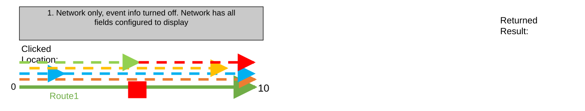

### TC-U02 — Network Only, Event Info Turned Off. Network Does Not Have Extra Business Fields (case 2) <!-- src: S1 · slide 6 · case 2 -->

- **Case:** Network only, event info turned off. Network does not have extra business fields configured

| LRS Identify Results |  |  |  |  |  | X |
| --- | --- | --- | --- | --- | --- | --- |
| Network: | CountyLog |  |  | > |  |  |
| RouteID: | 001 |  |  |  |  |  |
| RouteName: | Route1 |  |  |  |  |  |
| Min Measure: | 0 miles |  |  |  |  |  |
| Max Measure: | 10 miles |  |  |  |  |  |
| Measure: | 5 miles |  |  |  |  |  |
| Time: | 1/1/2000 to <Null> |  |  |  | > |  |
|  |  |  |  |  |  |  |
| Attribute | Value |  |  |  |  |  |
| Shape | Polyline ZM |  |  |  |  |  |
| Shape_Length | 52800 |  |  |  |  |  |
| Creation User | User1 |  |  |  |  |  |
| Created Date | 1/1/2000 08:30:10 AM |  |  |  |  |  |
| Last User | User2 |  |  |  |  |  |
| Date Modified | 1/1/2010 09:45:12 AM |  |  |  |  |  |
| GlobalID | {61898661-FCDD-46EB-A83C-1E0E5A6F932A} |  |  |  |  |  |
|  |  |  |  |  |  |  |
| Hide Event Information |  |  | > |  |  |  |
| No event information to display |  |  |  |  |  |  |

| Network Layer | RouteID | Route Name | From Date | ToDate | Jurisdiction | County |
| --- | --- | --- | --- | --- | --- | --- |
| CountyLog | 001 | Route1 | 1/1/2000 | <Null> | Local | Adams |

| Event Layer | RouteID | Route Name | From Date | To Date | From Measure | To Measure | Attribute1 | Attribute2 |
| --- | --- | --- | --- | --- | --- | --- | --- | --- |
| Speed | 001 | Route1 | 1/1/2000 | <Null> | 0 | 10 | 45 MPH | Active |
| Access_Control | 001 | Route1 | 1/1/2000 | <Null> | 0 | 2 | Full Access | Active |
| Access_Control | 001 | Route1 | 1/1/2000 | <Null> | 2 | 10 | No Access | Active |
| Facility_Type | 001 | Route1 | 1/1/2000 | <Null> | 1 | 9 | One-Way | Active |
| Functional_Class | 001 | Route1 | 1/1/2000 | <Null> | 0 | 5 | Minor | Active |
| Pavement_Condition | 001 | Route1 | 1/1/2000 | <Null> | 5 | 10 | 2009 | Retired |

[figure: 0 · 10 · Returned Result: · Clicked Location: · Route1]

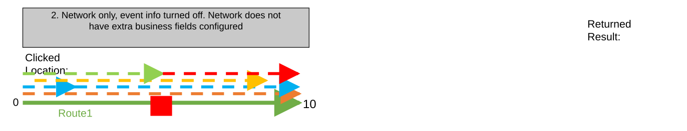

### TC-U03 — Network Only, Event Info Turned Off. No Route Exists at the Clicked Location (case 3) <!-- src: S1 · slide 7 · case 3 -->

| Network Layer | RouteID | Route Name | From Date | ToDate | Jurisdiction | County |
| --- | --- | --- | --- | --- | --- | --- |
| CountyLog | 001 | Route1 | 1/1/2000 | <Null> | Local | Adams |

| Event Layer | RouteID | Route Name | From Date | To Date | From Measure | To Measure | Attribute1 | Attribute2 |
| --- | --- | --- | --- | --- | --- | --- | --- | --- |
| Speed | 001 | Route1 | 1/1/2000 | <Null> | 0 | 10 | 45 MPH | Active |
| Access_Control | 001 | Route1 | 1/1/2000 | <Null> | 0 | 2 | Full Access | Active |
| Access_Control | 001 | Route1 | 1/1/2000 | <Null> | 2 | 10 | No Access | Active |
| Facility_Type | 001 | Route1 | 1/1/2000 | <Null> | 1 | 9 | One-Way | Active |
| Functional_Class | 001 | Route1 | 1/1/2000 | <Null> | 0 | 5 | Minor | Active |
| Pavement_Condition | 001 | Route1 | 1/1/2000 | <Null> | 5 | 10 | 2009 | Retired |

[figure: 0 · 10 · Returned Result: · Clicked Location: · Route1]

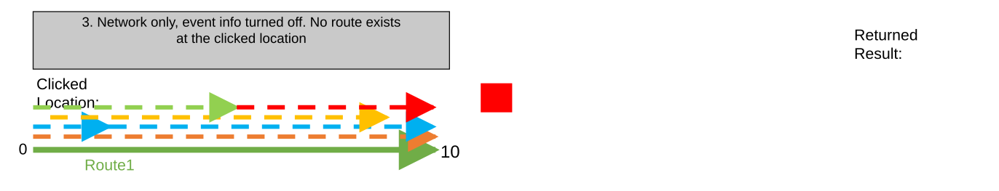

### TC-U04 — Network Only, Event Info Turned Off. Multiple Routes Exist at the Clicked (case 4) <!-- src: S1 · slide 8 · case 4 -->

- **Case:** Network only, event info turned off. Multiple routes exist at the clicked location, paging experience allows user to see all events at the clicked location

| LRS Identify Results (Page 1) |  |  |  |  |  | X |
| --- | --- | --- | --- | --- | --- | --- |
| Network: | CountyLog |  |  | > |  |  |
| RouteID: | 001 |  |  |  |  |  |
| RouteName: | Route1 |  |  |  |  |  |
| Min Measure: | 0 miles |  |  |  |  |  |
| Max Measure: | 10 miles |  |  |  |  |  |
| Measure: | 5 miles |  |  |  |  |  |
| Time: | 1/1/2000 to <Null> |  |  |  | > |  |
|  |  |  |  |  |  |  |
| Attribute | Value |  |  |  |  |  |
| Jurisdiction | Local |  |  |  |  |  |
| County | Adams |  |  |  |  |  |
| Shape | Polyline ZM |  |  |  |  |  |
| Shape_Length | 52800 |  |  |  |  |  |
| Creation User | User1 |  |  |  |  |  |
| Created Date | 1/1/2000 08:30:10 AM |  |  |  |  |  |
| Last User | User2 |  |  |  |  |  |
| Date Modified | 1/1/2010 09:45:12 AM |  |  |  |  |  |
| GlobalID | {61898661-FCDD-46EB-A83C-1E0E5A6F932A} |  |  |  |  |  |
|  |  |  |  |  |  |  |
| Hide Event Information |  |  | > |  |  |  |
| No event information to display |  |  |  |  |  |  |

| Network Layer | RouteID | Route Name | From Date | ToDate | Jurisdiction | County |
| --- | --- | --- | --- | --- | --- | --- |
| CountyLog | 001 | Route1 | 1/1/2000 | <Null> | Local | Adams |
| CountyLog | 002 | Route2 | 1/1/2000 | <Null> | State | Adams |

| LRS Identify Results (Page 2) |  |  |  |  |  | X |
| --- | --- | --- | --- | --- | --- | --- |
| Network: | CountyLog |  |  | > |  |  |
| RouteID: | 002 |  |  |  |  |  |
| RouteName: | Route2 |  |  |  |  |  |
| Min Measure: | 5 miles |  |  |  |  |  |
| Max Measure: | 15 miles |  |  |  |  |  |
| Measure: | 10 miles |  |  |  |  |  |
| Time: | 1/1/2000 to <Null> |  |  |  | > |  |
|  |  |  |  |  |  |  |
| Attribute | Value |  |  |  |  |  |
| Jurisdiction | State |  |  |  |  |  |
| County | Adams |  |  |  |  |  |
| Shape | Polyline ZM |  |  |  |  |  |
| Shape_Length | 52800 |  |  |  |  |  |
| Creation User | User2 |  |  |  |  |  |
| Created Date | 12/15/1999 3:45:05 PM |  |  |  |  |  |
| Last User | User1 |  |  |  |  |  |
| Date Modified | 1/1/2009 12:36:48 PM |  |  |  |  |  |
| GlobalID | {574FF57A-2FE6-42E0-9998-96CE834468B1} |  |  |  |  |  |
|  |  |  |  |  |  |  |
| Hide Event Information |  |  | > |  |  |  |
| No event information to display |  |  |  |  |  |  |

[figure: 0 · 10 · Returned Result: · Clicked Location: · Route1 · 5 · 15 · Route2]

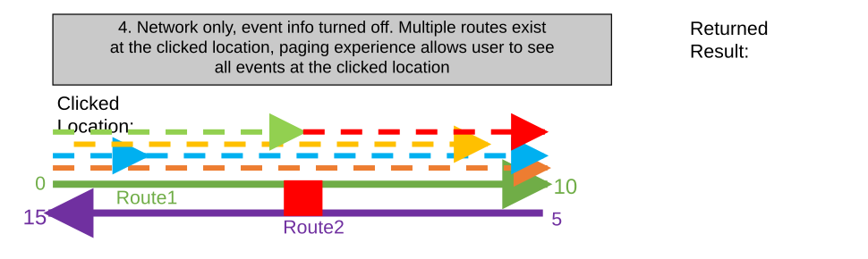

### TC-U05 — Network Only, Event Info Turned Off. Multiple Time Slices of a Route Exist (case 5) <!-- src: S1 · slide 9 · case 5 -->

- **Case:** Network only, event info turned off. Multiple time slices of a route exist, time dropdown allows user to see all time slices of route

| LRS Identify Results |  |  |  |  | X |
| --- | --- | --- | --- | --- | --- |
| Network: | CountyLog |  |  | > |  |
| RouteID: | 001 |  |  |  |  |
| RouteName: | Route1 |  |  |  |  |
| Min Measure: | 0 miles |  |  |  |  |
| Max Measure: | 10 miles |  |  |  |  |
| Measure: | 7.5 miles |  |  |  |  |
| Time: | 1/1/2000 to 1/1/2005 |  |  |  | > |
|  |  |  |  |  |  |
| Attribute | Value |  |  |  |  |
| Jurisdiction | Local |  |  |  |  |
| County | Adams |  |  |  |  |
| Shape | Polyline ZM |  |  |  |  |
| Shape_Length | 52800 |  |  |  |  |
| Creation User | User1 |  |  |  |  |
| Created Date | 1/1/2000 08:30:10 AM |  |  |  |  |
| Last User | User2 |  |  |  |  |
| Date Modified | 1/1/2010 09:45:12 AM |  |  |  |  |
| GlobalID | {61898661-FCDD-46EB-A83C-1E0E5A6F932A} |  |  |  |  |
|  |  |  |  |  |  |
| Hide Event Information |  |  | > |  |  |
| No event information to display |  |  |  |  |  |

| Network Layer | RouteID | Route Name | From Date | ToDate | Jurisdiction | County |
| --- | --- | --- | --- | --- | --- | --- |
| CountyLog | 001 | Route1 | 1/1/2000 | 1/1/2005 | Local | Adams |
| CountyLog | 001 | Route1 | 1/1/2005 | 1/1/2010 | County | Adams |
| CountyLog | 001 | Route1 | 1/1/2010 | <Null> | State | Adams |

| LRS Identify Results |  |  |  |  | X |
| --- | --- | --- | --- | --- | --- |
| Network: | CountyLog |  |  | > |  |
| RouteID: | 002 |  |  |  |  |
| RouteName: | Route2 |  |  |  |  |
| Min Measure: | 0 miles |  |  |  |  |
| Max Measure: | 20 miles |  |  |  |  |
| Measure: | 15 miles |  |  |  |  |
| Time: | 1/1/2005 to 1/1/2010 |  |  |  | > |
|  |  |  |  |  |  |
| Attribute | Value |  |  |  |  |
| Jurisdiction | County |  |  |  |  |
| County | Adams |  |  |  |  |
| Shape | Polyline ZM |  |  |  |  |
| Shape_Length | 105600 |  |  |  |  |
| Creation User | User2 |  |  |  |  |
| Created Date | 10/06/2004 8:32:05 PM |  |  |  |  |
| Last User | User1 |  |  |  |  |
| Date Modified | 1/1/2009 12:36:48 PM |  |  |  |  |
| GlobalID | {574FF57A-2FE6-42E0-9998-96CE834468B1} |  |  |  |  |
|  |  |  |  |  |  |
| Hide Event Information |  |  | > |  |  |
| No event information to display |  |  |  |  |  |

Route1 (1/1/2005 to 1/1/2010)
Route1 (1/1/2010 to <Null>)

| LRS Identify Results |  |  |  |  | X |
| --- | --- | --- | --- | --- | --- |
| Network: | CountyLog |  |  | > |  |
| RouteID: | 002 |  |  |  |  |
| RouteName: | Route2 |  |  |  |  |
| Min Measure: | 15 miles |  |  |  |  |
| Max Measure: | 25 miles |  |  |  |  |
| Measure: | 22.5 miles |  |  |  |  |
| Time: | 1/1/2010 to <Null> |  |  |  | > |
|  |  |  |  |  |  |
| Attribute | Value |  |  |  |  |
| Jurisdiction | State |  |  |  |  |
| County | Adams |  |  |  |  |
| Shape | Polyline ZM |  |  |  |  |
| Shape_Length | 52800 |  |  |  |  |
| Creation User | User3 |  |  |  |  |
| Created Date | 03/08/2011 5:33:58 PM |  |  |  |  |
| Last User | User3 |  |  |  |  |
| Date Modified | 1/1/2012 2:36:58 PM |  |  |  |  |
| GlobalID | {0BD374D0-B6ED-4A2C-A74C-F39577615DDF} |  |  |  |  |
|  |  |  |  |  |  |
| Hide Event Information |  |  | > |  |  |
| No event information to display |  |  |  |  |  |

[figure: 0 · 10 · Clicked Location: · 20 · 15 · 25]

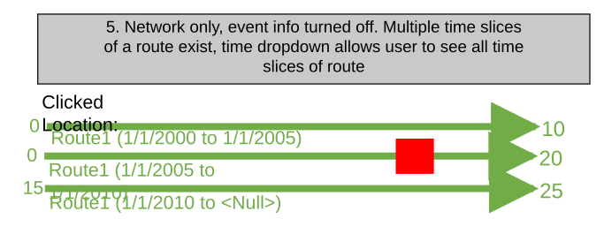

### TC-U06 — Network and Event Info Turned On. Network and Events Have All Fields Configured (case 6) <!-- src: S1 · slide 10 · case 6 -->

- **Case:** Network and event info turned on. Network and events have all fields configured to display

| LRS Identify Results |  |  |  |  |  | X |
| --- | --- | --- | --- | --- | --- | --- |
| Network: | CountyLog |  |  | > |  |  |
| RouteID: | 001 |  |  |  |  |  |
| RouteName: | Route1 |  |  |  |  |  |
| Min Measure: | 0 miles |  |  |  |  |  |
| Max Measure: | 10 miles |  |  |  |  |  |
| Measure: | 5 miles |  |  |  |  |  |
| Time: | 1/1/2000 to <Null> |  |  |  | > |  |
|  |  |  |  |  |  |  |
| Attribute | Value |  |  |  |  |  |
| Jurisdiction | Local |  |  |  |  |  |
| County | Adams |  |  |  |  |  |
| Shape | Polyline ZM |  |  |  |  |  |
| Shape_Length | 52800 |  |  |  |  |  |
| Creation User | User1 |  |  |  |  |  |
| Created Date | 1/1/2000 08:30:10 AM |  |  |  |  |  |
| Last User | User2 |  |  |  |  |  |
| Date Modified | 1/1/2010 09:45:12 AM |  |  |  |  |  |
| GlobalID | {61898661-FCDD-46EB-A83C-1E0E5A6F932A} |  |  |  |  |  |
|  |  |  |  |  |  |  |
| Hide Event Information |  |  | > |  |  |  |
| Speed.Speed_Limit |  | 45 MPH |  |  |  |  |
| Speed.Record_Status |  | Active |  |  |  |  |
| Access_Control.Access |  | No Access |  |  |  |  |
| Access_Control.Record_Status |  | Active |  |  |  |  |
| Facility_Type.Type |  | One-Way |  |  |  |  |
| Facility_Type.Record_Status |  | Active |  |  |  |  |
| Functional_Class.Class |  | Minor |  |  |  |  |
| Functional_Class.Record_Status |  | Active |  |  |  |  |
| Pavement_Condition.Data_Year |  | 2009 |  |  |  |  |
| Pavement_Condition.Record… |  | Retired |  |  |  |  |

| Network Layer | RouteID | Route Name | From Date | ToDate | Jurisdiction | County |
| --- | --- | --- | --- | --- | --- | --- |
| CountyLog | 001 | Route1 | 1/1/2000 | <Null> | Local | Adams |

| Event Layer | RouteID | Route Name | From Date | To Date | From Measure | To Measure | Attribute1 | Attribute2 |
| --- | --- | --- | --- | --- | --- | --- | --- | --- |
| Speed | 001 | Route1 | 1/1/2000 | <Null> | 0 | 10 | 45 MPH | Active |
| Access_Control | 001 | Route1 | 1/1/2000 | <Null> | 0 | 2 | Full Access | Active |
| Access_Control | 001 | Route1 | 1/1/2000 | <Null> | 2 | 10 | No Access | Active |
| Facility_Type | 001 | Route1 | 1/1/2000 | <Null> | 1 | 9 | One-Way | Active |
| Functional_Class | 001 | Route1 | 1/1/2000 | <Null> | 0 | 5 | Minor | Active |
| Pavement_Condition | 001 | Route1 | 1/1/2000 | <Null> | 5 | 10 | 2009 | Retired |

[figure: 0 · 10 · Clicked Location: · Route1]

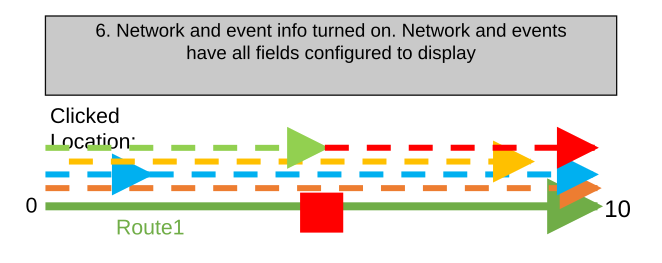

### TC-U07 — Network and Event Info Turned On. Network and Events Have Some Fields Configured (case 7) <!-- src: S1 · slide 11 · case 7 -->

- **Case:** Network and event info turned on. Network and events have some fields configured to display

| LRS Identify Results |  |  |  |  |  | X |
| --- | --- | --- | --- | --- | --- | --- |
| Network: | CountyLog |  |  | > |  |  |
| RouteID: | 001 |  |  |  |  |  |
| RouteName: | Route1 |  |  |  |  |  |
| Min Measure: | 0 miles |  |  |  |  |  |
| Max Measure: | 10 miles |  |  |  |  |  |
| Measure: | 5 miles |  |  |  |  |  |
| Time: | 1/1/2000 to <Null> |  |  |  | > |  |
|  |  |  |  |  |  |  |
| Attribute | Value |  |  |  |  |  |
| Jurisdiction | Local |  |  |  |  |  |
| County | Adams |  |  |  |  |  |
|  |  |  |  |  |  |  |
| Hide Event Information |  |  | > |  |  |  |
| Speed.Record_Status |  | Active |  |  |  |  |
| Access_Control.Access |  | No Access |  |  |  |  |
| Facility_Type.Record_Sta… |  | Active |  |  |  |  |
| Functional_Class.Class |  | Minor |  |  |  |  |
| Pavement_Condition.Dat… |  | 2009 |  |  |  |  |

| Network Layer | RouteID | Route Name | From Date | ToDate | Jurisdiction | County |
| --- | --- | --- | --- | --- | --- | --- |
| CountyLog | 001 | Route1 | 1/1/2000 | <Null> | Local | Adams |

| Event Layer | RouteID | Route Name | From Date | To Date | From Measure | To Measure | Attribute1 | Attribute2 |
| --- | --- | --- | --- | --- | --- | --- | --- | --- |
| Speed | 001 | Route1 | 1/1/2000 | <Null> | 0 | 10 | 45 MPH | Active |
| Access_Control | 001 | Route1 | 1/1/2000 | <Null> | 0 | 2 | Full Access | Active |
| Access_Control | 001 | Route1 | 1/1/2000 | <Null> | 2 | 10 | No Access | Active |
| Facility_Type | 001 | Route1 | 1/1/2000 | <Null> | 1 | 9 | One-Way | Active |
| Functional_Class | 001 | Route1 | 1/1/2000 | <Null> | 0 | 5 | Minor | Active |
| Pavement_Condition | 001 | Route1 | 1/1/2000 | <Null> | 5 | 10 | 2009 | Retired |

[figure: 0 · 10 · Clicked Location: · Route1 · Returned Result:]

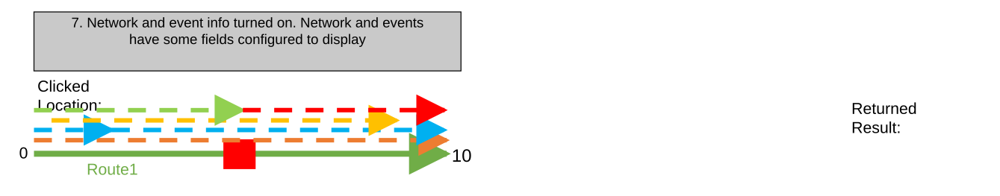

### TC-U08 — Use the Configured Map Tolerance To Determine Whether a Route Is Present (case 8) <!-- src: S1 · slide 12 · case 8 -->

- **Case:** Use the configured map tolerance to determine whether a route is present and the clicked location

| LRS Identify Results |  |  |  |  |  | X |
| --- | --- | --- | --- | --- | --- | --- |
| Network: | CountyLog |  |  | > |  |  |
| RouteID: | 001 |  |  |  |  |  |
| RouteName: | Route1 |  |  |  |  |  |
| Min Measure: | 0 miles |  |  |  |  |  |
| Max Measure: | 10 miles |  |  |  |  |  |
| Measure: | 5 miles |  |  |  |  |  |
| Time: | 1/1/2000 to <Null> |  |  |  | > |  |
|  |  |  |  |  |  |  |
| Attribute | Value |  |  |  |  |  |
| Jurisdiction | Local |  |  |  |  |  |
| County | Adams |  |  |  |  |  |
|  |  |  |  |  |  |  |
| Hide Event Information |  |  | > |  |  |  |
| No event information to display |  |  |  |  |  |  |

| Network Layer | RouteID | Route Name | From Date | ToDate | Jurisdiction | County |
| --- | --- | --- | --- | --- | --- | --- |
| CountyLog | 001 | Route1 | 1/1/2000 | <Null> | Local | Adams |

[figure: 0 · 10 · Returned Result: · Clicked Location: · Route1]

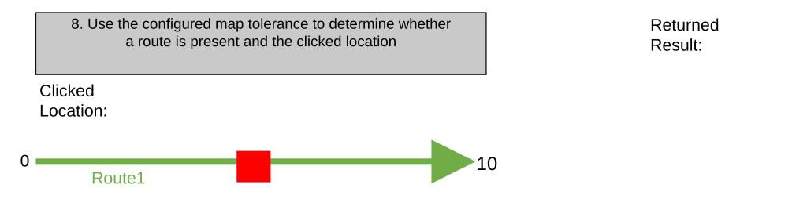

### TC-U09 — Network and Event Info Turned On. Some Events in the Configured Attribute Set (case 9) <!-- src: S1 · slide 13 · case 9 -->

- **Case:** Network and event info turned on. Some events in the configured Attribute Set exist at the clicked location and only these events will be returned

| LRS Identify Results |  |  |  |  |  | X |
| --- | --- | --- | --- | --- | --- | --- |
| Network: | CountyLog |  |  | > |  |  |
| RouteID: | 001 |  |  |  |  |  |
| RouteName: | Route1 |  |  |  |  |  |
| Min Measure: | 0 miles |  |  |  |  |  |
| Max Measure: | 10 miles |  |  |  |  |  |
| Measure: | 5 miles |  |  |  |  |  |
| Time: | 1/1/2000 to <Null> |  |  |  | > |  |
|  |  |  |  |  |  |  |
| Attribute | Value |  |  |  |  |  |
| Jurisdiction | Local |  |  |  |  |  |
| County | Adams |  |  |  |  |  |
| Shape | Polyline ZM |  |  |  |  |  |
| Shape_Length | 52800 |  |  |  |  |  |
| Creation User | User1 |  |  |  |  |  |
| Created Date | 1/1/2000 08:30:10 AM |  |  |  |  |  |
| Last User | User2 |  |  |  |  |  |
| Date Modified | 1/1/2010 09:45:12 AM |  |  |  |  |  |
| GlobalID | {61898661-FCDD-46EB-A83C-1E0E5A6F932A} |  |  |  |  |  |
|  |  |  |  |  |  |  |
| Hide Event Information |  |  | > |  |  |  |
| Speed.Speed_Limit |  | 45 MPH |  |  |  |  |
| Speed.Record_Status |  | Active |  |  |  |  |
| Access_Control.Access |  | No Access |  |  |  |  |
| Access_Control.Record_Status |  | Active |  |  |  |  |
| Pavement_Condition.Data_Year |  | 2009 |  |  |  |  |
| Pavement_Condition.Record… |  | Retired |  |  |  |  |

| Network Layer | RouteID | Route Name | From Date | ToDate | Jurisdiction | County |
| --- | --- | --- | --- | --- | --- | --- |
| CountyLog | 001 | Route1 | 1/1/2000 | <Null> | Local | Adams |

| Event Layer | RouteID | Route Name | From Date | To Date | From Measure | To Measure | Attribute1 | Attribute2 |
| --- | --- | --- | --- | --- | --- | --- | --- | --- |
| Speed | 001 | Route1 | 1/1/2000 | <Null> | 0 | 10 | 45 MPH | Active |
| Access_Control | 001 | Route1 | 1/1/2000 | <Null> | 0 | 2 | Full Access | Active |
| Access_Control | 001 | Route1 | 1/1/2000 | <Null> | 2 | 10 | No Access | Active |
| Facility_Type | 001 | Route1 | 1/1/2000 | <Null> | 1 | 9 | One-Way | Active |
| Functional_Class | 001 | Route1 | 1/1/2000 | <Null> | 0 | 5 | Minor | Active |
| Pavement_Condition | 001 | Route1 | 1/1/2000 | <Null> | 5 | 10 | 2009 | Retired |

[figure: 0 · 10 · Clicked Location: · Route1]

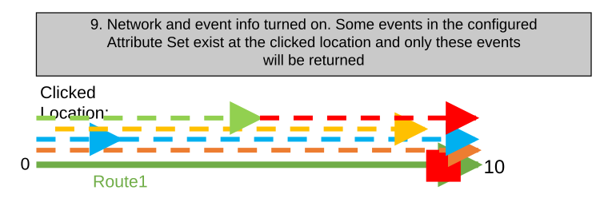

### TC-U10 — Line Network and Event Info Turned On. Spanning Events Exist at the Clicked (case 10) <!-- src: S1 · slide 14 · case 10 -->

- **Case:** Line network and event info turned on. Spanning events exist at the clicked location

| LRS Identify Results |  |  |  |  |  | X |
| --- | --- | --- | --- | --- | --- | --- |
| Network: | CountyLog |  |  | > |  |  |
| RouteID: | 002 |  |  |  |  |  |
| RouteName: | Route2 |  |  |  |  |  |
| Min Measure: | 20 miles |  |  |  |  |  |
| Max Measure: | 30 miles |  |  |  |  |  |
| Measure: | 25 miles |  |  |  |  |  |
| Time: | 1/1/2000 to <Null> |  |  |  | > |  |
|  |  |  |  |  |  |  |
| Attribute | Value |  |  |  |  |  |
| Location | Midstream |  |  |  |  |  |
| Status | Active |  |  |  |  |  |
| Line ID | 001 |  |  |  |  |  |
| Line Name | Line 1 |  |  |  |  |  |
|  |  |  |  |  |  |  |
| Hide Event Information |  |  | > |  |  |  |
| DOT_Class.Class |  | Class 1 |  |  |  |  |
| DOT_Class.Record_Status |  | Active |  |  |  |  |
| Operating_Pressure.Pre … |  | 200 |  |  |  |  |
| Operating_Pressure.Rec … |  | Active |  |  |  |  |
| Inspection_Range.Type |  | Gas Leak |  |  |  |  |
| Inspection_Range.Record … |  | Active |  |  |  |  |
| Pipe_Crossing.Type |  | Transportation |  |  |  |  |
| Pipe_Crossing.Record_St … |  | Active |  |  |  |  |

| Network Layer | LineID | Line Name | RouteID | Route Name | From Date | ToDate | Location | Status |
| --- | --- | --- | --- | --- | --- | --- | --- | --- |
| Engineering | Line001 | Line1 | 001 | Route1 | 1/1/2000 | <Null> | Upstream | Active |
| Engineering | Line001 | Line1 | 002 | Route2 | 1/1/2000 | <Null> | Midstream | Active |

| Event Layer | From RouteID | From Route Name | To RouteID | ToRoute Name | From Date | To Date | From Measure | To Measure | Attribute1 | Attribute2 |
| --- | --- | --- | --- | --- | --- | --- | --- | --- | --- | --- |
| DOT_Class | 001 | Route1 | 002 | Route2 | 1/1/2000 | <Null> | 0 | 30 | Class 1 | Active |
| Operating_Pressure | 001 | Route1 | 001 | Route1 | 1/1/2000 | <Null> | 0 | 4 | 500 | Active |
| Operating_Pressure | 00 | Route1 | 002 | Route2 | 1/1/2000 | <Null> | 4 | 30 | 200 | Active |
| Inspection_Range | 001 | Route1 | 002 | Route2 | 1/1/2000 | <Null> | 1 | 29 | Gas Leak | Active |
| Consequence_Segment | 001 | Route1 | 001 | Route1 | 1/1/2000 | <Null> | 0 | 10 | Installed | Active |
| Pipe_Crossing | 002 | Route2 | 002 | Route2 | 1/1/2000 | <Null> | 20 | 30 | Transportation | Retired |

[figure: 0 · 10 · Returned Result: · Clicked Location: · Route1 · 20 · 30]

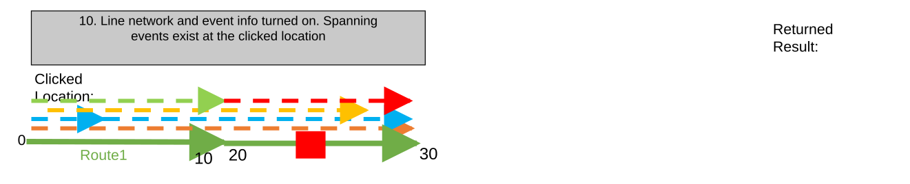

### TC-U11 — PoM network. Only network information is returned (case 11) <!-- src: S2 · slide 15 · case 11 -->

| LRS Identify Results |  |  |  |  |  | X |
| --- | --- | --- | --- | --- | --- | --- |
| Network: | PoM |  |  | > |  |  |
| RouteID: | SHA005.R.R |  |  |  |  |  |
| Min Measure: | 0 miles |  |  |  |  |  |
| Max Measure: | 10 miles |  |  |  |  |  |
| Measure: | 8 miles |  |  |  |  |  |
| Time: | 1/1/2000 to <Null> |  |  |  | > |  |
|  |  |  |  |  |  |  |
| Attribute | Value |  |  |  |  |  |
| County | Shasta |  |  |  |  |  |
| RouteNum | 005 |  |  |  |  |  |
| RouteSuffix | No Route Suffix |  |  |  |  |  |
| PMPrefix | First realignment |  |  |  |  |  |
| PMSuffix | No Suffix |  |  |  |  |  |
| Alignment | Right |  |  |  |  |  |
|  |  |  |  |  |  |  |
| Hide Event Information |  |  | > |  |  |  |
| No event information to display |  |  |  |  |  |  |

| Network Layer | LineID | RouteID | From Date | ToDate | County | Route Num | Route Suffix | PM Prefix | PM Suffix | Alignment |
| --- | --- | --- | --- | --- | --- | --- | --- | --- | --- | --- |
| PoM | 005R | SHA005.R.R | 1/1/2000 | <Null> | Shasta | 005 | No Route Suffix | First realignment | No Suffix | Right |
| PoM | 005L | SHA005U..R | 1/1/2000 | <Null> | Shasta | 005 | Unrelinquished | No Prefix | No Suffix | Right |

[figure: 0 · 10 · Returned Result: · Clicked Location: · SHA005.R.R · 4 · 3 · 5 · 6 · SHA005U..R]

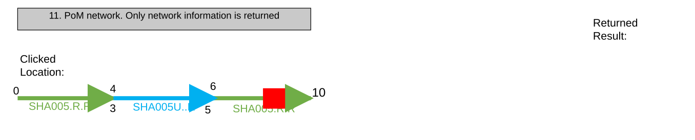

### TC-U12 — Network and Event Info Turned On. Multiple Time Slices of the Same Route and Its (case 12) <!-- src: S1 · slide 16 · case 12 -->

- **Case:** Network and event info turned on. Multiple time slices of the same route and its events exist at the clicked location.

| Network Layer | RouteID | Route Name | From Date | ToDate | Jurisdiction | County |
| --- | --- | --- | --- | --- | --- | --- |
| CountyLog | 001 | Route1 | 1/1/2000 | 1/1/2005 | Local | Shasta |
| CountyLog | 001 | Route1 | 1/1/2005 | 1/1/2010 | State | Lassen |
| CountyLog | 001 | Route1 | 1/1/2010 | <Null> | Federal | Shasta |

| Event Layer | EventID | RouteID | Route Name | From Date | To Date | From Measure | To Measure | Attribute1 | Attribute2 |
| --- | --- | --- | --- | --- | --- | --- | --- | --- | --- |
| Speed | Speed1 | 001 | Route1 | 1/1/2000 | 1/1/2005 | 0 | 10 | 45 MPH | Retired |
| Speed | Speed1 | 001 | Route1 | 1/1/2005 | 1/1/2010 | 0 | 10 | 45 MPH | Retired |
| Speed | Speed2 | 001 | Route1 | 1/1/2010 | <Null> | 0 | 50 | 65 MPH | Active |
| Access_Control | Access1 | 001 | Route1 | 1/1/2000 | 1/1/2005 | 0 | 2 | Full Access | Retired |
| Access_Control | Access1 | 001 | Route1 | 1/1/2005 | 1/1/2010 | 0 | 2 | Full Access | Retired |
| Access_Control | Access3 | 001 | Route1 | 1/1/2010 | <Null> | 0 | 10 | No Access | Active |
| Access_Control | Access2 | 001 | Route1 | 1/1/2000 | 1/1/2005 | 2 | 10 | No Access | Retired |
| Access_Control | Access2 | 001 | Route1 | 1/1/2005 | 1/1/2010 | 2 | 10 | No Access | Retired |
| Access_Control | Access4 | 001 | Route1 | 1/1/2010 | <Null> | 10 | 50 | Full Access | Active |
| Facility_Type | Facility1 | 001 | Route1 | 1/1/2000 | 1/1/2005 | 1 | 9 | One-Way | Retired |
| Facility_Type | Facility1 | 001 | Route1 | 1/1/2005 | 1/1/2010 | 1 | 9 | One-Way | Retired |
| Facility_Type | Facility2 | 001 | Route1 | 1/1/2010 | <Null> | 5 | 45 | Two-Way | Active |
| Functional_Class | Func1 | 001 | Route1 | 1/1/2000 | 1/1/2005 | 0 | 5 | Minor | Retired |
| Functional_Class | Func1 | 001 | Route1 | 1/1/2005 | 1/1/2010 | 0 | 5 | Minor | Retired |
| Functional_Class | Func2 | 001 | Route1 | 1/1/2010 | <Null> | 0 | 25 | Major | Active |
| Pavement_Condition | Pave1 | 001 | Route1 | 1/1/2000 | 1/1/2005 | 5 | 10 | 2009 | Retired |

1/1/2005-1/1/2010 Time Slice

[figure: 0 · 10 · Route1 · 20 · 50 · 1/1/2010-Null Time Slice]

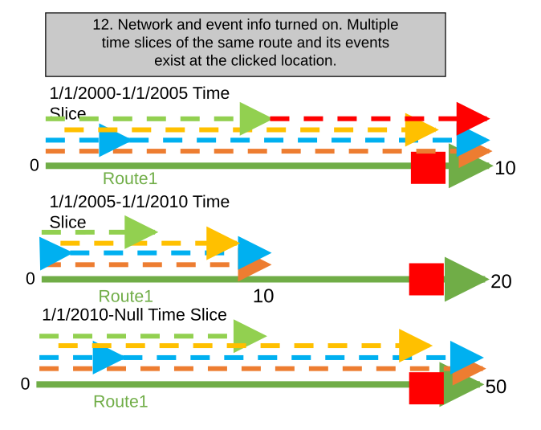

### TC-U13 — Network and Event Info Turned On. Multiple Time Slices of the Same Route and Its (case 12) <!-- src: S1 · slide 17 · case 12 -->

- **Case:** Network and event info turned on. Multiple time slices of the same route and its events exist at the clicked location. (Continued)

1/1/2000-1/1/2005 Time Slice

| LRS Identify Results |  |  |  |  |  | X |
| --- | --- | --- | --- | --- | --- | --- |
| Network: | CountyLog |  |  | > |  |  |
| RouteID: | 001 |  |  |  |  |  |
| RouteName: | Route1 |  |  |  |  |  |
| Min Measure: | 0 miles |  |  |  |  |  |
| Max Measure: | 20 miles |  |  |  |  |  |
| Measure: | 18 miles |  |  |  |  |  |
| Time: | 1/1/2005 to 1/1/2010 |  |  |  | > |  |
|  |  |  |  |  |  |  |
| Attribute | Value |  |  |  |  |  |
| Jurisdiction | State |  |  |  |  |  |
| County | Lassen |  |  |  |  |  |
|  |  |  |  |  |  |  |
| Hide Event Information |  |  | > |  |  |  |
| No event information to display |  |  |  |  |  |  |

1/1/2005-1/1/2010 Time Slice

1/1/2010-<Null> Time Slice

| LRS Identify Results |  |  |  |  |  |  | X |
| --- | --- | --- | --- | --- | --- | --- | --- |
| Network: | CountyLog |  |  |  | > |  |  |
| RouteID: | 001 |  |  |  |  |  |  |
| RouteName: | Route1 |  |  |  |  |  |  |
| Min Measure: | 0 miles |  |  |  |  |  |  |
| Max Measure: | 10 miles |  |  |  |  |  |  |
| Measure: | 9 miles |  |  |  |  |  |  |
| Time: | 1/1/2000-1/1/2005 |  |  |  |  | > |  |
|  |  |  |  |  |  |  |  |
| Attribute | Value |  |  |  |  |  |  |
| Jurisdiction | Local |  |  |  |  |  |  |
| County | Shasta |  |  |  |  |  |  |
|  |  |  |  |  |  |  |  |
| Hide Event Information |  |  |  | > |  |  |  |
| Speed.SpeedLimit |  |  | 45 MPH |  |  |  |  |
| Speed.Record_Status |  |  | Retired |  |  |  |  |
| Access_Control.Access |  |  | Full Access |  |  |  |  |
| Access_Control.Record_S … |  |  | Retired |  |  |  |  |
| Facility_Type.Type |  |  | One-Way |  |  |  |  |
| Facility_Type.Record_Sta… |  |  | Retired |  |  |  |  |
| Pavement_Condition.Dat... |  |  | 2009 |  |  |  |  |
| Pavement_Condition.Rec … |  |  | Retired |  |  |  |  |

| LRS Identify Results |  |  |  |  |  |  | X |
| --- | --- | --- | --- | --- | --- | --- | --- |
| Network: | CountyLog |  |  |  | > |  |  |
| RouteID: | 001 |  |  |  |  |  |  |
| RouteName: | Route1 |  |  |  |  |  |  |
| Min Measure: | 0 miles |  |  |  |  |  |  |
| Max Measure: | 50 miles |  |  |  |  |  |  |
| Measure: | 45 miles |  |  |  |  |  |  |
| Time: | 1/1/2010 to <Null> |  |  |  |  | > |  |
|  |  |  |  |  |  |  |  |
| Attribute | Value |  |  |  |  |  |  |
| Jurisdiction | Federal |  |  |  |  |  |  |
| County | Shasta |  |  |  |  |  |  |
|  |  |  |  |  |  |  |  |
| Hide Event Information |  |  |  | > |  |  |  |
| Speed.SpeedLimit |  |  | 65 MPH |  |  |  |  |
| Speed.Record_Status |  |  | Active |  |  |  |  |
| Access_Control.Access |  |  | No Access |  |  |  |  |
| Access_Control.Record_S … |  |  | Active |  |  |  |  |
| Facility_Type.Type |  |  | Two-Way |  |  |  |  |
| Facility_Type.Record_Sta… |  |  | Active |  |  |  |  |

[figure: 0 · 10 · Route1 · 20 · 50]

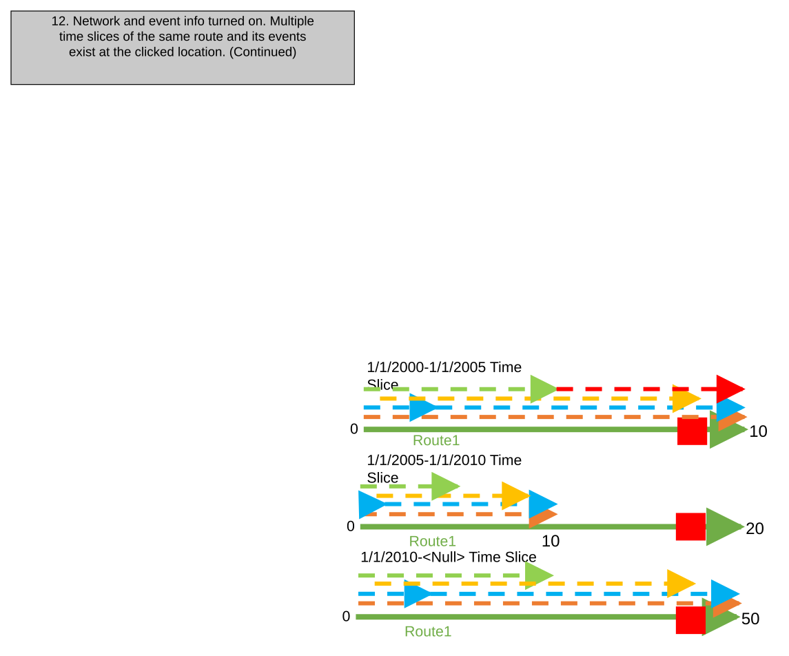

### TC-U14 — Network and Event Info Turned On. Multiple Overlapping Events Within the Same (case 13) <!-- src: S1 · slide 18 · case 13 -->

- **Case:** Network and event info turned on. Multiple overlapping events within the same event layer exist at the clicked location

| LRS Identify Results |  |  |  |  |  | X |
| --- | --- | --- | --- | --- | --- | --- |
| Network: | CountyLog |  |  | > |  |  |
| RouteID: | 001 |  |  |  |  |  |
| RouteName: | Route1 |  |  |  |  |  |
| Min Measure: | 0 miles |  |  |  |  |  |
| Max Measure: | 10 miles |  |  |  |  |  |
| Measure: | 4 miles |  |  |  |  |  |
| Time: | 1/1/2000 to <Null> |  |  |  | > |  |
|  |  |  |  |  |  |  |
| Attribute | Value |  |  |  |  |  |
| Jurisdiction | Local |  |  |  |  |  |
| County | Adams |  |  |  |  |  |
|  |  |  |  |  |  |  |
| Hide Event Information |  |  | > |  |  |  |
| Speed.Speed_Limit (1) |  | 45MPH |  |  |  |  |
| Speed.Record_Status (1) |  | Active |  |  |  |  |
| Speed.Speed_Limit (2) |  | 55 MPH |  |  |  |  |
| Speed.Record_Status (2) |  | Proposed |  |  |  |  |
| Speed.Speed_Limit (3) |  | 50 MPH |  |  |  |  |
| Speed.Record_Status (3) |  | Proposed |  |  |  |  |

| Network Layer | RouteID | Route Name | From Date | ToDate | Jurisdiction | County |
| --- | --- | --- | --- | --- | --- | --- |
| CountyLog | 001 | Route1 | 1/1/2000 | <Null> | Local | Adams |

| Event Layer | EventID | RouteID | Route Name | From Date | To Date | From Measure | To Measure | Attribute1 | Attribute2 |
| --- | --- | --- | --- | --- | --- | --- | --- | --- | --- |
| Speed | Speed1 | 001 | Route1 | 1/1/2000 | <Null> | 0 | 10 | 45 MPH | Active |
| Speed | Speed2 | 001 | Route1 | 1/1/2000 | <Null> | 0 | 5 | 55 MPH | Proposed |
| Speed | Speed3 | 001 | Route1 | 1/1/2000 | <Null> | 2 | 10 | 50 MPH | Proposed |

[figure: 0 · 10 · Returned Result: · Clicked Location: · Route1]

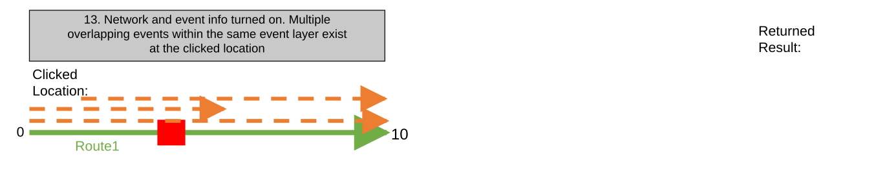

### TC-U15 — Network and Event Info Turned On. Clicked Location Is the Exact Overlapping (case 14) <!-- src: S1 · slide 19 · case 14 -->

- **Case:** Network and event info turned on. Clicked location is the exact overlapping measure of two events within the same event layer

| LRS Identify Results |  |  |  |  |  | X |
| --- | --- | --- | --- | --- | --- | --- |
| Network: | CountyLog |  |  | > |  |  |
| RouteID: | 001 |  |  |  |  |  |
| RouteName: | Route1 |  |  |  |  |  |
| Min Measure: | 0 miles |  |  |  |  |  |
| Max Measure: | 10 miles |  |  |  |  |  |
| Measure: | 5 miles |  |  |  |  |  |
| Time: | 1/1/2000 to <Null> |  |  |  | > |  |
|  |  |  |  |  |  |  |
| Attribute | Value |  |  |  |  |  |
| Jurisdiction | Local |  |  |  |  |  |
| County | Adams |  |  |  |  |  |
|  |  |  |  |  |  |  |
| Hide Event Information |  |  | > |  |  |  |
| Speed.Speed_Limit (1) |  | 45MPH |  |  |  |  |
| Speed.Record_Status (1) |  | Active |  |  |  |  |
| Speed.Speed_Limit (2) |  | 55 MPH |  |  |  |  |
| Speed.Record_Status (2) |  | Proposed |  |  |  |  |
| Speed.Speed_Limit (3) |  | 50 MPH |  |  |  |  |
| Speed.Record_Status (3) |  | Proposed |  |  |  |  |

| Network Layer | RouteID | Route Name | From Date | ToDate | Jurisdiction | County |
| --- | --- | --- | --- | --- | --- | --- |
| CountyLog | 001 | Route1 | 1/1/2000 | <Null> | Local | Adams |

| Event Layer | EventID | RouteID | Route Name | From Date | To Date | From Measure | To Measure | Attribute1 | Attribute2 |
| --- | --- | --- | --- | --- | --- | --- | --- | --- | --- |
| Speed | Speed1 | 001 | Route1 | 1/1/2000 | <Null> | 0 | 10 | 45 MPH | Active |
| Speed | Speed2 | 001 | Route1 | 1/1/2000 | <Null> | 0 | 5 | 55 MPH | Proposed |
| Speed | Speed3 | 001 | Route1 | 1/1/2000 | <Null> | 5 | 10 | 50 MPH | Proposed |

[figure: 0 · 10 · Returned Result: · Clicked Location: · Route1]

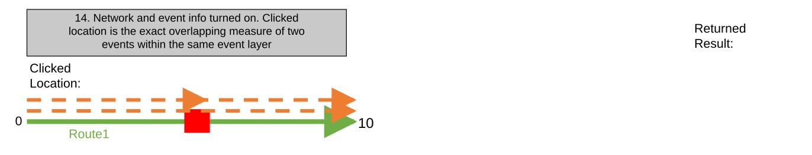

### TC-U16 — Network and Event Info Turned On. Multiple Measures on the Same Route Exist (case 15) <!-- src: S1 · slide 20 · case 15 -->

- **Case:** Network and event info turned on. Multiple measures on the same route exist at the clicked location

| LRS Identify Results |  |  |  |  |  | X |
| --- | --- | --- | --- | --- | --- | --- |
| Network: | CountyLog |  |  | > |  |  |
| RouteID: | 001 |  |  |  |  |  |
| RouteName: | Route1 |  |  |  |  |  |
| Min Measure: | 0 miles |  |  |  |  |  |
| Max Measure: | 10 miles |  |  |  |  |  |
| Measure: | 2 miles |  |  |  |  |  |
|  | 8 miles |  |  |  |  |  |
| Time: | 1/1/2000 to <Null> |  |  |  | > |  |
|  |  |  |  |  |  |  |
| Attribute | Value |  |  |  |  |  |
| Jurisdiction | Local |  |  |  |  |  |
| County | Adams |  |  |  |  |  |
|  |  |  |  |  |  |  |
| Hide Event Information |  |  | > |  |  |  |
| Speed.Speed_Limit (1) |  | 45 MPH |  |  |  |  |
| Speed.Record_Status (1) |  | Active |  |  |  |  |
| Speed.Speed_Limit (2) |  | 35 MPH |  |  |  |  |
| Speed.Record_Status (2) |  | Active |  |  |  |  |

| Network Layer | RouteID | Route Name | From Date | ToDate | Jurisdiction | County |
| --- | --- | --- | --- | --- | --- | --- |
| CountyLog | 001 | Route1 | 1/1/2000 | <Null> | Local | Adams |

| Event Layer | EventID | RouteID | Route Name | From Date | To Date | From Measure | To Measure | Attribute1 | Attribute2 |
| --- | --- | --- | --- | --- | --- | --- | --- | --- | --- |
| Speed | Speed1 | 001 | Route1 | 1/1/2000 | <Null> | 0 | 4 | 45 MPH | Active |
| Speed | Speed2 | 001 | Route1 | 1/1/2000 | <Null> | 4 | 10 | 35 MPH | Active |

[figure: 0 · 10 · Returned Result: · Clicked Location: · Route1]

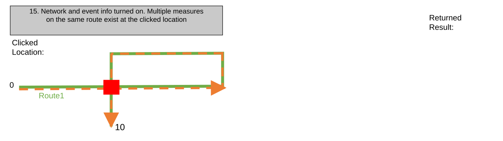
[connections: (rect 3) — (rect 3)]

### TC-U17 — Network and Event Info Turned On. Multiple Routes Within Different LRS Networks (case 16) <!-- src: S1 · slide 21 · case 16 -->

- **Case:** Network and event info turned on. Multiple routes within different LRS networks exist at the clicked location

| Network Layer | RouteID | Route Name | From Date | ToDate | Attribute1 | Attribute2 |
| --- | --- | --- | --- | --- | --- | --- |
| CountyLog | 001 | Route1 | 1/1/2000 | <Null> | Local | Adams |
| StateLog | SR15 | Route15 | 1/1/2000 | <Null> | No Toll | North |
| AllRoads | 045 | Road45 | 1/1/2000 | <Null> | Paved | Year-Round |

| Event Layer | RouteID | Route Name | From Date | To Date | From Measure | To Measure | Attribute1 | Attribute2 |
| --- | --- | --- | --- | --- | --- | --- | --- | --- |
| Speed | 001 | Route1 | 1/1/2000 | <Null> | 0 | 10 | 45 MPH | Active |
| Access_Control | 001 | Route1 | 1/1/2000 | <Null> | 0 | 2 | Full Access | Active |
| Access_Control | 001 | Route1 | 1/1/2000 | <Null> | 2 | 10 | No Access | Active |
| Facility_Type | 001 | Route1 | 1/1/2000 | <Null> | 1 | 9 | One-Way | Active |
| Functional_Class | 001 | Route1 | 1/1/2000 | <Null> | 0 | 5 | Minor | Active |

| Event Layer | RouteID | Route Name | From Date | To Date | From Measure | To Measure | Attribute1 | Attribute2 |
| --- | --- | --- | --- | --- | --- | --- | --- | --- |
| Inspection | SR15 | Route15 | 1/1/2000 | <Null> | 5 | 15 | Inspected | Active |
| State_Budget | SR15 | Route15 | 1/1/2000 | <Null> | 7 | 12 | $500,000 | Active |

| Event Layer | RouteID | Route Name | From Date | To Date | From Measure | To Measure | Attribute1 | Attribute2 |
| --- | --- | --- | --- | --- | --- | --- | --- | --- |
| Drainage | 045 | Road45 | 1/1/2000 | <Null> | 0 | 26400 | Partial Flooding | Active |
| Shoulder | 045 | Road45 | 1/1/2000 | <Null> | 0 | 13200 | None | Active |
| Shoulder | 045 | Road45 | 1/1/2000 | <Null> | 13200 | 26400 | Low | Proposed |

[figure: 5 mi · 10 mi · Route1 · 15 mi · Route15 · Road45 · 0 ft · 0 mi · 26400 ft]

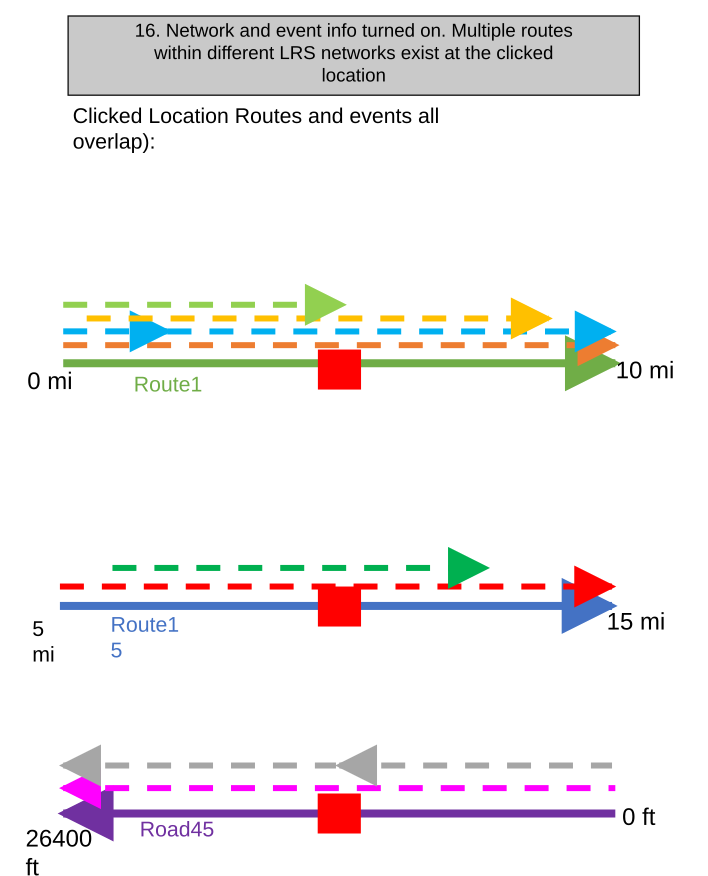

### TC-U18 — Network and Event Info Turned On. Multiple Routes Within Different LRS Networks (case 16) <!-- src: S1 · slide 22 · case 16 -->

- **Case:** Network and event info turned on. Multiple routes within different LRS networks exist at the clicked location (Continued)

| LRS Identify Results |  |  |  |  |  | X |
| --- | --- | --- | --- | --- | --- | --- |
| Network: | CountyLog |  |  | > |  |  |
| RouteID: | 001 |  |  |  |  |  |
| RouteName: | Route1 |  |  |  |  |  |
| Min Measure: | 0 miles |  |  |  |  |  |
| Max Measure: | 10 miles |  |  |  |  |  |
| Measure: | 5 miles |  |  |  |  |  |
| Time: | 1/1/2000 to <Null> |  |  |  | > |  |
|  |  |  |  |  |  |  |
| Attribute | Value |  |  |  |  |  |
| Jurisdiction | Local |  |  |  |  |  |
| County | Adams |  |  |  |  |  |
|  |  |  |  |  |  |  |
| Hide Event Information |  |  | > |  |  |  |
| Speed.Speed_Limit |  | 45 MPH |  |  |  |  |
| Speed.Record_Status |  | Retired |  |  |  |  |
| Access_Control.Access |  | Full Access |  |  |  |  |
| Access_Control.Recor … |  | Retired |  |  |  |  |
| Facility_Type.Type |  | One-Way |  |  |  |  |
| Facility_Type.Record … |  | Retired |  |  |  |  |

| LRS Identify Results |  |  |  |  |  | X |
| --- | --- | --- | --- | --- | --- | --- |
| Network: | StateLog |  |  | > |  |  |
| RouteID: | SR15 |  |  |  |  |  |
| RouteName: | Route15 |  |  |  |  |  |
| Min Measure: | 5 miles |  |  |  |  |  |
| Max Measure: | 15 miles |  |  |  |  |  |
| Measure: | 10 miles |  |  |  |  |  |
| Time: | 1/1/2000 to <Null> |  |  |  | > |  |
|  |  |  |  |  |  |  |
| Attribute | Value |  |  |  |  |  |
| Toll_Status | No Toll |  |  |  |  |  |
| Direction | North |  |  |  |  |  |
|  |  |  |  |  |  |  |
| Hide Event Information |  |  | > |  |  |  |
| Inspection.Status |  | Inspected |  |  |  |  |
| Inspection.Record_St … |  | Active |  |  |  |  |
| State_Budget.Amount |  | $500,000 |  |  |  |  |
| State_Budget.Record … |  | Active |  |  |  |  |

| LRS Identify Results |  |  |  |  |  | X |
| --- | --- | --- | --- | --- | --- | --- |
| Network: | AllRoads |  |  | > |  |  |
| RouteID: | 045 |  |  |  |  |  |
| RouteName: | Road45 |  |  |  |  |  |
| Min Measure: | 0 feet |  |  |  |  |  |
| Max Measure: | 26400 ft |  |  |  |  |  |
| Measure: | 13200 ft |  |  |  |  |  |
| Time: | 1/1/2000 to <Null> |  |  |  | > |  |
|  |  |  |  |  |  |  |
| Attribute | Value |  |  |  |  |  |
| Surface | Paved |  |  |  |  |  |
| Seasonality | Year-Round |  |  |  |  |  |
|  |  |  |  |  |  |  |
| Hide Event Information |  |  | > |  |  |  |
| Drainage.Drainage |  | Partial Flooding |  |  |  |  |
| Drainage.Record_Sta … |  | Active |  |  |  |  |
| Shoulder.Type (1) |  | None |  |  |  |  |
| Shoulder.Record_S … (1) |  | Active |  |  |  |  |
| Shoulder.Type (2) |  | Low |  |  |  |  |
| Shoulder.Record_S … (2) |  | Proposed |  |  |  |  |

### TC-U19 — Network and Event Info Turned On. Clicked Location Is the Intersection of 2 (case 17) <!-- src: S1 · slide 23 · case 17 -->

- **Case:** Network and event info turned on. Clicked location is the intersection of 2 routes

| Network Layer | RouteID | Route Name | From Date | ToDate | Attribute1 | Attribute2 |
| --- | --- | --- | --- | --- | --- | --- |
| CountyLog | 001 | Route1 | 1/1/2000 | <Null> | Local | Adams |
| StateLog | SR15 | Route15 | 1/1/2000 | <Null> | No Toll | North |

| Event Layer | RouteID | Route Name | From Date | To Date | From Measure | To Measure | Attribute1 | Attribute2 |
| --- | --- | --- | --- | --- | --- | --- | --- | --- |
| Speed | 001 | Route1 | 1/1/2000 | <Null> | 0 | 10 | 45 MPH | Active |
| Access_Control | 001 | Route1 | 1/1/2000 | <Null> | 0 | 2 | Full Access | Active |
| Access_Control | 001 | Route1 | 1/1/2000 | <Null> | 2 | 10 | No Access | Active |
| Facility_Type | 001 | Route1 | 1/1/2000 | <Null> | 1 | 9 | One-Way | Active |
| Functional_Class | 001 | Route1 | 1/1/2000 | <Null> | 0 | 5 | Minor | Active |

| Event Layer | RouteID | Route Name | From Date | To Date | From Measure | To Measure | Attribute1 | Attribute2 |
| --- | --- | --- | --- | --- | --- | --- | --- | --- |
| Inspection | SR15 | Route15 | 1/1/2000 | <Null> | 5 | 15 | Inspected | Active |
| State_Budget | SR15 | Route15 | 1/1/2000 | <Null> | 7 | 12 | $500,000 | Active |

[figure: 5 mi · 10 mi · Clicked Location: · Route1 · 15 mi · Route15 · 0 mi]

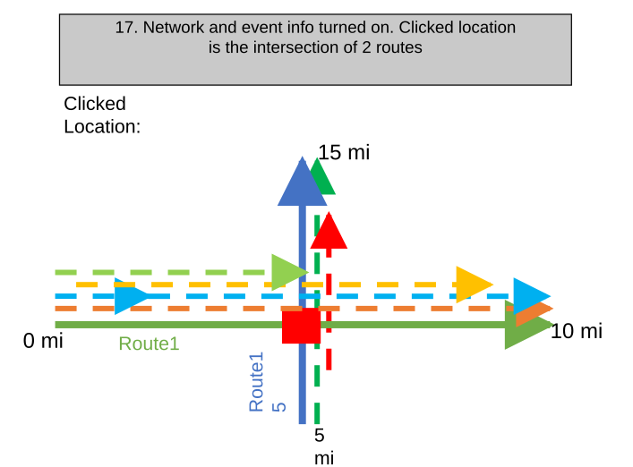

### TC-U20 — Network and Event Info Turned On. Clicked Location Is the Intersection of 2 (case 17) <!-- src: S1 · slide 24 · case 17 -->

- **Case:** Network and event info turned on. Clicked location is the intersection of 2 routes (Continued)

| LRS Identify Results |  |  |  |  |  | X |
| --- | --- | --- | --- | --- | --- | --- |
| Network: | CountyLog |  |  | > |  |  |
| RouteID: | 001 |  |  |  |  |  |
| RouteName: | Route1 |  |  |  |  |  |
| Min Measure: | 0 miles |  |  |  |  |  |
| Max Measure: | 10 miles |  |  |  |  |  |
| Measure: | 5 miles |  |  |  |  |  |
| Time: | 1/1/2000 to <Null> |  |  |  | > |  |
|  |  |  |  |  |  |  |
| Attribute | Value |  |  |  |  |  |
| Jurisdiction | Local |  |  |  |  |  |
| County | Adams |  |  |  |  |  |
|  |  |  |  |  |  |  |
| Hide Event Information |  |  | > |  |  |  |
| Speed.Speed_Limit |  | 45 MPH |  |  |  |  |
| Speed.Record_Status |  | Retired |  |  |  |  |
| Access_Control.Access |  | Full Access |  |  |  |  |
| Access_Control.Recor … |  | Retired |  |  |  |  |
| Facility_Type.Type |  | One-Way |  |  |  |  |
| Facility_Type.Record … |  | Retired |  |  |  |  |

| LRS Identify Results |  |  |  |  |  | X |
| --- | --- | --- | --- | --- | --- | --- |
| Network: | StateLog |  |  | > |  |  |
| RouteID: | SR15 |  |  |  |  |  |
| RouteName: | Route15 |  |  |  |  |  |
| Min Measure: | 5 miles |  |  |  |  |  |
| Max Measure: | 15 miles |  |  |  |  |  |
| Measure: | 10 miles |  |  |  |  |  |
| Time: | 1/1/2000 to <Null> |  |  |  | > |  |
|  |  |  |  |  |  |  |
| Attribute | Value |  |  |  |  |  |
| Toll_Status | No Toll |  |  |  |  |  |
| Direction | North |  |  |  |  |  |
|  |  |  |  |  |  |  |
| Hide Event Information |  |  | > |  |  |  |
| Inspection.Status |  | Inspected |  |  |  |  |
| Inspection.Record_St … |  | Active |  |  |  |  |
| State_Budget.Amount |  | $500,000 |  |  |  |  |
| State_Budget.Record … |  | Active |  |  |  |  |

### TC-U21 — Network and Event Info Turned On. Route Has Single Time Slice (case 18) <!-- src: S1 · slide 25 · case 18 -->

- **Case:** Network and event info turned on. Route has single time slice, but events have multiple

| Network Layer | RouteID | Route Name | From Date | ToDate | Jurisdiction | County |
| --- | --- | --- | --- | --- | --- | --- |
| CountyLog | 001 | Route1 | 1/1/2000 | <Null> | Local | Shasta |

| Event Layer | EventID | RouteID | Route Name | From Date | To Date | From Measure | To Measure | Attribute1 | Attribute2 |
| --- | --- | --- | --- | --- | --- | --- | --- | --- | --- |
| Speed | Speed1 | 001 | Route1 | 1/1/2000 | 1/1/2005 | 0 | 10 | 45 MPH | Retired |
| Speed | Speed1 | 001 | Route1 | 1/1/2005 | 1/1/2010 | 0 | 5 | 45 MPH | Retired |
| Speed | Speed2 | 001 | Route1 | 1/1/2010 | <Null> | 0 | 10 | 65 MPH | Active |
| Access_Control | Access1 | 001 | Route1 | 1/1/2000 | 1/1/2005 | 0 | 1 | Full Access | Retired |
| Access_Control | Access1 | 001 | Route1 | 1/1/2005 | 1/1/2010 | 0 | 1 | Full Access | Retired |
| Access_Control | Access3 | 001 | Route1 | 1/1/2010 | <Null> | 0 | 10 | No Access | Active |
| Access_Control | Access2 | 001 | Route1 | 1/1/2000 | 1/1/2005 | 2 | 5 | No Access | Retired |
| Access_Control | Access2 | 001 | Route1 | 1/1/2005 | 1/1/2010 | 2 | 5 | No Access | Retired |
| Access_Control | Access4 | 001 | Route1 | 1/1/2010 | <Null> | 2 | 10 | Full Access | Active |
| Facility_Type | Facility1 | 001 | Route1 | 1/1/2000 | 1/1/2005 | 1 | 9 | One-Way | Retired |
| Facility_Type | Facility1 | 001 | Route1 | 1/1/2005 | 1/1/2010 | 1 | 4 | One-Way | Retired |
| Facility_Type | Facility2 | 001 | Route1 | 1/1/2010 | <Null> | 1 | 9 | Two-Way | Active |
| Functional_Class | Func1 | 001 | Route1 | 1/1/2000 | 1/1/2005 | 0 | 5 | Minor | Retired |
| Functional_Class | Func1 | 001 | Route1 | 1/1/2005 | 1/1/2010 | 0 | 3 | Minor | Retired |
| Functional_Class | Func2 | 001 | Route1 | 1/1/2010 | <Null> | 0 | 5 | Major | Active |
| Pavement_Condition | Pave1 | 001 | Route1 | 1/1/2000 | 1/1/2005 | 5 | 10 | 2009 | Retired |

1/1/2005-1/1/2010 Events Time Slice

1/1/2010-Null Events Time Slice

[figure: 0 · 10 · Route1 · 5]

### TC-U22 — Network and Event Info Turned On. Route Has Single Time Slice (case 18) <!-- src: S1 · slide 26 · case 18 -->

- **Case:** Network and event info turned on. Route has single time slice, but events have multiple (Continued)

| LRS Identify Results |  |  |  |  |  | X |
| --- | --- | --- | --- | --- | --- | --- |
| Network: | CountyLog |  |  | > |  |  |
| RouteID: | 001 |  |  |  |  |  |
| RouteName: | Route1 |  |  |  |  |  |
| Min Measure: | 0 miles |  |  |  |  |  |
| Max Measure: | 10 miles |  |  |  |  |  |
| Measure: | 9 miles |  |  |  |  |  |
| Time: | 1/1/2005 to 1/1/2010 |  |  |  | > |  |
|  |  |  |  |  |  |  |
| Attribute | Value |  |  |  |  |  |
| Jurisdiction | Local |  |  |  |  |  |
| County | Shasta |  |  |  |  |  |
|  |  |  |  |  |  |  |
| Hide Event Information |  |  | > |  |  |  |
| No event information to display |  |  |  |  |  |  |

| LRS Identify Results |  |  |  |  |  |  | X |
| --- | --- | --- | --- | --- | --- | --- | --- |
| Network: | CountyLog |  |  |  | > |  |  |
| RouteID: | 001 |  |  |  |  |  |  |
| RouteName: | Route1 |  |  |  |  |  |  |
| Min Measure: | 0 miles |  |  |  |  |  |  |
| Max Measure: | 10 miles |  |  |  |  |  |  |
| Measure: | 9 miles |  |  |  |  |  |  |
| Time: | 1/1/2000-1/1/2005 |  |  |  |  | > |  |
|  |  |  |  |  |  |  |  |
| Attribute | Value |  |  |  |  |  |  |
| Jurisdiction | Local |  |  |  |  |  |  |
| County | Shasta |  |  |  |  |  |  |
|  |  |  |  |  |  |  |  |
| Hide Event Information |  |  |  | > |  |  |  |
| Speed.SpeedLimit |  |  | 45 MPH |  |  |  |  |
| Speed.Record_Status |  |  | Retired |  |  |  |  |
| Access_Control.Access |  |  | Full Access |  |  |  |  |
| Access_Control.Record_S … |  |  | Retired |  |  |  |  |
| Facility_Type.Type |  |  | One-Way |  |  |  |  |
| Facility_Type.Record_Sta… |  |  | Retired |  |  |  |  |
| Pavement_Condition.Dat... |  |  | 2009 |  |  |  |  |
| Pavement_Condition.Rec … |  |  | Retired |  |  |  |  |

| LRS Identify Results |  |  |  |  |  |  | X |
| --- | --- | --- | --- | --- | --- | --- | --- |
| Network: | CountyLog |  |  |  | > |  |  |
| RouteID: | 001 |  |  |  |  |  |  |
| RouteName: | Route1 |  |  |  |  |  |  |
| Min Measure: | 0 miles |  |  |  |  |  |  |
| Max Measure: | 10 miles |  |  |  |  |  |  |
| Measure: | 9 miles |  |  |  |  |  |  |
| Time: | 1/1/2010 to <Null> |  |  |  |  | > |  |
|  |  |  |  |  |  |  |  |
| Attribute | Value |  |  |  |  |  |  |
| Jurisdiction | Local |  |  |  |  |  |  |
| County | Shasta |  |  |  |  |  |  |
|  |  |  |  |  |  |  |  |
| Hide Event Information |  |  |  | > |  |  |  |
| Speed.SpeedLimit |  |  | 65 MPH |  |  |  |  |
| Speed.Record_Status |  |  | Active |  |  |  |  |
| Access_Control.Access |  |  | No Access |  |  |  |  |
| Access_Control.Record_S … |  |  | Active |  |  |  |  |
| Facility_Type.Type |  |  | Two-Way |  |  |  |  |
| Facility_Type.Record_Sta… |  |  | Active |  |  |  |  |

1/1/2000-1/1/2005 Events Time Slice

1/1/2005-1/1/2010 Events Time Slice

1/1/2010-Null Events Time Slice

[figure: 0 · 10 · Route1 · 5]

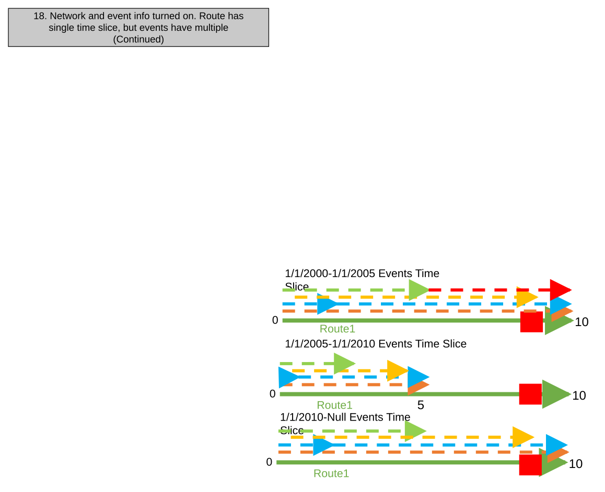

### TC-U23 — Network and Event Info Turned On. Clicked Location Is the Respective End / Start <!-- src: S1 · slide 27 · case 19 -->

- **Case:** Network and event info turned on. Clicked location is the respective end/start of 2 routes

| LRS Identify Results |  |  |  |  |  | X |
| --- | --- | --- | --- | --- | --- | --- |
| Network: | CountyLog |  |  | > |  |  |
| RouteID: | 001 |  |  |  |  |  |
| RouteName: | Route1 |  |  |  |  |  |
| Min Measure: | 0 miles |  |  |  |  |  |
| Max Measure: | 10 miles |  |  |  |  |  |
| Measure: | 10 miles |  |  |  |  |  |
| Time: | 1/1/2000 to <Null> |  |  |  | > |  |
|  |  |  |  |  |  |  |
| Attribute | Value |  |  |  |  |  |
| Location | Upstream |  |  |  |  |  |
| Status | Active |  |  |  |  |  |
|  |  |  |  |  |  |  |
| Hide Event Information |  |  | > |  |  |  |
| DOT_Class.Class |  | Class 1 |  |  |  |  |
| DOT_Class.Record_Status |  | Active |  |  |  |  |
| Operating_Pressure.Pre … |  | 200 |  |  |  |  |
| Operating_Pressuire.Rec … |  | Active |  |  |  |  |
| Inspection_Range.Type |  | Gas Leak |  |  |  |  |
| Inspection_Range.Record … |  | Active |  |  |  |  |

| Network Layer | LineID | Line Name | RouteID | Route Name | From Date | ToDate | Location | Status |
| --- | --- | --- | --- | --- | --- | --- | --- | --- |
| Engineering | Line001 | Line1 | 001 | Route1 | 1/1/2000 | <Null> | Upstream | Active |
| Engineering | Line001 | Line1 | 002 | Route2 | 1/1/2000 | <Null> | Midstream | Active |

| Event Layer | From RouteID | From Route Name | To RouteID | ToRoute Name | From Date | To Date | From Measure | To Measure | Attribute1 | Attribute2 |
| --- | --- | --- | --- | --- | --- | --- | --- | --- | --- | --- |
| DOT_Class | 001 | Route1 | 002 | Route2 | 1/1/2000 | <Null> | 0 | 30 | Class 1 | Active |
| Operating_ Pressure | 001 | Route1 | 001 | Route1 | 1/1/2000 | <Null> | 0 | 4 | 500 | Active |
| Operating_ Pressure | 00 | Route1 | 002 | Route2 | 1/1/2000 | <Null> | 4 | 30 | 200 | Active |
| Inspection_Range | 001 | Route1 | 002 | Route2 | 1/1/2000 | <Null> | 1 | 29 | Gas Leak | Active |
| Consequence_ Segment | 001 | Route1 | 001 | Route1 | 1/1/2000 | <Null> | 0 | 10 | Installed | Active |
| Pipe_Crossing | 002 | Route2 | 002 | Route2 | 1/1/2000 | <Null> | 20 | 30 | Transportation | Retired |

| LRS Identify Results |  |  |  |  |  | X |
| --- | --- | --- | --- | --- | --- | --- |
| Network: | CountyLog |  |  | > |  |  |
| RouteID: | 002 |  |  |  |  |  |
| RouteName: | Route2 |  |  |  |  |  |
| Min Measure: | 20 miles |  |  |  |  |  |
| Max Measure: | 30 miles |  |  |  |  |  |
| Measure: | 20 miles |  |  |  |  |  |
| Time: | 1/1/2000 to <Null> |  |  |  | > |  |
|  |  |  |  |  |  |  |
| Attribute | Value |  |  |  |  |  |
| Location | Midstream |  |  |  |  |  |
| Status | Active |  |  |  |  |  |
|  |  |  |  |  |  |  |
| Hide Event Information |  |  | > |  |  |  |
| DOT_Class.Class |  | Class 1 |  |  |  |  |
| DOT_Class.Record_St … |  | Active |  |  |  |  |
| Operating_Pressure.P … |  | 200 |  |  |  |  |
| Operating_Pressure … |  | Active |  |  |  |  |
| Inspection_Range.Type |  | Gas Leak |  |  |  |  |
| Inspection_Range.Rec … |  | Active |  |  |  |  |
| Pipe_Crossing.Type |  | Transportation |  |  |  |  |
| Pipe_Crossing.Record … |  | Active |  |  |  |  |

[figure: 0 · 10 · Returned Result: · Clicked Location: · Route1 · 20 · 30 · Route2]

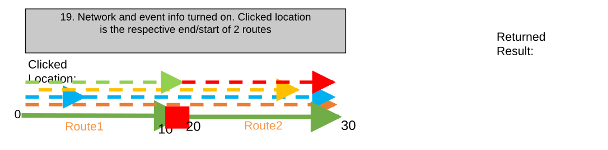

### TC-U24 — Network and Event Info Turned On. Clicked Location Has Concurrent Routes (case 20) <!-- src: S1 · slide 28 · case 20 -->

- **Case:** Network and event info turned on. Clicked location has concurrent routes of different networks, but one network is not enabled to display in map

| Network Layer | Enabled in Map? | RouteID | Route Name | From Date | ToDate | Attribute1 | Attribute2 |
| --- | --- | --- | --- | --- | --- | --- | --- |
| CountyLog | Yes | 001 | Route1 | 1/1/2000 | <Null> | Local | Adams |
| StateLog | No | SR15 | Route15 | 1/1/2000 | <Null> | No Toll | North |

| Event Layer | RouteID | Route Name | From Date | To Date | From Measure | To Measure | Attribute1 | Attribute2 |
| --- | --- | --- | --- | --- | --- | --- | --- | --- |
| Speed | 001 | Route1 | 1/1/2000 | <Null> | 0 | 10 | 45 MPH | Active |
| Access_Control | 001 | Route1 | 1/1/2000 | <Null> | 0 | 2 | Full Access | Active |
| Access_Control | 001 | Route1 | 1/1/2000 | <Null> | 2 | 10 | No Access | Active |
| Facility_Type | 001 | Route1 | 1/1/2000 | <Null> | 1 | 9 | One-Way | Active |
| Functional_Class | 001 | Route1 | 1/1/2000 | <Null> | 0 | 5 | Minor | Active |

| Event Layer | RouteID | Route Name | From Date | To Date | From Measure | To Measure | Attribute1 | Attribute2 |
| --- | --- | --- | --- | --- | --- | --- | --- | --- |
| Inspection | SR15 | Route15 | 1/1/2000 | <Null> | 5 | 15 | Inspected | Active |
| State_Budget | SR15 | Route15 | 1/1/2000 | <Null> | 7 | 12 | $500,000 | Active |

[figure: 5 mi · 10 mi · Clicked Location: · Route1 · 15 mi · Route15 · 0 mi]

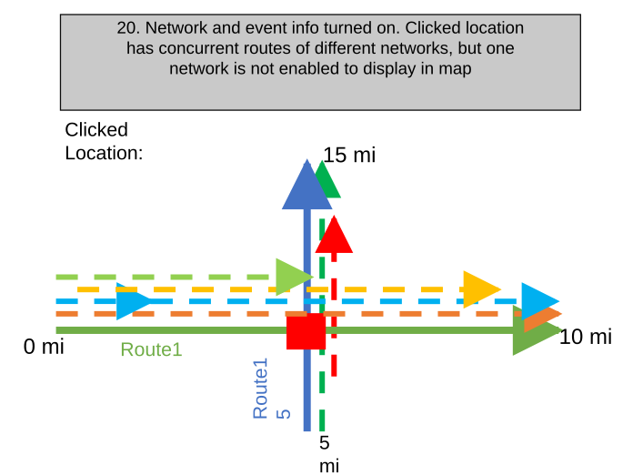

### TC-U25 — Network and Event Info Turned On. Clicked Location Has Concurrent Routes (case 20) <!-- src: S1 · slide 29 · case 20 -->

- **Case:** Network and event info turned on. Clicked location has concurrent routes of different networks, but one network is not enabled to display in map (continued)

| LRS Identify Results |  |  |  |  |  | X |
| --- | --- | --- | --- | --- | --- | --- |
| Network: | CountyLog |  |  | > |  |  |
| RouteID: | 001 |  |  |  |  |  |
| RouteName: | Route1 |  |  |  |  |  |
| Min Measure: | 0 miles |  |  |  |  |  |
| Max Measure: | 10 miles |  |  |  |  |  |
| Measure: | 5 miles |  |  |  |  |  |
| Time: | 1/1/2000 to <Null> |  |  |  | > |  |
|  |  |  |  |  |  |  |
| Attribute | Value |  |  |  |  |  |
| Jurisdiction | Local |  |  |  |  |  |
| County | Adams |  |  |  |  |  |
|  |  |  |  |  |  |  |
| Hide Event Information |  |  | > |  |  |  |
| Speed.Speed_Limit |  | 45 MPH |  |  |  |  |
| Speed.Record_Status |  | Retired |  |  |  |  |
| Access_Control.Access |  | Full Access |  |  |  |  |
| Access_Control.Recor … |  | Retired |  |  |  |  |
| Facility_Type.Type |  | One-Way |  |  |  |  |
| Facility_Type.Record … |  | Retired |  |  |  |  |

### TC-U26 — Network and Event Info Turned On. Multiple Measures on the Same Route Exist (case 21) <!-- src: S1 · slide 30 · case 21 -->

- **Case:** Network and event info turned on. Multiple measures on the same route exist at the clicked location

| LRS Identify Results |  |  |  |  |  | X |
| --- | --- | --- | --- | --- | --- | --- |
| Network: | CountyLog |  |  | > |  |  |
| RouteID: | 001 |  |  |  |  |  |
| RouteName: | Route1 |  |  |  |  |  |
| Min Measure: | 0 miles |  |  |  |  |  |
| Max Measure: | 10 miles |  |  |  |  |  |
| Measure: | 2 miles |  |  |  |  |  |
|  | 8 miles |  |  |  |  |  |
| Time: | 1/1/2000 to <Null> |  |  |  | > |  |
|  |  |  |  |  |  |  |
| Attribute | Value |  |  |  |  |  |
| Jurisdiction | Local |  |  |  |  |  |
| County | Adams |  |  |  |  |  |
|  |  |  |  |  |  |  |
| Hide Event Information |  |  | > |  |  |  |
| Speed.Speed_Limit |  | 45 MPH |  |  |  |  |
| Speed.Record_Status |  | Active |  |  |  |  |

| Network Layer | RouteID | Route Name | From Date | ToDate | Jurisdiction | County |
| --- | --- | --- | --- | --- | --- | --- |
| CountyLog | 001 | Route1 | 1/1/2000 | <Null> | Local | Adams |

| Event Layer | EventID | RouteID | Route Name | From Date | To Date | From Measure | To Measure | Attribute1 | Attribute2 |
| --- | --- | --- | --- | --- | --- | --- | --- | --- | --- |
| Speed | Speed1 | 001 | Route1 | 1/1/2000 | <Null> | 0 | 10 | 45 MPH | Active |

[figure: 0 · 10 · Returned Result: · Clicked Location: · Route1]

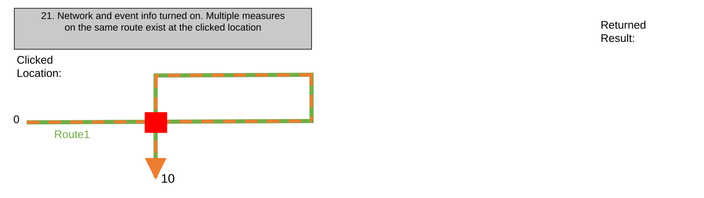
[connections: (rect 3) — (rect 3) · (rect 3) — (rect 3)]

### TC-U27 — Network and Event Info Turned On. Multiple Events Exist at the Clicked Location (case 22) <!-- src: S1 · slide 31 · case 22 -->

- **Case:** Network and event info turned on. Multiple events exist at the clicked location but only a subset are within the configured Attribute Set

| LRS Identify Results |  |  |  |  |  | X |
| --- | --- | --- | --- | --- | --- | --- |
| Network: | CountyLog |  |  | > |  |  |
| RouteID: | 001 |  |  |  |  |  |
| RouteName: | Route1 |  |  |  |  |  |
| Min Measure: | 0 miles |  |  |  |  |  |
| Max Measure: | 10 miles |  |  |  |  |  |
| Measure: | 5 miles |  |  |  |  |  |
| Time: | 1/1/2000 to <Null> |  |  |  | > |  |
|  |  |  |  |  |  |  |
| Attribute | Value |  |  |  |  |  |
| Jurisdiction | Local |  |  |  |  |  |
| County | Adams |  |  |  |  |  |
|  |  |  |  |  |  |  |
| Hide Event Information |  |  | > |  |  |  |
| Speed.Speed_Limit |  | 45 MPH |  |  |  |  |
| Speed.Record_Status |  | Active |  |  |  |  |
| Facility_Type.Type |  | One-Way |  |  |  |  |

| Network Layer | RouteID | Route Name | From Date | ToDate | Jurisdiction | County |
| --- | --- | --- | --- | --- | --- | --- |
| CountyLog | 001 | Route1 | 1/1/2000 | <Null> | Local | Adams |

| Event Layer | RouteID | Route Name | From Date | To Date | From Measure | To Measure | Attribute1 | Attribute2 |
| --- | --- | --- | --- | --- | --- | --- | --- | --- |
| Speed | 001 | Route1 | 1/1/2000 | <Null> | 0 | 10 | 45 MPH | Active |
| Access_Control | 001 | Route1 | 1/1/2000 | <Null> | 0 | 2 | Full Access | Active |
| Access_Control | 001 | Route1 | 1/1/2000 | <Null> | 2 | 10 | No Access | Active |
| Facility_Type | 001 | Route1 | 1/1/2000 | <Null> | 1 | 9 | One-Way | Active |
| Functional_Class | 001 | Route1 | 1/1/2000 | <Null> | 0 | 5 | Minor | Active |
| Pavement_Condition | 001 | Route1 | 1/1/2000 | <Null> | 5 | 10 | 2009 | Retired |

[figure: 0 · 10 · Returned Result: · Clicked Location: · Route1]

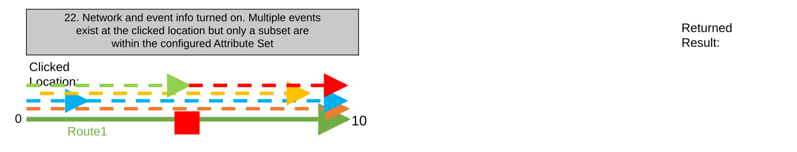

### TC-U28 — Network and Event Info Turned on with Time Filter Set in Map. Time Filter (case 23) <!-- src: S1 · slide 32 · case 23 -->

- **Case:** Network and event info turned on with time filter set in map. Time filter filters the results of the tool

| Network Layer | RouteID | Route Name | From Date | ToDate | Jurisdiction | County |
| --- | --- | --- | --- | --- | --- | --- |
| CountyLog | 001 | Route1 | 1/1/2000 | 1/1/2005 | Local | Shasta |
| CountyLog | 001 | Route1 | 1/1/2005 | 1/1/2010 | State | Lassen |
| CountyLog | 001 | Route1 | 1/1/2010 | <Null> | Federal | Shasta |

| Event Layer | EventID | RouteID | Route Name | From Date | To Date | From Measure | To Measure | Attribute1 | Attribute2 |
| --- | --- | --- | --- | --- | --- | --- | --- | --- | --- |
| Speed | Speed1 | 001 | Route1 | 1/1/2000 | 1/1/2005 | 0 | 10 | 45 MPH | Retired |
| Speed | Speed1 | 001 | Route1 | 1/1/2005 | 1/1/2010 | 0 | 10 | 45 MPH | Retired |
| Speed | Speed2 | 001 | Route1 | 1/1/2010 | <Null> | 0 | 50 | 65 MPH | Active |
| Access_Control | Access1 | 001 | Route1 | 1/1/2000 | 1/1/2005 | 0 | 2 | Full Access | Retired |
| Access_Control | Access1 | 001 | Route1 | 1/1/2005 | 1/1/2010 | 0 | 2 | Full Access | Retired |
| Access_Control | Access3 | 001 | Route1 | 1/1/2010 | <Null> | 0 | 10 | No Access | Active |
| Access_Control | Access2 | 001 | Route1 | 1/1/2000 | 1/1/2005 | 2 | 10 | No Access | Retired |
| Access_Control | Access2 | 001 | Route1 | 1/1/2005 | 1/1/2010 | 2 | 10 | No Access | Retired |
| Access_Control | Access4 | 001 | Route1 | 1/1/2010 | <Null> | 10 | 50 | Full Access | Active |
| Facility_Type | Facility1 | 001 | Route1 | 1/1/2000 | 1/1/2005 | 1 | 9 | One-Way | Retired |
| Facility_Type | Facility1 | 001 | Route1 | 1/1/2005 | 1/1/2010 | 1 | 9 | One-Way | Retired |
| Facility_Type | Facility2 | 001 | Route1 | 1/1/2010 | <Null> | 5 | 45 | Two-Way | Active |
| Functional_Class | Func1 | 001 | Route1 | 1/1/2000 | 1/1/2005 | 0 | 5 | Minor | Retired |
| Functional_Class | Func1 | 001 | Route1 | 1/1/2005 | 1/1/2010 | 0 | 5 | Minor | Retired |
| Functional_Class | Func2 | 001 | Route1 | 1/1/2010 | <Null> | 0 | 25 | Major | Active |
| Pavement_Condition | Pave1 | 001 | Route1 | 1/1/2000 | 1/1/2005 | 5 | 10 | 2009 | Retired |

1/1/2005-1/1/2010 Time Slice

Time filter in map is set to 1/1/2003-1/1/2008

[figure: 0 · 10 · Route1 · 20 · 50 · 1/1/2010-Null Time Slice]

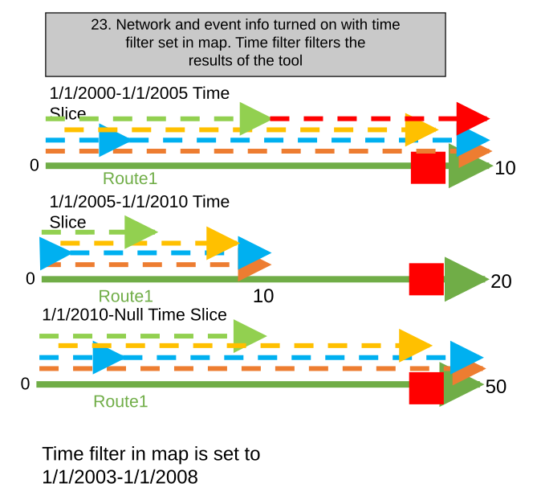

### TC-U29 — Network and Event Info Turned on with Time Filter Set in Map. Time Filter (case 23) <!-- src: S1 · slide 33 · case 23 -->

- **Case:** Network and event info turned on with time filter set in map. Time filter filters the results of the tool (continued)

1/1/2000-1/1/2005 Time Slice

1/1/2005-1/1/2010 Time Slice

| LRS Identify Results |  |  |  |  |  | X |
| --- | --- | --- | --- | --- | --- | --- |
| Network: | CountyLog |  |  | > |  |  |
| RouteID: | 001 |  |  |  |  |  |
| RouteName: | Route1 |  |  |  |  |  |
| Min Measure: | 0 miles |  |  |  |  |  |
| Max Measure: | 10 miles |  |  |  |  |  |
| Measure: | 9 miles |  |  |  |  |  |
| Time: | 1/1/2005 to 1/1/2008 |  |  |  | > |  |
|  |  |  |  |  |  |  |
| Attribute | Value |  |  |  |  |  |
| Jurisdiction | Local |  |  |  |  |  |
| County | Shasta |  |  |  |  |  |
|  |  |  |  |  |  |  |
| Hide Event Information |  |  | > |  |  |  |
| No event information to display |  |  |  |  |  |  |

| LRS Identify Results |  |  |  |  |  |  | X |
| --- | --- | --- | --- | --- | --- | --- | --- |
| Network: | CountyLog |  |  |  | > |  |  |
| RouteID: | 001 |  |  |  |  |  |  |
| RouteName: | Route1 |  |  |  |  |  |  |
| Min Measure: | 0 miles |  |  |  |  |  |  |
| Max Measure: | 10 miles |  |  |  |  |  |  |
| Measure: | 9 miles |  |  |  |  |  |  |
| Time: | 1/1/2003-1/1/2005 |  |  |  |  | > |  |
|  |  |  |  |  |  |  |  |
| Attribute | Value |  |  |  |  |  |  |
| Jurisdiction | Local |  |  |  |  |  |  |
| County | Shasta |  |  |  |  |  |  |
|  |  |  |  |  |  |  |  |
| Hide Event Information |  |  |  | > |  |  |  |
| Speed.SpeedLimit |  |  | 45 MPH |  |  |  |  |
| Speed.Record_Status |  |  | Retired |  |  |  |  |
| Access_Control.Access |  |  | Full Access |  |  |  |  |
| Access_Control.Record_S … |  |  | Retired |  |  |  |  |
| Facility_Type.Type |  |  | One-Way |  |  |  |  |
| Facility_Type.Record_Sta… |  |  | Retired |  |  |  |  |
| Pavement_Condition.Dat... |  |  | 2009 |  |  |  |  |
| Pavement_Condition.Rec … |  |  | Retired |  |  |  |  |

[figure: 0 · 10 · Route1 · 20]

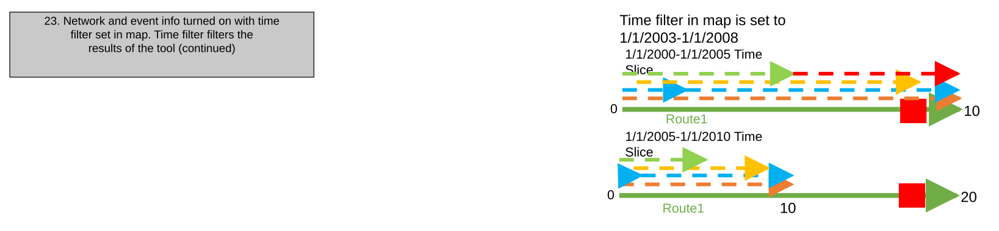
