# Merge Events Widget Test Plan

| Field | Value |
| --- | --- |
| **Doc** | 437 · Test Plan · Experience Builder |
| **Product** | — |
| **Release** | — |
| **Issues** | [Beijing-R-D-Center/ExperienceBuilder-Web-Extensions#16934](https://devtopia.esri.com/Beijing-R-D-Center/ExperienceBuilder-Web-Extensions/issues/16934) |
| **Source** | [16934-ExBMergeEvents_TestPlanV3.pptx](<https://esriis.sharepoint.com/sites/LocationReferencing/Shared%20Documents/General/Test%20Plans/16934-ExBMergeEvents_TestPlanV3.pptx>) · rev V3 |
| **People** | author Mac Christmas · PE — · dev — |
| **Edited** | 2024-01-08 23:58 by Mac Christmas |
| **Extracted** | 2026-09-04 · lane xmlstrip · format 3.0 · prompt v2.0.2 |
| **Keywords** | merge events · event merging · experience builder · line event · non spanning event · route · referent · date handling · event attributes |
| **Tools** | Merge Events |

## Summary

Test plan for the Merge Events widget in Experience Builder covering configuration, UI behavior, positive and negative test cases, and event merging scenarios including spanning, non-spanning, overlapping, complex, and vertical events. Includes tests for route and event attributes, date handling, referent preservation, and error conditions.

## Related documents

<!-- related:begin -->
- [Merge Events Pro Test Plan](<https://esriis.sharepoint.com/sites/lrsworkspace/LRS Doc Index/Test Plans/3921-merge-events-pro.md>) — similar text 0.65 · 2 title words · 1 filename word · same kind/folder <!-- rel:647 s=6.051 -->
- [Split Event Widget Test Plan](<https://esriis.sharepoint.com/sites/lrsworkspace/LRS Doc Index/Test Plans/16461-split-event-widget.md>) — similar text 0.32 · 1 title word · same kind/surface/folder <!-- rel:459 s=5.581 -->
- [Merge Events in Experience Builder](<https://esriis.sharepoint.com/sites/lrsworkspace/LRS Doc Index/User Stories/merge-events-in-exb.md>) — similar text 0.60 · 2 title words · 1 filename word · same surface <!-- rel:466 s=4.61 -->
- [Experience Builder: Add Multiple Line Events Widget Test Plan](<https://esriis.sharepoint.com/sites/lrsworkspace/LRS Doc Index/Test Plans/16343-exb-add-multiple-line-events-widget.md>) — similar text 0.22 · 2 title words · 1 filename word · same kind/surface/folder <!-- rel:457 s=4.527 -->
- [Merge Events User Story](<https://esriis.sharepoint.com/sites/lrsworkspace/LRS Doc Index/User Stories/merge-events.md>) — similar text 0.59 · 2 title words · 1 filename word <!-- rel:675 s=4.407 -->
<!-- related:end -->

<!-- docs:begin -->
## Esri documentation

[Merge events](https://doc.esri.com/en/arcgis-pro/latest/help/production/roads-highways/merge-events.html) · [Storing referent and offset information for event location](https://doc.esri.com/en/arcgis-pro/latest/help/production/location-referencing-pipelines/storing-referent-and-offset-information-for-event-location.html) · [Event editing using the attribute table](https://doc.esri.com/en/arcgis-pro/latest/help/production/location-referencing-pipelines/event-editing-using-the-attribute-table.html)
<!-- docs:end -->

---

## Overview

### Slide 1 — Devtopia Issue <!-- slide 1 -->

Merge Events Widget

**Notes**
- Add the Merge Events widget in Experience Builder
- Test with line and non-line networks (excluding PoM)
- Test with spanning and non-spanning line events (point events cannot be merged)
- Test auto-generated, single-field, and multi-field RouteID configurations
- Test with events with RouteID vs. RouteName configured
- Test on simple and complex route shapes, including vertical routes
- Test with projected and unprojected data, including a variety of spatial references
- Test with different themes
- Test in Chrome and Edge (other browsers will be covered in automation)
- Test based on the Pro Merge Events test plan test cases (cases are attached at end of test plan)
- Test i18n and accessibility testing
- Test in Web, Tablet, and Mobile configurations
- Time slice events correctly when merging
- Retire/time slice input events based on the input date info
- If input events are non-coincident, merge the space between events in the output event
- Merge overlapping events
- Preserve referent info for the merged events
- Restrict merging of non-adjacent events.
- Map widget must have selection enabled for events to be selected. If selection is not enabled for the Map widget, then provide error message that it needs to be enabled

### Slide 2 <!-- slide 2 -->

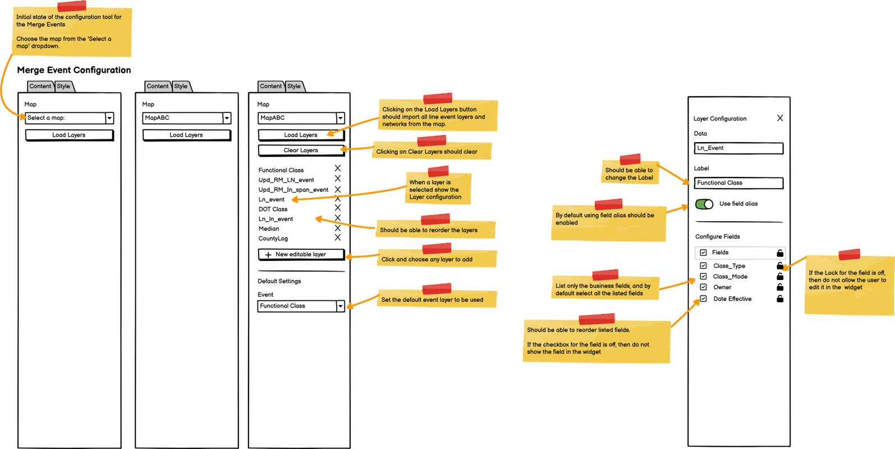

### Slide 3 <!-- slide 3 -->

## Test Cases

### TC-P01 — A map can be chosen <!-- src: S4 · slide 4 · Positive Tests: Configuration · 1 -->

- **Group:** Configuration

### TC-P02 — If more than one map exists within the app <!-- src: S4 · slide 4 · Positive Tests: Configuration · 2 -->

- **Group:** Configuration
- **Case:** If more than one map exists within the app, list all maps in the Select a map dropdown

### TC-P03 — Line event and network layers can be imported from the map <!-- src: S4 · slide 4 · Positive Tests: Configuration · 3 -->

- **Group:** Configuration

### TC-P04 — Missing layers can be added using the New Editable Layer option <!-- src: S4 · slide 4 · Positive Tests: Configuration · 4 -->

- **Group:** Configuration

### TC-P05 — Layers can be reordered <!-- src: S4 · slide 4 · Positive Tests: Configuration · 5 -->

- **Group:** Configuration

### TC-P06 — Layers can be removed by clicking the X button <!-- src: S4 · slide 4 · Positive Tests: Configuration · 6 -->

- **Group:** Configuration

### TC-P07 — Clicking on Clear layers will remove all the imported layers <!-- src: S4 · slide 4 · Positive Tests: Configuration · 7 -->

- **Group:** Configuration

### TC-P08 — If some layers are removed <!-- src: S4 · slide 4 · Positive Tests: Configuration · 8 -->

- **Group:** Configuration
- **Case:** If some layers are removed, clicking on Load layers will only import the missing layers

### TC-P09 — Only line event layers should appear in the Event dropdown <!-- src: S4 · slide 4 · Positive Tests: Configuration · 9 -->

- **Group:** Configuration

### TC-P10 — When another web map is chosen, clear the layers from the list <!-- src: S4 · slide 4 · Positive Tests: Configuration · 10 -->

- **Group:** Configuration

### TC-P11 — A default event layer can be chosen <!-- src: S4 · slide 4 · Positive Tests: Configuration · 11 -->

- **Group:** Configuration

### TC-P12 — The event layer’s label can be edited <!-- src: S4 · slide 4 · Positive Tests: Configuration · 12 -->

- **Group:** Configuration

### TC-P13 — Attribute fields can be configured and show only business fields. No LRS <!-- src: S4 · slide 4 · Positive Tests: Configuration · 13 -->

- **Group:** Configuration
- **Case:** Attribute fields can be configured and show only business fields. No LRS or system fields should appear

### TC-P14 — Attribute fields can be selected/unselected to show in the UI <!-- src: S4 · slide 4 · Positive Tests: Configuration · 14 -->

- **Group:** Configuration

### TC-P15 — Attribute fields an be enabled/disabled for editing <!-- src: S4 · slide 4 · Positive Tests: Configuration · 15 -->

- **Group:** Configuration

### TC-P16 — Use field alias should be enabled by default <!-- src: S4 · slide 4 · Positive Tests: Configuration · 16 -->

- **Group:** Configuration

### TC-P17 — A field description can be added for each field <!-- src: S4 · slide 4 · Positive Tests: Configuration · 17 -->

- **Group:** Configuration

### TC-N01 — Show error if no LRS enabled layers in the chosen web map when attempting <!-- src: S4 · slide 4 · Negative Tests: Configuration · 1 -->

- **Group:** Configuration
- **Case:** Show error if no LRS enabled layers in the chosen web map when attempting to import layer

### TC-N02 — No line event layers are imported from the map <!-- src: S4 · slide 4 · Negative Tests: Configuration · 2 -->

- **Group:** Configuration

### TC-N03 — LRS parent network is not within the web map <!-- src: S4 · slide 4 · Negative Tests: Configuration · 3 -->

- **Group:** Configuration

### TC-N04 — Chosen web map has more than one service <!-- src: S4 · slide 4 · Negative Tests: Configuration · 4 -->

- **Group:** Configuration

### TC-P18 — Configured default event layer appears as the chosen event when the UI <!-- src: S4 · slide 4 · Positive Tests: UI · 1 -->

- **Group:** UI
- **Case:** Configured default event layer appears as the chosen event when the UI is launched

### TC-P19 — A different event layer can be chosen if configured <!-- src: S4 · slide 4 · Positive Tests: UI · 2 -->

- **Group:** UI

### TC-P20 — If only one event layer is configured <!-- src: S4 · slide 4 · Positive Tests: UI · 3 -->

- **Group:** UI
- **Case:** If only one event layer is configured, then disable the Event Layer parameter drop down and show the parameter as a label or disable it if the checkbox is unchecked

### TC-P21 — The event layer drop down should include all configured event layers <!-- src: S4 · slide 4 · Positive Tests: UI · 4 -->

- **Group:** UI

### TC-P22 — The event layer drop down should list configured event layers in their <!-- src: S4 · slide 4 · Positive Tests: UI · 5 -->

- **Group:** UI
- **Case:** The event layer drop down should list configured event layers in their configured order

### TC-P23 — Allow merging of more than 2 events <!-- src: S4 · slide 4 · Positive Tests: UI · 6 -->

- **Group:** UI

### TC-P24 — Clicking the change event selection button changes the mouse to a selector <!-- src: S4 · slide 4 · Positive Tests: UI · 7 -->

- **Group:** UI

### TC-P25 — Clicking a different event record in the Events to Merge grid updates which <!-- src: S4 · slide 4 · Positive Tests: UI · 8 -->

- **Group:** UI
- **Case:** Clicking a different event record in the Events to Merge grid updates which EventID will be preserved

### TC-P26 — When a different event record is clicked, flash the event in the map 3 times <!-- src: S4 · slide 4 · Positive Tests: UI · 9 -->

- **Group:** UI

### TC-P27 — The first event in the list will be selected by default to be the preserved <!-- src: S4 · slide 4 · Positive Tests: UI · 10 -->

- **Group:** UI
- **Case:** The first event in the list will be selected by default to be the preserved event and its attribute values will populate the merged event’s attributes

### TC-P28 — The display field will be used to differentiate between event records <!-- src: S4 · slide 4 · Positive Tests: UI · 11 -->

- **Group:** UI
- **Case:** The display field will be used to differentiate between event records in the Events to Merge grid

### TC-P29 — Clicking the x on each event record will remove the event from the Events <!-- src: S4 · slide 4 · Positive Tests: UI · 12 -->

- **Group:** UI
- **Case:** Clicking the x on each event record will remove the event from the Events to Merge grid

### TC-P30 — When an event record is double-clicked, zoom to the event’s extent <!-- src: S4 · slide 5 · Positive Tests: UI (Continued) · 1 -->

- **Group:** UI (Continued)

### TC-P31 — Clicking the Use route start date or Use route end date checkboxes populates <!-- src: S4 · slide 5 · Positive Tests: UI (Continued) · 2 -->

- **Group:** UI (Continued)
- **Case:** Clicking the Use route start date or Use route end date checkboxes populates the From/To Date of the resultant merged event with the respective route date info

### TC-P32 — The date checkboxes will only be available for non-spanning line events <!-- src: S4 · slide 5 · Positive Tests: UI (Continued) · 3 -->

- **Group:** UI (Continued)

### TC-P33 — When these checkboxes are checked <!-- src: S4 · slide 5 · Positive Tests: UI (Continued) · 4 -->

- **Group:** UI (Continued)
- **Case:** When these checkboxes are checked, the From/To Date of the resultant merged event cannot be edited until the checkboxes are unchecked

### TC-P34 — If events are already selected prior to opening the tool <!-- src: S4 · slide 5 · Positive Tests: UI (Continued) · 5 -->

- **Group:** UI (Continued)
- **Case:** If events are already selected prior to opening the tool, upon selecting the event layer in the widget, the selected events will populate in the widget

### TC-P35 — The from and to RouteID/RouteName info for the resultant merged event will <!-- src: S4 · slide 5 · Positive Tests: UI (Continued) · 6 -->

- **Group:** UI (Continued)
- **Case:** The from and to RouteID/RouteName info for the resultant merged event will be populated based on the event’s start and end locations

### TC-P36 — From/To Measure of resultant merged event is populated based upon the measure <!-- src: S4 · slide 5 · Positive Tests: UI (Continued) · 7 -->

- **Group:** UI (Continued)
- **Case:** From/To Measure of resultant merged event is populated based upon the measure location of the first/last event in calibration along a route/line and cannot be edited manually

### TC-P37 — Support Subtypes, Domains, Attribute Rules, Ranges, Contingent Values <!-- src: S4 · slide 5 · Positive Tests: UI (Continued) · 8 -->

- **Group:** UI (Continued)
- **Case:** Support Subtypes, Domains, Attribute Rules, Ranges, Contingent Values, non-nullable fields, etc.

### TC-P38 — When the above are violated <!-- src: S4 · slide 5 · Positive Tests: UI (Continued) · 9 -->

- **Group:** UI (Continued)
- **Case:** When the above are violated, provide an error message that is helpful for the user

### TC-P39 — Denote required fields <!-- src: S4 · slide 5 · Positive Tests: UI (Continued) · 10 -->

- **Group:** UI (Continued)

### TC-P40 — Show vertical scroll if needed <!-- src: S4 · slide 5 · Positive Tests: UI (Continued) · 11 -->

- **Group:** UI (Continued)

### TC-P41 — Once successfully merged <!-- src: S4 · slide 5 · Positive Tests: UI (Continued) · 12 -->

- **Group:** UI (Continued)
- **Case:** Once successfully merged, show a message and return the widget to its initial stage

### TC-P42 — Flash the merged event on the map 3 times after successful merge and unselect <!-- src: S4 · slide 5 · Positive Tests: UI (Continued) · 13 -->

- **Group:** UI (Continued)
- **Case:** Flash the merged event on the map 3 times after successful merge and unselect the merged event

### TC-P43 — Ensure calendar date picker works as expected <!-- src: S4 · slide 5 · Positive Tests: UI (Continued) · 14 -->

- **Group:** UI (Continued)

### TC-P44 — Default resultant merged event’s Start Date is today’s date <!-- src: S4 · slide 5 · Positive Tests: UI (Continued) · 15 -->

- **Group:** UI (Continued)

### TC-P45 — Preserved event will not change when events are added/removed from the selection <!-- src: S4 · slide 5 · Positive Tests: UI (Continued) · 16 -->

- **Group:** UI (Continued)
- **Case:** Preserved event will not change when events are added/removed from the selection if the preserved event is not removed

### TC-N05 — Input non-spanning line events to merge are not on the same route <!-- src: S4 · slide 5 · Negative Tests: UI · 1 -->

- **Group:** UI

### TC-N06 — Input spanning line events to merge are not on the same line <!-- src: S4 · slide 5 · Negative Tests: UI · 2 -->

- **Group:** UI

### TC-N07 — Only one event is selected to merge <!-- src: S4 · slide 5 · Negative Tests: UI · 3 -->

- **Group:** UI

### TC-N08 — Selected events are not in the same time slice <!-- src: S4 · slide 5 · Negative Tests: UI · 4 -->

- **Group:** UI
- **Case:** Selected events are not in the same time slice, but overlapping time slice events will be merged

### TC-N09 — Resultant merged event’s From/To Dates are altered to not be in the route(s) <!-- src: S4 · slide 5 · Negative Tests: UI · 5 -->

- **Group:** UI
- **Case:** Resultant merged event’s From/To Dates are altered to not be in the route(s) time slices

### TC-N10 — Resultant merged event’s From/To Date are the same date <!-- src: S4 · slide 5 · Negative Tests: UI · 6 -->

- **Group:** UI

### TC-N11 — Typed date has invalid characters (non-number characters) <!-- src: S4 · slide 5 · Negative Tests: UI · 7 -->

- **Group:** UI

### TC-N12 — Events are not adjacent or coincident <!-- src: S4 · slide 5 · Negative Tests: UI · 8 -->

- **Group:** UI

### TC-N13 — Selection is not enabled on the Map widget, events cannot be selected <!-- src: S4 · slide 5 · Negative Tests: UI · 9 -->

- **Group:** UI

### TC-U01 — Merge events with changed To Date <!-- src: S2 · slide 8 · case 2 -->

| RouteID | From Date | To Date | From Measure | To Measure |
| --- | --- | --- | --- | --- |
| RouteA | 1/1/2000 | Null | 0 | 10 |
| RouteB | 1/1/2000 | Null | 100 | 200 |
| RouteC | 1/1/2000 | Null | 0.23 | 1.65 |
| RouteD | 1/1/2000 | Null | 10 | 12 |

| EventID | From Date | To Date | From Route | From Measure | To Route | To Measure | Attribute |
| --- | --- | --- | --- | --- | --- | --- | --- |
| Event1 | 1/1/2001 | Null | RouteA | 0 | RouteB | 150 | X |
| Event2 | 1/1/2001 | Null | RouteB | 150 | RouteD | 12 | Y |

| EventID | From Date | To Date | From Route | From Measure | To Route | To Measure | Attribute |
| --- | --- | --- | --- | --- | --- | --- | --- |
| Event1 | 1/1/2005 | 1/1/2020 | RouteA | 0 | RouteD | 12 | X |

| EventID | From Date | To Date | From Route | From Measure | To Route | To Measure | Attribute |
| --- | --- | --- | --- | --- | --- | --- | --- |
| Event1 | 1/1/2001 | 1/1/2005 | RouteA | 0 | RouteB | 150 | X |
| Event2 | 1/1/2001 | 1/1/2005 | RouteB | 150 | RouteD | 12 | Y |

[figure: RouteA · RouteB · RouteC · RouteD · 0 · 200/0.23 · 10/100 · 1.65/10 · 12 · Retired input events:]

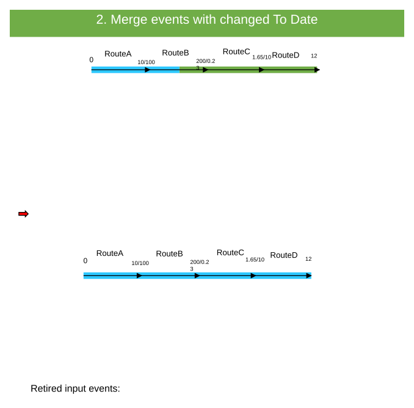

### TC-U02 — Merge Events with Referents Present for Both the Location of First Event <!-- src: S1 · slide 9 · case 7 -->

- **Case:** Merge events with referents present for both the location of first event to the last event without changing the From Measure and To Measure. The referent information will remain intact.

| RouteID | From Date | To Date | From Measure | To Measure |
| --- | --- | --- | --- | --- |
| RouteA | 1/1/2000 | Null | 0 | 10 |
| RouteB | 1/1/2000 | Null | 100 | 200 |
| RouteC | 1/1/2000 | Null | 0.23 | 1.65 |
| RouteD | 1/1/2000 | Null | 10 | 12 |

| EventID | From Date | To Date | From Route | From Measure | From Ref Method | From Ref Location | From Ref Offset | To Route | To Measure | To Ref Method | To Ref Location | To Ref Offset |
| --- | --- | --- | --- | --- | --- | --- | --- | --- | --- | --- | --- | --- |
| Event1 | 1/1/2001 | Null | RouteA | 0 | XY | 38.5, 120.5 | 0 | RouteB | 150 | XY | 38.6, 120.5 | 0 |
| Event2 | 1/1/2001 | Null | RouteB | 150 | XY | 38.6, 120.5 | 0 | RouteD | 12 | XY | 38.6, 120.5 | 0 |

| EventID | From Date | To Date | From Route | From Measure | From Ref Method | From Ref Location | From Ref Offset | To Route | To Measure | To Ref Method | To Ref Location | To Ref Offset |
| --- | --- | --- | --- | --- | --- | --- | --- | --- | --- | --- | --- | --- |
| Event1 | 1/1/2005 | Null | RouteA | 0 | XY | 38.5, 120.5 | 0 | RouteD | 12 | XY | 38.6, 120.5 | 0 |

| Attribute |
| --- |
| X |
| Y |

| Attribute |
| --- |
| X |

| EventID | From Date | To Date | From Route | From Measure | From Ref Method | From Ref Location | From Ref Offset | To Route | To Measure | To Ref Method | To Ref Location | To Ref Offset |
| --- | --- | --- | --- | --- | --- | --- | --- | --- | --- | --- | --- | --- |
| Event1 | 1/1/2001 | 1/1/2005 | RouteA | 0 | XY | 38.5, 120.5 | 0 | RouteB | 150 | XY | 38.6, 120.5 | 0 |
| Event2 | 1/1/2001 | 1/1/2005 | RouteB | 150 | XY | 38.6, 120.5 | 0 | RouteD | 12 | XY | 38.6, 120.5 | 0 |

| Attribute |
| --- |
| X |
| Y |

[figure: RouteA · RouteB · RouteC · RouteD · 0 · 200/0.23 · 10/100 · 1.65/10 · 12 · Retired input events:]

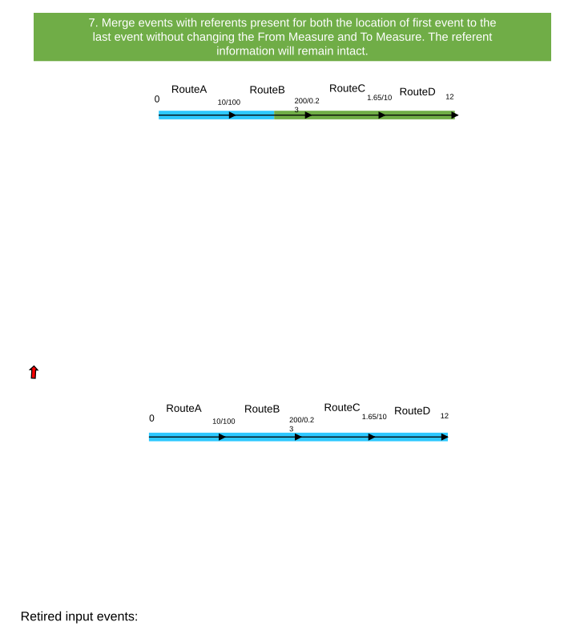

### TC-U03 — Merge events with overlaps <!-- src: S2 · slide 10 · case 8 -->

| RouteID | From Date | To Date | From Measure | To Measure |
| --- | --- | --- | --- | --- |
| RouteA | 1/1/2000 | Null | 0 | 10 |
| RouteB | 1/1/2000 | Null | 100 | 200 |
| RouteC | 1/1/2000 | Null | 0.23 | 1.65 |
| RouteD | 1/1/2000 | Null | 10 | 12 |

| EventID | From Date | To Date | From Route | From Measure | To Route | To Measure | Attribute |
| --- | --- | --- | --- | --- | --- | --- | --- |
| Event1 | 1/1/2001 | Null | RouteA | 0 | RouteB | 150 | X |
| Event2 | 1/1/2001 | Null | RouteB | 100 | RouteD | 12 | Y |

| EventID | From Date | To Date | From Route | From Measure | To Route | To Measure | Attribute |
| --- | --- | --- | --- | --- | --- | --- | --- |
| Event1 | 1/1/2005 | Null | RouteA | 0 | RouteD | 12 | X |

| EventID | From Date | To Date | From Route | From Measure | To Route | To Measure | Attribute |
| --- | --- | --- | --- | --- | --- | --- | --- |
| Event1 | 1/1/2001 | 1/1/2005 | RouteA | 0 | RouteB | 150 | X |
| Event2 | 1/1/2001 | 1/1/2005 | RouteB | 100 | RouteD | 12 | Y |

[figure: RouteA · RouteB · RouteC · RouteD · 0 · 200/0.23 · 10/100 · 1.65/10 · 12 · Retired input events:]

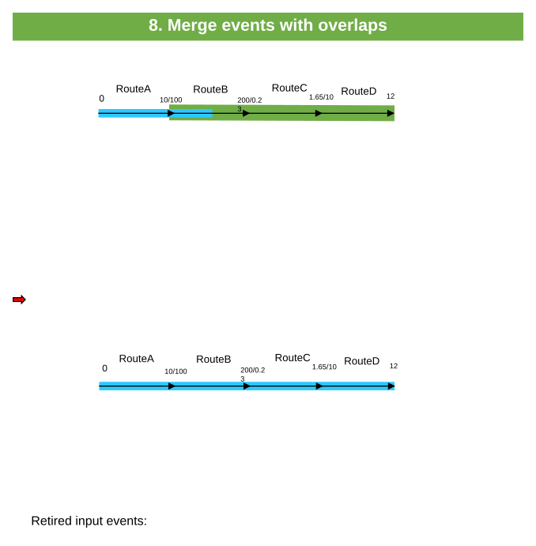

### TC-U04 — Input Events Are Retired Correctly <!-- src: S1 · slide 11 · case 10 -->

- **Case:** Input events are retired correctly, populating the To Date of input events with the entered From Date within the Merge Events tool.

| RouteID | From Date | To Date | From Measure | To Measure |
| --- | --- | --- | --- | --- |
| RouteA | 1/1/2000 | Null | 0 | 10 |
| RouteB | 1/1/2000 | Null | 100 | 200 |
| RouteC | 1/1/2000 | Null | 0.23 | 1.65 |
| RouteD | 1/1/2000 | Null | 10 | 12 |

| EventID | From Date | To Date | From Route | From Measure | To Route | To Measure | Attribute |
| --- | --- | --- | --- | --- | --- | --- | --- |
| Event1 | 1/1/2001 | Null | RouteA | 0 | RouteB | 150 | X |
| Event2 | 1/1/2001 | Null | RouteB | 150 | RouteD | 12 | Y |

| EventID | From Date | To Date | From Route | From Measure | To Route | To Measure | Attribute |
| --- | --- | --- | --- | --- | --- | --- | --- |
| Event1 | 1/1/2005 | Null | RouteA | 0 | RouteD | 12 | X |

| EventID | From Date | To Date | From Route | From Measure | To Route | To Measure | Attribute |
| --- | --- | --- | --- | --- | --- | --- | --- |
| Event1 | 1/1/2001 | 1/1/2005 | RouteA | 0 | RouteB | 150 | X |
| Event2 | 1/1/2001 | 1/1/2005 | RouteB | 150 | RouteD | 12 | Y |

[figure: Retired input events: · RouteA · RouteB · RouteC · RouteD · 0 · 200/0.23 · 10/100 · 1.65/10 · 12]

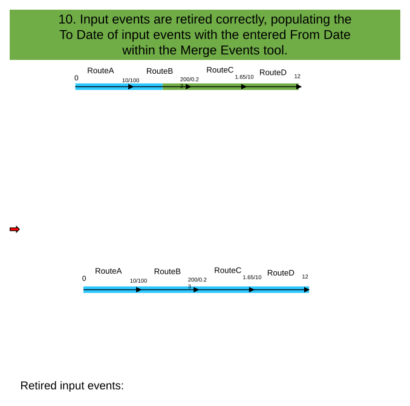

### TC-U05 — Merge events with many input events <!-- src: S2 · slide 12 · case 12 -->

| RouteID | From Date | To Date | From Measure | To Measure |
| --- | --- | --- | --- | --- |
| RouteA | 1/1/2000 | Null | 0 | 10 |

| EventID | From Date | To Date | Route | From Measure | To Measure | Attribute |
| --- | --- | --- | --- | --- | --- | --- |
| Event1 | 1/1/2000 | Null | RouteA | 0 | 5 | X |
| Event2 | 1/1/2010 | Null | RouteA | 5 | 10 | Y |
| Event3 | 1/1/2011 | Null | RouteA | 2 | 4 | Z |
| Event4 | 1/1/2015 | Null | RouteA | 6 | 9 | A |

| EventID | From Date | To Date | Route | From Measure | To Measure | Attribute |
| --- | --- | --- | --- | --- | --- | --- |
| Event1 | 1/1/2016 | Null | RouteA | 0 | 10 | X |

| EventID | From Date | To Date | Route | From Measure | To Measure | Attribute |
| --- | --- | --- | --- | --- | --- | --- |
| Event1 | 1/1/2000 | 1/1/2016 | RouteA | 0 | 5 | X |
| Event2 | 1/1/2010 | 1/1/2016 | RouteA | 5 | 10 | Y |
| Event3 | 1/1/2011 | 1/1/2016 | RouteA | 2 | 4 | Z |
| Event4 | 1/1/2015 | 1/1/2016 | RouteA | 6 | 9 | A |

[figure: RouteA · 0 · 10 · Retired input events:]

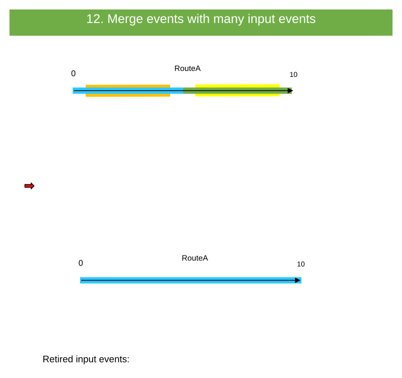

### TC-U06 — Merge Events with the Output Event Having the Same From Date as the Input <!-- src: S1 · slide 13 · case 15 -->

- **Case:** Merge events with the output event having the same From Date as the input events.

| RouteID | From Date | To Date | From Measure | To Measure |
| --- | --- | --- | --- | --- |
| RouteA | 1/1/2000 | Null | 0 | 10 |

| EventID | From Date | To Date | From Measure | Route | To Measure | Attribute |
| --- | --- | --- | --- | --- | --- | --- |
| Event1 | 1/1/2001 | Null | 0 | RouteA | 5 | X |
| Event2 | 1/1/2001 | Null | 5 | RouteB | 10 | Y |

| EventID | From Date | To Date | From Measure | Route | To Measure | Attribute |
| --- | --- | --- | --- | --- | --- | --- |
| Event1 | 1/1/2001 | Null | 0 | RouteA | 10 | X |

Input events will be removed with the output event since Event1 and Event2’s From/To Dates are the same date.

[figure: RouteA · RouteB · RouteC · RouteD · 0 · 10]

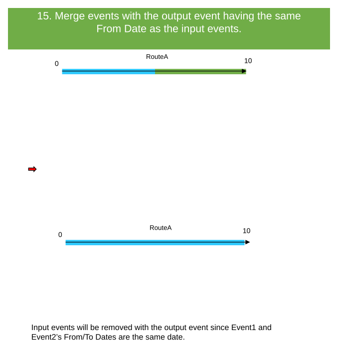

### TC-U07 — Merge Events with the Output Event Having the Same From Date as One of the Input <!-- src: S1 · slide 14 · case 16 -->

- **Case:** Merge events with the output event having the same From Date as one of the input events.

| RouteID | From Date | To Date | From Measure | To Measure |
| --- | --- | --- | --- | --- |
| RouteA | 1/1/2000 | Null | 0 | 10 |

| EventID | From Date | To Date | From Measure | Route | To Measure | Attribute |
| --- | --- | --- | --- | --- | --- | --- |
| Event1 | 1/1/2002 | Null | 0 | RouteA | 5 | X |
| Event2 | 1/1/2001 | Null | 5 | RouteB | 10 | Y |

| EventID | From Date | To Date | From Measure | Route | To Measure | Attribute |
| --- | --- | --- | --- | --- | --- | --- |
| Event1 | 1/1/2002 | Null | 0 | RouteA | 10 | X |

Retired input events (Event1 is removed):

| EventID | From Date | To Date | From Measure | Route | To Measure | Attribute |
| --- | --- | --- | --- | --- | --- | --- |
| Event2 | 1/1/2001 | 1/1/2002 | 5 | RouteB | 10 | Y |

[figure: RouteA · RouteB · RouteC · RouteD · 0 · 10]

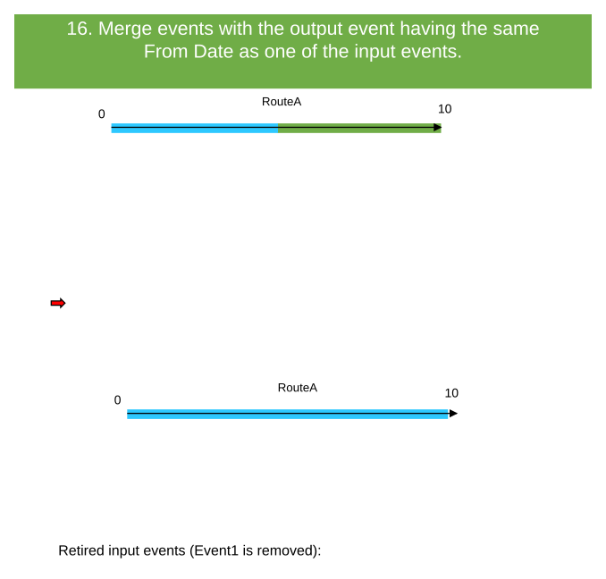

### TC-U08 — Merge complex events <!-- src: S2 · slide 15 · case 17 -->

| EventID | From Date | To Date | From Measure | Route | To Measure | Attribute |
| --- | --- | --- | --- | --- | --- | --- |
| Event1 | 1/1/2002 | Null | 0 | RouteA | 5 | X |
| Event2 | 1/1/2001 | Null | 5 | RouteB | 10 | Y |

| EventID | From Date | To Date | From Measure | Route | To Measure | Attribute |
| --- | --- | --- | --- | --- | --- | --- |
| Event1 | 1/1/2005 | Null | 0 | RouteA | 10 | X |

| EventID | From Date | To Date | From Measure | Route | To Measure | Attribute |
| --- | --- | --- | --- | --- | --- | --- |
| Event1 | 1/1/2002 | 1/1/2005 | 0 | RouteA | 5 | X |
| Event2 | 1/1/2001 | 1/1/2005 | 5 | RouteB | 10 | Y |

[figure: RouteA · 0 · 10 · Retired input events]

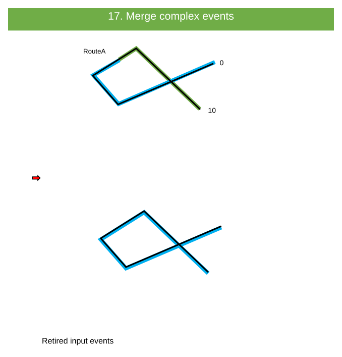

### TC-U09 — Merge vertical events <!-- src: S2 · slide 16 · case 18 -->

| EventID | From Date | To Date | From Measure | Route | To Measure | Attribute |
| --- | --- | --- | --- | --- | --- | --- |
| Event1 | 1/1/2002 | Null | 0 | RouteA | 5 | X |
| Event2 | 1/1/2001 | Null | 5 | RouteB | 10 | Y |

| EventID | From Date | To Date | From Measure | Route | To Measure | Attribute |
| --- | --- | --- | --- | --- | --- | --- |
| Event1 | 1/1/2005 | Null | 0 | RouteA | 10 | X |

| EventID | From Date | To Date | From Measure | Route | To Measure | Attribute |
| --- | --- | --- | --- | --- | --- | --- |
| Event1 | 1/1/2002 | 1/1/2005 | 0 | RouteA | 5 | X |
| Event2 | 1/1/2001 | 1/1/2005 | 5 | RouteB | 10 | Y |

[figure: RouteA · 0 · 10 · Retired input events]

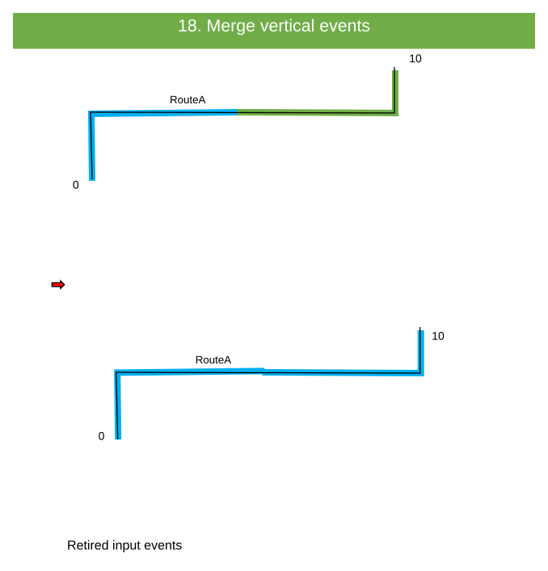

### TC-U10 — Only One Line Event Is Selected. <!-- src: S1 · slide 17 · case 1 -->

| RouteID | From Date | To Date | From Measure | To Measure |
| --- | --- | --- | --- | --- |
| RouteA | 1/1/2000 | Null | 0 | 10 |
| RouteB | 1/1/2000 | Null | 100 | 200 |
| RouteC | 1/1/2000 | Null | 0.23 | 1.65 |
| RouteD | 1/1/2000 | Null | 10 | 12 |

| EventID | From Date | To Date | From Route | From Measure | To Route | To Measure | Attribute |
| --- | --- | --- | --- | --- | --- | --- | --- |
| Event1 | 1/1/2001 | Null | RouteA | 0 | RouteB | 150 | X |

Only one event is selected.  The tools requires 2 minimum input events.

[figure: Error · RouteA · RouteB · RouteC · RouteD · 0 · 200/0.23 · 10/100 · 1.65/10 · 12]

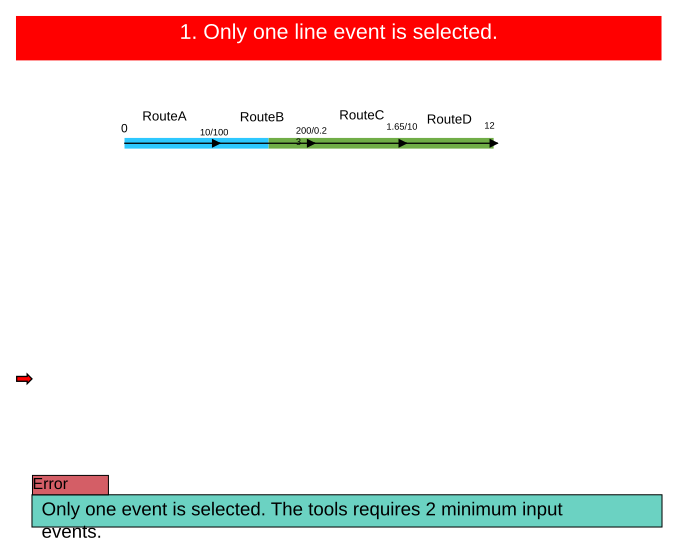

### TC-U11 — From Date / To Date Is Changed To Dates Outside the Time Extent. <!-- src: S1 · slide 18 · case 2 -->

| RouteID | From Date | To Date | From Measure | To Measure |
| --- | --- | --- | --- | --- |
| RouteA | 1/1/2000 | Null | 0 | 10 |
| RouteB | 1/1/2000 | Null | 100 | 200 |
| RouteC | 1/1/2000 | Null | 0.23 | 1.65 |
| RouteD | 1/1/2000 | Null | 10 | 12 |

| EventID | From Date | To Date | From Route | From Measure | To Route | To Measure | Attribute |
| --- | --- | --- | --- | --- | --- | --- | --- |
| Event1 | 1/1/2001 | Null | RouteA | 0 | RouteB | 150 | X |
| Event2 | 1/1/2001 | Null | RouteB | 150 | RouteD | 12 | Y |

| EventID | From Date | To Date | From Route | From Measure | To Route | To Measure | Attribute |
| --- | --- | --- | --- | --- | --- | --- | --- |
| Event1 | 1/1/1600 | 1/1/3500 | RouteA | 0 | RouteD | 12 | X |

The From and To Date values are not within the time extent of the map’s data.

[figure: Error · RouteA · RouteB · RouteC · RouteD · 0 · 200/0.23 · 10/100 · 1.65/10 · 12]

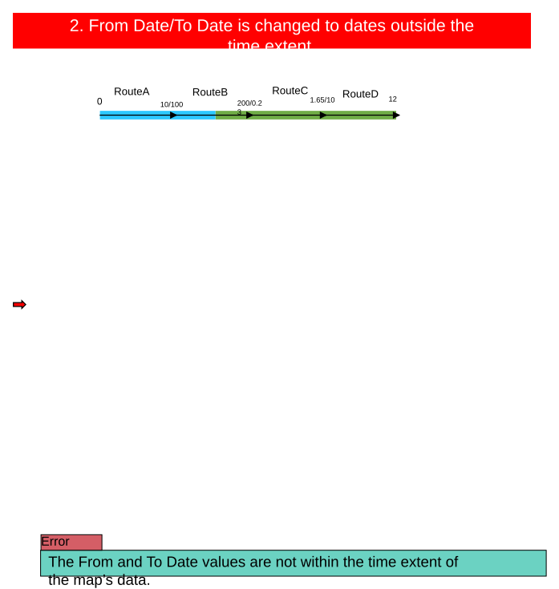

### TC-U12 — The Resultant Merged Event’s To Date Is Before the Resultant Merged Event’s From <!-- src: S1 · slide 23 · case 8 -->

- **Case:** The resultant merged event’s To Date is before the resultant merged event’s From Date.

| RouteID | From Date | To Date | From Measure | To Measure |
| --- | --- | --- | --- | --- |
| RouteA | 1/1/2000 | Null | 0 | 10 |

| EventID | From Date | To Date | Route | From Measure | To Measure | Attribute |
| --- | --- | --- | --- | --- | --- | --- |
| Event1 | 1/1/2000 | Null | RouteA | 0 | 5 | X |
| Event2 | 1/1/2010 | Null | RouteA | 5 | 10 | Y |

The output event’s To Date value is before the From Date value.

| EventID | From Date | To Date | From Measure | To Measure | Attribute |
| --- | --- | --- | --- | --- | --- |
| Event1 | 1/1/2020 | 1/1/2005 | 0 | 10 | X |

[figure: RouteA · Error · 0 · 10]

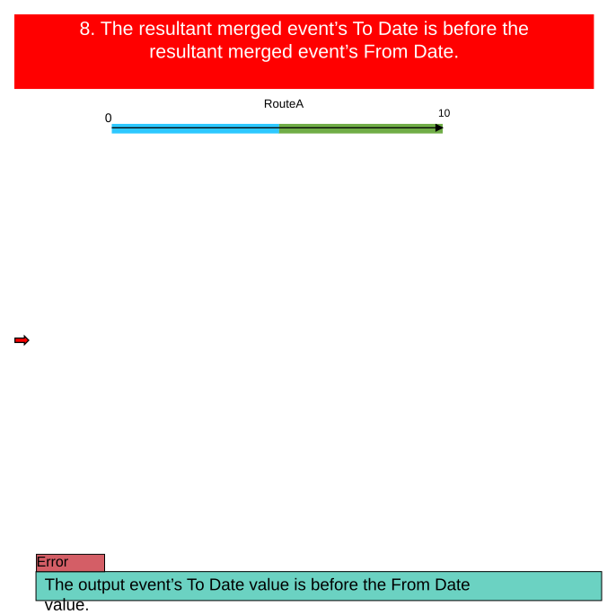

### TC-U13 — The Resultant Merged Event’s To Date Is the Same Date as the Resultant Merged <!-- src: S1 · slide 24 · case 9 -->

- **Case:** The resultant merged event’s To Date is the same date as the resultant merged event’s From Date.

| RouteID | From Date | To Date | From Measure | To Measure |
| --- | --- | --- | --- | --- |
| RouteA | 1/1/2000 | Null | 0 | 10 |

| EventID | From Date | To Date | Route | From Measure | To Measure | Attribute |
| --- | --- | --- | --- | --- | --- | --- |
| Event1 | 1/1/2000 | Null | RouteA | 0 | 5 | X |
| Event2 | 1/1/2010 | Null | RouteA | 5 | 10 | Y |

The output event’s From and To Dates are the same value.

| EventID | From Date | To Date | From Measure | To Measure | Attribute |
| --- | --- | --- | --- | --- | --- |
| Event1 | 1/1/2015 | 1/1/2015 | 0 | 10 | X |

[figure: RouteA · Error · 0 · 10]

### TC-U14 — Select Input Events That Belong To Multiple Lines on a Line Network. <!-- src: S1 · slide 25 · case 10 -->

| RouteID | From Date | To Date | From Measure | To Measure |
| --- | --- | --- | --- | --- |
| RouteA | 1/1/2000 | Null | 0 | 10 |
| RouteB | 1/1/2000 | Null | 100 | 200 |
| RouteC | 1/1/2010 | Null | 0.23 | 1.65 |
| RouteD | 1/1/2010 | Null | 10 | 12 |

| EventID | From Date | To Date | From Route | From Measure | To Route | To Measure | Attribute |
| --- | --- | --- | --- | --- | --- | --- | --- |
| Event1 | 1/1/2000 | Null | RouteA | 0 | RouteB | 200 | X |
| Event2 | 1/1/2010 | Null | RouteC | 0.23 | RouteD | 12 | Y |

The input events belong to different line.

[figure: Error · Line 1 · Line 2 · RouteA · RouteB · RouteC · RouteD · 0 · 200/0.23 · 10/100 · 1.65/10 · 12]

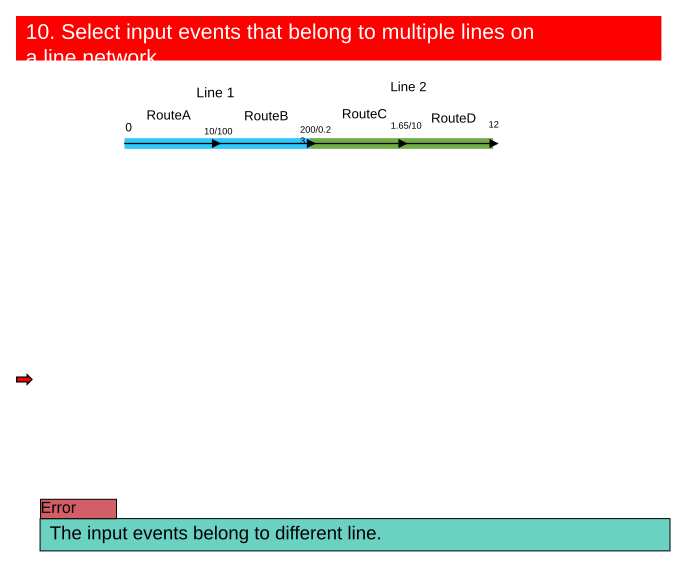

### TC-U15 — Select Input Events That Belong To Multiple Routes for a Non-spanning Event. <!-- src: S1 · slide 26 · case 11 -->

| RouteID | From Date | To Date | From Measure | To Measure |
| --- | --- | --- | --- | --- |
| RouteA | 1/1/2000 | Null | 0 | 10 |
| RouteB | 1/1/2000 | Null | 0 | 15 |

| EventID | From Date | To Date | From Measure | Route | To Measure | Attribute |
| --- | --- | --- | --- | --- | --- | --- |
| Event1 | 1/1/2000 | Null | 0 | RouteA | 10 | X |
| Event2 | 1/1/2010 | Null | 0 | RouteB | 15 | Y |

The input events belong to a non-spanning event.  The output event cannot be spanning.

[figure: RouteA · RouteB · RouteC · RouteD · Error · 0 · 10/0 · 15]

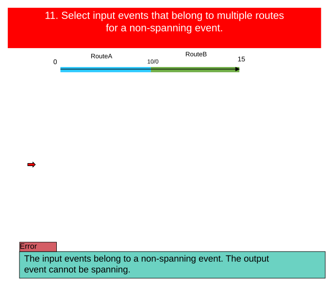

### TC-U16 — Route on Line Network with Input Events Is Reversed. <!-- src: S1 · slide 27 · case 17 -->

| RouteID | From Date | To Date | From Measure | To Measure |
| --- | --- | --- | --- | --- |
| RouteA | 1/1/2000 | Null | 10 | 0 |
| RouteB | 1/1/2000 | Null | 100 | 200 |
| RouteC | 1/1/2000 | Null | 0.23 | 1.65 |
| RouteD | 1/1/2000 | Null | 10 | 12 |

| EventID | From Date | To Date | From Route | From Measure | To Route | To Measure | Attribute |
| --- | --- | --- | --- | --- | --- | --- | --- |
| Event1 | 1/1/2000 | Null | RouteA | 0 | RouteA | 10 | X |
| Event2 | 1/1/2000 | Null | RouteB | 100 | RouteD | 12 | Y |

One route that houses an input event is reversed.  All input routes must be increase in calibration.

[figure: Error · RouteA · RouteB · RouteC · RouteD · 10 · 200/0.23 · 0/100 · 1.65/10 · 12]

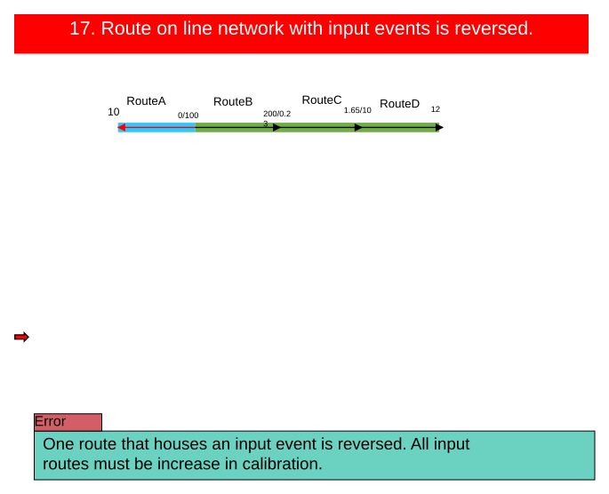

### TC-U17 — Selected events to merge are non-adjacent <!-- src: S2 · slide 28 · case 18 -->

| RouteID | From Date | To Date | From Measure | To Measure |
| --- | --- | --- | --- | --- |
| RouteA | 1/1/2000 | Null | 0 | 10 |
| RouteB | 1/1/2000 | Null | 100 | 200 |
| RouteC | 1/1/2000 | Null | 0.23 | 1.65 |
| RouteD | 1/1/2000 | Null | 10 | 12 |

| EventID | From Date | To Date | From Route | From Measure | To Route | To Measure | Attribute |
| --- | --- | --- | --- | --- | --- | --- | --- |
| Event1 | 1/1/2001 | Null | RouteA | 0 | RouteB | 120 | X |
| Event2 | 1/1/2001 | Null | RouteB | 150 | RouteD | 12 | Y |

The selected events to merge are non-adjacent. Events to merge must be adjacent or coincident.

[figure: Error · RouteA · RouteB · RouteC · RouteD · 0 · 200/0.23 · 10/100 · 1.65/10 · 12]

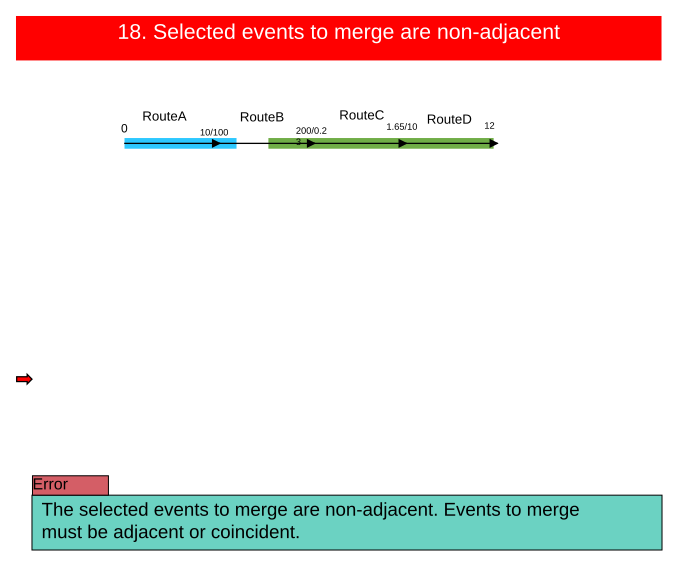

## Other content

### Slide 6 — Test Cases from Pro Test Plan: <!-- slide 6 -->

### Slide 7 — Merge events without changing To Date <!-- slide 7 -->

| RouteID | From Date | To Date | From Measure | To Measure |
| --- | --- | --- | --- | --- |
| RouteA | 1/1/2000 | Null | 0 | 10 |
| RouteB | 1/1/2000 | Null | 100 | 200 |
| RouteC | 1/1/2000 | Null | 0.23 | 1.65 |
| RouteD | 1/1/2000 | Null | 10 | 12 |

| EventID | From Date | To Date | From Route | From Measure | To Route | To Measure | Attribute |
| --- | --- | --- | --- | --- | --- | --- | --- |
| Event1 | 1/1/2001 | Null | RouteA | 0 | RouteB | 150 | X |
| Event2 | 1/1/2001 | Null | RouteB | 150 | RouteD | 12 | Y |

| EventID | From Date | To Date | From Route | From Measure | To Route | To Measure | Attribute |
| --- | --- | --- | --- | --- | --- | --- | --- |
| Event1 | 1/1/2005 | Null | RouteA | 0 | RouteD | 12 | X |

| EventID | From Date | To Date | From Route | From Measure | To Route | To Measure | Attribute |
| --- | --- | --- | --- | --- | --- | --- | --- |
| Event1 | 1/1/2001 | 1/1/2005 | RouteA | 0 | RouteB | 150 | X |
| Event2 | 1/1/2001 | 1/1/2005 | RouteB | 150 | RouteD | 12 | Y |

[figure: RouteA · RouteB · RouteC · RouteD · 0 · 200/0.23 · 10/100 · 1.65/10 · 12 · Retired input events:]

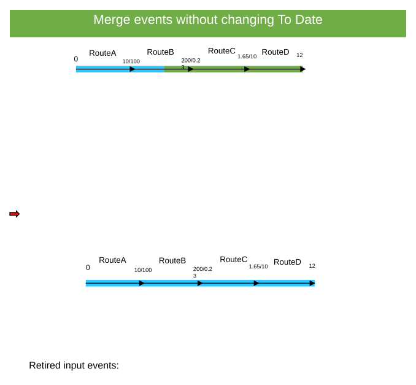

### Slide 19 <!-- slide 19 -->

| RouteID | From Date | To Date | From Measure | To Measure |
| --- | --- | --- | --- | --- |
| RouteA | 1/1/2000 | 1/1/2015 | 0 | 10 |
| RouteB | 1/1/2000 | Null | 100 | 200 |
| RouteC | 1/1/2010 | Null | 0.23 | 1.65 |
| RouteD | 1/1/2010 | Null | 10 | 12 |

| EventID | From Date | To Date | From Route | From Measure | To Route | To Measure | Attribute |
| --- | --- | --- | --- | --- | --- | --- | --- |
| Event1 | 1/1/2001 | Null | RouteA | 0 | RouteB | 200 | X |
| Event2 | 1/1/2001 | Null | RouteC | 0.23 | RouteD | 12 | Y |

3A. Resultant merged event’s From Date is after the From Route’s To Date.
The From Route does not exist in the selected time frame.

| EventID | From Date | To Date | From Route | From Measure | To Route | To Measure | Attribute |
| --- | --- | --- | --- | --- | --- | --- | --- |
| Event1 | 1/1/2020 | Null | RouteA | 0 | RouteD | 12 | X |

[figure: Error · RouteA · RouteB · RouteC · RouteD · 0 · 200/0.23 · 10/100 · 1.65/10 · 12]

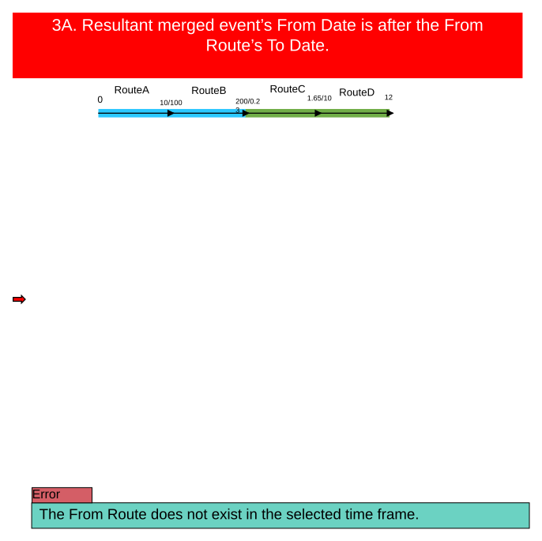

### Slide 20 <!-- slide 20 -->

| RouteID | From Date | To Date | From Measure | To Measure |
| --- | --- | --- | --- | --- |
| RouteA | 1/1/2000 | Null | 0 | 10 |
| RouteB | 1/1/2000 | Null | 100 | 200 |
| RouteC | 1/1/2010 | Null | 0.23 | 1.65 |
| RouteD | 1/1/2010 | 1/1/2015 | 10 | 12 |

| EventID | From Date | To Date | From Route | From Measure | To Route | To Measure | Attribute |
| --- | --- | --- | --- | --- | --- | --- | --- |
| Event1 | 1/1/2001 | Null | RouteA | 0 | RouteB | 200 | X |
| Event2 | 1/1/2010 | Null | RouteC | 0.23 | RouteD | 12 | Y |

3B. Resultant merged event’s From Date is after the To Route’s To Date.
The To Route does not exist in the selected time frame.

| EventID | From Date | To Date | From Route | From Measure | To Route | To Measure | Attribute |
| --- | --- | --- | --- | --- | --- | --- | --- |
| Event1 | 1/1/2020 | Null | RouteA | 0 | RouteD | 12 | X |

[figure: Error · RouteA · RouteB · RouteC · RouteD · 0 · 200/0.23 · 10/100 · 1.65/10 · 12]

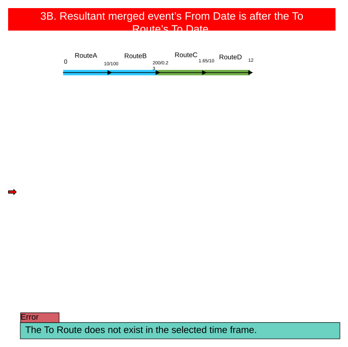

### Slide 21 <!-- slide 21 -->

| RouteID | From Date | To Date | From Measure | To Measure |
| --- | --- | --- | --- | --- |
| RouteA | 1/1/2000 | Null | 0 | 10 |
| RouteB | 1/1/2000 | Null | 100 | 200 |
| RouteC | 1/1/2010 | Null | 0.23 | 1.65 |
| RouteD | 1/1/2010 | Null | 10 | 12 |

| EventID | From Date | To Date | From Route | From Measure | To Route | To Measure | Attribute |
| --- | --- | --- | --- | --- | --- | --- | --- |
| Event1 | 1/1/2001 | Null | RouteA | 0 | RouteB | 200 | X |
| Event2 | 1/1/2010 | Null | RouteC | 0.23 | RouteD | 12 | Y |

4A. Resultant merged event’s To Date is before the From Route’s From Date.
The From Route does not exist in the selected time frame.

| EventID | From Date | To Date | From Route | From Measure | To Route | To Measure | Attribute |
| --- | --- | --- | --- | --- | --- | --- | --- |
| Event1 | 1/1/1995 | Null | RouteA | 0 | RouteD | 12 | X |

[figure: Error · RouteA · RouteB · RouteC · RouteD · 0 · 200/0.23 · 10/100 · 1.65/10 · 12]

### Slide 22 <!-- slide 22 -->

| RouteID | From Date | To Date | From Measure | To Measure |
| --- | --- | --- | --- | --- |
| RouteA | 1/1/2000 | Null | 0 | 10 |
| RouteB | 1/1/2000 | Null | 100 | 200 |
| RouteC | 1/1/2010 | Null | 0.23 | 1.65 |
| RouteD | 1/1/2010 | Null | 10 | 12 |

| EventID | From Date | To Date | From Route | From Measure | To Route | To Measure | Attribute |
| --- | --- | --- | --- | --- | --- | --- | --- |
| Event1 | 1/1/2001 | Null | RouteA | 0 | RouteB | 200 | X |
| Event2 | 1/1/2010 | Null | RouteC | 0.23 | RouteD | 12 | Y |

4B. Resultant merged event’s To Date is before the To Route’s From Date.
The To Route does not exist in the selected time frame.

| EventID | From Date | To Date | From Route | From Measure | To Route | To Measure | Attribute |
| --- | --- | --- | --- | --- | --- | --- | --- |
| Event1 | 1/1/1990 | Null | RouteA | 0 | RouteD | 12 | X |

[figure: Error · RouteA · RouteB · RouteC · RouteD · 0 · 200/0.23 · 10/100 · 1.65/10 · 12]

