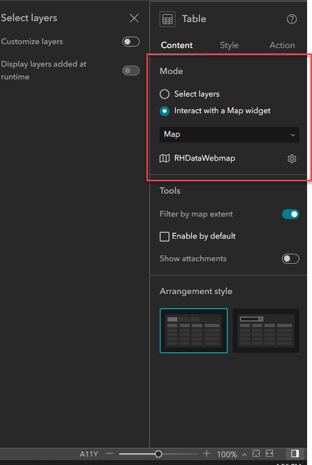
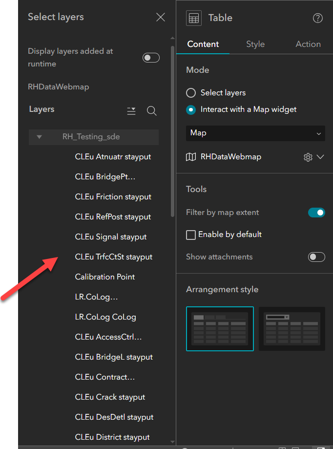

# Experience Builder Express Mode support for LRS widgets – Test Plan

| Field | Value |
| --- | --- |
| **Doc** | 174 · Test Plan · Experience Builder |
| **Product** | Roads & Highways · Pipeline Referencing · Utility Network |
| **Release** | — |
| **Issues** | [Beijing-R-D-Center/ExperienceBuilder-Web-Extensions#24773](https://devtopia.esri.com/Beijing-R-D-Center/ExperienceBuilder-Web-Extensions/issues/24773) |
| **Source** | [ExpressMode_SuppportLRSWidgets_TestPlan (1).pptx](<https://esriis.sharepoint.com/sites/LocationReferencing/Shared%20Documents/LR%20Product%20Engineers/ExpressMode_SuppportLRSWidgets_TestPlan%20(1).pptx>) |
| **People** | author Mac Christmas · PE Lakshmi · dev Eric |
| **Edited** | 2025-05-08 22:37 by Lakshmi Ananthanarayanan |
| **Extracted** | 2026-09-04 · lane xmlstrip · format 3.0 · prompt v2.0.2 |
| **Keywords** | express mode · lrs widgets · experience builder · configuration · testing · automation · search · identify |
| **Tools** | Search · Identify · Dynamic Segmentation · Add Line Event · Add Point Event · Split Event · Merge Events |

## Summary

Test plan for supporting Express Mode in LRS widgets within Experience Builder. Covers configuration, functionality, and compatibility testing of LRS widgets such as Search, Identify, Dynamic Segmentation, Add Line Event, Add Point Event, Split Event, and Merge Events in both express and non-express modes. Includes testing with various data types, themes, browsers, and devices, as well as automation updates and documentation requirements.

## Related documents

<!-- related:begin -->
- [Experience Builder Express Mode support for LRS widgets](<https://esriis.sharepoint.com/sites/lrsworkspace/LRS Doc Index/User Stories/exb-express-mode-support-for-lrs-widgets.md>) — similar text 0.45 · 6 title words · 2 filename words · same surface <!-- rel:184 s=6.4 -->
- [Experience Builder Support Multiple LRS Services in Web Map](<https://esriis.sharepoint.com/sites/lrsworkspace/LRS Doc Index/User Stories/exb-support-multiple-lrs-services-in-web-map.md>) — similar text 0.26 · 3 title words · same surface <!-- rel:178 s=4.085 -->
- [ArcGIS Roads and Highways Experience Builder Widgets](<https://esriis.sharepoint.com/sites/lrsworkspace/LRS Doc Index/Other/667-arcgis-rh-exb-widgets.md>) — similar text 0.18 · 3 title words · same surface <!-- rel:398 s=3.734 -->
- [ArcGIS Pipeline Referencing Experience Builder Widgets](<https://esriis.sharepoint.com/sites/lrsworkspace/LRS Doc Index/Other/667-arcgis-apr-exb-widgets.md>) — similar text 0.17 · 3 title words · same surface <!-- rel:399 s=3.571 -->
- [Add Spanning Line Events to Dominant Routes in Experience Builder – Test Plan](<https://esriis.sharepoint.com/sites/lrsworkspace/LRS Doc Index/Test Plans/24793-add-spanning-line-events-to-dominant-routes-in-exb.md>) — similar text 0.17 · 2 title words · same kind/surface <!-- rel:170 s=3.546 -->
<!-- related:end -->

<!-- docs:begin -->
## Esri documentation

[Apply dynamic segmentation](https://doc.esri.com/en/arcgis-pro/latest/help/production/roads-highways/apply-dynamic-segmentation.html) · [Merge events](https://doc.esri.com/en/arcgis-pro/latest/help/production/roads-highways/merge-events.html)

_No page matched:_ [Search](https://www.google.com/search?q=%22Search%22+site%3Adoc.esri.com) · [Identify](https://www.google.com/search?q=%22Identify%22+site%3Adoc.esri.com) · [Add Line Event](https://www.google.com/search?q=%22Add%20Line%20Event%22+site%3Adoc.esri.com) · [Add Point Event](https://www.google.com/search?q=%22Add%20Point%20Event%22+site%3Adoc.esri.com) · [Split Event](https://www.google.com/search?q=%22Split%20Event%22+site%3Adoc.esri.com)
<!-- docs:end -->

---

## Overview

### Slide 1 — Experience Builder Express Mode support for LRS widgets – Test Plan <!-- slide 1 -->

https://devtopia.esri.com/Beijing-R-D-Center/ExperienceBuilder-Web-Extensions/issues/24773

PE: Lakshmi
Dev: Eric

### Slide 2 — Devtopia Issue <!-- slide 2 -->

Experience Builder Express Mode support for LRS widgets

**Notes**
- LRS Widgets to support Express Mode – Search , Identify , Dynamic segmentation, Add Line Event, Add Point Event, Split Event, Merge Events
- Test all the LRS widgets support express mode
- Test all the LRS widgets continue to support non express mode
- Test with LRS templates. In template upon configuring maps, all the LRS widgets gets configured.
- Test with RH data , APR data ,UN data , Addressing Data and PoM Data
- Sanity check branch version and table widgets also gets configured in express mode to support user workflow – not required
- Test auto-generated, single-field, and multi-field RouteID configurations
- Test with networks /events with RouteID vs. RouteName configured
- Test with projected and unprojected data
- Test with different themes
- Test in Chrome and Edge (other browsers will be covered in automation)
- Test i18n and accessibility testing
- Test in Web, Tablet, and Mobile configurations

## Test Cases

### TC-U01 — Verification (1) <!-- src: S5 · slide 3 · label Verification -->

**Steps:**
1. Verify upon configuring the map all the LRS widgets are configured with the layers from map automatically in express mode
2. In all the LRS widgets , Mode option should be available and by default it is configured with Interact with a map widget
3. Verify by default all layers from the map are configured in the LRS widgets
4. Verify that the layers are organized by type(LRS Minimum Schema, LRS Network, LRS Event, LRS Intersection, Non-LRS layers). Continue to exclude tables. 5. Verify any layers that are part of Utility Network or Addressing are denoted

### TC-U02 — Verification (2) <!-- src: S5 · slide 4 · label Verification -->

**Steps:**
1. Verify that the default options for the layers are honored in each LRS widget
2. Verify there is accordion that can be expanded/collapsed to show all the layers

### TC-U03 — Test cases <!-- src: S5 · slide 4 · label Test cases -->

**Steps:**
1. For all LRS widgets, test they are configured correctly both in express mode and in non express mode
2. Test all the configuration options continue to work as expected. Check the default configuration for all the LRS widgets without express mode and make sure with express mode the default configuration options for all the LRS widgets are honored.
3. Test the functionality of the LRS widgets works as expected (sanity testing)
4. Add more than one map widget , add two different webmaps and add the LRS widgets. Make sure the LRS widgets are configured in LRS widget using express mode using the current map.
5. Change the web map in the Map widget and test all the other widgets reflect the change.
6. If the map is not configured with any web map show a message in the widgets stating that map does not contain a web map
7. For the PoM data verify the search and identify widget. If the added web map do not have any event layers , verify a message is added in Add point/Add Line , Merge , split and Dynseg widgets.
8. After setting up the widget change the version and make sure the configs are honored.

## Other content

### Slide 3 <!-- slide 3 -->

### Slide 5 <!-- slide 5 -->

| Automation |
| --- |
| Existing automation will break. Update the existing Experiences configuration automation to support express mode. |

| Documentation |
| --- |
| For all the LRS widgets, document that express mode configuration and explain the user experience using express mode in each LRS widget. |
