# Location Offset Method in Add Point and Add Line Widgets Test Plan

| Field | Value |
| --- | --- |
| **Doc** | 48 · Test Plan · Experience Builder |
| **Product** | — |
| **Release** | — |
| **Issues** | [Beijing-R-D-Center/ExperienceBuilder-Web-Extensions#24790](https://devtopia.esri.com/Beijing-R-D-Center/ExperienceBuilder-Web-Extensions/issues/24790) |
| **Source** | [24790-LocationOffsetMethodinAddPointandLine_TestPlanV1.pptx](<https://esriis.sharepoint.com/sites/LocationReferencing/Shared%20Documents/General/Test%20Plans/24790-LocationOffsetMethodinAddPointandLine_TestPlanV1.pptx>) · rev V1 |
| **People** | author Mac Christmas · PE — · dev — |
| **Edited** | 2025-05-30 21:27 by Mac Christmas |
| **Extracted** | 2026-09-04 · lane xmlstrip · format 3.0 · prompt v2.0.2 |
| **Keywords** | location offset · add point event · add line event · calibration point · referent method · offset units · route · point event · line event · gapped route · self intersecting location · conflict prevention · intellisense · pop-up selection |
| **Tools** | Add Point Event · Add Line Event · Search by Route Widget |

## Summary

Test plan for adding Location Offset functionality to the Add Point Event and Add Line Event widgets in Experience Builder. It covers configuration, UI behavior, positive and negative test cases involving offsets with calibration points, LRS intersections, and non-LRS features across various route types and units. The plan includes validation of conflict prevention, intellisense, pop-up selection, and data action integration.

## Related documents

<!-- related:begin -->
- [Add Line Events by offsetting from other points – Test Plan](<https://esriis.sharepoint.com/sites/lrsworkspace/LRS Doc Index/Test Plans/3913-add-line-events-by-offsetting-from-other-points.md>) — similar text 0.77 · 2 title words · 3 filename words · same kind/folder <!-- rel:231 s=8.659 -->
- [Coordinates Method in Add Point and Add Line Widgets Test Plan](<https://esriis.sharepoint.com/sites/lrsworkspace/LRS Doc Index/Test Plans/24791-coordinates-method-in-add-point-and-add-line-widgets.md>) — similar text 0.19 · 5 title words · 4 filename words · same kind/surface/folder <!-- rel:49 s=7.47 -->
- [Experience Builder Referent method in Add Point and Line widgets](<https://esriis.sharepoint.com/sites/lrsworkspace/LRS Doc Index/User Stories/exb-referent-method-in-add-point-and-line-widgets.md>) — similar text 0.13 · 5 title words · 3 filename words · same surface <!-- rel:177 s=6.326 -->
- [Add Line Event Tools – Intersection Location Offset Method Test Plan](<https://esriis.sharepoint.com/sites/lrsworkspace/LRS Doc Index/Test Plans/3910-add-line-event-tools-intersection-location-offset-method.md>) — similar text 0.20 · 4 title words · 3 filename words · same kind/surface/folder <!-- rel:618 s=6.206 -->
- [Add Point Events by offsetting from other points – Test Plan](<https://esriis.sharepoint.com/sites/lrsworkspace/LRS Doc Index/Test Plans/3906-add-point-events-by-offsetting-from-other-points.md>) — similar text 0.58 · 2 title words · 2 filename words · same kind/folder <!-- rel:241 s=5.691 -->
<!-- related:end -->

<!-- docs:begin -->
## Esri documentation

[Storing referent and offset information for event location](https://doc.esri.com/en/arcgis-pro/latest/help/production/location-referencing-pipelines/storing-referent-and-offset-information-for-event-location.html) · [Conflict prevention](https://doc.esri.com/en/arcgis-pro/latest/help/production/location-referencing-pipelines/conflict-prevention.html)

_No page matched:_ [Add Point Event](https://www.google.com/search?q=%22Add%20Point%20Event%22+site%3Adoc.esri.com) · [Add Line Event](https://www.google.com/search?q=%22Add%20Line%20Event%22+site%3Adoc.esri.com) · [Search by Route Widget](https://www.google.com/search?q=%22Search%20by%20Route%20Widget%22+site%3Adoc.esri.com)
<!-- docs:end -->

---

## Test Cases

### TC-P01 — Add Location Offset in the Methods <!-- src: S4 · slide 1 · Positive Tests: Configuration · 1 -->

- **Group:** Configuration
- **Case:** Add Location Offset in the Methods (Add Line will have it for both the From and To Methods)

### TC-P02 — Location Offset can be configured as the default Method in Add Point <!-- src: S4 · slide 1 · Positive Tests: Configuration · 2 -->

- **Group:** Configuration
- **Case:** Location Offset can be configured as the default Method in Add Point and the From/To Methods in Add Line

### TC-P03 — Add Default Offset Layer parameter <!-- src: S4 · slide 1 · Positive Tests: Configuration · 3 -->

- **Group:** Configuration

### TC-P04 — Any point layer from the web map can be configured as the Default Offset Layer <!-- src: S4 · slide 1 · Positive Tests: Configuration · 4 -->

- **Group:** Configuration
- **Case:** Any point layer from the web map can be configured as the Default Offset Layer (including calibration points)

### TC-P05 — Add Default Offset Units configuration parameter <!-- src: S4 · slide 1 · Positive Tests: Configuration · 5 -->

- **Group:** Configuration

### TC-P06 — Any supported unit can be set as the Default Offset Units <!-- src: S4 · slide 1 · Positive Tests: Configuration · 6 -->

- **Group:** Configuration

### TC-P07 — For individual layers that will be used as an offset layer <!-- src: S4 · slide 1 · Positive Tests: Configuration · 7 -->

- **Group:** Configuration
- **Case:** For individual layers that will be used as an offset layer, add a new configuration option for a display field that will be displayed in the tool UI (similar to Search by Route)

### TC-P08 — Chosen web map does not include any point features (1) <!-- src: S4 · slide 1 · Positive Tests: Configuration · 8 -->

- **Group:** Configuration
- **Case:** Chosen web map does not include any point features, don’t show the Location Offset method

### TC-P09 — Location Offset method can be chosen (when enabled) <!-- src: S4 · slide 1 · Positive Tests: Add Point/Add Line UI · 1 -->

- **Group:** Add Point / Add Line UI

### TC-P10 — Location Offset method is not displayed when disabled <!-- src: S4 · slide 1 · Positive Tests: Add Point/Add Line UI · 2 -->

- **Group:** Add Point / Add Line UI

### TC-P11 — Location Offset method is chosen as the default method (when configured) <!-- src: S4 · slide 1 · Positive Tests: Add Point/Add Line UI · 3 -->

- **Group:** Add Point / Add Line UI

### TC-P12 — RouteID/RouteName parameter continues to work as expected <!-- src: S4 · slide 1 · Positive Tests: Add Point/Add Line UI · 4 -->

- **Group:** Add Point / Add Line UI

### TC-P13 — RouteID/RouteName picker continues to work as expected <!-- src: S4 · slide 1 · Positive Tests: Add Point/Add Line UI · 5 -->

- **Group:** Add Point / Add Line UI

### TC-P14 — Offset feature can be chosen by entering the identifier field value or picked <!-- src: S4 · slide 1 · Positive Tests: Add Point/Add Line UI · 6 -->

- **Group:** Add Point / Add Line UI
- **Case:** Offset feature can be chosen by entering the identifier field value or picked from the map

### TC-P15 — Offset measure can be chosen by entering the offset value or picking from <!-- src: S4 · slide 1 · Positive Tests: Add Point/Add Line UI · 7 -->

- **Group:** Add Point / Add Line UI
- **Case:** Offset measure can be chosen by entering the offset value or picking from the map

### TC-P16 — Offset units can be chosen, every supported Esri unit is available <!-- src: S4 · slide 1 · Positive Tests: Add Point/Add Line UI · 8 -->

- **Group:** Add Point / Add Line UI

### TC-N01 — Input offset value does not fall on route <!-- src: S4 · slide 2 · Negative Tests · 1 -->

### TC-N02 — Input offset feature does not belong to the same route as the chosen route <!-- src: S4 · slide 2 · Negative Tests · 2 -->

### TC-N03 — Input invalid date range <!-- src: S4 · slide 2 · Negative Tests · 3 -->

### TC-N04 — Input invalid RouteID/RouteName <!-- src: S4 · slide 2 · Negative Tests · 4 -->

### TC-N05 — Input invalid feature identifier <!-- src: S4 · slide 2 · Negative Tests · 5 -->

### TC-N06 — Input invalid offset <!-- src: S4 · slide 2 · Negative Tests · 6 -->

### TC-N07 — Input calibration point associated with other LRS Network as the offset feature. <!-- src: S4 · slide 2 · Negative Tests · 7 -->

- **Case:** Input calibration point associated with other LRS Network as the offset feature. Show error that calibration point feature must belong to input route/network

### TC-P17 — For Add Line, test the above for the From and To Methods <!-- src: S4 · slide 2 · Positive Tests: Add Point/Add Line UI (Continued) · 1 -->

- **Group:** Add Point / Add Line UI (Continued)

### TC-P18 — Ensure data actions from other widgets continue to populate Add Point and Add <!-- src: S4 · slide 2 · Positive Tests: Add Point/Add Line UI (Continued) · 2 -->

- **Group:** Add Point / Add Line UI (Continued)
- **Case:** Ensure data actions from other widgets continue to populate Add Point and Add Line widgets as expected

### TC-P19 — Markers appear on map when a valid offset is chosen <!-- src: S4 · slide 2 · Positive Tests: Add Point/Add Line UI (Continued) · 3 -->

- **Group:** Add Point / Add Line UI (Continued)

### TC-P20 — Ensure intellisense experience works as expected for feature identifier <!-- src: S4 · slide 2 · Positive Tests: Add Point/Add Line UI (Continued) · 4 -->

- **Group:** Add Point / Add Line UI (Continued)
- **Case:** Ensure intellisense experience works as expected for feature identifier parameters (Text or GUID values)

### TC-P21 — Once an offset feature is chosen <!-- src: S4 · slide 2 · Positive Tests: Add Point/Add Line UI (Continued) · 5 -->

- **Group:** Add Point / Add Line UI (Continued)
- **Case:** Once an offset feature is chosen, blink it in the map but do not keep it highlighted

### TC-P22 — If more than one point feature exists at the clicked location <!-- src: S4 · slide 2 · Positive Tests: Add Point/Add Line UI (Continued) · 6 -->

- **Group:** Add Point / Add Line UI (Continued)
- **Case:** If more than one point feature exists at the clicked location, display pop-up that allows user to pick which feature they would like to use

### TC-P23 — Fields to display for each layer type within pop-up <!-- src: S4 · slide 2 · Positive Tests: Add Point/Add Line UI (Continued) · 7 -->

- **Group:** Add Point / Add Line UI (Continued)

### TC-P24 — Calibration Points: Measure <!-- src: S4 · slide 2 · Positive Tests: Add Point/Add Line UI (Continued) · 8 -->

- **Group:** Add Point / Add Line UI (Continued)

### TC-P25 — LRS Intersections: Intersection Name, Measure <!-- src: S4 · slide 2 · Positive Tests: Add Point/Add Line UI (Continued) · 9 -->

- **Group:** Add Point / Add Line UI (Continued)

### TC-P26 — LRS Point Events: EventID, Display Field, Measure <!-- src: S4 · slide 2 · Positive Tests: Add Point/Add Line UI (Continued) · 10 -->

- **Group:** Add Point / Add Line UI (Continued)
- **Case:** LRS Point Events: EventID, Display Field, Measure (do not show EventID twice if it is configured as the Display Field)

### TC-P27 — Non-LRS Point Features: Display Field, Measure <!-- src: S4 · slide 2 · Positive Tests: Add Point/Add Line UI (Continued) · 11 -->

- **Group:** Add Point / Add Line UI (Continued)

### TC-P28 — If an LRS intersection or non-LRS point feature is picked and the feature falls <!-- src: S4 · slide 2 · Positive Tests: Add Point/Add Line UI (Continued) · 12 -->

- **Group:** Add Point / Add Line UI (Continued)
- **Case:** If an LRS intersection or non-LRS point feature is picked and the feature falls at a self-intersecting measure, display pop-up that allows user to pick which measure they would like to use

### TC-P29 — If a non-LRS feature is chosen as the offset <!-- src: S4 · slide 2 · Positive Tests: Add Point/Add Line UI (Continued) · 13 -->

- **Group:** Add Point / Add Line UI (Continued)
- **Case:** If a non-LRS feature is chosen as the offset, ensure intellisense only displays features on the route. If non-LRS point features have the same display field value, only the feature on the route should be selected and a pop-up should not appear

### TC-P30 — Picking an offset feature vs. typing in the Display Field value provides <!-- src: S4 · slide 2 · Positive Tests: Add Point/Add Line UI (Continued) · 14 -->

- **Group:** Add Point / Add Line UI (Continued)
- **Case:** Picking an offset feature vs. typing in the Display Field value provides the same offset feature selection experience

### TC-P31 — Chosen web map does not include any point features (2) <!-- src: S4 · slide 2 · Positive Tests: Add Point/Add Line UI (Continued) · 15 -->

- **Group:** Add Point / Add Line UI (Continued)
- **Case:** Chosen web map does not include any point features, don’t show the Location Offset method

## Other content

### Slide 1 — Devtopia Issue <!-- slide 1 -->

ExB – Location Offset Method in Add Line and Add Point Widgets

**Notes**
- Add Location Offset functionality to the Add Point Event and Add Line Event widgets
- Widgets will use same referent logic as in the Search by Route Referent method
- Test with LRS intersections, calibration points (new), LRS point events, and non-LRS point features as offset locations
- Test with complex shapes, including offset features that exist at self-intersecting locations along routes
- Test with nonline (auto-generated, single-field, and multi-field RouteID configurations) and line networks
- Test with different units of offset value
- Test positive and negative offsets. Cardinal offset will not be included as part of this user story
- Test with offsets that exceed route measures
- Test conflict prevention continues to work as expected
- Only event layers associated with the chosen network can be used as an offset feature
- Sanity test Merge coincident events and Retire overlapping events data validation options
- i18n and 508
- Referent population will not be part of this user story
- Use Pro Location Offset test cases for testing
- Sanity test Search by Route Widget’s Referent search functionality

### Slide 3 <!-- slide 3 -->

| EventID | RouteID | Measure | From Date | ToDate | AttenuatorCode |
| --- | --- | --- | --- | --- | --- |
| Attenuator1 | CM00A | 4.485485 mi. | 1/1/2000 |  | S1 |

Continuous – multi-field RID, point events do not have referent fields
1 - Add a point event using a positive offset with direction and a different unit from a calibration point on a simple route

| RouteID | Point Layer Name | Offset |
| --- | --- | --- |
| CM00A | Measure 2 (Calibration Point) | 4 km |

[figure: Input · Expected Result · CM00A · CP · Attenuator]

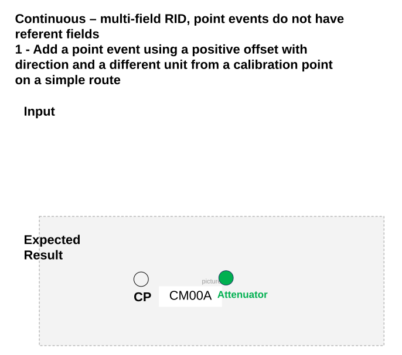

### Slide 4 <!-- slide 4 -->

Continuous – auto-generated RID
3 - Add a point event using a negative offset with a different unit from a calibration point

| RouteName | Point Layer Name | Offset |
| --- | --- | --- |
| R3 | Measure 2 (Calibration Point) | -800 meters |

CP has a defined measure, so offset will be from measure 2 even though the CP is at a self-intersecting measure

| EventID | RouteName | Measure | From Date | ToDate | Sign Type |
| --- | --- | --- | --- | --- | --- |
| Sign3 | R3 | 1.502903 mi | 1/1/2000 |  | Stop Sign |

[figure: Input · Expected Result · 10 · 2 · Sign · R3 · 0 · 4 · 6 · 12 · 14 · CP]

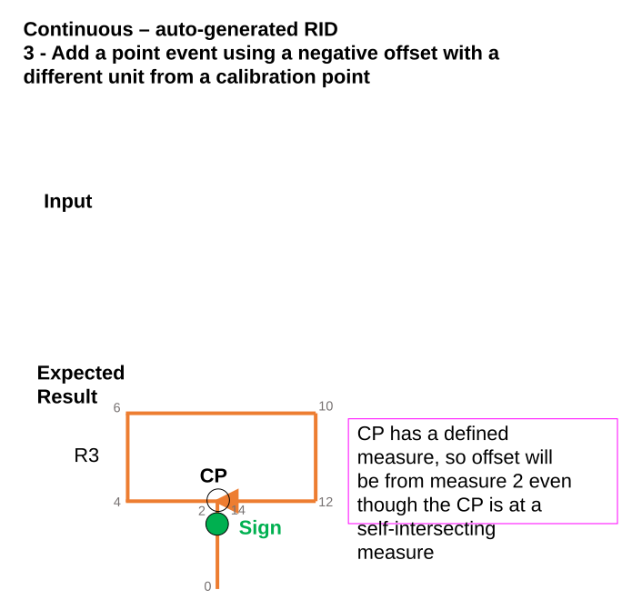

### Slide 5 <!-- slide 5 -->

Continuous - multi-field RID, point events do not have referent fields
2 - Add multiple point events using a negative offset from a calibration point on a gapped route (different measures on the ends)

| EventID | RouteID | Measure | From Date | ToDate | AttenuatorCode |
| --- | --- | --- | --- | --- | --- |
| Attenuator2 | CM00B | 2 | 1/1/2000 |  | S1 |

| RouteID | Point Layer Name | Offset |
| --- | --- | --- |
| CM00B | Measure 7 (Calibration Point) | -5 |

Use this case to sanity test a negative case: offset -1.95 but 5.05 is not on route

| EventID | RouteID | Measure | From Date | ToDate | NBI |
| --- | --- | --- | --- | --- | --- |
| Bridge1 | CM00B | 2 | 1/1/2000 |  | 96 |

[figure: Input · Expected Result · 0 · 10 · 5 · 5.1 · 7 · CM00B · Bridge · Attenuator · 2 · CP]

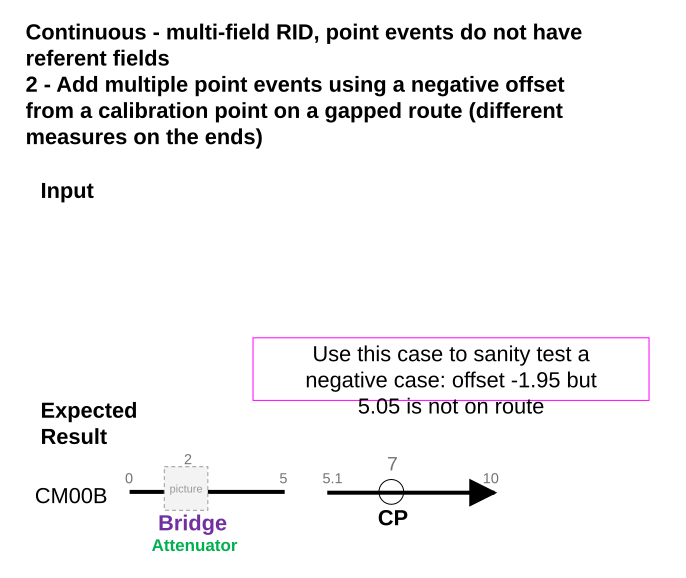

### Slide 6 <!-- slide 6 -->

| EventID | RouteName | Measure | From Date | ToDate | Anomaly |
| --- | --- | --- | --- | --- | --- |
| Anomaly1 | L1R1 | 3000 | 1/1/2000 |  | Crack |

Line – some point events have referent fields, some do not
1 - Add a point event with no referent fields using a negative offset from a calibration point on a simple route

| RouteName | Point Layer Name | Offset |
| --- | --- | --- |
| L1R1 | Measure 10000 (Calibration Point) | -7000 |

[figure: Input · Expected Result · L1R1 · Anomaly · L1R2 · 0 · 10000 · 5000 · CP]

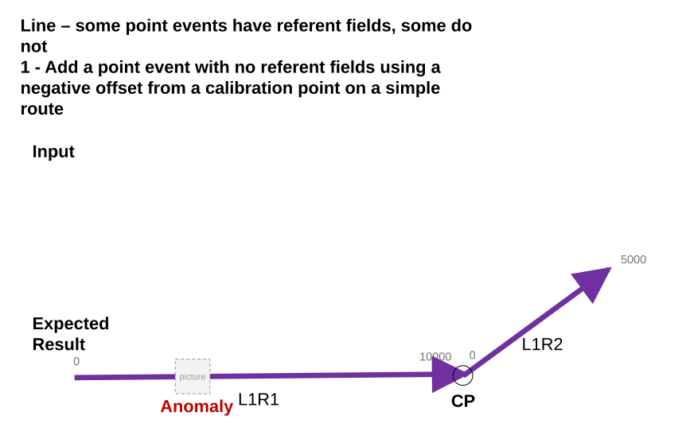

### Slide 7 <!-- slide 7 -->

| EventID | RouteName | Measure | From Date | ToDate | Anomaly |
| --- | --- | --- | --- | --- | --- |
| Anomaly1 | L1R1 | 0 | 1/1/2000 |  | Crack |

Line – some point events have referent fields, some do not
1a - Add a point event with no referent fields using an offset from a calibration point on a simple route

| RouteName | Point Layer Name | Offset |
| --- | --- | --- |
| L1R2 | Measure 0 (Calibration Point) | 0 |

[figure: Input · Expected Result · L1R1 · Anomaly · L1R2 · 0 · 10000 · 5000 · CP]

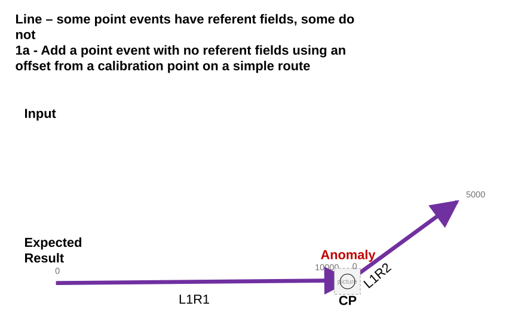

### Slide 8 <!-- slide 8 -->

| EventID | Route Name | From Measure | To Measure | From Date | To Date | Speed Limit |
| --- | --- | --- | --- | --- | --- | --- |
| Speed1 | R1 | 5 | 7 | 1/1/2000 |  | 55 |

Continuous – auto-generated RID, line event has referent fields
1 - Add a line event using positive offsets from a calibration point on a simple route

| Route Name | From Point Layer Name | From Offset | To Point Layer Name | To Offset |
| --- | --- | --- | --- | --- |
| R1 | Measure 2 (Calibration Point) | 3 | Measure 2 (Calibration Point) | 5 |

[figure: Input · Expected Result · R1 · CP]

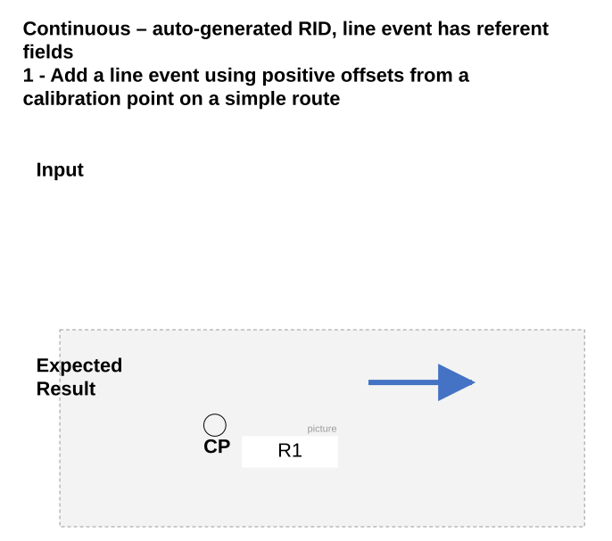

### Slide 9 <!-- slide 9 -->

| EventID | Route Name | From Measure | To Measure | From Date | ToDate | Speed Limit |
| --- | --- | --- | --- | --- | --- | --- |
| Speed1 | R1 | 5 | 7 | 1/1/2000 | <Null> | 55 |

Continuous – auto-generated RID, line event has referent fields
1a - Add a line event using offsets from different calibration point features on a simple route

| Route Name | From Point Layer Name | From Offset | To Point Layer Name | To Offset |
| --- | --- | --- | --- | --- |
| R1 | Measure 2 (Calibration Point) | 3 | Measure 8 (Calibration Point) | -1 |

[figure: Input · Expected Result · R1 · CP]

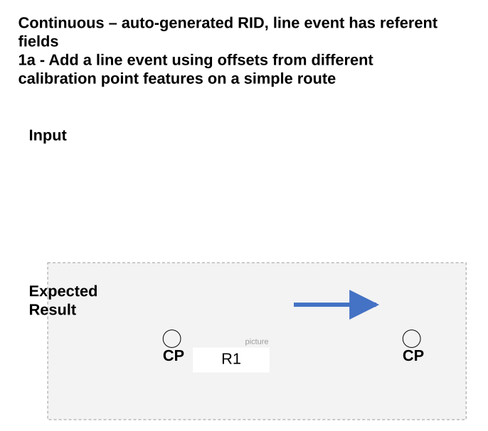

### Slide 10 <!-- slide 10 -->

| EventID | Route Name | From Measure | To Measure | From Date | ToDate | Speed Limit |
| --- | --- | --- | --- | --- | --- | --- |
| Speed1 | R1 | 5 | 7 | 1/1/2000 | <Null> | 55 |

Continuous – auto-generated RID, line event has referent fields
1b - Add a line event using offsets from different point features on a simple route, but always include calibration point [Mix and match point features for From and To Point Layer; Int and Point Event, Point Event and Point Feature, etc.]

| Route Name | From Point Layer Name | From Offset | To Point Layer Name | To Offset |
| --- | --- | --- | --- | --- |
| R1 | Measure 0 (Calibration Point) | 5 | MilePost 8 ( MilePost ) | -1 |

[figure: Input · Expected Result · R1 · MilePost · CP · Cafe]

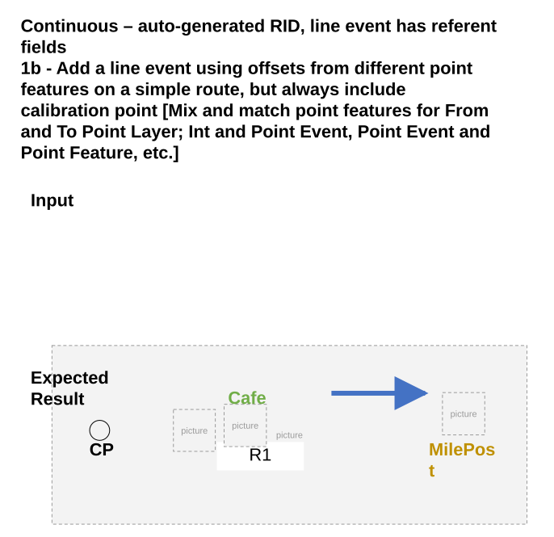

### Slide 11 <!-- slide 11 -->

| EventID | Route Name | From Measure | To Measure | From Date | ToDate | Speed Limit |
| --- | --- | --- | --- | --- | --- | --- |
| Speed1 | R2 | 2 | 9 | 1/1/2000 |  | Stop Sign |

Continuous – auto-generated RID, point events have referent fields
2a - Add multiple line events using a positive offset with direction from a calibration point on a gapped route (same measures on the ends). Input events will not split since measure is same on both ends (also test this case where measures are not same across the gap, events will split

| RouteName | From/To Point Layer Name | From Offset | To Offset |
| --- | --- | --- | --- |
| R2 | Measure 5 (Calibration Point) | -3 | 4 |

| EventID | Route Name | Measure | To Measure | From Date | ToDate | Func Class |
| --- | --- | --- | --- | --- | --- | --- |
| FuncClass1 | R2 | 2 | 9 | 1/1/2000 |  | Minor Collector |

[figure: Input · Expected Result · 0 · 10 · 5 · 2 · 7 · R2 · CP]

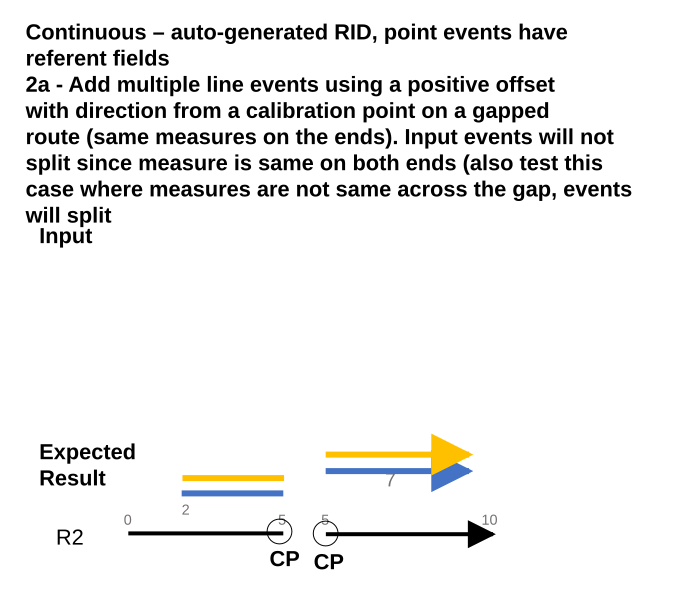

### Slide 12 <!-- slide 12 -->

| EventID | From Route Name | From Measure | To Route Name | To Measure | From Date | ToDate | DOT Class |
| --- | --- | --- | --- | --- | --- | --- | --- |
| DOTClass1 | L2R1 | 3000 | L2R2 | 2500 | 1/1/2000 |  | Class 1 |

Line – some line events have referent fields, some do not
2 - Add multiple line events using offsets from a calibration point on a simple route

| From Route Name | To Route Name | From Point Layer Name | To Point Layer Name | From Offset | To Offset |
| --- | --- | --- | --- | --- | --- |
| L2R1 | L2R2 | Measure 2000 (Calibration Point) | Measure 4000 (Calibration Point) | 1000 | -1500 |

| EventID | From Route Name | From Measure | To Route Name | To Measure | From Date | ToDate | Inspect. Type |
| --- | --- | --- | --- | --- | --- | --- | --- |
| Inspection Range1 | L2R1 | 3000 | L2R2 | 2500 | 1/1/2000 |  | Visual Survey |

[figure: Input · Expected Result · L2R1 · L2R2 · 0 · 10000 · 5000 · CP]

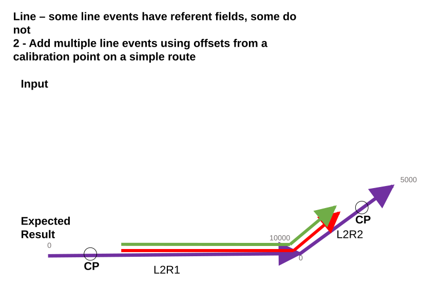

### Slide 13 <!-- slide 13 -->

| EventID | From Route Name | From Measure | To Route Name | To Measure | From Date | ToDate | DOT Class |
| --- | --- | --- | --- | --- | --- | --- | --- |
| DOTClass1 | L2R1 | 2000 | L2R2 | 4000 | 1/1/2000 |  | Class 1 |

Line – some line events have referent fields, some do not
2a - Add multiple line events using 0 offsets from a calibration point on a simple route

| From Route Name | To Route Name | From Point Layer Name | To Point Layer Name | From Offset | To Offset |
| --- | --- | --- | --- | --- | --- |
| L2R1 | L2R2 | Measure 2000 (Calibration Point) | Measure 4000 (Calibration Point) | 0 | 0 |

| EventID | From Route Name | From Measure | To Route Name | To Measure | From Date | ToDate | Inspect. Type |
| --- | --- | --- | --- | --- | --- | --- | --- |
| Inspection Range1 | L2R1 | 2000 | L2R2 | 4000 | 1/1/2000 |  | Visual Survey |

[figure: Input · Expected Result · L2R1 · L2R2 · 0 · 10000 · 5000 · CP]

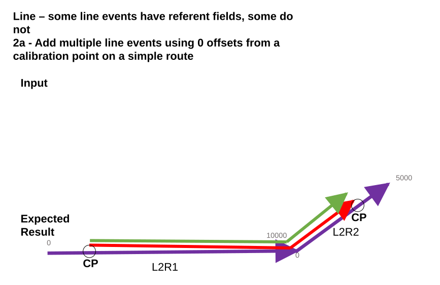

### Slide 14 <!-- slide 14 -->

| EventID | RouteName | Measure | Referent Method | ReferentID | Referent Offset | From Date | ToDate | Sign Type |
| --- | --- | --- | --- | --- | --- | --- | --- | --- |
| Sign2 | R2 | 2 | MilePost | 801 | -5 | 1/1/2000 |  | Stop Sign |

Continuous – auto-generated RID, point events have referent fields
2 - Add multiple point events using a positive offset with direction from a point event on a gapped route (same measures on the ends)

| RouteName | Point Layer Name | Offset |
| --- | --- | --- |
| R2 | 801 ( MilePost ) | W 5 |

| EventID | RouteName | Measure | Referent Method | ReferentID | Referent Offset | From Date | ToDate | Severity |
| --- | --- | --- | --- | --- | --- | --- | --- | --- |
| Crash1 | R2 | 2 | MilePost | 801 | -5 | 1/1/2000 |  | Minor |

[figure: MilePost · Input · Expected Result · 0 · 10 · 5 · 2 · 7 · Sign Crash · R2]

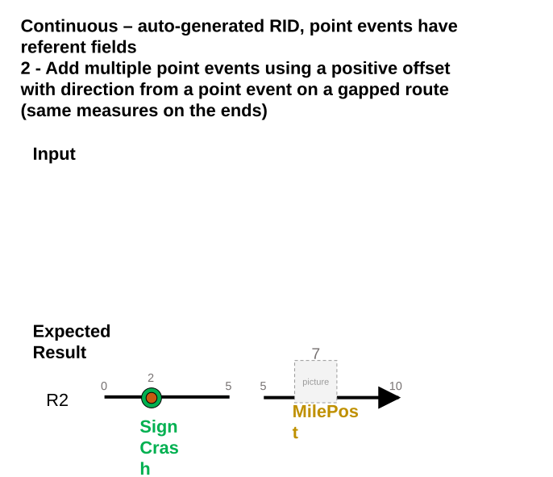

### Slide 15 <!-- slide 15 -->

Continuous – auto-generated RID, point events have referent fields
3 - Add a point event using a negative offset with a different unit from a point feature that is not added to dReferentMethod domain on a lollipop route

| RouteName | Point Layer Name | Offset |
| --- | --- | --- |
| R3 | 2 (Café) | -800 meters |

Point feature does not have M, so we use the smallest M at self intersection. In this test case, M is 2 (2,14).

| EventID | RouteName | Measure | Referent Method | ReferentID | Referent Offset | From Date | ToDate | Sign Type |
| --- | --- | --- | --- | --- | --- | --- | --- | --- |
| Sign3 | R3 | 1.502903 | C1 network | {R0003- | 1.502903 (mi) | 1/1/2000 |  | Stop Sign |

[figure: Input · Expected Result · 10 · 2 · Sign · R3 · 0 · 4 · 6 · 12 · 14 · Cafe]

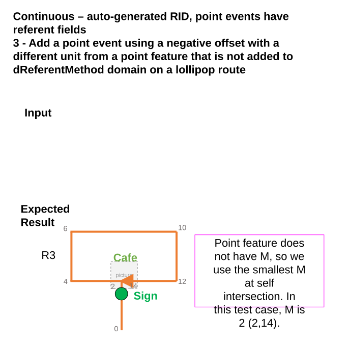

### Slide 16 <!-- slide 16 -->

Continuous - single field RID, 1 point event without referent fields
1 - Add a point event using a negative offset from an intersection on a lollipop route (point event is at self intersection)

| RouteID | Point Layer Name | Offset |
| --- | --- | --- |
| CS2 | CS2 & CS599 | -4 |

| EventID | RouteID | Measure | From Date | ToDate | Friction System |
| --- | --- | --- | --- | --- | --- |
| Friction2 | CS2 | 2 | 1/1/2000 |  | X |

[figure: Input · Expected Result · 10 · 2 · CS2 · 0 · 4 · 6 · 12 · 14 · Friction]

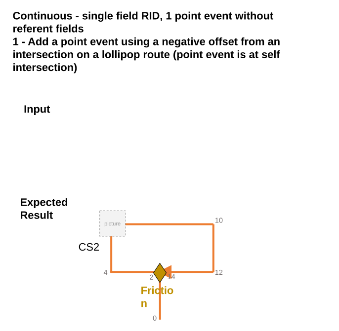

### Slide 17 <!-- slide 17 -->

| EventID | RouteID | Measure | From Date | ToDate | AttenuatorCode |
| --- | --- | --- | --- | --- | --- |
| Attenuator1 | CM00A | 4.485485 | 1/1/2000 |  | S1 |

Continuous – multi-field RID, point events do not have referent fields
1 - Add a point event using a positive offset with direction and a different unit from a point event on a simple route

| RouteID | Point Layer Name | Offset |
| --- | --- | --- |
| CM00A | 1093 (bridge) | N 4 km (there is no N, so it follows calibration direction) |

[figure: Input · Expected Result · CM00A · Bridge · Attenuator]

### Slide 18 <!-- slide 18 -->

Continuous - multi-field RID, point events do not have referent fields
2 - Add multiple point events using a negative offset from a point feature on a gapped route (different measures on the ends)

| EventID | RouteID | Measure | From Date | ToDate | AttenuatorCode |
| --- | --- | --- | --- | --- | --- |
| Attenuator2 | CM00B | 2 | 1/1/2000 |  | S1 |

| RouteID | Point Layer Name | Offset |
| --- | --- | --- |
| CM00B | 88 (Café) | -5 |

Use this case to sanity test a negative case: offset -1.95 but 5.05 is not on route

| EventID | RouteID | Measure | From Date | ToDate | NBI |
| --- | --- | --- | --- | --- | --- |
| Bridge1 | CM00B | 2 | 1/1/2000 |  | 96 |

[figure: Cafe · Input · Expected Result · 0 · 10 · 5 · 5.1 · 7 · CM00B · Bridge · Attenuator · 2]

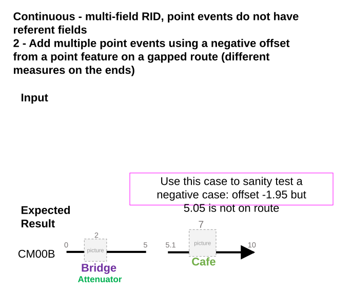

### Slide 19 <!-- slide 19 -->

| EventID | RouteName | Measure | From Date | ToDate | Anomaly |
| --- | --- | --- | --- | --- | --- |
| Anomaly1 | L1R1 | 3000 | 1/1/2000 |  | Crack |

Line – some point events have referent fields, some do not
1 - Add a point event with no referent fields using a negative offset from a point event on a simple route

| RouteName | Point Layer Name | Offset |
| --- | --- | --- |
| L1R1 | 1093 ( ILINote ) | -7000 |

[figure: Input · Expected Result · L1R1 · Anomaly · ILINote · L1R2 · 0 · 10000 · 5000]

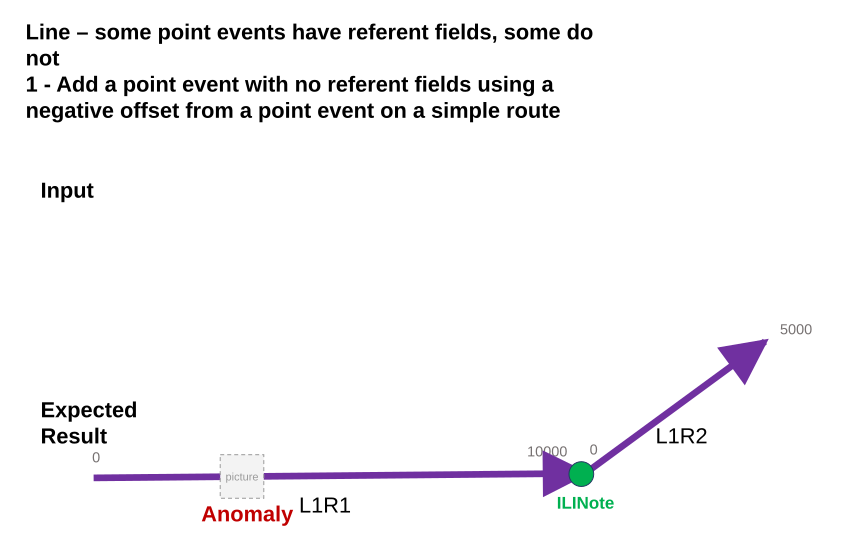

### Slide 20 <!-- slide 20 -->

| EventID | RouteName | Measure | From Date | ToDate | Anomaly |
| --- | --- | --- | --- | --- | --- |
| Anomaly2 | L2R1 | 3438.32 | 1/1/2000 |  | Crack |

Line – some point events have referent fields, some do not
2 - Add multiple point events (with and without referent fields) using a negative offset with a different unit from a point feature that is not added to dReferentMethod domain on a simple route

| RouteName | Point Layer Name | Offset |
| --- | --- | --- |
| L2R1 | 8 (Station) | -2km |

| EventID | RouteName | Measure | Referent Method | ReferentID | Referent Offset | From Date | ToDate | Note |
| --- | --- | --- | --- | --- | --- | --- | --- | --- |
| ILINote1 | L2R1 | 3438.32 | EngineeringNetwork | {L2R1- | 1047.999936 m | 1/1/2000 |  | abc |

[figure: Input · Expected Result · L2R1 · Anomaly · ILINote · L2R2 · 0 · 10000 · 5000 · Cafe]

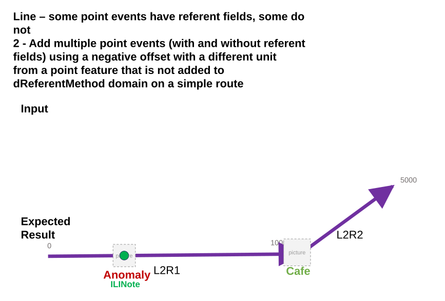

### Slide 21 <!-- slide 21 -->

Line – some point events have referent fields, some do not
3 - Add a point event with referent fields using a positive offset with a direction and a different unit from a point event on a 3D multi-gapped route (different measures on the ends)

| RouteName | Point Layer Name | Offset |
| --- | --- | --- |
| L3R1 | 1093 (anomaly) | E 1828.8m |

| EventID | RouteName | Measure | Referent Method | ReferentID | Referent Offset | From Date | ToDate | Note |
| --- | --- | --- | --- | --- | --- | --- | --- | --- |
| ILINote2 | L3R2 | 16000 | Anomaly | 1093 | 1828.8 m | 1/1/2000 |  | abc |

[figure: Input · Expected Result · Anomaly · L3R1 · L3R2 · 0 · 10000 · 5000 · 6000 · 11000 · 16000 · 12000 · 17000 · 22000 · 40000 · ILINote]

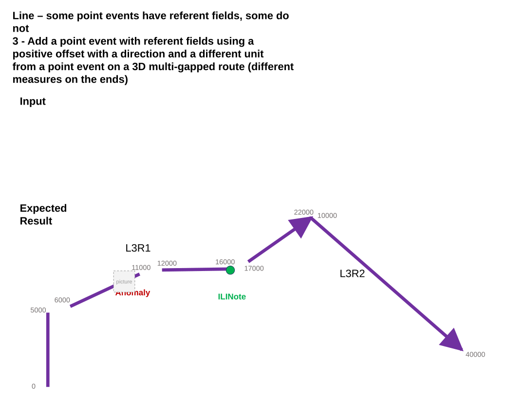

### Slide 22 <!-- slide 22 -->

Line – some point events have referent fields, some do not
4 - Add multiple point events (with and without referent fields) using positive offset with direction from a point feature that is added to dReferentMethod domain on a multi-gapped route (different measures on the ends)

| RouteName | Point Layer Name | Offset |
| --- | --- | --- |
| L4R1 | 3 (Station) | E 4000 |

| EventID | RouteName | Measure | From Date | ToDate | Anomaly |
| --- | --- | --- | --- | --- | --- |
| Anomaly3 | L4R1 | -1000 | 1/1/2000 |  | Crack |

| EventID | RouteName | Measure | Referent Method | ReferentID | Referent Offset | From Date | ToDate | Note |
| --- | --- | --- | --- | --- | --- | --- | --- | --- |
| ILINote3 | L4R1 | -1000 | Station | 3 | 1219.2 (m) | 1/1/2000 |  | abc |

[figure: Input · Expected Result · L4R1 · L4R2 · 10000 · -5000 · -3000 · -2000 · 1000 · 1500 · 2500 · 3000 · 5000 · Anomaly · ILINote · Station]

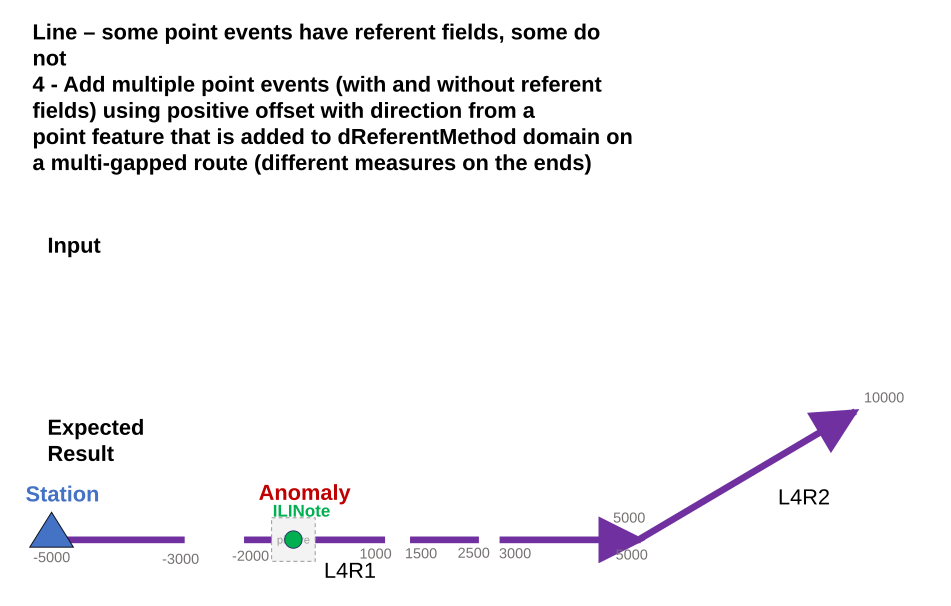

### Slide 23 <!-- slide 23 -->

| EventID | Route Name | From Measure | To Measure | From/To Referent Method | From/To ReferentID | From RefOffset | To RefOffset | From Date | To Date | Speed Limit |
| --- | --- | --- | --- | --- | --- | --- | --- | --- | --- | --- |
| Speed1 | R1 | 5 | 7 | C1_Intersection | {Int333} | 3 | 5 | 1/1/2000 |  | 55 |

Continuous – auto-generated RID, line event has referent fields
1 - Add a line event using positive offsets from an intersection on a simple route
Input
Expected Result

| Route Name | From Point Layer Name | From Offset | To Point Layer Name | To Offset |
| --- | --- | --- | --- | --- |
| R1 | R1 & Rx | 3 | R1 &Rx | 5 |

R1

### Slide 24 <!-- slide 24 -->

| EventID | Route Name | From Measure | To Measure | From/To Referent Method | FromRef ID | From RefOffset | ToRefID | To RefOffset | From Date | ToDate | Speed Limit |
| --- | --- | --- | --- | --- | --- | --- | --- | --- | --- | --- | --- |
| Speed1 | R1 | 5 | 7 | C1_Intersection | {Int333} | 3 | {Int444} | -1 | 1/1/2000 | <Null> | 55 |

Continuous – auto-generated RID, line event has referent fields
1a - Add a line event using offsets from different intersection features on a simple route
Input
Expected Result

| Route Name | From Point Layer Name | From Offset | To Point Layer Name | To Offset |
| --- | --- | --- | --- | --- |
| R1 | R1 & Rx | 3 | R1 &Ry | -1 |

R1

### Slide 25 <!-- slide 25 -->

| EventID | Route Name | From Measure | To Measure | From Referent Method | FromRef ID | From RefOffset | To Referent Method | ToRefID | To RefOffset | From Date | ToDate | Speed Limit |
| --- | --- | --- | --- | --- | --- | --- | --- | --- | --- | --- | --- | --- |
| Speed1 | R1 | 5 | 7 | C1_Intersection | {Int333} | 3 | MilePost | 58 (OID) | -1 | 1/1/2000 | <Null> | 55 |

Continuous – auto-generated RID, line event has referent fields
1b - Add a line event using offsets from different point features on a simple route [Mix and match point features for From and To Point Layer; Int and Point Event, Point Event and Point Feature, etc.]

| Route Name | From Point Layer Name | From Offset | To Point Layer Name | To Offset |
| --- | --- | --- | --- | --- |
| R1 | R1 & Rx | 3 | MilePost | -1 |

[figure: Input · Expected Result · R1 · MilePost]

### Slide 26 <!-- slide 26 -->

| EventID | Route Name | From Measure | To Measure | From Referent Method | FromRef ID | From RefOffset | To Referent Method | ToRefID | To RefOffset | From Date | ToDate | Speed Limit |
| --- | --- | --- | --- | --- | --- | --- | --- | --- | --- | --- | --- | --- |
| Speed1 | R1 | 5 | 7 | Café | OID 3 | 3 | Water Valve | OID 9 | -1 | 1/1/2000 | <Null> | 55 |

Continuous – auto-generated RID, line event has referent fields
1c - Add a line event using offsets from different features on a simple route [Mix and match point features that are/are not entered in the dReferentMethod domain]

| Route Name | From Point Layer Name | From Offset | To Point Layer Name | To Offset |
| --- | --- | --- | --- | --- |
| R1 | Café | 3 | Water Valve | -1 |

[figure: Input · Expected Result · R1 · Cafe · Water Valve]

### Slide 27 <!-- slide 27 -->

| EventID | Route Name | From Measure | To Measure | From/To Referent Method | From/To ReferentID | From RefOffset | To RefOffset | From Date | To Date | Speed Limit |
| --- | --- | --- | --- | --- | --- | --- | --- | --- | --- | --- |
| Speed1 | R1 | 1 | 7 | C1_Intersection | {Int333} | -3 | 3 | 1/1/2000 |  | 55 |

Continuous – auto-generated RID, line event has referent fields
1d - Add a line event using negative and positive offsets from an intersection on a simple route
Input
Expected Result

| Route Name | From/To Point Layer Name | From Offset | To Offset |
| --- | --- | --- | --- |
| R1 | R1 & Rx | -3 | 3 |

R1

### Slide 28 <!-- slide 28 -->

| EventID | Route Name | From Measure | To Measure | From RefMethod | From RefID | From RefOffset | To RefMethod | ToR RefID | To RefOffset | From Date | ToDate | Speed Limit |
| --- | --- | --- | --- | --- | --- | --- | --- | --- | --- | --- | --- | --- |
| Speed1 | R2 | 2 | 5 | MilePost | 801 | -5 | Network | R2 | 5 | 1/1/2000 |  | 45 |
| Speed2 | R2 | 5.1 | 9 | Network | R2 | 5.1 | MilePost | 801 | 2 | 1/1/2000 |  | 45 |

Continuous – auto-generated RID, point events have referent fields
2 - Add multiple line events using a positive offset with direction from a point event on a gapped route (dif. measures on the ends). Input events will split since measure is different on both ends

| RouteName | From/To Point Layer Name | From Offset | To Offset |
| --- | --- | --- | --- |
| R2 | 801 ( MilePost ) | W 5 | E 2 |

| EventID | Route Name | From Measure | To Measure | From RefMethod | From RefID | From RefOffset | To RefMethod | ToR RefID | To RefOffset | From Date | ToDate | Func . Class |
| --- | --- | --- | --- | --- | --- | --- | --- | --- | --- | --- | --- | --- |
| Func Class1 | R2 | 2 | 5 | MilePost | 801 | -5 | Network | R2 | 5 | 1/1/2000 |  | Minor |
| Func Class1 | R2 | 5.1 | 9 | Network | R2 | 5.1 | MilePost | 801 | 2 | 1/1/2000 |  | Minor |

[figure: MilePost · Input · Expected Result · 0 · 10 · 5 · 5.1 · 2 · 7 · R2]

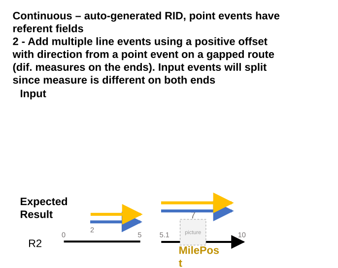

### Slide 29 <!-- slide 29 -->

| EventID | Route Name | From Measure | To Measure | From/To RefMethod | RefID | From RefOffset | To RefOffset | From Date | ToDate | Speed Limit |
| --- | --- | --- | --- | --- | --- | --- | --- | --- | --- | --- |
| Speed1 | R2 | 2 | 9 | MilePost | 801 | -5 | 2 | 1/1/2000 |  | Stop Sign |

Continuous – auto-generated RID, point events have referent fields
2a - Add multiple line events using a positive offset with direction from a point event on a gapped route (same measures on the ends). Input events will not split since measure is same on both ends

| RouteName | From/To Point Layer Name | From Offset | To Offset |
| --- | --- | --- | --- |
| R2 | 801 ( MilePost ) | W 5 | E 2 |

| EventID | Route Name | Measure | To Measure | From/To RefMethod | RefID | From RefOffset | To RefOffset | From Date | ToDate | Func Class |
| --- | --- | --- | --- | --- | --- | --- | --- | --- | --- | --- |
| FuncClass1 | R2 | 2 | 9 | MilePost | 801 | -5 | 2 | 1/1/2000 |  | Minor Collector |

[figure: MilePost · Input · Expected Result · 0 · 10 · 5 · 2 · 7 · R2]

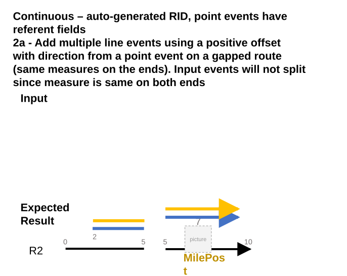

### Slide 30 <!-- slide 30 -->

Continuous – auto-generated RID, point events have referent fields
3 - Add a line event using a negative offset with a different unit from a point feature that is not added to dReferentMethod domain on a lollipop route

| Route Name | From/To Point Layer Name | From Offset | To Offset |
| --- | --- | --- | --- |
| R3 | 2 (Café) | -800 meters | 800 m |

Point feature does not have M, so we use the smallest M at self intersection. In this test case, M is 2 (2,14). We can choose the measure when selecting the pt. feature

| Event ID | Route Name | From Measure | To Measure | From/To Referent Method | From/To Referent ID | From Referent Offset | To Referent Offset | From Date | To Date | Speed Limit |
| --- | --- | --- | --- | --- | --- | --- | --- | --- | --- | --- |
| Speed1 | R3 | 1.502903 | 2.497097 | C1 network | {R0003- | 1.502903 (mi) | 2.497097 (mi) | 1/1/2000 |  | 55 |

[figure: Input · Expected Result · 10 · 2 · R3 · 0 · 4 · 6 · 12 · 14 · Cafe]

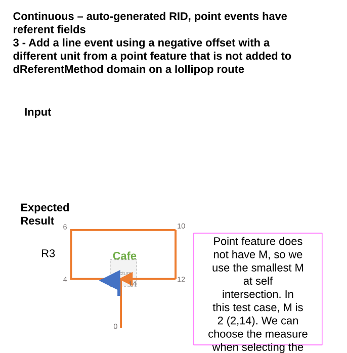

### Slide 31 <!-- slide 31 -->

| EventID | Route Name | From Measure | To Measure | From Referent Method | From ReferentID | From RefOffset | To Referent Method | To ReferentID | To RefOffset | From Date | To Date | Speed Limit |
| --- | --- | --- | --- | --- | --- | --- | --- | --- | --- | --- | --- | --- |
| Speed1 | R1 | 1 | 7 | C1_Intersection | {Int333} | -1 | Network | R1 | 7 | 1/1/2000 |  | 55 |

Continuous – auto-generated RID, line event has referent fields
4 - Add a line event using From method of Location Offset and To method of Route and Measure
Input
Expected Result

| Route Name | From Point Layer Name | From Offset | To RouteID | To Measure |
| --- | --- | --- | --- | --- |
| R1 | R1 & Rx | -1 | R1 | 7 |

R1

### Slide 32 <!-- slide 32 -->

| EventID | Route Name | From Measure | To Measure | From/To Referent Method | From/To ReferentID | From RefOffset | To RefOffset | From Date | To Date | Speed Limit |
| --- | --- | --- | --- | --- | --- | --- | --- | --- | --- | --- |
| SpeedOld | R1 | 0 | 6 | Network | R1 | 0 | 6 | 1/1/2000 | 1/1/2010 | 45 |
| SpeedOld | R1 | 0 | 1 | Network | R1 | 0 | 5 | 1/1/2010 |  | 45 |
| SpeedNew | R1 | 2 | 7 | C1_Intersection | {Int333} | 3 | 5 | 1/1/2010 |  | 55 |

Continuous – auto-generated RID, line event has referent fields
5 - Add a line event using positive offsets from an intersection on a simple route, check the retire overlaps option
Input
Expected Result

| Route Name | From Point Layer Name | From Offset | To Point Layer Name | To Offset |
| --- | --- | --- | --- | --- |
| R1 | R1 & Rx | -1 | R1 &Rx | 5 |

R1
Blue event is new, orange event is existing

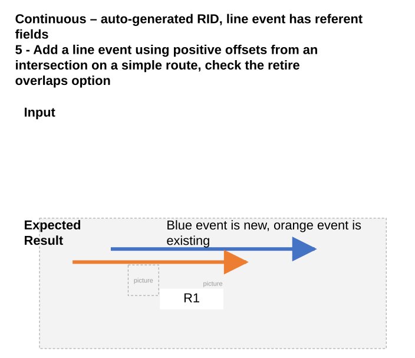

### Slide 33 <!-- slide 33 -->

Continuous - single field RID, 1 point event without referent fields
1 - Add a line event using a negative from offset from an intersection and a positive to offset on a lollipop route

| RouteID | From Point Layer Name | From Offset | To Point Layer Name | To Offset |
| --- | --- | --- | --- | --- |
| CS2 | CS2 & CS599 | -4 | Cafe | 10 |

| EventID | Route ID | From Measure | To Measure | From Date | ToDate | Speed Limit |
| --- | --- | --- | --- | --- | --- | --- |
| Speed1 | CS2 | 2 | 10 | 1/1/2000 |  | 45 |

[figure: Input · Expected Result · 10 · 2 · CS2 · 0 · 4 · 6 · 12 · 14 · Cafe]

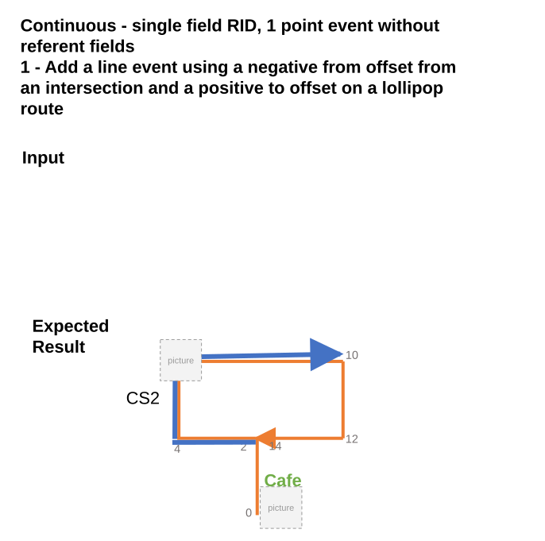

### Slide 34 <!-- slide 34 -->

Continuous - single field RID, 1 point event without referent fields
2 - Add a line event using offsets on a Loop route

| RouteID | From Point Layer Name | From Offset | To Point Layer Name | To Offset |
| --- | --- | --- | --- | --- |
| CS2 | 1 (Café) | -9 | Cafe | -1 |

| EventID | Route ID | From Measure | To Measure | From Date | ToDate | Speed Limit |
| --- | --- | --- | --- | --- | --- | --- |
| Speed1 | CS2 | 1 | 9 | 1/1/2000 |  | 45 |

[figure: Input · Expected Result · 5 · Cafe · 1 · 9]

### Slide 35 <!-- slide 35 -->

Continuous – multi-field RID, point events do not have referent fields
1 - Add a line event using offsets with direction from a point event on a simple route

| RouteID | From/To Point Layer Name | From Offset | To Offset |
| --- | --- | --- | --- |
| CM00A | 1093 (bridge) | S 1 km (there is no S, so it follows calibration direction) | N 5 km (there is no N, so it follows calibration direction) |

| EventID | Route Name | From Measure | To Measure | From Date | ToDate | Speed Limit |
| --- | --- | --- | --- | --- | --- | --- |
| Speed1 | CM00A | 1 | 7 | 1/1/2000 |  | 45 |

[figure: Input · Expected Result · CM00A · Bridge]

### Slide 36 <!-- slide 36 -->

Continuous - multi-field RID, line events do not have referent fields
2 - Add multiple line events using offsets from a point feature on a gapped route (different measures on the ends)

| RouteID | Point Layer Name | From Offset | To Offset |
| --- | --- | --- | --- |
| CM00B | 88 (Café) | -5 | -3 |

Use this case to sanity test a negative case: offset -1.95 but 5.05 is not on route

| EventID | Route Name | From Measure | To Measure | From Date | ToDate | Speed Limit |
| --- | --- | --- | --- | --- | --- | --- |
| Speed1 | CM00B | 2 | 4 | 1/1/2000 |  | 45 |

| EventID | Route Name | Measure | To Measure | From Date | ToDate | Func Class |
| --- | --- | --- | --- | --- | --- | --- |
| FuncClass1 | CM00B | 2 | 9 | 1/1/2000 |  | Minor Collector |

[figure: Cafe · Input · Expected Result · 0 · 10 · 5 · 5.1 · 7 · CM00B · 2 · 4]

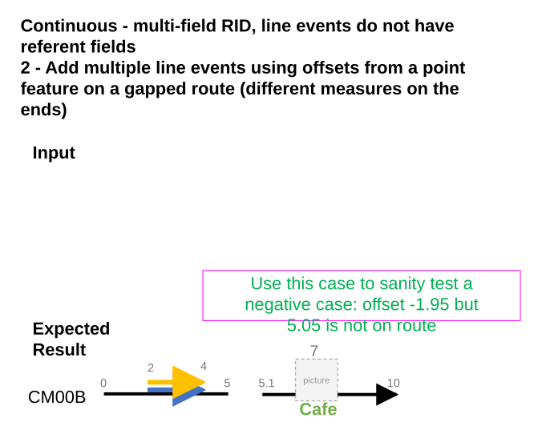

### Slide 37 <!-- slide 37 -->

Continuous – multi-field RID, point events do not have referent fields
3 - Add a line event using offsets with direction from a point event on a alpha route

| RouteID | From/To Point Layer Name | From Offset | To Offset |
| --- | --- | --- | --- |
| CM00A | 1093 (bridge) | -13 | 0.5 |

| EventID | Route Name | From Measure | To Measure | From Date | ToDate | Speed Limit |
| --- | --- | --- | --- | --- | --- | --- |
| Speed1 | CM00A | 1 | 14.5 | 1/1/2000 |  | 45 |

[figure: Input · Expected Result · CM00A · Bridge · 14]

### Slide 38 <!-- slide 38 -->

Continuous – multi-field RID, point events do not have referent fields
4 - Add a line event using offsets with direction from a point event on a simple route, check the Add to dominant route checkbox (CM00A is dom. Route, CM00B is selected)

| RouteID | From/To Point Layer Name | From Offset | To Offset |
| --- | --- | --- | --- |
| CM00B (non dom. Route) | 1093 (bridge) | -1 | 5 |

| EventID | Route Name | From Measure | To Measure | From Date | ToDate | Speed Limit |
| --- | --- | --- | --- | --- | --- | --- |
| Speed1 | CM00A | 1 | 7 | 1/1/2000 |  | 45 |

[figure: Input · Expected Result · Bridge · CM00A · CM00B]

### Slide 39 <!-- slide 39 -->

| EventID | From Route Name | To Route Name | From Measure | To Measure | From Date | ToDate | DOT Class |
| --- | --- | --- | --- | --- | --- | --- | --- |
| DOTClass1 | L1R1 | L1R1 | 3000 | 10000 | 1/1/2000 |  | Class 1 |

Line – Line event does not have referent fields
1 - Add a line event with no referent fields using a negative offset from a point event on a simple route

| From/To Route Name | Point Layer Name | From Offset | To Offset |
| --- | --- | --- | --- |
| L1R1 | 1093 ( ILINote ) | -7000 | 0 |

Use this case to sanity test a negative case: offset a value that would fall on route L1R2

[figure: Input · Expected Result · L1R1 · ILINote · L1R2 · 0 · 5000 · 10000 · 3000]

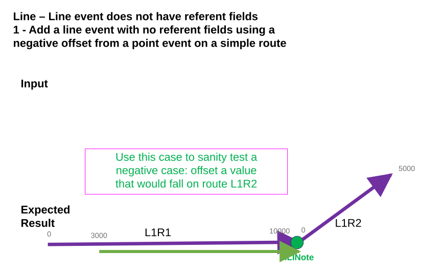

### Slide 40 <!-- slide 40 -->

| EventID | From Route Name | From Measure | To Route Name | To Measure | From Date | ToDate | DOT Class |
| --- | --- | --- | --- | --- | --- | --- | --- |
| DOTClass1 | L2R1 | 3438.32 ft | L2R2 | 2460.63 ft | 1/1/2000 |  | Class 1 |

Line – some line events have referent fields, some do not
2 - Add multiple line events (with and without referent fields) using offsets from a point feature that is not added to dReferentMethod domain on a simple route

| From Route Name | To Route Name | From/To Point Layer Name | From Offset | To Offset |
| --- | --- | --- | --- | --- |
| L2R1 | L2R2 | 8 (Station) | -2 km | 0.75 km |

| EventID | From Route Name | From Measure | To Route Name | To Measure | From Date | ToDate | FromRef Method | From RefID | FromRef Offset | ToRef Method | To RefID | ToRef Offset | Inspect. Type |
| --- | --- | --- | --- | --- | --- | --- | --- | --- | --- | --- | --- | --- | --- |
| Inspection Range1 | L2R1 | 3438.32 ft | L2R2 | 2460.63 ft | 1/1/2000 |  | Line Network | L2R1 | 3438.32 ft | Line Network | L2R2 | 2460.63 ft | Visual Survey |

[figure: Input · Expected Result · L2R1 · L2R2 · 0 · 10000 · 5000 · Station]

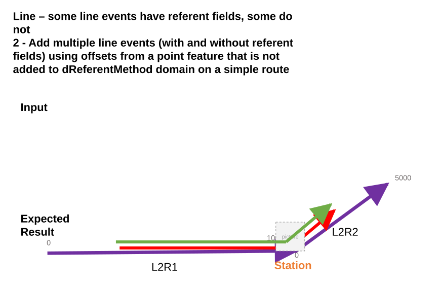

### Slide 41 <!-- slide 41 -->

Line – some line events have referent fields, some do not
3 - Add a line event with referent fields using a positive offset with a direction and a different unit from a point event on a 3D multi-gapped route (different measures on the ends)

| From/To RouteName | Point Layer Name | From Offset | To Offset |
| --- | --- | --- | --- |
| L3R1 | 1093 (anomaly) | W 1828.8m | E 2.286 km |

| EventID | From/To Route Name | From Measure | To Measure | From Referent Method | From ReferentID | From Referent Offset | To Referent Method | To ReferentID | To Referent Offset | From Date | ToDate | DOT Class |
| --- | --- | --- | --- | --- | --- | --- | --- | --- | --- | --- | --- | --- |
| DOT Class1 | L3R2 | 4000 ft. | 5000 ft | Anomaly | 1093 | -1828.8 m | Engineering Network | L3R1 | 5000 m | 1/1/2000 |  | Class 2 |
| DOT Class1 | L3R2 | 6000 ft. | 11000 ft. | Engineering Network | L3R1 | 6000 m | Engineering Network | L3R1 | 11000 m | 1/1/2000 |  | Class 2 |
| DOT Class1 | L3R2 | 12000 ft. | 16000 ft. | Engineering Network | L3R1 | 12000 m | Engineering Network | L3R1 | 16000 m | 1/1/2000 |  | Class 2 |
| DOT Class1 | L3R2 | 17000 ft. | 17500 ft. | Engineering Network | L3R1 | 17000 m | Anomaly | 1093 | 2286 m | 1/1/2000 |  | Class 2 |

Also test this case when measures are the same across gaps. Only one event will be added

[figure: Input · Expected Result · Anomaly · L3R1 · L3R2 · 0 · 10000 · 5000 · 6000 · 11000 · 16000 · 12000 · 17000 · 22000 · 40000]

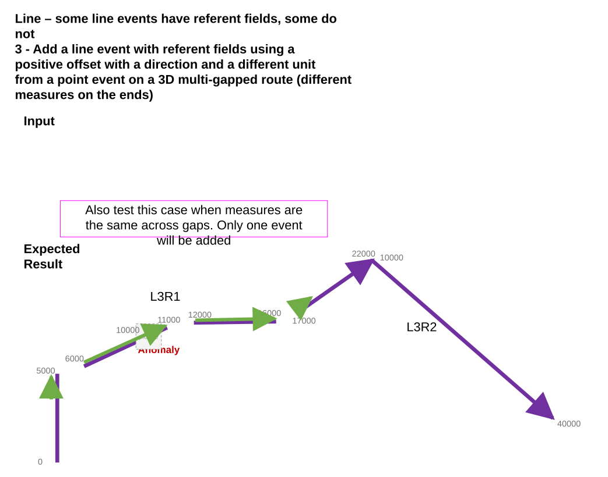

### Slide 42 <!-- slide 42 -->

Line – some line events have referent fields, some do not
4 - Add line point events (with and without referent fields) offset with direction from a point feature that is added to dReferentMethod domain on a multi-gapped route (different measures on the ends)

| From/To Route Name | From Point Layer Name | From Offset | To Point Layer Name | To Offset |
| --- | --- | --- | --- | --- |
| L4R1 | 3 (Station) | 1000 | 4 (Station) | -3000 |

| EventID | From/To Route Name | From Measure | To Measure | From Referent Method | From ReferentID | From Referent Offset | To Referent Method | To ReferentID | To Referent Offset | From Date | ToDate | DOT Class |
| --- | --- | --- | --- | --- | --- | --- | --- | --- | --- | --- | --- | --- |
| Inspection Range1 | L3R2 | -4000 | -3000 | Station | 3 | 1000 | Engineering Network | L4R1 | -3000 | 1/1/2000 |  | Aerial Survey |
| Inspection Range1 | L3R2 | -2000 | 0 | Engineering Network | L4R1 | -2000 | Station | 4 | -3000 | 1/1/2000 |  | Aerial Survey |

| EventID | From Route Name | From Measure | To Route Name | To Measure | From Date | ToDate | DOT Class |
| --- | --- | --- | --- | --- | --- | --- | --- |
| DOTClass1 | L3R2 | -4000 | L3R2 | -3000 | 1/1/2000 |  | Class 1 |
| DOTClass1 | L3R2 | -2000 | L3R2 | 0 | 1/1/2000 |  | Class 1 |

[figure: Input · Expected Result · L4R1 · L4R2 · 10000 · -5000 · -3000 · -2000 · 1000 · 1500 · 2500 · 3000 · 5000 · Station 3 · Station 4]

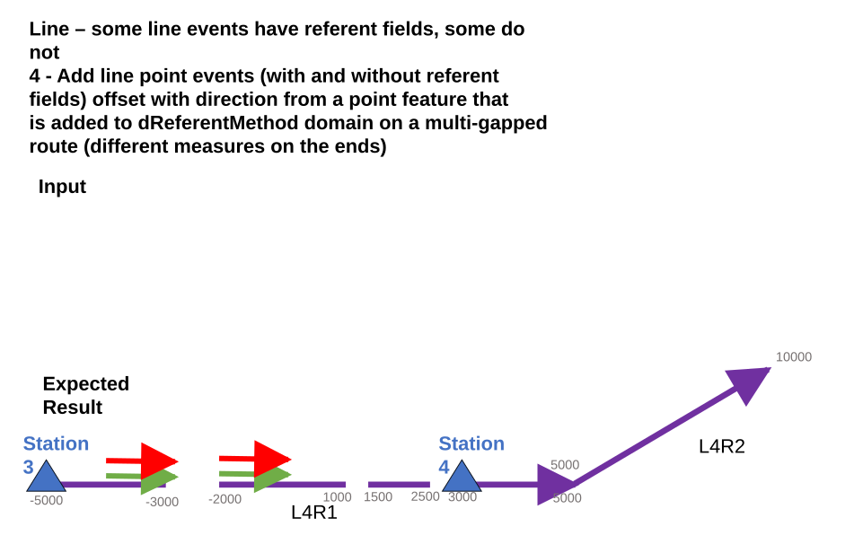

### Slide 43 <!-- slide 43 -->

Line – some line events have referent fields, some do not
5 - Add a line event with offsets on a branch route

| From/To RouteName | Point Layer Name | From Offset | To Offset |
| --- | --- | --- | --- |
| L5R1 | 6 (Station) | -4 | 4 |

| EventID | From Route Name | From Measure | To Route Name | To Measure | From Date | ToDate | DOT Class |
| --- | --- | --- | --- | --- | --- | --- | --- |
| DOTClass1 | L5R1 | 2 | L5R1 | 10 | 1/1/2000 |  | Class 1 |

[figure: Input · Expected Result · Station · 6 · L5R1 · L5R2 · 15 · 30]

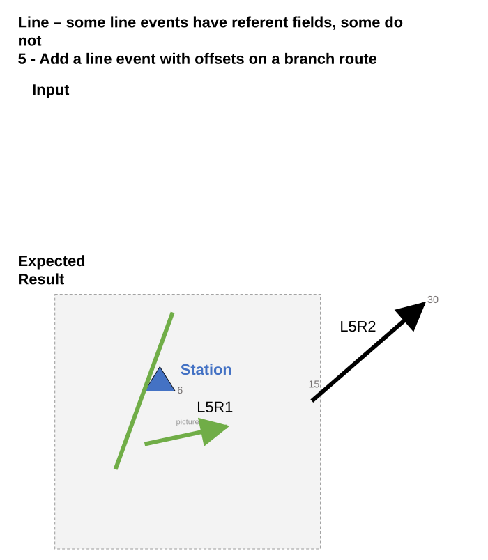

### Slide 44 <!-- slide 44 -->

Line – some line events have referent fields, some do not
6 - Add a line event with offsets on a barbell route

| From/To RouteName | From/To Point Layer Name | From Offset | To Offset |
| --- | --- | --- | --- |
| L6R1 | Intersection | -5.3 | 5.4 |

| EventID | From Route Name | From Measure | To Route Name | To Measure | From Date | ToDate | DOT Class |
| --- | --- | --- | --- | --- | --- | --- | --- |
| DOTClass1 | L6R1 | 4.7 | L6R1 | 15.4 | 1/1/2000 |  | Class 1 |

[figure: Input · Expected Result · 10 · L6R1]

### Slide 45 <!-- slide 45 -->

| EventID | From Route Name | To Route Name | From Measure | To Measure | From Date | ToDate | DOT Class |
| --- | --- | --- | --- | --- | --- | --- | --- |
| DOTClassOld | L1R1 | L1R2 | 0 | 5000 | 1/1/2000 |  | Class 1 |

Line – Line event does not have referent fields
7 - Add a line event with no referent fields using a negative offset from a point event on a simple route, check Merge coincident events

| From/To Route Name | Point Layer Name | From Offset | To Offset |
| --- | --- | --- | --- |
| L1R1 | 1093 ( ILINote ) | -7000 | 0 |

Orange event is old, green event is new
Both events have same attributes

[figure: Input · Expected Result · L1R1 · ILINote · L1R2 · 0 · 5000 · 10000 · 3000]

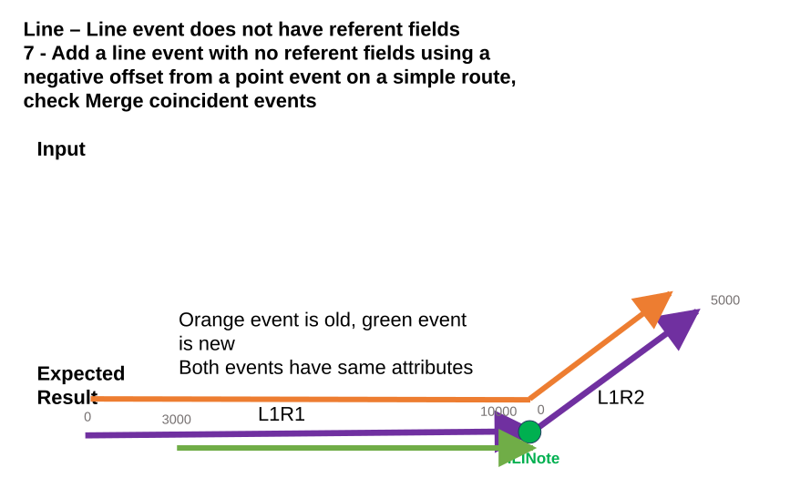
