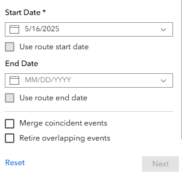
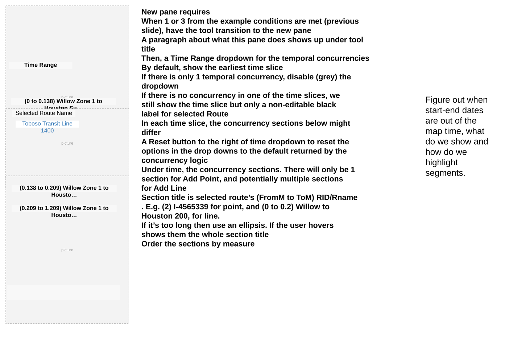
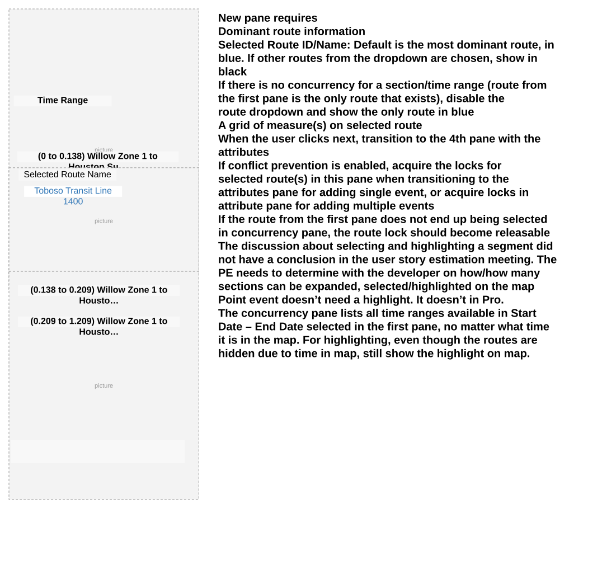

# Add Point and non-Spanning Line Event to Dominant Route in Experience Builder – Test Plan

| Field | Value |
| --- | --- |
| **Doc** | 169 · Test Plan · Experience Builder |
| **Product** | — |
| **Release** | — |
| **Issues** | [Beijing-R-D-Center/ExperienceBuilder-Web-Extensions#24792](https://devtopia.esri.com/Beijing-R-D-Center/ExperienceBuilder-Web-Extensions/issues/24792) |
| **Source** | [AddPointsLinesDominant_ExB_testplan.pptx](<https://esriis.sharepoint.com/sites/LocationReferencing/Shared%20Documents/General/Test%20Plans/AddPointsLinesDominant_ExB_testplan.pptx>) |
| **People** | author Lakshmi Ananthanarayanan · PE — · dev 1 |
| **Edited** | 2025-05-22 21:25 by Claire Wang |
| **Extracted** | 2026-09-04 · lane xmlstrip · format 3.0 · prompt v2.0.2 |
| **Keywords** | dominant route · concurrency · non spanning line event · point event · experience builder widget · event merging · conflict prevention |
| **Tools** | Add Point · Add Line |

## Summary

Test plan for adding point and non-spanning line events to dominant routes in Experience Builder. Covers configuration options for concurrency toggles, UI behavior, route selection, time range handling, and conflict prevention. Includes detailed test scenarios for various network types, concurrency conditions, event merging, accessibility, and browser compatibility. Also addresses automation and documentation updates.

## Related documents

<!-- related:begin -->
- [Add Spanning Line Events to Dominant Routes in Experience Builder – Test Plan](<https://esriis.sharepoint.com/sites/lrsworkspace/LRS Doc Index/Test Plans/24793-add-spanning-line-events-to-dominant-routes-in-exb.md>) — similar text 0.59 · 6 title words · 4 filename words · same kind/surface/dev/folder <!-- rel:170 s=9.696 -->
- [Add Line Event to Dominant Route in ArcGIS Pro – Test Plan](<https://esriis.sharepoint.com/sites/lrsworkspace/LRS Doc Index/Test Plans/add-line-event-to-dominant-route-in-pro.md>) — similar text 0.19 · 5 title words · 3 filename words · same kind/folder <!-- rel:358 s=6.912 -->
- [Add Point Event to Dominant Route in ArcGIS Pro – Test Plan](<https://esriis.sharepoint.com/sites/lrsworkspace/LRS Doc Index/Test Plans/3916-add-point-event-to-dominant-route-in-pro.md>) — similar text 0.35 · 5 title words · 3 filename words · same kind/folder <!-- rel:360 s=6.894 -->
- [Add Line Event to Dominant Route in ArcGIS Pro](<https://esriis.sharepoint.com/sites/lrsworkspace/LRS Doc Index/User Stories/add-line-event-to-dominant-route-in-pro.md>) — similar text 0.30 · 5 title words · 2 filename words <!-- rel:370 s=5.084 -->
- [Data Action Support for Add Line Event Widget – Test Plan](<https://esriis.sharepoint.com/sites/lrsworkspace/LRS Doc Index/Test Plans/17675-data-action-support-for-add-line-event-widget.md>) — similar text 0.22 · 3 title words · 2 filename words · same kind/surface/folder <!-- rel:431 s=4.752 -->
<!-- related:end -->

<!-- docs:begin -->
## Esri documentation

[Add calibration points](https://doc.esri.com/en/arcgis-pro/latest/help/production/location-referencing-pipelines/add-calibration-points.html) · [Conflict prevention](https://doc.esri.com/en/arcgis-pro/latest/help/production/location-referencing-pipelines/conflict-prevention.html)

_No page matched:_ [Add Line](https://www.google.com/search?q=%22Add%20Line%22+site%3Adoc.esri.com)
<!-- docs:end -->

---

## Overview

### Slide 1 — Add Point and non-Spanning Line Event to Dominant Route in ExB – Test Plan <!-- slide 1 -->

https://devtopia.esri.com/Beijing-R-D-Center/ExperienceBuilder-Web-Extensions/issues/24792

PE:
Dev:

## Test Cases

### TC-U01 — When concurrency exists <!-- src: S5 · slide 2 · label When concurrency exists -->

**Steps:**
1. Disabled & visible & Don’t override off: checkbox shows up as unchecked in UI, and users have control. If users choose to check the option, they see dominancy pane.
2. Disabled & visible & Don’t override on: checkbox shows up as unchecked in UI, and users have control. If users choose to check the option, they don’t see dominancy pane.
3. Enabled & visible & Don’t override off: checkbox shows up as checked in UI, and users have control. If users choose to keep the option checked, they see dominancy pane.
4. Enabled & visible & Don’t override on: checkbox shows up as checked in UI, and users have control. If users choose to keep the option checked, they don’t see dominancy pane.
5. If Hide Add to Dominant Route Option is on (checkbox does not show in UI) – Only add to selected route(s) in the first pane no matter what the other two toggles say.

## Other content

### Slide 2 <!-- slide 2 -->

Configuration

- Create a section for concurrencies in Add Point and Add Line’s configuration. Add 3 toggles in this section. See examples on the left.
  - Hide Add to Dominant Route Option
    - Default is off, so the checkbox is always visible in tool UI
    - When toggled on, the checkbox is hidden in tool UI
  - Enable Add to Dominant Route Option
    - Default is off, so the checkbox is unchecked in tool UI by default
    - When toggled on, the checkbox is checked by default
  - Don’t allow override of event placement on dominant routes
    - Default is off, so when users choose to add to dominant routes, they still see the concurrency pane
    - When toggled on, when users choose to add to dominant routes, they don’t see the concurrency pane and events are automatically added to the dominant routes that concurrency logic determines

Notice there is a separator in Add Line for the additional checkboxes. In Add Point, this doesn’t exist yet. We should add the separator for Add Point and place Add event to dominant route under it.

### Slide 3 <!-- slide 3 -->

New pane requires

- When 1 or 3 from the example conditions are met (previous slide), have the tool transition to the new pane
- A paragraph about what this pane does shows up under tool title
- Then, a Time Range dropdown for the temporal concurrencies
  - By default, show the earliest time slice
  - If there is only 1 temporal concurrency, disable (grey) the dropdown
  - If there is no concurrency in one of the time slices, we still show the time slice but only a non-editable black label for selected Route
  - In each time slice, the concurrency sections below might differ
- A Reset button to the right of time dropdown to reset the options in the drop downs to the default returned by the concurrency logic
- Under time, the concurrency sections. There will only be 1 section for Add Point, and potentially multiple sections for Add Line
  - Section title is selected route’s (FromM to ToM) RID/Rname . E.g. (2) I-4565339 for point, and (0 to 0.2) Willow to Houston 200, for line.
  - If it’s too long then use an ellipsis. If the user hovers shows them the whole section title
  - Order the sections by measure
Time Range
(0 to 0.138) Willow Zone 1 to Houston Su…
Selected Route Name
Toboso Transit Line 1400
(0.138 to 0.209) Willow Zone 1 to Housto…
(0.209 to 1.209) Willow Zone 1 to Housto…

Figure out when start-end dates are out of the map time, what do we show and how do we highlight segments.

### Slide 4 <!-- slide 4 -->

New pane requires

- Dominant route information
  - Selected Route ID/Name: Default is the most dominant route, in blue. If other routes from the dropdown are chosen, show in black
    - If there is no concurrency for a section/time range (route from the first pane is the only route that exists), disable the route dropdown and show the only route in blue
  - A grid of measure(s) on selected route
- When the user clicks next, transition to the 4th pane with the attributes
- If conflict prevention is enabled, acquire the locks for selected route(s) in this pane when transitioning to the attributes pane for adding single event, or acquire locks in attribute pane for adding multiple events
  - If the route from the first pane does not end up being selected in concurrency pane, the route lock should become releasable
- The discussion about selecting and highlighting a segment did not have a conclusion in the user story estimation meeting. The PE needs to determine with the developer on how/how many sections can be expanded, selected/highlighted on the map
  - Point event doesn’t need a highlight. It doesn’t in Pro.
- The concurrency pane lists all time ranges available in Start Date – End Date selected in the first pane, no matter what time it is in the map. For highlighting, even though the routes are hidden due to time in map, still show the highlight on map.

Time Range
(0 to 0.138) Willow Zone 1 to Houston Su…
Selected Route Name
Toboso Transit Line 1400
(0.138 to 0.209) Willow Zone 1 to Housto…
(0.209 to 1.209) Willow Zone 1 to Housto…

### Slide 5 <!-- slide 5 -->

Test

- Test Add Point and Add Line widgets with different combinations of the 3 toggles in express and non-express modes
- Test with adding single and multiple point events, and adding single and multiple non-spanning line events (spanning is covered in a different user story)
- Test with line and nonline networks with various RID/Name configuration. E.g. multifield RID, single field RID, Rname, and etc
- Test normal and complex shapes
  - Test with self-intersections where multiple measures exist
- Test a few cases where selected route and concurrent route are in opposite directions
- Test with spatial (routes fully/partially/not overlap) and temporal (time slices) concurrencies
  - Sanity test a few where there is no concurrency
  - Test scenarios where there are concurrencies across multiple time slices and the primary/dominant route changes over time
- Test with different versions, and a single point of time vs. a time range
- Test with and without conflict prevention (“cannot acquire locks” is the only error case for this user story)
- Consider utilizing the data and test cases from the Pro version of Add Point, Add Line, and Append Events to Dominant Route user stories (attached in devtopia issue)
  - Required: Add Point – Single event: 1 2 6 9; Multiple events: 3 5; Add Line – 1 3 4 5; Append Events – non-spanning line: 3 4 6 7
  - Optional: other test cases
- Test expanding, selecting, and highlighting the segment
- Verify spatially coincident events should merge if Merge coincident events is checked. Verify temporally coincident events should merge automatically (see 5890 for point; 6279 for append; 6779 for line – still in progress – should be fixed when this user story is worked on)
- Verify the tool aligns with any other Experience Builder specifications/requirements
- 508/i18n (Check with Mac and Chandan on 508. This should automatically be done by Chandan’s team.)
- Test with various themes for the text color showing in the pane
- Test in different browsers (chrome and firefox) and layouts

### Slide 6 <!-- slide 6 -->

Automation
Add new automation cases for this scenario in Add Point and Add Line widgets
Note the existing automation may break and need to be updated

Documentation
Update existing documentation to mention:

    - These new configuration options and what they do
    - The updates the workflow and UX when this checkbox is checked in the widget
