# SLD Support for Centerline in UN and ADM LRS Datasets Test Plan

| Field | Value |
| --- | --- |
| **Doc** | 38 · Test Plan · Experience Builder |
| **Product** | Roads & Highways · Pipeline Referencing · Utility Network |
| **Release** | — |
| **Issues** | [Beijing-R-D-Center/ExperienceBuilder-Web-Extensions#26161](https://devtopia.esri.com/Beijing-R-D-Center/ExperienceBuilder-Web-Extensions/issues/26161) |
| **Source** | [26161-CenterlineinSLDforADMUNAPR_TestPlan1.pptx](<https://esriis.sharepoint.com/sites/LocationReferencing/Shared%20Documents/General/Test%20Plans/26161-CenterlineinSLDforADMUNAPR_TestPlan1.pptx>) |
| **People** | author Mac Christmas · PE — · dev — |
| **Edited** | 2026-05-08 18:54 by Mac Christmas |
| **Extracted** | 2026-09-04 · lane xmlstrip · format 3.0 · prompt v2.0.2 |
| **Keywords** | centerline · admrh · unapr · dynamic segmentation · straight line diagram · route · pipeline line · testing |
| **Tools** | Dynamic Segmentation · Straight Line Diagram |

## Summary

Test plan for adding support to the Dynamic Segmentation's Straight Line Diagram (SLD) component to include configured ADMRH and UNAPR centerlines. Covers configuration options, UI behavior, and positive and negative test cases for various route complexities and scenarios including gapped and flipped centerlines.

## Related documents

<!-- related:begin -->
- [Iteration Planning and Issue Tracking for Location Referencing 3.8/12.2](<https://esriis.sharepoint.com/sites/lrsworkspace/LRS Doc Index/Schedules/3040-iteration-planning-and-issue-tracking-for-lr-3-8-12-2.md>) — shared issue Beijing-R-D-Center/ExperienceBuilder-Web-Extensions#26161 · similar text 0.03 <!-- rel:2 s=1001.23 -->
- [SLD Devices and Junctions Test Plan](<https://esriis.sharepoint.com/sites/lrsworkspace/LRS Doc Index/Test Plans/29867-sld-devices-and-junctions.md>) — similar text 0.16 · 1 title word · same kind/surface/folder <!-- rel:28 s=4.493 -->
- [Regression Testing Task List V1.docx](<https://esriis.sharepoint.com/sites/lrsworkspace/LRS Doc Index/Test Plans/regression-testing-task-list-for-lrs-releases__doc115.md>) — similar text 0.10 · same kind <!-- rel:115 s=3.183 -->
- [Merge Centerlines Test Plan](<https://esriis.sharepoint.com/sites/lrsworkspace/LRS Doc Index/Test Plans/363-merge-centerlines.md>) — similar text 0.14 · same kind/folder <!-- rel:103 s=2.876 -->
- [Overlay Events and queryAttributeSet Support for UN Pipeline Devices and Junctions](<https://esriis.sharepoint.com/sites/lrsworkspace/LRS Doc Index/Test Plans/overlay-events-and-queryattributeset-support-for-un-pipeline.md>) — similar text 0.17 · 1 title word · same kind/folder <!-- rel:79 s=2.649 -->
<!-- related:end -->

<!-- docs:begin -->
## Esri documentation

[Apply dynamic segmentation](https://doc.esri.com/en/arcgis-pro/latest/help/production/roads-highways/apply-dynamic-segmentation.html)

_No page matched:_ [Straight Line Diagram](https://www.google.com/search?q=%22Straight%20Line%20Diagram%22+site%3Adoc.esri.com)
<!-- docs:end -->

---

## Test Cases

### TC-P01 — New configuration option appears when input LRS dataset is ADMRH or UNAPR <!-- src: S4 · slide 1 · Positive Tests: Configuration · 1 -->

- **Group:** Configuration

### TC-P02 — New configuration option does not appear when input LRS dataset is not ADMRH <!-- src: S4 · slide 1 · Positive Tests: Configuration · 2 -->

- **Group:** Configuration
- **Case:** New configuration option does not appear when input LRS dataset is not ADMRH or UNAPR

### TC-P03 — New configuration option is unchecked by default <!-- src: S4 · slide 1 · Positive Tests: Configuration · 3 -->

- **Group:** Configuration

### TC-P04 — Included centerline layer appears in the list of layers <!-- src: S4 · slide 1 · Positive Tests: Configuration · 4 -->

- **Group:** Configuration

### TC-P05 — Included centerline layer’s Display field can be changed <!-- src: S4 · slide 1 · Positive Tests: Configuration · 5 -->

- **Group:** Configuration

### TC-P06 — Included centerline layer’s row can be minimized <!-- src: S4 · slide 1 · Positive Tests: UI · 1 -->

- **Group:** UI

### TC-P07 — Included centerline layer’s row can be restored once minimized <!-- src: S4 · slide 1 · Positive Tests: UI · 2 -->

- **Group:** UI

### TC-P08 — Included centerline layer cannot be edited in SLD pop-up <!-- src: S4 · slide 1 · Positive Tests: UI · 3 -->

- **Group:** UI

### TC-P09 — Included centerline layer can show statistics (when enabled) <!-- src: S4 · slide 1 · Positive Tests: UI · 4 -->

- **Group:** UI

### TC-P10 — Included centerline layer in ruler drill down <!-- src: S4 · slide 1 · Positive Tests: UI · 5 -->

- **Group:** UI

### TC-P11 — Included centerline layer’s fields are in non-editable section in editing pop-up <!-- src: S4 · slide 1 · Positive Tests: UI · 6 -->

- **Group:** UI

### TC-P12 — Simple ADMRH route (1) <!-- src: S4 · slide 1 · Positive Tests · 1 -->

### TC-P13 — Simple UNAPR route (1) <!-- src: S4 · slide 1 · Positive Tests · 2 -->

### TC-P14 — Complex ADMRH route (1) <!-- src: S4 · slide 1 · Positive Tests · 3 -->

### TC-P15 — Complex UNAPR route (1) <!-- src: S4 · slide 1 · Positive Tests · 4 -->

### TC-P16 — Vertical ADMRH route (1) <!-- src: S4 · slide 1 · Positive Tests · 5 -->

### TC-P17 — Vertical UNAPR route (1) <!-- src: S4 · slide 1 · Positive Tests · 6 -->

### TC-N01 — Input Attribute Set does not have any valid events for the input ADMRH LRS <!-- src: S4 · slide 1 · Negative Tests · 1 -->

- **Case:** Input Attribute Set does not have any valid events for the input ADMRH LRS Network

### TC-N02 — Input Attribute Set does not have any valid events for the input UNAPR LRS <!-- src: S4 · slide 1 · Negative Tests · 2 -->

- **Case:** Input Attribute Set does not have any valid events for the input UNAPR LRS Network

### TC-P18 — Gapped ADMRH route (1) <!-- src: S4 · slide 1 · Positive Tests (Continued) · 1 -->

- **Group:** Continued

### TC-P19 — Gapped UNAPR route (1) <!-- src: S4 · slide 1 · Positive Tests (Continued) · 2 -->

- **Group:** Continued

### TC-P20 — ADMRH route with flipped centerlines (1) <!-- src: S4 · slide 1 · Positive Tests (Continued) · 3 -->

- **Group:** Continued

### TC-P21 — UNAPR route with flipped centerlines (1) <!-- src: S4 · slide 1 · Positive Tests (Continued) · 4 -->

- **Group:** Continued

### TC-P22 — ADMRH route made of hundreds of small centerlines (1) <!-- src: S4 · slide 1 · Positive Tests (Continued) · 5 -->

- **Group:** Continued

### TC-P23 — UNAPR route made of hundreds of small centerlines <!-- src: S4 · slide 1 · Positive Tests (Continued) · 6 -->

- **Group:** Continued

### TC-U01 — Simple ADMRH route (case 1) <!-- src: S2 · slide 2 · case 1 -->

| RouteID: | 0 | 1 | 2 | 3 | 4 | 5 | 6 | 7 | 8 | 9 | 10 |
| --- | --- | --- | --- | --- | --- | --- | --- | --- | --- | --- | --- |
| Road Centerlines | NEW ALBANY |  |  |  |  | COLUMBUS |  |  |  |  |  |
| Signs |  |  | STOP |  |  |  |  | YIELD |  |  |  |
| Speed | 45 MPH |  |  |  | 50 MPH |  |  |  |  |  |  |
| Functional Class | MINOR |  |  |  |  |  |  |  |  |  |  |

| RouteID | From Date | To Date |
| --- | --- | --- |
| 001 | 1/1/2000 | <Null> |

| Input Event Layer | RouteID | From Date | To Date | From Measure | To Measure | Attribute |
| --- | --- | --- | --- | --- | --- | --- |
| Road Centerlines | N/A | N/A | N/A | N/A | N/A | NEW ALBANY |
| Road Centerlines | N/A | N/A | N/A | N/A | N/A | COLUMBUS |
| Signs | 001 | 1/1/2000 | <NULL> | 2 | N/A | STOP |
| Signs | 001 | 1/1/2000 | <NULL> | 7 | N/A | YIELD |
| Speed | 001 | 1/1/2000 | <NULL> | 0 | 4 | 45 MPH |
| Speed | 001 | 1/1/2000 | <NULL> | 4 | 10 | 50 MPH |
| Functional Class | 001 | 1/1/2000 | <NULL> | 0 | 10 | MINOR |

[figure: Input route/events: · SLD Output: · 0–10]

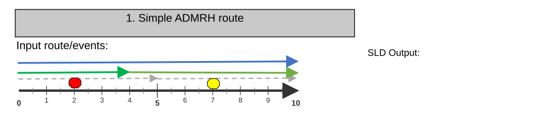

### TC-U02 — Simple UNAPR route (case 2) <!-- src: S2 · slide 3 · case 2 -->

| RouteName: | 0 | 1 | 2 | 3 | 4 | 5 | 6 | 7 | 8 | 9 | 10 |
| --- | --- | --- | --- | --- | --- | --- | --- | --- | --- | --- | --- |
| Pipeline Line | TRANSMISSION |  |  |  |  | DISTRIBUTION |  |  |  |  |  |
| Anomaly |  |  | DENT |  |  |  |  |  |  |  |  |
| Pipeline Device |  |  |  |  |  |  |  | METER |  |  |  |
| Pipeline Junction |  |  |  |  |  |  |  |  |  | ELBOW |  |
| Operating Pressure | 350 PSI |  |  |  | 400 PSI |  |  |  |  |  |  |
| DOT Class | CLASS 1 |  |  |  |  |  |  |  |  |  |  |

| Input Event Layer | Route Name | From Date | To Date | From Measure | To Measure | Attribute |
| --- | --- | --- | --- | --- | --- | --- |
| Pipeline Line | N/A | N/A | N/A | N/A | N/A | TRANSMISSION |
| Pipeline Line | N/A | N/A | N/A | N/A | N/A | DISTRIBUTION |
| Anomaly | 001 | 1/1/2000 | <NULL> | 2 | N/A | DENT |
| Pipeline Device | 001 | N/A | N/A | 7 | N/A | METER |
| Pipeline Junction | 001 | N/A | N/A | 9 | N/A | ELBOW |
| Operating Pressure | 001 | 1/1/2000 | <NULL> | 0 | 4 | 350 PSI |
| Operating Pressure | 001 | 1/1/2000 | <NULL> | 4 | 10 | 400 PSI |
| DOT Class | 001 | 1/1/2000 | <NULL> | 0 | 10 | CLASS 1 |

| Route Name | From Date | To Date |
| --- | --- | --- |
| Route001 | 1/1/2000 | <Null> |

[figure: Input route/events: · SLD Output: · 0–10]

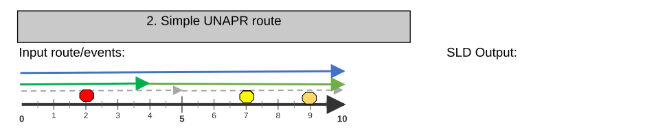

### TC-U03 — Complex ADMRH route (case 3) <!-- src: S2 · slide 4 · case 3 -->

| RouteID | From Date | To Date |
| --- | --- | --- |
| 001 | 1/1/2000 | <Null> |

| Input Event Layer | RouteID | From Date | To Date | From Measure | To Measure | Attribute |
| --- | --- | --- | --- | --- | --- | --- |
| Road Centerlines | N/A | N/A | N/A | N/A | N/A | NEW ALBANY |
| Road Centerlines | N/A | N/A | N/A | N/A | N/A | NEW ALBANY |
| Road Centerlines | N/A | N/A | N/A | N/A | N/A | COLUMBUS |
| Signs | 001 | 1/1/2000 | <NULL> | 2 | N/A | STOP |
| Signs | 001 | 1/1/2000 | <NULL> | 7 | N/A | YIELD |
| Speed | 001 | 1/1/2000 | <NULL> | 0 | 4 | 45 MPH |
| Speed | 001 | 1/1/2000 | <NULL> | 4 | 10 | 50 MPH |
| Functional Class | 001 | 1/1/2000 | <NULL> | 0 | 10 | MINOR |

| RouteID: | 0 | 1 | 2 | 3 | 4 | 5 | 6 | 7 | 8 | 9 | 10 |
| --- | --- | --- | --- | --- | --- | --- | --- | --- | --- | --- | --- |
| Road Centerlines | NEW ALBANY |  | NEW ALBANY |  |  | COLUMBUS |  |  |  |  |  |
| Signs |  |  | STOP |  |  |  |  | YIELD |  |  |  |
| Speed | 45 MPH |  |  |  | 50 MPH |  |  |  |  |  |  |
| Functional Class | MINOR |  |  |  |  |  |  |  |  |  |  |

[figure: 0–4 · 6–9 · 5 · 10 · Input route/events: · SLD Output:]

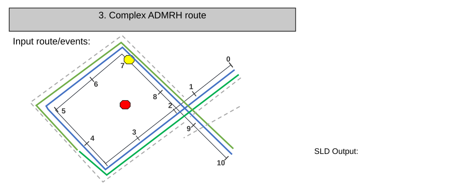

### TC-U04 — Complex UNAPR route (case 4) <!-- src: S2 · slide 5 · case 4 -->

| RouteID | From Date | To Date |
| --- | --- | --- |
| 001 | 1/1/2000 | <Null> |

| RouteName: | 0 | 1 | 2 | 3 | 4 | 5 | 6 | 7 | 8 | 9 | 10 |
| --- | --- | --- | --- | --- | --- | --- | --- | --- | --- | --- | --- |
| Pipeline Line | TRANSMISSION |  | TRANSMISSION |  |  | DISTRIBUTION |  |  |  |  |  |
| Anomaly |  |  | DENT |  |  |  |  |  |  |  |  |
| Pipeline Device |  |  |  |  |  |  |  | METER |  |  |  |
| Pipeline Junction |  |  |  |  |  |  |  |  |  | ELBOW |  |
| Operating Pressure | 350 PSI |  |  |  | 400 PSI |  |  |  |  |  |  |
| DOT Class | CLASS 1 |  |  |  |  |  |  |  |  |  |  |

| Input Event Layer | Route Name | From Date | To Date | From Measure | To Measure | Attribute |
| --- | --- | --- | --- | --- | --- | --- |
| Pipeline Line | N/A | N/A | N/A | N/A | N/A | TRANSMISSION |
| Pipeline Line | N/A | N/A | N/A | N/A | N/A | TRANSMISSION |
| Pipeline Line | N/A | N/A | N/A | N/A | N/A | DISTRIBUTION |
| Anomaly | 001 | 1/1/2000 | <NULL> | 2 | N/A | DENT |
| Pipeline Device | 001 | N/A | N/A | 7 | N/A | METER |
| Pipeline Junction | 001 | N/A | N/A | 9 | N/A | ELBOW |
| Operating Pressure | 001 | 1/1/2000 | <NULL> | 0 | 4 | 350 PSI |
| Operating Pressure | 001 | 1/1/2000 | <NULL> | 4 | 10 | 400 PSI |
| DOT Class | 001 | 1/1/2000 | <NULL> | 0 | 10 | CLASS 1 |

[figure: 0–4 · 6–9 · 5 · 10 · Input route/events: · SLD Output:]

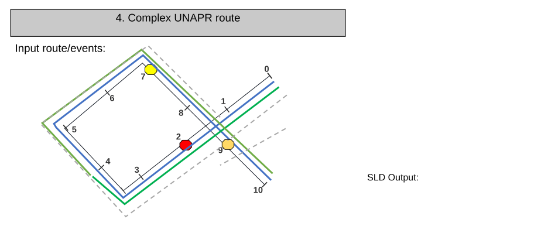

### TC-U05 — Vertical ADMRH route (case 5) <!-- src: S2 · slide 6 · case 5 -->

| RouteID: | 0 | 1 | 2 | 3 | 4 | 5 | 6 | 7 | 8 | 9 | 10 |
| --- | --- | --- | --- | --- | --- | --- | --- | --- | --- | --- | --- |
| Road Centerlines | NEW ALBANY |  |  |  |  | COLUMBUS |  |  |  |  |  |
| Signs |  |  | STOP |  |  |  |  | YIELD |  |  |  |
| Speed | 45 MPH |  |  |  |  |  | 50 MPH |  |  |  |  |
| Functional Class | MINOR |  |  |  |  |  |  |  |  |  |  |

| RouteID | From Date | To Date |
| --- | --- | --- |
| 001 | 1/1/2000 | <Null> |

| Input Event Layer | RouteID | From Date | To Date | From Measure | To Measure | Attribute |
| --- | --- | --- | --- | --- | --- | --- |
| Road Centerlines | N/A | N/A | N/A | N/A | N/A | NEW ALBANY |
| Road Centerlines | N/A | N/A | N/A | N/A | N/A | COLUMBUS |
| Signs | 001 | 1/1/2000 | <NULL> | 2 | N/A | STOP |
| Signs | 001 | 1/1/2000 | <NULL> | 7 | N/A | YIELD |
| Speed | 001 | 1/1/2000 | <NULL> | 0 | 6 | 45 MPH |
| Speed | 001 | 1/1/2000 | <NULL> | 6 | 10 | 50 MPH |
| Functional Class | 001 | 1/1/2000 | <NULL> | 0 | 10 | MINOR |

[figure: Input route/events: · SLD Output: · 0 · 10 · 5]

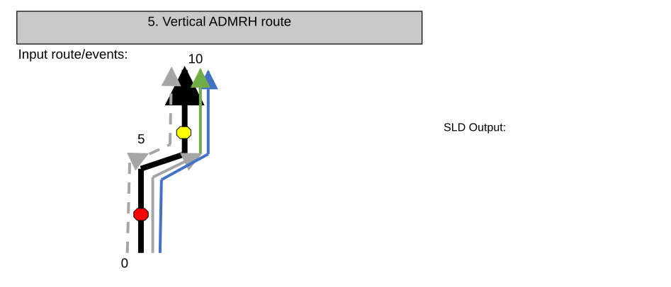

### TC-U06 — Vertical UNAPR route (case 6) <!-- src: S2 · slide 7 · case 6 -->

| RouteID | From Date | To Date |
| --- | --- | --- |
| 001 | 1/1/2000 | <Null> |

| RouteName: | 0 | 1 | 2 | 3 | 4 | 5 | 6 | 7 | 8 | 9 | 10 |
| --- | --- | --- | --- | --- | --- | --- | --- | --- | --- | --- | --- |
| Pipeline Line | TRANSMISSION |  |  |  |  | DISTRIBUTION |  |  |  |  |  |
| Anomaly |  |  | DENT |  |  |  |  |  |  |  |  |
| Pipeline Device |  |  |  |  |  |  |  | METER |  |  |  |
| Pipeline Junction |  |  |  |  |  |  |  |  |  | ELBOW |  |
| Operating Pressure | 350 PSI |  |  |  | 400 PSI |  |  |  |  |  |  |
| DOT Class | CLASS 1 |  |  |  |  |  |  |  |  |  |  |

| Input Event Layer | Route Name | From Date | To Date | From Measure | To Measure | Attribute |
| --- | --- | --- | --- | --- | --- | --- |
| Pipeline Line | N/A | N/A | N/A | N/A | N/A | TRANSMISSION |
| Pipeline Line | N/A | N/A | N/A | N/A | N/A | DISTRIBUTION |
| Anomaly | 001 | 1/1/2000 | <NULL> | 2 | N/A | DENT |
| Pipeline Device | 001 | N/A | N/A | 7 | N/A | METER |
| Pipeline Junction | 001 | N/A | N/A | 9 | N/A | ELBOW |
| Operating Pressure | 001 | 1/1/2000 | <NULL> | 0 | 4 | 350 PSI |
| Operating Pressure | 001 | 1/1/2000 | <NULL> | 4 | 10 | 400 PSI |
| DOT Class | 001 | 1/1/2000 | <NULL> | 0 | 10 | CLASS 1 |

[figure: Input route/events: · SLD Output: · 0 · 10 · 5]

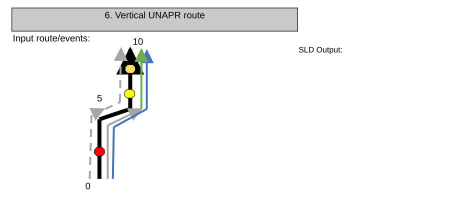

### TC-U07 — Gapped ADMRH route (case 7) <!-- src: S2 · slide 8 · case 7 -->

| RouteID: | 0 | 1 | 2 | 3 | 4 | 5 | 6 | 7 | 8 | 9 | 10 |
| --- | --- | --- | --- | --- | --- | --- | --- | --- | --- | --- | --- |
| Road Centerlines | NEW ALBANY |  |  | COLUMBUS |  |  | COLUMBUS |  |  |  |  |
| Signs |  |  | STOP |  |  |  |  | YIELD |  |  |  |
| Speed | 45 MPH |  |  |  |  |  | 50 MPH |  |  |  |  |
| Functional Class | MINOR |  |  |  |  |  | MINOR |  |  |  |  |

| RouteID | From Date | To Date |
| --- | --- | --- |
| 001 | 1/1/2000 | <Null> |

| Input Event Layer | RouteID | From Date | To Date | From Measure | To Measure | Attribute |
| --- | --- | --- | --- | --- | --- | --- |
| Road Centerlines | N/A | N/A | N/A | N/A | N/A | NEW ALBANY |
| Road Centerlines | N/A | N/A | N/A | N/A | N/A | COLUMBUS |
| Road Centerlines | N/A | N/A | N/A | N/A | N/A | COLUMBUS |
| Signs | 001 | 1/1/2000 | <NULL> | 2 | N/A | STOP |
| Signs | 001 | 1/1/2000 | <NULL> | 7 | N/A | YIELD |
| Speed | 001 | 1/1/2000 | <NULL> | 0 | 4 | 45 MPH |
| Speed | 001 | 1/1/2000 | <NULL> | 4 | 10 | 50 MPH |
| Functional Class | 001 | 1/1/2000 | <NULL> | 0 | 4 | MINOR |
| Functional Class | 001 | 1/1/2000 | <NULL> | 6 | 10 | MAJOR |

[figure: Input route/events: · SLD Output: · 0–4 · 6–10]

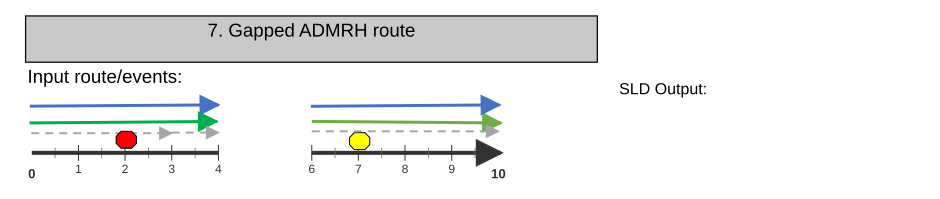

### TC-U08 — Gapped UNAPR route (case 8) <!-- src: S2 · slide 9 · case 8 -->

| RouteName: | 0 | 1 | 2 | 3 | 4 | 5 | 6 | 7 | 8 | 9 | 10 |
| --- | --- | --- | --- | --- | --- | --- | --- | --- | --- | --- | --- |
| Pipeline Line | TRANSMISSION |  |  |  |  |  | DISTRIBUTION |  |  |  |  |
| Anomaly |  |  | DENT |  |  |  |  |  |  |  |  |
| Pipeline Device |  |  |  |  |  |  |  | METER |  |  |  |
| Pipeline Junction |  |  |  |  |  |  |  |  |  | ELBOW |  |
| Operating Pressure | 350 PSI |  |  |  |  |  | 400 PSI |  |  |  |  |
| DOT Class | CLASS 1 |  |  |  |  |  | CLASS 1 |  |  |  |  |

| Input Event Layer | Route Name | From Date | To Date | From Measure | To Measure | Attribute |
| --- | --- | --- | --- | --- | --- | --- |
| Pipeline Line | N/A | N/A | N/A | N/A | N/A | TRANSMISSION |
| Pipeline Line | N/A | N/A | N/A | N/A | N/A | DISTRIBUTION |
| Anomaly | 001 | 1/1/2000 | <NULL> | 2 | N/A | DENT |
| Pipeline Device | 001 | N/A | N/A | 7 | N/A | METER |
| Pipeline Junction | 001 | N/A | N/A | 9 | N/A | ELBOW |
| Operating Pressure | 001 | 1/1/2000 | <NULL> | 0 | 4 | 350 PSI |
| Operating Pressure | 001 | 1/1/2000 | <NULL> | 4 | 10 | 400 PSI |
| DOT Class | 001 | 1/1/2000 | <NULL> | 0 | 4 | CLASS 1 |
| DOT Class | 001 | 1/1/2000 | <NULL> | 6 | 10 | Class1 |

| Route Name | From Date | To Date |
| --- | --- | --- |
| Route001 | 1/1/2000 | <Null> |

[figure: Input route/events: · SLD Output: · 0–4 · 6–10]

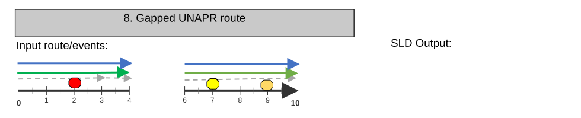

### TC-U09 — ADMRH route with flipped centerlines (case 9) <!-- src: S2 · slide 10 · case 9 -->

| RouteID: | 0 | 1 | 2 | 3 | 4 | 5 | 6 | 7 | 8 | 9 | 10 |
| --- | --- | --- | --- | --- | --- | --- | --- | --- | --- | --- | --- |
| Road Centerlines | NEW ALBANY |  |  |  |  | COLUMBUS |  |  |  |  |  |
| Signs |  |  | STOP |  |  |  |  | YIELD |  |  |  |
| Speed | 45 MPH |  |  |  | 50 MPH |  |  |  |  |  |  |
| Functional Class | MINOR |  |  |  |  |  |  |  |  |  |  |

| RouteID | From Date | To Date |
| --- | --- | --- |
| 001 | 1/1/2000 | <Null> |

| Input Event Layer | RouteID | From Date | To Date | From Measure | To Measure | Attribute |
| --- | --- | --- | --- | --- | --- | --- |
| Road Centerlines | N/A | N/A | N/A | N/A | N/A | NEW ALBANY |
| Road Centerlines | N/A | N/A | N/A | N/A | N/A | COLUMBUS |
| Signs | 001 | 1/1/2000 | <NULL> | 2 | N/A | STOP |
| Signs | 001 | 1/1/2000 | <NULL> | 7 | N/A | YIELD |
| Speed | 001 | 1/1/2000 | <NULL> | 0 | 4 | 45 MPH |
| Speed | 001 | 1/1/2000 | <NULL> | 4 | 10 | 50 MPH |
| Functional Class | 001 | 1/1/2000 | <NULL> | 0 | 10 | MINOR |

[figure: Input route/events: · SLD Output: · 0–10]

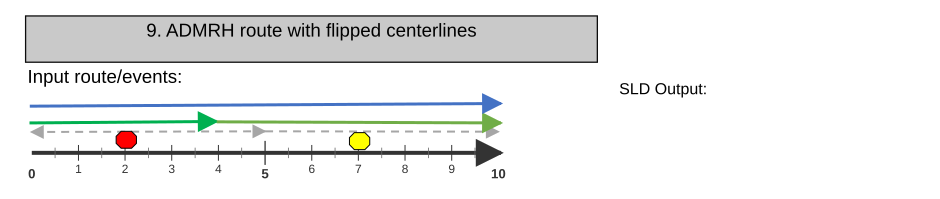

### TC-U10 — UNAPR route with flipped centerlines (case 10) <!-- src: S2 · slide 11 · case 10 -->

| RouteName: | 0 | 1 | 2 | 3 | 4 | 5 | 6 | 7 | 8 | 9 | 10 |
| --- | --- | --- | --- | --- | --- | --- | --- | --- | --- | --- | --- |
| Pipeline Line | TRANSMISSION |  |  |  |  | DISTRIBUTION |  |  |  |  |  |
| Anomaly |  |  | DENT |  |  |  |  |  |  |  |  |
| Pipeline Device |  |  |  |  |  |  |  | METER |  |  |  |
| Pipeline Junction |  |  |  |  |  |  |  |  |  | ELBOW |  |
| Operating Pressure | 350 PSI |  |  |  | 400 PSI |  |  |  |  |  |  |
| DOT Class | CLASS 1 |  |  |  |  |  |  |  |  |  |  |

| Input Event Layer | Route Name | From Date | To Date | From Measure | To Measure | Attribute |
| --- | --- | --- | --- | --- | --- | --- |
| Pipeline Line | N/A | N/A | N/A | N/A | N/A | TRANSMISSION |
| Pipeline Line | N/A | N/A | N/A | N/A | N/A | DISTRIBUTION |
| Anomaly | 001 | 1/1/2000 | <NULL> | 2 | N/A | DENT |
| Pipeline Device | 001 | N/A | N/A | 7 | N/A | METER |
| Pipeline Junction | 001 | N/A | N/A | 9 | N/A | ELBOW |
| Operating Pressure | 001 | 1/1/2000 | <NULL> | 0 | 4 | 350 PSI |
| Operating Pressure | 001 | 1/1/2000 | <NULL> | 4 | 10 | 400 PSI |
| DOT Class | 001 | 1/1/2000 | <NULL> | 0 | 10 | CLASS 1 |

| Route Name | From Date | To Date |
| --- | --- | --- |
| Route001 | 1/1/2000 | <Null> |

[figure: Input route/events: · SLD Output: · 0–10]

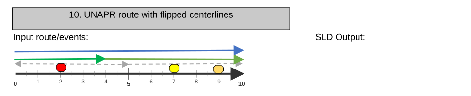

### TC-U11 — ADMRH route made of hundreds of small centerlines (case 11) <!-- src: S2 · slide 12 · case 11 -->

| RouteID: | 0 | 1 | 2 | 3 | 4 | 5 | 6 | 7 | 8 | 9 | 10… |
| --- | --- | --- | --- | --- | --- | --- | --- | --- | --- | --- | --- |
| Road Centerlines | NEW ALBANY | COLUMBUS | BRICE | DARBYDALE | GROVE CITY | HILLIARD | BEXLEY | RIVERLEA | WHITEHALL | WESTERVILLE | DUBLIN |
| Signs |  |  | STOP |  |  |  |  | YIELD |  |  |  |
| Speed | 45 MPH |  |  |  | 50 MPH |  |  |  |  |  |  |
| Functional Class | MINOR |  |  |  |  |  |  |  |  |  |  |

| RouteID | From Date | To Date |
| --- | --- | --- |
| 001 | 1/1/2000 | <Null> |

| Input Event Layer | RouteID | From Date | To Date | From Measure | To Measure | Attribute |
| --- | --- | --- | --- | --- | --- | --- |
| Road Centerlines | N/A | N/A | N/A | N/A | N/A | NEW ALBANY |
| Road Centerlines | N/A | N/A | N/A | N/A | N/A | COLUMBUS |
| Road Centerlines | N/A | N/A | N/A | N/A | N/A | BRICE |
| Road Centerlines | N/A | N/A | N/A | N/A | N/A | DARBYDALE |
| Road Centerlines | N/A | N/A | N/A | N/A | N/A | GROVE CITY |
| Road Centerlines | N/A | N/A | N/A | N/A | N/A | HILLIARD |
| Road Centerlines | N/A | N/A | N/A | N/A | N/A | BEXLEY |
| Road Centerlines | N/A | N/A | N/A | N/A | N/A | RIVERLEA |
| Road Centerlines | N/A | N/A | N/A | N/A | N/A | WHITEHALL |
| Road Centerlines | N/A | N/A | N/A | N/A | N/A | WESTERVILLE |
| Road Centerlines | N/A | N/A | N/A | N/A | N/A | DUBLIN |
| Road Centerlines | … | … | … | … | … | … |
| Signs | 001 | 1/1/2000 | <NULL> | 2 | N/A | STOP |
| Signs | 001 | 1/1/2000 | <NULL> | 7 | N/A | YIELD |
| Speed | 001 | 1/1/2000 | <NULL> | 0 | 4 | 45 MPH |
| Speed | 001 | 1/1/2000 | <NULL> | 4 | 10 | 50 MPH |
| Functional Class | 001 | 1/1/2000 | <NULL> | 0 | 10 | MINOR |

[figure: Input route/events: · SLD Output: · 0–9 · 10…]

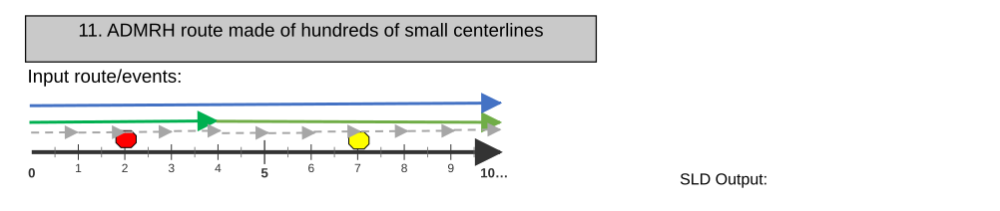

### TC-U12 — Simple UNAPR route (case 2) <!-- src: S2 · slide 13 · case 2 -->

| RouteName: | 0 | 1 | 2 | 3 | 4 | 5 | 6 | 7 | 8 | 9 | 10 |
| --- | --- | --- | --- | --- | --- | --- | --- | --- | --- | --- | --- |
| Pipeline Line | TRANSMISSION | DISTRIBUTION | STATION | STORAGE | TRANSMISSION | DISTRIBUTION | STATION | STORAGE | TRANSMISSION | DISTRIBUTION | STATION |
| Anomaly |  |  | DENT |  |  |  |  |  |  |  |  |
| Pipeline Device |  |  |  |  |  |  |  | METER |  |  |  |
| Pipeline Junction |  |  |  |  |  |  |  |  |  | ELBOW |  |
| Operating Pressure | 350 PSI |  |  |  | 400 PSI |  |  |  |  |  |  |
| DOT Class | CLASS 1 |  |  |  |  |  |  |  |  |  |  |

| Input Event Layer | Route Name | From Date | To Date | From Measure | To Measure | Attribute |
| --- | --- | --- | --- | --- | --- | --- |
| Pipeline Line | N/A | N/A | N/A | N/A | N/A | TRANSMISSION |
| Pipeline Line | N/A | N/A | N/A | N/A | N/A | DISTRIBUTION |
| Pipeline Line | N/A | N/A | N/A | N/A | N/A | STATION |
| Pipeline Line | N/A | N/A | N/A | N/A | N/A | STORAGE |
| Pipeline Line | N/A | N/A | N/A | N/A | N/A | TRANSMISSION |
| Pipeline Line | N/A | N/A | N/A | N/A | N/A | DISTRIBUTION |
| Pipeline Line | N/A | N/A | N/A | N/A | N/A | STATION |
| Pipeline Line | N/A | N/A | N/A | N/A | N/A | STORAGE |
| Pipeline Line | N/A | N/A | N/A | N/A | N/A | TRANSMISSION |
| Pipeline Line | N/A | N/A | N/A | N/A | N/A | DISTRIBUTION |
| Pipeline Line | … | … | … | … | … | … |
| Anomaly | 001 | 1/1/2000 | <NULL> | 2 | N/A | DENT |
| Pipeline Device | 001 | N/A | N/A | 7 | N/A | METER |
| Pipeline Junction | 001 | N/A | N/A | 9 | N/A | ELBOW |
| Operating Pressure | 001 | 1/1/2000 | <NULL> | 0 | 4 | 350 PSI |
| Operating Pressure | 001 | 1/1/2000 | <NULL> | 4 | 10 | 400 PSI |
| DOT Class | 001 | 1/1/2000 | <NULL> | 0 | 10 | CLASS 1 |

| Route Name | From Date | To Date |
| --- | --- | --- |
| Route001 | 1/1/2000 | <Null> |

[figure: Input route/events: · SLD Output: · 0–9 · 10…]

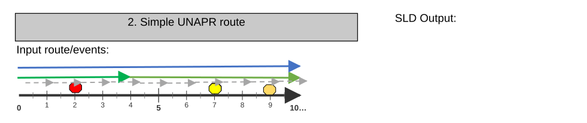

## Other content

### Slide 1 — Devtopia Issue <!-- slide 1 -->

SLD: Support centerline in UN and ADM

**Notes**
- Add functionality to the Dynamic Segmentation’s SLD component to allow configured ADMRH centerlines and UNAPR centerlines (Pipeline Line) to be included in the SLD
- Included centerline layer will not be included in the Table view
- Included centerline layer will be uneditable but attributes will appear in non-editable section of editing pop-up
- Included centerline layer will display as the first line layer
- Included centerline layer will inherit symbology/labelling properties from the layer (same way as other input line events)
- Add new configuration option to allow users to select whether the configured centerline layer will be included in the SLD output
- Included centerline layer’s feature direction will be preserved
- Test with only ADMRH and UNAPR data
- A11y and 508 (Run Allyhawk for Web tests against widget to ensure a11y issues are not introduced)
