# LRS Identify: Show Coordinates in Results Experience Builder Widget Test Plan

| Field | Value |
| --- | --- |
| **Doc** | 859 · Test Plan · Experience Builder |
| **Product** | Pipeline Referencing |
| **Release** | Enterprise 12.2 |
| **Issues** | [ArcGISPro/ps-location-referencing#26618](https://devtopia.esri.com/ArcGISPro/ps-location-referencing/issues/26618) |
| **Source** | [LRS_Identify_Coordinates_ExB_TestPlan.pptx](<https://esriis.sharepoint.com/sites/LocationReferencing/Shared%20Documents/General/Test%20Plans/LRS_Identify_Coordinates_ExB_TestPlan.pptx>) |
| **People** | author Karlie Murray · PE karlie murray · dev prutha shirodkar |
| **Edited** | 2026-08-13 18:23 by Karlie Murray |
| **Extracted** | 2026-09-04 · lane xmlstrip · format 3.0 · prompt v2.0.2 |
| **Keywords** | coordinates · identify widget · experience builder · regression tests · multiple routes · multiple events · date filter · data actions |
| **Tools** | LRS Identify · Add Point Event · Add Line Event · Dynamic Segmentation · Table widget · Date Filter |

## Summary

This document is a test plan for the LRS Identify widget in Experience Builder, focusing on configurable coordinate output in identify results. It covers coordinate configuration, precision, regression tests for multiple routes and events, date filtering, and data actions integration with other widgets. The plan ensures accurate coordinate display, copying functionality, and proper handling of multiple routes, events, and time-slices under various configurations.

## Related documents

<!-- related:begin -->
- [Iteration Planning and Issue Tracking for Location Referencing 3.8/12.2](<https://esriis.sharepoint.com/sites/lrsworkspace/LRS Doc Index/Schedules/3040-iteration-planning-and-issue-tracking-for-lr-3-8-12-2.md>) — shared issue ArcGISPro/ps-location-referencing#26618 · similar text 0.05 <!-- rel:2 s=1001.311 -->
- [Test Plan: Display Expanded LRS and Business Attributes in the SLD Hover Tooltip](<https://esriis.sharepoint.com/sites/lrsworkspace/LRS Doc Index/Test Plans/24784-display-expanded-lrs-and-business-attributes-in-the-sld.md>) — similar text 0.21 · same kind/surface/release Enterprise 12.2/pe/dev/folder <!-- rel:908 s=6.729 -->
- [LRS Identify Widget – Configurable Coordinate Output](<https://esriis.sharepoint.com/sites/lrsworkspace/LRS Doc Index/User Stories/lrs-identify-widget-configurable-coordinate-output.md>) — similar text 0.29 · 2 title words · 2 filename words · same surface <!-- rel:26 s=5.213 -->
- [LRS Identify widget](<https://esriis.sharepoint.com/sites/lrsworkspace/LRS Doc Index/Other/lrs-identify-widget.md>) — similar text 0.24 · 2 title words · 1 filename word · same surface <!-- rel:905 s=4.499 -->
- [Data Action Support for LRS Identify widget– Test Plan](<https://esriis.sharepoint.com/sites/lrsworkspace/LRS Doc Index/Test Plans/17939-data-action-support-for-lrs-identify-widget.md>) — similar text 0.23 · 2 title words · 1 filename word · same kind/surface/folder <!-- rel:375 s=4.419 -->
<!-- related:end -->

<!-- docs:begin -->
## Esri documentation

[Apply dynamic segmentation](https://doc.esri.com/en/arcgis-pro/latest/help/production/location-referencing-pipelines/apply-dynamic-segmentation.html)

_No page matched:_ [LRS Identify](https://www.google.com/search?q=%22LRS%20Identify%22+site%3Adoc.esri.com) · [Add Point Event](https://www.google.com/search?q=%22Add%20Point%20Event%22+site%3Adoc.esri.com) · [Add Line Event](https://www.google.com/search?q=%22Add%20Line%20Event%22+site%3Adoc.esri.com) · [Table widget](https://www.google.com/search?q=%22Table%20widget%22+site%3Adoc.esri.com) · [Date Filter](https://www.google.com/search?q=%22Date%20Filter%22+site%3Adoc.esri.com)
<!-- docs:end -->

---

## Overview

### Slide 1 <!-- slide 1 -->

LRS Identify:
Show Coordinates in Results
Experience Builder  |  LRS Identify Widget

User Story: ps-location-referencing #26618

[figure: TEST PLAN · RELEASE: Enterprise 12.2 · SE: prutha shirodkar · PE: karlie murray]

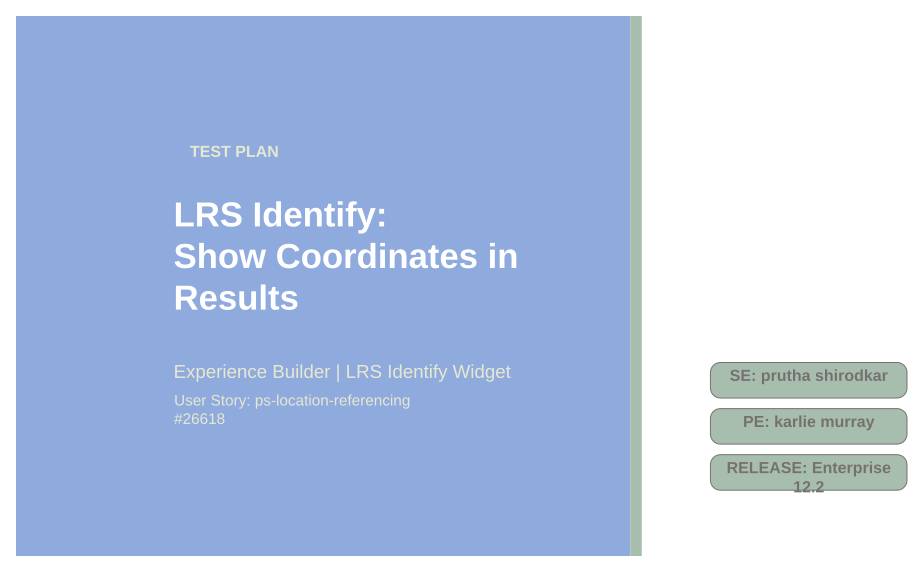

### Slide 2 — Scope & Summary <!-- slide 2 -->

Out of scope

- No Z / elevation values - X,Y only
- Raw lat/long as a spatial reference option

In scope

- 'Include coordinates in results' toggle in config - default OFF
- Set precision/tolerance in config (how many digits coordinate will have) – default to service precision
- Set Spatial Reference in config - default to LRS
- Coordinates derived from the LRS result location
- Highlight & copy in 'X,Y' format
- Spatial reference shown in results
- No performance degradation or regressions

Objective: As an LRS event editor or analyst, I need configurable coordinate output in the LRS Identify widget so that I can interpret and reuse location information accurately across systems.

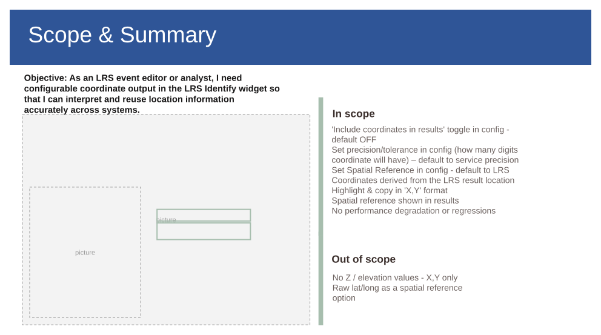

### Slide 3 — Test Environments & Data <!-- slide 3 -->

Environments

- Various ExB Templates
- Test with Date Filter widget
- Test Data Actions with other widgets
- Chrome and Edge browsers

Data

- Line and Non-Line Networks (projected & unprojected)
  - INDOT (non-line)
  - Franklin, Ohio ADM (non-line)
  - APR Sample (line)
  - PostMile (line)
  - APR Data (line) – unprojected
- Different spatial references (Map or LRS)
- Web map with a custom (non-Web Mercator) spatial reference
- Complex routes
- Routes with time-slices
- Attribute Sets

| Feature Service | LRS spatial reference | Web map spatial reference |
| --- | --- | --- |
| INDOT | NAD83 UTM Zone 16N | Web Mercator– WGS84 |
| Franklin County, Ohio | NAD83 State Plane Ohio South | Web Mercator– WGS84 |
| APR Sample | NAD83 Albers Equal Area | Web Mercator– WGS84 |
| PostMile | NAD83 California Albers | Web Mercator – WGS84 |
| APR Data (unprojected) | WGS 1984 (unprojected) | Web Mercator – WGS84 |
| Custom spatial reference ( non-Web Mercator) | TBD | Use a different basemap to configure a nonWGS84 spatial reference |

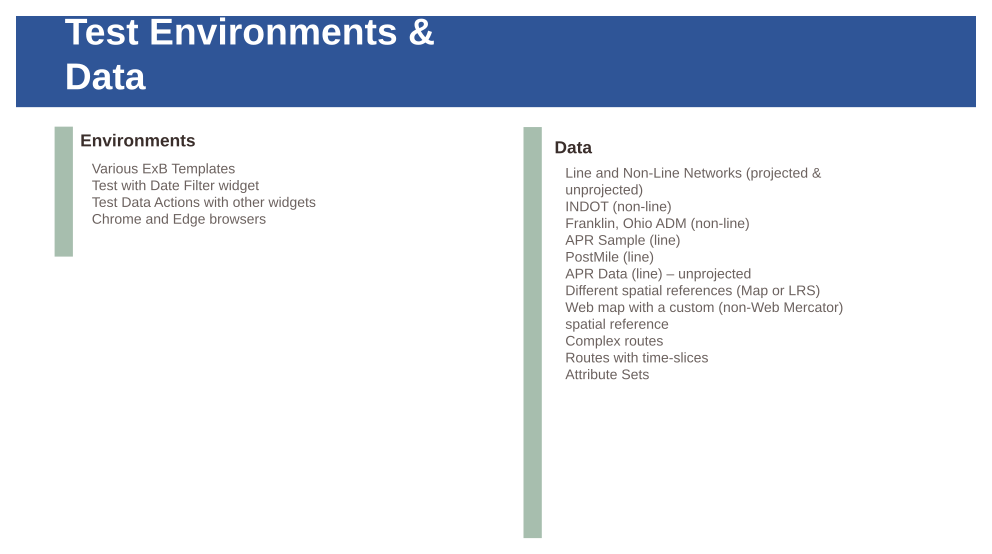

## Test Cases

### TC-U01 — ‘Include coordinates in results’ toggle button is present in the LRS Identify <!-- src: S3 · slide 4 · table · A-1 -->

- **ID:** A-1
- **Case:** ‘Include coordinates in results’ toggle button is present in the LRS Identify widget configuration settings
- **Expected Result:** 'Include coordinates in results' is present and turned OFF by default

### TC-U02 — Click the “Include coordinates in results’ toggle button <!-- src: S3 · slide 4 · table · A-2 -->

- **ID:** A-2
- **Expected Result:** Toggle button is turned ON or OFF in configuration. Precision and output spatial reference options become available.

### TC-U03 — “Include coordinates in results’ toggle button turned ON <!-- src: S3 · slide 4 · table · A-3 -->

- **ID:** A-3
- **Expected Result:** Coordinates are shown in LRS Identify Results

### TC-U04 — “Include coordinates in results’ toggle button turned OFF <!-- src: S3 · slide 4 · table · A- 4 -->

- **ID:** A- 4
- **Expected Result:** Coordinates are not shown in LRS Identify Results

### TC-U05 — At default, precision is set to the feature service’s precision <!-- src: S3 · slide 4 · table · A-5 -->

- **ID:** A-5
- **Expected Result:** Defaults to the service precision when widget is added to ExB (not a hard-coded value)

### TC-U06 — Precision value is changed from default value <!-- src: S3 · slide 4 · table · A-6 -->

- **ID:** A-6
- **Expected Result:** Coordinates in LRS Identify results reflect the correct precision value

### TC-U07 — At default, spatial reference type is set to ‘Map’ <!-- src: S3 · slide 4 · table · A-7 -->

- **ID:** A-7
- **Expected Result:** Defaults to ‘Map’ when widget is added to ExB

### TC-U08 — Spatial reference is set to ‘Map’ in configuration settings <!-- src: S3 · slide 4 · table · A-8 -->

- **ID:** A-8
- **Expected Result:** Coordinates in LRS Identify results are in the Map’s spatial reference. Spatial reference label displays correct spatial reference.

### TC-U09 — Spatial reference is set to ‘LRS’ in configuration settings <!-- src: S3 · slide 4 · table · A-9 -->

- **ID:** A-9
- **Expected Result:** Coordinates in LRS Identify results are in the LRS spatial reference. Spatial reference label displays correct spatial reference.

### TC-U10 — Save, publish, reopen the experience <!-- src: S3 · slide 4 · table · A-10 -->

- **ID:** A-10
- **Expected Result:** Toggle, Precision and Spatial Reference selections all persist

### TC-U11 — Change Default Network <!-- src: S3 · slide 5 · table · A-11 -->

- **ID:** A-11
- **Expected Result:** Identify Results show default network first when the clicked location has more than one network present

### TC-U12 — Turn on toggle ‘Show Line Events’ <!-- src: S3 · slide 5 · table · A-12 -->

- **ID:** A-12
- **Expected Result:** Identify Results show line events that exist at clicked location

### TC-U13 — Turn on toggle ‘Show Point Events’ <!-- src: S3 · slide 5 · table · A-13 -->

- **ID:** A-13
- **Expected Result:** Identify Results show point events that exist at clicked location

### TC-U14 — Change the Point Attribute Set <!-- src: S3 · slide 5 · table · A-14 -->

- **ID:** A-14
- **Expected Result:** Identify Results only show point events that are included in the specified Attribute Set

### TC-U15 — Change the Line Attribute Set <!-- src: S3 · slide 5 · table · A-15 -->

- **ID:** A-15
- **Expected Result:** Identify Results only show line events that are included in the specified Attribute Set

### TC-U16 — When the input network is PoM, configure events to be displayed <!-- src: S3 · slide 5 · table · A-16 -->

- **ID:** A-16
- **Expected Result:** No events are displayed for PoM Network in Identify Results

### TC-U17 — Hide business fields in the Network layer <!-- src: S3 · slide 5 · table · A-17 -->

- **ID:** A-17
- **Expected Result:** Identify Results does not show the hidden fields

### TC-U18 — Reorder layers in the layer list <!-- src: S3 · slide 5 · table · A-18 -->

- **ID:** A-18
- **Expected Result:** Layers can be dragged and reordered

### TC-U19 — Hide layers via the configuration <!-- src: S3 · slide 5 · table · A-19 -->

- **ID:** A-19
- **Expected Result:** Identify Results does not show the hidden layers

### TC-U20 — Using the Select Layers option <!-- src: S3 · slide 5 · table · A-20 -->

- **ID:** A-20
- **Case:** Using the Select Layers option, Load Layers and then click the X to select layers to remove in the layers list
- **Expected Result:** Identify Results does not show the removed layers

### TC-U21 — Add/Remove a data action <!-- src: S3 · slide 5 · table · A-21 -->

- **ID:** A-21
- **Expected Result:** Data Actions for Identify reflect what is configured

### TC-U22 — Configure multiple LRS Identify widgets in one experience <!-- src: S3 · slide 5 · table · A-22 -->

- **ID:** A-22
- **Expected Result:** Each widget honors its own independent coordinate configuration

### TC-U23 — At default, precision is set to the feature service’s precision (A-5 duplicate) <!-- src: S3 · slide 6 · table · B-1 -->

- **ID:** B-1
- **Expected Result:** Digits returned match the service precision - no rounding applied by the widget

### TC-U24 — Precision set to 0 <!-- src: S3 · slide 6 · table · B-2 -->

- **ID:** B-2
- **Expected Result:** Coordinates are displayed as whole numbers; no decimal separator

### TC-U25 — Precision set to a low value (e.g. 2) <!-- src: S3 · slide 6 · table · B-3 -->

- **ID:** B-3
- **Expected Result:** Coordinates truncated/rounded consistently to the configured digits

### TC-U26 — Precision set to a high value (e.g. 8) <!-- src: S3 · slide 6 · table · B-4 -->

- **ID:** B-4
- **Expected Result:** Full digits shown without truncation

### TC-U27 — User can adjust precision field with up & down arrow buttons <!-- src: S3 · slide 6 · table · B-5 -->

- **ID:** B-5
- **Expected Result:** Precision value responds when up & down buttons are used

### TC-U28 — User can adjust precision by typing in field <!-- src: S3 · slide 6 · table · B-6 -->

- **ID:** B-6
- **Expected Result:** Precision value can be changed via typing

### TC-U29 — User enters a precision greater than 12 <!-- src: S3 · slide 6 · table · B-7 -->

- **ID:** B-7
- **Expected Result:** User in not able to enter a precision greater than 12

### TC-U30 — Change precision, republish, re-identify <!-- src: S3 · slide 6 · table · B-8 -->

- **ID:** B-8
- **Expected Result:** New precision value is applied to subsequent results

### TC-N01 — Precision with negative coordinate values <!-- src: S3 · slide 6 · table · B-9 -->

- **ID:** B-9
- **Expected Result:** Negative sign preserved and digit count honored

### TC-U31 — Unprojected spatial reference <!-- src: S3 · slide 6 · table · B-10 -->

- **ID:** B-10
- **Expected Result:** Decimal degrees respect the configured precision

### TC-U32 — Projected spatial reference <!-- src: S3 · slide 6 · table · B-11 -->

- **ID:** B-11
- **Expected Result:** Projected units respect the configured precision

### TC-U33 — ‘Map’ vs. ‘LRS’ spatial reference <!-- src: S3 · slide 6 · table · B-12 -->

- **ID:** B-12
- **Expected Result:** The configured precision is preserved with both spatial reference options

### TC-U34 — Identify a location on a route <!-- src: S3 · slide 7 · table · C-1 -->

- **ID:** C-1
- **Expected Result:** Identify results show route, measure AND coordinates are returned. Green dot appears on map where route was clicked.

### TC-U35 — Compare returned X,Y against the LRS result location <!-- src: S3 · slide 7 · table · C-2 -->

- **ID:** C-2
- **Expected Result:** Coordinates are derived from the LRS result location

### TC-U36 — Identify a location where more than one route exists <!-- src: S3 · slide 7 · table · C-3 -->

- **ID:** C-3
- **Expected Result:** Identify results shows all routes: one route per page and the correct coordinate is shown on each page

### TC-U37 — Identify route with UTM spatial reference (INDOT) <!-- src: S3 · slide 7 · table · C-4 -->

- **ID:** C-4
- **Expected Result:** Identify results return coordinates in correct spatial reference

### TC-U38 — Identify route with State Plane spatial reference ( FranklinOH ) <!-- src: S3 · slide 7 · table · C-5 -->

- **ID:** C-5
- **Expected Result:** Identify results return coordinates in correct spatial reference

### TC-U39 — Identify route with Albers spatial reference (PostMile) <!-- src: S3 · slide 7 · table · C-6 -->

- **ID:** C-6
- **Expected Result:** Identify results return coordinates in correct spatial reference (no events show for PoM)

### TC-U40 — Identify route with Unprojected spatial reference ( APRData ) <!-- src: S3 · slide 7 · table · C-7 -->

- **ID:** C-7
- **Expected Result:** Identify results return coordinates in correct spatial reference

### TC-U41 — Identify route with custom spatial reference ( non-Web Mercator) <!-- src: S3 · slide 7 · table · C-8 -->

- **ID:** C-8
- **Expected Result:** Identify results return coordinates in correct spatial reference

### TC-U42 — Identify route with non-line network (INDOT)(C-5 duplicate) <!-- src: S3 · slide 7 · table · C-9 -->

- **ID:** C-9
- **Expected Result:** Identify results return coordinates

### TC-U43 — Identify route with line network ( APRSample ) <!-- src: S3 · slide 7 · table · C-10 -->

- **ID:** C-10
- **Expected Result:** Identify results return coordinates

### TC-U44 — Identify route when the configured spatial reference differs from the web map <!-- src: S3 · slide 7 · table · C-11 -->

- **ID:** C-11
- **Case:** Identify route when the configured spatial reference differs from the web map projection
- **Expected Result:** Identify results return coordinates. Difference from the web map projection is clearly communicated to the user

### TC-U45 — Highlight, right-click, and copy the coordinate result <!-- src: S3 · slide 8 · table · D-1 -->

- **ID:** D-1
- **Expected Result:** Clipboard contains exactly 'X,Y' (or 'Coordinate1, Coordinate2')

### TC-U46 — Ctrl+C to copy the coordinate result <!-- src: S3 · slide 8 · table · D-2 -->

- **ID:** D-2
- **Expected Result:** Clipboard contains exactly 'X,Y' (or 'Coordinate1, Coordinate2')

### TC-U47 — Click the copy icon to copy coordinate result <!-- src: S3 · slide 8 · table · D-3 -->

- **ID:** D-3
- **Expected Result:** Clipboard contains exactly 'X,Y' (or 'Coordinate1, Coordinate2’) . Copy icon shows check mark.

### TC-U48 — Copy coordinate and paste into Excel <!-- src: S3 · slide 8 · table · D-4 -->

- **ID:** D-4
- **Expected Result:** Value pastes cleanly in ‘X,Y’ format

### TC-U49 — Copy coordinate and paste into Notepad <!-- src: S3 · slide 8 · table · D-5 -->

- **ID:** D-5
- **Expected Result:** Value pastes cleanly in ‘X,Y’ format

### TC-U50 — Copy coordinate and paste into Add Point or Add Line Event <!-- src: S3 · slide 8 · table · D-6 -->

- **ID:** D-6
- **Expected Result:** Value pastes cleanly and is accepted as a valid coordinate input

### TC-U51 — Identify and copy/paste multiple different coordinates in a row <!-- src: S3 · slide 8 · table · D-7 -->

- **ID:** D-7
- **Expected Result:** Copied value reflects the most recently copied coordinate

### TC-U52 — Multiple routes exist at the clicked location from the same network <!-- src: S3 · slide 27 · table · F-1 -->

- **ID:** F-1
- **Expected Result:** Identify Results has 2 pages and displays one route per page. Coordinate is not displayed.

### TC-U53 — Multiple routes with different networks exist at the clicked location (F-2) <!-- src: S3 · slide 27 · table · F-2 -->

- **ID:** F-2
- **Expected Result:** Network in Identify Results is a dropdown field with options to select different Networks. Default Network displays first. Coordinate is not displayed.

### TC-U54 — Multiple routes with different networks exist at the clicked location (F-3) <!-- src: S3 · slide 27 · table · F-3 -->

- **ID:** F-3
- **Case:** Multiple routes with different networks exist at the clicked location, but one network is turned off in the configuration
- **Expected Result:** Identify Results displays the route belonging to the Network that is turned on. Network dropdown menu does not display the Network that is turned off. Coordinate is not displayed.

### TC-U55 — Multiple routes with different networks exist at the clicked location (F-4) <!-- src: S3 · slide 27 · table · F-4 -->

- **ID:** F-4
- **Case:** Multiple routes with different networks exist at the clicked location, but one network is turned off in the map
- **Expected Result:** Identify Results displays the route belonging to the Network that is turned on. Network dropdown menu does not display the Network that is turned off. Coordinate is not displayed.

### TC-U56 — Click a location where two routes intersect <!-- src: S3 · slide 27 · table · F-5 -->

- **ID:** F-5
- **Expected Result:** Identify Results has 2 pages and displays one route per page. Coordinate is not displayed.

### TC-U57 — Click a location where the end of one route meets the start of another route <!-- src: S3 · slide 27 · table · F-6 -->

- **ID:** F-6
- **Expected Result:** Identify Results has 2 pages and displays one route per page. Coordinate is not displayed.

### TC-U58 — Click the location where a lollipop route self-intersects <!-- src: S3 · slide 27 · table · F-7 -->

- **ID:** F-7
- **Expected Result:** Identify Results displays route and both measures. Coordinate is not displayed.

### TC-U59 — Click the location where a branch route self-intersects <!-- src: S3 · slide 27 · table · F-8 -->

- **ID:** F-8
- **Expected Result:** Identify Results displays route and both measures. Coordinate is not displayed.

### TC-U60 — Click the location where a loop route self-intersects <!-- src: S3 · slide 28 · table · F-9 -->

- **ID:** F-9
- **Expected Result:** Identify Results displays route and both measures. Coordinate is not displayed.

### TC-U61 — Click the location where an infinity route self-intersects <!-- src: S3 · slide 28 · table · F-10 -->

- **ID:** F-10
- **Expected Result:** Identify Results displays route and three measures. Coordinate is not displayed.

### TC-U62 — Click the location where a route intersects a loop route. The clicked location <!-- src: S3 · slide 28 · table · F-11 -->

- **ID:** F-11
- **Case:** Click the location where a route intersects a loop route. The clicked location is where the loop route self-intersects
- **Expected Result:** Identify Results has 2 pages and displays one route per page. Coordinate is not displayed.

### TC-U63 — Multiple time-slices exist at the clicked location <!-- src: S3 · slide 28 · table · F-12 -->

- **ID:** F-12
- **Expected Result:** Identify Results displays all time-slices in the date field dropdown. Coordinate is not displayed.

### TC-U64 — Multiple time-slices of the route exist <!-- src: S3 · slide 28 · table · F-13 -->

- **ID:** F-13
- **Case:** Multiple time-slices of the route exist, but they do not all exist at the clicked location
- **Expected Result:** Identify Results displays all time-slices in the date field dropdown that exist at the clicked location. Coordinate is not displayed.

### TC-U65 — Network is configured to not show extra business fields <!-- src: S3 · slide 28 · table · F-14 -->

- **ID:** F-14
- **Expected Result:** Identify Results displays all route attributes except business fields that are configured to be hidden. Coordinate is not displayed.

### TC-U66 — No routes exist at the clicked location <!-- src: S3 · slide 28 · table · F-15 -->

- **ID:** F-15
- **Expected Result:** Identify Results not returned. Identify stays enabled so user does not have to select Identify again before their next click.

### TC-U67 — Multiple line and point events exist at the clicked location <!-- src: S3 · slide 28 · table · F-16 -->

- **ID:** F-16
- **Expected Result:** Identify Results displays all events and their attributes present at the clicked location. Coordinate is not displayed.

### TC-U68 — Multiple overlapping line events within the same event layer exist <!-- src: S3 · slide 28 · table · F-17 -->

- **ID:** F-17
- **Case:** Multiple overlapping line events within the same event layer exist at the clicked location
- **Expected Result:** Identify Results displays route and all events present at the clicked location. Coordinate is not displayed.

### TC-U69 — The clicked location is where the start of one event and the end of another <!-- src: S3 · slide 29 · table · F-18 -->

- **ID:** F-18
- **Case:** The clicked location is where the start of one event and the end of another event meet (same event layer)
- **Expected Result:** Identify Results displays route and all events that exist at the clicked measure. Coordinate is not displayed.

### TC-U70 — Multiple events exist at the clicked location (F-19) <!-- src: S3 · slide 29 · table · F-19 -->

- **ID:** F-19
- **Case:** Multiple events exist at the clicked location, but some events are turned off in map
- **Expected Result:** Identify Results displays route and events. Only events that exist at the clicked location and turned on in the map are shown. Coordinate is not displayed.

### TC-U71 — Multiple events exist at the clicked location (F-20) <!-- src: S3 · slide 29 · table · F-20 -->

- **ID:** F-20
- **Case:** Multiple events exist at the clicked location, but all events are not present in the configured attribute set
- **Expected Result:** Identify Results displays route and events. Only events that exist at the clicked location and are present in the configured attribute set are shown. Coordinate is not displayed.

### TC-U72 — The clicked location is where a spanning event exists <!-- src: S3 · slide 29 · table · F-21 -->

- **ID:** F-21
- **Expected Result:** Identify Results displays route and all events that exist at the clicked measure. Coordinate is not displayed.

### TC-U73 — Multiple line events exist with multiple time-slices at the clicked location. <!-- src: S3 · slide 29 · table · F-22 -->

- **ID:** F-22
- **Case:** Multiple line events exist with multiple time-slices at the clicked location. Route has one time-slice.
- **Expected Result:** Identify Results displays all route and events present at the clicked location. Only time-slices that exist at clicked location are shown. Coordinate is not displayed.

### TC-U74 — Multiple time-slices of the route and events exist <!-- src: S3 · slide 29 · table · F-23 -->

- **ID:** F-23
- **Expected Result:** Identify Results displays all route and event time-slices that exist at clicked location. Coordinate is not displayed.

### TC-U75 — Date Filter widget is added to ExB and set to a single date <!-- src: S3 · slide 29 · table · F-24 -->

- **ID:** F-24
- **Expected Result:** Identify Results displays all route and event time-slices that exist on the filtered date and clicked location. Coordinate is not displayed.

### TC-U76 — Date Filter widget is added to ExB and set to a date range <!-- src: S3 · slide 29 · table · F-25 -->

- **ID:** F-25
- **Expected Result:** Identify Results displays all route and event time-slices that exist within the filtered date range and at the clicked location. Coordinate is not displayed.

### TC-U77 — Identify a route and then Data Action›Dynamic Segmentation <!-- src: S3 · slide 30 · table · G-1 -->

- **ID:** G-1
- **Expected Result:** Identified route opens in the Dynamic Segmentation widget.

### TC-U78 — With a route already populating the Dynamic Segmentation widget <!-- src: S3 · slide 30 · table · G-2 -->

- **ID:** G-2
- **Case:** With a route already populating the Dynamic Segmentation widget, identify a route and then Data Action>Dynamic Segmentation
- **Expected Result:** The previous route is cleared, and the identified route opens in the Dynamic Segmentation widget.

### TC-U79 — Identify a route and then Data Action›Add Point Event <!-- src: S3 · slide 30 · table · G-3 -->

- **ID:** G-3
- **Expected Result:** Identified route is populated in Route ID/Name field and identified measure is populated in Measure field in the Add Point Event widget.

### TC-U80 — With a route & measure already populating the Add Point Event widget <!-- src: S3 · slide 30 · table · G-4 -->

- **ID:** G-4
- **Case:** With a route & measure already populating the Add Point Event widget, identify a route and then Data Action>Add Point Event
- **Expected Result:** The previous route & measure are cleared, and the identified route & measure populates the Add Point Event widget.

### TC-U81 — Identify a route and then Data Action›Add Line Event (From) <!-- src: S3 · slide 30 · table · G-5 -->

- **ID:** G-5
- **Expected Result:** Identified route is populated in From Route ID/Name field and identified measure is populated in Measure field in the Add Line Event widget.

### TC-U82 — With a from route & measure already populating the Add Line Event widget <!-- src: S3 · slide 30 · table · G-6 -->

- **ID:** G-6
- **Case:** With a from route & measure already populating the Add Line Event widget, identify a route and then Data Action>Add Line Event (From)
- **Expected Result:** The previous from route & measure are cleared, and the identified route & measure populates the Add Line Event widget for From Route.

### TC-U83 — Identify a route and then Data Action›Add Line Event (To) <!-- src: S3 · slide 30 · table · G-7 -->

- **ID:** G-7
- **Expected Result:** Identified route is populated in To Route ID/Name field and identified measure is populated in Measure field in the Add Line Event widget.

### TC-U84 — With a to route & measure already populating the Add Line Event widget <!-- src: S3 · slide 30 · table · G-8 -->

- **ID:** G-8
- **Case:** With a to route & measure already populating the Add Line Event widget, identify a route and then Data Action>Add Line Event (To)
- **Expected Result:** The previous from route & measure are cleared, and the identified route & measure populates the Add Line Event widget for To Route.

### TC-U85 — Identify a route and then Data Action›View in Table <!-- src: S3 · slide 30 · table · G-9 -->

- **ID:** G-9
- **Expected Result:** Identified route is populated in the Table widget

### TC-U86 — Identify a location with multiple routes and routes have time-slices. Then Data <!-- src: S3 · slide 30 · table · G-10 -->

- **ID:** G-10
- **Case:** Identify a location with multiple routes and routes have time-slices. Then Data Action>All data>Add to Table
- **Expected Result:** Identified routes and time-slices are populated in the Table widget

### TC-U87 — Identify a route and then Data Action›Pan to <!-- src: S3 · slide 30 · table · G-11 -->

- **ID:** G-11
- **Expected Result:** Map pans to the identified location

### TC-U88 — Identify a route and then Data Action›Zoom to <!-- src: S3 · slide 30 · table · G-12 -->

- **ID:** G-12
- **Expected Result:** Map zooms to the identified location

### TC-U89 — Identify a route and then Data Action›Export <!-- src: S3 · slide 30 · table · G-13 -->

- **ID:** G-13
- **Expected Result:** Identified routes are exported in the chosen file type

## Other content

### Notes

Add tests for copy icon

### Slide 9 — LRS Identify Regression Tests – Multiple Routes <!-- slide 9 -->

E-1.) Multiple routes exist at the clicked location from the same network
E-2.) Multiple routes with different networks exist at the clicked location

Expected Result:
Identify Results has 2 pages and displays one route per page. Same coordinate is displayed on both pages.

Expected Result:
Network in Identify Results is a dropdown field with options to select different Networks. Default Network displays first. Same coordinate is displayed for both Networks.
With coordinate toggle ON

[figure: Route 001 · Route 002 · Route A · Route B · RouteNetwork1 · RouteNetwork2]

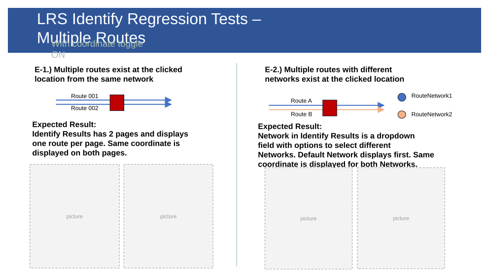

### Slide 10 — LRS Identify Regression Tests – Multiple Routes <!-- slide 10 -->

E-3.) Multiple routes with different networks exist at the clicked location, but one network is turned off in the configuration
E-4.) Multiple routes with different networks exist at the clicked location, but one network is turned off in the map
Expected Result:
Identify Results displays the route belonging to the Network that is turned on. Network dropdown menu does not display the Network that is turned off. Coordinate is displayed.

RouteNetwork2 (turned off)
Expected Result:
Identify Results displays the route belonging to the Network that is turned on. Network dropdown menu does not display the Network that is turned off. Coordinate is displayed.

With coordinate toggle ON

RouteNetwork2 (turned off)

[figure: Route A · Route B · RouteNetwork1]

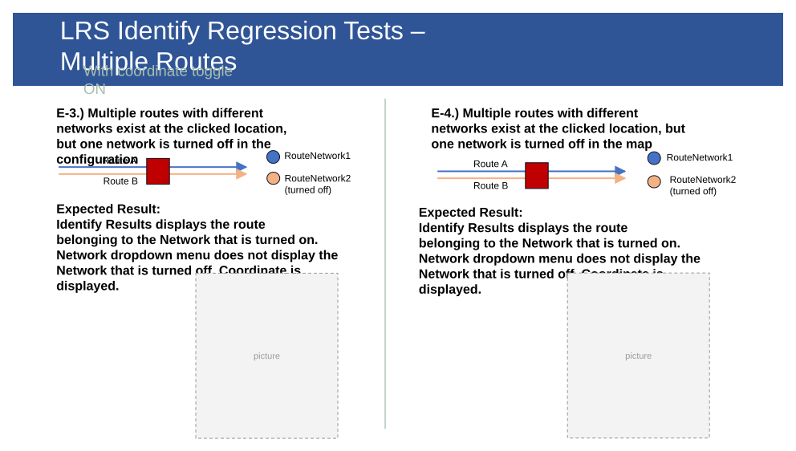

### Slide 11 — LRS Identify Regression Tests – Multiple Routes <!-- slide 11 -->

E-5.) Click a location where two routes intersect
E-6.) Click a location where the end of one route meets the start of another route
Expected Result:
Identify Results has 2 pages and displays one route per page. Same coordinate is displayed on both pages.

Expected Result:
Identify Results has 2 pages and displays one route per page. Same coordinate is displayed on both pages.

With coordinate toggle ON

[figure: Route 001 · Route 002]

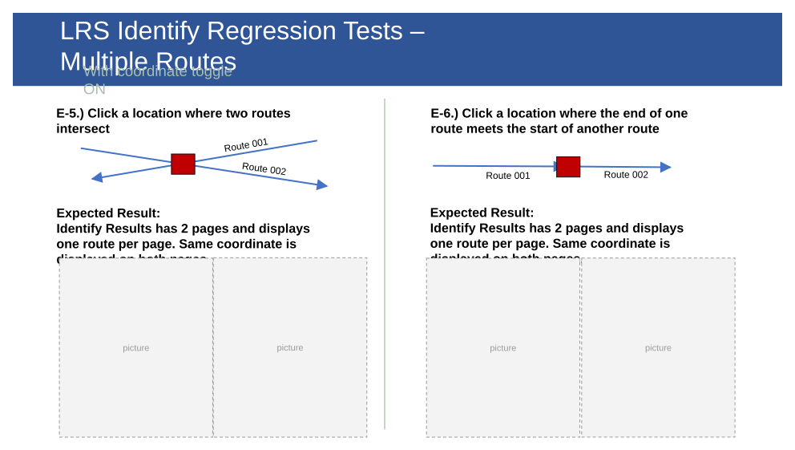

### Slide 12 — LRS Identify Regression Tests – Self-Intersecting Routes <!-- slide 12 -->

E-7.) Click the location where a lollipop route self-intersects
E-8.) Click the location where a branch route self-intersects
Route 001
Expected Result:
Identify Results displays route and both measures. Coordinate is displayed.

Expected Result:
Identify Results displays route and both measures. Coordinate is displayed.

With coordinate toggle ON
Route 001

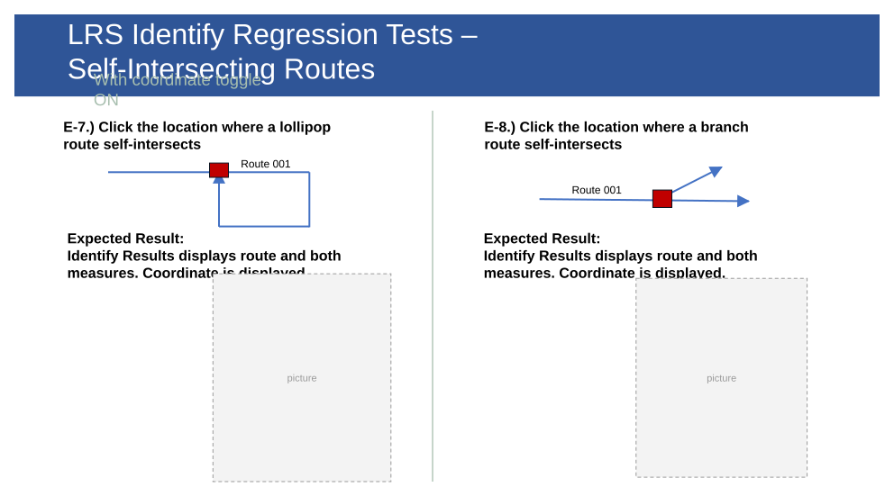

### Slide 13 — LRS Identify Regression Tests – Self-Intersecting Routes <!-- slide 13 -->

E-9.) Click the location where a loop route self-intersects
E-10.) Click the location where an infinity route self-intersects
Route 001
Expected Result:
Identify Results displays route and both measures. Coordinate is displayed.

Expected Result:
Identify Results displays route and three measures. Coordinate is displayed.

With coordinate toggle ON
Route 001

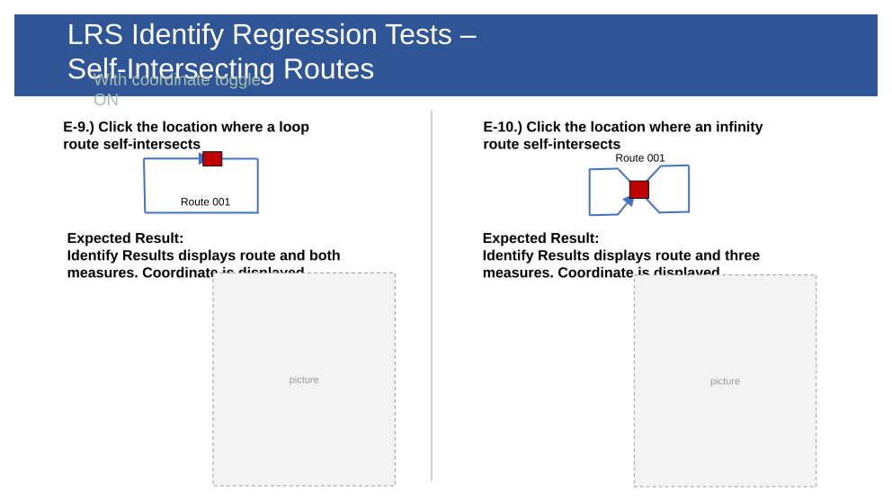

### Notes

Add test for another route at the clicked location

### Slide 14 — LRS Identify Regression Tests – Self-Intersecting Routes <!-- slide 14 -->

E-11.) Click the location where a route intersects a loop route. The clicked location is where the loop route self-intersects
Route 001
Expected Result:
Identify Results has 2 pages and displays one route per page. Same coordinate is displayed on both pages.

With coordinate toggle ON

Route 002

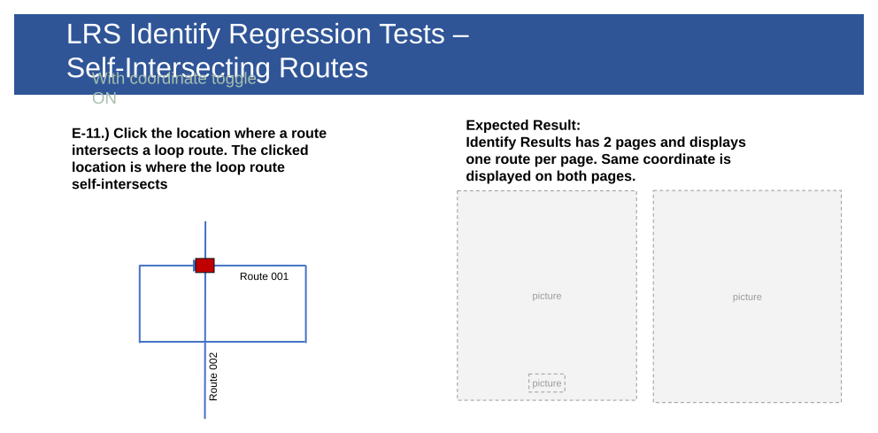

### Notes

Add test for another route at the clicked location

### Slide 15 — LRS Identify Regression Tests – Multiple Route Time-slices <!-- slide 15 -->

E-12.) Multiple time-slices exist at the clicked location
E-13.) Multiple time-slices of the route exist, but they do not all exist at the clicked location
Expected Result:
Identify Results displays all time-slices in the date field dropdown. Same coordinate is displayed for all time-slices.

Expected Result:
Identify Results displays all time-slices in the date field dropdown that exist at the clicked location. Same coordinate is displayed for all time-slices.

With coordinate toggle ON

[figure: Route 001 · 1/1/2000 – 1/1/2020 · Route 1 · RouteNetwork1 · 1/1/2020 - Null · 1/1/2020 – 1/1/2025 · 1/1/2025 – Null · 0 · 10 · 7]

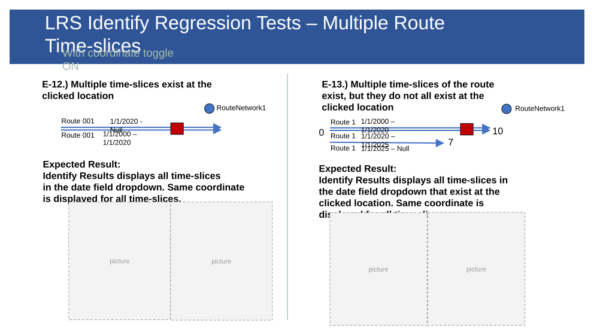

### Slide 16 — LRS Identify Regression Tests <!-- slide 16 -->

E-14.) Network is configured to not show extra business fields
Expected Result:
Identify Results displays all route attributes except business fields that are configured to be hidden. Coordinate is displayed.
With coordinate toggle ON
RouteNetwork1

Route 001

| Network | RouteID | Route Name | From Date | To Date | Status | Updated Date |
| --- | --- | --- | --- | --- | --- | --- |
| RouteNetwork1 | 001 | Route 001 | 1/1/2000 | Null | Active | 4/1/2020 |

Fields configured to be hidden
E-15.) No routes exist at the clicked location
RouteNetwork1

Expected Result:
Identify Results not returned. Identify stays enabled so user does not have to select Identify again before their next click.

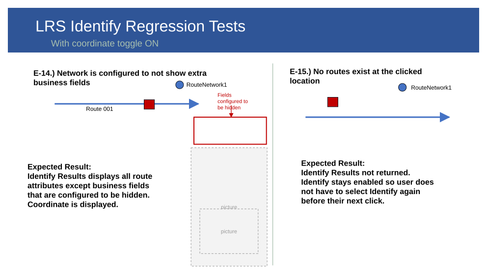

### Slide 17 — LRS Identify Regression Tests – Multiple Events <!-- slide 17 -->

E-16.) Multiple line and point events exist at the clicked location
Expected Result:
Identify Results displays all events and their attributes present at the clicked location. Coordinate is displayed.
With coordinate toggle ON + Point and Line Attribute Sets toggle ON

| Network | RouteID | Route Name | From Date | To Date |
| --- | --- | --- | --- | --- |
| RouteNetwork1 | 001 | Route 001 | 1/1/2000 | Null |

| Event | RouteID | Route Name | From Date | To Date | From Meas | To Meas | Attribute1 |
| --- | --- | --- | --- | --- | --- | --- | --- |
| LineEvent_1 | 001 | Route 001 | 1/1/2000 | Null | 0 | 8 | Open |
| LineEvent_2 | 001 | Route 001 | 1/1/2000 | Null | 0 | 8 | Good |
| PointEvent_1 | 001 | Route 001 | 1/1/2000 | Null | 6 | Null | 2 |

[figure: RouteNetwork1 · Route 001 · 10 · 0 · LineEvent_1 · LineEvent_2 · PointEvent_1 · click]

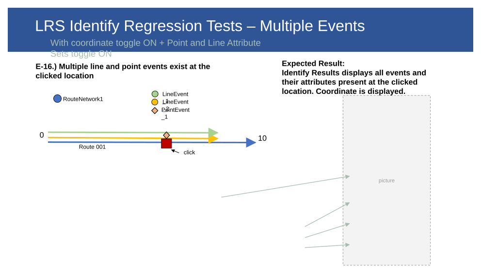

### Slide 18 — LRS Identify Regression Tests – Multiple Events <!-- slide 18 -->

E-17.) Multiple overlapping line events within the same event layer exist at the clicked location
Expected Result:
Identify Results displays route and all events present at the clicked location. Coordinate is displayed.
With coordinate toggle ON + Point and Line Attribute Sets toggle ON

| Network | RouteID | Route Name | From Date | To Date |
| --- | --- | --- | --- | --- |
| RouteNetwork1 | 001 | Route 001 | 1/1/2000 | Null |

| Event | RouteID | Route Name | From Date | To Date | From Meas | To Meas | Attribute1 |
| --- | --- | --- | --- | --- | --- | --- | --- |
| LineEvent_1 | 001 | Route 001 | 1/1/2000 | Null | 1 | 7 | Open |
| LineEvent_1 | 001 | Route 001 | 1/1/2000 | Null | 3 | 10 | Shut |
| LineEvent_1 | 001 | Route 001 | 1/1/2000 | Null | 0 | 4 | Open |

Time-slice does not exist at clicked location

[figure: RouteNetwork1 · Route 001 · 10 · 0 · LineEvent_1 · click]

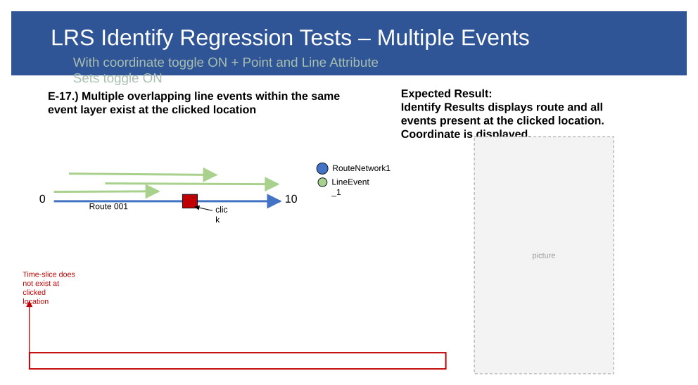

### Slide 19 — LRS Identify Regression Tests – Multiple Events <!-- slide 19 -->

E-18.) The clicked location is where the start of one event and the end of another event meet (same event layer)
Expected Result:
Identify Results displays route and all events that exist at the clicked measure. Coordinate is displayed.
With coordinate toggle ON + Point and Line Attribute Sets toggle ON

| Network | RouteID | Route Name | From Date | To Date |
| --- | --- | --- | --- | --- |
| RouteNetwork1 | 001 | Route 001 | 1/1/2000 | Null |

| Event | RouteID | Route Name | From Date | To Date | From Meas | To Meas | Attribute1 |
| --- | --- | --- | --- | --- | --- | --- | --- |
| LineEvent_1 | 001 | Route 001 | 1/1/2000 | Null | 0 | 4 | Open |
| LineEvent_1 | 001 | Route 001 | 1/1/2000 | Null | 4 | 10 | Shut |

[figure: RouteNetwork1 · Route 001 · 10 · 0 · LineEvent_1 · click]

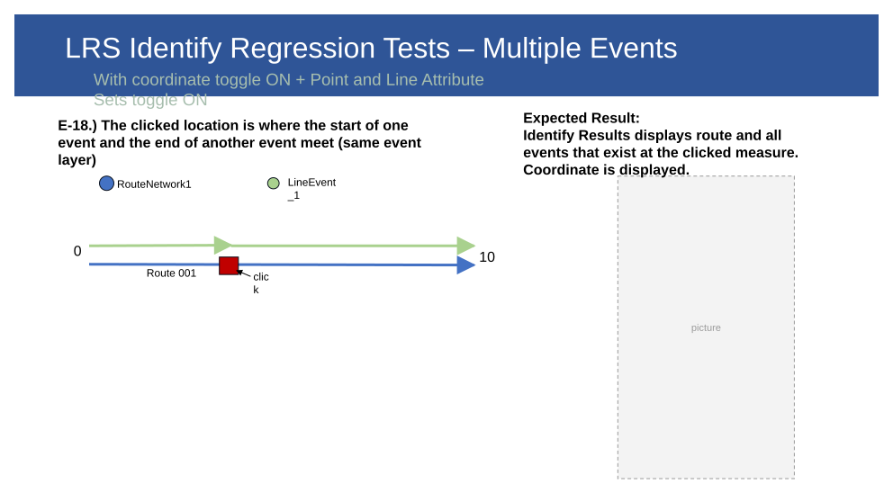

### Slide 20 — LRS Identify Regression Tests – Multiple Events <!-- slide 20 -->

E-19.) Multiple events exist at the clicked location, but some events are turned off in map
Expected Result:
Identify Results displays route and events. Only events that exist at the clicked location and turned on in the map are shown. Coordinate is displayed.
With coordinate toggle ON + Point and Line Attribute Sets toggle ON

| Network | RouteID | Route Name | From Date | To Date |
| --- | --- | --- | --- | --- |
| RouteNetwork1 | 001 | Route 001 | 1/1/2000 | Null |

| Event | RouteID | Route Name | From Date | To Date | From Meas | To Meas | Attribute1 |
| --- | --- | --- | --- | --- | --- | --- | --- |
| LineEvent_1 | 001 | Route 001 | 1/1/2000 | Null | 0 | 10 | Open |
| LineEvent_2 | 001 | Route 001 | 1/1/2000 | Null | 0 | 10 | Poor |
| LineEvent_3 | 001 | Route 001 | 1/1/2000 | Null | 2 | 10 | 49 |
| PointEvent_A | 001 | Route 001 | 1/1/2000 | Null | 8 | Null | Active |

PointEvent_A (turned off)

[figure: RouteNetwork1 · LineEvent_1 · LineEvent_2 · Route 001 · click · 0 · 10 · LineEvent_3 (turned off) · Layers turned off]

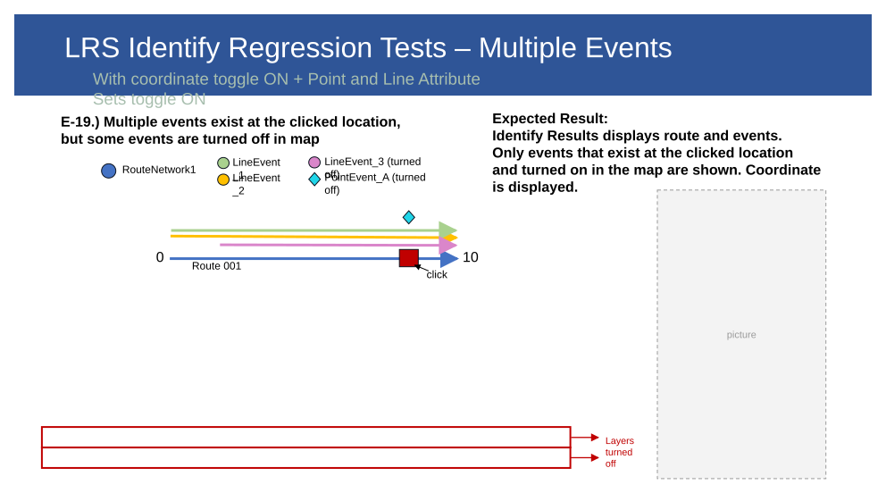

### Slide 21 — LRS Identify Regression Tests – Attribute Sets <!-- slide 21 -->

E-20.) Multiple events exist at the clicked location, but all events are not present in the configured attribute set
Expected Result:
Identify Results displays route and events. Only events that exist at the clicked location and are present in the configured attribute set are shown. Coordinate is displayed.
With coordinate toggle ON + Point and Line Attribute Sets toggle ON

| Network | RouteID | Route Name | From Date | To Date |
| --- | --- | --- | --- | --- |
| RouteNetwork1 | 001 | Route 001 | 1/1/2000 | Null |

| Event | RouteID | Route Name | From Date | To Date | From Meas | To Meas | Attribute1 |
| --- | --- | --- | --- | --- | --- | --- | --- |
| LineEvent_1 | 001 | Route 001 | 1/1/2000 | Null | 0 | 10 | Open |
| LineEvent_2 | 001 | Route 001 | 1/1/2000 | Null | 0 | 10 | Poor |
| LineEvent_3 | 001 | Route 001 | 1/1/2000 | Null | 2 | 10 | 49 |
| LineEvent_4 | 001 | Route 01 | 1/1/2000 | Null | 0 | 5 |  |
| PointEvent_A | 001 | Route 001 | 1/1/2000 | Null | 8 | Null | Active |
| PointEvent_B | 001 | Route 001 | 1/1/2000 | Null | 2 | Null |  |

Configured Attribute Sets:

Line Events:
LineEvent_1
LineEvent_3
LineEvent_4

Point Events:
PointEvent_A
PointEvent_B

Does not exist at clicked location
Not in Attribute Set

[figure: RouteNetwork1 · LineEvent_1 · LineEvent_2 · Route 001 · click · 0 · 10 · LineEvent_3 · PointEvent_A · LineEvent_4 · PointEvent_B]

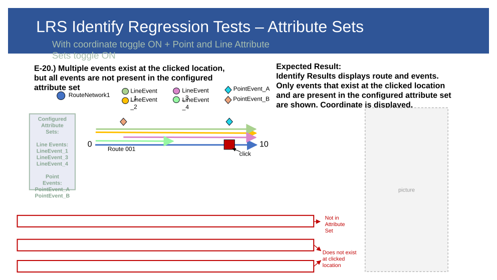

### Slide 22 — LRS Identify Regression Tests – Spanning Events <!-- slide 22 -->

E-21.) The clicked location is where a spanning event exists
Expected Result:
Identify Results displays route and all events that exist at the clicked measure. Coordinate is displayed.
With coordinate toggle ON + Point and Line Attribute Sets toggle ON

| Network | LineID | RouteID | Route Name | From Date | To Date |
| --- | --- | --- | --- | --- | --- |
| RouteNetwork1 | Line A | 001 | Route 001 | 1/1/2000 | Null |
| RouteNetwork1 | Line A | 002 | Route 002 | 1/1/2000 | Null |

| Event | FromRouteID | From Route Name | To Route ID | To Route Name | From Date | To Date | From Meas | To Meas | Attribute1 |
| --- | --- | --- | --- | --- | --- | --- | --- | --- | --- |
| LineEvent_1 | 001 | Route 001 | 002 | Route 002 | 1/1/2000 | Null | 3 | 6 | Open |
| LineEvent_2 | 001 | Route 001 | 002 | Route 002 | 1/1/2000 | Null | 0 | 6 | Poor |

Route does not exist at clicked location

[figure: RouteNetwork1 · Route 001 · 10 · 0 · LineEvent_1 · click · 5 · Route 002 · LineEvent_2]

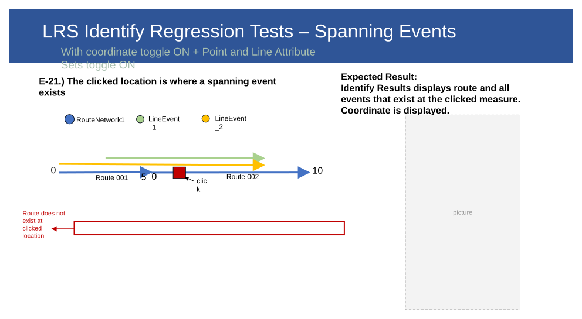

### Slide 23 — LRS Identify Regression Tests – Multiple Event Time-slices <!-- slide 23 -->

E-22.) Multiple line events exist with multiple time-slices at the clicked location. Route has one time-slice.
Expected Result:
Identify Results displays all route and events present at the clicked location. Only time-slices that exist at clicked location are shown. Coordinate is displayed.
With coordinate toggle ON + Point and Line Attribute Sets toggle ON

| Network | RouteID | Route Name | From Date | To Date |
| --- | --- | --- | --- | --- |
| RouteNetwork1 | 001 | Route 001 | 1/1/2000 | Null |

| Event | RouteID | Route Name | From Date | To Date | From Meas | To Meas | Attribute1 |
| --- | --- | --- | --- | --- | --- | --- | --- |
| LineEvent_1 | 001 | Route 001 | 1/1/2000 | 1/1/2010 | 0 | 5 | Open |
| LineEvent_1 | 001 | Route 001 | 1/1/2010 | Null | 0 | 10 | Shut |
| LineEvent_2 | 001 | Route 001 | 1/1/2000 | 1/1/2010 | 0 | 10 | Good |
| LineEvent_2 | 001 | Route 001 | 1/1/2010 | Null | 0 | 10 | Poor |

Events: 1/1/2000 – 1/1/2010
Events: 1/1/2010 – Null

Time-slice does not exist at clicked location

[figure: RouteNetwork1 · Route 001 · 10 · 0 · LineEvent_1 · LineEvent_2 · click]

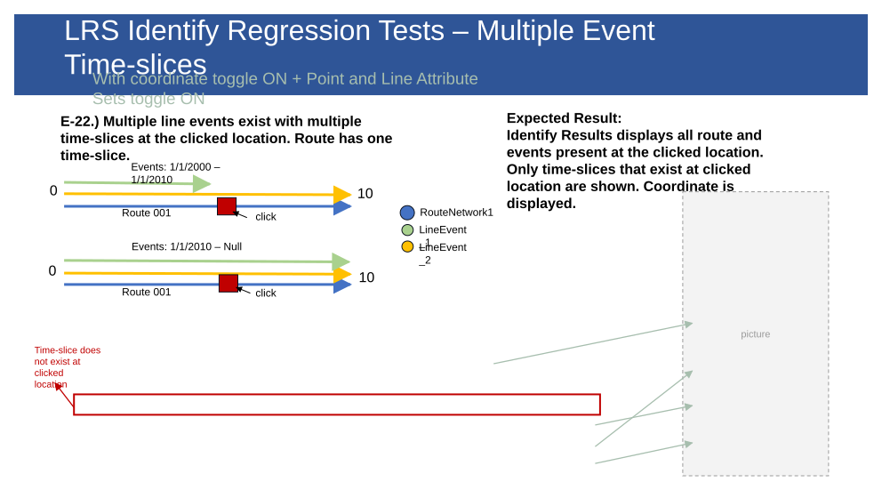

### Slide 24 — LRS Identify Regression Tests – Multiple Event Time-slices <!-- slide 24 -->

E-23.) Multiple time-slices of the route and events exist
Expected Result:
Identify Results displays all route and event time-slices that exist at clicked location. Events are filtered by the route time-slice. Same coordinate is displayed for all time-slices.
With coordinate toggle ON + Point and Line Attribute Sets toggle ON

| Network | RouteID | Route Name | From Date | To Date |
| --- | --- | --- | --- | --- |
| RouteNetwork1 | 001 | Route 001 | 1/1/2000 | 1/1/2010 |
| RouteNetwork1 | 001 | Route 001 | 1/1/2010 | Null |

| Event | RouteID | Route Name | From Date | To Date | From Meas | To Meas | Attribute1 |
| --- | --- | --- | --- | --- | --- | --- | --- |
| LineEvent_1 | 001 | Route 001 | 1/1/2000 | 1/1/2010 | 0 | 10 | Open |
| LineEvent_1 | 001 | Route 001 | 1/1/2010 | Null | 0 | 10 | Shut |
| LineEvent_2 | 001 | Route 001 | 1/1/2000 | 1/1/2010 | 0 | 10 | Good |
| LineEvent_2 | 001 | Route 001 | 1/1/2010 | Null | 0 | 10 | Poor |

Route: 1/1/2000 – 1/1/2010
Route: 1/1/2010 – Null

[figure: RouteNetwork1 · Route 001 · 10 · 0 · LineEvent_1 · LineEvent_2 · click]

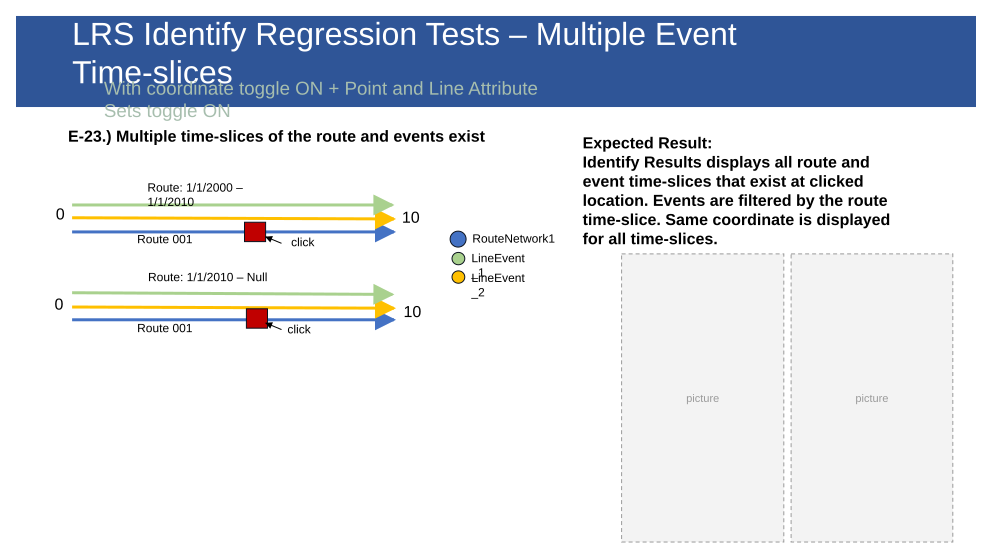

### Slide 25 — LRS Identify Regression Tests – Date Filter <!-- slide 25 -->

E-24.) Date Filter widget is added to ExB and set to a single date.
Expected Result:
Identify Results displays all route and event time-slices that exist on the filtered date and clicked location. Same coordinate is displayed for all time-slices.
With coordinate toggle ON + Point and Line Attribute Sets toggle ON

| Network | RouteID | Route Name | From Date | To Date |
| --- | --- | --- | --- | --- |
| RouteNetwork1 | 001 | Route 001 | 1/1/2000 | 1/1/2010 |
| RouteNetwork1 | 001 | Route 001 | 1/1/2010 | Null |

| Event | RouteID | Route Name | From Date | To Date | From Meas | To Meas | Attribute1 |
| --- | --- | --- | --- | --- | --- | --- | --- |
| LineEvent_1 | 001 | Route 001 | 1/1/2000 | 1/1/2010 | 0 | 4 | Open |
| LineEvent_1 | 001 | Route 001 | 1/1/2010 | Null | 0 | 10 | Shut |
| LineEvent_2 | 001 | Route 001 | 1/1/2000 | 1/1/2010 | 0 | 10 | Good |
| LineEvent_2 | 001 | Route 001 | 1/1/2010 | Null | 0 | 10 | Poor |

Route: 1/1/2000 – 1/1/2010
Route: 1/1/2010 – Null

Date Filter:
8/1/2009

Time-slice does not exist on filtered date

[figure: RouteNetwork1 · Route 001 · 10 · 0 · LineEvent_1 · LineEvent_2 · click]

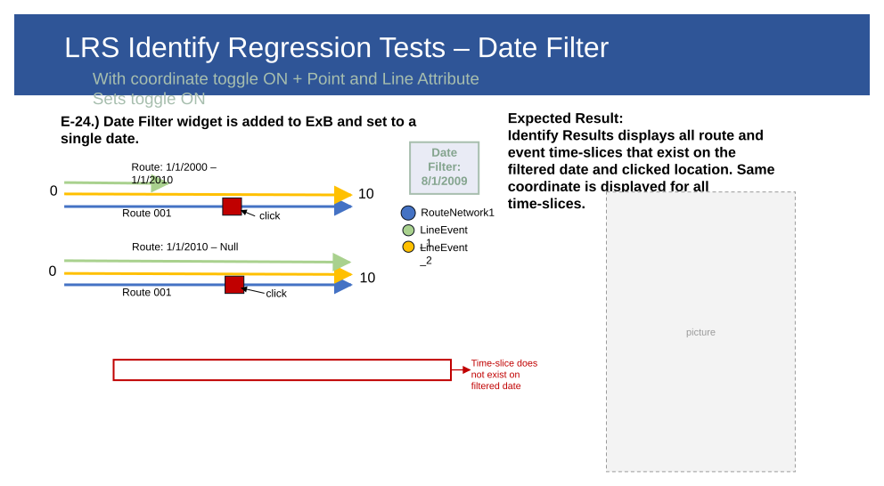

### Slide 26 — LRS Identify Regression Tests – Date Filter <!-- slide 26 -->

E-25.) Date Filter widget is added to ExB and set to a date range.
Expected Result:
Identify Results displays all route and event time-slices that exist within the filtered date range and at the clicked location. Same coordinate is displayed for all time-slices.
With coordinate toggle ON + Point and Line Attribute Sets toggle ON

| Network | RouteID | Route Name | From Date | To Date |
| --- | --- | --- | --- | --- |
| RouteNetwork1 | 001 | Route 001 | 1/1/2000 | 1/1/2010 |
| RouteNetwork1 | 001 | Route 001 | 1/1/2010 | 1/1/2020 |
| RouteNetwork1 | 001 | Route 001 | 1/1/2020 | Null |

| Event | RouteID | Route Name | From Date | To Date | From Meas | To Meas | Attribute1 |
| --- | --- | --- | --- | --- | --- | --- | --- |
| LineEvent_1 | 001 | Route 001 | 1/1/2000 | 1/1/2010 | 0 | 4 | Shut |
| LineEvent_1 | 001 | Route 001 | 1/1/2010 | 1/1/2020 | 0 | 4 | Shut |
| LineEvent_1 | 001 | Route 001 | 1/1/2020 | Null | 0 | 10 | Open |
| LineEvent_2 | 001 | Route 001 | 1/1/2000 | 1/1/2010 | 0 | 10 | Good |
| LineEvent_2 | 001 | Route 001 | 1/1/2010 | 1/1/2020 | 0 | 10 | Poor |
| LineEvent_2 | 001 | Route 001 | 1/1/2020 | Null | 0 | 10 | Poor |

Route 001: 1/1/2000 – 1/1/2010
Route 001: 1/1/2020 – Null
Date Filter:
8/1/2019 – 8/1/2022
Route 001: 1/1/2010 – 1/1/2020

Time-slice does not exist within filtered date range

[figure: RouteNetwork1 · 10 · 0 · LineEvent_1 · LineEvent_2]

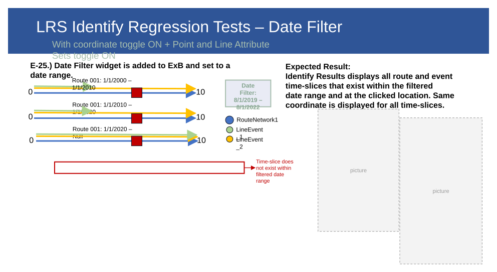

### Slide 27 — LRS Identify Regression Tests <!-- slide 27 -->

Repeat all regression tests with coordinate toggle OFF

### Slide 28 — LRS Identify Regression Tests <!-- slide 28 -->

Repeat all regression tests with coordinate toggle OFF

### Slide 29 — LRS Identify Regression Tests <!-- slide 29 -->

Repeat all regression tests with coordinate toggle OFF

### Slide 30 — LRS Identify Regression Tests – Data Actions <!-- slide 30 -->

With LRS Identify, Add Point Event, Add Line Event, Dynamic Segmentation, and Table widget added to ExB
