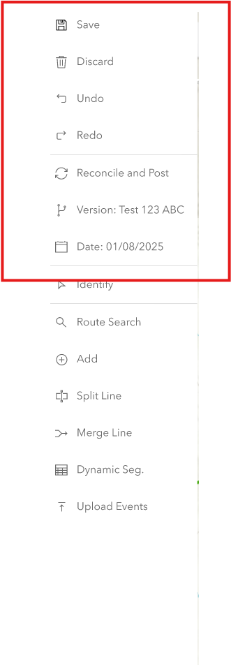
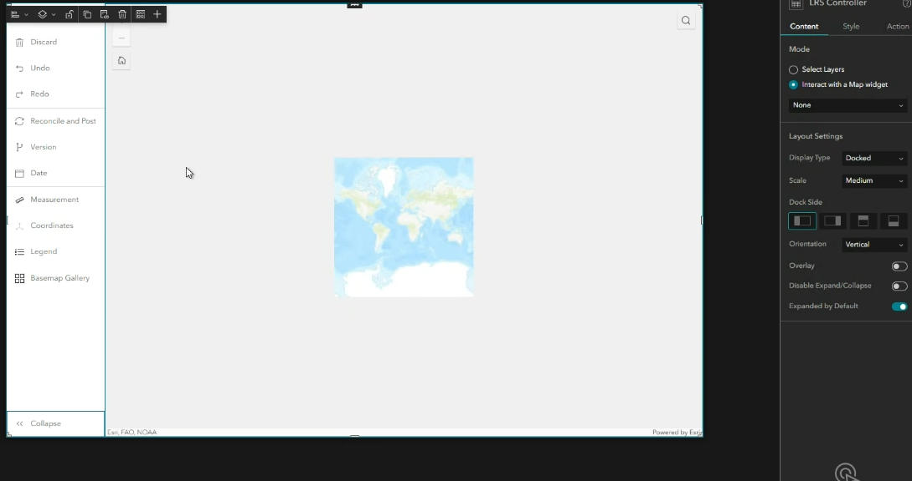
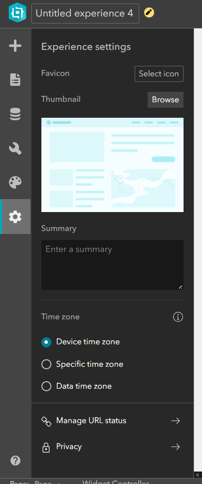
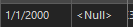
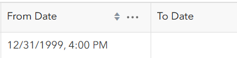

# Advanced Versioning Capabilities in LRS Configuration Widget

| Field | Value |
| --- | --- |
| **Doc** | 157 · Test Plan · Experience Builder |
| **Product** | Roads & Highways · Pipeline Referencing · Utility Network |
| **Release** | — |
| **Issues** | [Beijing-R-D-Center/ExperienceBuilder-Web-Extensions#26708](https://devtopia.esri.com/Beijing-R-D-Center/ExperienceBuilder-Web-Extensions/issues/26708) |
| **Source** | [AdvancedVersioningCapabilities_LRSConfigurationWidget_Testplan 1.pptx](<https://esriis.sharepoint.com/sites/LocationReferencing/Shared%20Documents/General/Test%20Plans/AdvancedVersioningCapabilities_LRSConfigurationWidget_Testplan%201.pptx>) |
| **People** | author Mac Christmas · PE — · dev — |
| **Edited** | 2025-06-12 18:48 by Rahul Rakshit |
| **Extracted** | 2026-09-04 · lane xmlstrip · format 3.0 · prompt v2.0.2 |
| **Keywords** | versioning · configuration widget · editing session · undo redo · reconcile · post · conflict prevention · event editing |
| **Tools** | LRS Configuration Widget · Branch Version Widget · Add Point Event Widget · Add Line Event Widget · Dynseg Widget · Search Widget · Identify Widget |

## Summary

Test plan for advanced versioning features added to the LRS Configuration Widget in Experience Builder. Covers configuration options, editing sessions with save/discard and undo/redo, reconcile and post operations, and behavior with different data types and versions. Includes positive and negative test cases verifying functionality, conflict prevention, version matching, and UI behavior.

## Related documents

<!-- related:begin -->
- [Experience Builder Time and Versioning widget](<https://esriis.sharepoint.com/sites/lrsworkspace/LRS%20Doc%20Index/User%20Stories/exb-time-and-versioning-widget.md>) — similar text 0.40 · 2 title words · 2 filename words · same surface <!-- rel:167 s=6.579 -->
- [Experience Builder Branch Versioning widget](<https://esriis.sharepoint.com/sites/lrsworkspace/LRS Doc Index/User Stories/exb-branch-versioning-widget.md>) — similar text 0.41 · 2 title words · 2 filename words · same surface <!-- rel:101 s=6.194 -->
- [Experience Builder Versioning Test Plan](<https://esriis.sharepoint.com/sites/lrsworkspace/LRS Doc Index/Test Plans/exb-versioning.md>) — similar text 0.34 · 1 title word · 1 filename word · same kind/surface/folder <!-- rel:73 s=4.687 -->
- [Branch Version Editing widget](<https://esriis.sharepoint.com/sites/lrsworkspace/LRS Doc Index/Other/29868-branch-version-editing-widget.md>) — similar text 0.34 · 1 title word · 1 filename word · same surface <!-- rel:61 s=4.076 -->
- [Data Action Support for Add Line Event Widget – Test Plan](<https://esriis.sharepoint.com/sites/lrsworkspace/LRS Doc Index/Test Plans/17675-data-action-support-for-add-line-event-widget.md>) — similar text 0.19 · 1 title word · 1 filename word · same kind/surface/folder <!-- rel:431 s=3.701 -->
<!-- related:end -->

<!-- docs:begin -->
## Esri documentation

[Conflict prevention](https://doc.esri.com/en/arcgis-pro/latest/help/production/roads-highways/conflict-prevention.html) · [Event editing using the attribute table](https://doc.esri.com/en/arcgis-pro/latest/help/production/roads-highways/event-editing-using-the-attribute-table.html)

_No page matched:_ [LRS Configuration Widget](https://www.google.com/search?q=%22LRS%20Configuration%20Widget%22+site%3Adoc.esri.com) · [Branch Version Widget](https://www.google.com/search?q=%22Branch%20Version%20Widget%22+site%3Adoc.esri.com) · [Add Point Event Widget](https://www.google.com/search?q=%22Add%20Point%20Event%20Widget%22+site%3Adoc.esri.com) · [Add Line Event Widget](https://www.google.com/search?q=%22Add%20Line%20Event%20Widget%22+site%3Adoc.esri.com) · [Dynseg Widget](https://www.google.com/search?q=%22Dynseg%20Widget%22+site%3Adoc.esri.com) · [Search Widget](https://www.google.com/search?q=%22Search%20Widget%22+site%3Adoc.esri.com) · [Identify Widget](https://www.google.com/search?q=%22Identify%20Widget%22+site%3Adoc.esri.com)
<!-- docs:end -->

---

## Test Cases

### TC-U01 — Verification - Configuration <!-- src: S5 · slide 1 · label Verification - Configuration -->

**Steps:**
1. Verify , in the LRS configuration widget the options save , discard , undo , redo , reconcile , post , current version and date are available
2. Verify the config options for these capabilities
3. Enable/Disable for reconcile /post , save /discard , undo/redo. By default, all are enabled
4. Verify that if undo/redo is enabled then save/discard also enabled and vice versa
5. Verify that the configuration widget can be configured horizontally or vertically
6. Verify all widgets can be added to this configuration widgets (query or table widget can be added and not the layout items like grid etc.)
7. Verify the widget supports a full or floating configuration
8. Verify the version shown in the widget matches with branch version widget.
9. Verify express mode is supported for the advanced editing capabilities.

### TC-U02 — Verification – Configuration cntd <!-- src: S5 · slide 2 · label Verification – Configuration cntd -->

**Steps:**
1. Verify the config options for the widget. The widget can be docked at any side, or it can be floating. The content size is customizable. The widget can be added by drag and drop or by right click and clicking +.
2. Verify if the widget is floating still, it can be docked as needed
3. Verify when an LRS widget is added, it appears as slide outs from configuration when in full mode.
4. Verify for other widgets added the user can configure (those widgets will be floating by default)

### TC-N01 — Input offset value does not fall on route <!-- src: S4 · slide 4 · Negative Tests · 1 -->

### TC-N02 — Input offset feature does not belong to the same route as the chosen route <!-- src: S4 · slide 4 · Negative Tests · 2 -->

### TC-N03 — Input invalid date range <!-- src: S4 · slide 4 · Negative Tests · 3 -->

### TC-N04 — Input invalid RouteID/RouteName <!-- src: S4 · slide 4 · Negative Tests · 4 -->

### TC-N05 — Input invalid feature identifier <!-- src: S4 · slide 4 · Negative Tests · 5 -->

### TC-N06 — Input invalid offset <!-- src: S4 · slide 4 · Negative Tests · 6 -->

### TC-N07 — Input calibration point associated with other LRS Network as the offset feature. <!-- src: S4 · slide 4 · Negative Tests · 7 -->

- **Case:** Input calibration point associated with other LRS Network as the offset feature. Show error that calibration point feature must belong to input route/network

## Other content

### Slide 1 — Devtopia Issue <!-- slide 1 -->

ExB – Advanced Versioning Capabilities in LRS Configuration Widget

**Notes**
- Add Advanced configuration capabilities to the LRS Configuration Widget
- When in a version other than default, allow the user to have an editing session with save/discard and undo/redo (make the undo/redo stack the last 5 edits) and reconcile and post (these settings can only be applied to LRS widgets in the app)
- Test with RH data , APR data ,UN data , Addressing Data and PoM Data
- Test with all types of events (point, Nonspanning and spanning)
- Test with nonline (auto-generated, single-field, and multi-field RouteID configurations) and line networks
- Test with networks /events with RouteID vs. Route Name configured
- Test with projected and unprojected data
- Test in Chrome and Edge
- Test conflict prevention continues to work as expected (No lock acquired , lock acquired, and lock transferred)

### Slide 2 <!-- slide 2 -->

| Verification – Configuration cntd |
| --- |
| Verify the time zone configuration in the ExB settings does not affect the LRS data time. ( does this need to be tested? ) . |

### Slide 3 <!-- slide 3 -->

| Positive Tests: |  |  |
| --- | --- | --- |
| Test cases |  | Expected Results |
| 1 | Change the version in the branch version widget and make the changed one as active version. | The active version in the config widget should match with the branch version widget |
| 2 | Create a new event – Add Point Event widget | Save , discard , undo and redo need to be active |
| 8 | Create a new event – Add Line Event widget |  |
| 4 | Edit an already existing event – Split event |  |
| 5 | Edit an already existing event – Merge events |  |
| 6 | Edit an already existing event - Dynseg |  |
| 7 | Edit an already existing event – table |  |
| 8 | Check the date shown on the widget | It should default to today’s date |
| 9 | Identify or search a route and launch Dynseg | Date should match the date in the config widget |
| 10 | Change the date in the config widget | The data in the map, table widgets and Dynseg should reflect the chosen date. |
| 11 | Search for a route using search widget | Result should contain only the routes that are active on the chosen date in the config widget |
| 12 | Identify a route using identify widget | Results should contain only the routes and events active for the chosen date in the config widget |
| 13 | Launch Dynseg from search or identify | Results should contain only events active for the chosen date in the config widget |
| 14 | Change to a version, edit the LRS data using table widget and post it into the default | All the changes are posted to default |
| 15 | Create or edit all types of events – point , spanning and non spanning | All edits should be successful in a version and can be posted into default |
| 16 | Change to default version | Reconcile and post , save/ discard , undo/redo become inactive |
| 17 | Change to a version and do a reconcile | Should reconcile for any changes from the default |
| 18 | After making edits in a version, post it to default by using post | The edits made should be posted into default. |
| 19 | Make edits in the default version and change to a version and make edits and try to post | The widget should ask for reconciling since the default is changed, before posting. |

### Slide 4 <!-- slide 4 -->

| Positive Tests (continued) |  |  |
| --- | --- | --- |
| Test cases |  | Expected Results |
| 20 | In the config widget keep the date as 1/1/2000. Add events using add point event widget or add line event widget with From date as today’s date. | Created event should not show up in map widget or table widget or Dynseg widget |
| 21 | Make atleast five edits and check the undo/redo stack | The last 5 edits should be available in the undo /redo for reverting the changes |
| 22 | Enable conflict prevention in a dataset, access a version and try to create any event on a route | Conflict prevention message should show up stating the lock is acquired on a given route for the selected version. The version in the message should match the version shown in the config widget |
| 23 | Configure more than one webmap in the map widget and try to switch between the two. | Upon changing between the webmaps, configured version should be honored for each of the webmap along with the configured date. Do some sanity editing using LRS widgets to ensure the versions are honored in the respective webmaps. |
| 24 | Check the Time options in webmap and configure the webmap to show all the LRS data and make sure the LRS From Date and LRS To Date are same as shown in ArcGIS Pro. In the ExB, set the date to Today’ date and verify the LRS From Date and To Date for events. For example if it is shown in Pro as then in ExB it should not show | LRS from date and To date should be same as shown in Pro. |

| Negative Tests |  |  |
| --- | --- | --- |
| Test cases |  | Expected Results |
| 1 | Change to a locked version in Branch version widget and this becomes active in the config widget and try to edit | Edit should not go through, and proper error message should be displayed. |
| 2 | Enable conflict prevention in a dataset, lock a route in a version v1 using Pro. Access version V2 in ExB and try to edit any event in that route | Conflict prevention error message should show up that the route is locked in another version. |
| 3 | Login as a data viewer and try to edit | Proper error message should be displayed |

### Slide 5 <!-- slide 5 -->

| Documentation |
| --- |
| In the documentation , mention that the default time option available in the ExB should not be used for editing LRS data. |

Notes:

- Setting the time is the next user story
- Only layers that have time enabled get affected by the time widget: Test it
- Supports express mode
- Can’t add layouts
- Can’t add a map widget
- Can’t add a widget controller
- Dynseg time doesn’t get affected as of now: enhancement
- Test with the tools enabled and disabled
- VMS is disabled, therefore the versioning tools should be disabled
- Viewer template with only versioning and date
- Enhancement Request: Delete and Create versions can be configurable
- Enhancement: Group the save/discard and undo/redo stack. Both sets get enabled or disabled.
- Enhancement: Toast messages for Save, Discard, Create/delete/change versions/date change
- If the number of tools exceed the length/height of the pane, then a scroll shows up
