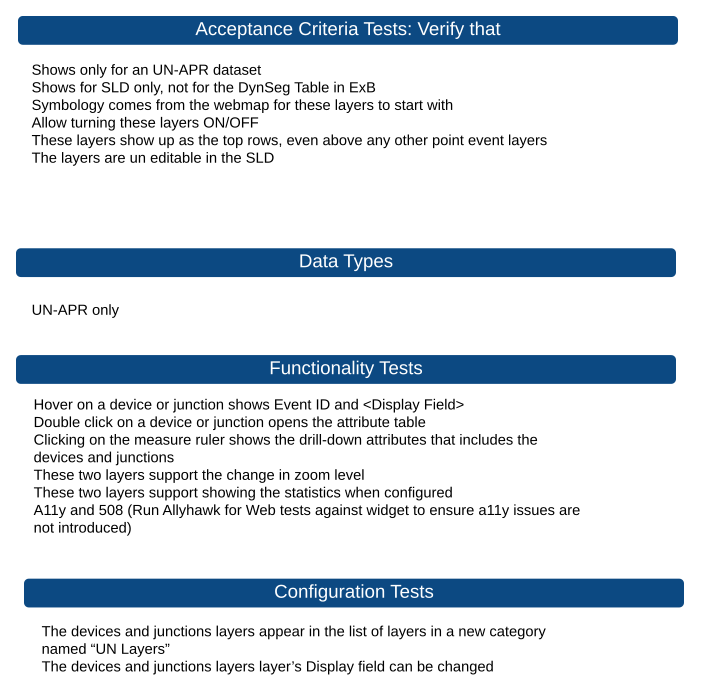

# SLD Devices and Junctions Test Plan

| Field | Value |
| --- | --- |
| **Doc** | 28 · Test Plan · Experience Builder |
| **Product** | Pipeline Referencing · Utility Network |
| **Release** | — |
| **Issues** | [Beijing-R-D-Center/ExperienceBuilder-Web-Extensions#29867](https://devtopia.esri.com/Beijing-R-D-Center/ExperienceBuilder-Web-Extensions/issues/29867) |
| **Source** | [29867_SLD_Devices_Junctions_TestPlan.pptx](<https://esriis.sharepoint.com/sites/LocationReferencing/Shared%20Documents/General/Test%20Plans/29867_SLD_Devices_Junctions_TestPlan.pptx>) |
| **People** | author Rahul Rakshit · PE — · dev — |
| **Edited** | 2026-05-20 16:43 by Rahul Rakshit |
| **Extracted** | 2026-09-04 · lane xmlstrip · format 3.0 · prompt v2.0.2 |
| **Keywords** | devices · junctions · straight line diagram · experience builder · un apr dataset · symbology · accessibility |
| **Tools** | — |

## Summary

Test plan for verifying the behavior and functionality of devices and junctions layers in the Straight Line Diagram (SLD) within Experience Builder. Covers acceptance criteria including visibility conditions, symbology, layer ordering, editability, interaction behaviors, zoom level support, statistics display, accessibility compliance, and layer categorization.

## Related documents

<!-- related:begin -->
- [Iteration Planning and Issue Tracking for Location Referencing 3.8/12.2](<https://esriis.sharepoint.com/sites/lrsworkspace/LRS Doc Index/Schedules/3040-iteration-planning-and-issue-tracking-for-lr-3-8-12-2.md>) — shared issue Beijing-R-D-Center/ExperienceBuilder-Web-Extensions#29867 · similar text 0.08 <!-- rel:2 s=1000.997 -->
- [Test Plan : Registering](<https://esriis.sharepoint.com/sites/lrsworkspace/LRS Doc Index/Test Plans/registering.md>) — similar text 0.41 · 2 filename words · same kind/folder <!-- rel:89 s=5.427 -->
- [SLD Support for Centerline in UN and ADM LRS Datasets Test Plan](<https://esriis.sharepoint.com/sites/lrsworkspace/LRS Doc Index/Test Plans/26161-sld-support-for-centerline-in-un-and-adm-lrs-datasets.md>) — similar text 0.16 · 1 title word · same kind/surface/folder <!-- rel:38 s=4.493 -->
- [SLD OI Widget Test Plan](<https://esriis.sharepoint.com/sites/lrsworkspace/LRS Doc Index/Test Plans/sld-oi-widget.md>) — similar text 0.14 · 1 title word · 1 filename word · same kind/surface/folder <!-- rel:63 s=4.142 -->
- [Test Plan: Include Intersections in SLD](<https://esriis.sharepoint.com/sites/lrsworkspace/LRS%20Doc%20Index/Test%20Plans/test-plan-include-intersections-in-sld__doc71.md>) — similar text 0.25 · 1 title word · 1 filename word · same kind/surface/folder <!-- rel:71 s=4.085 -->
<!-- related:end -->

<!-- docs:begin -->
## Esri documentation

_No page matched:_ [experience builder](https://www.google.com/search?q=%22experience%20builder%22+site%3Adoc.esri.com)
<!-- docs:end -->

---

## Slide 1

## Slide 2 — Acceptance Criteria Tests: Verify that

- Shows only for an UN-APR dataset
- Shows for SLD only, not for the DynSeg Table in ExB
- Symbology comes from the webmap for these layers to start with
- Allow turning these layers ON/OFF
- These layers show up as the top rows, even above any other point event layers
- The layers are un editable in the SLD
- Hover on a device or junction shows Event ID and <Display Field>
- Double click on a device or junction opens the attribute table
- Clicking on the measure ruler shows the drill-down attributes that includes the devices and junctions
- These two layers support the change in zoom level
- These two layers support showing the statistics when configured
- A11y and 508 (Run Allyhawk for Web tests against widget to ensure a11y issues are not introduced)
- The devices and junctions layers appear in the list of layers in a new category named “UN Layers”
- The devices and junctions layers layer’s Display field can be changed

[figure: Data Types · Functionality Tests · UN-APR only · Configuration Tests]

