# Append Routes consider existing centerlines – Test Plan

| Field | Value |
| --- | --- |
| **Doc** | 469 · Test Plan · Pro |
| **Product** | Roads & Highways · Pipeline Referencing · Utility Network |
| **Release** | — |
| **Issues** | [ArcGISPro/ps-location-referencing#5097](https://devtopia.esri.com/ArcGISPro/ps-location-referencing/issues/5097) · [ArcGISPro/ps-location-referencing#3004](https://devtopia.esri.com/ArcGISPro/ps-location-referencing/issues/3004) |
| **Source** | [AppendRtExtCL_testplan.pptx](<https://esriis.sharepoint.com/sites/LocationReferencing/Shared%20Documents/General/Test%20Plans/AppendRtExtCL_testplan.pptx>) |
| **People** | author Lakshmi Ananthanarayanan · PE Claire Wang · dev Dan |
| **Edited** | 2023-11-03 18:38 by Claire Wang |
| **Extracted** | 2026-09-04 · lane xmlstrip · format 3.0 · prompt v2.0.2 |
| **Keywords** | append routes · centerlines · route extension · route realignment · time slices · geometry match · negative cases · geoprocessing |
| **Tools** | Append Routes |

## Summary

Test plan for enhancing the Append Routes geoprocessing tool to consider existing centerline features when appending new or supplemental routes to a network. It includes test scenarios for positive and negative cases, automation updates, documentation changes, and verification steps to ensure correct association of routes with centerlines and proper tool behavior.

## Related documents

<!-- related:begin -->
- [Append Routes Consider Existing Centerlines](<https://esriis.sharepoint.com/sites/lrsworkspace/LRS Doc Index/User Stories/3004-append-routes-consider-existing-centerlines.md>) — shared issue ArcGISPro/ps-location-referencing#3004 · similar text 0.28 · 5 title words · 1 filename word · same surface <!-- rel:486 s=1004.552 -->
- [Append Routes: Load Routes by Route Name Test Plan](<https://esriis.sharepoint.com/sites/lrsworkspace/LRS Doc Index/Test Plans/4855-append-routes-load-routes-by-route-name.md>) — similar text 0.15 · 2 title words · 2 filename words · same kind/surface/folder <!-- rel:567 s=4.427 -->
- [Consider Route Dominance in Append Events (add method) – Test Plan](<https://esriis.sharepoint.com/sites/lrsworkspace/LRS Doc Index/Test Plans/1488-consider-route-dominance-in-append-events-add-method.md>) — similar text 0.20 · 2 title words · 2 filename words · same kind/surface/folder <!-- rel:279 s=3.934 -->
- [Append Routes with existing Utility Network centerlines](<https://esriis.sharepoint.com/sites/lrsworkspace/LRS Doc Index/User Stories/append-routes-with-existing-un-centerlines.md>) — similar text 0.23 · 4 title words · 1 filename word · same surface <!-- rel:741 s=3.704 -->
- [Generate a Route Log using the GLRSDP GP Tool – Test Plan](<https://esriis.sharepoint.com/sites/lrsworkspace/LRS Doc Index/Test Plans/6209-generate-a-route-log-using-the-glrsdp-gp.md>) — similar text 0.07 · 1 filename word · same kind/surface/folder <!-- rel:260 s=2.862 -->
<!-- related:end -->

<!-- docs:begin -->
## Esri documentation

[Event behavior for route extension](https://doc.esri.com/en/arcgis-pro/latest/help/production/roads-highways/event-behavior-for-route-extension.html) · [Realign routes](https://doc.esri.com/en/arcgis-pro/latest/help/production/roads-highways/realign-routes.html)

_No page matched:_ [Append Routes](https://www.google.com/search?q=%22Append%20Routes%22+site%3Adoc.esri.com)
<!-- docs:end -->

---

## Overview

### Slide 1 — Append Routes consider existing centerlines – Test Plan <!-- slide 1 -->

https://devtopia.esri.com/ArcGISPro/ps-location-referencing/issues/5097

PE: Claire Wang
Dev: Dan

### Slide 2 <!-- slide 2 -->

Data:

- Enhance the Append Routes GP tool to consider existing centerline features when appending in new/supplemental routes to a network
- Add an optional checkbox “Consider existing centerlines” in Append Routes tool UI
  - When checked, use the existing logic that was implemented for the UN centerline user story (https://devtopia.esri.com/ArcGISPro/ps-location-referencing/issues/3004):
    - Load the source routes into the network feature class like we do today
    - Perform any validations like we do today
    - Associate each newly appended route with existing centerline(s) by creating a centerline sequence record and CenterlineID GUID
    - Do this for each appended route
    - Note that multiple routes could share the same centerline (centerline sequence records would just need to reflect that)
  - When not checked, create new centerlines for routes just like what we do today
- Test with RH, APR (in GCS only), a few cases in PoM, and APRUN (UI verification + few cases. Automation will cover APRUN)
- Test in FS, EGDB, and FGDB

### Slide 3 <!-- slide 3 -->

Data:

- Test with continuous (multifield RID) and line network
- Test normal and complex shapes
- Test all 3 methods for the tool – Add, Replace by RID, and Retire by RID. For the last two, pick few positive cases and focus on negative cases.
- Test with the following centerline-route scenarios (not limited to)
  - Appended route has 1 centerline that is an exact geometry match
  - Appended route has more than one centerline that is an exact geometry match
  - Appended route has centerline(s) that match, but also requires at least 1 new centerline be added (should not load route and get message)
  - Appended route would cause a centerline to split (should not load route and get message)
  - Appended route has a partial geometry match with centerline (should not load route and get message)
  - Overlapping centerlines exist at appended route’s location (should not load route and get message)
- Test time slicing
- Test a few cases with centerlines in opposite direction of routes
- The time to run this tool after making this change should be <= the total time to run Append Routes & Remove Overlapping Centerlines before making this change on a similar set of centerlines and routes

### Slide 4 <!-- slide 4 -->

Automation

- Create a new python tests for these scenarios where the centerlines exist when the tool is run
- Update any existing tests for the tool that fail due to the new parameter/removal of UN check (they should not fail. If they fail, we want to look into why)
Documentation

- Add a usage note to the Append Routes GP tool mentioning this support
- Outline the various centerline scenarios and the requirements for one or more centerlines to match exactly with the route for the tool to execute correctly
- Remove/update any existing note concerning this support when the UN is present (make invisible but autocheck this box for UN)
- Update the APR-UN loading workflow section to mention the need to consider existing centerlines when running the Append Routes tool (make invisible but autocheck this box for UN)

### Slide 5 <!-- slide 5 -->

Verification

- Verify the optional checkbox is added in Append Routes tool UI
- Verify the checkbox is invisible but autochecked in the background in UN. *So having existing cls for routes to be appended is still mandatory in UN, but implemented a slightly different way.
- Verify for other LRS, default is unchecked.
- Verify centerline sequence record is created for each route-existing centerline pair
- Verify multiple routes can be appended using the same centerline
- Verify no overlapping centerline exists after appending all routes
- Verify the tool fails on designated cases (see negative cases page), and no route can be appended
- Verify error messages (Dev provides these)
- Verify additional information in txt output (listing each route that doesn’t match centerline(s)) (Dev designs format)
- Verify tool runs in model builder (e.g. run generate CP and generate route afterwards)
- Verify tool runs in Python
- i18n and 508 testing

## Test Cases

### TC-P01 — Appended normal route has 1 centerline that is an exact geometry match <!-- src: S4 · slide 6 · Positive cases · 1 -->

- Appended loop route has 1 centerline that is an exact geometry match
- Appended lollipop route has 1 centerline that is an exact geometry match
- Appended alpha route has 1 centerline that is an exact geometry match
- Appended vertical route has 1 centerline that is an exact geometry match
- Appended normal route has 1 centerline that is an exact geometry match, and route has 2 time slices due to Reassign – form a new route
- Appended loop route has 1 centerline that is an exact geometry match, and route has 2 time slices due to Reverse
- Appended 2 normal routes that are concurrent routes with same time slices share 1 centerline that is an exact geometry match
- Appended 2 normal routes that are concurrent routes with different but overlapping time slices share 1 centerline that is an exact geometry match
- Appended 2 alpha routes that are at the same geographic location but not overlapping in time share 1 centerline that is an exact geometry match
- Appended 2 vertical routes that are concurrent routes with different but overlapping time slices share 1 centerline that is an exact geometry match

### TC-P02 — Appended normal route has 3 centerlines that are an exact geometry match <!-- src: S4 · slide 7 · Positive cases · 1 -->

- Appended gapped route has 3 centerlines (2 gaps) that are an exact geometry match
  - For PoM, also test route-in-route scenario
- Appended loop route has 3 centerlines that are an exact geometry match
- Appended lollipop route has 3 centerlines that are an exact geometry match
- Appended branch route has 3 centerlines that are an exact geometry match
- Appended alpha route has 3 centerlines that are an exact geometry match
- Appended vertical route has 3 centerlines that are an exact geometry match
- Appended 1 normal and 1 gapped routes are a result of route extension, and the routes have 2 time slices on 3 centerlines that are an exact geometry match
- (APR only) Appended 2 normal routes are a result of route Reassign – transfer to another line, and the routes have 2 time slices on 3 centerlines that are an exact geometry match
- Appended 2 lollipop routes are a result of route realignment, and the routes have 2 time slices on 9 centerlines that are an exact geometry match

### TC-P03 — Appended 2 normal routes that are concurrent routes with different but <!-- src: S4 · slide 8 · Positive cases · 1 -->

- **Case:** Appended 2 normal routes that are concurrent routes with different but overlapping time slices share 3 centerlines that are an exact geometry match
- Appended 2 normal routes that are at the same geographic location but not overlapping in time share 2 of 3 centerlines that are an exact geometry match
- Appended 2 routes (1 branch, 1 normal) that are partially concurrent with different but overlapping time slices share 2 of 3 centerlines that are an exact geometry match
- Appended 2 routes (1 loop, 1 lollipop) that are partially concurrent with same time slices share 2 of 3 centerlines that are an exact geometry match
- Appended 2 vertical routes that are concurrent routes with same time slices share 3 centerlines that are an exact geometry match

### TC-N01 — Centerline is longer than route <!-- src: S4 · slide 22 · Negative cases · 1 -->

- Route is longer than centerline
- No centerline exists at route location
- Centerline(s) partially match with route
- Overlapping centerlines exist at route location – UN will fail – users will need to remove overlapping cl
- Centerline(s) match XY, but not Z
- APRGCS – existing centerline has fewer vertices than route
- APRGCS – existing centerline has more vertices than route

## Other content

### Slide 8 — Positive cases <!-- slide 8 -->

All cases above, except 20, are for RH
APRGCS candidates: 1 2 5 6 8 9 11 12 13 18 20 23 26
PoM candidates: 1 7 13 13a 19
UN candidates: 1 11
Replace & Retire candidates: 1 6 12 22
Sanity test candidates: all cases in this list. Very easy as source routes are exported as FCs.

### Slide 9 — Positive 1: Appended normal route has 1 centerline that is an exact geometry match <!-- slide 9 -->

| Centerline Sequence | RouteId | CenterlineId |
| --- | --- | --- |
|  | {Route1- | (Centr1- |

Positive 2: Appended loop route has 1 centerline that is an exact geometry match

| Centerline Sequence | RouteId | CenterlineId |
| --- | --- | --- |
|  | {Route2- | (Centr2- |

Positive 3: Appended lollipop route has 1 centerline that is an exact geometry match

| Centerline Sequence | RouteId | CenterlineId |
| --- | --- | --- |
|  | {Route3- | (Centr3- |

[figure: {Route1- · null · {Route2- · {Route3-]

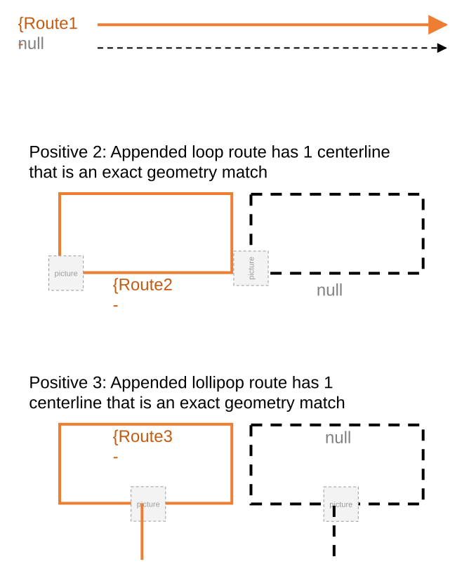

### Slide 10 — Positive 4: Appended alpha route has 1 centerline that is an exact geometry match <!-- slide 10 -->

| Centerline Sequence | RouteId | CenterlineId |
| --- | --- | --- |
|  | {Route4- | (Centr4- |

Positive 5: Appended vertical route has 1 centerline that is an exact geometry match

| Centerline Sequence | RouteId | CenterlineId |
| --- | --- | --- |
|  | {Route5- | (Centr5- |

[figure: {Route4- · null · {Route5-]

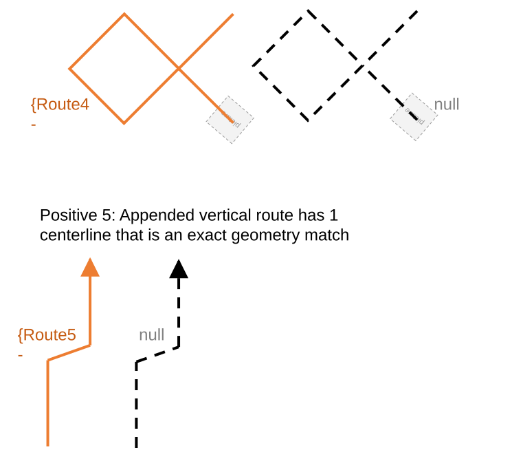

### Slide 11 — Positive 6: Appended normal route has 1 centerline that is an exact geometry match, and route has 2 time slices due to <!-- slide 11 -->

| Centerline Sequence | RouteId | CenterlineId | FromDate | ToDate |
| --- | --- | --- | --- | --- |
|  | {Route6- | (Centr6- | 1/1/2000 | 1/1/2020 |
|  | {Route6b- | (Centr6- | 1/1/2020 | null |

Positive 7: Appended loop route has 1 centerline that is an exact geometry match, and route has 2 time slices due to Reverse

| Centerline Sequence | RouteId | CenterlineId | FromDate | ToDate |
| --- | --- | --- | --- | --- |
|  | {Route7- | (Centr7- | 1/1/2000 | null |

[figure: {Route6- · null · 2000-2020 · {Route6b- · 2020-null · {Route7-]

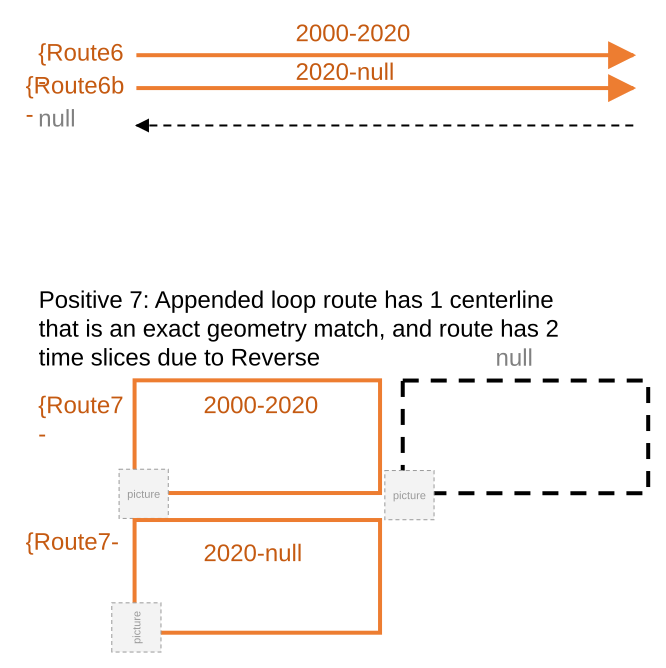

### Slide 12 — Positive 8: Appended 2 normal routes that are concurrent routes with same time slices share 1 centerline that is an <!-- slide 12 -->

| Centerline Sequence | RouteId | CenterlineId |
| --- | --- | --- |
|  | {Route8a- | (Centr8- |
|  | {Route8b- | (Centr8- |

Positive 9: Appended 2 normal routes that are concurrent routes with different but overlapping time slices share 1 centerline that is an exact geometry match

| Centerline Sequence | RouteId | CenterlineId | FromDate | ToDate |
| --- | --- | --- | --- | --- |
|  | {Route9a- | (Centr9- | 1/1/2000 | null |
|  | {Route9b- | (Centr9- | 1/1/2020 | null |

[figure: {Route8a- · null · {Route8b- · {Route9a- · 2000-null · {Route9b- · 2020-null]

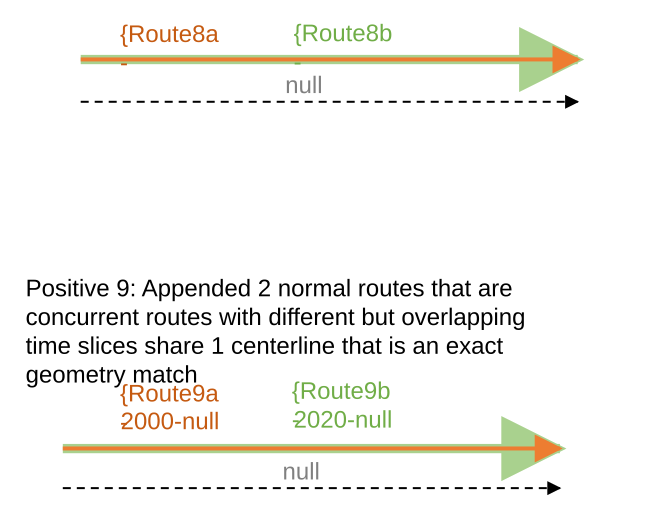

### Slide 13 — Positive 10: Appended 2 alpha routes that are at the same geographic location but not overlapping in time share 1 <!-- slide 13 -->

Positive 11: Appended 2 vertical routes that are concurrent routes with different but overlapping time slices share 1 centerline that is an exact geometry match

| Centerline Sequence | RouteId | CenterlineId | FromDate | ToDate |
| --- | --- | --- | --- | --- |
|  | {Route11a- | (Centr11- | 1/1/2000 | null |
|  | {Route11b- | (Centr11- | 1/1/2020 | null |

| Centerline Sequence | RouteId | CenterlineId | FromDate | ToDate |
| --- | --- | --- | --- | --- |
|  | {Route10a- | (Centr10- | 1/1/2000 | 1/1/2010 |
|  | {Route10b- | (Centr10- | 1/1/2020 | null |

[figure: {Route10a- · null · {Route11a- · {Route10b- · 2000-2010 · 2020-null · 2000-null]

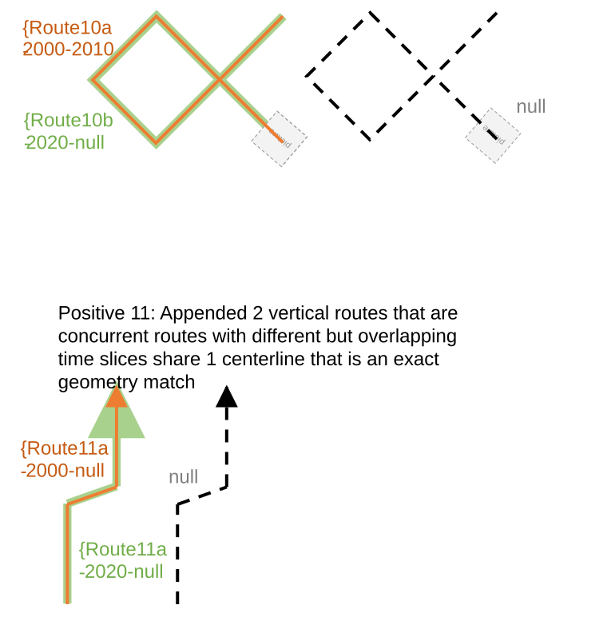

### Slide 14 — Positive 12: Appended normal route has 3 centerlines that are an exact geometry match <!-- slide 14 -->

| Centerline Sequence | RouteId | CenterlineId |
| --- | --- | --- |
|  | {Route12- | (Centr12a- |
|  | {Route12- | (Centr12b- |
|  | {Route12- | (Centr12c- |

Positive 13: Appended gapped route has 3 centerlines (2 gaps) that are an exact geometry match

| Centerline Sequence | RouteId | CenterlineId |
| --- | --- | --- |
|  | {Route13- | (Centr13a- |
|  | {Route13- | (Centr13b- |
|  | {Route13- | (Centr13c- |

| Centerline Sequence | RouteId | CenterlineId |
| --- | --- | --- |
|  | {Route13a- | (Centr13d- |
|  | {Route13a- | (Centr13e- |
|  | {Route13a- | (Centr13f- |
|  | {Route13b- | (Centr13g- |
|  | {Route13b- | (Centr13h- |

Positive 13a: PoM – Route in Route

[figure: {Route12- · null · {Route13- · {Route13a- · {Route13b-]

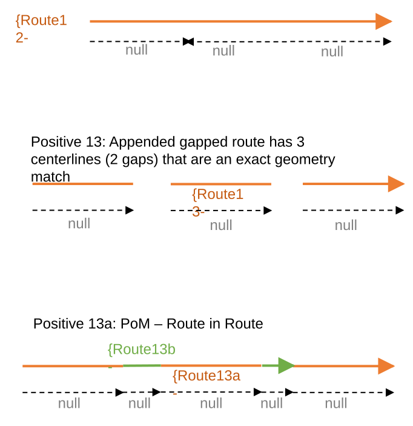

### Slide 15 — Positive 14: Appended loop route has 3 centerlines that are an exact geometry match <!-- slide 15 -->

| Centerline Sequence | RouteId | CenterlineId |
| --- | --- | --- |
|  | {Route14- | (Centr14a- |
|  | {Route14- | (Centr14b- |
|  | {Route14- | (Centr14c- |

Positive 15: Appended lollipop route has 3 centerlines that are an exact geometry match

| Centerline Sequence | RouteId | CenterlineId |
| --- | --- | --- |
|  | {Route15- | (Centr15a- |
|  | {Route15- | (Centr15b- |
|  | {Route15- | (Centr15c- |

[figure: {Route14- · null · {Route3-]

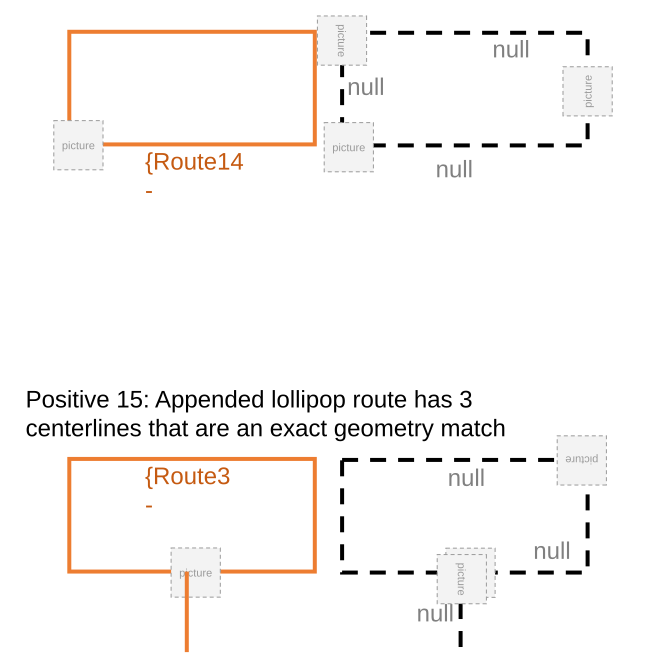

### Slide 16 — Positive 17: Appended alpha route has 3 centerlines that are an exact geometry match <!-- slide 16 -->

| Centerline Sequence | RouteId | CenterlineId |
| --- | --- | --- |
|  | {Route17- | (Centr17a- |
|  | {Route17- | (Centr17b- |
|  | {Route17- | (Centr17c- |

Positive 16: Appended branch route has 3 centerlines that are an exact geometry match

| Centerline Sequence | RouteId | CenterlineId |
| --- | --- | --- |
|  | {Route16- | (Centr16a- |
|  | {Route16- | (Centr16b- |
|  | {Route16- | (Centr16c- |

Positive 18: Appended vertical route has 3 centerlines that are an exact geometry match

| Centerline Sequence | RouteId | CenterlineId |
| --- | --- | --- |
|  | {Route18- | (Centr18a- |
|  | {Route18- | (Centr18b- |
|  | {Route18- | (Centr18c- |

[figure: {Route17- · null · {Route16- · {Route18-]

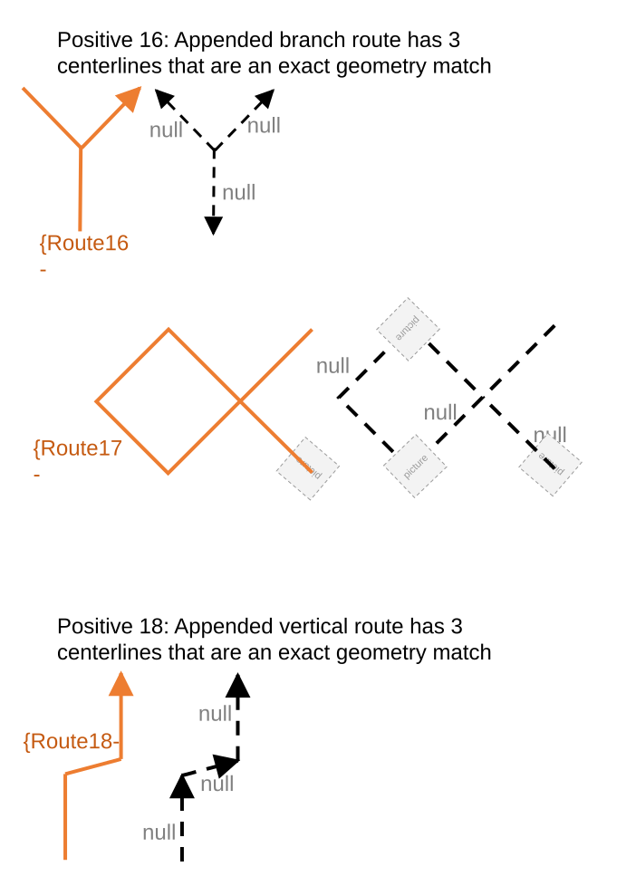

### Slide 17 <!-- slide 17 -->

Positive 19: Appended 1 normal and 1 gapped routes are a result of route extension, and the routes have 2 time slices on 3 centerlines that are an exact geometry match

| Centerline Sequence | RouteId | CenterlineId | FromDate | ToDate |
| --- | --- | --- | --- | --- |
|  | {Route19- | (Centr19a- | 1/1/2000 | null |
|  | {Route19- | (Centr19b- | 1/1/2000 | null |
|  | {Route19- | (Centr19c- | 1/1/2020 | null |

Positive 20: Appended 2 normal routes are a result of route Reassign – transfer to another line, and the routes have 2 time slices on 3 centerlines that are an exact geometry match

| Centerline Sequence | RouteId | CenterlineId | FromDate | ToDate |
| --- | --- | --- | --- | --- |
|  | {Route20a- | (Centr20a- | 1/1/2000 | null |
|  | {Route20a- | (Centr20b- | 1/1/2000 | null |
|  | {Route20b- | (Centr20c- | 1/1/2000 | null |

[figure: {Route19- · null · 2020-null · 2000-2020 · {Route20a- · {Route20b- · Line1 · Line2]

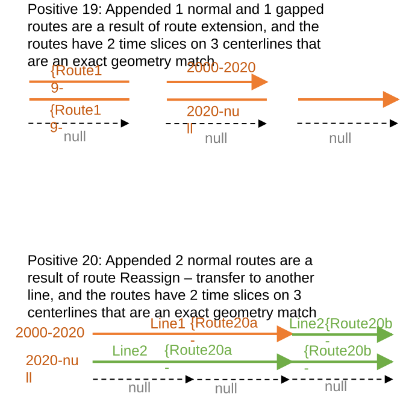

### Slide 18 — Positive 21: Appended 2 lollipop routes are a result of route realignment, and the routes have 2 time slices on 9 <!-- slide 18 -->

| Centerline Sequence | RouteId | CenterlineId | FromDate | ToDate |
| --- | --- | --- | --- | --- |
|  | {Route21- | (Centr21a- | 1/1/2000 | null |
|  | {Route21- | (Centr21b- | 1/1/2000 | null |
|  | {Route21- | (Centr21b- | 1/1/2000 | null |
|  | {Route21- | (Centr21c- | 1/1/2000 | null |
|  | {Route21- | (Centr21d- | 1/1/2000 | null |
|  | {Route21- | (Centr21e- | 1/1/2000 | 1/1/2020 |
|  | {Route21- | (Centr21f- | 1/1/2020 | null |
|  | {Route21- | (Centr21g- | 1/1/2020 | null |
|  | {Route21- | (Centr21h- | 1/1/2020 | null |

[figure: {Route21- 2000-2020 · null · {Route21- 2020-null]

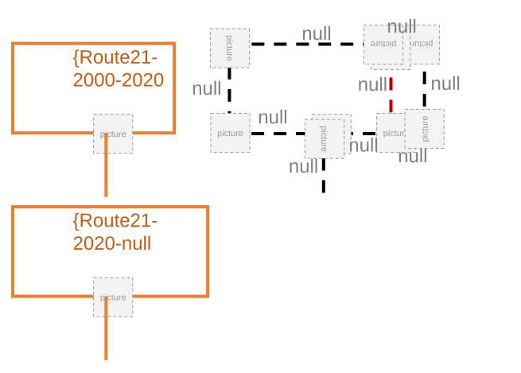

### Slide 19 — Positive 22: Appended 2 normal routes that are concurrent routes with different but overlapping time slices share 3 <!-- slide 19 -->

Positive 23: Appended 2 normal routes that are at the same geographic location but not overlapping in time share 2 of 3 centerlines that are an exact geometry match

| Centerline Sequence | RouteId | CenterlineId | FromDate | ToDate |
| --- | --- | --- | --- | --- |
|  | {Route22a- | (Centr22a- | 1/1/2000 | null |
|  | {Route22a- | (Centr22b- | 1/1/2000 | null |
|  | {Route22a- | (Centr22c- | 1/1/2000 | null |
|  | {Route22b- | (Centr22a- | 1/1/2020 | null |
|  | {Route22b- | (Centr22b- | 1/1/2020 | null |
|  | {Route22b- | (Centr22c- | 1/1/2020 | null |

| Centerline Sequence | RouteId | CenterlineId | FromDate | ToDate |
| --- | --- | --- | --- | --- |
|  | {Route23a- | (Centr23a- | 1/1/2000 | 1/1/2010 |
|  | {Route23a- | (Centr23b- | 1/1/2000 | 1/1/2010 |
|  | {Route23a- | (Centr23c- | 1/1/2000 | 1/1/2010 |
|  | {Route23b- | (Centr23b- | 1/1/2020 | null |
|  | {Route23b- | (Centr23c- | 1/1/2020 | null |

[figure: {Route22a- 2000-null · null · {Route22b- 2020-null · {Route23a- 2000-2010 · {Route23b- 2020-null]

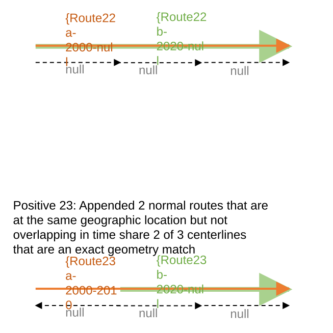

### Slide 20 — Positive 24: Appended 2 routes (1 branch, 1 normal) that are partially concurrent with different but overlapping time <!-- slide 20 -->

| Centerline Sequence | RouteId | CenterlineId | FromDate | ToDate |
| --- | --- | --- | --- | --- |
|  | {Route24a- | (Centr24a- | 1/1/2000 | null |
|  | {Route24a- | (Centr24b- | 1/1/2000 | null |
|  | {Route24b- | (Centr24a- | 1/1/2020 | null |
|  | {Route24b- | (Centr24b- | 1/1/2020 | null |
|  | {Route24b- | (Centr24c- | 1/1/2020 | null |

[figure: {Route24a- 2000-null · null · {Route24b- 2020-null]

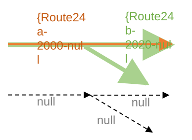

### Slide 21 — Positive 25: Appended 2 routes (1 loop, 1 lollipop) that are partially concurrent with same time slices share 2 of 3 <!-- slide 21 -->

| Centerline Sequence | RouteId | CenterlineId |
| --- | --- | --- |
|  | {Route25a- | (Centr25b- |
|  | {Route25a- | (Centr25c- |
|  | {Route25b- | (Centr25a- |
|  | {Route25b- | (Centr25b- |
|  | {Route25b- | (Centr25c- |

Positive 26: Appended 2 vertical routes that are concurrent routes with same time slices share 3 centerlines that are an exact geometry match

| Centerline Sequence | RouteId | CenterlineId |
| --- | --- | --- |
|  | {Route26a- | (Centr26a- |
|  | {Route26a- | (Centr26b- |
|  | {Route26a- | (Centr26c- |
|  | {Route26b- | (Centr26a- |
|  | {Route26b- | (Centr26b- |
|  | {Route26b- | (Centr26c- |

[figure: {Route25b- · null · {Route25a- · {Route26a- · {Route26b-]

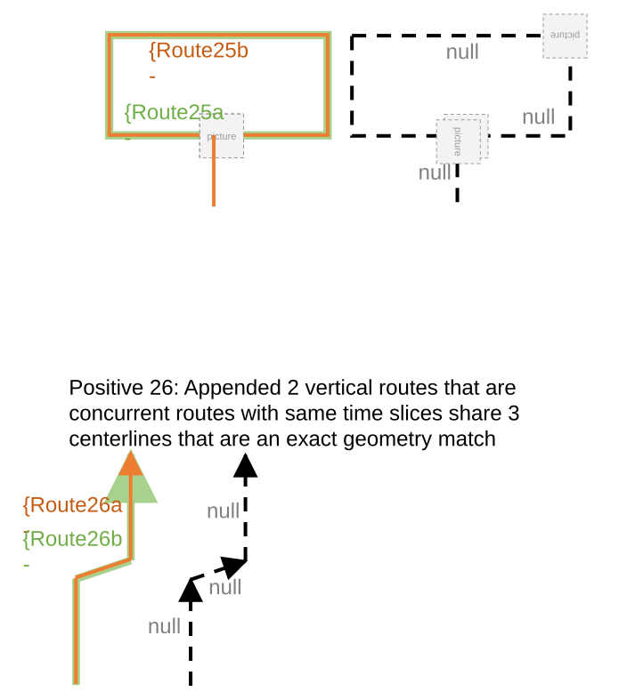

### Slide 22 — Negative cases <!-- slide 22 -->

RH candidates: 1-6
APRGCS candidates: all cases above
PoM candidates: 1-6
UN candidates: none (automation will cover)
Replace & Retire: 1-6
Sanity test candidates: Sanity test candidates: all cases in this list. Very easy as source routes are exported as FCs.

### Slide 23 — Negative 1: Centerline is longer than route <!-- slide 23 -->

Negative 2: Route is longer than centerline
Negative 3: No centerline exists at route location

Negative 4: Centerline(s) partially match with route
Negative 5: Overlapping centerlines exist at route location?

[figure: {Route1- · null · {Route3- · {Route2- · {Route4-]

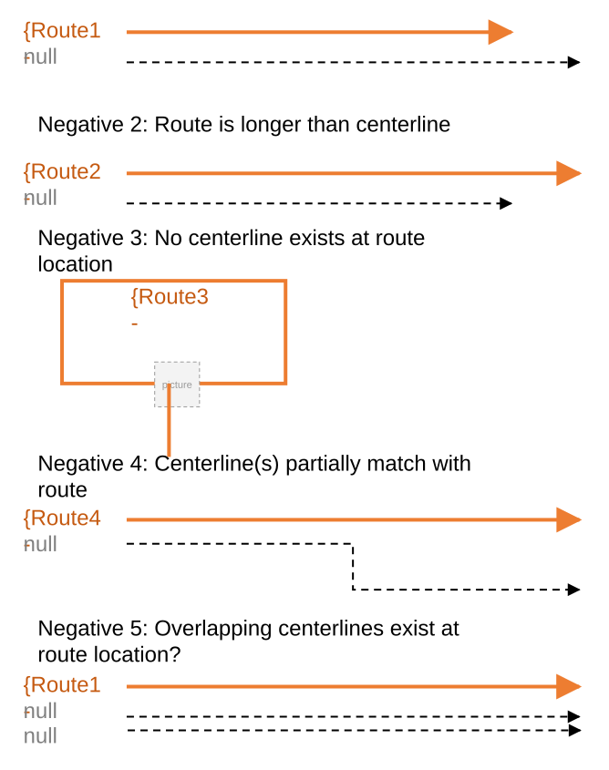

### Slide 24 — Negative 6: Centerline(s) match XY, but not Z <!-- slide 24 -->

Negative 7: APRGCS – existing centerline has fewer vertices than route

Negative 8: APRGCS – existing centerline has more vertices than route

[figure: {Route5- · null · {Route7- · {Route8-]

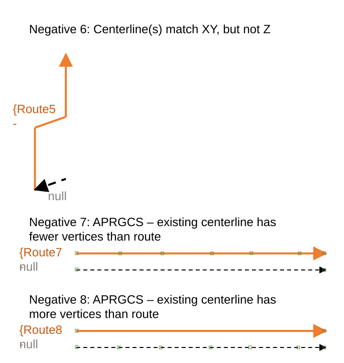
