# Update Measures From LRS: Populate Route Name Test Plan

| Field | Value |
| --- | --- |
| **Doc** | 280 · Test Plan · Pro |
| **Product** | Utility Network |
| **Release** | — |
| **Issues** | [ArcGISPro/ps-location-referencing#3439](https://devtopia.esri.com/ArcGISPro/ps-location-referencing/issues/3439) |
| **Source** | [3439-UpdateMeasureFromLRSPopulateRouteName_TestPlanV1.pptx](<https://esriis.sharepoint.com/sites/LocationReferencing/Shared%20Documents/General/Test%20Plans/3439-UpdateMeasureFromLRSPopulateRouteName_TestPlanV1.pptx>) · rev V1 |
| **People** | author Mac Christmas · PE — · dev — |
| **Edited** | 2024-11-20 23:19 by Mac Christmas |
| **Extracted** | 2026-09-04 · lane xmlstrip · format 3.0 · prompt v2.0.2 |
| **Keywords** | route name · measure update · pipeline line · un devices · un junctions · non lrs feature class · geoprocessing · test plan |
| **Tools** | Update Measures From LRS |

## Summary

Test plan for the Update Measures From LRS geoprocessing tool focusing on the optional Route Name parameter. Covers positive and negative test cases verifying route name population and measure updates across various input feature classes including PipelineLine, UN Devices, UN Junctions, and non-LRS line and point feature classes. Tests include execution in ArcGIS Pro GP, Model Builder, and Python environments with different geodatabase types.

## Related documents

<!-- related:begin -->
- [Support populating Route Name in Update Measures from LRS tool](<https://esriis.sharepoint.com/sites/lrsworkspace/LRS Doc Index/User Stories/support-populating-route-name-in-update-measures-from-lrs.md>) — similar text 0.08 · 3 title words · 2 filename words · same surface <!-- rel:704 s=3.553 -->
- [Update Measures From LRS: Support Events and Intersections](<https://esriis.sharepoint.com/sites/lrsworkspace/LRS Doc Index/Test Plans/3882-update-measures-from-lrs-support-events-and-intersections.md>) — similar text 0.05 · 1 title word · 1 filename word · same kind/surface/folder <!-- rel:277 s=3.387 -->
- [Update Measures From LRS: Support Spanning Events Test Plan](<https://esriis.sharepoint.com/sites/lrsworkspace/LRS%20Doc%20Index/Test%20Plans/3881-update-measures-from-lrs-support-spanning-events.md>) — similar text 0.03 · 1 title word · 1 filename word · same kind/surface/folder <!-- rel:230 s=3.327 -->
- [Reassign Route Subsequent Pane AI Assistant Test Plan](<https://esriis.sharepoint.com/sites/lrsworkspace/LRS%20Doc%20Index/Test%20Plans/7167-reassign-route-subsequent-pane-ai-assistant.md>) — similar text 0.04 · 1 title word · 1 filename word · same kind/surface/folder <!-- rel:11 s=3.138 -->
- [Export Network Reassign Transfer Test Plan V1](<https://esriis.sharepoint.com/sites/lrsworkspace/LRS Doc Index/Test Plans/export-network-reassign-transfer-v1.md>) — similar text 0.03 · same kind/surface/folder <!-- rel:513 s=2.182 -->
<!-- related:end -->

<!-- docs:begin -->
## Esri documentation

[Configure continuous measure networks and events to update with an engineering network](https://doc.esri.com/en/arcgis-pro/latest/help/production/location-referencing-pipelines/configure-continuous-measure-networks-and-events-to-update-with-an-engineering-network.html)

_No page matched:_ [Update Measures From LRS](https://www.google.com/search?q=%22Update%20Measures%20From%20LRS%22+site%3Adoc.esri.com)
<!-- docs:end -->

---

## Test Cases

### TC-P01 — Input LRS Network does not have RouteName configured <!-- src: S4 · slide 1 · Positive Tests: GP UI · 1 -->

- **Group:** GP UI
- **Case:** Input LRS Network does not have RouteName configured, Route Name parameter does not appear

### TC-P02 — Input LRS Network has RouteName configured, Route Name parameter appears <!-- src: S4 · slide 1 · Positive Tests: GP UI · 2 -->

- **Group:** GP UI

### TC-P03 — Route Name parameter is optional when it appears (should not have an asterisk) <!-- src: S4 · slide 1 · Positive Tests: GP UI · 3 -->

- **Group:** GP UI

### TC-P04 — Fields in Route Name parameter list are the same length and type as <!-- src: S4 · slide 1 · Positive Tests: GP UI · 4 -->

- **Group:** GP UI
- **Case:** Fields in Route Name parameter list are the same length and type as the RouteName field in the input LRS Network

### TC-P05 — Tabbing through tool parameters still works as expected <!-- src: S4 · slide 1 · Positive Tests: GP UI · 5 -->

- **Group:** GP UI

### TC-P06 — Route Name is populated for PipelineLine input upon GP execution (1) <!-- src: S4 · slide 1 · Positive Tests · 1 -->

### TC-P07 — RouteName and measures are already populated for PipelineLine input (1) <!-- src: S4 · slide 1 · Positive Tests · 2 -->

- **Case:** RouteName and measures are already populated for PipelineLine input, but overwritten when GP executes

### TC-P08 — RouteName and measures already populated for multiple PipelineLines features <!-- src: S4 · slide 1 · Positive Tests · 3 -->

- **Case:** RouteName and measures already populated for multiple PipelineLines features that make up a route, but are overwritten when GP executes

### TC-P09 — RouteName is populated for UN Devices input upon GP execution (1) <!-- src: S4 · slide 1 · Positive Tests · 4 -->

### TC-P10 — RouteName and Measure are already populated for UN Devices input (1) <!-- src: S4 · slide 1 · Positive Tests · 5 -->

- **Case:** RouteName and Measure are already populated for UN Devices input, but overwritten when GP executes

### TC-P11 — RouteName is populated for UN Junctions input upon GP execution (1) <!-- src: S4 · slide 1 · Positive Tests · 6 -->

### TC-P12 — RouteName and measure are already populated for UN Junctions input (1) <!-- src: S4 · slide 1 · Positive Tests · 7 -->

- **Case:** RouteName and measure are already populated for UN Junctions input, but overwritten when GP executes

### TC-P13 — RouteName is populated for non-LRS line feature class upon GP execution (1) <!-- src: S4 · slide 1 · Positive Tests · 8 -->

### TC-P14 — RouteName and measures are already populated for non-LRS line feature class (1) <!-- src: S4 · slide 1 · Positive Tests · 9 -->

- **Case:** RouteName and measures are already populated for non-LRS line feature class, but overwritten when GP executes

### TC-P15 — RouteName is populated for non-LRS point feature class upon GP execution (1) <!-- src: S4 · slide 1 · Positive Tests · 10 -->

### TC-P16 — RouteName and measure are already populated for non-LRS point feature class (1) <!-- src: S4 · slide 1 · Positive Tests · 11 -->

- **Case:** RouteName and measure are already populated for non-LRS point feature class, but overwritten when GP executes

### TC-P17 — RouteName and measures are already populated for non-LRS point feature class <!-- src: S4 · slide 1 · Positive Tests · 12 -->

- **Case:** RouteName and measures are already populated for non-LRS point feature class and a reassignment has split the route. RouteName and measure info is overwritten upon GP execution

### TC-N01 — LRS Network not configured with RouteName, Route Name parameter is populated <!-- src: S4 · slide 2 · Negative Tests: Python · 1 -->

- **Group:** Python

### TC-N02 — LRS Network configured with RouteName <!-- src: S4 · slide 2 · Negative Tests: Python · 2 -->

- **Group:** Python
- **Case:** LRS Network configured with RouteName, Route Name parameter is populated with an invalid field that is not the same length or type as the RouteName field in the input LRS Network

### TC-U01 — Route Name is populated for PipelineLine input upon GP execution (case 1) <!-- src: S2 · slide 3 · case 1 -->

| Asset Group | Asset Type | RouteID | Route Name | From Measure | To Measure |
| --- | --- | --- | --- | --- | --- |
| Distribution Pipe | Coated Steel | 001 | <Null> | 0 | 10 |

Before Update Measures From LRS:

| Line ID | Line Name | RouteID | Route Name | From Date | To Date |
| --- | --- | --- | --- | --- | --- |
| 100 | Line 100 | 001 | Route 001 | 1/1/2000 | <Null> |

After Update Measures From LRS (LRS Date input of 1/1/2005):

| Asset Group | Asset Type | RouteID | Route Name | From Measure | To Measure |
| --- | --- | --- | --- | --- | --- |
| Distribution Pipe | Coated Steel | 001 | Route 001 | 0 | 10 |

| Line ID | Line Name | RouteID | Route Name | From Date | To Date |
| --- | --- | --- | --- | --- | --- |
| 100 | Line 100 | 001 | Route 001 | 1/1/2000 | <Null> |

[figure: 0 · 10 · Line Network: · Pipeline Line: · Route 001]

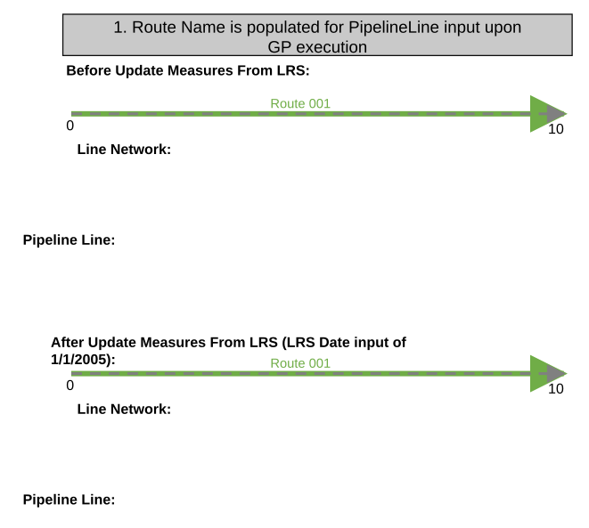

### TC-U02 — RouteName and Measures Are Already Populated for PipelineLine Input (case 2) <!-- src: S1 · slide 4 · case 2 -->

- **Case:** RouteName and measures are already populated for PipelineLine input, but overwritten when GP executes

| Asset Group | Asset Type | RouteID | Route Name | From Measure | To Measure |
| --- | --- | --- | --- | --- | --- |
| Distribution Pipe | Coated Steel | 001 | Route 001 | 0 | 10 |

| Line ID | Line Name | RouteID | Route Name | From Date | To Date | From Measure | To Measure |
| --- | --- | --- | --- | --- | --- | --- | --- |
| 100 | Line 100 | 001 | Route 001 | 1/1/2000 | 1/1/2005 | 0 | 10 |
| 100A | Line 100A | 001A | Route 001A | 1/1/2005 | <Null> | 5 | 15 |

Line Network (RouteName and measures changed since last execution of Update Measures From LRS):
Pipeline Line (Update LRS was previously ran before the RouteName had changed):
After Update Measures From LRS (LRS Date input of 1/1/2010):

| Asset Group | Asset Type | RouteID | Route Name | From Measure | To Measure |
| --- | --- | --- | --- | --- | --- |
| Distribution Pipe | Coated Steel | 001A | Route 001A | 5 | 15 |

| Line ID | Line Name | RouteID | Route Name | From Date | To Date | From Measure | To Measure |
| --- | --- | --- | --- | --- | --- | --- | --- |
| 100 | Line 100 | 001 | Route 001 | 1/1/2000 | 1/1/2005 | 0 | 10 |
| 100A | Line 100A | 001A | Route 001A | 1/1/2005 | <Null> | 5 | 15 |

[figure: 0 · 10 · Route 001 · 5 · 15 · Line Network: · Pipeline Line: · Route 001A]

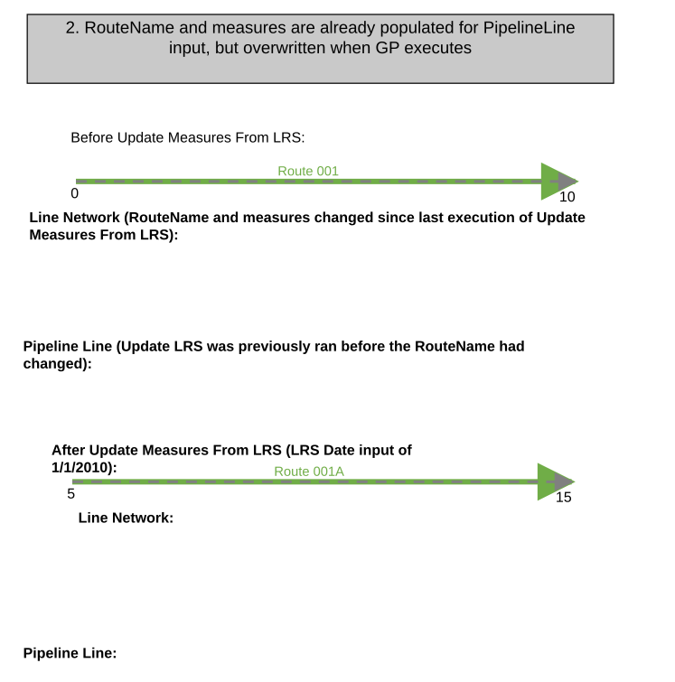

### TC-U03 — RouteName and Measures Already Populated for Multiple PipelineLine Features <!-- src: S1 · slide 5 · case 3 -->

- **Case:** RouteName and measures already populated for multiple PipelineLine features that make up a route, but are overwritten when GP executes

| Asset Group | Asset Type | RouteID | Route Name | From Measure | To Measure |
| --- | --- | --- | --- | --- | --- |
| Distribution Pipe | Coated Steel | 001 | Route 001 | 0 | 2.5 |
| Distribution Pipe | Coated Steel | 001 | Route 001 | 2.5 | 7.5 |
| Distribution Pipe | Coated Steel | 001 | Route 001 | 7.5 | 10 |

| Line ID | Line Name | RouteID | Route Name | From Date | To Date | From Measure | To Measure |
| --- | --- | --- | --- | --- | --- | --- | --- |
| 100 | Line 100 | 001 | Route 001 | 1/1/2000 | 1/1/2005 | 0 | 10 |
| 100A | Line 100A | 001A | Route 001A | 1/1/2005 | <Null> | 5 | 15 |

Line Network (RouteName and measures changed since last execution of Update Measures From LRS):
Pipeline Line (Update LRS was previously ran before the RouteName had changed):
After Update Measures From LRS (LRS Date input of 1/1/2010):

| Asset Group | Asset Type | RouteID | Route Name | From Measure | To Measure |
| --- | --- | --- | --- | --- | --- |
| Distribution Pipe | Coated Steel | 001A | Route 001A | 5 | 7.5 |
| Distribution Pipe | Coated Steel | 001A | Route 001A | 7.5 | 12.5 |
| Distribution Pipe | Coated Steel | 001A | Route 001A | 12.5 | 15 |

| Line ID | Line Name | RouteID | Route Name | From Date | To Date | From Measure | To Measure |
| --- | --- | --- | --- | --- | --- | --- | --- |
| 100 | Line 100 | 001 | Route 001 | 1/1/2000 | 1/1/2005 | 0 | 10 |
| 100A | Line 100A | 001A | Route 001A | 1/1/2005 | <Null> | 5 | 15 |

[figure: 0 · 10 · Route 001 · Line Network: · Pipeline Line: · 5 · 15]

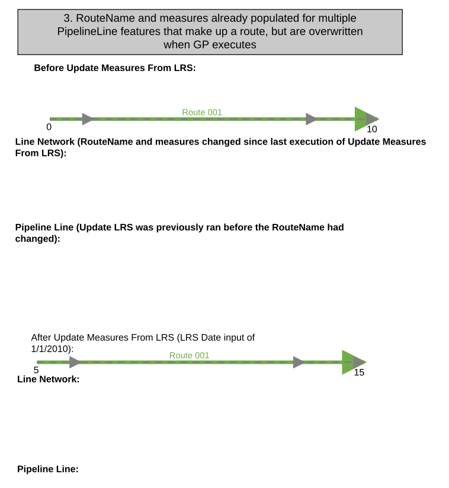

### TC-U04 — RouteName is populated for UN Devices input upon GP execution (case 4) <!-- src: S2 · slide 6 · case 4 -->

| Asset Group | Asset Type | RouteID | Route Name | Measure |
| --- | --- | --- | --- | --- |
| Controllable Valve | System | 001 | <Null> | 2.5 |
| Controllable Valve | System | 001 | <Null> | 7 |
| Controllable Valve | System | 001 | <Null> | 10 |

Before Update Measures From LRS:

| Line ID | Line Name | RouteID | Route Name | From Date | To Date | From Measure | To Measure |
| --- | --- | --- | --- | --- | --- | --- | --- |
| 100 | Line 100 | 001 | Route 001 | 1/1/2000 | <Null> | 0 | 10 |

After Update Measures From LRS (LRS Date input of 1/1/2010):

| Asset Group | Asset Type | RouteID | Route Name | Measure |
| --- | --- | --- | --- | --- |
| Controllable Valve | System | 001 | Route 001 | 2.5 |
| Controllable Valve | System | 001 | Route 001 | 7 |
| Controllable Valve | System | 001 | Route 001 | 10 |

| Line ID | Line Name | RouteID | Route Name | From Date | To Date | From Measure | To Measure |
| --- | --- | --- | --- | --- | --- | --- | --- |
| 100 | Line 100 | 001 | Route 001 | 1/1/2000 | <Null> | 0 | 10 |

[figure: 0 · 10 · Line Network: · Devices: · Route 001 · 7 · 2.5]

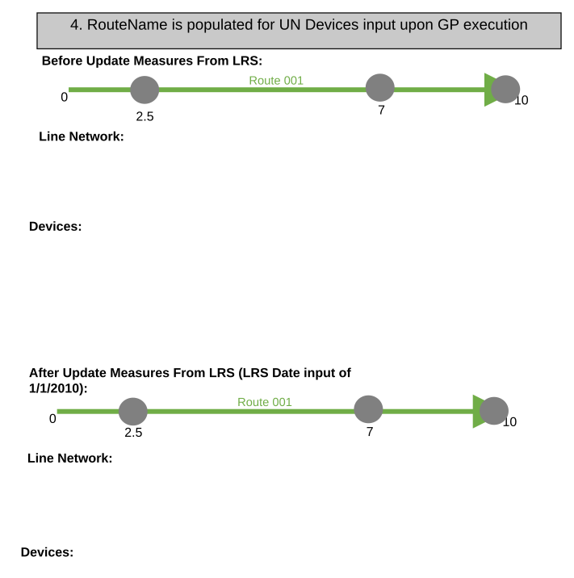

### TC-U05 — RouteName and Measure Are Already Populated for UN Devices Input (case 5) <!-- src: S1 · slide 7 · case 5 -->

- **Case:** RouteName and Measure are already populated for UN Devices input, but overwritten when GP executes

| Asset Group | Asset Type | RouteID | Route Name | Measure |
| --- | --- | --- | --- | --- |
| Controllable Valve | System | 001 | Route 001 | 2.5 |
| Controllable Valve | System | 001 | Route 001 | 7 |
| Controllable Valve | System | 001 | Route 001 | 10 |

| Line ID | Line Name | RouteID | Route Name | From Date | To Date | From Measure | To Measure |
| --- | --- | --- | --- | --- | --- | --- | --- |
| 100 | Line 100 | 001 | Route 001 | 1/1/2000 | 1/1/2005 | 0 | 10 |
| 100A | Line 100A | 001A | Route 001A | 1/1/2005 | <Null> | 5 | 15 |

Line Network (RouteName and measures changed since last execution of Update Measures From LRS):
After Update Measures From LRS (LRS Date input of 1/1/2010):

| Asset Group | Asset Type | RouteID | Route Name | Measure |
| --- | --- | --- | --- | --- |
| Controllable Valve | System | 001A | Route 001A | 7.5 |
| Controllable Valve | System | 001A | Route 001A | 12 |
| Controllable Valve | System | 001A | Route 001A | 15 |

| Line ID | Line Name | RouteID | Route Name | From Date | To Date | From Measure | To Measure |
| --- | --- | --- | --- | --- | --- | --- | --- |
| 100 | Line 100 | 001 | Route 001 | 1/1/2000 | 1/1/2005 | 0 | 10 |
| 100A | Line 100A | 001A | Route 001A | 1/1/2005 | <Null> | 5 | 15 |

[figure: 0 · 10 · Devices: · Route 001 · Line Network: · 5 · 15 · Route 001A · 7 · 12 · 2.5 · 7.5]

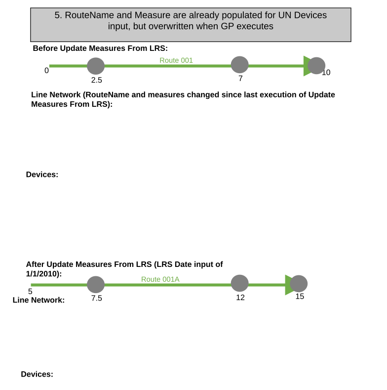

### TC-U06 — RouteName is populated for UN Junctions input upon GP execution (case 6) <!-- src: S2 · slide 8 · case 6 -->

| Asset Group | Asset Type | RouteID | Route Name | Measure |
| --- | --- | --- | --- | --- |
| Elbow | Metal Elbow | 001 | <Null> | 5 |
| Elbow | Metal Elbow | 001 | <Null> | 7.5 |
| End Cap | Metal End Cap | 001 | <Null> | 10 |

Before Update Measures From LRS:

| Line ID | Line Name | RouteID | Route Name | From Date | To Date | From Measure | To Measure |
| --- | --- | --- | --- | --- | --- | --- | --- |
| 100 | Line 100 | 001 | Route 001 | 1/1/2000 | <Null> | 0 | 10 |

Line Network (RouteName changed since last execution of Update Measures From LRS):
After Update Measures From LRS (LRS Date input of 1/1/2010):

| Line ID | Line Name | RouteID | Route Name | From Date | To Date | From Measure | To Measure |
| --- | --- | --- | --- | --- | --- | --- | --- |
| 100 | Line 100 | 001 | Route 001 | 1/1/2000 | <Null> | 0 | 10 |

| Asset Group | Asset Type | RouteID | Route Name | Measure |
| --- | --- | --- | --- | --- |
| Elbow | Metal Elbow | 001 | Route 001 | 5 |
| Elbow | Metal Elbow | 001 | Route 001 | 7 |
| End Cap | Metal End Cap | 001 | Route 001 | 10 |

[figure: 0 · 10 · Junctions: · Route 001 · 7.5 · 5 · Line Network:]

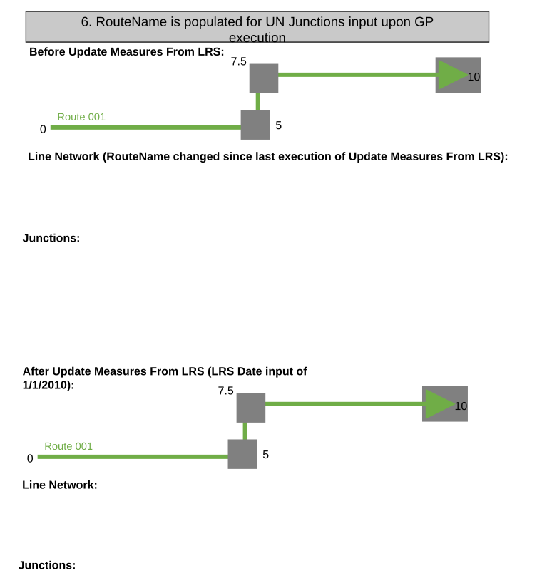

### TC-U07 — RouteName and Measure Are Already Populated for UN Junctions Input (case 7) <!-- src: S1 · slide 9 · case 7 -->

- **Case:** RouteName and measure are already populated for UN Junctions input, but overwritten when GP executes

| Asset Group | Asset Type | RouteID | Route Name | Measure |
| --- | --- | --- | --- | --- |
| Elbow | Metal Elbow | 001 | Route 001 | 5 |
| Elbow | Metal Elbow | 001 | Route 001 | 7.5 |
| End Cap | Metal End Cap | 001 | Route 001 | 10 |

| Line ID | Line Name | RouteID | Route Name | From Date | To Date | From Measure | To Measure |
| --- | --- | --- | --- | --- | --- | --- | --- |
| 100 | Line 100 | 001 | Route 001 | 1/1/2000 | 1/1/2005 | 0 | 10 |
| 100A | Line 100A | 001A | Route 001A | 1/1/2005 | <Null> | 5 | 15 |

Line Network (RouteName and measures changed since last execution of Update Measures From LRS):
After Update Measures From LRS (LRS Date input of 1/1/2010):

| Asset Group | Asset Type | RouteID | Route Name | Measure |
| --- | --- | --- | --- | --- |
| Elbow | Metal Elbow | 001A | Route 001A | 10 |
| Elbow | Metal Elbow | 001A | Route 001A | 12.5 |
| End Cap | Metal End Cap | 001A | Route 001A | 15 |

| Line ID | Line Name | RouteID | Route Name | From Date | To Date | From Measure | To Measure |
| --- | --- | --- | --- | --- | --- | --- | --- |
| 100 | Line 100 | 001 | Route 001 | 1/1/2000 | 1/1/2005 | 0 | 10 |
| 100A | Line 100A | 001A | Route 001A | 1/1/2005 | <Null> | 5 | 15 |

[figure: 0 · 10 · Junctions: · Route 001 · 7.5 · 5 · 15 · Route 001A · 12.5 · Line Network:]

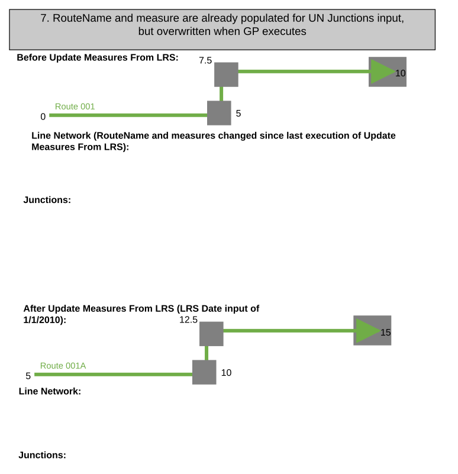

### TC-U08 — RouteName is populated for non-LRS line feature class upon GP execution (case 8) <!-- src: S2 · slide 10 · case 8 -->

| Cable Type | Depth | RouteID | Route Name | From Measure | To Measure |
| --- | --- | --- | --- | --- | --- |
| Fiber Optic | 8 ft | 005 | <Null> | 0 | 10 |

Before Update Measures From LRS:

| RouteID | Route Name | From Date | To Date |
| --- | --- | --- | --- |
| 005 | 5 th St. | 1/1/2000 | <Null> |

After Update Measures From LRS (LRS Date input of 1/1/2005):

| Cable Type | Depth | RouteID | Route Name | From Measure | To Measure |
| --- | --- | --- | --- | --- | --- |
| Fiber Optic | 8 ft | 005 | 5 th St. | 0 | 10 |

| RouteID | Route Name | From Date | To Date |
| --- | --- | --- | --- |
| 005 | 5 th St. | 1/1/2000 | <Null> |

[figure: 0 · 10 · Nonline Network: · Non-LRS Layer (Cable): · 5 th St.]

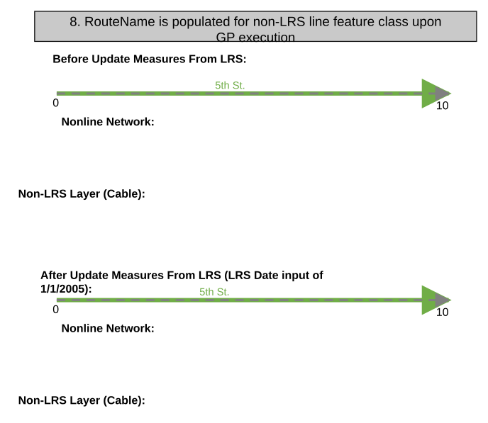

### TC-U09 — RouteName and Measures Are Already Populated for Non-LRS Line Feature Class (case 9) <!-- src: S1 · slide 11 · case 9 -->

- **Case:** RouteName and measures are already populated for non-LRS line feature class, but overwritten when GP executes

| Cable Type | Depth | RouteID | Route Name | From Measure | To Measure |
| --- | --- | --- | --- | --- | --- |
| Fiber Optic | 8 ft | 005 | 5 th St. | 0 | 10 |

| RouteID | Route Name | From Date | To Date | From Measure | To Measure |
| --- | --- | --- | --- | --- | --- |
| 005 | 5 th St. | 1/1/2000 | 1/1/2005 | 0 | 10 |
| W05 | W. 5 th St. | 1/1/2005 | <Null> | 5 | 15 |

Non-LRS Layer (Fiber Cable):
After Update Measures From LRS (LRS Date input of 1/1/2005):

| Cable Type | Depth | RouteID | Route Name | From Measure | To Measure |
| --- | --- | --- | --- | --- | --- |
| Fiber Optic | 8 ft | W05 | W. 5 th St. | 5 | 15 |

Non-LRS Layer (Fiber Cable):
W. 5th St.

| RouteID | Route Name | From Date | To Date | From Measure | To Measure |
| --- | --- | --- | --- | --- | --- |
| 005 | 5 th St. | 1/1/2000 | 1/1/2005 | 0 | 10 |
| W05 | W. 5 th St. | 1/1/2005 | <Null> | 5 | 15 |

[figure: 0 · 10 · Nonline Network: · 5 th St. · 5 · 15]

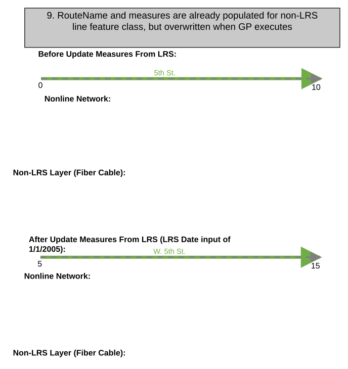

### TC-U10 — RouteName is populated for non-LRS point feature class upon GP execution (case 10) <!-- src: S2 · slide 12 · case 10 -->

| Material | Depth | RouteID | Route Name | Measure |
| --- | --- | --- | --- | --- |
| Brass | 4 ft | 005 | <Null> | 2.5 |
| Brass | 4.5 ft | 005 | <Null> | 7 |
| Brass | 3.8 ft | 005 | <Null> | 10 |

Before Update Measures From LRS:
Non-LRS Layer (Water Shut-off):
After Update Measures From LRS (LRS Date input of 1/1/2010):

| Material | Asset Type | RouteID | Route Name | Measure |
| --- | --- | --- | --- | --- |
| Brass | 4 ft | 005 | 5 th St. | 2.5 |
| Brass | 4.5 ft | 005 | 5 th St. | 7 |
| Brass | 3.8 ft | 005 | 5 th St. | 10 |

Non-LRS Layer (Water Shut-off):

| Line ID | Line Name | RouteID | Route Name | From Date | To Date | From Measure | To Measure |
| --- | --- | --- | --- | --- | --- | --- | --- |
| 100 | Line 100 | 001 | Route 001 | 1/1/2000 | <Null> | 0 | 10 |

| RouteID | Route Name | From Date | To Date | From Measure | To Measure |
| --- | --- | --- | --- | --- | --- |
| 005 | 5 th St. | 1/1/2000 | <Null> | 0 | 10 |

[figure: 0 · 10 · Nonline Network: · 5 th St. · 7]

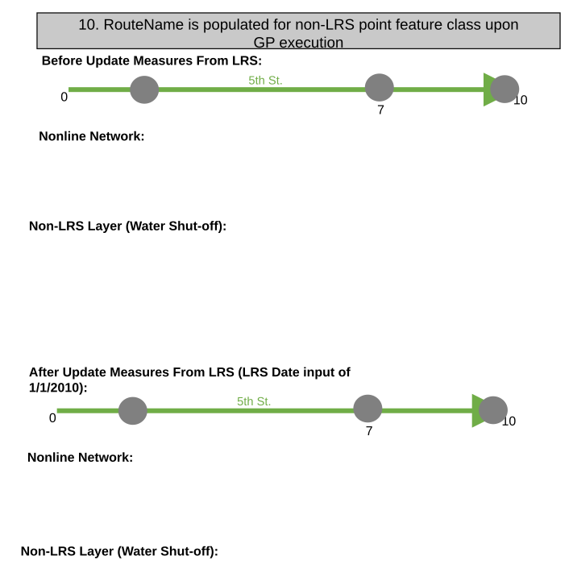

### TC-U11 — RouteName and Measure Are Already Populated for Non-LRS Point Feature Class (case 11) <!-- src: S1 · slide 13 · case 11 -->

- **Case:** RouteName and measure are already populated for non-LRS point feature class, but overwritten when GP executes

| Material | Depth | RouteID | Route Name | Measure |
| --- | --- | --- | --- | --- |
| Brass | 4 ft | 005 | 5 th St. | 2.5 |
| Brass | 4.5 ft | 005 | 5 th St. | 7 |
| Brass | 3.8 ft | 005 | 5 th St. | 10 |

| RouteID | Route Name | From Date | To Date | From Measure | To Measure |
| --- | --- | --- | --- | --- | --- |
| 005 | 5 th St. | 1/1/2000 | 1/1/2005 | 0 | 10 |
| W05 | W. 5 th St. | 1/1/2005 | <Null> | 5 | 15 |

Non-LRS Layer (Water Shut-off):
After Update Measures From LRS (LRS Date input of 1/1/2010):

| Asset Group | Asset Type | RouteID | Route Name | Measure |
| --- | --- | --- | --- | --- |
| Brass | 4 ft | W05 | W. 5 th St. | 7.5 |
| Brass | 4.5 ft | W05 | W. 5 th St. | 12 |
| Brass | 3.8 ft | W05 | W. 5 th St. | 15 |

Non-LRS Layer (Water Shut-off):

W. 5th St.

| RouteID | Route Name | From Date | To Date | From Measure | To Measure |
| --- | --- | --- | --- | --- | --- |
| 005 | 5 th St. | 1/1/2000 | 1/1/2005 | 0 | 10 |
| W05 | W. 5 th St. | 1/1/2005 | <Null> | 5 | 15 |

[figure: 0 · 10 · Nonline Network: · 5 th St. · 7 · 5 · 15 · 12 · 2.5 · 7.5]

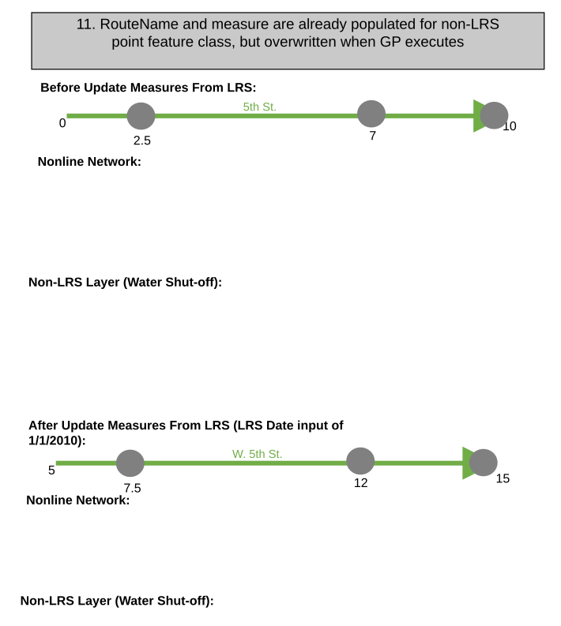

## Other content

### Slide 1 — Devtopia Issue <!-- slide 1 -->

Update Measures From LRS: Populate Route Name (when configured)

**Notes**
- Add optional parameter to Update Measures From LRS called “Route Name”
- Optional parameter will only appear for LRS Networks configured with Route Name
- When a valid field is populated into the parameter, the route name from the LRS Network will populate into every record in the Input Features where valid
- Test with both UN and non-UN data
- Test with both UN and non-UN feature classes as the input layer to be updated
- Test within Pro GP, Model Builder, and Python (inline and stand alone)
- Test in FGDB, EGDB DC, and FS

### Slide 14 — Before Update Measures From LRS and route reassignment: <!-- slide 14 -->

| Material | Depth | RouteID | Route Name | Measure |
| --- | --- | --- | --- | --- |
| Brass | 4 ft | 005 | 5 th St. | 2.5 |
| Brass | 4.5 ft | 005 | 5 th St. | 7 |
| Brass | 3.8 ft | 005 | 5 th St. | 10 |

| RouteID | Route Name | From Date | To Date | From Measure | To Measure |
| --- | --- | --- | --- | --- | --- |
| 005 | 5 th St. | 1/1/2000 | 1/1/2005 | 0 | 10 |
| W05 | W. 5 th St. | 1/1/2005 | <Null> | 0 | 5 |
| E05 | E 5 th . St. | 1/1/2005 | <Null> | 10 | 15 |

Non-LRS Layer (Water Shut-off):
After Update Measures From LRS (LRS Date input of 1/1/2010):

| Asset Group | Asset Type | RouteID | Route Name | Measure |
| --- | --- | --- | --- | --- |
| Brass | 4 ft | W05 | W. 5 th St. | 2.5 |
| Brass | 4.5 ft | E05 | E. 5 th St. | 12 |
| Brass | 3.8 ft | E05 | E. 5 th St. | 15 |

Non-LRS Layer (Water Shut-off):

W. 5th St.

E. 5th St.

| RouteID | Route Name | From Date | To Date | From Measure | To Measure |
| --- | --- | --- | --- | --- | --- |
| 005 | 5 th St. | 1/1/2000 | 1/1/2005 | 0 | 10 |
| W05 | W. 5 th St. | 1/1/2005 | <Null> | 0 | 5 |
| E05 | E 5 th . St. | 1/1/2005 | <Null> | 10 | 15 |

[figure: 12. · 0 · 10 · Nonline Network: · 5 th St. · 7 · 15 · 12 · 2.5 · 5]

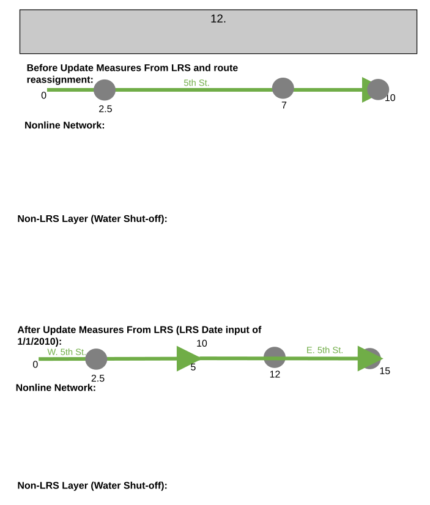
