# Merge Centerlines Test Plan

| Field | Value |
| --- | --- |
| **Doc** | 103 · Test Plan · Pro |
| **Product** | Roads & Highways · Pipeline Referencing · Utility Network |
| **Release** | — |
| **Issues** | [ArcGISPro/ps-location-referencing#363](https://devtopia.esri.com/ArcGISPro/ps-location-referencing/issues/363) |
| **Source** | [363-MergeCenterlines_TestPlanV1.pptx](<https://esriis.sharepoint.com/sites/LocationReferencing/Shared%20Documents/General/Test%20Plans/363-MergeCenterlines_TestPlanV1.pptx>) · rev V1 |
| **People** | author Mac Christmas · PE — · dev — |
| **Edited** | 2025-11-26 22:11 by Mac Christmas |
| **Extracted** | 2026-09-04 · lane xmlstrip · format 3.0 · prompt v2.0.2 |
| **Keywords** | centerlines · merge · routes · attribute exact · conflict prevention · singlepart · complex shape · time slices · lock · xy tolerance · admrh · unapr |
| **Tools** | Merge Centerlines |

## Summary

Test plan for the new centerline merge operation within the Linear Referencing System (LRS) applyEdits and the Location Referencing ribbon tool. It covers positive and negative test cases for merging centerlines under various conditions including attribute matching, route association, direction, time slices, conflict prevention, and dataset types such as ADMRH and UNAPR. The plan includes tests for singlepart and complex shapes, lock acquisition, tolerance thresholds, and REST and Pro UI interactions.

## Related documents

<!-- related:begin -->
- [Iteration Planning and Issue Tracking for Esri LRS Development](<https://esriis.sharepoint.com/sites/lrsworkspace/LRS Doc Index/Schedules/363-iteration-planning-and-issue-tracking-for-esri-lrs.md>) — shared issue ArcGISPro/ps-location-referencing#363 · similar text 0.03 · same surface <!-- rel:59 s=1001.079 -->
- [Merge Centerlines](<https://esriis.sharepoint.com/sites/lrsworkspace/LRS Doc Index/Other/merge-centerlines-apr-un.md>) — similar text 0.20 · 2 title words · 2 filename words · same surface <!-- rel:97 s=4.224 -->
- [Merge Centerlines](<https://esriis.sharepoint.com/sites/lrsworkspace/LRS Doc Index/Other/merge-centerlines-rh.md>) — similar text 0.15 · 2 title words · 2 filename words · same surface <!-- rel:87 s=4.19 -->
- [SLD Support for Centerline in UN and ADM LRS Datasets Test Plan](<https://esriis.sharepoint.com/sites/lrsworkspace/LRS%20Doc%20Index/Test%20Plans/26161-sld-support-for-centerline-in-un-and-adm-lrs-datasets.md>) — similar text 0.14 · same kind/folder <!-- rel:38 s=3.359 -->
- [Regression Testing Task List V1](<https://esriis.sharepoint.com/sites/lrsworkspace/LRS%20Doc%20Index/Test%20Plans/regression-testing-task-list-v1.md>) — similar text 0.14 · same kind/surface <!-- rel:115 s=3.302 -->
<!-- related:end -->

<!-- docs:begin -->
## Esri documentation

[Merge centerlines](https://doc.esri.com/en/arcgis-pro/latest/help/production/roads-highways/merge-centerlines.html) · [Conflict prevention](https://doc.esri.com/en/arcgis-pro/latest/help/production/roads-highways/conflict-prevention.html) · [Split multipart centerlines into singlepart features](https://doc.esri.com/en/arcgis-pro/latest/help/production/roads-highways/split-multipart-centerlines-into-singlepart-features.html) · [Complex shapes](https://doc.esri.com/en/arcgis-pro/latest/help/production/roads-highways/complex-shapes.html) · [Release locks with the Release Locks tool](https://doc.esri.com/en/arcgis-pro/latest/help/production/roads-highways/release-locks.html) · [Tolerance and resolution settings for the LRS](https://doc.esri.com/en/arcgis-pro/latest/help/production/roads-highways/tolerance-and-resolution-settings-for-the-lrs.html)
<!-- docs:end -->

---

## Overview

### Slide 1 — Devtopia Issue <!-- slide 1 -->

Merge Centerlines

**Notes**
- Add new centerline merge operation within LRS applyEdits
- Add new tool on LR ribbon for merging centerlines
- All Centerline feature attributes (excluding CenterlineID) must match to merge. ADMRH is also an exception for addressing fields and we will preserve the From Address of the “upstream” centerline and the To Address of the most “downstream” centerline
- Only allow centerline merge if resultant merged centerline is singlepart and not a complex shape
- If conflict prevention is enabled, then lock underlying route(s) associated with centerlines being merged
- CenterlineSequenceTable will update to reflect merged centerlines
- Continue to fail when merging centerlines through core Merge tool
- Test with FS only
- Test with undo/redo
- Pro tool icon will be disabled in FGDB/EGDB LRS datasets
- Test with RH, APR, APR GCS, PoM, and ADMRH data. UNAPR data will be sanity tested to ensure merge is not possible
- Test directly with REST and in Pro UI (more on the Pro UI)

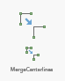

## Test Cases

### TC-P01 — Test below test cases with nonline and line networks (unless otherwise noted) (1) <!-- src: S4 · slide 2 · Positive Tests · 1 -->

### TC-P02 — Merge centerlines with no populated attributes, including CenterlineID (1) <!-- src: S4 · slide 2 · Positive Tests · 2 -->

### TC-P03 — Merge centerlines with no populated attributes, excluding CenterlineID (1) <!-- src: S4 · slide 2 · Positive Tests · 3 -->

### TC-P04 — Merge centerlines with populated attributes that are attribute-exact (1) <!-- src: S4 · slide 2 · Positive Tests · 4 -->

### TC-P05 — Merge centerlines with inputs in different directions (1) <!-- src: S4 · slide 2 · Positive Tests · 5 -->

### TC-P06 — Merge centerlines, route has time slices but centerlines can still be merged (1) <!-- src: S4 · slide 2 · Positive Tests · 6 -->

### TC-P07 — Merge centerlines with inputs associated with multiple routes (1) <!-- src: S4 · slide 2 · Positive Tests · 7 -->

- **Case:** Merge centerlines with inputs associated with multiple routes, but centerlines can still be merged

### TC-P08 — Merge dozens of centerlines with no populated attributes, including CenterlineID <!-- src: S4 · slide 2 · Positive Tests · 8 -->

### TC-P09 — Merge dozens of centerlines with no populated attributes, excluding CenterlineID (1) <!-- src: S4 · slide 2 · Positive Tests · 9 -->

### TC-P10 — Merge centerlines with inputs that make up a complex route shape (1) <!-- src: S4 · slide 2 · Positive Tests · 10 -->

### TC-P11 — Merge centerlines in an ADMRH dataset (1) <!-- src: S4 · slide 2 · Positive Tests · 11 -->

- **Case:** Merge centerlines in an ADMRH dataset, address range will update in resultant merged event

### TC-P12 — Merge centerlines (1) <!-- src: S4 · slide 2 · Positive Tests · 12 -->

- **Case:** Merge centerlines, conflict prevention is enabled and route lock is acquired for associated route (Pro UI)

### TC-P13 — 11A. Merge centerlines <!-- src: S4 · slide 2 · Positive Tests · 13 -->

- **Case:** 11A. Merge centerlines, conflict prevention is enabled and route lock must be acquired prior to merge (REST)

### TC-P14 — Merge centerlines in GCS dataset (1) <!-- src: S4 · slide 2 · Positive Tests · 14 -->

- **Case:** Merge centerlines in GCS dataset, input 1000 centerlines with z values and length exceeds 15 miles

### TC-P15 — Merge centerlines that are slightly longer than the XY Tolerance (1) <!-- src: S4 · slide 2 · Positive Tests · 15 -->

### TC-P16 — 13A. Merge centerlines with a gap that is within the XY Tolerance <!-- src: S4 · slide 2 · Positive Tests · 16 -->

### TC-P17 — Merge vertical centerlines that share X,Y coordinates but have different Z (1) <!-- src: S4 · slide 2 · Positive Tests · 17 -->

- **Case:** Merge vertical centerlines that share X,Y coordinates but have different Z coordinates

### TC-P18 — Merge overlapping centerlines not associated with routes (1) <!-- src: S4 · slide 2 · Positive Tests · 18 -->

### TC-N01 — Test below test cases with nonline and line networks (unless otherwise noted) (2) <!-- src: S4 · slide 3 · Negative Tests · 1 -->

### TC-N02 — Attempt to merge centerlines with populated attributes that are not (1) <!-- src: S4 · slide 3 · Negative Tests · 2 -->

- **Case:** Attempt to merge centerlines with populated attributes that are not attribute-exact

### TC-N03 — Attempt to merge centerlines that are not part of the same route (1) <!-- src: S4 · slide 3 · Negative Tests · 3 -->

### TC-N04 — 2A. Attempt to merge centerlines that are not part of the same route but belong <!-- src: S4 · slide 3 · Negative Tests · 4 -->

- **Case:** 2A. Attempt to merge centerlines that are not part of the same route but belong to the same line

### TC-N05 — 2B. Attempt to merge centerlines that are not part of the same route and do not <!-- src: S4 · slide 3 · Negative Tests · 5 -->

- **Case:** 2B. Attempt to merge centerlines that are not part of the same route and do not belong to the same line

### TC-N06 — Attempt to merge centerlines, one centerline has Null CenterlineID (1) <!-- src: S4 · slide 3 · Negative Tests · 6 -->

### TC-N07 — Attempt to merge centerlines in a UNAPR dataset (1) <!-- src: S4 · slide 3 · Negative Tests · 7 -->

### TC-N08 — Attempt to merge centerlines using the core Merge tool (1) <!-- src: S4 · slide 3 · Negative Tests · 8 -->

### TC-N09 — Attempt to merge centerlines (1) <!-- src: S4 · slide 3 · Negative Tests · 9 -->

- **Case:** Attempt to merge centerlines, route has time slices that prevent centerlines from being merged

### TC-N10 — Attempt to merge centerlines (2) <!-- src: S4 · slide 3 · Negative Tests · 10 -->

- **Case:** Attempt to merge centerlines, route associated with input centerlines is locked by user in another version

### TC-N11 — Attempt to merge centerlines, resultant merged centerline is not singlepart (1) <!-- src: S4 · slide 3 · Negative Tests · 11 -->

### TC-N12 — Attempt to merge centerlines (3) <!-- src: S4 · slide 3 · Negative Tests · 12 -->

- **Case:** Attempt to merge centerlines, input centerlines are associated with other LRS Network route feature and are not able to merge

### TC-N13 — Attempt to merge centerlines that do not have exact attributes in an ADMRH (1) <!-- src: S4 · slide 3 · Negative Tests · 13 -->

- **Case:** Attempt to merge centerlines that do not have exact attributes in an ADMRH dataset

### TC-N14 — Merge centerlines with inputs that make up a complex route shape (2) <!-- src: S4 · slide 3 · Negative Tests · 14 -->

- **Case:** Merge centerlines with inputs that make up a complex route shape, resultant merged centerline is a complex shape

### TC-N15 — Attempt to merge overlapping centerlines associated with routes (1) <!-- src: S4 · slide 3 · Negative Tests · 15 -->

### TC-N16 — Attempt to merge centerlines that are smaller than the XY Tolerance (1) <!-- src: S4 · slide 3 · Negative Tests · 16 -->

### TC-N17 — Attempt to merge centerlines with only one centerline selected (1) <!-- src: S4 · slide 3 · Negative Tests · 17 -->

### TC-N18 — Attempt to merge centerlines with no centerlines selected (1) <!-- src: S4 · slide 3 · Negative Tests · 18 -->

### TC-N19 — Attempt to merge centerlines in an ADMRH dataset with centerlines that are not (1) <!-- src: S4 · slide 3 · Negative Tests · 19 -->

- **Case:** Attempt to merge centerlines in an ADMRH dataset with centerlines that are not all in the same direction

### TC-N20 — Attempt to merge centerlines that do not share z values at intersection points (1) <!-- src: S4 · slide 3 · Negative Tests · 20 -->

### TC-N21 — Attempt to merge centerlines, one Centerline has manually populated CenterlineID (1) <!-- src: S4 · slide 3 · Negative Tests · 21 -->

### TC-N22 — Attempt to merge overlapping 2D centerlines not associated with routes that do (1) <!-- src: S4 · slide 3 · Negative Tests · 22 -->

- **Case:** Attempt to merge overlapping 2D centerlines not associated with routes that do not overlap in 3D space

### TC-U01 — Merge centerlines with no populated attributes, including CenterlineID (case 1) <!-- src: S2 · slide 4 · case 1 -->

| Centerline Attribute Table |  |  |
| --- | --- | --- |
| CenterlineID | Attribute1 | Attribute2 |
| Null | Null | Null |
| Null | Null | Null |
| Null | Null | Null |
| Null | Null | Null |

| CenterlineSequenceTable |  |  |  |  |
| --- | --- | --- | --- | --- |
| Centerline ID | Network ID | Route ID | From Date | To Date |
| No records |  |  |  |  |

| CenterlineSequenceTable |  |  |  |  |
| --- | --- | --- | --- | --- |
| Centerline ID | Network ID | Route ID | From Date | To Date |
| No records |  |  |  |  |

| Centerline Attribute Table |  |  |
| --- | --- | --- |
| CenterlineID | Attribute1 | Attribute2 |
| Null | Null | Null |

[figure: Input: · Output: · 1–4]

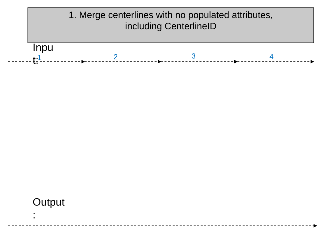

### TC-U02 — Merge centerlines with no populated attributes, excluding CenterlineID (case 2) <!-- src: S2 · slide 5 · case 2 -->

| Centerline Attribute Table |  |  |
| --- | --- | --- |
| CenterlineID | Attribute1 | Attribute2 |
| 1 | Null | Null |
| 2 | Null | Null |
| 3 | Null | Null |
| 4 | Null | Null |

| CenterlineSequenceTable |  |  |  |  |
| --- | --- | --- | --- | --- |
| Centerline ID | Network ID | Route ID | From Date | To Date |
| 1 | Network1 | 001 | 1/1/2000 | Null |
| 2 | Network1 | 001 | 1/1/2000 | Null |
| 3 | Network1 | 001 | 1/1/2000 | Null |
| 4 | Network1 | 001 | 1/1/2000 | Null |

| LRS Network Attribute Table |  |  |
| --- | --- | --- |
| RouteID | From Date | To Date |
| 001 | 1/1/2000 | Null |

| CenterlineSequenceTable |  |  |  |  |
| --- | --- | --- | --- | --- |
| Centerline ID | Network ID | Route ID | From Date | To Date |
| 1 | Network1 | 001 | 1/1/2000 | Null |

| Centerline Attribute Table |  |  |
| --- | --- | --- |
| CenterlineID | Attribute1 | Attribute2 |
| 1 | Null | Null |

[figure: Input: · Output: · 1–4 · 1 · 001 · 10 mi · 0 mi]

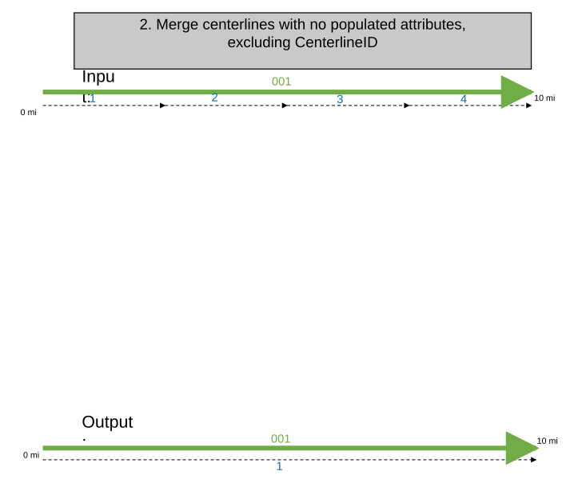

### TC-U03 — Merge centerlines with populated attributes that are attribute-exact (case 3) <!-- src: S2 · slide 6 · case 3 -->

| Centerline Attribute Table |  |  |
| --- | --- | --- |
| CenterlineID | Attribute1 | Attribute2 |
| 1 | State | Active |
| 2 | State | Active |
| 3 | State | Active |
| 4 | State | Active |

| CenterlineSequenceTable |  |  |  |  |
| --- | --- | --- | --- | --- |
| Centerline ID | Network ID | Route ID | From Date | To Date |
| 1 | Network1 | 001 | 1/1/2000 | Null |
| 2 | Network1 | 001 | 1/1/2000 | Null |
| 3 | Network1 | 001 | 1/1/2000 | Null |
| 4 | Network1 | 001 | 1/1/2000 | Null |

| LRS Network Attribute Table |  |  |
| --- | --- | --- |
| RouteID | From Date | To Date |
| 001 | 1/1/2000 | Null |

| CenterlineSequenceTable |  |  |  |  |
| --- | --- | --- | --- | --- |
| Centerline ID | Network ID | Route ID | From Date | To Date |
| 1 | Network1 | 001 | 1/1/2000 | Null |

| Centerline Attribute Table |  |  |
| --- | --- | --- |
| CenterlineID | Attribute1 | Attribute2 |
| 1 | State | Active |

[figure: Input: · Output: · 1–4 · 001 · 10 mi · 0 mi · 1]

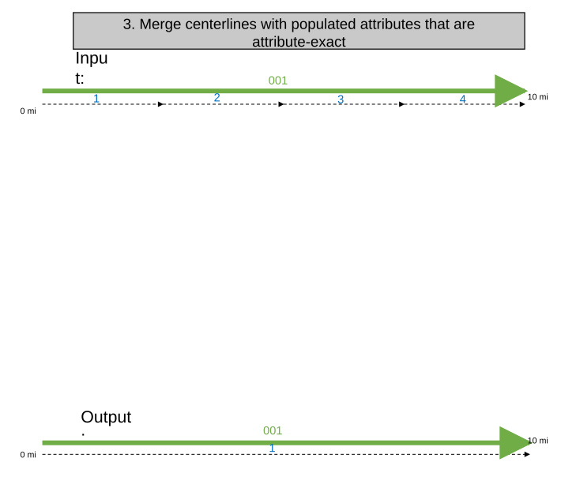

### TC-U04 — Merge centerlines with inputs in different directions (case 4) <!-- src: S2 · slide 7 · case 4 -->

| Centerline Attribute Table |  |  |
| --- | --- | --- |
| CenterlineID | Attribute1 | Attribute2 |
| 1 | State | Active |
| 2 | State | Active |
| 3 | State | Active |
| 4 | State | Active |

| CenterlineSequenceTable |  |  |  |  |
| --- | --- | --- | --- | --- |
| Centerline ID | Network ID | Route ID | From Date | To Date |
| 1 | Network1 | 001 | 1/1/2000 | Null |
| 2 | Network1 | 001 | 1/1/2000 | Null |
| 3 | Network1 | 001 | 1/1/2000 | Null |
| 4 | Network1 | 001 | 1/1/2000 | Null |

| LRS Network Attribute Table |  |  |
| --- | --- | --- |
| RouteID | From Date | To Date |
| 001 | 1/1/2000 | Null |

| CenterlineSequenceTable |  |  |  |  |
| --- | --- | --- | --- | --- |
| Centerline ID | Network ID | Route ID | From Date | To Date |
| 1 | Network1 | 001 | 1/1/2000 | Null |

| Centerline Attribute Table |  |  |
| --- | --- | --- |
| CenterlineID | Attribute1 | Attribute2 |
| 1 | State | Active |

[figure: Input: · Output: · 1–4 · 001 · 10 mi · 0 mi · 1]

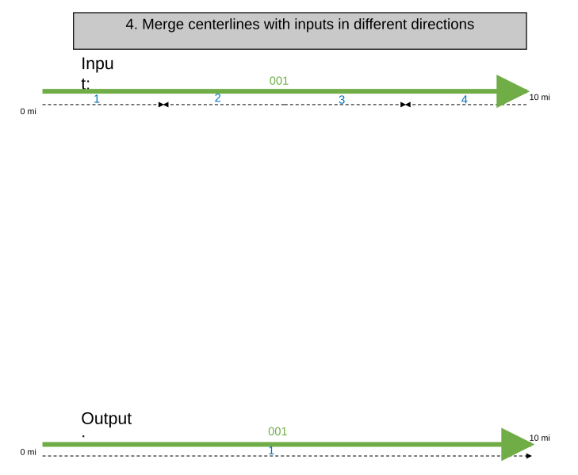

### TC-U05 — Merge Centerlines, Route Has Time Slices but Centerlines Can Still Be Merged (case 5) <!-- src: S1 · slide 8 · case 5 -->

| Centerline Attribute Table |  |  |
| --- | --- | --- |
| CenterlineID | Attribute1 | Attribute2 |
| 1 | Null | Inactive |
| 2 | State | Active |
| 3 | State | Active |
| 4 | Null | Inactive |

| CenterlineSequenceTable |  |  |  |  |
| --- | --- | --- | --- | --- |
| Centerline ID | Network ID | Route ID | From Date | To Date |
| 2 | Network1 | 001 | 1/1/2005 | Null |
| 3 | Network1 | 001 | 1/1/2005 | Null |
| 4 | Network1 | 001 | 1/1/2010 | Null |

| LRS Network Attribute Table |  |  |
| --- | --- | --- |
| RouteID | From Date | To Date |
| 001 | 1/1/2005 | 1/1/2010 |
| 001 | 1/1/2010 | Null |

| Centerline Attribute Table |  |  |
| --- | --- | --- |
| CenterlineID | Attribute1 | Attribute2 |
| 1 | Null | Inactive |
| 2 | State | Active |
| 4 | Null | Inactive |

| CenterlineSequenceTable |  |  |  |  |
| --- | --- | --- | --- | --- |
| Centerline ID | Network ID | Route ID | From Date | To Date |
| 2 | Network1 | 001 | 1/1/2005 | Null |
| 4 | Network1 | 001 | 1/1/2010 | Null |

[figure: 001, 1/1/2005-1/1/2010 · 001, 1/1/2010-Null · Input: · Output: · 1–4 · 10 mi · 0 mi · 15 mi · 1 · 2 · 4]

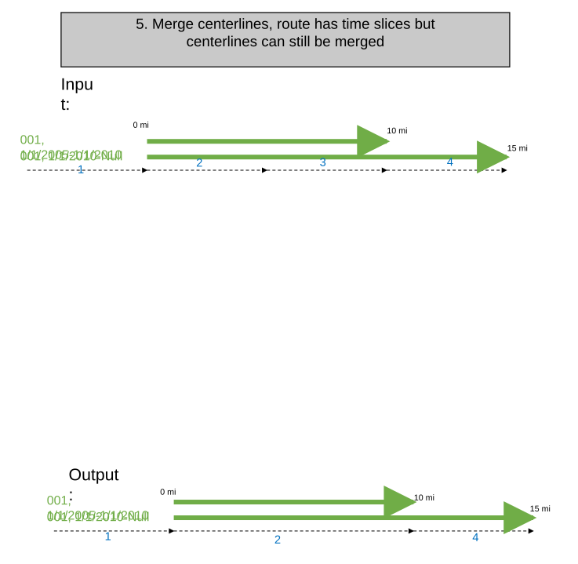

### TC-U06 — Merge Centerlines with Inputs Associated with Multiple Routes (case 6) <!-- src: S1 · slide 9 · case 6 -->

- **Case:** Merge centerlines with inputs associated with multiple routes, but centerlines can still be merged

| Centerline Attribute Table |  |  |
| --- | --- | --- |
| CenterlineID | Attribute1 | Attribute2 |
| Null | Null | Inactive |
| 2 | Shared | Active |
| 3 | Shared | Active |
| 4 | County | Active |

| CenterlineSequenceTable |  |  |  |  |
| --- | --- | --- | --- | --- |
| Centerline ID | Network ID | Route ID | From Date | To Date |
| 2 | Network1 | 001 | 1/1/2000 | Null |
| 3 | Network1 | 001 | 1/1/2000 | Null |
| 2 | Network2 | 45A | 1/1/2000 | Null |
| 3 | Network2 | 45A | 1/1/2000 | Null |
| 4 | Network2 | 45A | 1/1/2000 | Null |

| LRS Network Attribute Table |  |  |  |
| --- | --- | --- | --- |
| LRS Network | Route ID | From Date | To Date |
| Network1 | 001 | 1/1/2000 | Null |
| Network2 | 45A | 1/1/2000 | Null |

| Centerline Attribute Table |  |  |
| --- | --- | --- |
| CenterlineID | Attribute1 | Attribute2 |
| 1 | Null | Inactive |
| 2 | State | Active |
| 4 | Null | Inactive |

| CenterlineSequenceTable |  |  |  |  |
| --- | --- | --- | --- | --- |
| Centerline ID | Network ID | Route ID | From Date | To Date |
| 2 | Network1 | 001 | 1/1/2000 | Null |
| 2 | Network2 | 45A | 1/1/2000 | Null |
| 4 | Network2 | 45A | 1/1/2000 | Null |

[figure: 001 · 45A · Input: · Output: · 1–4 · 1 · 2 · 4 · 10 mi · 0 mi · 15 mi]

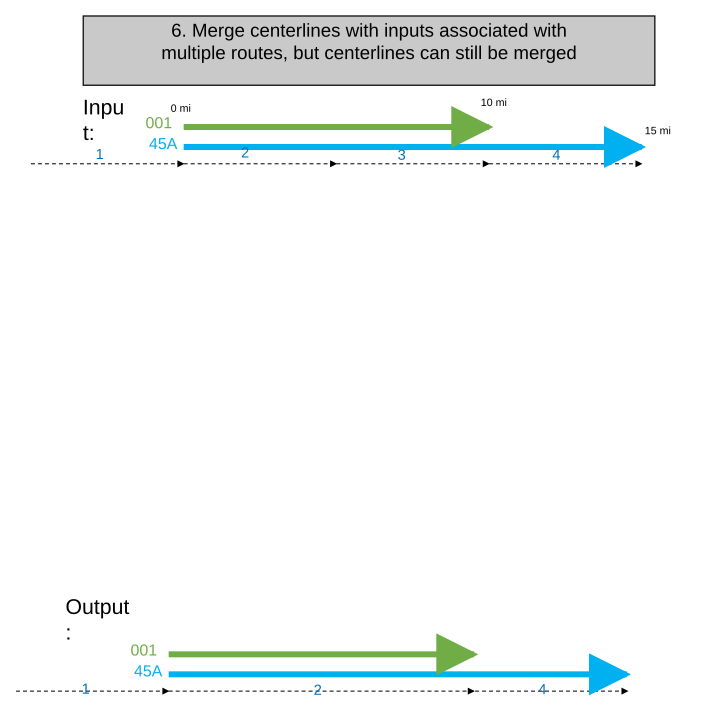

### TC-U07 — Merge Dozens of Centerlines with No Populated Attributes, Excluding CenterlineID (case 8) <!-- src: S1 · slide 10 · case 8 -->

| Centerline Attribute Table |  |  |
| --- | --- | --- |
| CenterlineID | Attribute1 | Attribute2 |
| 1 | State | Active |
| 2 | State | Active |
| … | … | … |
| 38 | State | Active |

| CenterlineSequenceTable |  |  |  |  |
| --- | --- | --- | --- | --- |
| Centerline ID | Network ID | Route ID | From Date | To Date |
| 1 | Network1 | 001 | 1/1/2000 | Null |
| 2 | Network1 | 001 | 1/1/2000 | Null |
| 3 | Network1 | 001 | 1/1/2000 | Null |
| … | … | … | … | … |

| Centerline Attribute Table |  |  |
| --- | --- | --- |
| CenterlineID | Attribute1 | Attribute2 |
| 1 | State | Active |

| LRS Network Attribute Table |  |  |
| --- | --- | --- |
| RouteID | From Date | To Date |
| 001 | 1/1/2000 | Null |

| CenterlineSequenceTable |  |  |  |  |
| --- | --- | --- | --- | --- |
| Centerline ID | Network ID | Route ID | From Date | To Date |
| 1 | Network1 | 001 | 1/1/2000 | Null |

[figure: Input: · Output: · 10 mi · 0 mi · 1 · 38]

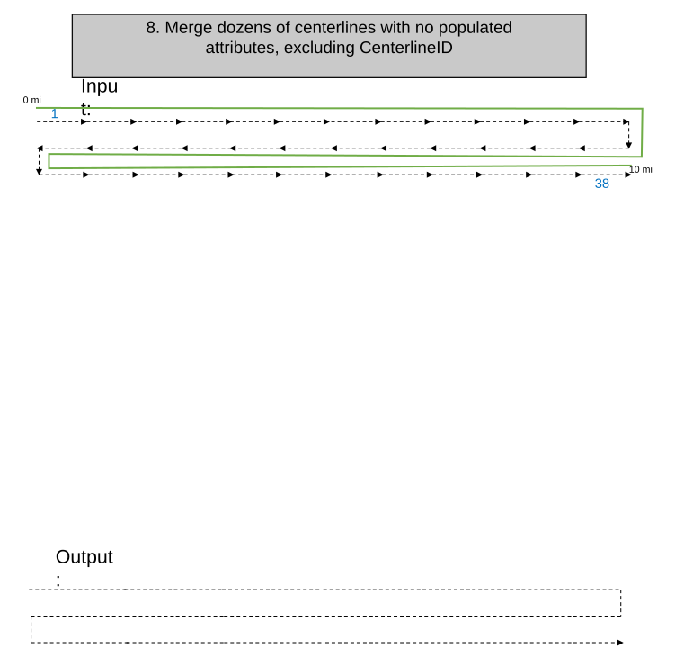

### TC-U08 — Merge centerlines with inputs that make up a complex route shape (case 9) <!-- src: S2 · slide 11 · case 9 -->

| Centerline Attribute Table |  |  |
| --- | --- | --- |
| CenterlineID | Attribute1 | Attribute2 |
| 1 | State | Active |
| 2 | State | Active |
| 3 | State | Active |
| 4 | State | Active |
| 5 | State | Active |
| 6 | State | Active |

| CenterlineSequenceTable |  |  |  |  |
| --- | --- | --- | --- | --- |
| Centerline ID | Network ID | Route ID | From Date | To Date |
| 1 | Network1 | 001 | 1/1/2000 | Null |
| 2 | Network1 | 001 | 1/1/2000 | Null |
| 3 | Network1 | 001 | 1/1/2000 | Null |
| 4 | Network1 | 001 | 1/1/2000 | Null |
| 5 | Network1 | 001 | 1/1/2000 | Null |
| 6 | Network1 | 001 | 1/1/2000 | Null |

| LRS Network Attribute Table |  |  |
| --- | --- | --- |
| RouteID | From Date | To Date |
| 001 | 1/1/2000 | Null |

| Centerline Attribute Table |  |  |
| --- | --- | --- |
| CenterlineID | Attribute1 | Attribute2 |
| 1 | State | Active |
| 6 | State | Active |

| CenterlineSequenceTable |  |  |  |  |
| --- | --- | --- | --- | --- |
| Centerline ID | Network ID | Route ID | From Date | To Date |
| 1 | Network1 | 001 | 1/1/2000 | Null |
| 6 | Network1 | 001 | 1/1/2000 | Null |

[figure: Input: · Output: · 1–4 · 001 · 10 mi · 0 mi · 5 · 6 · 1]

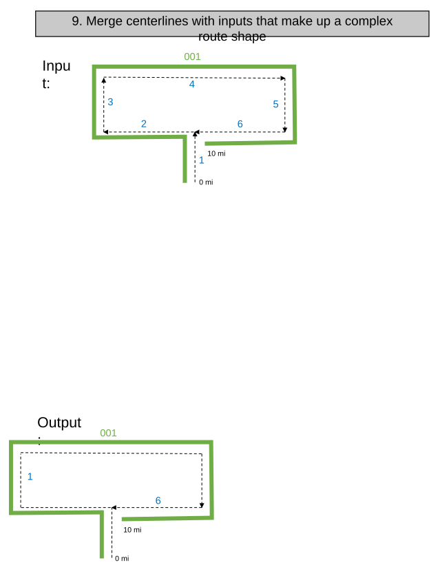

### TC-U09 — Merge Centerlines in an ADMRH Dataset (case 10) <!-- src: S1 · slide 12 · case 10 -->

- **Case:** Merge centerlines in an ADMRH dataset, address range will update in resultant merged centerline

| CenterlineSequenceTable |  |  |  |  |
| --- | --- | --- | --- | --- |
| Centerline ID | Network ID | Route ID | From Date | To Date |
| 1 | Network1 | 001 | 1/1/2000 | Null |
| 2 | Network1 | 001 | 1/1/2000 | Null |
| 3 | Network1 | 001 | 1/1/2000 | Null |
| 4 | Network1 | 001 | 1/1/2000 | Null |

| LRS Network Attribute Table |  |  |
| --- | --- | --- |
| RouteID | From Date | To Date |
| 001 | 1/1/2000 | Null |

| CenterlineSequenceTable |  |  |  |  |
| --- | --- | --- | --- | --- |
| Centerline ID | Network ID | Route ID | From Date | To Date |
| 1 | Network1 | 001 | 1/1/2000 | Null |

| Centerline Attribute Table |  |  |  |  |  |  |
| --- | --- | --- | --- | --- | --- | --- |
| Centerline ID | County on Left | County on Right | From Left | To Left | From Right | To Right |
| 1 | Adams | Jackson | 2 | 24 | 1 | 25 |
| 2 | Adams | Jackson | 26 | 50 | 27 | 49 |
| 3 | Adams | Jackson | 52 | 74 | 51 | 75 |
| 4 | Adams | Jackson | 76 | 100 | 77 | 99 |

| Centerline Attribute Table |  |  |  |  |  |  |
| --- | --- | --- | --- | --- | --- | --- |
| Centerline ID | County on Left | County on Right | From Left | To Left | From Right | To Right |
| 1 | Adams | Jackson | 2 | 100 | 1 | 99 |

[figure: Input: · Output: · 1–4 · 001 · 10 mi · 0 mi · 1]

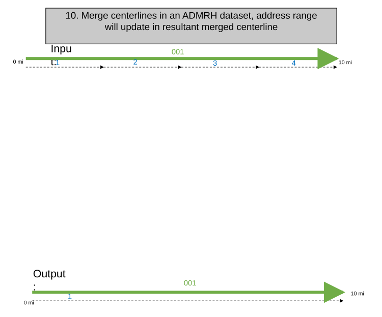

### TC-U10 — Merge Centerlines (case 11) <!-- src: S1 · slide 13 · case 11 -->

- **Case:** Merge centerlines, conflict prevention is enabled and lock is acquired for associated route (Pro UI)

| Centerline Attribute Table |  |  |
| --- | --- | --- |
| CenterlineID | Attribute1 | Attribute2 |
| 1 | Null | Null |
| 2 | Null | Null |
| 3 | Null | Null |
| 4 | Null | Null |

| CenterlineSequenceTable |  |  |  |  |
| --- | --- | --- | --- | --- |
| Centerline ID | Network ID | Route ID | From Date | To Date |
| 1 | Network1 | 001 | 1/1/2000 | Null |
| 2 | Network1 | 001 | 1/1/2000 | Null |
| 3 | Network1 | 001 | 1/1/2000 | Null |
| 4 | Network1 | 001 | 1/1/2000 | Null |

| LRS Network Attribute Table |  |  |
| --- | --- | --- |
| RouteID | From Date | To Date |
| 001 | 1/1/2000 | Null |

| CenterlineSequenceTable |  |  |  |  |
| --- | --- | --- | --- | --- |
| Centerline ID | Network ID | Route ID | From Date | To Date |
| 1 | Network1 | 001 | 1/1/2000 | Null |

| Centerline Attribute Table |  |  |
| --- | --- | --- |
| CenterlineID | Attribute1 | Attribute2 |
| 1 | Null | Null |

| Locks Table |  |  |  |  |  |
| --- | --- | --- | --- | --- | --- |
| RouteID | Event | User | Date | Version | Releasable |
| No records |  |  |  |  |  |

| Locks Table |  |  |  |  |  |
| --- | --- | --- | --- | --- | --- |
| RouteID | Event | User | Date | Version | Releasable |
| 001 |  | Editor1 | XX/XX/XXXX | Editor.Version1 | No |

[figure: Input: · Output: · 1–4 · 001 · 10 mi · 0 mi · 1]

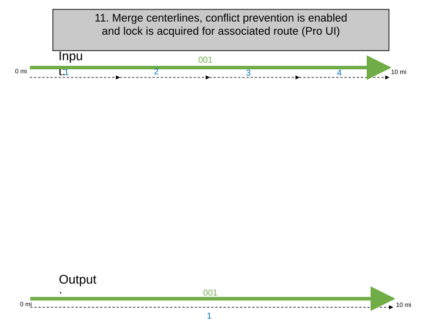

### TC-U11 — Merge Centerlines in GCS Dataset (case 12) <!-- src: S1 · slide 15 · case 12 -->

- **Case:** Merge centerlines in GCS dataset, input 1000 centerlines with populated non-zero z values and total length that exceeds 15 miles

| Centerline Attribute Table |  |  |  |
| --- | --- | --- | --- |
| ObjectID | CenterlineID | Attribute1 | Attribute2 |
| 1 | Null | Null | Null |
| 2 | Null | Null | Null |
| … | … | … | … |
| 1000 | Null | Null | Null |

| CenterlineSequenceTable |  |  |  |  |
| --- | --- | --- | --- | --- |
| Centerline ID | Network ID | Route ID | From Date | To Date |
| No records |  |  |  |  |

| CenterlineSequenceTable |  |  |  |  |
| --- | --- | --- | --- | --- |
| Centerline ID | Network ID | Route ID | From Date | To Date |
| No records |  |  |  |  |

| Centerline Attribute Table |  |  |
| --- | --- | --- |
| CenterlineID | Attribute1 | Attribute2 |
| Null | Null | Null |

[figure: Input: · Output: · 1 · 1000 · 25 mi · 0 mi]

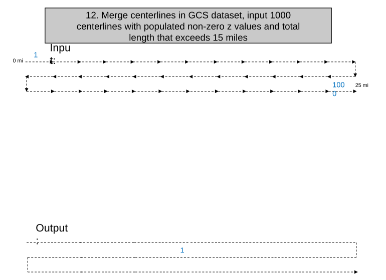

### TC-U12 — Merge centerlines that are slightly longer than the XY Tolerance (case 13) <!-- src: S2 · slide 16 · case 13 -->

| Centerline Attribute Table |  |  |
| --- | --- | --- |
| CenterlineID | Attribute1 | Attribute2 |
| Null | Null | Null |
| Null | Null | Null |
| Null | Null | Null |
| Null | Null | Null |

| CenterlineSequenceTable |  |  |  |  |
| --- | --- | --- | --- | --- |
| Centerline ID | Network ID | Route ID | From Date | To Date |
| No records |  |  |  |  |

| CenterlineSequenceTable |  |  |  |  |
| --- | --- | --- | --- | --- |
| Centerline ID | Network ID | Route ID | From Date | To Date |
| No records |  |  |  |  |

| Centerline Attribute Table |  |  |
| --- | --- | --- |
| CenterlineID | Attribute1 | Attribute2 |
| Null | Null | Null |

XY Tolerance is 0.001 meters

[figure: Input: · Output: · 1–4 · 0.002 m · 0 m · 0.004 m]

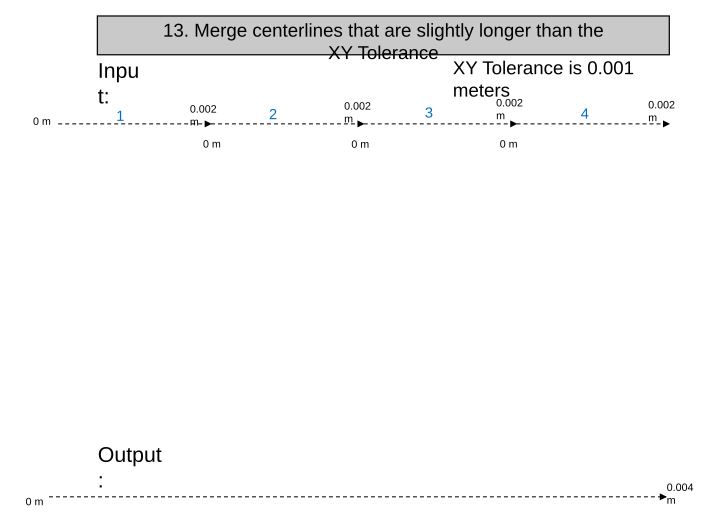

### TC-U13 — Merge Vertical Centerlines That Share X,Y Coordinates but Have Different Z (case 14) <!-- src: S1 · slide 18 · case 14 -->

- **Case:** Merge vertical centerlines that share X,Y coordinates but have different Z coordinates

| Centerline Attribute Table |  |  |
| --- | --- | --- |
| CenterlineID | Attribute1 | Attribute2 |
| Null | Null | Null |
| Null | Null | Null |
| Null | Null | Null |
| Null | Null | Null |

| CenterlineSequenceTable |  |  |  |  |
| --- | --- | --- | --- | --- |
| Centerline ID | Network ID | Route ID | From Date | To Date |
| No records |  |  |  |  |

| CenterlineSequenceTable |  |  |  |  |
| --- | --- | --- | --- | --- |
| Centerline ID | Network ID | Route ID | From Date | To Date |
| No records |  |  |  |  |

| Centerline Attribute Table |  |  |
| --- | --- | --- |
| CenterlineID | Attribute1 | Attribute2 |
| Null | Null | Null |

[figure: Input: · Output: · 1–4 · 1]

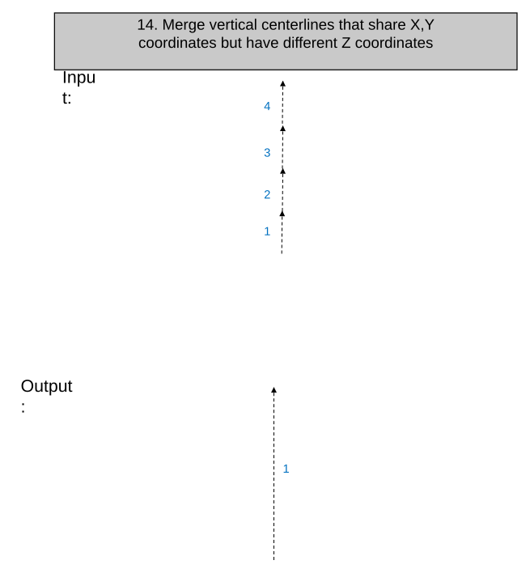

### TC-U14 — Merge overlapping centerlines not associated with routes (case 15) <!-- src: S2 · slide 19 · case 15 -->

| Centerline Attribute Table |  |  |
| --- | --- | --- |
| CenterlineID | Attribute1 | Attribute2 |
| Null | Null | Null |
| Null | Null | Null |
| Null | Null | Null |
| Null | Null | Null |

| Centerline Attribute Table |  |  |
| --- | --- | --- |
| CenterlineID | Attribute1 | Attribute2 |
| Null | Null | Null |
| Null | Null | Null |
| Null | Null | Null |

[figure: Input: · Output: · 1–4 · 10 mi · 0 mi · 2 · 4]

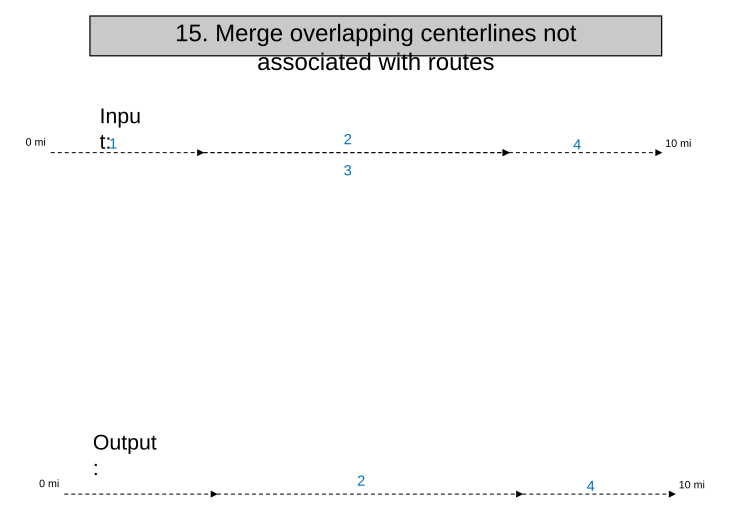

### TC-U15 — Attempt To Merge Centerlines with Populated Attributes That Are Not (case 1) <!-- src: S1 · slide 20 · case 1 -->

- **Case:** Attempt to merge centerlines with populated attributes that are not attribute-exact

| Centerline Attribute Table |  |  |
| --- | --- | --- |
| CenterlineID | Attribute1 | Attribute2 |
| 1 | State | Active |
| 2 | State | Active |
| 3 | State | Proposed |
| 4 | State | Active |

| CenterlineSequenceTable |  |  |  |  |
| --- | --- | --- | --- | --- |
| Centerline ID | Network ID | Route ID | From Date | To Date |
| 1 | Network1 | 001 | 1/1/2000 | Null |
| 2 | Network1 | 001 | 1/1/2000 | Null |
| 3 | Network1 | 001 | 1/1/2000 | Null |
| 4 | Network1 | 001 | 1/1/2000 | Null |

| LRS Network Attribute Table |  |  |
| --- | --- | --- |
| RouteID | From Date | To Date |
| 001 | 1/1/2000 | Null |

ERROR, centerlines are not attribute exact

[figure: Input: · Output: · 1–4 · 001 · 10 mi · 0 mi]

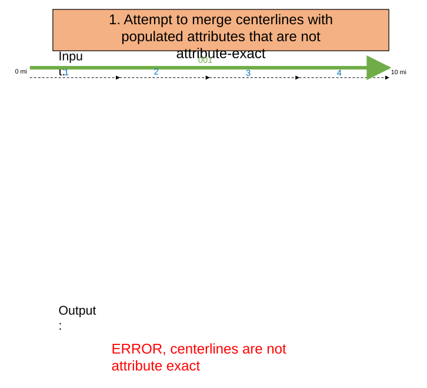

### TC-U16 — Attempt To Merge Centerlines That Are Not Part of the Same Route (case 2) <!-- src: S1 · slide 21 · case 2 -->

| Centerline Attribute Table |  |  |
| --- | --- | --- |
| CenterlineID | Attribute1 | Attribute2 |
| 1 | Transmission | Active |
| 2 | Transmission | Active |
| 3 | Transmission | Active |
| 4 | Transmission | Active |

| CenterlineSequenceTable |  |  |  |  |
| --- | --- | --- | --- | --- |
| Centerline ID | Network ID | Route ID | From Date | To Date |
| 1 | Network1 | 001 | 1/1/2000 | Null |
| 2 | Network1 | 001 | 1/1/2000 | Null |
| 3 | Network1 | 002 | 1/1/2000 | Null |
| 4 | Network1 | 002 | 1/1/2000 | Null |

| LRS Network Attribute Table |  |  |
| --- | --- | --- |
| RouteID | From Date | To Date |
| 001 | 1/1/2000 | Null |
| 002 | 1/1/2000 | Null |

ERROR, centerlines belong to more than one route and cannot be merged

[figure: Input: · Output: · 1–4 · 001 · 10 mi · 0 mi · 002]

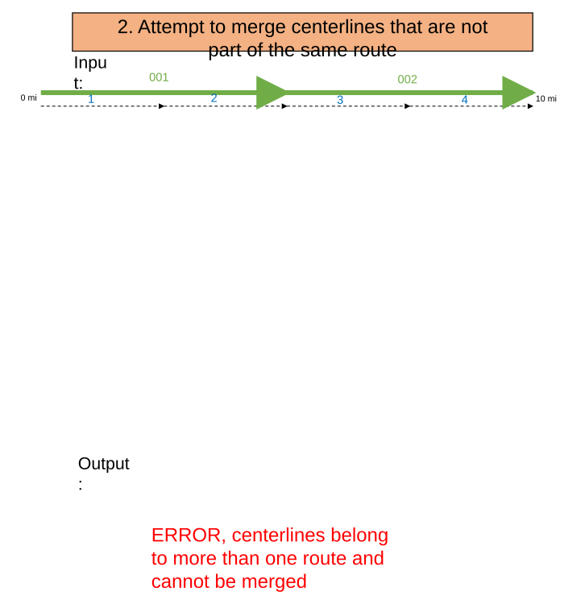

### TC-U17 — Attempt to merge centerlines, one centerline has Null CenterlineID (case 3) <!-- src: S2 · slide 24 · case 3 -->

| Centerline Attribute Table |  |  |
| --- | --- | --- |
| CenterlineID | Attribute1 | Attribute2 |
| 1 | State | Active |
| 2 | State | Active |
| 3 | State | Active |
| Null | State | Active |

| CenterlineSequenceTable |  |  |  |  |
| --- | --- | --- | --- | --- |
| Centerline ID | Network ID | Route ID | From Date | To Date |
| 1 | Network1 | 001 | 1/1/2000 | Null |
| 2 | Network1 | 001 | 1/1/2000 | Null |
| 3 | Network1 | 001 | 1/1/2000 | Null |

| LRS Network Attribute Table |  |  |
| --- | --- | --- |
| RouteID | From Date | To Date |
| 001 | 1/1/2000 | Null |

ERROR, one centerline has a Null CenterlineID

[figure: Input: · Output: · 1–4 · 001 · 10 mi · 0 mi]

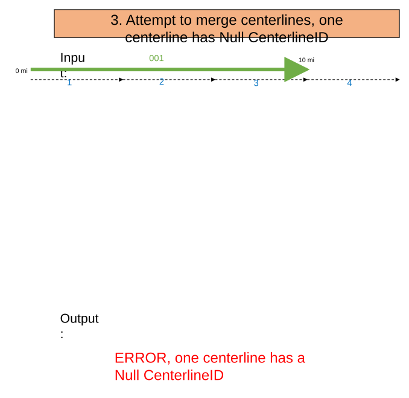

### TC-U18 — Attempt to merge centerlines in a UNAPR dataset (case 4) <!-- src: S2 · slide 25 · case 4 -->

| Pipeline Line Attribute Table |  |  |
| --- | --- | --- |
| CenterlineID | Attribute1 | Attribute2 |
| 1 | Distribution Pipe | Coated |
| 2 | Distribution Pipe | Coated |
| 3 | Distribution Pipe | Coated |
| 4 | Distribution Pipe | Coated |

| CenterlineSequenceTable |  |  |  |  |
| --- | --- | --- | --- | --- |
| Centerline ID | Network ID | Route ID | From Date | To Date |
| 1 | Network1 | 001 | 1/1/2000 | Null |
| 2 | Network1 | 001 | 1/1/2000 | Null |
| 3 | Network1 | 001 | 1/1/2000 | Null |
| 4 | Network1 | 001 | 1/1/2000 | Null |

| LRS Network Attribute Table |  |  |
| --- | --- | --- |
| Route Name | From Date | To Date |
| Route 001 | 1/1/2000 | Null |

ERROR, centerlines cannot be merged in UNAPR dataset

[figure: Input: · Output: · 1–4 · 001 · 10 mi · 0 mi]

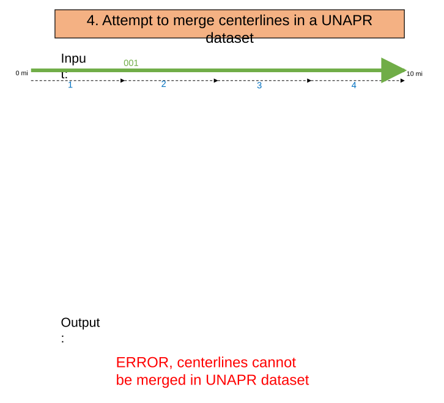

### TC-U19 — Attempt to merge centerlines using the core Merge tool (case 5) <!-- src: S2 · slide 26 · case 5 -->

| Centerline Attribute Table |  |  |
| --- | --- | --- |
| CenterlineID | Attribute1 | Attribute2 |
| Null | Null | Null |
| Null | Null | Null |
| Null | Null | Null |
| Null | Null | Null |

| CenterlineSequenceTable |  |  |  |  |
| --- | --- | --- | --- | --- |
| Centerline ID | Network ID | Route ID | From Date | To Date |
| No records |  |  |  |  |

ERROR, centerlines cannot be merged using the core Merge tool

[figure: Input: · Output: · 1–4]

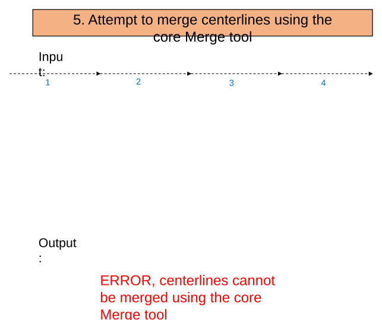

### TC-U20 — Merge Centerlines (case 6) <!-- src: S1 · slide 27 · case 6 -->

- **Case:** Merge centerlines, route has time slices that prevent centerline from being merged

| Centerline Attribute Table |  |  |
| --- | --- | --- |
| CenterlineID | Attribute1 | Attribute2 |
| 1 | Null | Inactive |
| 2 | State | Active |
| 3 | State | Active |
| 4 | Null | Inactive |

| CenterlineSequenceTable |  |  |  |  |
| --- | --- | --- | --- | --- |
| Centerline ID | Network ID | Route ID | From Date | To Date |
| 2 | 1 | 001 | 1/1/2000 | Null |
| 3 | 1 | 001 | 1/1/2005 | Null |
| 4 | 1 | 001 | 1/1/2010 | Null |

| LRS Network Attribute Table |  |  |
| --- | --- | --- |
| RouteID | From Date | To Date |
| 001 | 1/1/2000 | 1/1/2005 |
| 001 | 1/1/2005 | 1/1/2010 |
| 001 | 1/1/2010 | Null |

ERROR, associated routes have time slices that prevent the centerlines from being merged

[figure: 001, 1/1/2000-1/1/2005 · 001, 1/1/2005-1/1/2010 · 001, 1/1/2010-Null · Input: · Output: · 1–4 · 10 mi · 0 mi · 5 mi · 15 mi]

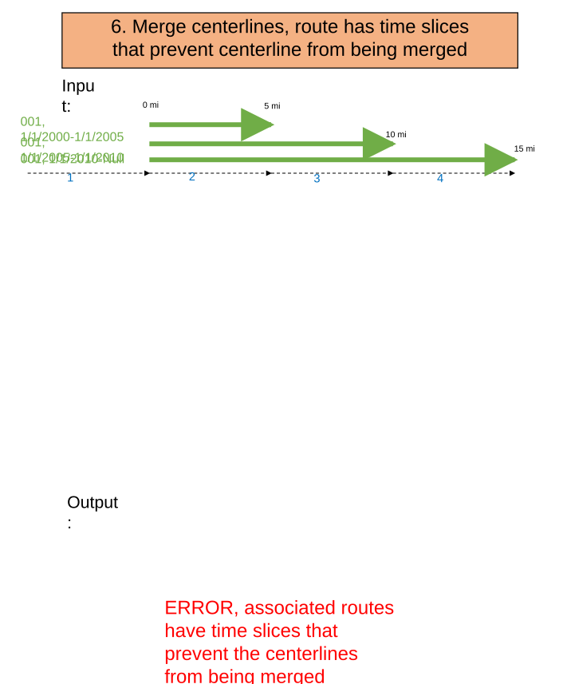

### TC-U21 — Attempt To Merge Centerlines (case 7) <!-- src: S1 · slide 28 · case 7 -->

- **Case:** Attempt to merge centerlines, route associated with input centerlines is locked by user in another version

| Centerline Attribute Table |  |  |
| --- | --- | --- |
| CenterlineID | Attribute1 | Attribute2 |
| 1 | State | Active |
| 2 | State | Active |
| 3 | State | Active |
| 4 | Null | Null |

| CenterlineSequenceTable |  |  |  |  |
| --- | --- | --- | --- | --- |
| Centerline ID | Network ID | Route ID | From Date | To Date |
| 1 | Network1 | 001 | 1/1/2000 | Null |
| 2 | Network1 | 001 | 1/1/2000 | Null |
| 3 | Network1 | 001 | 1/1/2000 | Null |

| LRS Network Attribute Table |  |  |
| --- | --- | --- |
| RouteID | From Date | To Date |
| 001 | 1/1/2000 | Null |

ERROR, associated route is locked by user in another version

| Locks Table |  |  |  |  |  |
| --- | --- | --- | --- | --- | --- |
| RouteID | Event | User | Date | Version | Releasable |
| 001 |  | Editor1 | XX/XX/XXXX | Editor.Version1 | No |

[figure: Input: · Output: · 1–4 · 10 mi · 0 mi]

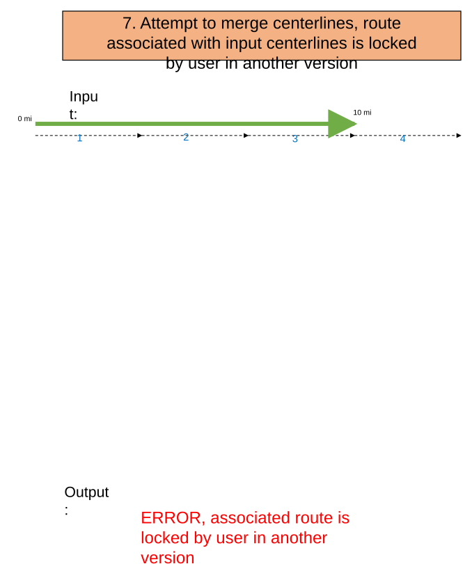

### TC-U22 — Attempt To Merge Centerlines, Resultant Merged Centerline Is Not Singlepart (case 8) <!-- src: S1 · slide 29 · case 8 -->

- **Case:** Attempt to merge centerlines, resultant merged centerline is not singlepart (also test with Null CenterlineID centerlines)

| Centerline Attribute Table |  |  |
| --- | --- | --- |
| CenterlineID | Attribute1 | Attribute2 |
| 1 | State | Active |
| 2 | State | Active |
| 3 | State | Active |
| 4 | State | Active |

| CenterlineSequenceTable |  |  |  |  |
| --- | --- | --- | --- | --- |
| Centerline ID | Network ID | Route ID | From Date | To Date |
| 1 | Network1 | 001 | 1/1/2000 | Null |
| 2 | Network1 | 001 | 1/1/2000 | Null |
| 3 | Network1 | 001 | 1/1/2000 | Null |
| 4 | Network1 | 001 | 1/1/2000 | Null |

| LRS Network Attribute Table |  |  |
| --- | --- | --- |
| RouteID | From Date | To Date |
| 001 | 1/1/2000 | Null |

ERROR, merged centerline must be a singlepart feature

[figure: Input: · Output: · 1–4 · 10 mi · 0 mi]

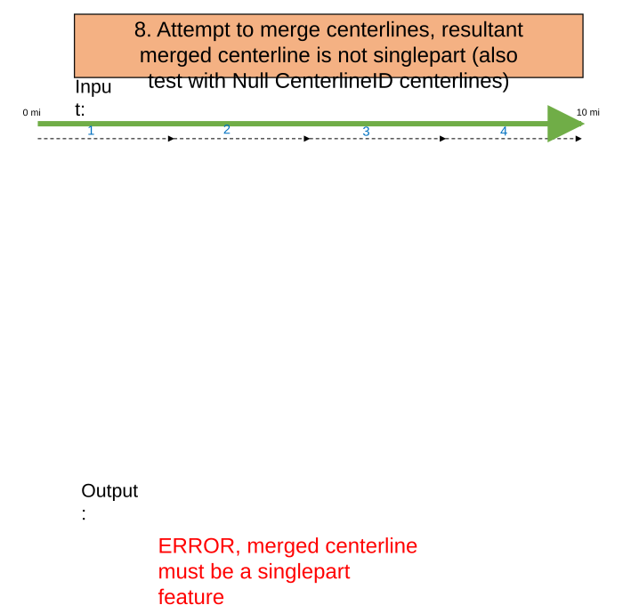

### TC-U23 — Attempt To Merge Centerlines (case 9) <!-- src: S1 · slide 30 · case 9 -->

- **Case:** Attempt to merge centerlines, input centerlines are associated with other LRS Network route feature and cannot merge

| Centerline Attribute Table |  |  |
| --- | --- | --- |
| CenterlineID | Attribute1 | Attribute2 |
| 1 | Null | Inactive |
| 2 | Shared | Active |
| 3 | Shared | Active |
| 4 | County | Active |

| CenterlineSequenceTable |  |  |  |  |
| --- | --- | --- | --- | --- |
| Centerline ID | Network ID | Route ID | From Date | To Date |
| 2 | Network1 | 001 | 1/1/2000 | Null |
| 3 | Network1 | 001 | 1/1/2000 | Null |
| 2 | Network2 | 45A | 1/1/2000 | Null |
| 3 | Network2 | 45A | 1/1/2000 | Null |
| 4 | Network2 | 45A | 1/1/2000 | Null |

| LRS Network Attribute Table |  |  |  |
| --- | --- | --- | --- |
| LRS Network | Route ID | From Date | To Date |
| Network1 | 001 | 1/1/2000 | Null |
| Network2 | 45A | 1/1/2000 | Null |

ERROR, input centerlines are not shared with associated routes that belong to different LRS Networks

[figure: 001 · 45A · Input: · Output: · 1–4 · 10 mi · 0 mi · 15 mi]

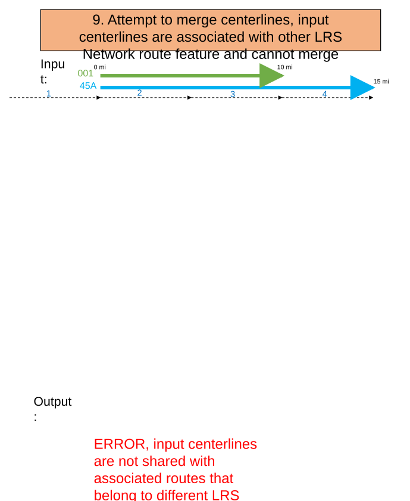

### TC-U24 — Attempt To Merge Centerlines That Do Not Have Exact Attributes in an ADMRH (case 10) <!-- src: S1 · slide 31 · case 10 -->

- **Case:** Attempt to merge centerlines that do not have exact attributes in an ADMRH dataset

| Centerline Attribute Table |  |  |  |  |  |  |
| --- | --- | --- | --- | --- | --- | --- |
| Centerline ID | County on Left | County on Right | From Left | To Left | From Right | To Right |
| 1 | Adams | Jackson | 2 | 24 | 1 | 25 |
| 2 | Adams | Jackson | 26 | 50 | 27 | 49 |
| 3 | Adams | Jackson | 52 | 74 | 51 | 75 |
| 4 | Shasta | Jackson | 76 | 100 | 77 | 99 |

| CenterlineSequenceTable |  |  |  |  |
| --- | --- | --- | --- | --- |
| Centerline ID | Network ID | Route ID | From Date | To Date |
| 1 | Network1 | 001 | 1/1/2000 | Null |
| 2 | Network1 | 001 | 1/1/2000 | Null |
| 3 | Network1 | 001 | 1/1/2000 | Null |
| 4 | Network1 | 001 | 1/1/2000 | Null |

| LRS Network Attribute Table |  |  |
| --- | --- | --- |
| RouteID | From Date | To Date |
| 001 | 1/1/2000 | Null |

ERROR, input centerlines are not attribute-exact

[figure: Input: · Output: · 1–4 · 001 · 10 mi · 0 mi]

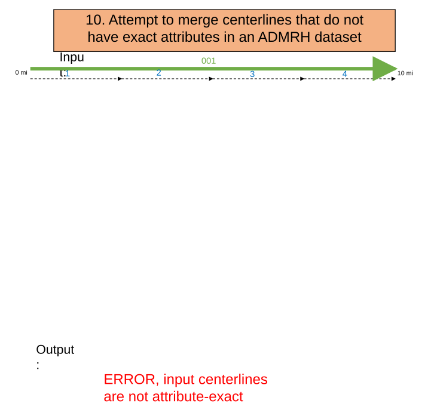

### TC-U25 — Merge Centerlines with Inputs That Make Up a Complex Route Shape (case 11) <!-- src: S1 · slide 32 · case 11 -->

- **Case:** Merge centerlines with inputs that make up a complex route shape, resultant merged centerline is a complex shape

| Centerline Attribute Table |  |  |
| --- | --- | --- |
| CenterlineID | Attribute1 | Attribute2 |
| 1 | State | Active |
| 2 | State | Active |
| 3 | State | Active |
| 4 | State | Active |
| 5 | State | Active |
| 6 | State | Active |

| CenterlineSequenceTable |  |  |  |  |
| --- | --- | --- | --- | --- |
| Centerline ID | Network ID | Route ID | From Date | To Date |
| 1 | Network1 | 001 | 1/1/2000 | Null |
| 2 | Network1 | 001 | 1/1/2000 | Null |
| 3 | Network1 | 001 | 1/1/2000 | Null |
| 4 | Network1 | 001 | 1/1/2000 | Null |
| 5 | Network1 | 001 | 1/1/2000 | Null |
| 6 | Network1 | 001 | 1/1/2000 | Null |

| LRS Network Attribute Table |  |  |
| --- | --- | --- |
| RouteID | From Date | To Date |
| 001 | 1/1/2000 | Null |

ERROR, input centerlines will result in a complex shape

[figure: Input: · Output: · 1–4 · 001 · 10 mi · 0 mi · 5 · 6]

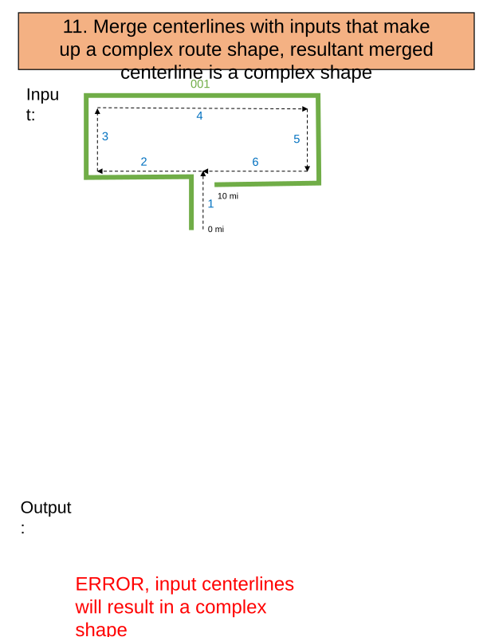

### TC-U26 — Attempt to merge overlapping centerlines associated with routes (case 12) <!-- src: S2 · slide 33 · case 12 -->

| Centerline Attribute Table |  |  |
| --- | --- | --- |
| CenterlineID | Attribute1 | Attribute2 |
| 1 | State | Active |
| 2 | State | Active |
| 3 | State | Active |
| 4 | State | Active |

| CenterlineSequenceTable |  |  |  |  |
| --- | --- | --- | --- | --- |
| Centerline ID | Network ID | Route ID | From Date | To Date |
| 1 | Network1 | 001 | 1/1/2000 | Null |
| 2 | Network1 | 001 | 1/1/2000 | Null |
| 3 | Network1 | 002 | 1/1/2000 | Null |
| 4 | Network1 | 002 | 1/1/2000 | Null |

| LRS Network Attribute Table |  |  |
| --- | --- | --- |
| RouteID | From Date | To Date |
| 001 | 1/1/2000 | Null |
| 002 | 1/1/2000 | Null |

ERROR, input centerlines do not share routes

[figure: Input: · Output: · 1–4 · 10 mi · 0 mi · 001]

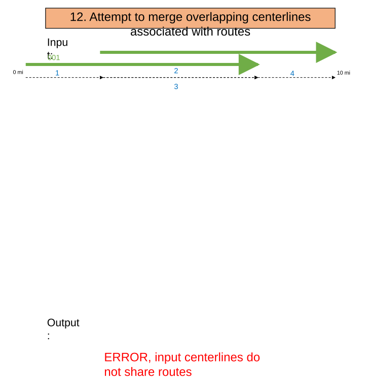

### TC-U27 — Attempt to merge centerlines that are smaller than the XY Tolerance (case 13) <!-- src: S2 · slide 34 · case 13 -->

| Centerline Attribute Table |  |  |
| --- | --- | --- |
| CenterlineID | Attribute1 | Attribute2 |
| Null | Null | Null |
| Null | Null | Null |
| Null | Null | Null |
| Null | Null | Null |

| CenterlineSequenceTable |  |  |  |  |
| --- | --- | --- | --- | --- |
| Centerline ID | Network ID | Route ID | From Date | To Date |
| No records |  |  |  |  |

XY Tolerance is 0.001 meters
ERROR, input centerlines are smaller than the XY Tolerance

[figure: Input: · Output: · 1–4 · 0.0004 m · 0 m]

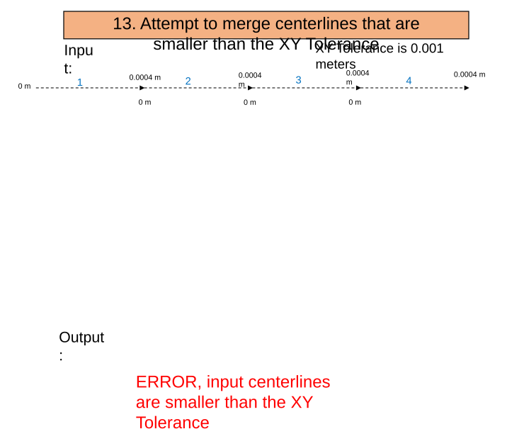

### TC-U28 — Attempt to merge centerlines with only one centerline selected (case 14) <!-- src: S2 · slide 35 · case 14 -->

| Centerline Attribute Table |  |  |
| --- | --- | --- |
| CenterlineID | Attribute1 | Attribute2 |
| Null | Null | Null |
| Null | Null | Null |
| Null | Null | Null |
| Null | Null | Null |

| CenterlineSequenceTable |  |  |  |  |
| --- | --- | --- | --- | --- |
| Centerline ID | Network ID | Route ID | From Date | To Date |
| No records |  |  |  |  |

ERROR, only one centerline is selected

[figure: Input: · Output: · 1–4]

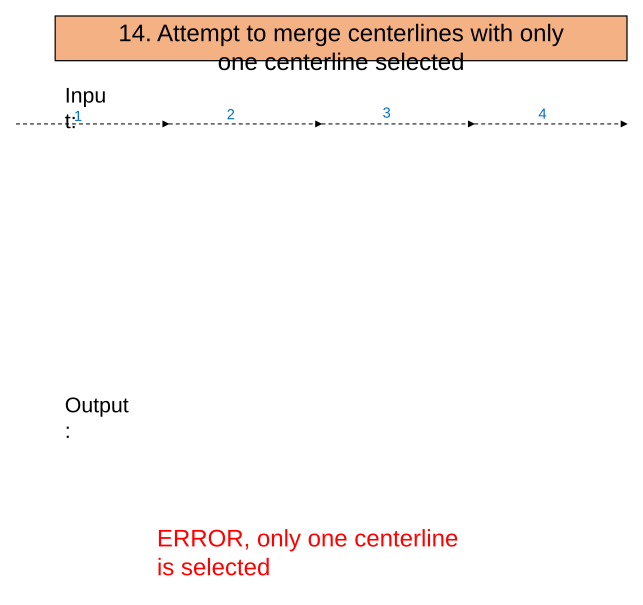

### TC-U29 — Attempt to merge centerlines with no centerlines selected (case 15) <!-- src: S2 · slide 36 · case 15 -->

| Centerline Attribute Table |  |  |
| --- | --- | --- |
| CenterlineID | Attribute1 | Attribute2 |
| Null | Null | Null |
| Null | Null | Null |
| Null | Null | Null |
| Null | Null | Null |

| CenterlineSequenceTable |  |  |  |  |
| --- | --- | --- | --- | --- |
| Centerline ID | Network ID | Route ID | From Date | To Date |
| No records |  |  |  |  |

ERROR, no centerlines are selected

[figure: Input: · Output: · 1–4]

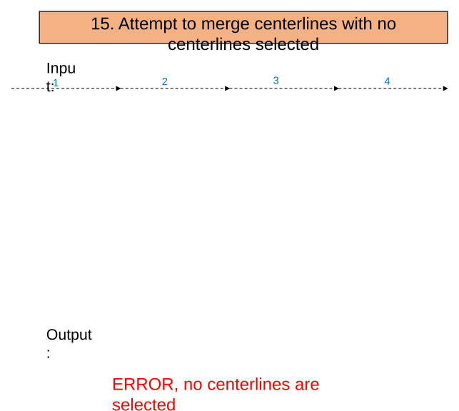

### TC-U30 — Attempt To Merge Centerlines in an ADMRH Dataset with Centerlines That Are Not (case 16) <!-- src: S1 · slide 37 · case 16 -->

- **Case:** Attempt to merge centerlines in an ADMRH dataset with centerlines that are not all in the same direction

| CenterlineSequenceTable |  |  |  |  |
| --- | --- | --- | --- | --- |
| Centerline ID | Network ID | Route ID | From Date | To Date |
| 1 | Network1 | 001 | 1/1/2000 | Null |
| 2 | Network1 | 001 | 1/1/2000 | Null |
| 3 | Network1 | 001 | 1/1/2000 | Null |
| 4 | Network1 | 001 | 1/1/2000 | Null |

| LRS Network Attribute Table |  |  |
| --- | --- | --- |
| RouteID | From Date | To Date |
| 001 | 1/1/2000 | Null |

| Centerline Attribute Table |  |  |  |  |  |  |
| --- | --- | --- | --- | --- | --- | --- |
| Centerline ID | County on Left | County on Right | From Left | To Left | From Right | To Right |
| 1 | Adams | Jackson | 2 | 24 | 1 | 25 |
| 2 | Adams | Jackson | 27 | 49 | 26 | 50 |
| 3 | Adams | Jackson | 52 | 74 | 51 | 75 |
| 4 | Adams | Jackson | 76 | 100 | 77 | 99 |

ERROR, centerlines in an ADMRH dataset must all be in the same direction

[figure: Input: · Output: · 1–4 · 001 · 10 mi · 0 mi]

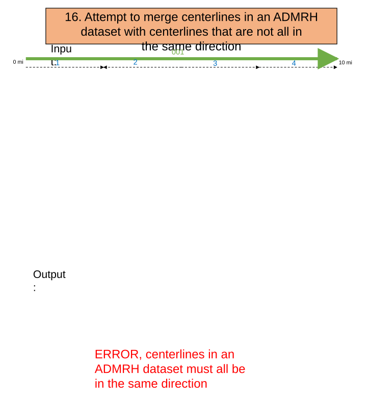

### TC-U31 — Attempt To Merge Centerlines That Do Not Share Z Values at Intersection Points (case 17) <!-- src: S1 · slide 38 · case 17 -->

| Centerline Attribute Table |  |  |
| --- | --- | --- |
| CenterlineID | Attribute1 | Attribute2 |
| 1 | State | Active |
| 2 | State | Active |
| 3 | State | Active |
| 4 | State | Active |

| CenterlineSequenceTable |  |  |  |  |
| --- | --- | --- | --- | --- |
| Centerline ID | Network ID | Route ID | From Date | To Date |
| 1 | Network1 | 001 | 1/1/2000 | Null |
| 2 | Network1 | 001 | 1/1/2000 | Null |
| 3 | Network1 | 001 | 1/1/2000 | Null |
| 4 | Network1 | 001 | 1/1/2000 | Null |

| LRS Network Attribute Table |  |  |
| --- | --- | --- |
| RouteID | From Date | To Date |
| 001 | 1/1/2000 | Null |

ERROR, merged centerlines cannot be multipart

[figure: Input: · Output: · 1–4 · 001 · 10 mi · 0 mi]

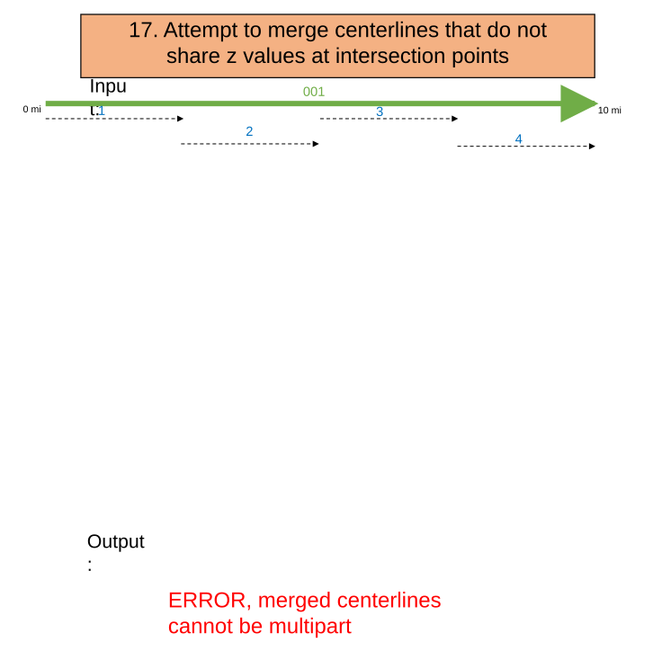

### TC-U32 — Attempt To Merge Centerlines, One Centerline Has Manually Populated CenterlineID (case 18) <!-- src: S1 · slide 39 · case 18 -->

| Centerline Attribute Table |  |  |
| --- | --- | --- |
| CenterlineID | Attribute1 | Attribute2 |
| 1 | State | Active |
| 2 | State | Active |
| 3 | State | Active |
| 99 | State | Active |

| CenterlineSequenceTable |  |  |  |  |
| --- | --- | --- | --- | --- |
| Centerline ID | Network ID | Route ID | From Date | To Date |
| 1 | Network1 | 001 | 1/1/2000 | Null |
| 2 | Network1 | 001 | 1/1/2000 | Null |
| 3 | Network1 | 001 | 1/1/2000 | Null |

| LRS Network Attribute Table |  |  |
| --- | --- | --- |
| RouteID | From Date | To Date |
| 001 | 1/1/2000 | Null |

ERROR, centerlines do not share routes

[figure: Input: · Output: · 1–4 · 001 · 10 mi · 0 mi]

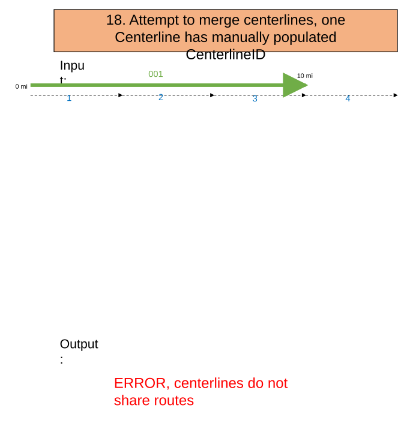

### TC-U33 — Attempt To Merge Overlapping 2D Centerlines Not Associated with Routes That Do (case 19) <!-- src: S1 · slide 40 · case 19 -->

- **Case:** Attempt to merge overlapping 2D centerlines not associated with routes that do not overlap in 3D space

| Centerline Attribute Table |  |  |
| --- | --- | --- |
| CenterlineID | Attribute1 | Attribute2 |
| Null | Null | Null |
| Null | Null | Null |
| Null | Null | Null |
| Null | Null | Null |

ERROR, merged centerline will not be a singlepart feature

[figure: Input: · Output: · 1–4 · 10 mi · 0 mi]

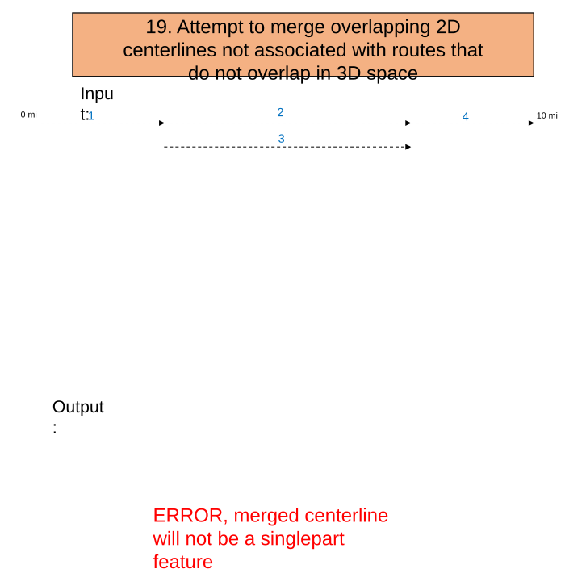

## Other content

### Slide 14 <!-- slide 14 -->

11A. Merge centerlines, conflict prevention is enabled and route lock must be acquired prior to merge (REST)

| Centerline Attribute Table |  |  |
| --- | --- | --- |
| CenterlineID | Attribute1 | Attribute2 |
| 1 | Null | Null |
| 2 | Null | Null |
| 3 | Null | Null |
| 4 | Null | Null |

| CenterlineSequenceTable |  |  |  |  |
| --- | --- | --- | --- | --- |
| Centerline ID | Network ID | Route ID | From Date | To Date |
| 1 | Network1 | 001 | 1/1/2000 | Null |
| 2 | Network1 | 001 | 1/1/2000 | Null |
| 3 | Network1 | 001 | 1/1/2000 | Null |
| 4 | Network1 | 001 | 1/1/2000 | Null |

| LRS Network Attribute Table |  |  |
| --- | --- | --- |
| RouteID | From Date | To Date |
| 001 | 1/1/2000 | Null |

| CenterlineSequenceTable |  |  |  |  |
| --- | --- | --- | --- | --- |
| Centerline ID | Network ID | Route ID | From Date | To Date |
| 1 | Network1 | 001 | 1/1/2000 | Null |

| Centerline Attribute Table |  |  |
| --- | --- | --- |
| CenterlineID | Attribute1 | Attribute2 |
| 1 | Null | Null |

| Locks Table (Lock acquired prior to merge) |  |  |  |  |  |
| --- | --- | --- | --- | --- | --- |
| RouteID | Event | User | Date | Version | Releasable |
| 001 |  | Editor1 | XX/XX/XXXX | Editor.Version1 | No |

| Locks Table |  |  |  |  |  |
| --- | --- | --- | --- | --- | --- |
| RouteID | Event | User | Date | Version | Releasable |
| 001 |  | Editor1 | XX/XX/XXXX | Editor.Version1 | No |

[figure: Input: · Output: · 1–4 · 001 · 10 mi · 0 mi · 1]

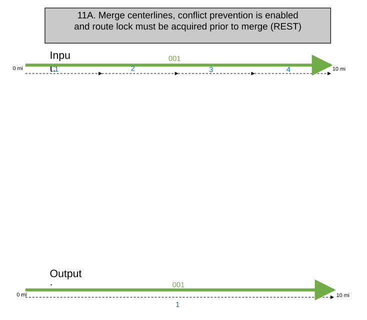

### Slide 17 — 13A. Merge centerlines with a gap that is within the XY Tolerance <!-- slide 17 -->

| Centerline Attribute Table |  |  |
| --- | --- | --- |
| CenterlineID | Attribute1 | Attribute2 |
| Null | Null | Null |
| Null | Null | Null |
| Null | Null | Null |
| Null | Null | Null |

| CenterlineSequenceTable |  |  |  |  |
| --- | --- | --- | --- | --- |
| Centerline ID | Network ID | Route ID | From Date | To Date |
| No records |  |  |  |  |

| CenterlineSequenceTable |  |  |  |  |
| --- | --- | --- | --- | --- |
| Centerline ID | Network ID | Route ID | From Date | To Date |
| No records |  |  |  |  |

| Centerline Attribute Table |  |  |
| --- | --- | --- |
| CenterlineID | Attribute1 | Attribute2 |
| Null | Null | Null |

XY Tolerance is 0.001 meters

[figure: Input: · Output: · 1–4 · 0 mi · 0 m · 10 mi · 0.0009 m gap]

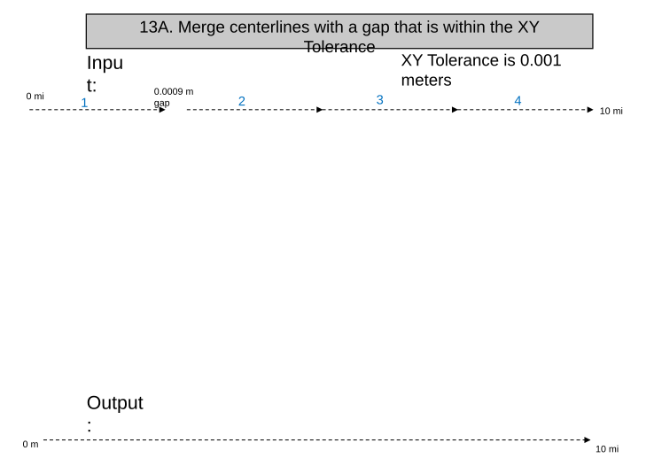

### Slide 22 <!-- slide 22 -->

2A. Attempt to merge centerlines that are not part of the same route but belong to the same line

| Centerline Attribute Table |  |  |
| --- | --- | --- |
| CenterlineID | Attribute1 | Attribute2 |
| 1 | Transmission | Active |
| 2 | Transmission | Active |
| 3 | Transmission | Active |
| 4 | Transmission | Active |

| LRS Network Attribute Table |  |  |  |
| --- | --- | --- | --- |
| Line Name | Route Name | From Date | To Date |
| Line1 | L1_R1 | 1/1/2000 | Null |
| Line1 | L1_R1 | 1/1/2000 | Null |

ERROR, centerlines belong to more than one route and cannot be merged

| CenterlineSequenceTable |  |  |  |  |
| --- | --- | --- | --- | --- |
| Centerline ID | Network ID | Route ID | From Date | To Date |
| 1 | Network1 | 001 | 1/1/2000 | Null |
| 2 | Network1 | 001 | 1/1/2000 | Null |
| 3 | Network1 | 002 | 1/1/2000 | Null |
| 4 | Network1 | 002 | 1/1/2000 | Null |

[figure: Input: · Output: · 1–4 · L1_R1 · L1_R2 · 10 mi · 0 mi]

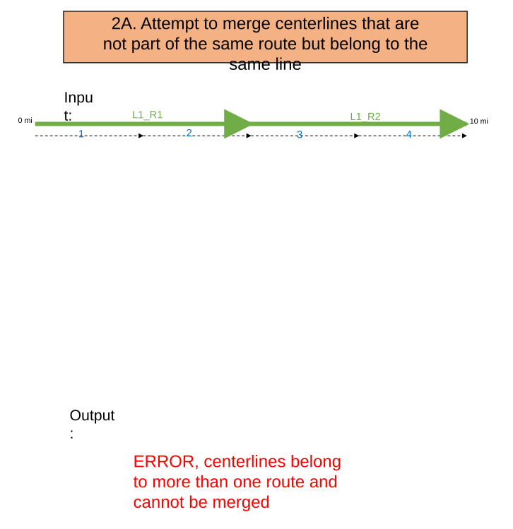

### Slide 23 <!-- slide 23 -->

2B. Attempt to merge centerlines that are not part of the same route and do not belong to the same line

| Centerline Attribute Table |  |  |
| --- | --- | --- |
| CenterlineID | Attribute1 | Attribute2 |
| 1 | Transmission | Active |
| 2 | Transmission | Active |
| 3 | Transmission | Active |
| 4 | Transmission | Active |

| LRS Network Attribute Table |  |  |  |
| --- | --- | --- | --- |
| Line Name | Route Name | From Date | To Date |
| Line1 | L1_R1 | 1/1/2000 | Null |
| Line2 | L2_R1 | 1/1/2000 | Null |

ERROR, centerlines belong to more than one route and cannot be merged

| CenterlineSequenceTable |  |  |  |  |
| --- | --- | --- | --- | --- |
| Centerline ID | Network ID | Route ID | From Date | To Date |
| 1 | Network1 | 001 | 1/1/2000 | Null |
| 2 | Network1 | 001 | 1/1/2000 | Null |
| 3 | Network1 | 002 | 1/1/2000 | Null |
| 4 | Network1 | 002 | 1/1/2000 | Null |

[figure: Input: · Output: · 1–4 · L1_R1 · L2_R1 · 10 mi · 0 mi]

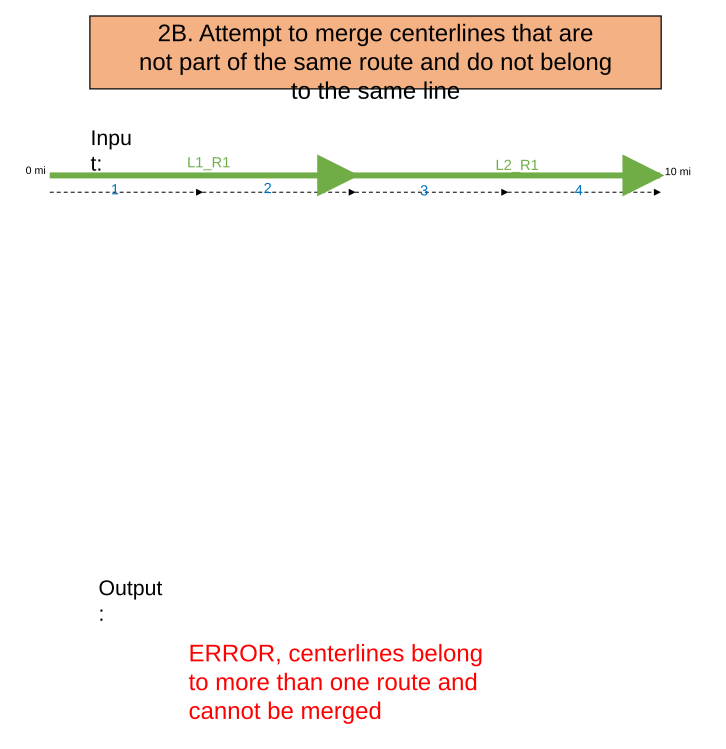
