# Retire Routes: Snap Event Behavior Test Plan

| Field | Value |
| --- | --- |
| **Doc** | 454 · Test Plan · Experience Builder |
| **Product** | Roads & Highways · Pipeline Referencing |
| **Release** | — |
| **Issues** | [ArcGISPro/ps-location-referencing#3780](https://devtopia.esri.com/ArcGISPro/ps-location-referencing/issues/3780) |
| **Source** | [3780-RetireRoutesSnapEB_TestPlanV3.pptx](<https://esriis.sharepoint.com/sites/LocationReferencing/Shared%20Documents/General/Test%20Plans/3780-RetireRoutesSnapEB_TestPlanV3.pptx>) · rev V3 |
| **People** | author Mac Christmas · PE — · dev — |
| **Edited** | 2023-12-04 18:55 by Mac Christmas |
| **Extracted** | 2026-09-04 · lane xmlstrip · format 3.0 · prompt v2.0.2 |
| **Keywords** | retire route · snap event behavior · event behavior · concurrent routes · route retirement · recalibrate downstream · line event · point event · route dominance |
| **Tools** | Retire Routes |

## Summary

This test plan covers the Snap Event Behavior functionality in the Retire Routes process, ensuring compatibility with ArcMap and ArcGIS Pro. It includes positive test cases for various scenarios such as retiring whole, partial, middle sections, and multiple routes with events configured for Snap Event Behavior, concurrent routes, recalibration downstream, and different network types. The document also provides detailed event and route data tables illustrating test scenarios and expected behaviors.

## Related documents

<!-- related:begin -->
- [Support Snap Event Behavior in Retire Routes](<https://esriis.sharepoint.com/sites/lrsworkspace/LRS Doc Index/User Stories/3780-support-snap-eb-in-retire-routes-rh-apr-v5.md>) — shared issue ArcGISPro/ps-location-referencing#3780 · similar text 0.72 · 5 title words · 2 filename words · same surface <!-- rel:478 s=1007.294 -->
- [Support Snap Event Behavior in Retire Routes](<https://esriis.sharepoint.com/sites/lrsworkspace/LRS Doc Index/User Stories/3780-support-snap-eb-in-retire-routes-rh-apr-v4.md>) — shared issue ArcGISPro/ps-location-referencing#3780 · similar text 0.72 · 5 title words · 2 filename words · same surface <!-- rel:479 s=1007.164 -->
- [Transfer to Another Line – Support Snap Event Behavior Test Plan](<https://esriis.sharepoint.com/sites/lrsworkspace/LRS Doc Index/Test Plans/transfer-to-another-line-support-snap-eb-rh-apr-2023-08-2.md>) — similar text 0.12 · 3 title words · 1 filename word · same kind/surface/folder <!-- rel:527 s=4.357 -->
- [Reassign - Transfer to Another Line with StayPut and Retire Event Behavior - Test Plan](<https://esriis.sharepoint.com/sites/lrsworkspace/LRS%20Doc%20Index/Test%20Plans/5140-reassign-transfer-to-another-line-with-stayput-and-retire-eb.md>) — similar text 0.15 · 3 title words · 1 filename word · same kind/folder <!-- rel:528 s=4.215 -->
- [Reassign Route Transfer to Another Line Method: Support Move Event Behavior Test Plan](<https://esriis.sharepoint.com/sites/lrsworkspace/LRS Doc Index/Test Plans/5141-reassign-route-transfer-to-another-line-method-support-move.md>) — similar text 0.22 · 2 title words · same kind/folder <!-- rel:533 s=2.899 -->
<!-- related:end -->

<!-- docs:begin -->
## Esri documentation

[Retire routes](https://doc.esri.com/en/arcgis-pro/latest/help/production/roads-highways/retire-routes.html) · [Event behavior](https://doc.esri.com/en/arcgis-pro/latest/help/production/roads-highways/what-is-event-behavior.html)
<!-- docs:end -->

---

## Test Cases

### TC-P01 — Snap EB configuration for Retire can be chosen in Modify Event Behavior Rules <!-- src: S4 · slide 1 · Positive Tests: GP Tools · 1 -->

- **Group:** GP Tools

### TC-P02 — Snap EB configuration for Retire can be chosen in Configure External Events <!-- src: S4 · slide 1 · Positive Tests: GP Tools · 2 -->

- **Group:** GP Tools

### TC-P03 — Snap EB configuration for Retire will carry over when migrating an ArcMap <!-- src: S4 · slide 1 · Positive Tests: GP Tools · 3 -->

- **Group:** GP Tools
- **Case:** Snap EB configuration for Retire will carry over when migrating an ArcMap dataset to Pro

### TC-P04 — Arcpy.Describe will show Snap EB for Retire in metadata <!-- src: S4 · slide 1 · Positive Tests: Other · 1 -->

- **Group:** Other

### TC-P05 — In Layer Properties <!-- src: S4 · slide 1 · Positive Tests: Other · 2 -->

- **Group:** Other
- **Case:** In Layer Properties, the Location Referencing section will show the Retire EB as Snap

### TC-P06 — Retire whole route with concurrent route present <!-- src: S4 · slide 1 · Positive Tests: Nonline Network · 1 -->

- **Group:** Nonline Network
- **Case:** Retire whole route with concurrent route present, events snap to concurrent route

### TC-P07 — Retire first half of route with concurrent route present <!-- src: S4 · slide 1 · Positive Tests: Nonline Network · 2 -->

- **Group:** Nonline Network
- **Case:** Retire first half of route with concurrent route present, events in retired portion split and snap to concurrent route

### TC-P08 — Retire middle portion of route with concurrent route present <!-- src: S4 · slide 1 · Positive Tests: Nonline Network · 3 -->

- **Group:** Nonline Network
- **Case:** Retire middle portion of route with concurrent route present, events in retired portion split and snap to concurrent route

### TC-P09 — Retire second half of route with concurrent route present <!-- src: S4 · slide 1 · Positive Tests: Nonline Network · 4 -->

- **Group:** Nonline Network
- **Case:** Retire second half of route with concurrent route present, events in retired portion split and snap to concurrent route

### TC-P10 — Retire whole route with partially concurrent route present <!-- src: S4 · slide 1 · Positive Tests: Nonline Network · 5 -->

- **Group:** Nonline Network
- **Case:** Retire whole route with partially concurrent route present, events in concurrent section split and snap to concurrent route

### TC-P11 — Retire whole route with multiple concurrent routes present <!-- src: S4 · slide 1 · Positive Tests: Nonline Network · 6 -->

- **Group:** Nonline Network
- **Case:** Retire whole route with multiple concurrent routes present, events snap to dominant concurrent route

### TC-P12 — Retire whole route with gapped concurrent route present <!-- src: S4 · slide 1 · Positive Tests: Nonline Network · 7 -->

- **Group:** Nonline Network
- **Case:** Retire whole route with gapped concurrent route present, events split and snap to concurrent route

### TC-P13 — Retire whole route with no concurrent route present <!-- src: S4 · slide 1 · Positive Tests: Nonline Network · 8 -->

- **Group:** Nonline Network
- **Case:** Retire whole route with no concurrent route present, events will stay put and retire

### TC-P14 — Retire whole route with multiple partial concurrencies present <!-- src: S4 · slide 1 · Positive Tests: Nonline Network · 9 -->

- **Group:** Nonline Network
- **Case:** Retire whole route with multiple partial concurrencies present, events snap to concurrent routes

### TC-P15 — Retire partial route with concurrent route present <!-- src: S4 · slide 1 · Positive Tests: Nonline Network · 10 -->

- **Group:** Nonline Network
- **Case:** Retire partial route with concurrent route present, point event is on cusp of retirement on source route

### TC-P16 — Retired route is gapped with a concurrent route present (1) <!-- src: S4 · slide 1 · Positive Tests: Nonline Network · 11 -->

- **Group:** Nonline Network

### TC-P17 — Retire route with non-proportional concurrent route present (1) <!-- src: S4 · slide 1 · Positive Tests: Nonline Network · 12 -->

- **Group:** Nonline Network

### TC-P18 — Retire complex route with concurrent route present (1) <!-- src: S4 · slide 1 · Positive Tests: Nonline Network · 13 -->

- **Group:** Nonline Network

### TC-P19 — Retire vertical route with concurrent route present (1) <!-- src: S4 · slide 1 · Positive Tests: Nonline Network · 14 -->

- **Group:** Nonline Network

### TC-P20 — Retire partial route with concurrent route present and recalibrate downstream (1) <!-- src: S4 · slide 1 · Positive Tests: Nonline Network · 15 -->

- **Group:** Nonline Network
- **Case:** Retire partial route with concurrent route present and recalibrate downstream is checked with events having Stay Put Calibrate EB

### TC-P21 — Retire partial route with concurrent route present and recalibrate downstream (2) <!-- src: S4 · slide 1 · Positive Tests: Nonline Network · 16 -->

- **Group:** Nonline Network
- **Case:** Retire partial route with concurrent route present and recalibrate downstream is checked with events having Move Calibrate EB

### TC-P22 — Retire partial route with concurrent route present and recalibrate downstream (3) <!-- src: S4 · slide 1 · Positive Tests: Nonline Network · 17 -->

- **Group:** Nonline Network
- **Case:** Retire partial route with concurrent route present and recalibrate downstream is checked with events having Retire Calibrate EB

### TC-P23 — Retire whole route with time sliced concurrent route present. (1) <!-- src: S4 · slide 1 · Positive Tests: Nonline Network · 18 -->

- **Group:** Nonline Network

### TC-P24 — Retire all routes on a line with concurrent route present <!-- src: S4 · slide 2 · Positive Tests: Line Network · 1 -->

- **Group:** Line Network
- **Case:** Retire all routes on a line with concurrent route present, events snap to concurrent route

### TC-P25 — Retire first half of routes on a line with concurrent route present <!-- src: S4 · slide 2 · Positive Tests: Line Network · 2 -->

- **Group:** Line Network
- **Case:** Retire first half of routes on a line with concurrent route present, events in retired portion split and snap to concurrent route

### TC-P26 — Retire middle route on a line with concurrent route present <!-- src: S4 · slide 2 · Positive Tests: Line Network · 3 -->

- **Group:** Line Network
- **Case:** Retire middle route on a line with concurrent route present, events in retired portion split and snap to concurrent route

### TC-P27 — Retire last half of routes on a line with concurrent route present <!-- src: S4 · slide 2 · Positive Tests: Line Network · 4 -->

- **Group:** Line Network
- **Case:** Retire last half of routes on a line with concurrent route present, events in retired portion split and snap to concurrent route

### TC-P28 — Retire whole route on a line with partially concurrent route present <!-- src: S4 · slide 2 · Positive Tests: Line Network · 5 -->

- **Group:** Line Network
- **Case:** Retire whole route on a line with partially concurrent route present, events in concurrent section split and snap to concurrent route

### TC-P29 — Retire whole route on a line with multiple concurrent routes present <!-- src: S4 · slide 2 · Positive Tests: Line Network · 6 -->

- **Group:** Line Network
- **Case:** Retire whole route on a line with multiple concurrent routes present, events snap to dominant concurrent route

### TC-P30 — Retire all routs on a line with concurrent gapped route <!-- src: S4 · slide 2 · Positive Tests: Line Network · 7 -->

- **Group:** Line Network
- **Case:** Retire all routs on a line with concurrent gapped route, events split and snap to concurrent route

### TC-P31 — Retire all routes on a line with no concurrent route present <!-- src: S4 · slide 2 · Positive Tests: Line Network · 8 -->

- **Group:** Line Network
- **Case:** Retire all routes on a line with no concurrent route present, events will stay put and retire

### TC-P32 — Retired route is gapped with a concurrent route present (2) <!-- src: S4 · slide 2 · Positive Tests: Line Network · 9 -->

- **Group:** Line Network

### TC-P33 — Retire route with non-proportional concurrent route present (2) <!-- src: S4 · slide 2 · Positive Tests: Line Network · 10 -->

- **Group:** Line Network

### TC-P34 — Retire complex route with concurrent route present (2) <!-- src: S4 · slide 2 · Positive Tests: Line Network · 11 -->

- **Group:** Line Network

### TC-P35 — Retire vertical route with concurrent route present (2) <!-- src: S4 · slide 2 · Positive Tests: Line Network · 12 -->

- **Group:** Line Network

### TC-P36 — Retire partial route with concurrent route present and recalibrate downstream (4) <!-- src: S4 · slide 2 · Positive Tests: Line Network · 13 -->

- **Group:** Line Network
- **Case:** Retire partial route with concurrent route present and recalibrate downstream is checked with events having Stay Put Calibrate EB

### TC-P37 — Retire partial route with concurrent route present and recalibrate downstream (5) <!-- src: S4 · slide 2 · Positive Tests: Line Network · 14 -->

- **Group:** Line Network
- **Case:** Retire partial route with concurrent route present and recalibrate downstream is checked with events having Move Calibrate EB

### TC-P38 — Retire partial route with concurrent route present and recalibrate downstream (6) <!-- src: S4 · slide 2 · Positive Tests: Line Network · 15 -->

- **Group:** Line Network
- **Case:** Retire partial route with concurrent route present and recalibrate downstream is checked with events having Retire Calibrate EB

### TC-P39 — Retire whole route with time sliced concurrent route present. (2) <!-- src: S4 · slide 2 · Positive Tests: Line Network · 16 -->

- **Group:** Line Network

### TC-U01 — Retire whole route <!-- src: S2 · slide 3 · case 1 -->

| RouteID | FromDate | ToDate |
| --- | --- | --- |
| Route1 | 1/1/2000 | NULL |
| Route2 | 1/1/2000 | NULL |

| RouteID | FromDate | ToDate |
| --- | --- | --- |
| Route1 | 1/1/2000 | 1/1/2005 |
| Route2 | 1/1/2000 | NULL |

| Event Layer | EventID | RouteID | From Date | To Date | From Measure | To Measure |
| --- | --- | --- | --- | --- | --- | --- |
| Point | Pt1 | Route1 | 1/1/2000 | NULL | 2 | N/A |
| Point | Pt2 | Route1 | 1/1/2000 | NULL | 8 | N/A |
| Line | Line1 | Route1 | 1/1/2000 | NULL | 0 | 10 |
| Line | Line2 | Route1 | 1/1/2000 | NULL | 0 | 5 |
| Line | Line3 | Route1 | 1/1/2000 | NULL | 3 | 7 |
| Line | Line4 | Route1 | 1/1/2000 | NULL | 5 | 10 |

| Event Layer | EventID | RouteID | From Date | To Date | From Measure | To Measure |
| --- | --- | --- | --- | --- | --- | --- |
| Point | Pt1 | Route1 | 1/1/2000 | 1/1/2005 | 2 | N/A |
| Point | Pt2 | Route1 | 1/1/2000 | 1/1/2005 | 8 | N/A |
| Line | Line1 | Route1 | 1/1/2000 | 1/1/2005 | 0 | 10 |
| Line | Line2 | Route1 | 1/1/2000 | 1/1/2005 | 0 | 5 |
| Line | Line3 | Route1 | 1/1/2000 | 1/1/2005 | 3 | 7 |
| Line | Line4 | Route1 | 1/1/2000 | 1/1/2005 | 5 | 10 |
| Point | Pt1 | Route2 | 1/1/2005 | NULL | 17 | N/A |
| Point | Pt2 | Route2 | 1/1/2005 | NULL | 23 | N/A |
| Line | Line1 | Route2 | 1/1/2005 | NULL | 15 | 25 |
| Line | Line2 | Route2 | 1/1/2005 | NULL | 15 | 20 |
| Line | Line3 | Route2 | 1/1/2005 | NULL | 18 | 22 |
| Line | Line4 | Route2 | 1/1/2005 | NULL | 20 | 25 |

[figure: Routes Before Edit: · Routes After Edit: · Events Before Edit: · Events After Edit: · Route1 · Route2 (concurrent) · Post-edit, AEB ran: · 15 · 0 · 10 · 25]

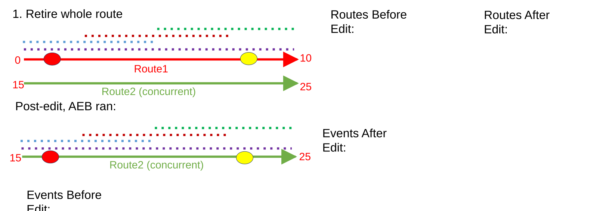

### TC-U02 — Retire first half of route <!-- src: S2 · slide 4 · case 2 -->

| RouteID | FromDate | ToDate |
| --- | --- | --- |
| Route1 | 1/1/2000 | NULL |
| Route2 | 1/1/2000 | NULL |

| RouteID | FromDate | ToDate |
| --- | --- | --- |
| Route1 | 1/1/2000 | 1/1/2005 |
| Route1 | 1/1/2005 | NULL |
| Route2 | 1/1/2000 | NULL |

| Event Layer | EventID | RouteID | From Date | To Date | From Measure | To Measure |
| --- | --- | --- | --- | --- | --- | --- |
| Point | Pt1 | Route1 | 1/1/2000 | NULL | 2 | N/A |
| Point | Pt2 | Route1 | 1/1/2000 | NULL | 8 | N/A |
| Line | Line1 | Route1 | 1/1/2000 | NULL | 0 | 10 |
| Line | Line2 | Route1 | 1/1/2000 | NULL | 0 | 5 |
| Line | Line3 | Route1 | 1/1/2000 | NULL | 3 | 7 |
| Line | Line4 | Route1 | 1/1/2000 | NULL | 5 | 10 |

| Event Layer | EventID | RouteID | From Date | To Date | From Measure | To Measure |
| --- | --- | --- | --- | --- | --- | --- |
| Point | Pt1 | Route1 | 1/1/2000 | 1/1/2005 | 2 | N/A |
| Point | Pt2 | Route1 | 1/1/2000 | NULL | 8 | N/A |
| Line | Line1 | Route1 | 1/1/2000 | 1/1/2005 | 0 | 10 |
| Line | Line2 | Route1 | 1/1/2000 | 1/1/2005 | 0 | 5 |
| Line | Line3 | Route1 | 1/1/2000 | 1/1/2005 | 3 | 7 |
| Line | Line4 | Route1 | 1/1/2000 | NULL | 5 | 10 |
| Point | Pt1 | Route2 | 1/1/2005 | NULL | 2 | N/A |
| Line | Line1 | Route2 | 1/1/2005 | NULL | 15 | 20 |
| Line | Line1 | Route1 | 1/1/2005 | NULL | 5 | 10 |
| Line | Line2 | Route2 | 1/1/2005 | NULL | 15 | 20 |
| Line | Line3 | Route2 | 1/1/2005 | NULL | 18 | 20 |
| Line | Line3 | Route1 | 1/1/2005 | NULL | 5 | 7 |

[figure: Routes Before Edit: · Routes After Edit: · Events Before Edit: · Events After Edit: · Route1 · Route2 (concurrent) · Post-edit, AEB ran: · 15 · 0 · 10 · 5 · 25]

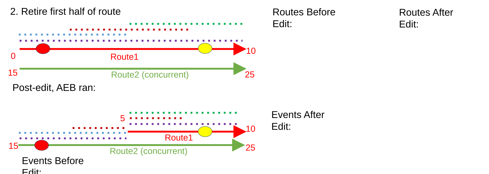

### TC-U03 — Retire middle section of route <!-- src: S2 · slide 5 · case 3 -->

| RouteID | FromDate | ToDate |
| --- | --- | --- |
| Route1 | 1/1/2000 | NULL |
| Route2 | 1/1/2000 | NULL |

| RouteID | FromDate | ToDate |
| --- | --- | --- |
| Route1 | 1/1/2000 | 1/1/2005 |
| Route1 | 1/1/2005 | NULL |
| Route2 | 1/1/2000 | NULL |

| Event Layer | EventID | RouteID | From Date | To Date | From Measure | To Measure |
| --- | --- | --- | --- | --- | --- | --- |
| Point | Pt1 | Route1 | 1/1/2000 | NULL | 2 | N/A |
| Point | Pt2 | Route1 | 1/1/2000 | NULL | 8 | N/A |
| Line | Line1 | Route1 | 1/1/2000 | NULL | 0 | 10 |
| Line | Line2 | Route1 | 1/1/2000 | NULL | 0 | 5 |
| Line | Line3 | Route1 | 1/1/2000 | NULL | 3 | 7 |
| Line | Line4 | Route1 | 1/1/2000 | NULL | 5 | 10 |

| Event Layer | EventID | RouteID | From Date | To Date | From Measure | To Measure |
| --- | --- | --- | --- | --- | --- | --- |
| Point | Pt1 | Route1 | 1/1/2000 | NULL | 2 | N/A |
| Point | Pt2 | Route1 | 1/1/2000 | NULL | 8 | N/A |
| Line | Line1 | Route1 | 1/1/2000 | 1/1/2005 | 0 | 10 |
| Line | Line2 | Route1 | 1/1/2000 | 1/1/2005 | 0 | 5 |
| Line | Line3 | Route1 | 1/1/2000 | 1/1/2005 | 3 | 7 |
| Line | Line4 | Route1 | 1/1/2000 | 1/1/2005 | 5 | 10 |
| Line | Line1 | Route1 | 1/1/2005 | NULL | 0 | 3 |
| Line | Line1 | Route2 | 1/1/2005 | NULL | 3 | 7 |
| Line | Line1 | Route1 | 1/1/2005 | NULL | 7 | 10 |
| Line | Line2 | Route1 | 1/1/2005 | NULL | 0 | 3 |
| Line | Line2 | Route2 | 1/1/2005 | NULL | 3 | 5 |
| Line | Line3 | Route2 | 1/1/2005 | NULL | 3 | 7 |
| Line | Line4 | Route2 | 1/1/2005 | NULL | 5 | 7 |
| Line | Line4 | Route1 | 1/1/2005 | NULL | 7 | 10 |

[figure: Routes Before Edit: · Routes After Edit: · Events Before Edit: · Events After Edit: · Route1 · Route2 (concurrent) · Post-edit, AEB ran: · 0 · 10 · 3 · 7]

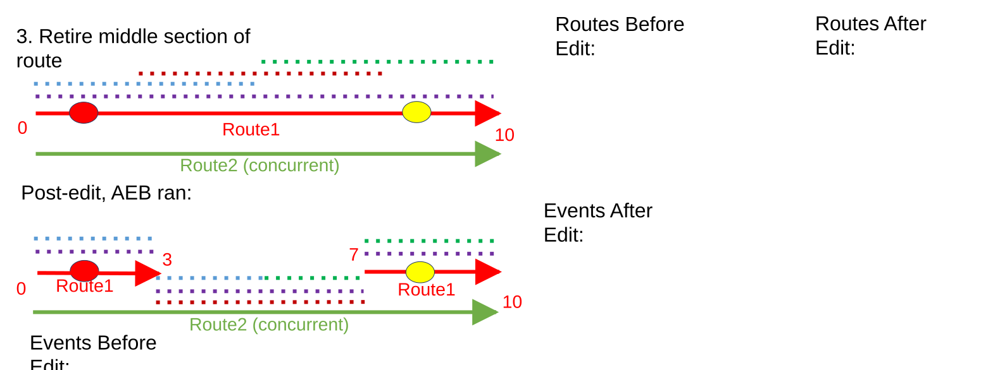

### TC-U04 — Retire second half of route <!-- src: S2 · slide 6 · case 4 -->

| RouteID | FromDate | ToDate |
| --- | --- | --- |
| Route1 | 1/1/2000 | NULL |
| Route2 | 1/1/2000 | NULL |

| RouteID | FromDate | ToDate |
| --- | --- | --- |
| Route1 | 1/1/2000 | 1/1/2005 |
| Route1 | 1/1/2005 | NULL |
| Route2 | 1/1/2000 | NULL |

| Event Layer | EventID | RouteID | From Date | To Date | From Measure | To Measure |
| --- | --- | --- | --- | --- | --- | --- |
| Point | Pt1 | Route1 | 1/1/2000 | NULL | 2 | N/A |
| Point | Pt2 | Route1 | 1/1/2000 | NULL | 8 | N/A |
| Line | Line1 | Route1 | 1/1/2000 | NULL | 0 | 10 |
| Line | Line2 | Route1 | 1/1/2000 | NULL | 0 | 5 |
| Line | Line3 | Route1 | 1/1/2000 | NULL | 3 | 7 |
| Line | Line4 | Route1 | 1/1/2000 | NULL | 5 | 10 |

| Event Layer | EventID | RouteID | From Date | To Date | From Measure | To Measure |
| --- | --- | --- | --- | --- | --- | --- |
| Point | Pt1 | Route1 | 1/1/2000 | NULL | 2 | N/A |
| Point | Pt2 | Route1 | 1/1/2000 | 1/1/2005 | 8 | N/A |
| Line | Line1 | Route1 | 1/1/2000 | 1/1/2005 | 0 | 10 |
| Line | Line2 | Route1 | 1/1/2000 | NULL | 0 | 5 |
| Line | Line3 | Route1 | 1/1/2000 | 1/1/2005 | 3 | 7 |
| Line | Line4 | Route1 | 1/1/2000 | 1/1/2005 | 5 | 10 |
| Point | Pt2 | Route2 | 1/1/2005 | NULL | 8 | N/A |
| Line | Line1 | Route1 | 1/1/2005 | NULL | 0 | 5 |
| Line | Line1 | Route2 | 1/1/2005 | NULL | 5 | 10 |
| Line | Line3 | Route1 | 1/1/2005 | NULL | 3 | 5 |
| Line | Line3 | Route2 | 1/1/2005 | NULL | 5 | 7 |
| Line | Line4 | Route2 | 1/1/2005 | NULL | 5 | 10 |

[figure: Routes Before Edit: · Routes After Edit: · Events Before Edit: · Events After Edit: · Route1 · Route2 (concurrent) · Post-edit, AEB ran: · 0 · 10]

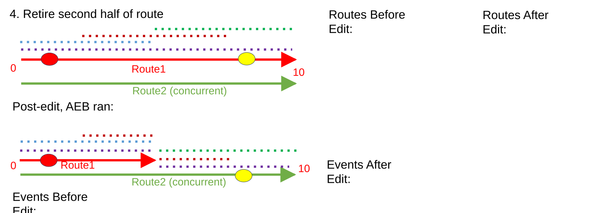

### TC-U05 — Retire whole route, partial concurrency <!-- src: S2 · slide 7 · case 5 -->

| RouteID | FromDate | ToDate |
| --- | --- | --- |
| Route1 | 1/1/2000 | NULL |
| Route2 | 1/1/2000 | NULL |

| RouteID | FromDate | ToDate |
| --- | --- | --- |
| Route1 | 1/1/2000 | 1/1/2005 |
| Route2 | 1/1/2000 | NULL |

Route2 ( partially concurrent)

| Event Layer | EventID | RouteID | From Date | To Date | From Measure | To Measure |
| --- | --- | --- | --- | --- | --- | --- |
| Point | Pt1 | Route1 | 1/1/2000 | NULL | 2 | N/A |
| Point | Pt2 | Route1 | 1/1/2000 | NULL | 8 | N/A |
| Line | Line1 | Route1 | 1/1/2000 | NULL | 0 | 10 |
| Line | Line2 | Route1 | 1/1/2000 | NULL | 0 | 5 |
| Line | Line3 | Route1 | 1/1/2000 | NULL | 3 | 7 |
| Line | Line4 | Route1 | 1/1/2000 | NULL | 5 | 10 |

| Event Layer | EventID | RouteID | From Date | To Date | From Measure | To Measure |
| --- | --- | --- | --- | --- | --- | --- |
| Point | Pt1 | Route1 | 1/1/2000 | 1/1/2005 | 2 | N/A |
| Point | Pt2 | Route1 | 1/1/2000 | 1/1/2005 | 8 | N/A |
| Line | Line1 | Route1 | 1/1/2000 | 1/1/2005 | 0 | 10 |
| Line | Line2 | Route1 | 1/1/2000 | 1/1/2005 | 0 | 5 |
| Line | Line3 | Route1 | 1/1/2000 | 1/1/2005 | 3 | 7 |
| Line | Line4 | Route1 | 1/1/2000 | 1/1/2005 | 5 | 10 |
| Point | Pt2 | Route2 | 1/1/2005 | NULL | 8 | N/A |
| Line | Line1 | Route2 | 1/1/2005 | NULL | 5 | 10 |
| Line | Line3 | Route2 | 1/1/2005 | NULL | 5 | 7 |
| Line | Line4 | Route2 | 1/1/2005 | NULL | 5 | 10 |

Route2 ( partially concurrent)

[figure: Post-edit, AEB ran: · 10 · Routes Before Edit: · Routes After Edit: · Events After Edit: · Events Before Edit: · Route1 · 0]

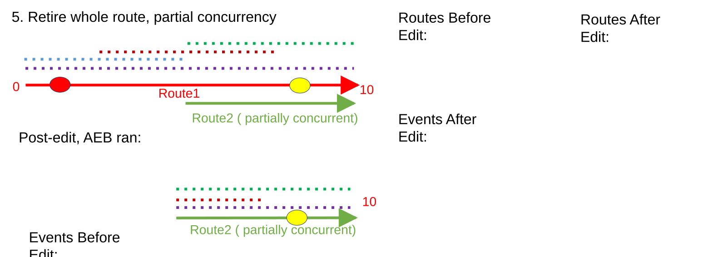

### TC-U06 — Retire whole route with multiple concurrencies <!-- src: S2 · slide 8 · case 6 -->

| RouteID | FromDate | ToDate |
| --- | --- | --- |
| Route1 | 1/1/2000 | NULL |
| Route2 | 1/1/2000 | NULL |
| Route3 | 1/1/2000 | NULL |

| RouteID | FromDate | ToDate |
| --- | --- | --- |
| Route1 | 1/1/2000 | 1/1/2005 |
| Route2 | 1/1/2000 | NULL |
| Route3 | 1/1/2000 | NULL |

| Event Layer | EventID | RouteID | From Date | To Date | From Measure | To Measure |
| --- | --- | --- | --- | --- | --- | --- |
| Point | Pt1 | Route1 | 1/1/2000 | NULL | 2 | N/A |
| Point | Pt2 | Route1 | 1/1/2000 | NULL | 8 | N/A |
| Line | Line1 | Route1 | 1/1/2000 | NULL | 0 | 10 |
| Line | Line2 | Route1 | 1/1/2000 | NULL | 0 | 5 |
| Line | Line3 | Route1 | 1/1/2000 | NULL | 3 | 7 |
| Line | Line4 | Route1 | 1/1/2000 | NULL | 5 | 10 |

| Event Layer | EventID | RouteID | From Date | To Date | From Measure | To Measure |
| --- | --- | --- | --- | --- | --- | --- |
| Point | Pt1 | Route1 | 1/1/2000 | 1/1/2005 | 2 | N/A |
| Point | Pt2 | Route1 | 1/1/2000 | 1/1/2005 | 8 | N/A |
| Line | Line1 | Route1 | 1/1/2000 | 1/1/2005 | 0 | 10 |
| Line | Line2 | Route1 | 1/1/2000 | 1/1/2005 | 0 | 5 |
| Line | Line3 | Route1 | 1/1/2000 | 1/1/2005 | 3 | 7 |
| Line | Line4 | Route1 | 1/1/2000 | 1/1/2005 | 5 | 10 |
| Point | Pt1 | Route2 | 1/1/2005 | NULL | 2 | N/A |
| Point | Pt2 | Route2 | 1/1/2005 | NULL | 8 | N/A |
| Line | Line1 | Route2 | 1/1/2005 | NULL | 0 | 10 |
| Line | Line2 | Route2 | 1/1/2005 | NULL | 0 | 5 |
| Line | Line3 | Route2 | 1/1/2005 | NULL | 3 | 7 |
| Line | Line4 | Route2 | 1/1/2005 | NULL | 5 | 10 |

Route2 (concurrent, dominant)

Route2 (concurrent, dominant)

Route3 (concurrent, non-dominant)
Route3 (concurrent, non-dominant)

[figure: Routes Before Edit: · Routes After Edit: · Events Before Edit: · Events After Edit: · Route1 · Post-edit, AEB ran: · 0 · 10]

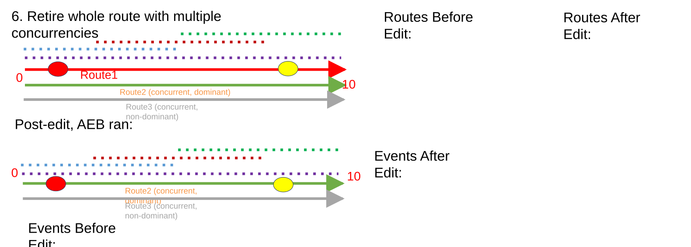

### TC-U07 — Retire whole route, concurrent route has gap (case 7) <!-- src: S2 · slide 9 · case 7 -->

| RouteID | FromDate | ToDate |
| --- | --- | --- |
| Route1 | 1/1/2000 | NULL |
| Route2 | 1/1/2000 | NULL |

| RouteID | FromDate | ToDate |
| --- | --- | --- |
| Route1 | 1/1/2000 | 1/1/2005 |
| Route2 | 1/1/2000 | NULL |

| Event Layer | EventID | RouteID | From Date | To Date | From Measure | To Measure |
| --- | --- | --- | --- | --- | --- | --- |
| Point | Pt1 | Route1 | 1/1/2000 | NULL | 2 | N/A |
| Point | Pt2 | Route1 | 1/1/2000 | NULL | 8 | N/A |
| Line | Line1 | Route1 | 1/1/2000 | NULL | 0 | 10 |
| Line | Line2 | Route1 | 1/1/2000 | NULL | 0 | 5 |
| Line | Line3 | Route1 | 1/1/2000 | NULL | 3 | 7 |
| Line | Line4 | Route1 | 1/1/2000 | NULL | 5 | 10 |

| Event Layer | EventID | RouteID | From Date | To Date | From Measure | To Measure |
| --- | --- | --- | --- | --- | --- | --- |
| Point | Pt1 | Route1 | 1/1/2000 | 1/1/2005 | 2 | N/A |
| Point | Pt2 | Route1 | 1/1/2000 | 1/1/2005 | 8 | N/A |
| Line | Line1 | Route1 | 1/1/2000 | 1/1/2005 | 0 | 10 |
| Line | Line2 | Route1 | 1/1/2000 | 1/1/2005 | 0 | 5 |
| Line | Line3 | Route1 | 1/1/2000 | 1/1/2005 | 3 | 7 |
| Line | Line4 | Route1 | 1/1/2000 | 1/1/2005 | 5 | 10 |
| Point | Pt1 | Route2 | 1/1/2005 | NULL | 2 | N/A |
| Point | Pt2 | Route2 | 1/1/2005 | NULL | 8 | N/A |
| Line | Line1 | Route2 | 1/1/2005 | NULL | 0 | 4 |
| Line | Line1 | Route2 | 1/1/2005 | NULL | 6 | 10 |
| Line | Line2 | Route2 | 1/1/2005 | NULL | 0 | 4 |
| Line | Line3 | Route2 | 1/1/2005 | NULL | 3 | 4 |
| Line | Line3 | Route2 | 1/1/2005 | NULL | 6 | 7 |
| Line | Line4 | Route2 | 1/1/2005 | NULL | 6 | 10 |

[figure: Routes Before Edit: · Routes After Edit: · Events Before Edit: · Events After Edit: · Route1 · Route2 (concurrent) · Post-edit, AEB ran: · 0 · 10 · 4 · 6]

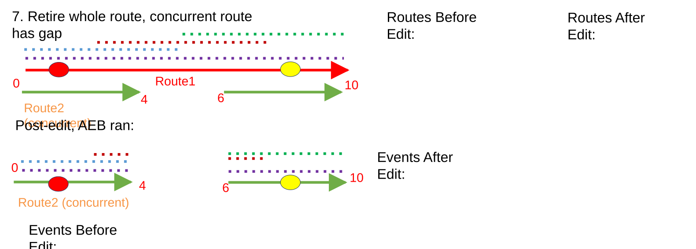

### TC-U08 — Retire whole route, no concurrent route present <!-- src: S2 · slide 10 · case 8 -->

| RouteID | FromDate | ToDate |
| --- | --- | --- |
| Route1 | 1/1/2000 | NULL |

| RouteID | FromDate | ToDate |
| --- | --- | --- |
| Route1 | 1/1/2000 | 1/1/2005 |

| Event Layer | EventID | RouteID | From Date | To Date | From Measure | To Measure |
| --- | --- | --- | --- | --- | --- | --- |
| Point | Pt1 | Route1 | 1/1/2000 | NULL | 2 | N/A |
| Point | Pt2 | Route1 | 1/1/2000 | NULL | 8 | N/A |
| Line | Line1 | Route1 | 1/1/2000 | NULL | 0 | 10 |
| Line | Line2 | Route1 | 1/1/2000 | NULL | 0 | 5 |
| Line | Line3 | Route1 | 1/1/2000 | NULL | 3 | 7 |
| Line | Line4 | Route1 | 1/1/2000 | NULL | 5 | 10 |

| Event Layer | EventID | RouteID | From Date | To Date | From Measure | To Measure |
| --- | --- | --- | --- | --- | --- | --- |
| Point | Pt1 | Route1 | 1/1/2000 | 1/1/2005 | 2 | N/A |
| Point | Pt2 | Route1 | 1/1/2000 | 1/1/2005 | 8 | N/A |
| Line | Line1 | Route1 | 1/1/2000 | 1/1/2005 | 0 | 10 |
| Line | Line2 | Route1 | 1/1/2000 | 1/1/2005 | 0 | 5 |
| Line | Line3 | Route1 | 1/1/2000 | 1/1/2005 | 3 | 7 |
| Line | Line4 | Route1 | 1/1/2000 | 1/1/2005 | 5 | 10 |

[figure: Routes Before Edit: · Routes After Edit: · Events Before Edit: · Events After Edit: · Route1 · 0 · 10 · Post-edit, AEB ran:]

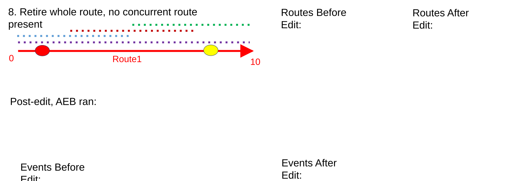

### TC-U09 — Retire whole route with multiple partial concurrencies (case 9) <!-- src: S2 · slide 11 · case 9 -->

| RouteID | FromDate | ToDate |
| --- | --- | --- |
| Route1 | 1/1/2000 | NULL |
| Route2 | 1/1/2000 | NULL |
| Route3 | 1/1/2000 | NULL |
| Route4 | 1/1/2000 | NULLL |

| RouteID | FromDate | ToDate |
| --- | --- | --- |
| Route1 | 1/1/2000 | 1/1/2005 |
| Route2 | 1/1/2000 | NULL |
| Route3 | 1/1/2000 | NULL |
| Route4 | 1/1/2000 | NULL |

| Event Layer | EventID | RouteID | From Date | To Date | From Measure | To Measure |
| --- | --- | --- | --- | --- | --- | --- |
| Point | Pt1 | Route1 | 1/1/2000 | NULL | 2 | N/A |
| Point | Pt2 | Route1 | 1/1/2000 | NULL | 8 | N/A |
| Line | Line1 | Route1 | 1/1/2000 | NULL | 0 | 10 |
| Line | Line2 | Route1 | 1/1/2000 | NULL | 0 | 5 |
| Line | Line3 | Route1 | 1/1/2000 | NULL | 3 | 7 |
| Line | Line4 | Route1 | 1/1/2000 | NULL | 5 | 10 |

| Event Layer | EventID | RouteID | From Date | To Date | From Measure | To Measure |
| --- | --- | --- | --- | --- | --- | --- |
| Point | Pt1 | Route1 | 1/1/2000 | 1/1/2005 | 2 | N/A |
| Point | Pt2 | Route1 | 1/1/2000 | 1/1/2005 | 8 | N/A |
| Line | Line1 | Route1 | 1/1/2000 | 1/1/2005 | 0 | 10 |
| Line | Line2 | Route1 | 1/1/2000 | 1/1/2005 | 0 | 5 |
| Line | Line3 | Route1 | 1/1/2000 | 1/1/2005 | 3 | 7 |
| Line | Line4 | Route1 | 1/1/2000 | 1/1/2005 | 5 | 10 |
| Point | Pt1 | Route2 | 1/1/2005 | NULL | 2 | N/A |
| Point | Pt2 | Route3 | 1/1/2005 | NULL | 8 | N/A |
| Line | Line1 | Route2 | 1/1/2005 | NULL | 0 | 5 |
| Line | Line1 | Route3 | 1/1/2005 | NULL | 5 | 10 |
| Line | Line2 | Route2 | 1/1/2005 | NULL | 0 | 5 |
| Line | Line3 | Route2 | 1/1/2005 | NULL | 3 | 5 |
| Line | Line3 | Route3 | 1/1/2005 | NULL | 5 | 7 |
| Line | Line4 | Route3 | 1/1/2005 | NULL | 5 | 10 |

[figure: Routes Before Edit: · Routes After Edit: · Events Before Edit: · Events After Edit: · Route1 · Route2 (dominant) · Post-edit, AEB ran: · 0 · 10 · Route3 (dominant) · Route2 · Route3 · Route4 (non-dominant) · Route4]

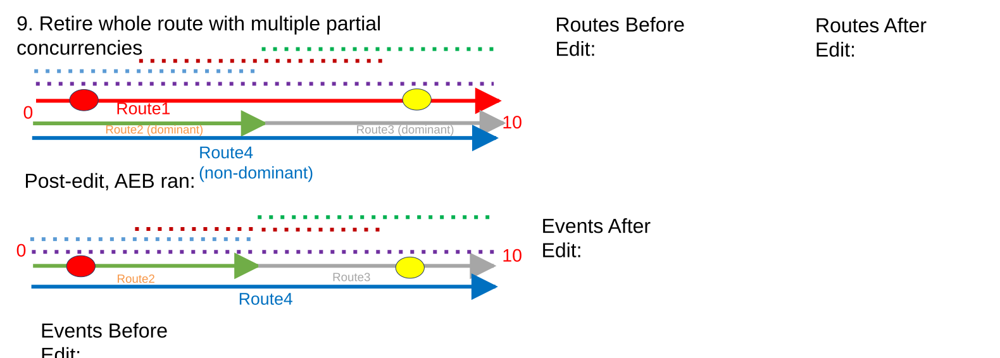

### TC-U10 — Retire First Half of Route, Point Event Is on Cusp of Retirement <!-- src: S1 · slide 12 · case 10 -->

| RouteID | FromDate | ToDate |
| --- | --- | --- |
| Route1 | 1/1/2000 | NULL |
| Route2 | 1/1/2000 | NULL |

| RouteID | FromDate | ToDate |
| --- | --- | --- |
| Route1 | 1/1/2000 | 1/1/2005 |
| Route1 | 1/1/2005 | NULL |
| Route2 | 1/1/2000 | NULL |

| Event Layer | EventID | RouteID | From Date | To Date | From Measure | To Measure |
| --- | --- | --- | --- | --- | --- | --- |
| Point | Pt1 | Route1 | 1/1/2000 | NULL | 2 | N/A |
| Point | Pt2 | Route1 | 1/1/2000 | NULL | 5 | N/A |
| Line | Line1 | Route1 | 1/1/2000 | NULL | 0 | 10 |
| Line | Line2 | Route1 | 1/1/2000 | NULL | 0 | 5 |
| Line | Line3 | Route1 | 1/1/2000 | NULL | 3 | 7 |
| Line | Line4 | Route1 | 1/1/2000 | NULL | 5 | 10 |

| Event Layer | EventID | RouteID | From Date | To Date | From Measure | To Measure |
| --- | --- | --- | --- | --- | --- | --- |
| Point | Pt1 | Route1 | 1/1/2000 | 1/1/2005 | 2 | N/A |
| Point | Pt2 | Route1 | 1/1/2000 | NULL | 5 | N/A |
| Line | Line1 | Route1 | 1/1/2000 | 1/1/2005 | 0 | 10 |
| Line | Line2 | Route1 | 1/1/2000 | 1/1/2005 | 0 | 5 |
| Line | Line3 | Route1 | 1/1/2000 | 1/1/2005 | 3 | 7 |
| Line | Line4 | Route1 | 1/1/2000 | NULL | 5 | 10 |
| Point | Pt1 | Route2 | 1/1/2005 | NULL | 2 | N/A |
| Line | Line1 | Route2 | 1/1/2005 | NULL | 15 | 20 |
| Line | Line1 | Route1 | 1/1/2005 | NULL | 5 | 10 |
| Line | Line2 | Route2 | 1/1/2005 | NULL | 15 | 20 |
| Line | Line3 | Route2 | 1/1/2005 | NULL | 18 | 20 |
| Line | Line3 | Route1 | 1/1/2005 | NULL | 5 | 7 |

[figure: Routes Before Edit: · Routes After Edit: · Events Before Edit: · Events After Edit: · Route1 · Route2 (concurrent) · Post-edit, AEB ran: · 15 · 0 · 10 · 5 · 25]

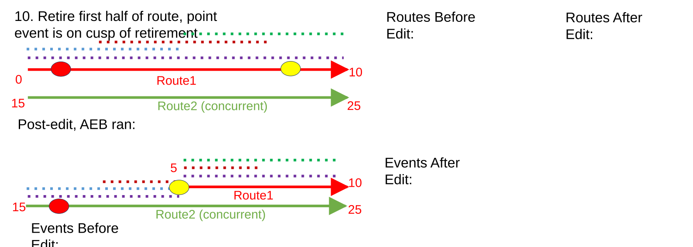

### TC-U11 — Retire whole gapped route <!-- src: S2 · slide 13 · case 11 -->

| RouteID | FromDate | ToDate |
| --- | --- | --- |
| Route1 | 1/1/2000 | NULL |
| Route2 | 1/1/2000 | NULL |

| RouteID | FromDate | ToDate |
| --- | --- | --- |
| Route1 | 1/1/2000 | 1/1/2005 |
| Route2 | 1/1/2000 | NULL |

| Event Layer | EventID | RouteID | From Date | To Date | From Measure | To Measure |
| --- | --- | --- | --- | --- | --- | --- |
| Point | Pt1 | Route1 | 1/1/2000 | NULL | 2 | N/A |
| Point | Pt2 | Route1 | 1/1/2000 | NULL | 8 | N/A |
| Line | Line1 | Route1 | 1/1/2000 | NULL | 0 | 4 |
| Line | Line1A | Route1 | 1/1/2000 | NULL | 6 | 10 |
| Line | Line2 | Route1 | 1/1/2000 | NULL | 0 | 5 |
| Line | Line3 | Route1 | 1/1/2000 | NULL | 3 | 4 |
| Line | Line3A | Route1 | 1/1/2000 | NULL | 6 | 7 |
| Line | Line4 | Route1 | 1/1/2000 | NULL | 5 | 10 |

| Event Layer | EventID | RouteID | From Date | To Date | From Measure | To Measure |
| --- | --- | --- | --- | --- | --- | --- |
| Point | Pt1 | Route1 | 1/1/2000 | 1/1/2005 | 2 | N/A |
| Point | Pt2 | Route1 | 1/1/2000 | 1/1/2005 | 8 | N/A |
| Line | Line1 | Route1 | 1/1/2000 | 1/1/2005 | 0 | 10 |
| Line | Line2 | Route1 | 1/1/2000 | 1/1/2005 | 0 | 5 |
| Line | Line3 | Route1 | 1/1/2000 | 1/1/2005 | 3 | 7 |
| Line | Line4 | Route1 | 1/1/2000 | 1/1/2005 | 5 | 10 |
| Point | Pt1 | Route2 | 1/1/2005 | NULL | 2 | N/A |
| Point | Pt2 | Route2 | 1/1/2005 | NULL | 8 | N/A |
| Line | Line1 | Route2 | 1/1/2005 | NULL | 0 | 4 |
| Line | Line1A | Route2 | 1/1/2005 | NULL | 6 | 10 |
| Line | Line2 | Route2 | 1/1/2005 | NULL | 0 | 4 |
| Line | Line3 | Route2 | 1/1/2005 | NULL | 3 | 4 |
| Line | Line3A | Route2 | 1/1/2005 | NULL | 6 | 7 |
| Line | Line4 | Route2 | 1/1/2005 | NULL | 6 | 10 |

[figure: Routes Before Edit: · Routes After Edit: · Events Before Edit: · Events After Edit: · Route1 · Route2 (concurrent) · Post-edit, AEB ran: · 0 · 10 · 4 · 6]

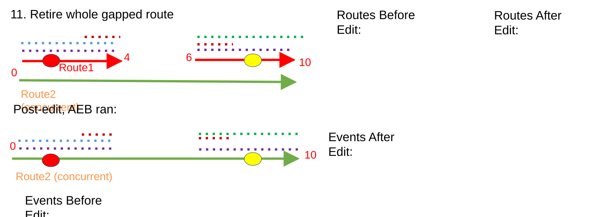

### TC-U12 — Retire whole route, unproportional concurrent route <!-- src: S2 · slide 14 · case 12 -->

| RouteID | FromDate | ToDate |
| --- | --- | --- |
| Route1 | 1/1/2000 | NULL |
| Route2 | 1/1/2000 | NULL |

| RouteID | FromDate | ToDate |
| --- | --- | --- |
| Route1 | 1/1/2000 | 1/1/2005 |
| Route2 | 1/1/2000 | NULL |

| Event Layer | EventID | RouteID | From Date | To Date | From Measure | To Measure |
| --- | --- | --- | --- | --- | --- | --- |
| Point | Pt1 | Route1 | 1/1/2000 | NULL | 2 | N/A |
| Point | Pt2 | Route1 | 1/1/2000 | NULL | 8 | N/A |
| Line | Line1 | Route1 | 1/1/2000 | NULL | 0 | 10 |
| Line | Line2 | Route1 | 1/1/2000 | NULL | 0 | 5 |
| Line | Line3 | Route1 | 1/1/2000 | NULL | 3 | 7 |
| Line | Line4 | Route1 | 1/1/2000 | NULL | 5 | 10 |

| Event Layer | EventID | RouteID | From Date | To Date | From Measure | To Measure |
| --- | --- | --- | --- | --- | --- | --- |
| Point | Pt1 | Route1 | 1/1/2000 | 1/1/2005 | 2 | N/A |
| Point | Pt2 | Route1 | 1/1/2000 | 1/1/2005 | 8 | N/A |
| Line | Line1 | Route1 | 1/1/2000 | 1/1/2005 | 0 | 10 |
| Line | Line2 | Route1 | 1/1/2000 | 1/1/2005 | 0 | 5 |
| Line | Line3 | Route1 | 1/1/2000 | 1/1/2005 | 3 | 7 |
| Line | Line4 | Route1 | 1/1/2000 | 1/1/2005 | 5 | 10 |
| Point | Pt1 | Route2 | 1/1/2005 | NULL | 20 | N/A |
| Point | Pt2 | Route2 | 1/1/2005 | NULL | 80 | N/A |
| Line | Line1 | Route2 | 1/1/2005 | NULL | 0 | 100 |
| Line | Line2 | Route2 | 1/1/2005 | NULL | 0 | 50 |
| Line | Line3 | Route2 | 1/1/2005 | NULL | 30 | 70 |
| Line | Line4 | Route2 | 1/1/2005 | NULL | 50 | 10 |

[figure: Routes Before Edit: · Routes After Edit: · Events Before Edit: · Events After Edit: · Route1 · Route2 (concurrent) · Post-edit, AEB ran: · 0 · 10 · 100]

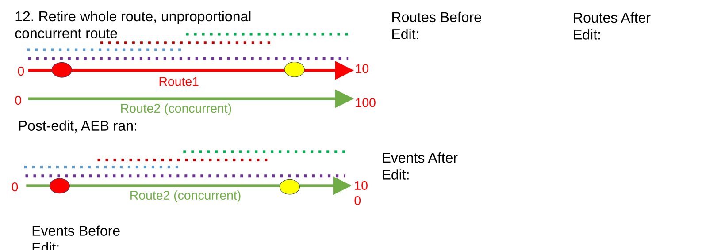

### TC-U13 — Retire whole complex route <!-- src: S2 · slide 15 · case 13 -->

| RouteID | FromDate | ToDate |
| --- | --- | --- |
| Route2 | 1/1/2000 | NULL |
| Route1 | 1/1/2000 | NULL |

| Input Layer | Event ID |  | From Date | To Date | From Measure | To Measure |
| --- | --- | --- | --- | --- | --- | --- |
| Red Event | Red1 | Route1 | 1/1/2000 | <Null> | 0 | 5 |
| Red Event | Red2 | Route1 | 1/1/2000 | <Null> | 5 | 10 |
| Blue Event | Blue1 | Route1 | 1/1/2000 | <Null> | 0 | 10 |
| Green Event | Green1 | Route1 | 1/1/2000 | <Null> | 0 | 10 |

| RouteID | FromDate | ToDate |
| --- | --- | --- |
| Route2 | 1/1/2000 | NULL |
| Route1 | 1/1/2000 | 1/1/2005 |

| Input Layer | Event ID | RouteID | From Date | To Date | From Measure | To Measure |
| --- | --- | --- | --- | --- | --- | --- |
| Red Event | Red1 | Route1 | 1/1/2000 | 1/1/2005 | 0 | 5 |
| Red Event | Red2 | Route1 | 1/1/2000 | 1/1/2005 | 5 | 10 |
| Blue Event | Blue1 | Route1 | 1/1/2000 | 1/1/2005 | 0 | 10 |
| Green Event | Green1 | Route1 | 1/1/2000 | 1/1/2005 | 0 | 10 |
| Red Event | Red1 | Route2 | 1/1/2005 | <Null> | 0 | 5 |
| Red Event | Red2 | Route2 | 1/1/2005 | <Null> | 5 | 10 |
| Blue Event | Blue1 | Route2 | 1/1/2005 | <Null> | 0 | 10 |
| Green Event | Green1 | Route2 | 1/1/2005 | <Null> | 0 | 10 |

[figure: 0 · 10 · 5 · Route1 · Route2]

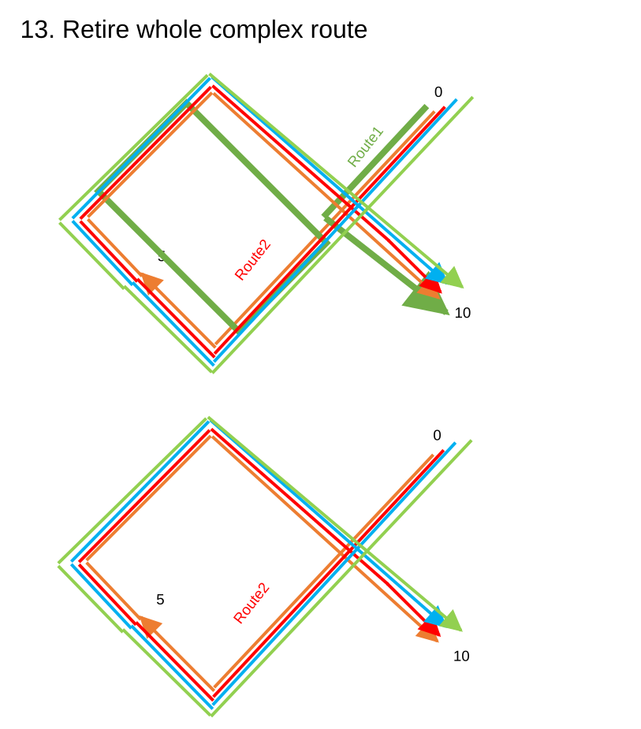

### TC-U14 — Retire whole vertical route (case 13) <!-- src: S2 · slide 16 · case 13 -->

| RouteID | FromDate | ToDate |
| --- | --- | --- |
| Route2 | 1/1/2000 | NULL |
| Route1 | 1/1/2000 | NULL |

| Input Layer | Event ID | RouteID | From Date | To Date | From Measure | To Measure |
| --- | --- | --- | --- | --- | --- | --- |
| Red Event | Red1 | Route1 | 1/1/2000 | <Null> | 0 | 2.5 |
| Red Event | Red2 | Route1 | 1/1/2000 | <Null> | 2.5 | 10 |
| Blue Event | Blue1 | Route1 | 1/1/2000 | <Null> | 0 | 10 |
| Green Event | Green1 | Route1 | 1/1/2000 | <Null> | 0 | 10 |

| RouteID | FromDate | ToDate |
| --- | --- | --- |
| Route2 | 1/1/2000 | NULL |
| Route1 | 1/1/2000 | 1/1/2005 |

| Input Layer | Event ID | RouteID | From Date | To Date | From Measure | To Measure |
| --- | --- | --- | --- | --- | --- | --- |
| Red Event | Red1 | Route1 | 1/1/2000 | 1/1/2005 | 0 | 2.5 |
| Red Event | Red2 | Route1 | 1/1/2000 | 1/1/2005 | 2.5 | 10 |
| Blue Event | Blue1 | Route1 | 1/1/2000 | 1/1/2005 | 0 | 10 |
| Green Event | Green1 | Route1 | 1/1/2000 | 1/1/2005 | 0 | 10 |
| Red Event | Red1 | Route2 | 1/1/2005 | <Null> | 0 | 2.5 |
| Red Event | Red2 | Route2 | 1/1/2005 | <Null> | 2.5 | 10 |
| Blue Event | Blue1 | Route2 | 1/1/2005 | <Null> | 0 | 10 |
| Green Event | Green1 | Route2 | 1/1/2005 | <Null> | 0 | 10 |

[figure: 0 · 10 · 5]

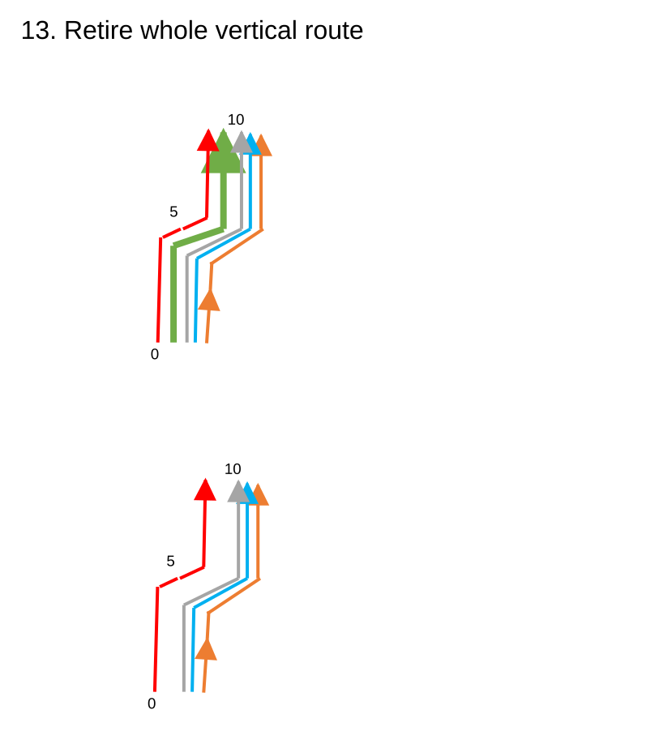

### TC-U15 — Retire First Half of Route, Recalibrate Downstream (case 14) <!-- src: S1 · slide 17 · case 14 -->

| RouteID | FromDate | ToDate |
| --- | --- | --- |
| Route1 | 1/1/2000 | NULL |
| Route2 | 1/1/2000 | NULL |

| RouteID | FromDate | ToDate |
| --- | --- | --- |
| Route1 | 1/1/2000 | 1/1/2005 |
| Route1 | 1/1/2005 | NULL |
| Route2 | 1/1/2000 | NULL |

| Event Layer | EventID | RouteID | From Date | To Date | From Measure | To Measure |
| --- | --- | --- | --- | --- | --- | --- |
| Point | Pt1 | Route1 | 1/1/2000 | NULL | 2 | N/A |
| Point | Pt2 | Route1 | 1/1/2000 | NULL | 8 | N/A |
| Line | Line1 | Route1 | 1/1/2000 | NULL | 0 | 10 |
| Line | Line2 | Route1 | 1/1/2000 | NULL | 0 | 5 |
| Line | Line3 | Route1 | 1/1/2000 | NULL | 3 | 7 |
| Line | Line4 | Route1 | 1/1/2000 | NULL | 5 | 10 |

| Event Layer | EventID | RouteID | From Date | To Date | From Measure | To Measure |
| --- | --- | --- | --- | --- | --- | --- |
| Point | Pt1 | Route1 | 1/1/2000 | 1/1/2005 | 2 | N/A |
| Point | Pt2 | Route1 | 1/1/2000 | 1/1/2005 | 8 | N/A |
| Line | Line1 | Route1 | 1/1/2000 | 1/1/2005 | 0 | 10 |
| Line | Line2 | Route1 | 1/1/2000 | 1/1/2005 | 0 | 5 |
| Line | Line3 | Route1 | 1/1/2000 | 1/1/2005 | 3 | 7 |
| Line | Line4 | Route1 | 1/1/2000 | 1/1/2005 | 5 | 10 |
| Point | Pt1 | Route2 | 1/1/2005 | NULL | 2 | N/A |
| Point | Pt2 | Route1 | 1/1/2005 | NULL | 3 | N/A |
| Line | Line1 | Route2 | 1/1/2005 | NULL | 15 | 20 |
| Line | Line1 | Route1 | 1/1/2005 | NULL | 0 | 5 |
| Line | Line2 | Route2 | 1/1/2005 | NULL | 15 | 20 |
| Line | Line3 | Route2 | 1/1/2005 | NULL | 18 | 20 |
| Line | Line3 | Route1 | 1/1/2005 | NULL | 0 | 2 |
| Line | Line4 | Route1 | 1/1/2005 | NULL | 0 | 5 |

(Stay Put)

[figure: Routes Before Edit: · Routes After Edit: · Events Before Edit: · Events After Edit: · Route1 · Route2 (concurrent) · Post-edit, AEB ran: · 15 · 0 · 10 · 5 · 25]

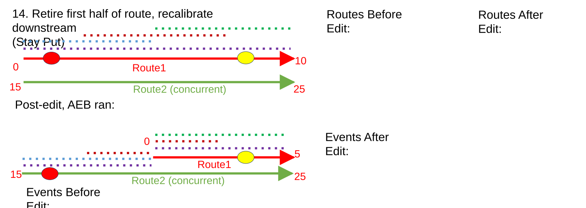

### TC-U16 — Retire first half of route, recalibrate downstream (Move) <!-- src: S2 · slide 18 · case 15 -->

| RouteID | FromDate | ToDate |
| --- | --- | --- |
| Route1 | 1/1/2000 | NULL |
| Route2 | 1/1/2000 | NULL |

| RouteID | FromDate | ToDate |
| --- | --- | --- |
| Route1 | 1/1/2000 | 1/1/2005 |
| Route1 | 1/1/2005 | NULL |
| Route2 | 1/1/2000 | NULL |

| Event Layer | EventID | RouteID | From Date | To Date | From Measure | To Measure |
| --- | --- | --- | --- | --- | --- | --- |
| Point | Pt1 | Route1 | 1/1/2000 | NULL | 2 | N/A |
| Point | Pt2 | Route1 | 1/1/2000 | NULL | 8 | N/A |
| Line | Line1 | Route1 | 1/1/2000 | NULL | 0 | 10 |
| Line | Line2 | Route1 | 1/1/2000 | NULL | 0 | 5 |
| Line | Line3 | Route1 | 1/1/2000 | NULL | 3 | 7 |
| Line | Line4 | Route1 | 1/1/2000 | NULL | 5 | 10 |

| Event Layer | EventID | RouteID | From Date | To Date | From Measure | To Measure | LocError |
| --- | --- | --- | --- | --- | --- | --- | --- |
| Point | Pt1 | Route1 | 1/1/2000 | 1/1/2005 | 2 | N/A | No Error |
| Point | Pt2 | Route1 | 1/1/2000 | 1/1/2005 | 8 | N/A | No Error |
| Line | Line1 | Route1 | 1/1/2000 | 1/1/2005 | 0 | 10 | No Error |
| Line | Line2 | Route1 | 1/1/2000 | 1/1/2005 | 0 | 5 | No Error |
| Line | Line3 | Route1 | 1/1/2000 | 1/1/2005 | 3 | 7 | No Error |
| Line | Line4 | Route1 | 1/1/2000 | 1/1/2005 | 5 | 10 | No Error |
| Point | Pt1 | Route2 | 1/1/2005 | NULL | 2 | N/A | No Error |
| Point | Pt2 | Route1 | 1/1/2005 | NULL | 8 | N/A | Route Location Not Found |
| Line | Line1 | Route2 | 1/1/2005 | NULL | 15 | 20 | No Error |
| Line | Line1 | Route1 | 1/1/2005 | NULL | 5 | 10 | Partial Match for the From Measure |
| Line | Line2 | Route2 | 1/1/2005 | NULL | 15 | 20 | No Error |
| Line | Line3 | Route2 | 1/1/2005 | NULL | 18 | 20 | No Error |
| Line | Line3 | Route1 | 1/1/2005 | NULL | 3 | 7 | Partial Match for the From Measure |
| Line | Line4 | Route1 | 1/1/2005 | NULL | 5 | 10 | Partial Match for the From Measure |

[figure: Routes Before Edit: · Routes After Edit: · Events Before Edit: · Events After Edit: · Route1 · Route2 (concurrent) · Post-edit, AEB ran: · 15 · 0 · 10 · 5 · 25]

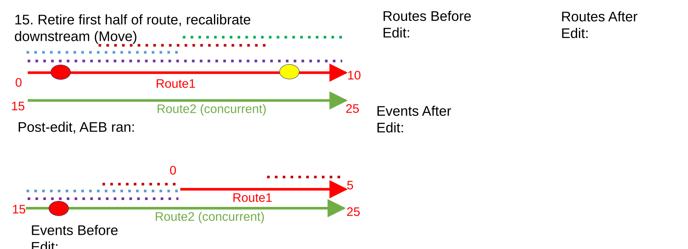

### TC-U17 — Retire First Half of Route, Recalibrate Downstream (case 14) <!-- src: S1 · slide 19 · case 14 -->

| RouteID | FromDate | ToDate |
| --- | --- | --- |
| Route1 | 1/1/2000 | NULL |
| Route2 | 1/1/2000 | NULL |

| RouteID | FromDate | ToDate |
| --- | --- | --- |
| Route1 | 1/1/2000 | 1/1/2005 |
| Route1 | 1/1/2005 | NULL |
| Route2 | 1/1/2000 | NULL |

| Event Layer | EventID | RouteID | From Date | To Date | From Measure | To Measure |
| --- | --- | --- | --- | --- | --- | --- |
| Point | Pt1 | Route1 | 1/1/2000 | NULL | 2 | N/A |
| Point | Pt2 | Route1 | 1/1/2000 | NULL | 8 | N/A |
| Line | Line1 | Route1 | 1/1/2000 | NULL | 0 | 10 |
| Line | Line2 | Route1 | 1/1/2000 | NULL | 0 | 5 |
| Line | Line3 | Route1 | 1/1/2000 | NULL | 3 | 7 |
| Line | Line4 | Route1 | 1/1/2000 | NULL | 5 | 10 |

| Event Layer | EventID | RouteID | From Date | To Date | From Measure | To Measure |
| --- | --- | --- | --- | --- | --- | --- |
| Point | Pt1 | Route1 | 1/1/2000 | 1/1/2005 | 2 | N/A |
| Point | Pt2 | Route1 | 1/1/2000 | 1/1/2005 | 8 | N/A |
| Line | Line1 | Route1 | 1/1/2000 | 1/1/2005 | 0 | 10 |
| Line | Line2 | Route1 | 1/1/2000 | 1/1/2005 | 0 | 5 |
| Line | Line3 | Route1 | 1/1/2000 | 1/1/2005 | 3 | 7 |
| Line | Line4 | Route1 | 1/1/2000 | 1/1/2005 | 5 | 10 |
| Point | Pt1 | Route2 | 1/1/2005 | NULL | 2 | N/A |
| Line | Line1 | Route2 | 1/1/2005 | NULL | 15 | 20 |
| Line | Line2 | Route2 | 1/1/2005 | NULL | 15 | 20 |
| Line | Line3 | Route2 | 1/1/2005 | NULL | 18 | 20 |

(Retire)

[figure: Routes Before Edit: · Routes After Edit: · Events Before Edit: · Events After Edit: · Route1 · Route2 (concurrent) · Post-edit, AEB ran: · 15 · 0 · 10 · 5 · 25]

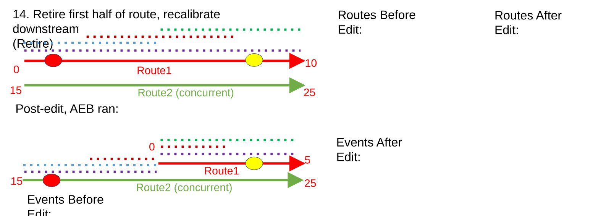

### TC-U18 — Retire whole route, concurrent route has multiple time slices <!-- src: S2 · slide 20 · case 18 -->

| RouteID | FromDate | ToDate |
| --- | --- | --- |
| Route1 | 1/1/2000 | NULL |
| Route2 | 1/1/2000 | 1/1/2005 |
| Route2 | 1/1/2005 | 1/1/2010 |
| Route2 | 1/1/2010 | NULL |

| RouteID | FromDate | ToDate |
| --- | --- | --- |
| Route1 | 1/1/2000 | 1/1/2004 |
| Route2 | 1/1/2000 | 1/1/2005 |
| Route2 | 1/1/2005 | 1/1/2010 |
| Route2 | 1/1/2010 | NULL |

| Event Layer | EventID | RouteID | From Date | To Date | From Measure | To Measure |
| --- | --- | --- | --- | --- | --- | --- |
| Point | Pt1 | Route1 | 1/1/2000 | NULL | 2 | N/A |
| Point | Pt2 | Route1 | 1/1/2000 | NULL | 8 | N/A |
| Line | Line1 | Route1 | 1/1/2000 | NULL | 0 | 10 |
| Line | Line2 | Route1 | 1/1/2000 | NULL | 0 | 5 |
| Line | Line3 | Route1 | 1/1/2000 | NULL | 3 | 7 |
| Line | Line4 | Route1 | 1/1/2000 | NULL | 5 | 10 |

[figure: Routes Before Edit: · Routes After Edit: · Events Before Edit: · Route1 · Route2 (concurrent) · 0 · 10 · 15 · 25]

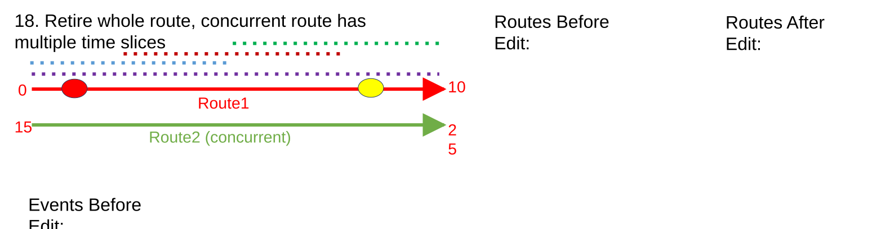

### TC-U19 — Retire whole route, concurrent route has multiple time slices (Continued) <!-- src: S2 · slide 21 · case 18 -->

Post-edit, AEB ran (1/1/2004-1/1/2005):

| Event Layer | EventID | RouteID | From Date | To Date | From Measure | To Measure |
| --- | --- | --- | --- | --- | --- | --- |
| Point | Pt1 | Route1 | 1/1/2000 | 1/1/2004 | 2 | N/A |
| Point | Pt2 | Route1 | 1/1/2000 | 1/1/2004 | 8 | N/A |
| Line | Line1 | Route1 | 1/1/2000 | 1/1/2004 | 0 | 10 |
| Line | Line2 | Route1 | 1/1/2000 | 1/1/2004 | 0 | 5 |
| Line | Line3 | Route1 | 1/1/2000 | 1/1/2004 | 3 | 7 |
| Line | Line4 | Route1 | 1/1/2000 | 1/1/2004 | 5 | 10 |
| Point | Pt1 | Route2 | 1/1/2004 | 1/1/2005 | 17 | N/A |
| Point | Pt2 | Route2 | 1/1/2004 | 1/1/2005 | 23 | N/A |
| Line | Line1 | Route2 | 1/1/2004 | 1/1/2005 | 15 | 25 |
| Line | Line2 | Route2 | 1/1/2004 | 1/1/2005 | 15 | 20 |
| Line | Line3 | Route2 | 1/1/2004 | 1/1/2005 | 18 | 22 |
| Line | Line4 | Route2 | 1/1/2004 | 1/1/2005 | 20 | 25 |
| Point | Pt1 | Route2 | 1/1/2005 | 1/1/2010 | 34 | N/A |
| Point | Pt2 | Route2 | 1/1/2005 | 1/1/2010 | 46 | N/A |
| Line | Line1 | Route2 | 1/1/2005 | 1/1/2010 | 30 | 50 |
| Line | Line2 | Route2 | 1/1/2005 | 1/1/2010 | 30 | 40 |
| Line | Line3 | Route2 | 1/1/2005 | 1/1/2010 | 36 | 44 |
| Line | Line4 | Route2 | 1/1/2005 | 1/1/2010 | 40 | 50 |
| Point | Pt1 | Route2 | 1/1/2010 | NULL | 68 | N/A |
| Point | Pt2 | Route2 | 1/1/2010 | NULL | 92 | N/A |
| Line | Line1 | Route2 | 1/1/2010 | NULL | 60 | 100 |
| Line | Line2 | Route2 | 1/1/2010 | NULL | 60 | 80 |
| Line | Line3 | Route2 | 1/1/2010 | NULL | 72 | 88 |
| Line | Line4 | Route2 | 1/1/2010 | NULL | 80 | 100 |

[figure: Route2 (concurrent) · 15 · 25 · Events After Edit: · (1/1/2005-1/1/2010): · 50 · (1/1/2010-NULL): · 100]

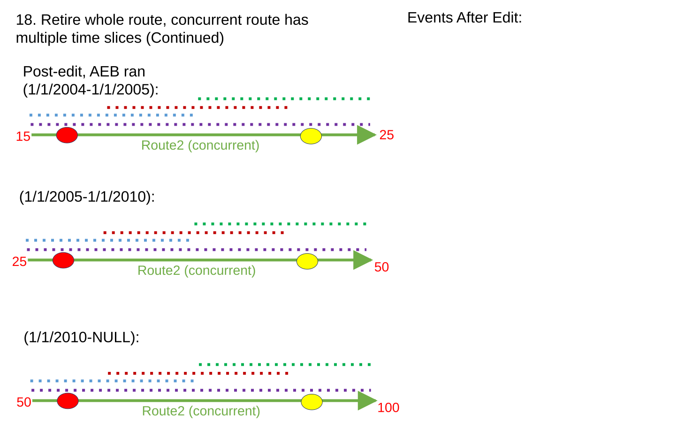

### TC-U20 — Retire all routes on line <!-- src: S2 · slide 22 · case 1 -->

| Line ID | Route ID | From Date | ToDate |
| --- | --- | --- | --- |
| Line1 | Route1 | 1/1/2000 | NULL |
| Line1 | Route2 | 1/1/2000 | NULL |
| Line1 | Route3 | 1/1/2000 | NULL |
| Line2 | RouteX | 1/1/2000 | NULL |
| Line2 | RouteY | 1/1/2000 | NULL |

| Line ID | RouteID | From Date | ToDate |
| --- | --- | --- | --- |
| Line1 | Route1 | 1/1/2000 | 1/1/2005 |
| Line1 | Route2 | 1/1/2000 | 1/1/2005 |
| Line1 | Route3 | 1/1/2000 | 1/1/2005 |
| Line2 | RouteX | 1/1/2000 | NULL |
| Line2 | RouteY | 1/1/2000 | NULL |

| Event Layer | Event ID | From RouteID | To RouteID | From Date | To Date | From Measure | To Measure |
| --- | --- | --- | --- | --- | --- | --- | --- |
| Point | Pt1 | Route1 | N/A | 1/1/2000 | NULL | 2 | N/A |
| Point | Pt2 | Route3 | N/A | 1/1/2000 | NULL | 40 | N/A |
| Line | Line1 | Route1 | Route3 | 1/1/2000 | NULL | 0 | 50 |
| Line | Line2 | Route1 | Route2 | 1/1/2000 | NULL | 0 | 17.5 |
| Line | Line3 | Route1 | Route3 | 1/1/2000 | NULL | 7 | 35 |
| Line | Line4 | Route2 | Route3 | 1/1/2000 | NULL | 17.5 | 50 |

| Event Layer | Event ID | From RouteID | To RouteID | From Date | To Date | From Measure | To Measure |
| --- | --- | --- | --- | --- | --- | --- | --- |
| Point | Pt1 | Route1 | N/A | 1/1/2000 | 1/1/2005 | 2 | N/A |
| Point | Pt2 | Route3 | N/A | 1/1/2000 | 1/1/2005 | 40 | N/A |
| Line | Line1 | Route1 | Route3 | 1/1/2000 | 1/1/2005 | 0 | 50 |
| Line | Line2 | Route1 | Route2 | 1/1/2000 | 1/1/2005 | 0 | 17.5 |
| Line | Line3 | Route1 | Route3 | 1/1/2000 | 1/1/2005 | 7 | 35 |
| Line | Line4 | Route2 | Route3 | 1/1/2000 | 1/1/2005 | 17.5 | 50 |
| Point | Pt1 | RouteX | N/A | 1/1/2005 | NULL | 2 | N/A |
| Point | Pt2 | RouteY | N/A | 1/1/2005 | NULL | 45 | N/A |
| Line | Line1 | RouteX | RouteY | 1/1/2005 | NULL | 0 | 60 |
| Line | Line2 | RouteX | RouteX | 1/1/2005 | NULL | 0 | 12.5 |
| Line | Line3 | RouteX | RouteY | 1/1/2005 | NULL | 7 | 40 |
| Line | Line4 | RouteX | RouteY | 1/1/2005 | NULL | 12.5 | 60 |

[figure: Route1 · RouteX · Route2 · Route3 · 0 · 10 · 15 · 30 · 50 · 20 · 60 · RouteY · Post-edit, AEB ran: · Routes Before Edit: · Routes After Edit: · Events Before Edit: · Events After Edit:]

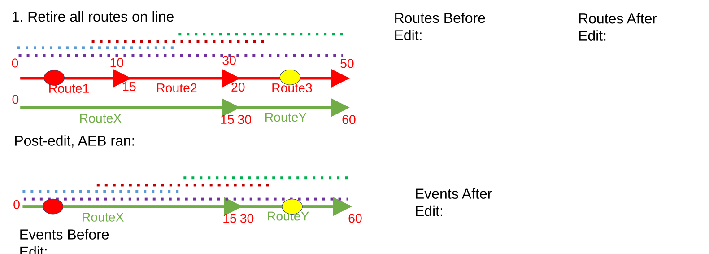

### TC-U21 — Retire first half of routes on line <!-- src: S2 · slide 23 · case 2 -->

| Line ID | Route ID | From Date | ToDate |
| --- | --- | --- | --- |
| Line1 | Route1 | 1/1/2000 | NULL |
| Line1 | Route2 | 1/1/2000 | NULL |
| Line1 | Route3 | 1/1/2000 | NULL |
| Line2 | RouteX | 1/1/2000 | NULL |
| Line2 | RouteY | 1/1/2000 | NULL |

| Line ID | RouteID | From Date | ToDate |
| --- | --- | --- | --- |
| Line1 | Route1 | 1/1/2000 | 1/1/2005 |
| Line1 | Route2 | 1/1/2000 | 1/1/2005 |
| Line1 | Route3 | 1/1/2000 | 1/1/2005 |
| Line1 | Route3 | 1/1/2005 | NULL |
| Line2 | RouteX | 1/1/2000 | NULL |
| Line2 | RouteY | 1/1/2000 | NULL |

| Event Layer | Event ID | From RouteID | To RouteID | From Date | To Date | From Measure | To Measure |
| --- | --- | --- | --- | --- | --- | --- | --- |
| Point | Pt1 | Route1 | N/A | 1/1/2000 | NULL | 2 | N/A |
| Point | Pt2 | Route3 | N/A | 1/1/2000 | NULL | 40 | N/A |
| Line | Line1 | Route1 | Route3 | 1/1/2000 | NULL | 0 | 50 |
| Line | Line2 | Route1 | Route2 | 1/1/2000 | NULL | 0 | 17.5 |
| Line | Line3 | Route1 | Route3 | 1/1/2000 | NULL | 7 | 35 |
| Line | Line4 | Route2 | Route3 | 1/1/2000 | NULL | 17.5 | 50 |

| Event Layer | Event ID | From RouteID | To RouteID | From Date | To Date | From Measure | To Measure |
| --- | --- | --- | --- | --- | --- | --- | --- |
| Point | Pt1 | Route1 | N/A | 1/1/2000 | 1/1/2005 | 2 | N/A |
| Point | Pt2 | Route3 | N/A | 1/1/2000 | NULL | 40 | N/A |
| Line | Line1 | Route1 | Route3 | 1/1/2000 | 1/1/2005 | 0 | 50 |
| Line | Line2 | Route1 | Route2 | 1/1/2000 | 1/1/2005 | 0 | 17.5 |
| Line | Line3 | Route1 | Route3 | 1/1/2000 | 1/1/2005 | 7 | 35 |
| Line | Line4 | Route2 | Route3 | 1/1/2000 | 1/1/2005 | 17.5 | 50 |
| Point | Pt1 | RouteX | N/A | 1/1/2005 | NULL | 2 | N/A |
| Line | Line1 | RouteX | RouteX | 1/1/2005 | NULL | 0 | 15 |
| Line | Line1 | Route3 | Route3 | 1/1/2005 | NULL | 30 | 50 |
| Line | Line2 | RouteX | RouteX | 1/1/2005 | NULL | 0 | 12.5 |
| Line | Line3 | RouteX | RouteX | 1/1/2005 | NULL | 7 | 15 |
| Line | Line3 | Route3 | Route3 | 1/1/2005 | NULL | 30 | 40 |
| Line | Line4 | RouteX | RouteX | 1/1/2005 | NULL | 12.5 | 15 |
| Line | Line4 | Route3 | Route3 | 1/1/2005 | NULL | 30 | 50 |

[figure: Route1 · RouteX · Route2 · Route3 · 0 · 10 · 15 · 30 · 50 · 20 · 60 · RouteY · Post-edit, AEB ran: · Routes Before Edit: · Routes After Edit: · Events Before Edit: · Events After Edit:]

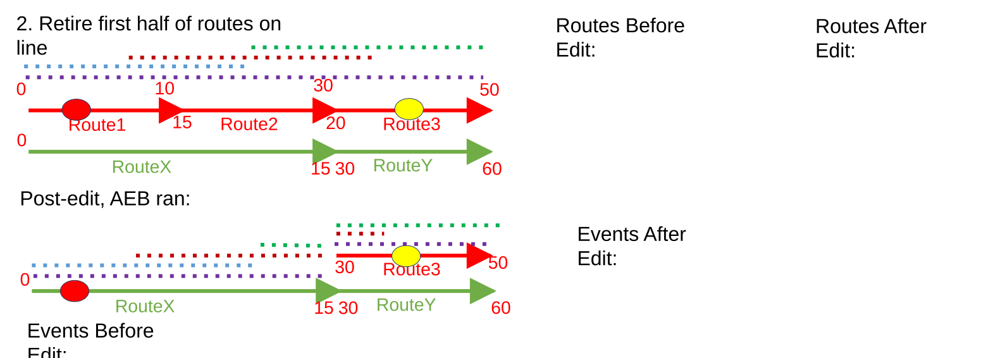

### TC-U22 — Retire middle route on line <!-- src: S2 · slide 24 · case 3 -->

| Line ID | Route ID | From Date | ToDate |
| --- | --- | --- | --- |
| Line1 | Route1 | 1/1/2000 | NULL |
| Line1 | Route2 | 1/1/2000 | NULL |
| Line1 | Route3 | 1/1/2000 | NULL |
| Line2 | RouteX | 1/1/2000 | NULL |
| Line2 | RouteY | 1/1/2000 | NULL |

| Line ID | RouteID | From Date | ToDate |
| --- | --- | --- | --- |
| Line1 | Route1 | 1/1/2000 | NULL |
| Line1 | Route2 | 1/1/2000 | 1/1/2005 |
| Line1 | Route3 | 1/1/2000 | 1/1/2005 |
| Line1 | Route3 | 1/1/2005 | NULL |
| Line2 | RouteX | 1/1/2000 | NULL |
| Line2 | RouteY | 1/1/2000 | NULL |

| Event Layer | Event ID | From RouteID | To RouteID | From Date | To Date | From Measure | To Measure |
| --- | --- | --- | --- | --- | --- | --- | --- |
| Point | Pt1 | Route1 | N/A | 1/1/2000 | NULL | 2 | N/A |
| Point | Pt2 | Route3 | N/A | 1/1/2000 | NULL | 40 | N/A |
| Line | Line1 | Route1 | Route3 | 1/1/2000 | NULL | 0 | 50 |
| Line | Line2 | Route1 | Route2 | 1/1/2000 | NULL | 0 | 17.5 |
| Line | Line3 | Route1 | Route3 | 1/1/2000 | NULL | 7 | 35 |
| Line | Line4 | Route2 | Route3 | 1/1/2000 | NULL | 17.5 | 50 |

| Event Layer | Event ID | From RouteID | To RouteID | From Date | To Date | From Measure | To Measure |
| --- | --- | --- | --- | --- | --- | --- | --- |
| Point | Pt1 | Route1 | N/A | 1/1/2000 | NULL | 2 | N/A |
| Point | Pt2 | Route3 | N/A | 1/1/2000 | NULL | 40 | N/A |
| Line | Line1 | Route1 | Route3 | 1/1/2000 | 1/1/2005 | 0 | 50 |
| Line | Line2 | Route1 | Route2 | 1/1/2000 | 1/1/2005 | 0 | 17.5 |
| Line | Line3 | Route1 | Route3 | 1/1/2000 | 1/1/2005 | 7 | 35 |
| Line | Line4 | Route2 | Route3 | 1/1/2000 | 1/1/2005 | 17.5 | 50 |
| Line | Line1 | Route1 | Route1 | 1/1/2005 | NULL | 0 | 10 |
| Line | Line1 | RouteX | RouteX | 1/1/2005 | NULL | 10 | 15 |
| Line | Line1 | Route3 | Route3 | 1/1/2005 | NULL | 30 | 50 |
| Line | Line2 | Route1 | Route1 | 1/1/2005 | NULL | 0 | 10 |
| Line | Line2 | RouteX | RouteX | 1/1/2005 | NULL | 10 | 12.5 |
| Line | Line3 | Route1 | Route1 | 1/1/2005 | NULL | 7 | 10 |
| Line | Line3 | RouteX | RouteX | 1/1/2005 | NULL | 10 | 15 |
| Line | Line3 | Route3 | Route3 | 1/1/2005 | NULL | 30 | 40 |
| Line | Line4 | RouteX | RouteX | 1/1/2005 | NULL | 12.5 | 15 |
| Line | Line4 | Route3 | Route3 | 1/1/2005 | NULL | 30 | 60 |

[figure: Route1 · RouteX · Route2 · Route3 · 0 · 10 · 15 · 30 · 50 · 20 · 60 · RouteY · Post-edit, AEB ran: · Routes Before Edit: · Routes After Edit: · Events Before Edit: · Events After Edit:]

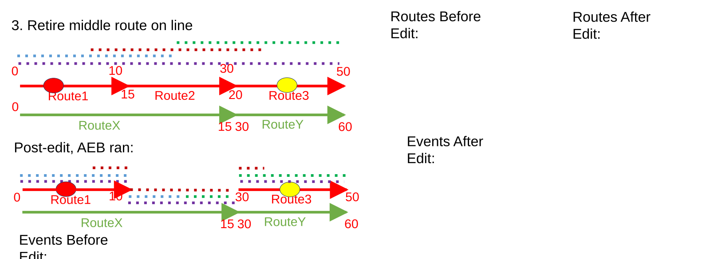

### TC-U23 — Retire second half of routes on line <!-- src: S2 · slide 25 · case 4 -->

| Line ID | Route ID | From Date | ToDate |
| --- | --- | --- | --- |
| Line1 | Route1 | 1/1/2000 | NULL |
| Line1 | Route2 | 1/1/2000 | NULL |
| Line1 | Route3 | 1/1/2000 | NULL |
| Line2 | RouteX | 1/1/2000 | NULL |
| Line2 | RouteY | 1/1/2000 | NULL |

| Line ID | RouteID | From Date | ToDate |
| --- | --- | --- | --- |
| Line1 | Route1 | 1/1/2000 | 1/1/2005 |
| Line1 | Route2 | 1/1/2000 | 1/1/2005 |
| Line1 | Route3 | 1/1/2000 | 1/1/2005 |
| Line1 | Route1 | 1/1/2000 | NULL |
| Line1 | Route2 | 1/1/2000 | NULL |
| Line2 | RouteX | 1/1/2000 | NULL |
| Line2 | RouteY | 1/1/2000 | NULL |

| Event Layer | Event ID | From RouteID | To RouteID | From Date | To Date | From Measure | To Measure |
| --- | --- | --- | --- | --- | --- | --- | --- |
| Point | Pt1 | Route1 | N/A | 1/1/2000 | NULL | 2 | N/A |
| Point | Pt2 | Route3 | N/A | 1/1/2000 | NULL | 40 | N/A |
| Line | Line1 | Route1 | Route3 | 1/1/2000 | NULL | 0 | 50 |
| Line | Line2 | Route1 | Route2 | 1/1/2000 | NULL | 0 | 17.5 |
| Line | Line3 | Route1 | Route3 | 1/1/2000 | NULL | 7 | 35 |
| Line | Line4 | Route2 | Route3 | 1/1/2000 | NULL | 17.5 | 50 |

| Event Layer | Event ID | From RouteID | To RouteID | From Date | To Date | From Measure | To Measure |
| --- | --- | --- | --- | --- | --- | --- | --- |
| Point | Pt1 | Route1 | N/A | 1/1/2000 | NULL | 2 | N/A |
| Point | Pt2 | Route3 | N/A | 1/1/2000 | 1/1/2005 | 40 | N/A |
| Line | Line1 | Route1 | Route3 | 1/1/2000 | 1/1/2005 | 0 | 50 |
| Line | Line2 | Route1 | Route2 | 1/1/2000 | NULL | 0 | 17.5 |
| Line | Line3 | Route1 | Route3 | 1/1/2000 | 1/1/2005 | 7 | 35 |
| Line | Line4 | Route2 | Route3 | 1/1/2000 | 1/1/2005 | 17.5 | 50 |
| Point | Pt2 | RouteY | N/A | 1/1/2005 | NULL | 45 | N/A |
| Line | Line1 | Route1 | Route2 | 1/1/2005 | NULL | 0 | 17.5 |
| Line | Line1 | RouteX | RouteY | 1/1/2005 | NULL | 12.5 | 60 |
| Line | Line3 | Route1 | Route2 | 1/1/2005 | NULL | 7 | 17.5 |
| Line | Line3 | RouteX | RouteY | 1/1/2005 | NULL | 12.5 | 40 |
| Line | Line4 | RouteX | RouteY | 1/1/2005 | NULL | 12.5 | 60 |

[figure: Route1 · RouteX · Route2 · Route3 · 0 · 10 · 15 · 30 · 50 · 20 · 60 · RouteY · Post-edit, AEB ran: · Routes Before Edit: · Routes After Edit: · Events Before Edit: · Events After Edit: · 17.5]

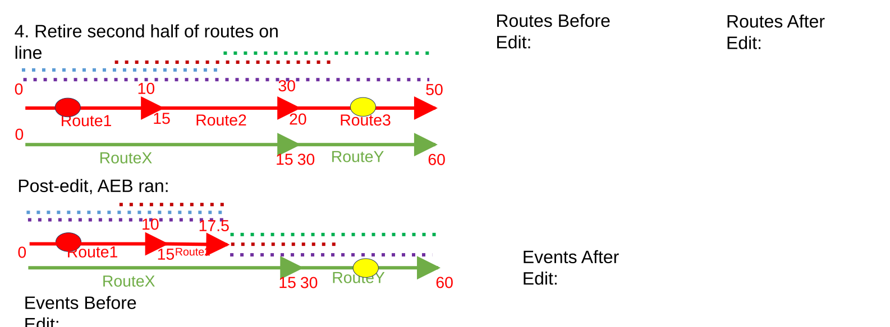

### TC-U24 — Retire all routes on line, partial concurrency <!-- src: S2 · slide 26 · case 5 -->

| Line ID | Route ID | From Date | ToDate |
| --- | --- | --- | --- |
| Line1 | Route1 | 1/1/2000 | NULL |
| Line1 | Route2 | 1/1/2000 | NULL |
| Line1 | Route3 | 1/1/2000 | NULL |
| Line2 | RouteX | 1/1/2000 | NULL |
| Line2 | RouteY | 1/1/2000 | NULL |

| Line ID | RouteID | From Date | ToDate |
| --- | --- | --- | --- |
| Line1 | Route1 | 1/1/2000 | 1/1/2005 |
| Line1 | Route2 | 1/1/2000 | 1/1/2005 |
| Line1 | Route3 | 1/1/2000 | 1/1/2005 |
| Line2 | RouteX | 1/1/2000 | NULL |
| Line2 | RouteY | 1/1/2000 | NULL |

| Event Layer | Event ID | From RouteID | To RouteID | From Date | To Date | From Measure | To Measure |
| --- | --- | --- | --- | --- | --- | --- | --- |
| Point | Pt1 | Route1 | N/A | 1/1/2000 | NULL | 2 | N/A |
| Point | Pt2 | Route3 | N/A | 1/1/2000 | NULL | 40 | N/A |
| Line | Line1 | Route1 | Route3 | 1/1/2000 | NULL | 0 | 50 |
| Line | Line2 | Route1 | Route2 | 1/1/2000 | NULL | 0 | 17.5 |
| Line | Line3 | Route1 | Route3 | 1/1/2000 | NULL | 7 | 35 |
| Line | Line4 | Route2 | Route3 | 1/1/2000 | NULL | 17.5 | 50 |

| Event Layer | Event ID | From RouteID | To RouteID | From Date | To Date | From Measure | To Measure |
| --- | --- | --- | --- | --- | --- | --- | --- |
| Point | Pt1 | Route1 | N/A | 1/1/2000 | 1/1/2005 | 2 | N/A |
| Point | Pt2 | Route3 | N/A | 1/1/2000 | 1/1/2005 | 40 | N/A |
| Line | Line1 | Route1 | Route3 | 1/1/2000 | 1/1/2005 | 0 | 50 |
| Line | Line2 | Route1 | Route2 | 1/1/2000 | 1/1/2005 | 0 | 17.5 |
| Line | Line3 | Route1 | Route3 | 1/1/2000 | 1/1/2005 | 7 | 35 |
| Line | Line4 | Route2 | Route3 | 1/1/2000 | 1/1/2005 | 17.5 | 50 |
| Point | Pt2 | RouteY | N/A | 1/1/2005 | NULL | 45 | N/A |
| Line | Line1 | RouteX | RouteY | 1/1/2005 | NULL | 10 | 60 |
| Line | Line2 | RouteX | RouteX | 1/1/2005 | NULL | 10 | 12.5 |
| Line | Line3 | RouteX | RouteY | 1/1/2005 | NULL | 10 | 40 |
| Line | Line4 | RouteX | RouteY | 1/1/2005 | NULL | 12.5 | 60 |

[figure: Route1 · RouteX · Route2 · Route3 · 0 · 10 · 15 · 30 · 50 · 20 · 60 · RouteY · Post-edit, AEB ran: · Routes Before Edit: · Routes After Edit: · Events Before Edit: · Events After Edit:]

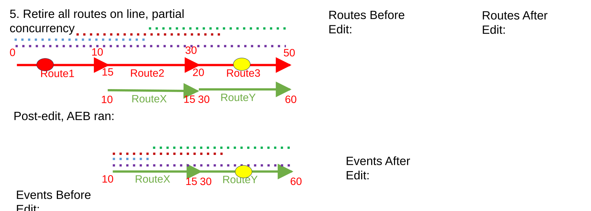

### TC-U25 — Retire All Routes on Line, Multiple Concurrencies (Routes X and Y Are Dominant) <!-- src: S1 · slide 27 · case 6 -->

| Line ID | Route ID | From Date | ToDate |
| --- | --- | --- | --- |
| Line1 | Route1 | 1/1/2000 | NULL |
| Line1 | Route2 | 1/1/2000 | NULL |
| Line1 | Route3 | 1/1/2000 | NULL |
| Line2 | RouteX | 1/1/2000 | NULL |
| Line2 | RouteY | 1/1/2000 | NULL |
| Line3 | RouteA | 1/1/2000 | NULL |

| Line ID | RouteID | From Date | ToDate |
| --- | --- | --- | --- |
| Line1 | Route1 | 1/1/2000 | 1/1/2005 |
| Line1 | Route2 | 1/1/2000 | 1/1/2005 |
| Line1 | Route3 | 1/1/2000 | 1/1/2005 |
| Line2 | RouteX | 1/1/2000 | NULL |
| Line2 | RouteY | 1/1/2000 | NULL |
| Line3 | RouteA | 1/1/2000 | NULL |

| Event Layer | Event ID | From RouteID | To RouteID | From Date | To Date | From Measure | To Measure |
| --- | --- | --- | --- | --- | --- | --- | --- |
| Point | Pt1 | Route1 | N/A | 1/1/2000 | NULL | 2 | N/A |
| Point | Pt2 | Route3 | N/A | 1/1/2000 | NULL | 40 | N/A |
| Line | Line1 | Route1 | Route3 | 1/1/2000 | NULL | 0 | 50 |
| Line | Line2 | Route1 | Route2 | 1/1/2000 | NULL | 0 | 17.5 |
| Line | Line3 | Route1 | Route3 | 1/1/2000 | NULL | 7 | 35 |
| Line | Line4 | Route2 | Route3 | 1/1/2000 | NULL | 17.5 | 50 |

| Event Layer | Event ID | From RouteID | To RouteID | From Date | To Date | From Measure | To Measure |
| --- | --- | --- | --- | --- | --- | --- | --- |
| Point | Pt1 | Route1 | N/A | 1/1/2000 | 1/1/2005 | 2 | N/A |
| Point | Pt2 | Route3 | N/A | 1/1/2000 | 1/1/2005 | 40 | N/A |
| Line | Line1 | Route1 | Route3 | 1/1/2000 | 1/1/2005 | 0 | 50 |
| Line | Line2 | Route1 | Route2 | 1/1/2000 | 1/1/2005 | 0 | 17.5 |
| Line | Line3 | Route1 | Route3 | 1/1/2000 | 1/1/2005 | 7 | 35 |
| Line | Line4 | Route2 | Route3 | 1/1/2000 | 1/1/2005 | 17.5 | 50 |
| Point | Pt1 | RouteX | N/A | 1/1/2005 | NULL | 2 | N/A |
| Point | Pt2 | RouteY | N/A | 1/1/2005 | NULL | 45 | N/A |
| Line | Line1 | RouteX | RouteY | 1/1/2005 | NULL | 0 | 60 |
| Line | Line2 | RouteX | RouteX | 1/1/2005 | NULL | 0 | 12.5 |
| Line | Line3 | RouteX | RouteY | 1/1/2005 | NULL | 7 | 40 |
| Line | Line4 | RouteX | RouteY | 1/1/2005 | NULL | 12.5 | 60 |

[figure: Route1 · RouteX · Route2 · Route3 · 0 · 10 · 15 · 30 · 50 · 20 · 60 · RouteY · Post-edit, AEB ran: · Routes Before Edit: · Routes After Edit: · Events Before Edit: · Events After Edit: · 100 · RouteA]

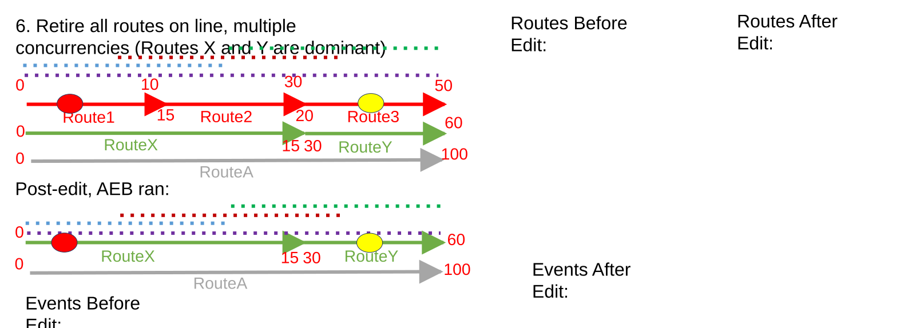

### TC-U26 — Retire whole route, concurrent route has gap (case 7) <!-- src: S2 · slide 28 · case 7 -->

| Line ID | Route ID | From Date | ToDate |
| --- | --- | --- | --- |
| Line1 | Route1 | 1/1/2000 | NULL |
| Line1 | Route2 | 1/1/2000 | NULL |
| Line1 | Route3 | 1/1/2000 | NULL |
| Line2 | RouteX | 1/1/2000 | NULL |
| Line2 | RouteY | 1/1/2000 | NULL |

| Line ID | RouteID | From Date | ToDate |
| --- | --- | --- | --- |
| Line1 | Route1 | 1/1/2000 | 1/1/2005 |
| Line1 | Route2 | 1/1/2000 | 1/1/2005 |
| Line1 | Route3 | 1/1/2000 | 1/1/2005 |
| Line2 | RouteX | 1/1/2000 | NULL |
| Line2 | RouteY | 1/1/2000 | NULL |

| Event Layer | Event ID | From RouteID | To RouteID | From Date | To Date | From Measure | To Measure |
| --- | --- | --- | --- | --- | --- | --- | --- |
| Point | Pt1 | Route1 | N/A | 1/1/2000 | NULL | 2 | N/A |
| Point | Pt2 | Route3 | N/A | 1/1/2000 | NULL | 40 | N/A |
| Line | Line1 | Route1 | Route3 | 1/1/2000 | NULL | 0 | 50 |
| Line | Line2 | Route1 | Route2 | 1/1/2000 | NULL | 0 | 17.5 |
| Line | Line3 | Route1 | Route3 | 1/1/2000 | NULL | 7 | 35 |
| Line | Line4 | Route2 | Route3 | 1/1/2000 | NULL | 17.5 | 50 |

| Event Layer | Event ID | From RouteID | To RouteID | From Date | To Date | From Measure | To Measure |
| --- | --- | --- | --- | --- | --- | --- | --- |
| Point | Pt1 | Route1 | N/A | 1/1/2000 | 1/1/2005 | 2 | N/A |
| Point | Pt2 | Route3 | N/A | 1/1/2000 | 1/1/2005 | 40 | N/A |
| Line | Line1 | Route1 | Route3 | 1/1/2000 | 1/1/2005 | 0 | 50 |
| Line | Line2 | Route1 | Route2 | 1/1/2000 | 1/1/2005 | 0 | 17.5 |
| Line | Line3 | Route1 | Route3 | 1/1/2000 | 1/1/2005 | 7 | 35 |
| Line | Line4 | Route2 | Route3 | 1/1/2000 | 1/1/2005 | 17.5 | 50 |
| Point | Pt1 | RouteX | N/A | 1/1/2005 | NULL | 2 | N/A |
| Point | Pt2 | RouteY | N/A | 1/1/2005 | NULL | 45 | N/A |
| Line | Line1 | RouteX | RouteX | 1/1/2005 | NULL | 0 | 5 |
| Line | Line1 | RouteY | RouteY | 1/1/2005 | NULL | 30 | 60 |
| Line | Line2 | RouteX | RouteX | 1/1/2005 | NULL | 0 | 5 |
| Line | Line3 | RouteX | RouteX | 1/1/2005 | NULL | 4 | 5 |
| Line | Line3 | RouteX | RouteX | 1/1/2005 | NULL | 30 | 40 |
| Line | Line4 | RouteY | RouteY | 1/1/2005 | NULL | 30 | 60 |

[figure: Route1 · RouteX · Route2 · Route3 · 0 · 10 · 15 · 30 · 50 · 20 · 5 · 60 · RouteY · Post-edit, AEB ran: · Routes Before Edit: · Routes After Edit: · Events Before Edit: · Events After Edit:]

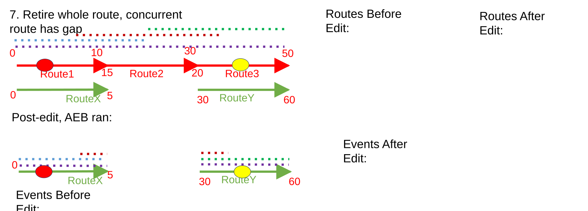

### TC-U27 — Retire all routes on a line, no concurrencies <!-- src: S2 · slide 29 · case 8 -->

| Line ID | Route ID | From Date | ToDate |
| --- | --- | --- | --- |
| Line1 | Route1 | 1/1/2000 | NULL |
| Line1 | Route2 | 1/1/2000 | NULL |
| Line1 | Route3 | 1/1/2000 | NULL |

| Line ID | RouteID | From Date | ToDate |
| --- | --- | --- | --- |
| Line1 | Route1 | 1/1/2000 | 1/1/2005 |
| Line1 | Route2 | 1/1/2000 | 1/1/2005 |
| Line1 | Route3 | 1/1/2000 | 1/1/2005 |

| Event Layer | Event ID | From RouteID | To RouteID | From Date | To Date | From Measure | To Measure |
| --- | --- | --- | --- | --- | --- | --- | --- |
| Point | Pt1 | Route1 | N/A | 1/1/2000 | NULL | 2 | N/A |
| Point | Pt2 | Route3 | N/A | 1/1/2000 | NULL | 40 | N/A |
| Line | Line1 | Route1 | Route3 | 1/1/2000 | NULL | 0 | 50 |
| Line | Line2 | Route1 | Route2 | 1/1/2000 | NULL | 0 | 17.5 |
| Line | Line3 | Route1 | Route3 | 1/1/2000 | NULL | 7 | 35 |
| Line | Line4 | Route2 | Route3 | 1/1/2000 | NULL | 17.5 | 50 |

| Event Layer | Event ID | From RouteID | To RouteID | From Date | To Date | From Measure | To Measure |
| --- | --- | --- | --- | --- | --- | --- | --- |
| Point | Pt1 | Route1 | N/A | 1/1/2000 | 1/1/2005 | 2 | N/A |
| Point | Pt2 | Route3 | N/A | 1/1/2000 | 1/1/2005 | 40 | N/A |
| Line | Line1 | Route1 | Route3 | 1/1/2000 | 1/1/2005 | 0 | 50 |
| Line | Line2 | Route1 | Route2 | 1/1/2000 | 1/1/2005 | 0 | 17.5 |
| Line | Line3 | Route1 | Route3 | 1/1/2000 | 1/1/2005 | 7 | 35 |
| Line | Line4 | Route2 | Route3 | 1/1/2000 | 1/1/2005 | 17.5 | 50 |

[figure: Route1 · Route2 · Route3 · 0 · 10 · 15 · 30 · 50 · 20 · 60 · Post-edit, AEB ran: · Routes Before Edit: · Routes After Edit: · Events Before Edit: · Events After Edit:]

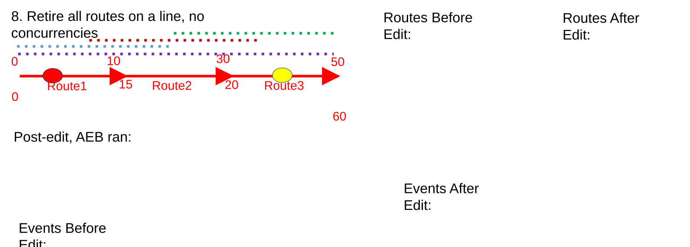

### TC-U28 — Retire whole route with multiple partial concurrencies (case 9) <!-- src: S2 · slide 30 · case 9 -->

| Line ID | Route ID | From Date | ToDate |
| --- | --- | --- | --- |
| Line1 | Route1 | 1/1/2000 | NULL |
| Line1 | Route2 | 1/1/2000 | NULL |
| Line1 | Route3 | 1/1/2000 | NULL |
| Line2 | RouteX | 1/1/2000 | NULL |
| Line2A | RouteY | 1/1/2000 | NULL |
| Line3 | RouteA | 1/1/2000 | NULL |

| Line ID | RouteID | From Date | ToDate |
| --- | --- | --- | --- |
| Line1 | Route1 | 1/1/2000 | 1/1/2005 |
| Line1 | Route2 | 1/1/2000 | 1/1/2005 |
| Line1 | Route3 | 1/1/2000 | 1/1/2005 |
| Line2 | RouteX | 1/1/2000 | NULL |
| Line2A | RouteY | 1/1/2000 | NULL |
| Line3 | RouteA | 1/1/2000 | NULL |

| Event Layer | Event ID | From RouteID | To RouteID | From Date | To Date | From Measure | To Measure |
| --- | --- | --- | --- | --- | --- | --- | --- |
| Point | Pt1 | Route1 | N/A | 1/1/2000 | NULL | 2 | N/A |
| Point | Pt2 | Route3 | N/A | 1/1/2000 | NULL | 40 | N/A |
| Line | Line1 | Route1 | Route3 | 1/1/2000 | NULL | 0 | 50 |
| Line | Line2 | Route1 | Route2 | 1/1/2000 | NULL | 0 | 17.5 |
| Line | Line3 | Route1 | Route3 | 1/1/2000 | NULL | 7 | 35 |
| Line | Line4 | Route2 | Route3 | 1/1/2000 | NULL | 17.5 | 50 |

| Event Layer | Event ID | From RouteID | To RouteID | From Date | To Date | From Measure | To Measure |
| --- | --- | --- | --- | --- | --- | --- | --- |
| Point | Pt1 | Route1 | N/A | 1/1/2000 | 1/1/2005 | 2 | N/A |
| Point | Pt2 | Route3 | N/A | 1/1/2000 | 1/1/2005 | 40 | N/A |
| Line | Line1 | Route1 | Route3 | 1/1/2000 | 1/1/2005 | 0 | 50 |
| Line | Line2 | Route1 | Route2 | 1/1/2000 | 1/1/2005 | 0 | 17.5 |
| Line | Line3 | Route1 | Route3 | 1/1/2000 | 1/1/2005 | 7 | 35 |
| Line | Line4 | Route2 | Route3 | 1/1/2000 | 1/1/2005 | 17.5 | 50 |
| Point | Pt1 | RouteX | N/A | 1/1/2005 | NULL | 2 | N/A |
| Point | Pt2 | RouteY | N/A | 1/1/2005 | NULL | 45 | N/A |
| Line | Line1 | RouteX | RouteX | 1/1/2005 | NULL | 0 | 15 |
| Line | Line1 | RouteY | RouteY | 1/1/2005 | NULL | 30 | 60 |
| Line | Line2 | RouteX | RouteX | 1/1/2005 | NULL | 0 | 12.5 |
| Line | Line3 | RouteX | RouteX | 1/1/2005 | NULL | 7 | 15 |
| Line | Line3 | RouteY | RouteY | 1/1/2005 | NULL | 30 | 40 |
| Line | Line4 | RouteX | RouteY | 1/1/2005 | NULL | 12.5 | 15 |
| Line | Line4 | RouteY | RouteY | 1/1/2005 | NULL | 30 | 60 |

[figure: Route1 · RouteX · Route2 · Route3 · 0 · 10 · 15 · 30 · 50 · 20 · 60 · RouteY · Post-edit, AEB ran: · Routes Before Edit: · Routes After Edit: · Events Before Edit: · Events After Edit: · 100 · RouteA]

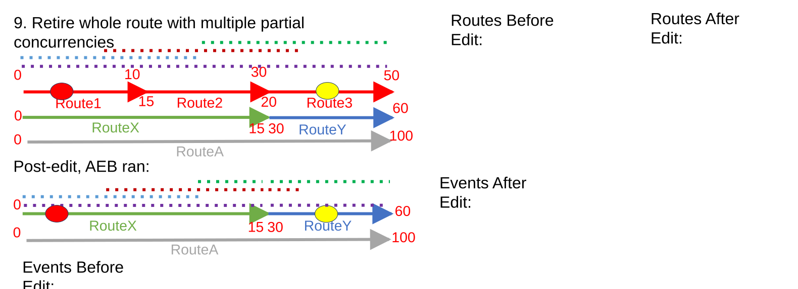

### TC-U29 — Retire Second Half of Routes on Line, Point Event Is on Cusp of Retirement <!-- src: S1 · slide 31 · case 10 -->

| Line ID | Route ID | From Date | ToDate |
| --- | --- | --- | --- |
| Line1 | Route1 | 1/1/2000 | NULL |
| Line1 | Route2 | 1/1/2000 | NULL |
| Line1 | Route3 | 1/1/2000 | NULL |
| Line2 | RouteX | 1/1/2000 | NULL |
| Line2 | RouteY | 1/1/2000 | NULL |

| Line ID | RouteID | From Date | ToDate |
| --- | --- | --- | --- |
| Line1 | Route1 | 1/1/2000 | 1/1/2005 |
| Line1 | Route2 | 1/1/2000 | 1/1/2005 |
| Line1 | Route3 | 1/1/2000 | 1/1/2005 |
| Line1 | Route1 | 1/1/2000 | NULL |
| Line1 | Route2 | 1/1/2000 | NULL |
| Line2 | RouteX | 1/1/2000 | NULL |
| Line2 | RouteY | 1/1/2000 | NULL |

| Event Layer | Event ID | From RouteID | To RouteID | From Date | To Date | From Measure | To Measure |
| --- | --- | --- | --- | --- | --- | --- | --- |
| Point | Pt1 | Route1 | N/A | 1/1/2000 | NULL | 2 | N/A |
| Point | Pt2 | Route3 | N/A | 1/1/2000 | NULL | 40 | N/A |
| Line | Line1 | Route1 | Route3 | 1/1/2000 | NULL | 0 | 50 |
| Line | Line2 | Route1 | Route2 | 1/1/2000 | NULL | 0 | 17.5 |
| Line | Line3 | Route1 | Route3 | 1/1/2000 | NULL | 7 | 35 |
| Line | Line4 | Route2 | Route3 | 1/1/2000 | NULL | 17.5 | 50 |

| Event Layer | Event ID | From RouteID | To RouteID | From Date | To Date | From Measure | To Measure |
| --- | --- | --- | --- | --- | --- | --- | --- |
| Point | Pt1 | Route1 | N/A | 1/1/2000 | NULL | 2 | N/A |
| Point | Pt2 | Route2 | N/A | 1/1/2000 | 1/1/2005 | 17.5 | N/A |
| Line | Line1 | Route1 | Route3 | 1/1/2000 | 1/1/2005 | 0 | 50 |
| Line | Line2 | Route1 | Route2 | 1/1/2000 | NULL | 0 | 17.5 |
| Line | Line3 | Route1 | Route3 | 1/1/2000 | 1/1/2005 | 7 | 35 |
| Line | Line4 | Route2 | Route3 | 1/1/2000 | 1/1/2005 | 17.5 | 50 |
| Point | Pt2 | RouteX | N/A | 1/1/2005 | NULL | 17.5 | N/A |
| Line | Line1 | Route1 | Route2 | 1/1/2005 | NULL | 0 | 17.5 |
| Line | Line1 | RouteX | RouteY | 1/1/2005 | NULL | 12.5 | 60 |
| Line | Line3 | Route1 | Route2 | 1/1/2005 | NULL | 7 | 17.5 |
| Line | Line3 | RouteX | RouteY | 1/1/2005 | NULL | 12.5 | 40 |
| Line | Line4 | RouteX | RouteY | 1/1/2005 | NULL | 12.5 | 60 |

[figure: Route1 · RouteX · Route2 · Route3 · 0 · 10 · 15 · 30 · 50 · 20 · 60 · RouteY · Post-edit, AEB ran: · Routes Before Edit: · Routes After Edit: · Events Before Edit: · Events After Edit: · 17.5]

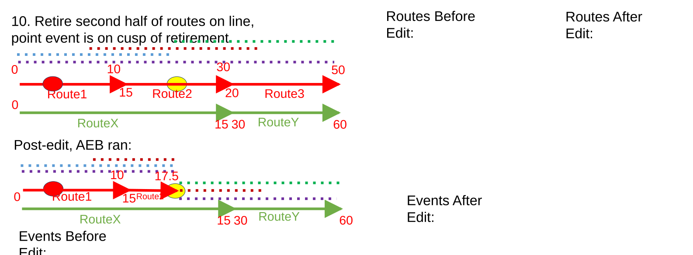

### TC-U30 — Retire all routes on line, source routes have gap <!-- src: S2 · slide 32 · case 11 -->

| Line ID | Route ID | From Date | ToDate |
| --- | --- | --- | --- |
| Line1 | Route1 | 1/1/2000 | NULL |
| Line1 | Route3 | 1/1/2000 | NULL |
| Line2 | RouteX | 1/1/2000 | NULL |
| Line2 | RouteY | 1/1/2000 | NULL |

| Line ID | RouteID | From Date | ToDate |
| --- | --- | --- | --- |
| Line1 | Route1 | 1/1/2000 | 1/1/2005 |
| Line1 | Route3 | 1/1/2000 | 1/1/2005 |
| Line2 | RouteX | 1/1/2000 | NULL |
| Line2 | RouteY | 1/1/2000 | NULL |

| Event Layer | Event ID | From RouteID | To RouteID | From Date | To Date | From Measure | To Measure |
| --- | --- | --- | --- | --- | --- | --- | --- |
| Point | Pt1 | Route1 | N/A | 1/1/2000 | NULL | 2 | N/A |
| Point | Pt2 | Route3 | N/A | 1/1/2000 | NULL | 40 | N/A |
| Line | Line1 | Route1 | Route1 | 1/1/2000 | NULL | 0 | 10 |
| Line | Line1A | Route3 | Route3 | 1/1/2000 | NULL | 30 | 50 |
| Line | Line2 | Route1 | Route1 | 1/1/2000 | NULL | 0 | 10 |
| Line | Line3 | Route1 | Route1 | 1/1/2000 | NULL | 7 | 10 |
| Line | Line3A | Route3 | Route3 | 1/1/2000 | NULL | 30 | 35 |
| Line | Line4 | Route2 | Route3 | 1/1/2000 | NULL | 17.5 | 50 |

| Event Layer | Event ID | From RouteID | To RouteID | From Date | To Date | From Measure | To Measure |
| --- | --- | --- | --- | --- | --- | --- | --- |
| Point | Pt1 | Route1 | N/A | 1/1/2000 | 1/1/2005 | 2 | N/A |
| Point | Pt2 | Route3 | N/A | 1/1/2000 | 1/1/2005 | 40 | N/A |
| Line | Line1 | Route1 | Route1 | 1/1/2000 | 1/1/2005 | 0 | 10 |
| Line | Line1A | Route3 | Route3 | 1/1/2000 | 1/1/2005 | 30 | 50 |
| Line | Line2 | Route1 | Route1 | 1/1/2000 | 1/1/2005 | 0 | 10 |
| Line | Line3 | Route1 | Route1 | 1/1/2000 | 1/1/2005 | 7 | 10 |
| Line | Line3A | Route3 | Route3 | 1/1/2000 | 1/1/2005 | 30 | 35 |
| Line | Line4 | Route2 | Route3 | 1/1/2000 | 1/1/2005 | 17.5 | 50 |
| Point | Pt1 | RouteX | N/A | 1/1/2005 | NULL | 2 | N/A |
| Point | Pt2 | RouteY | N/A | 1/1/2005 | NULL | 40 | N/A |
| Line | Line1 | RouteX | RouteX | 1/1/2005 | NULL | 0 | 10 |
| Line | Line1A | RouteY | RouteY | 1/1/2005 | NULL | 30 | 60 |
| Line | Line2 | RouteX | RouteX | 1/1/2005 | NULL | 0 | 10 |
| Line | Line3 | RouteX | RouteX | 1/1/2005 | NULL | 7 | 10 |
| Line | Line3A | RouteY | RouteY | 1/1/2005 | NULL | 30 | 40 |
| Line | Line4 | RouteY | RouteY | 1/1/2005 | NULL | 30 | 60 |

[figure: Route1 · RouteX · Route3 · 0 · 10 · 30 · 50 · 15 · 60 · RouteY · Post-edit, AEB ran: · Routes Before Edit: · Routes After Edit: · Events Before Edit: · Events After Edit:]

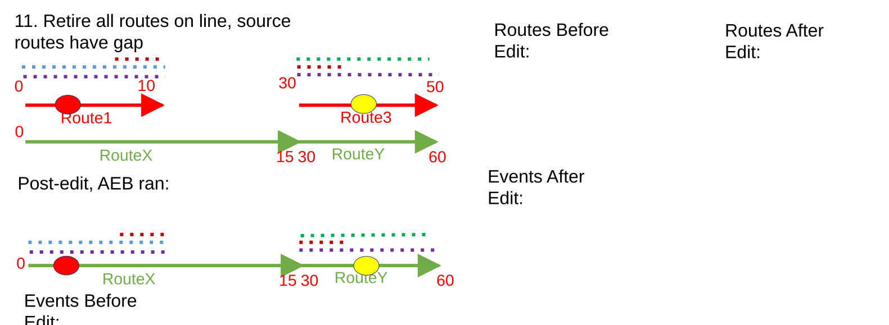

### TC-U31 — Retire all routes on line, non-proportional concurrent routes <!-- src: S2 · slide 33 · case 12 -->

| Line ID | Route ID | From Date | ToDate |
| --- | --- | --- | --- |
| Line1 | Route1 | 1/1/2000 | NULL |
| Line1 | Route2 | 1/1/2000 | NULL |
| Line1 | Route3 | 1/1/2000 | NULL |
| Line2 | RouteX | 1/1/2000 | NULL |
| Line2 | RouteY | 1/1/2000 | NULL |

| Line ID | RouteID | From Date | ToDate |
| --- | --- | --- | --- |
| Line1 | Route1 | 1/1/2000 | 1/1/2005 |
| Line1 | Route2 | 1/1/2000 | 1/1/2005 |
| Line1 | Route3 | 1/1/2000 | 1/1/2005 |
| Line2 | RouteX | 1/1/2000 | NULL |
| Line2 | RouteY | 1/1/2000 | NULL |

| Event Layer | Event ID | From RouteID | To RouteID | From Date | To Date | From Measure | To Measure |
| --- | --- | --- | --- | --- | --- | --- | --- |
| Point | Pt1 | Route1 | N/A | 1/1/2000 | NULL | 2 | N/A |
| Point | Pt2 | Route3 | N/A | 1/1/2000 | NULL | 40 | N/A |
| Line | Line1 | Route1 | Route3 | 1/1/2000 | NULL | 0 | 50 |
| Line | Line2 | Route1 | Route2 | 1/1/2000 | NULL | 0 | 17.5 |
| Line | Line3 | Route1 | Route3 | 1/1/2000 | NULL | 7 | 35 |
| Line | Line4 | Route2 | Route3 | 1/1/2000 | NULL | 17.5 | 50 |

| Event Layer | Event ID | From RouteID | To RouteID | From Date | To Date | From Measure | To Measure |
| --- | --- | --- | --- | --- | --- | --- | --- |
| Point | Pt1 | Route1 | N/A | 1/1/2000 | 1/1/2005 | 2 | N/A |
| Point | Pt2 | Route3 | N/A | 1/1/2000 | 1/1/2005 | 40 | N/A |
| Line | Line1 | Route1 | Route3 | 1/1/2000 | 1/1/2005 | 0 | 50 |
| Line | Line2 | Route1 | Route2 | 1/1/2000 | 1/1/2005 | 0 | 17.5 |
| Line | Line3 | Route1 | Route3 | 1/1/2000 | 1/1/2005 | 7 | 35 |
| Line | Line4 | Route2 | Route3 | 1/1/2000 | 1/1/2005 | 17.5 | 50 |
| Point | Pt1 | RouteX | N/A | 1/1/2005 | NULL | 10 | N/A |
| Point | Pt2 | RouteY | N/A | 1/1/2005 | NULL | 450 | N/A |
| Line | Line1 | RouteX | RouteY | 1/1/2005 | NULL | 0 | 600 |
| Line | Line2 | RouteX | RouteX | 1/1/2005 | NULL | 0 | 75 |
| Line | Line3 | RouteX | RouteY | 1/1/2005 | NULL | 35 | 400 |
| Line | Line4 | RouteX | RouteY | 1/1/2005 | NULL | 62.5 | 600 |

[figure: Route1 · RouteX · Route2 · Route3 · 0 · 10 · 15 · 30 · 50 · 20 · 100 · 300 · 600 · RouteY · Post-edit, AEB ran: · Routes Before Edit: · Routes After Edit: · Events Before Edit: · Events After Edit:]

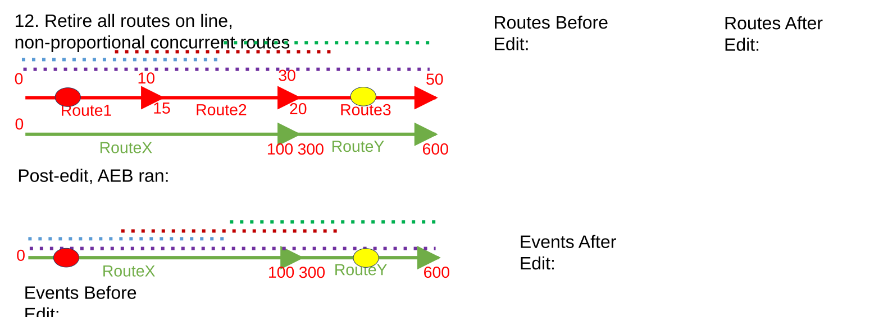

### TC-U32 — Retire all routes on complex line <!-- src: S2 · slide 34 · case 13 -->

| RouteID | From Date | To Date |
| --- | --- | --- |
| Route1 | 1/1/2000 | NULL |
| Route2 | 1/1/2000 | NULL |
| RouteX | 1/1/2000 | NULL |
| RouteY | 1/1/2000 | NULL |

| Layer | Event ID | From Date | To Date | From RouteID | To RouteID | From Measure | To Measure |
| --- | --- | --- | --- | --- | --- | --- | --- |
| Red Event | Red1 | 1/1/2000 | NULL | Route1 | Route1 | 0 | 5 |
| Red Event | Red2 | 1/1/2000 | NULL | Route1 | Route2 | 5 | 20 |
| Blue Event | Blue1 | 1/1/2000 | NULL | Route1 | Route2 | 0 | 20 |
| Green Event | Green1 | 1/1/2000 | NULL | Route1 | Route2 | 0 | 20 |

| RouteID | From Date | To Date |
| --- | --- | --- |
| Route1 | 1/1/2000 | 1/1/2005 |
| Route2 | 1/1/2000 | 1/1/2005 |
| RouteX | 1/1/2000 | 1/1/2005 |
| RouteY | 1/1/2000 | 1/1/2005 |

| Layer | Event ID | From Date | To Date | From RouteID | To RouteID | From Measure | To Measure |
| --- | --- | --- | --- | --- | --- | --- | --- |
| Red Event | Red1 | 1/1/2000 | 1/1/2005 | Route1 | Route1 | 0 | 5 |
| Red Event | Red2 | 1/1/2000 | 1/1/2005 | Route1 | Route2 | 5 | 20 |
| Blue Event | Blue1 | 1/1/2000 | 1/1/2005 | Route1 | Route2 | 0 | 20 |
| Green Event | Green1 | 1/1/2000 | 1/1/2005 | Route1 | Route2 | 0 | 20 |
| Red Event | Red1 | 1/1/2005 | NULL | RouteX | RouteY | 0 | 5 |
| Red Event | Red2 | 1/1/2005 | NULL | RouteX | RouteY | 5 | 20 |
| Blue Event | Blue1 | 1/1/2005 | NULL | RouteX | RouteY | 0 | 20 |
| Green Event | Green1 | 1/1/2005 | NULL | RouteX | RouteY | 0 | 20 |

[figure: 0 · 10 · 5 · 15 · Route1 · Route2 · Input: · 20 · Routes Before Edit: · Routes After Edit: · Events Before Edit: · RouteX · RouteY · Events After Edit:]

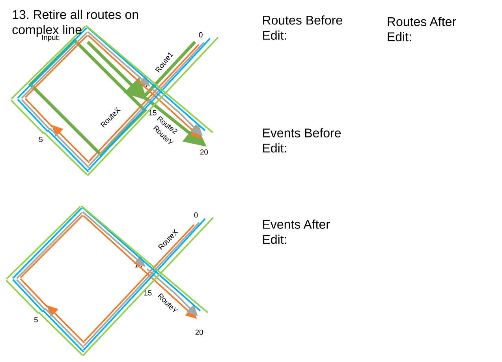

### TC-U33 — Retire whole vertical route (case 14) <!-- src: S2 · slide 35 · case 14 -->

| RouteID | FromDate | ToDate |
| --- | --- | --- |
| Route2 | 1/1/2000 | NULL |
| Route2A | 1/1/2000 | NULL |
| Route1 | 1/1/2000 | NULL |
| Route1A | 1/1/2000 | NULL |

| Input Layer | Event ID | From RouteID | To RouteID | From Date | To Date | From Measure | To Measure |
| --- | --- | --- | --- | --- | --- | --- | --- |
| Red Event | Red1 | Route1 | Route1 | 1/1/2000 | <Null> | 0 | 2.5 |
| Red Event | Red2 | Route1 | Route1A | 1/1/2000 | <Null> | 2.5 | 10 |
| Blue Event | Blue1 | Route1 | Route1A | 1/1/2000 | <Null> | 0 | 10 |
| Green Event | Green1 | Route1 | Route1A | 1/1/2000 | <Null> | 0 | 10 |

| Input Layer | Event ID | From RouteID | To RouteID | From Date | To Date | From Measure | To Measure |
| --- | --- | --- | --- | --- | --- | --- | --- |
| Red Event | Red1 | Route1 | Route1 | 1/1/2000 | 1/1/2005 | 0 | 2.5 |
| Red Event | Red2 | Route1 | Route1A | 1/1/2000 | 1/1/2005 | 2.5 | 10 |
| Blue Event | Blue1 | Route1 | Route1A | 1/1/2000 | 1/1/2005 | 0 | 10 |
| Green Event | Green1 | Route1 | Route1A | 1/1/2000 | 1/1/2005 | 0 | 10 |
| Red Event | Red1 | Route2 | Route2 | 1/1/2005 | <Null> | 0 | 2.5 |
| Red Event | Red2 | Route2 | Route2A | 1/1/2005 | <Null> | 2.5 | 10 |
| Blue Event | Blue1 | Route2 | Route2A | 1/1/2005 | <Null> | 0 | 10 |
| Green Event | Green1 | Route2 | Route2A | 1/1/2005 | <Null> | 0 | 10 |

| RouteID | FromDate | ToDate |
| --- | --- | --- |
| Route2 | 1/1/2000 | NULL |
| Route2A | 1/1/2000 | NULL |
| Route1 | 1/1/2000 | 1/1/2005 |
| Route1A | 1/1/2000 | 1/1/2005 |

[figure: 0 · 10 · 5 · Routes Before Edit: · Routes After Edit: · Events Before Edit: · Events After Edit:]

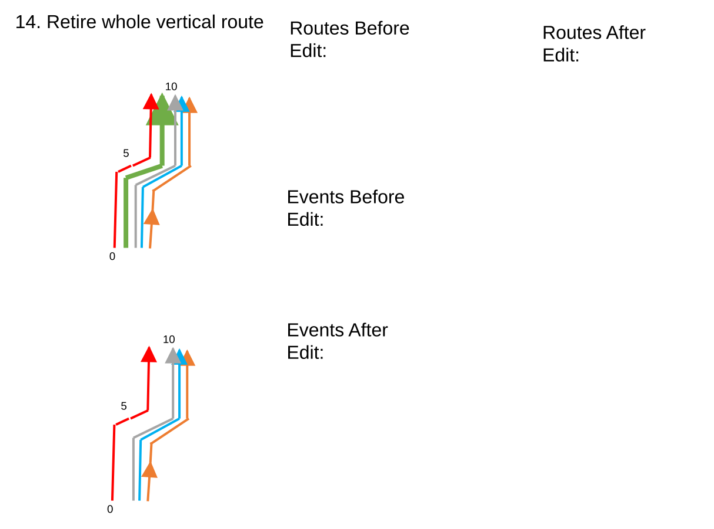

### TC-U34 — Retire First Half of Routes on a Line, Recalibrate Downstream (Stay Put) (case 15) <!-- src: S1 · slide 36 · case 15 -->

| Line ID | Route ID | From Date | ToDate |
| --- | --- | --- | --- |
| Line1 | Route1 | 1/1/2000 | NULL |
| Line1 | Route2 | 1/1/2000 | NULL |
| Line1 | Route3 | 1/1/2000 | NULL |
| Line2 | RouteX | 1/1/2000 | NULL |
| Line2 | RouteY | 1/1/2000 | NULL |

| Line ID | RouteID | From Date | ToDate |
| --- | --- | --- | --- |
| Line1 | Route1 | 1/1/2000 | 1/1/2005 |
| Line1 | Route2 | 1/1/2000 | 1/1/2005 |
| Line1 | Route3 | 1/1/2000 | 1/1/2005 |
| Line1 | Route3 | 1/1/2005 | NULL |
| Line2 | RouteX | 1/1/2000 | NULL |
| Line2 | RouteY | 1/1/2000 | NULL |

| Event Layer | Event ID | From RouteID | To RouteID | From Date | To Date | From Measure | To Measure |
| --- | --- | --- | --- | --- | --- | --- | --- |
| Point | Pt1 | Route1 | N/A | 1/1/2000 | NULL | 2 | N/A |
| Point | Pt2 | Route3 | N/A | 1/1/2000 | NULL | 40 | N/A |
| Line | Line1 | Route1 | Route3 | 1/1/2000 | NULL | 0 | 50 |
| Line | Line2 | Route1 | Route2 | 1/1/2000 | NULL | 0 | 17.5 |
| Line | Line3 | Route1 | Route3 | 1/1/2000 | NULL | 7 | 35 |
| Line | Line4 | Route2 | Route3 | 1/1/2000 | NULL | 17.5 | 50 |

| Event Layer | Event ID | From RouteID | To RouteID | From Date | To Date | From Measure | To Measure |
| --- | --- | --- | --- | --- | --- | --- | --- |
| Point | Pt1 | Route1 | N/A | 1/1/2000 | 1/1/2005 | 2 | N/A |
| Point | Pt2 | Route3 | N/A | 1/1/2000 | 1/1/2005 | 40 | N/A |
| Line | Line1 | Route1 | Route3 | 1/1/2000 | 1/1/2005 | 0 | 50 |
| Line | Line2 | Route1 | Route2 | 1/1/2000 | 1/1/2005 | 0 | 17.5 |
| Line | Line3 | Route1 | Route3 | 1/1/2000 | 1/1/2005 | 7 | 35 |
| Line | Line4 | Route2 | Route3 | 1/1/2000 | 1/1/2005 | 17.5 | 50 |
| Point | Pt1 | RouteX | N/A | 1/1/2005 | NULL | 2 | N/A |
| Point | Pt2 | Route3 | N/A | 1/1/2005 | NULL | 40 | N/A |
| Line | Line1 | RouteX | RouteY | 1/1/2005 | NULL | 0 | 45 |
| Line | Line1 | Route3 | Route3 | 1/1/2005 | NULL | 0 | 10 |
| Line | Line2 | RouteX | RouteX | 1/1/2005 | NULL | 0 | 12.5 |
| Line | Line3 | RouteX | RouteY | 1/1/2005 | NULL | 7 | 45 |
| Line | Line3 | Route3 | Route3 | 1/1/2005 | NULL | 0 | 10 |
| Line | Line4 | RouteX | RouteY | 1/1/2005 | NULL | 12.5 | 45 |
| Line | Line4 | Route3 | Route3 | 1/1/2005 | NULL | 0 | 10 |

[figure: Route1 · RouteX · Route2 · Route3 · 0 · 10 · 15 · 30 · 50 · 20 · 60 · RouteY · Post-edit, AEB ran: · Routes Before Edit: · Routes After Edit: · Events Before Edit: · Events After Edit:]

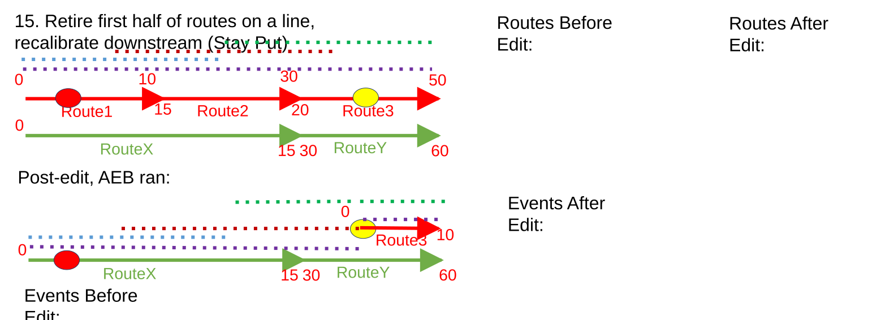

### TC-U35 — Retire First Half of Routes on a Line, Recalibrate Downstream (Stay Put) (case 16) <!-- src: S1 · slide 37 · case 16 -->

| Line ID | Route ID | From Date | ToDate |
| --- | --- | --- | --- |
| Line1 | Route1 | 1/1/2000 | NULL |
| Line1 | Route2 | 1/1/2000 | NULL |
| Line1 | Route3 | 1/1/2000 | NULL |
| Line2 | RouteX | 1/1/2000 | NULL |
| Line2 | RouteY | 1/1/2000 | NULL |

| Line ID | RouteID | From Date | ToDate |
| --- | --- | --- | --- |
| Line1 | Route1 | 1/1/2000 | 1/1/2005 |
| Line1 | Route2 | 1/1/2000 | 1/1/2005 |
| Line1 | Route3 | 1/1/2000 | 1/1/2005 |
| Line1 | Route3 | 1/1/2005 | NULL |
| Line2 | RouteX | 1/1/2000 | NULL |
| Line2 | RouteY | 1/1/2000 | NULL |

| Event Layer | Event ID | From RouteID | To RouteID | From Date | To Date | From Measure | To Measure |
| --- | --- | --- | --- | --- | --- | --- | --- |
| Point | Pt1 | Route1 | N/A | 1/1/2000 | NULL | 2 | N/A |
| Point | Pt2 | Route3 | N/A | 1/1/2000 | NULL | 40 | N/A |
| Line | Line1 | Route1 | Route3 | 1/1/2000 | NULL | 0 | 50 |
| Line | Line2 | Route1 | Route2 | 1/1/2000 | NULL | 0 | 17.5 |
| Line | Line3 | Route1 | Route3 | 1/1/2000 | NULL | 7 | 35 |
| Line | Line4 | Route2 | Route3 | 1/1/2000 | NULL | 17.5 | 50 |

| Event Layer | Event ID | From RouteID | To RouteID | From Date | To Date | From Measure | To Measure | Loc Error |
| --- | --- | --- | --- | --- | --- | --- | --- | --- |
| Point | Pt1 | Route1 | N/A | 1/1/2000 | 1/1/2005 | 2 | N/A | No Error |
| Point | Pt2 | Route3 | N/A | 1/1/2000 | 1/1/2005 | 40 | N/A | No Error |
| Line | Line1 | Route1 | Route3 | 1/1/2000 | 1/1/2005 | 0 | 50 | No Error |
| Line | Line2 | Route1 | Route2 | 1/1/2000 | 1/1/2005 | 0 | 17.5 | No Error |
| Line | Line3 | Route1 | Route3 | 1/1/2000 | 1/1/2005 | 7 | 35 | No Error |
| Line | Line4 | Route2 | Route3 | 1/1/2000 | 1/1/2005 | 17.5 | 50 | No Error |
| Point | Pt1 | RouteX | N/A | 1/1/2005 | NULL | 2 | N/A | No Error |
| Point | Pt2 | Route3 | N/A | 1/1/2005 | NULL | 40 | N/A | Route Location Not Found |
| Line | Line1 | RouteX | RouteY | 1/1/2005 | NULL | 0 | 45 | No Error |
| Line | Line1 | Route3 | Route3 | 1/1/2005 | NULL | 0 | 10 | Route Location not Found |
| Line | Line2 | RouteX | RouteX | 1/1/2005 | NULL | 0 | 12.5 | No Error |
| Line | Line3 | RouteX | RouteY | 1/1/2005 | NULL | 7 | 45 | No Error |
| Line | Line3 | Route3 | Route3 | 1/1/2005 | NULL | 0 | 10 | Route Location Not Found |
| Line | Line4 | RouteX | RouteY | 1/1/2005 | NULL | 12.5 | 45 | No Error |
| Line | Line4 | Route3 | Route3 | 1/1/2005 | NULL | 0 | 10 | Route Location Not Found |

[figure: Route1 · RouteX · Route2 · Route3 · 0 · 10 · 15 · 30 · 50 · 20 · 60 · RouteY · Post-edit, AEB ran: · Routes Before Edit: · Routes After Edit: · Events Before Edit: · Events After Edit:]

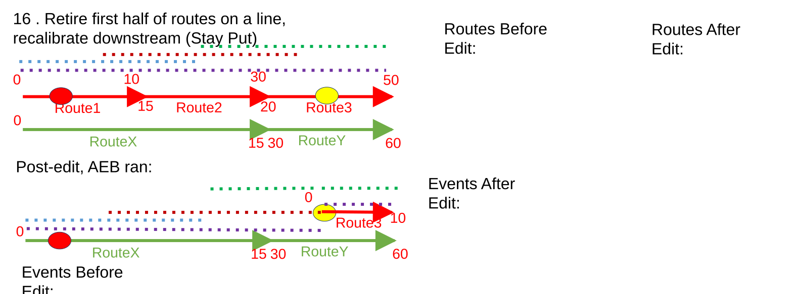

### TC-U36 — Retire first half of routes on a line, recalibrate downstream (Retire) <!-- src: S2 · slide 38 · case 17 -->

| Line ID | Route ID | From Date | ToDate |
| --- | --- | --- | --- |
| Line1 | Route1 | 1/1/2000 | NULL |
| Line1 | Route2 | 1/1/2000 | NULL |
| Line1 | Route3 | 1/1/2000 | NULL |
| Line2 | RouteX | 1/1/2000 | NULL |
| Line2 | RouteY | 1/1/2000 | NULL |

| Line ID | RouteID | From Date | ToDate |
| --- | --- | --- | --- |
| Line1 | Route1 | 1/1/2000 | 1/1/2005 |
| Line1 | Route2 | 1/1/2000 | 1/1/2005 |
| Line1 | Route3 | 1/1/2000 | 1/1/2005 |
| Line1 | Route3 | 1/1/2005 | NULL |
| Line2 | RouteX | 1/1/2000 | NULL |
| Line2 | RouteY | 1/1/2000 | NULL |

| Event Layer | Event ID | From RouteID | To RouteID | From Date | To Date | From Measure | To Measure |
| --- | --- | --- | --- | --- | --- | --- | --- |
| Point | Pt1 | Route1 | N/A | 1/1/2000 | NULL | 2 | N/A |
| Point | Pt2 | Route3 | N/A | 1/1/2000 | NULL | 40 | N/A |
| Line | Line1 | Route1 | Route3 | 1/1/2000 | NULL | 0 | 50 |
| Line | Line2 | Route1 | Route2 | 1/1/2000 | NULL | 0 | 17.5 |
| Line | Line3 | Route1 | Route3 | 1/1/2000 | NULL | 7 | 35 |
| Line | Line4 | Route2 | Route3 | 1/1/2000 | NULL | 17.5 | 50 |

| Event Layer | Event ID | From RouteID | To RouteID | From Date | To Date | From Measure | To Measure |
| --- | --- | --- | --- | --- | --- | --- | --- |
| Point | Pt1 | Route1 | N/A | 1/1/2000 | 1/1/2005 | 2 | N/A |
| Point | Pt2 | Route3 | N/A | 1/1/2000 | 1/1/2005 | 40 | N/A |
| Line | Line1 | Route1 | Route3 | 1/1/2000 | 1/1/2005 | 0 | 50 |
| Line | Line2 | Route1 | Route2 | 1/1/2000 | 1/1/2005 | 0 | 17.5 |
| Line | Line3 | Route1 | Route3 | 1/1/2000 | 1/1/2005 | 7 | 35 |
| Line | Line4 | Route2 | Route3 | 1/1/2000 | 1/1/2005 | 17.5 | 50 |
| Point | Pt1 | RouteX | N/A | 1/1/2005 | NULL | 2 | N/A |
| Line | Line1 | RouteX | RouteY | 1/1/2005 | NULL | 0 | 45 |
| Line | Line2 | RouteX | RouteX | 1/1/2005 | NULL | 0 | 12.5 |
| Line | Line3 | RouteX | RouteY | 1/1/2005 | NULL | 7 | 45 |
| Line | Line4 | RouteX | RouteY | 1/1/2005 | NULL | 12.5 | 45 |

[figure: Route1 · RouteX · Route2 · Route3 · 0 · 10 · 15 · 30 · 50 · 20 · 60 · RouteY · Post-edit, AEB ran: · Routes Before Edit: · Routes After Edit: · Events Before Edit: · Events After Edit:]

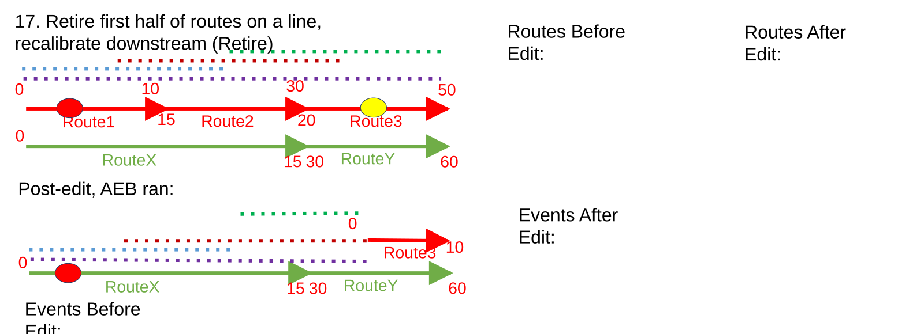

### TC-U37 — Retire all routes on line, concurrent route has multiple time slices <!-- src: S2 · slide 39 · case 18 -->

| Line ID | Route ID | From Date | ToDate |
| --- | --- | --- | --- |
| Line1 | Route1 | 1/1/2000 | NULL |
| Line1 | Route2 | 1/1/2000 | NULL |
| Line1 | Route3 | 1/1/2000 | NULL |
| Line2 | RouteX | 1/1/2000 | 1/1/2005 |
| Line2 | RouteY | 1/1/2000 | 1/1/2005 |
| Line2 | RouteX | 1/1/2005 | 1/1/2010 |
| Line2 | RouteY | 1/1/2005 | 1/1/2010 |
| Line2 | RouteX | 1/1/2010 | NULL |
| Line2 | RouteY | 1/1/2010 | NULL |

| Event Layer | Event ID | From RouteID | To RouteID | From Date | To Date | From Measure | To Measure |
| --- | --- | --- | --- | --- | --- | --- | --- |
| Point | Pt1 | Route1 | N/A | 1/1/2000 | NULL | 2 | N/A |
| Point | Pt2 | Route3 | N/A | 1/1/2000 | NULL | 40 | N/A |
| Line | Line1 | Route1 | Route3 | 1/1/2000 | NULL | 0 | 50 |
| Line | Line2 | Route1 | Route2 | 1/1/2000 | NULL | 0 | 17.5 |
| Line | Line3 | Route1 | Route3 | 1/1/2000 | NULL | 7 | 35 |
| Line | Line4 | Route2 | Route3 | 1/1/2000 | NULL | 17.5 | 50 |

| Line ID | Route ID | From Date | ToDate |
| --- | --- | --- | --- |
| Line1 | Route1 | 1/1/2000 | 1/1/2004 |
| Line1 | Route2 | 1/1/2000 | 1/1/2004 |
| Line1 | Route3 | 1/1/2000 | 1/1/2004 |
| Line2 | RouteX | 1/1/2000 | 1/1/2005 |
| Line2 | RouteY | 1/1/2000 | 1/1/2005 |
| Line2 | RouteX | 1/1/2005 | 1/1/2010 |
| Line2 | RouteY | 1/1/2005 | 1/1/2010 |
| Line2 | RouteX | 1/1/2010 | NULL |
| Line2 | RouteY | 1/1/2010 | NULL |

[figure: Route1 · RouteX · Route2 · Route3 · 0 · 10 · 15 · 30 · 50 · 20 · 60 · RouteY · Routes Before Edit: · Routes After Edit: · Events Before Edit:]

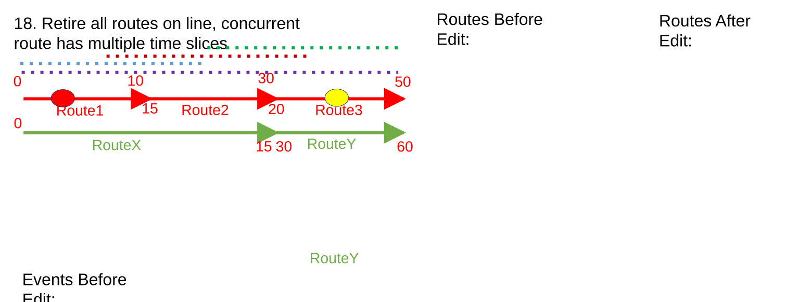

### TC-U38 — Retire All Routes on Line, Concurrent Route Has Multiple Time Slices (Continued) <!-- src: S1 · slide 40 · case 18 -->

| Event Layer | Event ID | From RouteID | To RouteID | From Date | To Date | From Measure | To Measure |
| --- | --- | --- | --- | --- | --- | --- | --- |
| Point | Pt1 | Route1 | N/A | 1/1/2000 | 1/1/2004 | 2 | N/A |
| Point | Pt2 | Route3 | N/A | 1/1/2000 | 1/1/2004 | 40 | N/A |
| Line | Line1 | Route1 | Route3 | 1/1/2000 | 1/1/2004 | 0 | 50 |
| Line | Line2 | Route1 | Route2 | 1/1/2000 | 1/1/2004 | 0 | 17.5 |
| Line | Line3 | Route1 | Route3 | 1/1/2000 | 1/1/2004 | 7 | 35 |
| Line | Line4 | Route2 | Route3 | 1/1/2000 | 1/1/2004 | 17.5 | 50 |
| Point | Pt1 | RouteX | N/A | 1/1/2004 | 1/1/2005 | 2 | N/A |
| Point | Pt2 | RouteY | N/A | 1/1/2004 | 1/1/2005 | 45 | N/A |
| Line | Line1 | RouteX | RouteY | 1/1/2004 | 1/1/2005 | 0 | 60 |
| Line | Line2 | RouteX | RouteX | 1/1/2004 | 1/1/2005 | 0 | 12.5 |
| Line | Line3 | RouteX | RouteY | 1/1/2004 | 1/1/2005 | 7 | 40 |
| Line | Line4 | RouteX | RouteY | 1/1/2004 | 1/1/2005 | 12.5 | 60 |
| Point | Pt1 | RouteX | N/A | 1/1/2005 | 1/1/2010 | 20 | N/A |
| Point | Pt2 | RouteY | N/A | 1/1/2005 | 1/1/2010 | 450 | N/A |
| Line | Line1 | RouteX | RouteY | 1/1/2005 | 1/1/2010 | 0 | 600 |
| Line | Line2 | RouteX | RouteX | 1/1/2005 | 1/1/2010 | 0 | 125 |
| Line | Line3 | RouteX | RouteY | 1/1/2005 | 1/1/2010 | 70 | 400 |
| Line | Line4 | RouteX | RouteY | 1/1/2005 | 1/1/2010 | 125 | 600 |
| Point | Pt1 | RouteX | N/A | 1/1/2010 | NULL | 70 | N/A |
| Point | Pt2 | RouteY | N/A | 1/1/2010 | NULL | 550 | N/A |
| Line | Line1 | RouteX | RouteY | 1/1/2010 | NULL | 50 | 700 |
| Line | Line2 | RouteX | RouteX | 1/1/2010 | NULL | 50 | 175 |
| Line | Line3 | RouteX | RouteY | 1/1/2010 | NULL | 120 | 500 |
| Line | Line4 | RouteX | RouteY | 1/1/2010 | NULL | 175 | 700 |

[figure: Events After Edit: · RouteX · 0 · 15 · 30 · 60 · (1/1/2005-1/1/2010): · 150 · 300 · 600 · 50 · 200 · 400 · 700]

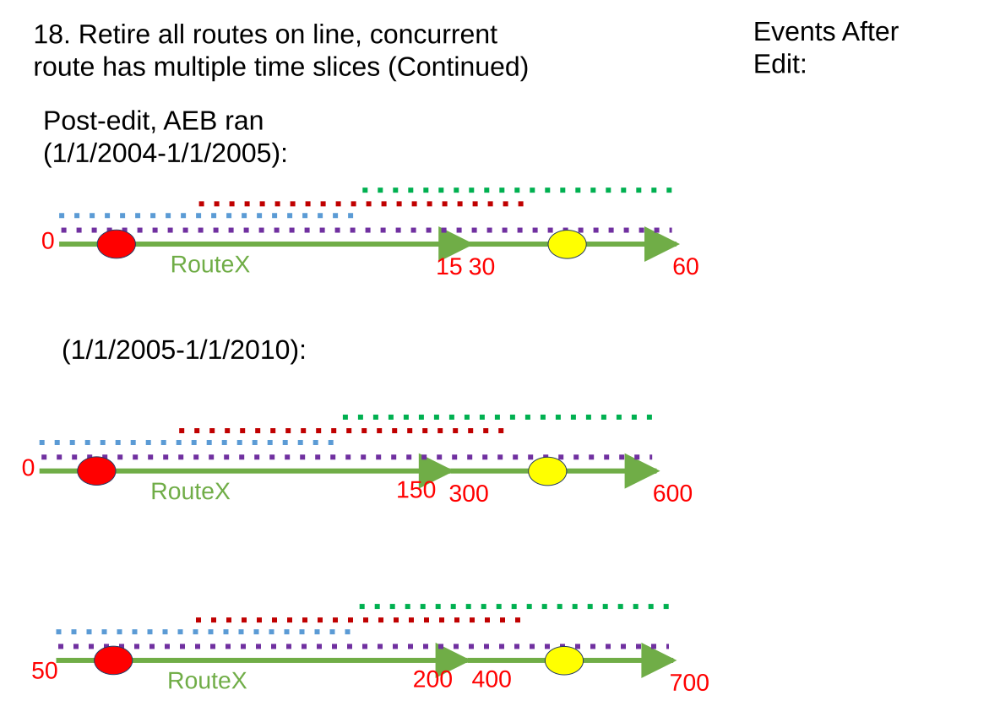

## Other content

### Slide 1 — Devtopia Issue <!-- slide 1 -->

Retire Routes: Snap Event Behavior

**Notes**
- Need to support Snap Event Behavior in Retire Routes, following ArcMap functionality
- This is one of the last functionalities left to bring forward to Pro from ArcMap
- Test with RH and APR datasets
- Test in FGDB and FS
- Test on projected and unprojected data
- Test with spanning/non-spanning line events and point events
- Test retiring whole, partial, middle sections, and multiple routes with events that have Snap EB configured
- Test with multiple concurrent routes to ensure route dominance rules are honored
- Test with recalibrate downstream enabled/disabled and ensure configured downstream EB executes as expected
- Ensure other areas where EBs are exposed properly show Snap for Retire
